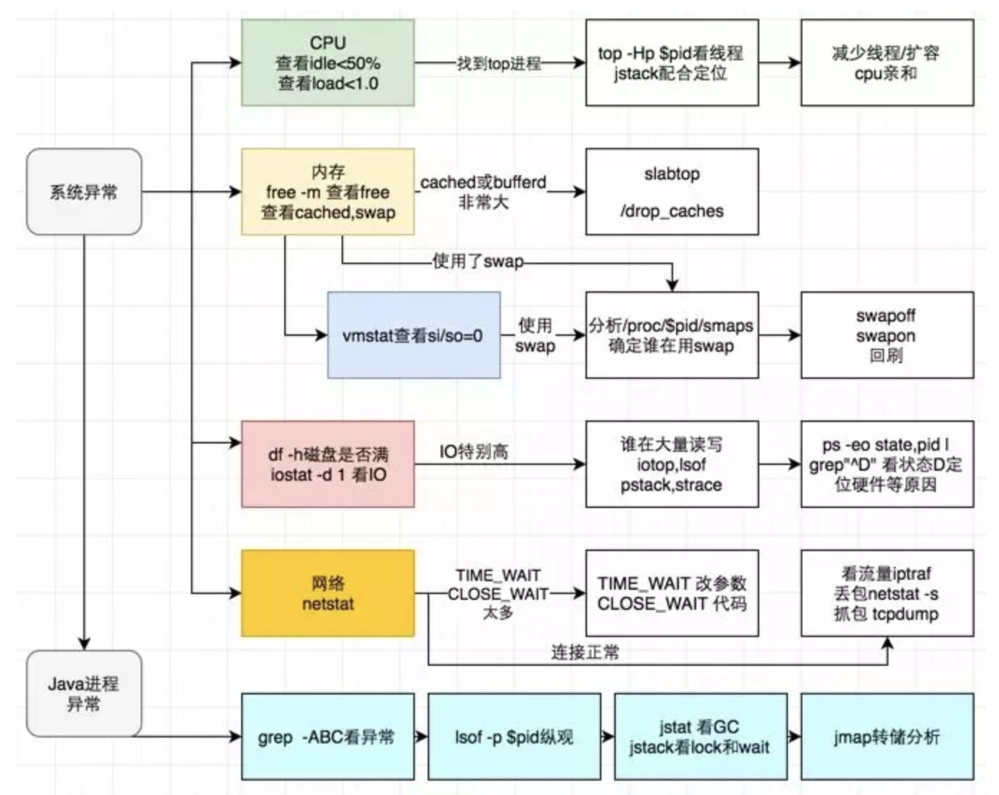

# Linux常用命令

来源：https://mp.weixin.qq.com/s/1XSbEmbIYTfn_UdyNecH6Q


## 1）概念

- **KISS** Keep it Simple and Stupid，据说是哲学

- **一切皆文件** 通常是文件的东西叫文件，进程、磁盘等也被抽象成了文件，比较离谱的管道、设备、socket等，也是文件。

  这是Linux最重要的组织方式。

- **管道** `|` 分隔，前面命令的输出作为后面命令的输入，可以串联多个

- **重定向**

- - `<` 将文件做为命令的输入
  - `>` 将命令的输出输出到文件
  - `>>` 将命令的输出追加到文件

- **SHELL** 首先确认你的shell，一般最常用的是bash，也有不少用csh，zsh等的，通过`echo $SHELL`可以看到当前用户的shell，对应的配置文件也要相应改变。

  比如`.zshrc`,`.bashrc`

#### CPU

- 使用`top`查看cpu的load，使用shift+p按照cpu排序。

  需要了解wa，us等都是什么意思

- 使用`uptime`查看系统启动时间和load，load是什么意思呢？

  什么算是系统过载？

  这是个高频问题，别怪我没告诉你

- `ps`命令勃大茎深，除了查进程号外，你还需要知道R、S、D、T、Z、<、N状态位的含义

- `top`和`ps`很多功能是相通的，比如`watch "ps -mo %cpu,%mem,pid,ppid,command ax"` 相当于top的进程列表；

  `top -n 1 -bc` 和`ps -ef`的结果相似。

- 有生就有死，可以用`kill`杀死进程。

  对java来说，需要关注`kill -9`、`kill -15`、`kill -3`的含义，kill的信号太多了，可以用`kill -l`查看，搞懂大多数信号大有裨益。

- 如果暂时不想死，可以通过`&`符号在后台执行，比如`tail -f a.log &`。

  `jobs`命令可以查看当前后台的列表，想恢复的话，使用`fg`回到幕前。

  这都是终端作业，当你把`term`关了你的后台命令也会跟着消失，所以想让你的程序继续执行的话，需要`nohup`命令，此命令需要牢记

- **mpstat** 显示了系统中 CPU 的各种统计信

- 了解cpu亲和性

#### 内存

- `free -m` 命令，了解free、used、cached、swap各项的含义

- `cat /proc/meminfo` 查看更详细的内存信息

  
  细心的同学可能注意到，CPU和内存的信息，通过top等不同的命令显示的数值是一样的。

- `slabtop` 用来显示内核缓存占用情况，比如遍历大量文件造成缓存目录项。

  曾在生产环境中遇到因执行`find /`造成`dentry_cache`耗尽服务器内存。

- `vmstat` 命令是我最喜欢也最常用的命令之一，可以以最快的速度了解系统的运行状况。

  每个参数的意义都要搞懂。

- **swapon、swapoff** 开启，关闭交换空间

- **sar** 又一统计类轮子，一般用作采样工具

#### 存储

- 使用`df -h`查看系统磁盘使用概况
- **lsblk** 列出块设备信息
- **du** 查看目录或者文件大小

#### 网络

- **rsync** 强大的同步工具，可以增量哦

- **netstat** 查看Linux中网络系统状态信息，各种

- **ss** 它能够显示更多更详细的有关TCP和连接状态的信息，而且比netstat更快速更高效。

- **curl、wget** 模拟请求工具、下载工具。

  如wget -r http://site 将下载整个站点

- **ab** Apache服务器的性能测试工具

- **ifstat** 统计网络接口流量状态

- **nslookup** 查询域名DNS信息的工具，在内网根据ip查询域名是爽爆了

- **nc** 网络工具中的瑞士军刀，不会用真是太可惜了

- **arp** 可以显示和修改IP到MAC转换表

- **traceroute** 显示数据包到主机间的路径，俗称几跳，跳的越少越快

- **tcpdump** 不多说了，去下载wireshark了

- **wall** 向当前所有打开的终端上输出信息。

  使用`who`命令发现女神正在终端上，可以求爱

  ### 如何组织起来

  linux的命令很有意思，除了各种stat来监控状态，也有各种trace来进行深入的跟踪，也有各种top来统计资源消耗者，也有各种ls来查看系统硬件如lsblk、lsusb、lscpi。基本上跟着你的感觉走，就能找到相应的工具，因为约定是系统中最强大的导向。

  Linux有个比较另类的目录`/proc`，承载了每个命令的蹂躏。像`sysctl`命令，就是修改的`/proc/sys`目录下的映射项。不信看看`find /proc/sys -type f | wc -l`和`sysctl -a| wc -l`的结果是不是很像？

  /proc文件系统是一个伪文件系统，它只存在内存当中，而不占用外存空间。只不过以文件系统的方式为访问系统内核数据的操作提供接口。系统的所有状态都逃不过它的火眼金睛。例如:

  - `cat /proc/vmstat` 看一下，是不是和`vmstat`命令的输出很像?
  - `cat /proc/meminfo` 是不是最全的内存信息
  - `cat /proc/slabinfo` 这不就是`slabtop`的信息么
  - `cat /proc/devices` 已经加载对设备们
  - `cat /proc/loadavg` load avg原来就躺在这里啊
  - `cat /proc/stat` 所有的CPU活动信息
  - `ls /proc/$pid/fd` 静静地躺着`lsof`的结果

  

## 2）常用命令技巧

### 怎么查看某个Java进程里面占用CPU最高的一个线程具体信息？

- 获取进程中占用CPU最高的线程，计为n。

- - 使用top `top -H -p pid`，肉眼观察之
  - 使用ps  `ps -mo spid,lwp,stime,time,%cpu -p pid`

- 将线程号转化成十六进制`printf 0x%x n`

- 使用jstack找到相应进程，打印线程后的100行信息 `jstack -l pid| grep spid -A 100`


### 统计每种网络状态的数量

`netstat -ant | awk '{print $6}' | sort | uniq -c | sort -n -k 1 -r`
首先使用netstat查看列表，使用’awk’截取第六列，使用`uniq`进行统计，并对统计结果排序。当然，也可以这样。
`netstat -ant | awk '{arr[$6]++}END{for(i in arr){print arr[i]" "i }}' | sort -n -k 1 -r`
这和“分析apache日志，给出当日访问ip的降序列表”是一样的问题。


### 怎么查看哪个进程在用swap

首先要了解/proc/$pid/smaps里有我们所需要的各种信息，其中Swap字段即是我们所需要的。只要循环遍历一下即可。

```shell
for i in `cd /proc;ls |grep "^[0-9]"|awk ' $0 >100'` ;do awk '/Swap:/{a=a+$2}END{print '"$i"',a/1024"M"}' /proc/$i/smaps ;done |sort -k2nr
```


### 查看端口占用：

```shell
netstat -tln | grep 8080 

#查看端口属于哪个应用
lsof -i :8080
```

## 3）系统操作命令

### ls查看当前目录下的文件

• -a 显示隐藏⽂件

• -r 逆序显示

• -t 按照时间顺序显示

• -R 递归显示

### 通配符号

• * 匹配任何字符串

• ？ 匹配1个字符串

• [xyz] 匹配xyz任意⼀个字符

• [a-z] 匹配⼀个范围

• [!xyz] 或 [ ^xyz] 不匹配

### 文本查看命令

• **cat** ⽂本内容显示到终端

• **head** 查看⽂件开头

• **tail** 查看⽂件结尾

​	• 常⽤参数 -f ⽂件内容更新后，显示信息同步更新

• **wc** 统计⽂件内容信息

