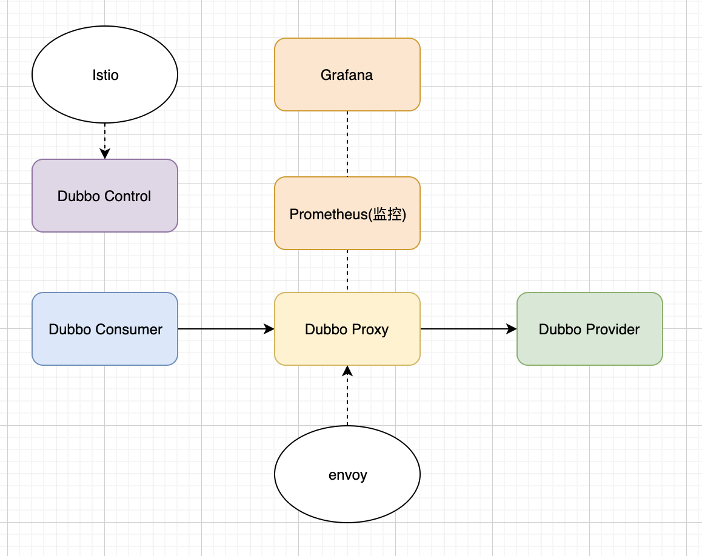

# Apache Dubbo

## 1）整体架构图


## 2）注册中心

对应包：dubbo-registry


注册节点数据：


1）providers：

包含接口的所有服务提供者的URL元数据信息

**/dubbo/me.bigbig.demo.server1/providers：**dubbo://ip:port/me.bigbig.demo.server1.User?key=value&

2）consumers：

包含接口的所有消费者URL元数据信息

**/dubbo/me.bigbig.demo.server1/consumers：**dubbo://ip:port/me.bigbig.demo.server1.User?key=value&

3）routers：

包含所有消费者路由策略URL元数据信息

**/dubbo/me.bigbig.demo.server1/routers：**condition://ip:port/me.bigbig.demo.server1.User?category=routers&key=value&

4）configurators：

包含多个服务者动态配置URL元数据信息

**/dubbo/me.bigbig.demo.server1/configurations：**condition://ip:port/me.bigbig.demo.server1.User?category=configurations&key=value&

注：目前已经实现的注册方式，ZooKeeper,Defualt,Redis,multicast,consul,Etcd,Nacos,Sofa等

### 整体流程：

1）服务提供者->启动->写入自己的元数据信息到注册中心；

2）消费者->启动->写入自己的元数据信息到注册中心；->订阅注册中心->服务提供者，路由和配置元数据信息；

3）所有服务启动或者离开，都会把变更动态发送到注册中心；

### 注册配置信息缓存：

默认内存中会缓存一份，本地配置文件中也会缓存一份。防止注册中心无法连接的时候使用本地配置，缓存的保存分同步和异步保存机制。

注：注册失败会异步重试注册，dubbo会把注册失败的请求方到5个集合中，分别去异步遍历和重试。

注册失败的URL集合，取消注册失败的URL集合，发起订阅失败的监听集合，取消订阅失败的监听集合，通知失败的URL集合。


注：注册中心的SPI点在**RegistryFactory**接口上。即通过protocol=redis即可以指定使用对应的注册中心

```java
@SPI("dubbo")
public interface RegistryFactory {

    /**
     * Connect to the registry
     * <p>
     * Connecting the registry needs to support the contract: 
     * 1. When the check=false is set, the connection is not checked, otherwise the exception is thrown when disconnection 未检查连接，否则在断开连接时引发异常
     * 2. Support username:password authority authentication on URL. 支持认证
     * 3. Support the backup=10.20.153.10 candidate registry cluster address. 支持备份
     * 4. Support file=registry.cache local disk file cache. 支持本地缓存
     * 5. Support the timeout=1000 request timeout setting. 设置超时
     * 6. Support session=60000 session timeout or expiration settings. 会话超时时间
     *
     * @param url Registry address, is not allowed to be empty
     * @return Registry reference, never return empty value
     */
    @Adaptive({"protocol"})
    Registry getRegistry(URL url);

}
```

```xml
<dubbo:registry ... client="zkclient" />
<dubbo:registry ... client="curator" />


<dubbo:registry protocol="zookeeper" address="10.20.153.10:2181" />


<dubbo:registry address="zookeeper://10.20.153.10:2181?backup=10.20.153.11:2181,10.20.153.12:2181" />
<dubbo:registry protocol="zookeeper" address="10.20.153.10:2181,10.20.153.11:2181,10.20.153.12:2181" />

<dubbo:registry id="chinaRegistry" protocol="zookeeper" address="10.20.153.10:2181" group="china" />
<dubbo:registry id="intlRegistry" protocol="zookeeper" address="10.20.153.10:2181" group="intl" />
```

## 3）Dubbo扩展机制：

> Java 原生SPI(Service Provider Interface) 是一种服务发现机制，原理：一个接口多种实现，具体的实现通过配置指定，如在META-INF/services目录下 以接口全路径为名称，内容为对应的实现类，通过`java.util.ServiceLoader`来加载类。

```java
//JAVA META-INF/services/接口全路径 value(实现类)
ServiceLoader<TestService> servicesLoader = ServiceLoader.load(TestService.class)
  
 
  //dubbo META-INF/dubbo/接口全路径 key=value
@SPI("apple")
public interface Robot {
    void sayHello();
}

public class DubboSPITest {
    
    @Test
    public void say() throws Exception {
       //dubbo加载器
        ExtensionLoader<Robot> extensionLoader = ExtensionLoader.getExtensionLoader(Robot.class);
        Robot defaultExtension = extensionLoader.getDefaultExtension();
        defaultExtension.sayHello();
        Robot pink = extensionLoader.getExtension("pink");
        pink.sayHello();
    }
}
```

http://dubbo.apache.org/zh-cn/docs/source_code_guide/dubbo-spi.html

注：不足点就是，会一次性加载所有的扩展点并实例化，资源和性能浪费。所以dubbo自己实现了一套SPI，

### 3.1）Dubbo扩展点特性：

> 定义加载规范，定义加载规则，自动缓存，自动编译成动态实现等。主要用到缓存，根据不同的扩展点特性缓存

1）自动包装：构造函数中含有依赖

如果再加载扩展的类的时候，包含其他扩展点作为构造函数的参数，则这个扩展点会被认为是Wrapper类（包装类），对应的需要的参数也会自动注入。即可以吧所有扩展点的公共逻辑移到该类，类似AOP,即Wrapper代理了扩展点。

```java
public class TestProtocolWrapper implement Protocol {
  Protocol impl;
  
  public TestProtocolWrapper(Protocol protocol){
    impl = protocol;
  }
  
  public void refer(){
    // 包装 TODO 
    impl.refer();
    // 包装 TODO 
  }
}
```

2）自动加载：方法中含有setter依赖

即如果扩展类，包含对应的依赖的成员属性，而对应的扩展类有对应的setXX的公共方法，则也会被自动注入和加载。

3）自适应：可通过方法中的参数动态配置 @Adaptive(适应的)

通过@Adaptive中的方法指定根据url的参数，确定适应哪个实现类。

```java
public interface Transporter {
    @Adaptive({"server", "transport"})
    Server bind(URL url, ChannelHandler handler) throws RemotingException;
 
    @Adaptive({"client", "transport"})
    Client connect(URL url, ChannelHandler handler) throws RemotingException;
}
```

4）自动激活：@Activate

通过对应的@Activate标记对应扩展点的默认激活并启用。

```java
// 方式1 
@Activate // 无条件自动激活
public class XxxFilter implements Filter {
    // ...
}

//方式2
@Activate("xxx") // 当配置了xxx参数，并且参数为有效值时激活，比如配了cache="lru"，自动激活CacheFilter。
public class XxxFilter implements Filter {
    // ...
}
//方式4
@Activate(group = "provider", value = "xxx") // 只对提供方激活，group可选"provider"或"consumer"
public class XxxFilter implements Filter {
    // ...
}
```

### 3.2）扩展点注解：

| 规范名称        | 规范说明                                                     |
| --------------- | ------------------------------------------------------------ |
| SPI配置文件路径 | META-INF/services,META-INF/dubbo,META-INF/dubbp/internal     |
| SPI配置文件名称 | 全路径类名称：me.bigbig.test.SpiTestInterface                |
| 文件内容格式    | key=value方式，多个用换行符号分隔，如：SpiTest1=me.bigbig.test.SpiTest1 |


注：该图展示了dubbo根据注解使用不同的加载器加载对应的文件，文件加载后，根据不同的注解，使用对应的编译器编译成对应的动态类。从而实现扩展点的编译过程。

#### @SPI 扩展点：

##### java原生的SPI

 Java 提供的 SPI（service provider interface）机制，SPI 是 JDK 内置的一种服务提供发现机制。目前市面上有很多框架都是用它来做服务的扩展发现。简单来说，它是一种动态替换发现的机制。我们想在运行时动态给它添加实现，你只需要添加一个实现，然后把新的实现描述给 JDK 知道就行了。大家耳熟能详的如 JDBC、日志框架都有用到。


1. JDK 标准的 SPI 会一次性加载实例化扩展点的所有实现，什么意思呢？就是如果你在 META-INF/service 下的文件里面加了 N个实现类，那么 JDK 启动的时候都会一次性全部加载。那么如果有的扩展点实现初始化很耗时或者如果有些实现类并没有用到，那么会很浪费资源

2. 如果扩展点加载失败，会导致调用方报错，而且这个错误很难定位到是这个原因

##### Dubbo SPI

1. 需要在 resource 目录下配置 META-INF/dubbo 或者 META-INF/dubbo/internal 或者 META-INF/services，并基于 SPI 接口去创建一个文件

2. 文件名称和接口名称保持一致，文件内容和 SPI 有差异，内容是 KEY 对应 ValueDubbo 针对的扩展点非常多，可以针对协议、拦截、集群、路

3. 在调用处执行如下代码Protocolprotocol=ExtensionLoader.getExtensionLoader(Protocol.class).getExtension("myProtocol"); 

   System.out.print(protocol.getDefaultPort) 

   输出结果，可以看到运行结果，是执行的自定义的协议扩展点。

注解在类，接口或枚举上，一般注解在接口上。**表明这个接口是一个扩展点**。其中@SP("xxx") xxx表示这个接口的默认实现。

```java
@SPI("netty")
public interface Transpoter {...}
```

#### @Adaptive 自适应扩展点：

什么叫自适应扩展点呢？我们先演示一个例子，在下面这个例子中，我们传入一个 Compiler 接口，它会返回一个AdaptiveCompiler。这个就叫自适应。

Compiler compiler=ExtensionLoader.getExtensionLoader(Compiler.class).getAdaptiveExtension();

System.out.println(compiler.getClass());

它是怎么实现的呢？ 我们根据返回的 AdaptiveCompiler 这个类，看到这个类上面有一个注解@Adaptive。 这个就是一个自适应

扩展点的标识。它可以修饰在类上，也可以修饰在方法上面。这两者有什么区别呢？

简单来说，放在类上，说明当前类是一个确定的自适应扩展点的类。如果是放在方法级别，那么需要生成一个动态字节码，来进行转发。

注解在类，接口，枚举，或者方法上，一般用在方法上，动态编译的代码会根据URL传入值依次匹配url中的key,如果没有则默认，默认也没有则报错，如果匹配多个也报错。

有些拓展并不想在框架启动阶段被加载，而是希望在拓展方法被调用时，根据运行时参数进行加载。

```java
public @interface Adaptive {
  String[] value default {}; //数组 ，可以设置多个key,会按照顺序依次匹配
}
```

http://dubbo.apache.org/zh-cn/docs/source_code_guide/adaptive-extension.html

#### @Activate 自动激活扩展点：

自动激活扩展点，有点类似我们讲 springboot 的时候用到的 conditional，根据条件进行自动激活。但是这里设计的初衷是，对于一个类会加载多个扩展点的实现，这个时候可以通过自动激活扩展点进行动态加载， 从而简化配置我们的配置工作。

@Activate 提供了一些配置来允许我们配置加载条件，比如 group 过滤，比如 key 过滤。

可以标记在类，接口，枚举类和方法上，主要使用存在多个扩展点实行，需要根据不同条件自动激活的场景

| 参数名称          | 效果                                 |
| ----------------- | ------------------------------------ |
| String[] group()  | 匹配URL中的分组选项，可以配置多个    |
| String[] value()  | 匹配URL中的含有该key的值，则激活     |
| String[] before() | 指定在该扩展点之前，需要有的扩展列表 |
| String[] after()  |                                      |
| int order()       | 排序信息，1，2，3, defualt           |

注：可以通过-defualt 限制所有的都不激活 -xxx,表示xxx的扩展点不会被激活。

### 3.3）Dubbo可扩展点：

#### 协议扩展Protocol：

RPC 协议扩展，封装远程调用细节

已经有的协议：**dubbo**,**grpc**,hessian,http,injvm,jsongrpc,memcached,**redis**,rest,rmi,thrift,webservice,xml

META-INF/dubbo/org.apache.dubbo.rpc.Protocol

#### injvm协议：

本地调用使用了 injvm 协议，是一个伪协议，它不开启端口，不发起远程调用，只在 JVM 内直接关联，但执行 Dubbo 的 Filter 链。

注意：dubbo从 `2.2.0` 每个服务默认都会在本地暴露,无需进行任何配置即可进行本地引用,如果不希望服务进行远程暴露,只需要在provider将protocol设置成injvm即可

每个服务默认都会在本地暴露。在引用服务的时候，默认优先引用本地服务。如果希望引用远程服务可以使用一下配置强制引用远程服务。

```xml
<dubbo:reference ... scope="remote" />
```


#### 拦截器Filter：

服务提供方和服务消费方调用过程拦截，Dubbo 本身的大多功能均基于此扩展点实现，每次远程方法执行，该拦截都会被执行，请注意对性能的影响

META-INF/dubbo/org.apache.dubbo.rpc.Filter

#### 引用监听扩展InvokerListener：

当有服务引用时，触发该事件

```xml
<!-- 引用服务监听 -->
<dubbo:reference listener="xxx,yyy" /> 
<!-- 引用服务缺省监听器 -->
<dubbo:consumer listener="xxx,yyy" /> 
```

META-INF/dubbo/org.apache.dubbo.rpc.InvokerListener


#### 暴露监听扩展ExporterListener:

当有服务暴露时，触发该事件。

```xml
<!-- 暴露服务监听 -->
<dubbo:service listener="xxx,yyy" />
<!-- 暴露服务缺省监听器 -->
<dubbo:provider listener="xxx,yyy" />
```

META-INF/dubbo/org.apache.dubbo.rpc.ExporterListener


#### 集群扩展Cluster：

当有多个服务提供方时，将多个服务提供方组织成一个集群，并伪装成一个提供方。

- `org.apache.dubbo.rpc.cluster.support.FailoverCluster`
- `org.apache.dubbo.rpc.cluster.support.FailfastCluster`
- `org.apache.dubbo.rpc.cluster.support.FailsafeCluster`
- `org.apache.dubbo.rpc.cluster.support.FailbackCluster`
- `org.apache.dubbo.rpc.cluster.support.ForkingCluster`
- `org.apache.dubbo.rpc.cluster.support.AvailableCluster`

参看集群模块

META-INF/dubbo/org.apache.dubbo.rpc.cluster.Cluster

#### 路由扩展Router:

从多个服务提供方中选择一个进行调用

RouterFactory,Router

META-INF/dubbo/org.apache.dubbo.rpc.cluster.RouterFactory


#### 负载均衡LoadBalance：

从多个服务提者方中选择一个进行调用

META-INF/dubbo/org.apache.dubbo.rpc.cluster.LoadBalance


#### 合并结果扩展Merger：

合并返回结果，用于分组聚合。

- `org.apache.dubbo.rpc.cluster.merger.ArrayMerger`
- `org.apache.dubbo.rpc.cluster.merger.ListMerger`
- `org.apache.dubbo.rpc.cluster.merger.SetMerger`
- `org.apache.dubbo.rpc.cluster.merger.MapMerger`

META-INF/dubbo/org.apache.dubbo.rpc.cluster.Merger

#### 注册中心扩展Registry：

负责服务的注册与发现

META-INF/dubbo/org.apache.dubbo.registry.RegistryFactory

#### 监控中心扩展Monitor：

负责服务调用次和调用时间的监控

META-INF/dubbo/org.apache.dubbo.monitor.MonitorFactory

#### 扩展点加载扩展ExtensionFactory：

扩展点本身的加载容器，可从不同容器加载扩展点

META-INF/dubbo/org.apache.dubbo.common.extension.ExtensionFactory


#### 动态代理扩展Proxy：

将 `Invoker` 接口转换成业务接口。

```xml
<dubbo:protocol proxy="xxx" />
<!-- 缺省值配置，当<dubbo:protocol>没有配置proxy属性时，使用此配置 -->
<dubbo:provider proxy="xxx" />
```

META-INF/dubbo/org.apache.dubbo.rpc.ProxyFactory

#### 编译器扩展Compiler：

Java 代码编译器，用于动态生成字节码，加速调用

META-INF/dubbo/org.apache.dubbo.common.compiler.Compiler

#### 消息派发扩展Dispatcher：

通道信息派发器，用于指定线程池模型。

```xml
<dubbo:protocol dispatcher="xxx" />
<!-- 缺省值设置，当<dubbo:protocol>没有配置dispatcher属性时，使用此配置 -->
<dubbo:provider dispatcher="xxx" />
```

META-INF/dubbo/org.apache.dubbo.remoting.Dispatcher

#### 线程池扩展ThreadPool：

服务提供方线程池实现策略，当服务器收到一个请求时，需要在线程池中创建一个线程去执行服务提供方业务逻辑。

```xml
<dubbo:protocol threadpool="xxx" />
<!-- 缺省值设置，当<dubbo:protocol>没有配置threadpool时，使用此配置 -->
<dubbo:provider threadpool="xxx" />
```

- `org.apache.dubbo.common.threadpool.FixedThreadPool`
- `org.apache.dubbo.common.threadpool.CachedThreadPool`

META-INF/dubbo/org.apache.dubbo.common.threadpool.ThreadPool

#### 序列化扩展Serialization：

将对象转成字节流，用于网络传输，以及将字节流转为对象，用于在收到字节流数据后还原成对象

```xml
<!-- 协议的序列化方式 -->
<dubbo:protocol serialization="xxx" />
<!-- 缺省值设置，当<dubbo:protocol>没有配置serialization时，使用此配置 -->
<dubbo:provider serialization="xxx" />
```

- `org.apache.dubbo.common.serialize.dubbo.DubboSerialization`
- `org.apache.dubbo.common.serialize.hessian.Hessian2Serialization`
- `org.apache.dubbo.common.serialize.java.JavaSerialization`
- `org.apache.dubbo.common.serialize.java.CompactedJavaSerialization`

META-INF/dubbo/org.apache.dubbo.common.serialize.Serialization

#### 网络传输扩展transporter：

远程通讯的服务器及客户端传输实现。

```xml
<!-- 服务器和客户端使用相同的传输实现 -->
<dubbo:protocol transporter="xxx" /> 
<!-- 服务器和客户端使用不同的传输实现 -->
<dubbo:protocol server="xxx" client="xxx" /> 
<!-- 缺省值设置，当<dubbo:protocol>没有配置transporter/server/client属性时，使用此配置 -->
<dubbo:provider transporter="xxx" server="xxx" client="xxx" />
```

META-INF/dubbo/org.apache.dubbo.remoting.Transporter


#### 信息交换扩展Exchanger：

基于传输层之上，实现 Request-Response 信息交换语义。

```xml
<dubbo:protocol exchanger="xxx" />
<!-- 缺省值设置，当<dubbo:protocol>没有配置exchanger属性时，使用此配置 -->
<dubbo:provider exchanger="xxx" />
```

META-INF/dubbo/org.apache.dubbo.remoting.exchange.Exchanger

#### 组网扩展networker：

对等网络节点组网器。

```xml
<dubbo:protocol networker="xxx" />
<!-- 缺省值设置，当<dubbo:protocol>没有配置networker属性时，使用此配置 -->
<dubbo:provider networker="xxx" /> 
```

META-INF/dubbo/org.apache.dubbo.remoting.p2p.Networker

#### Telnet命令扩展：

所有服务器均支持 telnet 访问，用于人工干预。

```xml
<dubbo:protocol telnet="xxx,yyy" />
<!-- 缺省值设置，当<dubbo:protocol>没有配置telnet属性时，使用此配置 -->
<dubbo:provider telnet="xxx,yyy" />
```

- `org.apache.dubbo.remoting.telnet.support.ClearTelnetHandler`
- `org.apache.dubbo.remoting.telnet.support.ExitTelnetHandler`
- `org.apache.dubbo.remoting.telnet.support.HelpTelnetHandler`
- `org.apache.dubbo.remoting.telnet.support.StatusTelnetHandler`
- `org.apache.dubbo.rpc.dubbo.telnet.ListTelnetHandler`
- `org.apache.dubbo.rpc.dubbo.telnet.ChangeTelnetHandler`
- `org.apache.dubbo.rpc.dubbo.telnet.CurrentTelnetHandler`
- `org.apache.dubbo.rpc.dubbo.telnet.InvokeTelnetHandler`
- `org.apache.dubbo.rpc.dubbo.telnet.TraceTelnetHandler`
- `org.apache.dubbo.rpc.dubbo.telnet.CountTelnetHandler`
- `org.apache.dubbo.rpc.dubbo.telnet.PortTelnetHandler`

```java
package com.xxx;
 
import org.apache.dubbo.remoting.telnet.TelnetHandler;
 
@Help(parameter="...", summary="...", detail="...")
 
public class XxxTelnetHandler implements TelnetHandler {
    public String telnet(Channel channel, String message) throws RemotingException {
        // ...
    }
}
```

META-INF/dubbo/org.apache.dubbo.remoting.telnet.TelnetHandler

telnet 127.0.0.1 20880 dubbo> xxx args

#### 状态检测扩展status：

检查服务依赖各种资源的状态，此状态检查可同时用于 telnet 的 status 命令和 hosting 的 status 页面

```xml
<dubbo:protocol status="xxx,yyy" />
<!-- 缺省值设置，当<dubbo:protocol>没有配置status属性时，使用此配置 -->
<dubbo:provider status="xxx,yyy" />
```

- `org.apache.dubbo.common.status.support.MemoryStatusChecker`
- `org.apache.dubbo.common.status.support.LoadStatusChecker`
- `org.apache.dubbo.rpc.dubbo.status.ServerStatusChecker`
- `org.apache.dubbo.rpc.dubbo.status.ThreadPoolStatusChecker`
- `org.apache.dubbo.registry.directory.RegistryStatusChecker`
- `org.apache.dubbo.rpc.config.spring.status.SpringStatusChecker`
- `org.apache.dubbo.rpc.config.spring.status.DataSourceStatusChecker`

META-INF/dubbo/org.apache.dubbo.common.status.StatusChecker

#### 容器扩展container：

服务容器扩展，用于自定义加载内容。

- `org.apache.dubbo.container.spring.SpringContainer`
- `org.apache.dubbo.container.spring.JettyContainer`
- `org.apache.dubbo.container.spring.Log4jContainer`

META-INF/dubbo/org.apache.dubbo.container.Container

#### 对等网络节点page：

对等网络节点组网器。

```xml
<dubbo:protocol page="xxx,yyy" />
<!-- 缺省值设置，当<dubbo:protocol>没有配置page属性时，使用此配置 -->
<dubbo:provider page="xxx,yyy" />
```

META-INF/dubbo/org.apache.dubbo.container.page.PageHandler

#### 缓存扩展CacheFactory：

用请求参数作为 key，缓存返回结果。

```xml
<dubbo:service cache="lru" />
<!-- 方法级缓存 -->
<dubbo:service><dubbo:method cache="lru" /></dubbo:service> 
<!-- 缺省值设置，当<dubbo:service>没有配置cache属性时，使用此配置 -->
<dubbo:provider cache="xxx,yyy" /> 
```

- `org.apache.dubbo.cache.support.lru.LruCacheFactory`
- `org.apache.dubbo.cache.support.threadlocal.ThreadLocalCacheFactory`
- `org.apache.dubbo.cache.support.jcache.JCacheFactory`

- `lru` 基于最近最少使用原则删除多余缓存，保持最热的数据被缓存。
- `threadlocal` 当前线程缓存，比如一个页面渲染，用到很多 portal，每个 portal 都要去查用户信息，通过线程缓存，可以减少这种多余访问。
- `jcache` 与 [JSR107](http://jcp.org/en/jsr/detail?id=107') 集成，可以桥接各种缓存实现。

META-INF/dubbo/org.apache.dubbo.cache.CacheFactory

#### 参数验证扩展Validation：

参数验证扩展点

```xml
<dubbo:service validation="xxx,yyy" />
<!-- 缺省值设置，当<dubbo:service>没有配置validation属性时，使用此配置 -->
<dubbo:provider validation="xxx,yyy" />
```

org.apache.dubbo.validation.support.jvalidation.JValidation

META-INF/dubbo/org.apache.dubbo.validation.Validation

#### 日志适配器扩展：

日志输出适配扩展点。

<dubbo:application logger="xxx" />

-Ddubbo:application.logger=xxx

- `org.apache.dubbo.common.logger.slf4j.Slf4jLoggerAdapter`
- `org.apache.dubbo.common.logger.jcl.JclLoggerAdapter`
- `org.apache.dubbo.common.logger.log4j.Log4jLoggerAdapter`
- `org.apache.dubbo.common.logger.log4j2.Log4j2LoggerAdapter`
- `org.apache.dubbo.common.logger.jdk.JdkLoggerAdapter`

META-INF/dubbo/org.apache.dubbo.common.logger.LoggerAdapter


## 4）Dubbo配置：

配置优先级别：

1）-D 参数  -Ddubbo.protocol.port=20880

2）代码或者XML配置 <dubbo:protocol port="20880" />

3）配置文件，dubbo.properties


### 4.1）服务暴露原理：

ServiceConfig --> ProxyFactory --> Invoker --> Protocol --> Exporter

1）支持多配置中心。

2）支持多协议。

3）支持本地服务暴露（injvm）。


### 4.2）服务消费原理：

Reference --> Protocol --> Invoker --> ProxyFactory --> Ref

1）判断是否本地有对应的服务-->直接本地调用

2）使用injvm协议从内存中获取实例-->从内存中获取。

3）向注册中心追加消费者元数据信息。

4）处理只有一个注册中心的场景。

5）逐个获取注册中心的服务，并添加到invokers列表。

6）通过Cluster将多个注册中心的服务添加打破invokers列表。

7）把invoker转换成接口代理。


### 4.3）优雅停机流程：


### 4.4）配置中心：

Dubbo配置中心实现了对Zookeeper、Nacos、Etcd、Consul、Apollo的对接

```xml
<dubbo:config-center address="zookeeper://127.0.0.1:2181"/>
<dubbo:config-center protocol="apollo" address="127.0.0.1:2181"/>
```

```ini
dubbo.config-center.address=zookeeper://127.0.0.1:2181
```

```java
ConfigCenterConfig configCenter = new ConfigCenterConfig();
configCenter.setAddress("zookeeper://127.0.0.1:2181");
```

Apollo中的一个核心概念是命名空间 - namespace（和上面zookeeper的namespace概念不同），在这里全局和应用级别配置就是通过命名空间来区分的。

默认情况下，Dubbo会从名叫`dubbo`（由于 Apollo 不支持特殊后缀 `.properties` ）的命名空间中读取全局配置

<dubbo:config-center namespace="your namespace">

#### 外部自己加载配置：

```java
// 应用自行加载配置
Map<String, String> dubboConfigurations = new HashMap<>();
dubboConfigurations.put("dubbo.registry.address", "zookeeper://127.0.0.1:2181");
dubboConfigurations.put("dubbo.registry.simplified", "true");

//将组织好的配置塞给Dubbo框架
ConfigCenterConfig configCenter = new ConfigCenterConfig();
configCenter.setExternalConfig(dubboConfigurations);
```

从2.7.3版本开始，Dubbo会自动从约定key中读取配置，并将配置以Key-Value的形式写入到URL中

1）`dubbo.labels`，指定一些列配置到URL中的键值对，通常通过JVM -D或系统环境变量指定

```ini
# JVM
-Ddubbo.labels = "tag1=value1; tag2=value2"

# 环境变量
DUBBO_LABELS = "tag1=value1; tag2=value2"
```

2）`dubbo.env.keys`，指定环境变量key值，Dubbo会尝试从环境变量加载每个 key

```ini
# JVM
-Ddubbo.env.keys = "DUBBO_TAG1, DUBBO_TAG2"

# 环境变量
DUBBO_ENV_KEYS = "DUBBO_TAG1, DUBBO_TAG2"
```

### 4.5）配置API：

org.apache.dubbo.config.ServiceConfig 

http://dubbo.apache.org/zh-cn/docs/user/references/xml/dubbo-service.html

org.apache.dubbo.config.ReferenceConfig 

http://dubbo.apache.org/zh-cn/docs/user/references/xml/dubbo-reference.html

org.apache.dubbo.config.ProtocolConfig 

org.apache.dubbo.config.RegistryConfig 

org.apache.dubbo.config.MonitorConfig 

org.apache.dubbo.config.ApplicationConfig 

org.apache.dubbo.config.ModuleConfig 

org.apache.dubbo.config.ProviderConfig

 org.apache.dubbo.config.ConsumerConfig 

org.apache.dubbo.config.MethodConfig 

org.apache.dubbo.config.ArgumentConfig

**注解API：**

org.apache.dubbo.config.annotation.Service 

org.apache.dubbo.config.annotation.Reference

### 4.6）动态配置：

动态配置是 Dubbo2.7 版本引入的一个新的功能，简单来说，就是把 dubbo.properties中的属性进行集中式存储，存储在其他的服务器上，支持 apollo、nacos、zookeeper

使用 zookeeper 实现了配置中心，这个配置中心只是维护了服务注册和服务感知的功能。在 2.7 版本中，dubbo 对配置中心做了延展，出了服务注册之外，还可以把其他的数据存储在 zookeeper 上，从而更好的进行维护

dubbo.config-center.address=zookeeper://192.168.13.106:2181
dubbo.config-center.app-name=spring-boot-provider //尽量和application.name一致
需要注意的是，存在于配置中心上的配置项，本地仍然需要配置一份。所以下面这些
配置一定要加上。否则启动不了。这样做的目的是保证可靠性
dubbo.application.name=springboot-dubbo
dubbo.protocol.port=20880
dubbo.protocol.name=dubbo
dubbo.registry.address=zookeeper://192.168.13.102:2181?backup=192.168.13.
103:2181,192.168.13.104:2181

注：config-center只是告诉可以放的配置地址和目录，然后本地的配置还是也保留一份。

#### **配置的优先级**

引入配置中心后，配置的优先级就需要关注了，默认情况下，外部配置的优先级最高，

也就是意味着配置中心上的配置会覆盖本地的配置。当然我们也可以调整优先级

**dubbo.config-center.highest-priority**=**false**

### 4.7）元数据中心：

在 Dubbo2.7 之前，所有的配置信息，比如服务接口名称、重试次数、版本号、负载策略、容错策略等等，所有参数都是基于 url 形式配置在 zookeeper 上的。这种方式会造成一些问题

1. url 内容过多，导致数据存储空间增大

 2.url 需要涉及到网络传输，数据量过大会造成网络传输过慢

3. 网络传输慢，会造成服务地址感知的延迟变大，影响服务的正常响应

在 Dubbo2.7 中对元数据进行了改造，简单来说，就是把属于服务治理的数据发布到注册中心，其他的配置数据统一发布到元数据中心。这样一来大大降低了注册中心的负载。

元数据中心目前支持 **redis 和 zookeeper。官方推荐是采用 redis**。毕竟 redis 本身对于非结构化存储的数据读写性能比较高。当然，也可以使用 zookeeper 来实现。

**dubbo.metadata-report.address**=**zookeeper://192.168.13.106:2181**

**dubbo.registry.simplified**=**true** //注册到注册中心的 URL 是否采用精简模式的（与低版本兼容）

### 4.8）调优配置：

| 参数名称    | 作用范围            | 说明                                                      |
| ----------- | ------------------- | --------------------------------------------------------- |
| hreads      | provider（200）     | 业务处理线程池大小                                        |
| Iothreads   | provider(cpu个数+1) | io线程池大小                                              |
| queues      | provider（0）       | 线程池队列大小，满的时候，排队等待执行的队列大小，建议为0 |
| connections | cosumer(0)          | 对每个提供者的最大连接数，dubbo协议默认共享一个长连接     |
| actives     | consumer(0)         | 每个服务消费者每服务每方法最大并发调用次数 0 不限制       |
| accepts     | provider(0)         | 服务提供方最大可接受的连接数 0不限制                      |
| executes    | provider(0)         | 服务提供者每服务每方法最大可并行执行的请求数 0不限制      |


## 服务发布：

#### DubboNamespaceHandler：

NamespaceHandler: 注册一堆 BeanDefinitionParser，利用他们来进行解析BeanDefinitionParser:用于解析每个 element 的内容Spring 默认会加载 jar 包下的 META-INF/spring.handlers 文件寻找对应的 NamespaceHandler。 Dubbo-config 模块下的 dubboconfig-spring 

bean的扩展

```java
registerBeanDefinitionParser("service", new DubboBeanDefinitionParser(ServiceBean.class, true));
registerBeanDefinitionParser("reference", new DubboBeanDefinitionParser(ReferenceBean.class, false));
```

### ServiceBean：

#### ServiceBean实现过程

由DubboBeanDefinitionParser 解析；

**1）InitializingBean**

接口为 bean 提供了初始化方法的方式，它只包括 afterPropertiesSet 方法，凡是继承该接口的类，在初始化 bean 的时候会执行该方法。被重写的方法为 afterPropertiesSet

**DisposableBean**

被重写的方法为 destroy,bean 被销毁的时候，spring 容器会自动执行 destory 方法，比如释放资源

**ApplicationContextAware**

实现了这个接口的 bean，当 spring 容器初始化的时候，会自动的将 ApplicationContext 注入进来

**BeanNameAware**

获得自身初始化时，本身的 bean 的 id 属性，被重写的方法为 setBeanName

**5）ApplicationEventPublisherAware**

这个是一个异步事件发送器。被重写的方法为 setApplicationEventPublisher,简单来说，在 spring 里面提供了类似于消息队列的异步事件解耦功能。（典型的观察者模式的应用）

#### 服务暴露过程：

ReferenceAnnotationBeanPostProcessor

**1) afterPropertiesSet**

就是把 dubbo 中配置的 application、registry、service、protocol 等信息，加载到对应的 config实体中，便于后续的使用

**2) onApplicationEvent**

spring 容器启动之后，会收到一个这样的事件通知，这里面做了两个事情

• 判断服务是否已经发布过

• 如果没有发布，则调用调用 export 进行服务发布的流程（**这里就是入口**）


### invoker：

 Invoke 本质上应该是一个代理，经过层层包装最终进行了发布。当消费者发起请求的时候，会获得这个invoker 进行调用。最终发布出去的 invoker, 也不是单纯的一个代理，也是经过多层包装InvokerDelegate(DelegateProviderMetaDataInvoker(AbstractProxyInvoker()))


## 服务消费：

1. 生成远程服务的代理
   2. 获得目标服务的url地址 3. 现远程网络通信
       \4. 实现负载均衡
       \5. 实现集群容错

## 5）Dubbo协议：


| 偏移比特位   | 字段描述     | 作用                                                         |
| ------------ | ------------ | ------------------------------------------------------------ |
| 0-7（8）     | 魔法高位     | 0xda00                                                       |
| 8-15（8）    | 魔法低位     | 0xbb                                                         |
| 16           | 数据包类型   | 是否为双向RPC调用 0 response 1 request                       |
| 17           | 调用方式     | 仅在16位位1的时候有效：0单向 1双向调用 <br>优雅停机时候发送readonly为 单向调用 |
| 18           | 事件标识     | 0：标识是数据包 1：标识是心跳包                              |
| 19-23（5）   | 序列化器编号 | 2：Hessian 3:java 4....                                      |
| 24-31（8）   | 状态         | 20：OK,30：CLIENT_TIMEOUT,31:SERVER_TIMEOUT 40：BAD_REQUEST  |
| 32-95 （64） | 请求编号     | 8字节（64）                                                  |
| 96-127（32） | 消息体长度   | 4字节，告诉整个消息体多大                                    |

注：请求体默认最大8M。

### ChannelHandler：

handler用于处理编解码，心跳事件和方法调用

| Handler                | 作用                                 |
| ---------------------- | ------------------------------------ |
| ExchangeHandlerAdapter | 用于查找服务方法并调用               |
| HeaderExchangeHandler  | 封装处理Request/Response和Telnet能力 |
| DecodeHandler          | 支持Dubbo线程池中编码                |
| AllChannelHandler      | 支持Dubbo线程池调用业务方法          |
| HeartbeatHandler       | 支持心跳处理                         |

## 6）Dubbo Cluster集群：

1）生成对应的Invoker对象，根据不同的Cluster生成。

2）获取可以调用的服务列表，根据Directory --> Router。

3）负载均衡，根据LoadBalance。

4）做RPC调用，Invoker

### 6.1）容错机制：

```xml
<dubbo:service cluster="failsafe" />
<dubbo:reference cluster="failsafe" />
```


#### Failover：

当出现失败时，会重试其他服务器，通过retries=2设置重试次数，**默认机制**。

场景：**读操作，或者幂等写操作上**。风险，调用延迟，下游服务压力大。

#### Failfast：

快速失败，当请求失败后，快速返回异常结果，不做任何重试，

场景：**非幂等写**操作。风险：容易受网络抖动影响。

#### Failsafe：

请求失败后，直接忽略异常。

场景：不关心调用是否成功，且不想抛异常影响外层调用，如不重要的日志同步

#### Failback：

请求失败后，会自动记录在失败的队列中，并由一个定时线程池定时重试,如果还是失败，则异常会被捕获

场景：适用一些异步或最终一致性的请求

#### Forking：

同时请求多个相同的服务，只要其中一个返回，立即返回结果，通过forks="最大并行调用数"

场景：读性能要求非常高的服务，风险：资源和服务压力大。

#### Boradcast：

广播调用所有的可用服务，任意一个节点报错则报错，

场景：服务状态更新后广播

#### Mock:

调用失败的时候，返回伪造的响应结果，或者直接强制返回伪造结果，不发起远程调用。

#### Available:

最简单的方式，请求不会做负载均衡，遍历所有服务列表，找到第一个可用的节点，直接请求并返回结果，如果没有可用节点，直接抛出异常。

#### Mergeable：

把多个节点请求得到的结果进行合并。、

merger=true group="*"

### 6.2）Directory的实现：

Directory-->AbstractDirectory-->RegisterDirectory/StaticDirectory

#### AbstractDirectory：

1）遍历所有的doList方法获取所有Invoker列表。

2）遍历所有的router,并进行Invoker过滤，返回过滤后的列表。

#### RegisterDirectory：

所有动态列表实现，自动从注册中心更新Invoker列表，配置信息，路由列表等。

**subscribe：**订阅某个URL的更新信息

**notify：**监听配置中心对应的URL的变化，然后更新本地的配置参数。主要监听:configurations,router,Invoker列表，duubo-admin通过 override://协议实现更新本地配置，empty://协议清空本地配置

override://IP/com.test.DemoServer?category=configuratiors&dynamic=false&enabled=true&application=test&key=value

dynamic=false 是否持久化，false为持久化，则信息会写入注册中心，注册方退出也有效

enabled=true 覆盖规则是否剩下，默认为true

#### StaticDirectory：

静态实现，将传入的Invoker对象封装成静态的对象，列表不会改变

### 6.3）路由Router：

#### ConditionRouterFactory:

condition://协议：

Condition://0.0.0.0/com.test.DemoService?category=routers&dynamic=false&enabled=true&force=false&rule=xxxx

force=false,当路由结果为空的时候，是否强制执行，false,结果为空，则路由规则自动失效。


#### FileRouterFactory：

路由规则写在文件中

#### ScriptRouterFactory：

默认使用javascript解析器

注：ServiceRouterFactory,AppRouterFactory,TagRouterFactory,MockRouterFactory


### 6.4）负载均衡：

1）粘滞连接：尽可能让客户端总向同一个服务提供者发起调用。 sticky=true

2）可用检测：cluster。availablecheck=false,则不会去检测远程服务是否可用，默认开启检测

3）避免重调用：对于已经调用过的远程服务，避免重复选择，每次都使用同一个节点，避免并发场景下，某一个节点瞬间被大量请求

```xml
<dubbo:service interface="..." loadbalance="roundrobin" />
<dubbo:reference interface="..." loadbalance="roundrobin" />
<dubbo:service interface="...">
    <dubbo:method name="..." loadbalance="roundrobin"/>
</dubbo:service>
<dubbo:reference interface="...">
    <dubbo:method name="..." loadbalance="roundrobin"/>
</dubbo:reference>
```


| 算法名称                   | 说明                                                         |
| -------------------------- | ------------------------------------------------------------ |
| RandomLoadBalance          | 随机，按权重设置随机率                                       |
| RoundRobin LoadBalance     | 轮询，按公约后的权重设置轮询机制                             |
| LeastActive LoadBalance    | 最小活跃调用数，如果相同，则随机，响应慢的提供者收到更小的请求 |
| ConsistentHash LoadBalance | 一致性Hash,相同的参数的请求总发到同一个提供者。默认只针对第一个参数做一致性Hash 默认160个虚拟点，hash.nodes=320  hash.arguments=0,1 |
|                            |                                                              |

### 6.5）Mock：

mock=true

mock=com.test.DemoServiceMock

mock=return null

注：mock只在调用出现**RpcException**的时候才会启用。


## 7）案例：

### 启动检测：

```xml
关闭某个服务的启动时检查 (没有提供者时报错)：
<dubbo:reference interface="com.foo.BarService" check="false" />
关闭所有服务的启动时检查 (没有提供者时报错)：
<dubbo:consumer check="false" />
关闭注册中心启动时检查 (注册订阅失败时报错)：
<dubbo:registry check="false" />
```

### 线程池配置：

```xml
<dubbo:protocol name="dubbo" dispatcher="all" threadpool="fixed" threads="100" />
```

**Dispatcher**

- `all` 所有消息都派发到线程池，包括请求，响应，连接事件，断开事件，心跳等。
- `direct` 所有消息都不派发到线程池，全部在 IO 线程上直接执行。
- `message` 只有请求响应消息派发到线程池，其它连接断开事件，心跳等消息，直接在 IO 线程上执行。
- `execution` 只有请求消息派发到线程池，不含响应，响应和其它连接断开事件，心跳等消息，直接在 IO 线程上执行。
- `connection` 在 IO 线程上，将连接断开事件放入队列，有序逐个执行，其它消息派发到线程池。


**ThreadPool**

- `fixed` 固定大小线程池，启动时建立线程，不关闭，一直持有。(缺省)
- `cached` 缓存线程池，空闲一分钟自动删除，需要时重建。
- `limited` 可伸缩线程池，但池中的线程数只会增长不会收缩。只增长不收缩的目的是为了避免收缩时突然来了大流量引起的性能问题。
- `eager` 优先创建`Worker`线程池。在任务数量大于`corePoolSize`但是小于`maximumPoolSize`时，优先创建`Worker`来处理任务。当任务数量大于`maximumPoolSize`时，将任务放入阻塞队列中。阻塞队列充满时抛出`RejectedExecutionException`。(相比于`cached`:`cached`在任务数量超过`maximumPoolSize`时直接抛出异常而不是将任务放入阻塞队列)

### 直连验证：

1）JVM指定：-Dcom.test.XxxService=dubbo://IP:端口

2）配置文件：dubbo-resolve.properties=com.test.XxxService=dubbo://IP:端口

3）XML：

```xml
<dubbo:reference id="xxxService" interface="com.alibaba.xxx.XxxService" url="dubbo://localhost:20890" />
```

### 只订阅/注册：

#### 只订阅：

为方便开发测试，经常会在线下共用一个所有服务可用的注册中心，这时，如果一个正在开发中的服务提供者注册，可能会影响消费者不能正常运行。

可以让服务提供者开发方，只订阅服务(开发的服务可能依赖其它服务)，而不注册正在开发的服务，通过直连测试正在开发的服务。

```xml
<dubbo:registry address="10.20.153.10:9090" register="false" />
<dubbo:registry address="10.20.153.10:9090?register=false" />
```

#### 只注册：

如果有两个镜像环境，两个注册中心，有一个服务只在其中一个注册中心有部署，另一个注册中心还没来得及部署，而两个注册中心的其它应用都需要依赖此服务。这个时候，可以让服务提供者方只注册服务到另一注册中心，而不从另一注册中心订阅服务。

```xml
<dubbo:registry id="hzRegistry" address="10.20.153.10:9090" />
<dubbo:registry id="qdRegistry" address="10.20.141.150:9090" subscribe="false" />
<dubbo:registry id="hzRegistry" address="10.20.153.10:9090" />
<dubbo:registry id="qdRegistry" address="10.20.141.150:9090?subscribe=false" />
```

### 静态服务：

有时候希望人工管理服务提供者的上线和下线，此时需将注册中心标识为非动态管理模式。

服务提供者初次注册时为禁用状态，需人工启用。断线时，将不会被自动删除，需人工禁用。

```xml
<dubbo:registry address="10.20.141.150:9090" dynamic="false" />
<dubbo:registry address="10.20.141.150:9090?dynamic=false" />
```


### 多协议支持：

Dubbo 允许配置多协议，在不同服务上支持不同协议或者同一服务上同时支持多种协议。

```xml
<!-- 多协议配置 -->
<dubbo:protocol name="dubbo" port="20880" />
<dubbo:protocol name="rmi" port="1099" />
<!-- 使用dubbo协议暴露服务 -->
<dubbo:service interface="com.alibaba.hello.api.HelloService" version="1.0.0" ref="helloService" protocol="dubbo" />
<!-- 使用rmi协议暴露服务 -->
<dubbo:service interface="com.alibaba.hello.api.DemoService" version="1.0.0" ref="demoService" protocol="rmi" /> 


<!-- 使用多个协议暴露服务 -->
<dubbo:service id="helloService" interface="com.alibaba.hello.api.HelloService" version="1.0.0" protocol="dubbo,hessian" />
```

### 多注册中心：

Dubbo 支持同一服务向多注册中心同时注册，或者不同服务分别注册到不同的注册中心上去，甚至可以同时引用注册在不同注册中心上的同名服务。另外，注册中心是支持自定义扩展的

```xml
<!-- 多注册中心配置 -->
<dubbo:registry id="hangzhouRegistry" address="10.20.141.150:9090" />
<dubbo:registry id="qingdaoRegistry" address="10.20.141.151:9010" default="false" />
<!-- 向多个注册中心注册 -->
<dubbo:service interface="com.alibaba.hello.api.HelloService" version="1.0.0" ref="helloService" registry="hangzhouRegistry,qingdaoRegistry" />


<!-- 向中文站注册中心注册 -->
<dubbo:service interface="com.alibaba.hello.api.HelloService" version="1.0.0" ref="helloService" registry="chinaRegistry" />
<!-- 向国际站注册中心注册 -->
<dubbo:service interface="com.alibaba.hello.api.DemoService" version="1.0.0" ref="demoService" registry="intlRegistry" />
```

### 环境隔离：

1）多注册中心

2）服务分组

3）服务版本号

当一个接口实现，出现不兼容升级时，可以用版本号过渡，版本号不同的服务相互间不引用。

可以按照以下的步骤进行版本迁移：

1. 在低压力时间段，先升级一半提供者为新版本
2. 再将所有消费者升级为新版本
3. 然后将剩下的一半提供者升级为新版本

### 分组合并：

思路，可否用于测试验证两个分组（两个版本的）一致性。？

### 泛化调用：

泛化接口调用方式主要用于客户端没有 API 接口及模型类元的情况，参数及返回值中的所有 POJO 均用 `Map` 表示，通常用于框架集成，比如：实现一个通用的服务测试框架，可通过 `GenericService` 调用所有服务实现。

#### 通过spring使用：

```xml
<dubbo:reference id="barService" interface="com.foo.BarService" generic="true" />
```

```java
GenericService barService = (GenericService) applicationContext.getBean("barService");
Object result = barService.$invoke("sayHello", new String[] { "java.lang.String" }, new Object[] { "World" });
```

#### 通过API使用：

```java
// 引用远程服务 
// 该实例很重量，里面封装了所有与注册中心及服务提供方连接，请缓存
ReferenceConfig<GenericService> reference = new ReferenceConfig<GenericService>(); 
// 弱类型接口名
reference.setInterface("com.xxx.XxxService");  
reference.setVersion("1.0.0");
// 声明为泛化接口 
reference.setGeneric(true);  

// 用org.apache.dubbo.rpc.service.GenericService可以替代所有接口引用  
GenericService genericService = reference.get(); 
 
// 基本类型以及Date,List,Map等不需要转换，直接调用 
Object result = genericService.$invoke("sayHello", new String[] {"java.lang.String"}, new Object[] {"world"}); 
 
// 用Map表示POJO参数，如果返回值为POJO也将自动转成Map 
Map<String, Object> person = new HashMap<String, Object>(); 
person.put("name", "xxx"); 
person.put("password", "yyy"); 
// 如果返回POJO将自动转成Map 
Object result = genericService.$invoke("findPerson", new String[]
{"com.xxx.Person"}, new Object[]{person}); 
```

思路：考虑集成或者服务编排

### 异步使用：

#### 异步调用：

从v2.7.0开始，Dubbo的所有异步编程接口开始以[CompletableFuture](https://docs.oracle.com/javase/8/docs/api/java/util/concurrent/CompletableFuture.html)为基础

基于 NIO 的非阻塞实现并行调用，客户端不需要启动多线程即可完成并行调用多个远程服务，相对多线程开销较小。

```java
//服务端需要先声明 支持
public interface AsyncService {
    CompletableFuture<String> sayHello(String name);
}

// 调用直接返回CompletableFuture
CompletableFuture<String> future = asyncService.sayHello("async call request");
// 增加回调
future.whenComplete((v, t) -> {
    if (t != null) {
        t.printStackTrace();
    } else {
        System.out.println("Response: " + v);
    }
});
// 早于结果输出
System.out.println("Executed before response return.");
```

方式2：

```xml
<dubbo:reference id="asyncService" interface="org.apache.dubbo.samples.governance.api.AsyncService">
      <dubbo:method name="sayHello" async="true" />
</dubbo:reference>
```

```java
// 此调用会立即返回null
asyncService.sayHello("world");
// 拿到调用的Future引用，当结果返回后，会被通知和设置到此Future
CompletableFuture<String> helloFuture = RpcContext.getContext().getCompletableFuture();
// 为Future添加回调
helloFuture.whenComplete((retValue, exception) -> {
    if (exception == null) {
        System.out.println(retValue);
    } else {
        exception.printStackTrace();
    }
});
//或者
CompletableFuture<String> future = RpcContext.getContext().asyncCall(
    () -> {
        asyncService.sayHello("oneway call request1");
    }
);

future.get();
```

#### 重载服务接口：

```java
public interface GreetingsService {
    String sayHi(String name);
    
    // AsyncSignal is totally optional, you can use any parameter type as long as java allows your to do that.
    default CompletableFuture<String> sayHi(String name, AsyncSignal signal) {
        return CompletableFuture.completedFuture(sayHi(name));
    }
}
```

1. Dubbo官方提供compiler hacker，编译期自动重写同步方法，请[在此](https://github.com/dubbo/dubbo-async-processor#compiler-hacker-processer)讨论和跟进具体进展。

你也可以设置是否等待消息发出： [[1\]](http://dubbo.apache.org/zh-cn/docs/user/demos/async-call.html#fn1)

- `sent="true"` 等待消息发出，消息发送失败将抛出异常。
- `sent="false"` 不等待消息发出，将消息放入 IO 队列，即刻返回。

```xml
<dubbo:method name="findFoo" async="true" sent="true" />
<dubbo:method name="findFoo" async="true" return="false" />
```

#### 异步执行：

```java
public interface AsyncService {
    CompletableFuture<String> sayHello(String name);
}

public class AsyncServiceImpl implements AsyncService {
    @Override
    public CompletableFuture<String> sayHello(String name) {
        RpcContext savedContext = RpcContext.getContext();
        // 建议为supplyAsync提供自定义线程池，避免使用JDK公用线程池
        return CompletableFuture.supplyAsync(() -> {
            System.out.println(savedContext.getAttachment("consumer-key1"));
            try {
                Thread.sleep(5000);
            } catch (InterruptedException e) {
                e.printStackTrace();
            }
            return "async response from provider.";
        });
    }
}
```

通过`return CompletableFuture.supplyAsync()`，业务执行已从Dubbo线程切换到业务线程，避免了对Dubbo线程池的阻塞。

**使用AsyncContent：**

Dubbo提供了一个类似Serverlet 3.0的异步接口`AsyncContext`，在没有CompletableFuture签名接口的情况下，也可以实现Provider端的异步执行。

```java
public interface AsyncService {
    String sayHello(String name);
}
public class AsyncServiceImpl implements AsyncService {
    public String sayHello(String name) {
        final AsyncContext asyncContext = RpcContext.startAsync();
        new Thread(() -> {
            // 如果要使用上下文，则必须要放在第一句执行
            asyncContext.signalContextSwitch();
            try {
                Thread.sleep(500);
            } catch (InterruptedException e) {
                e.printStackTrace();
            }
            // 写回响应
            asyncContext.write("Hello " + name + ", response from provider.");
        }).start();
        return null;
    }
}
```

#### 参数回调/反向调用：

让服务端去调用客户端

1）服务端定义 消费方需要回调的接口，并在对应服务实现类里面开启监听并执行。

```java
package com.callback;
 
public interface CallbackListener {
    void changed(String msg);
}
public class CallbackServiceImpl implements CallbackService {
     
    private final Map<String, CallbackListener> listeners = new ConcurrentHashMap<String, CallbackListener>();
  
    public CallbackServiceImpl() {
        Thread t = new Thread(new Runnable() {
            public void run() {
                while(true) {
                    try {
                        for(Map.Entry<String, CallbackListener> entry : listeners.entrySet()){
                           try {
                               entry.getValue().changed(getChanged(entry.getKey()));
                           } catch (Throwable t) {
                               listeners.remove(entry.getKey());
                           }
                        }
                        Thread.sleep(5000); // 定时触发变更通知
                    } catch (Throwable t) { // 防御容错
                        t.printStackTrace();
                    }
                }
            }
        });
        t.setDaemon(true);
        t.start();
    }
  
    public void addListener(String key, CallbackListener listener) {
        listeners.put(key, listener);
        listener.changed(getChanged(key)); // 发送变更通知
    }
       
    private String getChanged(String key) {
        return "Changed: " + new SimpleDateFormat("yyyy-MM-dd HH:mm:ss").format(new Date());
    }
}
```

```xml
<dubbo:service interface="com.callback.CallbackService" ref="callbackService" connections="1" callbacks="1000">
    <dubbo:method name="addListener">
        <dubbo:argument index="1" callback="true" />
        <!--也可以通过指定类型的方式-->
        <!--<dubbo:argument type="com.demo.CallbackListener" callback="true" />-->
    </dubbo:method>
</dubbo:service>
```

2）消费端调用并传递对应的 消费方需要回调的接口实现类作为参数。

```java
callbackService.addListener("foo.bar", new CallbackListener(){
    public void changed(String msg) {
        System.out.println("callback1:" + msg);
    }
});
```


### 本地处理：

#### 事件通知：

在调用之前、调用之后、出现异常时，会触发 `oninvoke`、`onreturn`、`onthrow` 三个事件，可以配置当事件发生时，通知哪个类的哪个方法  即**消费方自己配置**。

```java
interface Notify {
    public void onreturn(Person msg, Integer id);
    public void onthrow(Throwable ex, Integer id);
}
class NotifyImpl implements Notify {
    public Map<Integer, Person>    ret    = new HashMap<Integer, Person>();
    public Map<Integer, Throwable> errors = new HashMap<Integer, Throwable>();
    
    public void onreturn(Person msg, Integer id) {
        System.out.println("onreturn:" + msg);
        ret.put(id, msg);
    }
    
    public void onthrow(Throwable ex, Integer id) {
        errors.put(id, ex);
    }
}

```

```xml
<bean id ="demoCallback" class = "org.apache.dubbo.callback.implicit.NofifyImpl" />
<dubbo:reference id="demoService" interface="org.apache.dubbo.callback.implicit.IDemoService" version="1.0.0" group="cn" >
      <dubbo:method name="get" async="true" onreturn = "demoCallback.onreturn" onthrow="demoCallback.onthrow" />
</dubbo:reference>
```

`callback` 与 `async` 功能正交分解，`async=true` 表示结果是否马上返回，`onreturn` 表示是否需要回调。

两者叠加存在以下几种组合情况 [[2\]](http://dubbo.apache.org/zh-cn/docs/user/demos/events-notify.html#fn2)：

- 异步回调模式：`async=true onreturn="xxx"`
- 同步回调模式：`async=false onreturn="xxx"`
- 异步无回调 ：`async=true`
- 同步无回调 ：`async=false`

#### 本地存根：

远程服务后，客户端通常只剩下接口，而实现全在服务器端，但提供方有些时候想在客户端也执行部分逻辑，比如：做 ThreadLocal 缓存，提前验证参数，调用失败后伪造容错数据等等，此时就需要在 API 中带上 Stub，客户端生成 Proxy 实例，会把 Proxy 通过构造函数传给 Stub [[1\]](http://dubbo.apache.org/zh-cn/docs/user/demos/local-stub.html#fn1)，然后把 Stub 暴露给用户，Stub 可以决定要不要去调 Proxy

```java
package com.foo;
//本地实现对应的服务 在外包一层
public class BarServiceStub implements BarService {
    private final BarService barService;
    
    // 构造函数传入真正的远程代理对象
    public BarServiceStub(BarService barService){
        this.barService = barService;
    }
 
    public String sayHello(String name) {
        // 此代码在客户端执行, 你可以在客户端做ThreadLocal本地缓存，或预先验证参数是否合法，等等
        try {
            return barService.sayHello(name);
        } catch (Exception e) {
            // 你可以容错，可以做任何AOP拦截事项
            return "容错数据";
        }
    }
}
```

```xml
<dubbo:service interface="com.foo.BarService" stub="true" />
//或者
<dubbo:service interface="com.foo.BarService" stub="com.foo.BarServiceStub" />
```

1. Stub 必须有可传入 Proxy 的构造函数。 [↩︎](http://dubbo.apache.org/zh-cn/docs/user/demos/local-stub.html#fnref1)
2. 在 interface 旁边放一个 Stub 实现，它实现 BarService 接口，并有一个传入远程 BarService 实例的构造函数

#### 本地伪装即mock：

##### return

使用 `return` 来返回一个字符串表示的对象，作为 Mock 的返回值。合法的字符串可以是：

- *empty*: 代表空，基本类型的默认值，或者集合类的空值
- *null*: `null`
- *true*: `true`
- *false*: `false`
- *JSON 格式*: 反序列化 JSON 所得到的对象

##### throw

使用 `throw` 来返回一个 Exception 对象，作为 Mock 的返回值。

当调用出错时，抛出一个默认的 RPCException:

```xml
<dubbo:reference interface="com.foo.BarService" mock="throw" />
```

当调用出错时，抛出指定的 Exception：

```xml
<dubbo:reference interface="com.foo.BarService" mock="throw com.foo.MockException" />
```

##### force 和 fail

在 `2.6.6` 以上的版本，可以开始在 Spring XML 配置文件中使用 `fail:` 和 `force:`。`force:` 代表强制使用 Mock 行为，在这种情况下不会走远程调用。`fail:` 与默认行为一致，只有当远程调用发生错误时才使用 Mock 行为。`force:` 和 `fail:` 都支持与 `throw` 或者 `return` 组合使用。

强制返回指定值：

```xml
<dubbo:reference interface="com.foo.BarService" mock="force:return fake" />
```

强制抛出指定异常：

```xml
<dubbo:reference interface="com.foo.BarService" mock="force:throw com.foo.MockException" />
```

Mock 是 Stub 的一个子集，便于服务提供方在客户端执行容错逻辑，因经常需要在出现 RpcException (比如网络失败，超时等)时进行容错，而在出现业务异常(比如登录用户名密码错误)时不需要容错，如果用 Stub，可能就需要捕获并依赖 RpcException 类，而用 Mock 就可以不依赖 RpcException，因为它的约定就是只有出现 RpcException 时才执行。

在 interface 旁放一个 Mock 实现，它实现 BarService 接口，并有一个无参构造函数

### 延迟暴露：

如果你的服务需要预热时间，比如初始化缓存，等待相关资源就位等，可以使用 delay 进行延迟暴露。我们在 Dubbo 2.6.5 版本中对服务延迟暴露逻辑进行了细微的调整，将需要延迟暴露（delay > 0）服务的倒计时动作推迟到了 Spring 初始化完成后进行。你在使用 Dubbo 的过程中，并不会感知到此变化，因此请放心使用。

```xml
<dubbo:service delay="-1" />
<dubbo:service delay="5000" />
```

```xml
<!-- delay属性，表示延迟时间，单位ms。这里延迟20s暴露 -->
<dubbo:provider delay="20000"/>
```

https://www.jianshu.com/p/0ce318f98e74

### 连接控制：

1）控制服务器端并发执行（或占用线程池线程数）

```xml
<dubbo:service interface="com.foo.BarService" executes="10" />
```

2）控制客户端并发执行（或占用连接的请求数）

```xml
<dubbo:service interface="com.foo.BarService" actives="10" />
<dubbo:reference interface="com.foo.BarService" actives="10" />
```

3）限制服务器端接受的连接不能超过 10 个

```xml
<dubbo:protocol name="dubbo" accepts="10" />
```

4）限制客户端服务使用连接不能超过 10 个

```xml
<dubbo:reference interface="com.foo.BarService" connections="10" />
<dubbo:service interface="com.foo.BarService" connections="10" />
```

5）延迟连接用于减少长连接数。当有调用发起时，再创建长连接

```xml
<dubbo:protocol name="dubbo" lazy="true" />
```

### Telnet：

```shell
 .m2 telnet 127.0.0.1 20880
Trying 127.0.0.1...
Connected to localhost.
Escape character is '^]'.

dubbo>ls
PROVIDER:
me.bigbig.test.RedisDemoService

dubbo>ls -l
PROVIDER:
me.bigbig.test.RedisDemoService ->  published: N

dubbo>ps -l
dubbo://10.0.109.209:20880
dubbo>cd RedisDemeoService
No such service RedisDemeoService
dubbo>cd me.bigbig.test.RedisDemoService
Used the me.bigbig.test.RedisDemoService as default.
You can cancel default service by command: cd /
dubbo>pwd
me.bigbig.test.RedisDemoService
dubbo>trace RedisDemoService
No such method RedisDemoService in class me.bigbig.test.RedisDemoService
dubbo>trace me.bigbig.test.RedisDemoService
No such method me.bigbig.test.RedisDemoService in class me.bigbig.test.RedisDemoService
dubbo>trace .
No such method . in class me.bigbig.test.RedisDemoService
dubbo>cd /
Cancelled default service me.bigbig.test.RedisDemoService.
dubbo>trace me.bigbig.test.RedisDemoService
Connection closed by foreign host.

dubbo>ls
PROVIDER:
me.bigbig.test.RedisDemoService

dubbo>count me.bigbig.test.RedisDemoService
dubbo>
+--------+-------+--------+--------+---------+-----+
| method | total | failed | active | average | max |
+--------+-------+--------+--------+---------+-----+
| get    | 0     | 0      | 0      | 0ms     | 0ms |
| delete | 0     | 0      | 0      | 0ms     | 0ms |
| set    | 0     | 0      | 0      | 0ms     | 0ms |
+--------+-------+--------+--------+---------+-----+

telnet> invoke me.bigbig.test.RedisDemoService.get("abcd")
Invalid json argument, cause: com/alibaba/fastjson/JSON
dubbo>invoke me.bigbig.test.RedisDemoService.get(1234,"2334",{"prop":"val"})
Invalid json argument, cause: com/alibaba/fastjson/JSON
dubbo>status
OK
dubbo>log debug

CURRENT LOG LEVEL:DEBUG
CURRENT LOG APPENDER:console
dubbo>log info

CURRENT LOG LEVEL:INFO
CURRENT LOG APPENDER:console
dubbo>log 100

MESSAGE: log file not exists or log appender is console .
CURRENT LOG LEVEL:INFO
CURRENT LOG APPENDER:console

dubbo>trace com.ec.apipackage.service.PackageCorpService

/172.16.0.184:51382 -> com.ec.apipackage.service.PackageCorpService.findPackageBeanByConditions([25,5422335]) -> {"packageId":25,"resources":[{"corpId":5422335,"endTime":"2018-08-07 00:00:00","status":2}]}
elapsed: 1 ms.
```

#### `ls`

1. `ls`: 显示服务列表
2. `ls -l`: 显示服务详细信息列表
3. `ls XxxService`: 显示服务的方法列表
4. `ls -l XxxService`: 显示服务的方法详细信息列表

#### `ps`

1. `ps`: 显示服务端口列表
2. `ps -l`: 显示服务地址列表
3. `ps 20880`: 显示端口上的连接信息
4. `ps -l 20880`: 显示端口上的连接详细信息

#### `cd`

1. `cd XxxService`: 改变缺省服务，当设置了缺省服务，凡是需要输入服务名作为参数的命令，都可以省略服务参数
2. `cd /`: 取消缺省服务

http://dubbo.apache.org/zh-cn/docs/user/references/telnet.html


#### qos开启：

dubbo.application.qos.enable=true

 dubbo.application.qos.port=33333 

dubbo.application.qos.accept.foreign.ip=false

##### Online 上线服务命令

当使用延迟发布功能的时候(通过设置 org.apache.dubbo.config.AbstractServiceConfig#register 为 false)，后续需要上线的时候，可通过 Online 命令

```
//上线所有服务
dubbo>online
OK

//根据正则，上线部分服务
dubbo>online com.*
OK
```

常见使用场景：

- 当线上的 QPS 比较高的时候，当刚重启机器的时候，由于没有进行JIT 预热或相关资源没有预热，可能会导致大量超时，这个时候，可通过分批发布服务，逐渐加大流量
- 当由于某台机器由于某种原因，需要下线服务，然后又需要重新上线服务

##### Offline 下线服务命令

由于故障等原因，需要临时下线服务保持现场，可以使用 Offline 下线命令。

```
//下线所有服务
dubbo>offline
OK

//根据正则，下线部分服务
dubbo>offline com.*
OK
```

### Dubbo-admin：

```shell
git clone https://github.com/apache/dubbo-admin.git
cd dubbo-admin
mvn clean package
cd dubbo-admin-distribution/target
java -jar dubbo-admin-0.1.jar
```

[http://localhost:8080](http://localhost:8080/)

1. 修 改 dubbo-admin-server/src/main/resources/application.properties中的配置信息

2. mvn clean package 进行构建

 3. mvn –projects dubbo-admin-server spring-boot:run

#### 前后端分离部署

- 前端

```sh
cd dubbo-admin-ui 
npm install 
npm run dev 
```

- 后端

```sh
cd dubbo-admin-server
mvn clean package 
cd target
java -jar dubbo-admin-server-0.1.jar
```

- 访问
  [http://localhost:8081](http://localhost:8081/)
- 前后端分离模式下，前端的修改可以实时生效

### 未来展望：

模块化，元数据，路由策略，大流量，大规模和异步化。支持Swagger

Dubbo Mesh（网格）。sidecar(边车模式)




