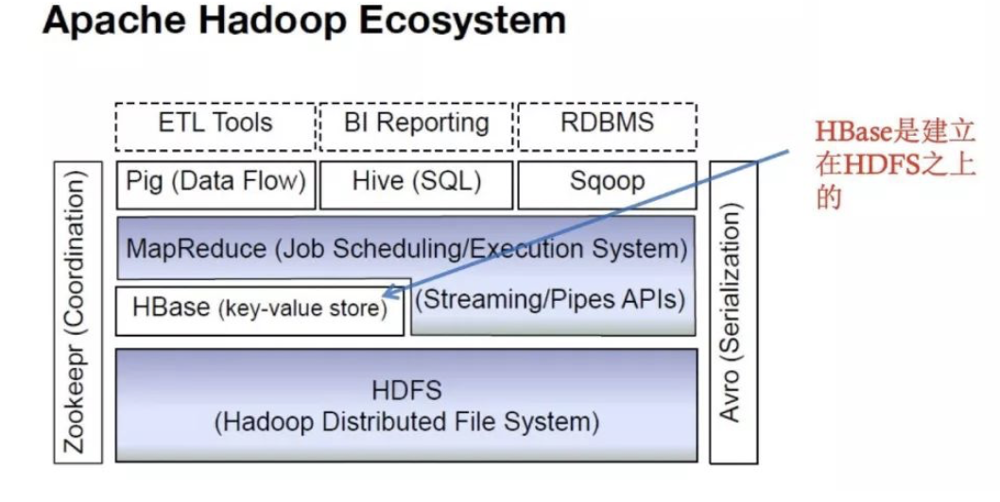
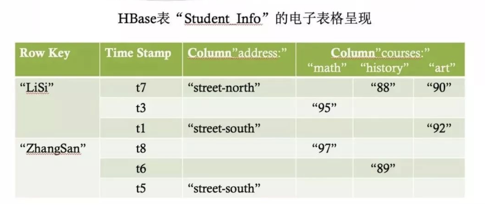
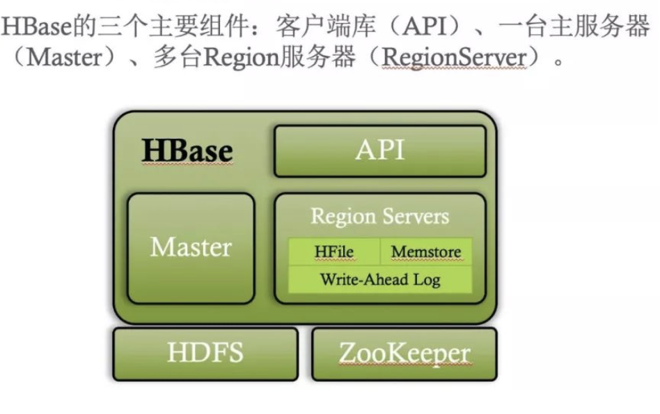

# HBase原理解析

HBase 是构建在 HDFS 之上的，这是由于 HBase 内部管理的文件全部都是存储在 HDFS 当中的。同时，MapReduce 这个计算框架在 HBase 之上又提供了高性能的计算能力来处理海量数据

| 概念           | 说明                                                   |
| -------------- | ------------------------------------------------------ |
| Row key        | 主键，字典顺序，bit Array字节数组 即排列顺序是1,10,2,3 |
| Column Family  | 列族，即表schema的一部分，列的前缀 最多20个            |
| Column         | 列，属于某个列族，可动态添加可以数百万列               |
| Version Number | 版本号 默认是时间戳 降序排列                           |
| Cell           | 由row key+column+version唯一确定，字节码               |

## 特点：

- 大，数10亿行 * 数百万列 * 数千个版本 = TB或PB级别
- 无模式：列动态增加，每一行准许截然不同的列
- 面向列：列独立存储和权限控制，独立检索
- 稀疏：空null不占用实际存储空间
- 版本多，每个单元数据可以有多个版本
- 数据类型单一，数据都是**字符串**。

一个 Region 是由一个或多个 Store 组成。每一个 Store 其实就是一个列族。每个

Store 又是由一个 memStore 和 0 个或者多个 storeFile 组成。memStore 是存储在内存中，storeFile 是存储在 HDFS 中，有时候也称作 HFile。数据都会先写入memStore，一旦 memStore 超过给的的最大值之后，HBase 就会将memStore 持久化为 storeFile

- 客户端库：可以通过 HBase 提供的各式语言API 库访问集群。API 库也会维护一个本地缓存来加快对 HBase 对访问，比如缓存中记录着 Region 的位置信息。
- Maste 节点：主要为各个 RegionServer 分配 Region，负责 RegionServer 对负载均衡，管理用户对于 Table 对 CRUD 操作。
- RegionServer：维护 Region，处理对这些 Region 对IO 请求，负责切分在运行过程中变过大的 Region。

来源：https://mp.weixin.qq.com/s/kJbeuu3zqRxQxVN38Z4asA

