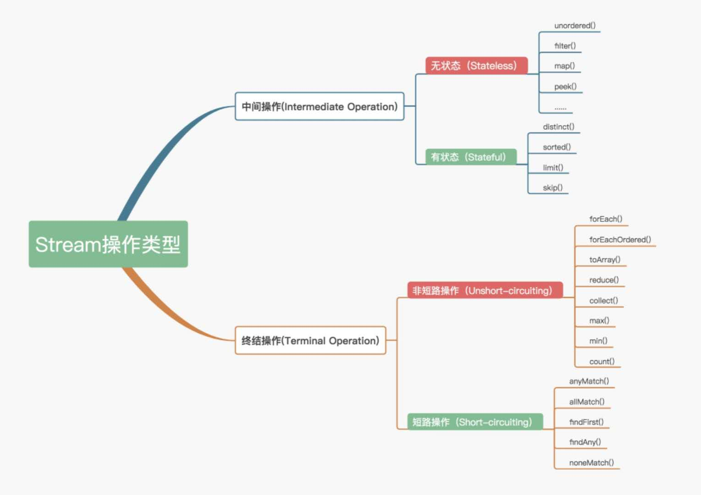

# Java8 学习总结

> 在思考问题时，使用不可变值和函数，函数对一个值进行处理，映射成另外一个值。


## Lambda表达式

```java
//接口无参数 只有一个方法
Runnable noArguments = () -> System.out.println("你好");
noArguments.run();

//接口只有一个参数，一个方法
ActionListener oneArguments = event -> System.out.println("您好");

//执行体也可以是多行代码
Runnable multi = ()->{
    System.out.println("2222");
    System.out.println("33333333");
};
multi.run();

//多个参数
BinaryOperator<Long> add = (x,y) -> x+ y;
BinaryOperator<Long> add1 = (Long x,Long y) -> x*2+y*2;
System.out.println(add.apply(12L,24L));
```

### 函数接口

| 接口                       | 参数  | 返回类型        | 示例                       |
| -------------------------- | ----- | --------------- | -------------------------- |
| Predicate<T> 断言          | T     | Boolean test(T) | 这张唱片已经发行了吗       |
| Consumer<T> 消费           | T     | Void accept     | 输出一个值                 |
| Function<T,R> 函数         | T     | R apply         | 得到一个值，返回另外一个值 |
| Supplier<T> 提供           | None  | T get()         | 工厂方法                   |
| UnaryOperator<T> 一元运算  | T     | T apply()       | 逻辑非                     |
| BinaryOperator<T> 二元运算 | (T,T) | T apply()       | 求两个数的乘积             |

这类函数还有很多变种，如BiConsumer,DubbleConsumer,IntConsumer等 这些就是明确了类型

#### Predicate

断言 接口只有一个参数，返回boolean类型

```java
Predicate<Integer> integerPredicate = x -> x > 10;
System.out.println(integerPredicate.test(11));//true
Predicate<Boolean> nonNull = Objects::nonNull;
Predicate<Boolean> isNull = Objects::isNull;
Predicate<String> isEmpty = String::isEmpty;
Predicate<String> isNotEmpty = isEmpty.negate();
```

#### Function

函数 接口有一个参数并且返回一个结果，并附带了一些可以和其他函数组合的默认方法（compose, andThen）

```java
Function<Integer,String> function = x -> x.toString() + "字符串";
System.out.println(function.apply(100));
//注意andThen
Function<String, Integer> toInteger = Integer::valueOf;
Function<String, String> backToString = toInteger.andThen(String::valueOf);

backToString.apply("123");     // "123"
```

#### **Supplier**

同function，只是不接收参数

```java
Supplier<Person> personSupplier = Person::new;
personSupplier.get();   // new Person
```

#### Consumer

```java
//消费
Consumer<Integer> integerConsumer = x -> System.out.println(x+10);
integerConsumer.accept(100);
```

#### Comparator 

Comparator 是老Java中的经典接口， Java 8在此之上添加了多种默认方法：

```java
Comparator<Person> comparator = (p1, p2) -> p1.firstName.compareTo(p2.firstName);

Person p1 = new Person("John", "Doe");
Person p2 = new Person("Alice", "Wonderland");

comparator.compare(p1, p2);             // > 0
comparator.reversed().compare(p1, p2);  // < 0
```

#### Optional 

Optional 不是函数是接口，这是个用来防止NullPointerException异常的辅助类型

Optional 被定义为一个简单的容器，其值可能是null或者不是null。在Java 8之前一般某个函数应该返回非空对象但是偶尔却可能返回了null，而在Java 8中，不推荐你返回null而是返回Optional。

```java
Optional<String> optional = Optional.of("bam");

optional.isPresent();           // true
optional.get();                 // "bam"
optional.orElse("fallback");    // "bam"

optional.ifPresent((s) -> System.out.println(s.charAt(0)));     // "b"
```

#### 其他

```java


//1元运算
UnaryOperator<Integer> integerUnaryOperator = x -> x -1 ;
System.out.println(integerUnaryOperator.apply(10));
//2元运算
BinaryOperator<Integer> integerBinaryOperator = (x,y) -> x-y;
System.out.println(integerBinaryOperator.apply(10,111));
```

### @FunctionInterface

确保你的接口一定达到这个要求，你只需要给你的接口添加 @FunctionalInterface 注解，编译器如果发现你标注了这个注解的接口有多于一个抽象方法的时候会报错的。

```java
@FunctionalInterface
public interface MyConverter<F,T> {
    T convert(F from);
}

MyConverter<String,Integer> converter = (from) -> Integer.valueOf(from) + 100;
Integer converted = converter.convert("123");
System.out.println(converted);
```


工厂方式

```java
public class Person {

    String firstName;
    String lastName;

    Person(String firstName,String lastName){
        this.firstName = firstName;
        this.lastName = lastName;
    }
}
public interface PersonFactory<P extends Person> {
    P create(String firstName,String lastName);
}
PersonFactory<Person> personPersonFactory = Person::new;
Person b = personPersonFactory.create("borg","xiao");
```


## 流运算

> for本质是iterator的包装，无法复用，代码块作用模糊，即可以在里面做很多操作。stream流，即从外部迭代到内部迭代。

流配合上面的**函数接口+集合接口**=高级高效简练的代码，注意**流是惰性的**，即不使用是不执行的。即没有get,collect，reduce等**终结操作**是不进行运算的。流的元素操作是有序的，但是因为流可以是集合(无序)，所以这类又叫**出现顺序**。如果想并行操作流，**parallel**(),**parallelStream**()流操作即可，只有多核和大批量的情况下，建议这样用。

集合与流之间的差异就在于什么时候进行计算。集合是一个内存中的数据结构，它包含数据结构中目前所有的值——集合中的每个元素都得先算出来才能添加到集合中。(你可以往集合里加东西或者删东西，但是不管什么时候，集合中的每个元素都是放在内存里的，元素都得先算出来才能成为集合的一部分。)

流只能遍历一次，完了可以重新生成一个新的流



### 1,collect(toList())

```java
List<String> stringList  = Stream.of("a","a","b","c").collect(Collectors.toList());
System.out.println(stringList);//[a, a, b, c]
```

**一般用在流收尾，聚合得到新的流**。

### 2,map(Function f),mapToInt,mapToLong,mapToDubble

```java
//map转换流,即数据转换
List<String> stringList1 = Stream.of("a","b","c").map(String::toUpperCase).collect(toList());
System.out.println(stringList1);//[A, B, C]
```

map不同于filter,map重点是转换

### 3,filter(Predicate p)

过滤通过一个predicate接口来过滤并只保留符合条件的元素，该操作属于中间操作，所以我们可以在过滤后的结果来应用其他Stream操作（比如forEach

```java
//filter 过滤流
List<String> stringList2 = Stream.of("a","b","c").filter( x -> x.equals("a")).collect(toList());
System.out.println(stringList2);//[a]
```

### 4,min,max(Comparator c)

```java
//min max
Integer min = Stream.of(1,3,1,32,20).min( Integer::compareTo).get();
System.out.println(min);
```

配合get()使用获取特定值

```java
List<Track> tracks = asList(
  new Track("Bakai", 524),
  new Track("Violets for Your Furs", 378),
  new Track("Time Was", 451));  
Track shortestTrack = tracks.stream().
  min(Comparator.comparing(track -> track.getLength())).get();
```

### 5,long count()

计算流中的元素个数

### 6,reduce(BinaryOperator b),T reduce(T identity, BinaryOperator a)

从流中得到一个值，如min,max,count其实就是reduce的一个操作

这是一个最终操作，允许通过指定的函数来讲stream中的多个元素规约为一个元素，规越后的结果是通过Optional接口表示的

```java
//reduce通过运算从流中得到一个数据
Integer sum = Stream.of(1,3,1,2).reduce((x,y)-> x+ y).get();
System.out.println(sum);//7
//传递基准值，即起始值，这样有基准也可以直接返回
Integer sum1 = Stream.of(1,3,1,2).reduce(10,(x,y)-> x+ y);
System.out.println(sum1);//17


Optional<String> reduced =
    stringCollection
        .stream()
        .sorted()
        .reduce((s1, s2) -> s1 + "#" + s2);

reduced.ifPresent(System.out::println);
// "aaa1#aaa2#bbb1#bbb2#bbb3#ccc#ddd1#ddd2"
```

### 7,flatMap(Function<? super T, ? extends Stream<? extends R>> mapper)

操作流中的元素，生成新的流

```java
//flatMap 对流中元素再进行流运算 生产一个新平展的流
List<String> stringList3 = Stream.of("a,A,1","b,B","c").flatMap( x -> Stream.of(x.split(","))).collect(toList());
System.out.println(stringList3);//[a, A, 1, b, B, c

//先生成List<String[]> --> 再 Arrays::stream转String[]->String
List<String> stringList3 = Stream.of("a,A,1","b,B","c").map(w->w.split(",")).flatMap(Arrays::stream).collect(toList());
```

### 8,distinct()

获取流中的唯一流，本质是filter

```java
List<String> stringList4 = Stream.of("a","a","b","A").distinct().collect(toList());
System.out.println(stringList4);//[a, b, A]
```

### 9,sorted(),sorted(Comparator c)

排序流中的元素

```java
List<String> stringList5 = Stream.of("a","a","b","A").sorted().collect(toList());
System.out.println(stringList5);//[A, a, a, b]
```

### 10,peek(Consumer a)，forEach(Consumer a),forEachOrdered()

对流中的元素做一些消费处理，如输出和其它，类似forEach,但**是forEach是非惰性的**。

```java
//peek 假如不加count方法，是无法输出值的，因为流是惰性的，只有使用的时候才会触发
long s = Stream.of("a","b","c").peek( x ->{
    System.out.println(x + x.toUpperCase());
}).count();
System.out.println(s);//3
```


```java
//非惰性
Stream.of("a","b","c").forEach( x -> {
    System.out.println(x  + "111");
});
```

### 11,skip(long n),limit(long n)

流分页

```java
List<String> stringList6 = Stream.of("a","1","2").skip(1).limit(5).collect(toList());
System.out.println(stringList6);//[1, 2]
```

### 12,anyMatch(Predicate p),allMatch(),noneMatch()

验证流中的元素是否匹配

```java
System.out.println(Stream.of(1,2,3,4).allMatch( x -> x > 3));//false
System.out.println(Stream.of(1,2,3,4).anyMatch( x -> x > 3));//true
System.out.println(Stream.of(1,2,3,4).noneMatch( x -> x > 3));//false
```

### 13,findFirst(),findAny()

查找第一个，

### 14,builder(),empty()

创建

### 15,of(T...)

创建

### 16,iterate(T,UnaryOperator u)

迭代

### 17,generate(Supplier s)

### 18,concat(Stream s1,Stream s2)

合并两个流

## 集合类和高级收集器

### 1，方法引用

```java
//旧
artist -> artist.getName()
//java 8
Artist::getName
//旧
(name,age) -> new Artist(name,age)
 //新
Artis::new
```

### 2，Collectors工具类

配合该工具类，更加丰富流的操作和聚合

#### 2.1，toCollection(),toList(),toSet()

生成对应的服务集合列表

#### 2.2，joining()，joinning(CharSequence d,CharSequence pre,CharSequence suf)

```java
//聚合
String s7 = Stream.of("A","B").collect(Collectors.joining(",","【","】"));
System.out.println(s7);//【A,B】
```

#### 2.3，mapping()

同流的map

```java
//map 用map().collect()可以替换
List<String> stringList7 = Stream.of("A","B").collect(Collectors.mapping(String::toLowerCase,toList()));
System.out.println(stringList7);
```


#### 2.4，collectingAndThen()


#### 2.5，counting()

一般用在collect里面，配合分组和分块里面用

```java
//可以直接用count
long c1 = Stream.of("A","B").collect(Collectors.counting());
System.out.println(c1);
```

#### 2.6，minBy(),maxBy(),summingInt(),summingLong(),summingDouble()

取最小值，求和等

```java
//可以直接用min
int min1 = Stream.of(1,2,3,1,10).collect(Collectors.minBy(Integer::compareTo)).get();
System.out.println(min1);
```

#### 2.7，averagingInt(),averagingLong(),averagingDouble(0)

求平均值

#### 2.8，reducing()

求最小等都是调用的这个

#### 2.9，groupingBy(),grouppingByConcurrent()

分组


#### 2.10，partitioningBy()

分割

#### 2.11，toMap(Function key,Function value),toConcurrentMap()

转换为map

#### 2.12,summarizingInt(),summarizingLong(),summarizingDouble()

概括

### 3，综合案例

#### 3.1，混合案例

```java
//书籍 省略set,get
class Book {
    private String title;
    private Integer price;
    private Author author;
    private String tags;
}
//作者 省略set,get
class Author {
    private String name;
    private Integer age;
    private String Address;
}
Author author1 = new Author("author1",20,"地址1");
Author author2 = new Author("author2",22,"地址1");
Author author3 = new Author("author3",22,"地址3");

Book book1 = new Book("书本1",102,author1,"科技,经济");
Book book2 = new Book("书本2",100,author1,"爱情,文学");
Book book3 = new Book("书本3",32,author2,"爱情,文学");
Book book4 = new Book("书本4",32,author3,"经济,文学");
Book book5 = new Book("书本5",88,author3,"历史,文学");

List<Book> bookList = Stream.of(book1,book2,book3,book4,book5).collect(toList());
```

```java
//获取作者下面的书籍
Map<Author,List<Book>> authorListMap = bookList.stream().collect(groupingBy(Book::getAuthor));
System.out.println(authorListMap);
//获取作者下面的书籍，并统计有多少
Map<Author,Long> authorLongMap = bookList.stream().collect(groupingBy(Book::getAuthor,Collectors.counting()));
System.out.println(authorLongMap);

//按照作者的书籍量排序，作者 降序
        List<Author> authors = bookList.stream().collect(groupingBy(Book::getAuthor,Collectors.counting())).entrySet().stream().sorted(Map.Entry.<Author,Long>comparingByValue().reversed()).map(Map.Entry::getKey).collect(toList());
System.out.println(authors);
//升序
authors = bookList.stream().collect(groupingBy(Book::getAuthor,Collectors.counting())).entrySet().stream().sorted(Map.Entry.comparingByValue()).map(Map.Entry::getKey).collect(toList());
        System.out.println(authors);
```

```java
Map<Integer,List<Integer>> crmCirculateRelationMap = crmCirculateRelations.stream().collect(
     //直接收集排序   
  Collectors.groupingBy(
                CrmCirculateRelation::getReasonId,//key
                HashMap::new,//map
                Collectors.mapping(
                        CrmCirculateRelation::getOption,//元素
                        Collectors.toList()//list
                )
    )
```

#### 3.2 map和list互转

**利用map的entrySet**，同样foreach的时候也是如此

```java
List<Person> list = map.entrySet().stream().sorted(Comparator.comparing(e -> e.getKey()))
		.map(e -> new Person(e.getKey(), e.getValue())).collect(Collectors.toList());
List<Person> list = map.entrySet().stream().sorted(Comparator.comparing(Map.Entry::getValue))
		.map(e -> new Person(e.getKey(), e.getValue())).collect(Collectors.toList());
List<Person> list = map.entrySet().stream().sorted(Map.Entry.comparingByKey())
	.map(e -> new Person(e.getKey(), e.getValue())).collect(Collectors.toList());

```

利用**Collectors.toMap**方法

```java
//list转map
Map<Integer, String> result1 = list.stream().collect(
                Collectors.toMap(Hosting::getId, Hosting::getName));

//转为其它list
List<Employee> employees = persons.stream()
                .filter(p -> p.getLastName().equals("l1"))
                .map(p -> new Employee(p.getName(), p.getLastName(), 1000))
                .collect(Collectors.toList());

```


## 接口默认方法支持

```java
interface Iterator<T> { 
	boolean hasNext();
	T next();
	default void remove() {
     throw new UnsupportedOperationException();
  }
}
```


## 参考文件:

[Java8函数式编程]: Warburton，R.	"王群锋译 人民邮电出版社2015"
[Java8实战]: 

