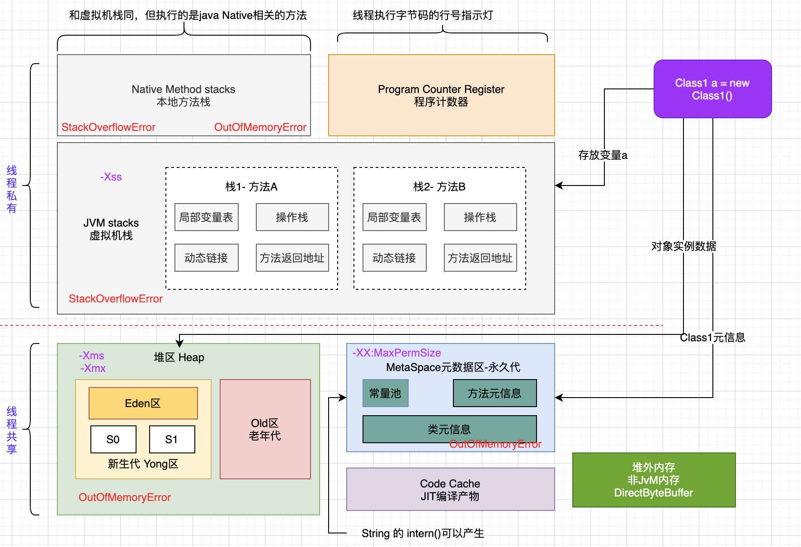
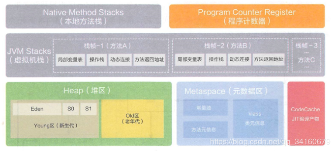
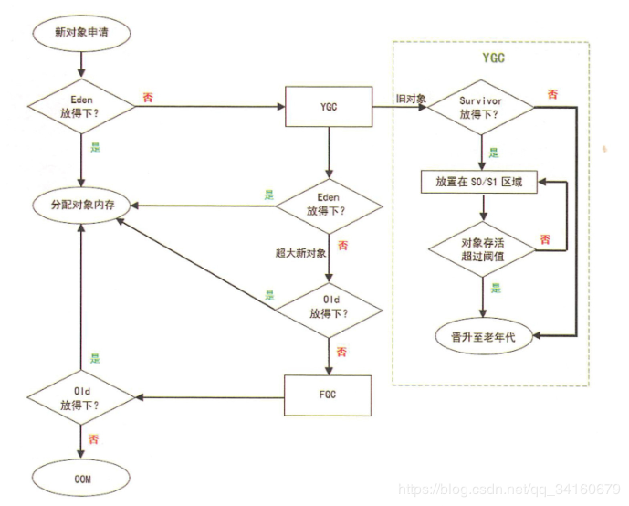
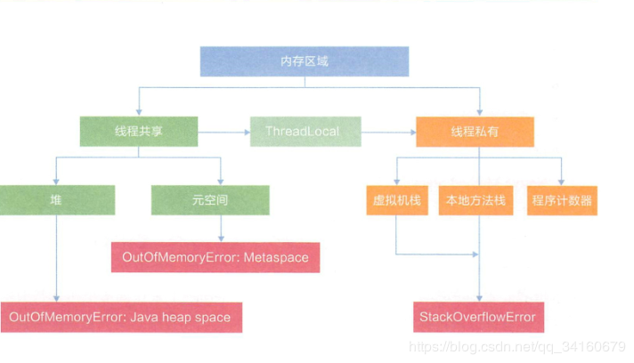
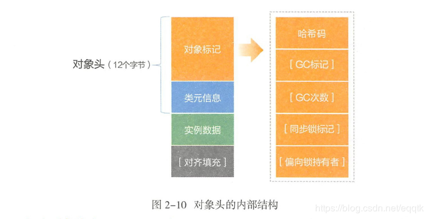
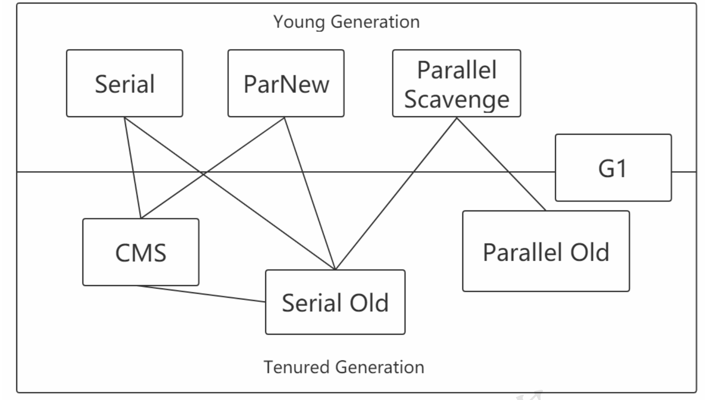
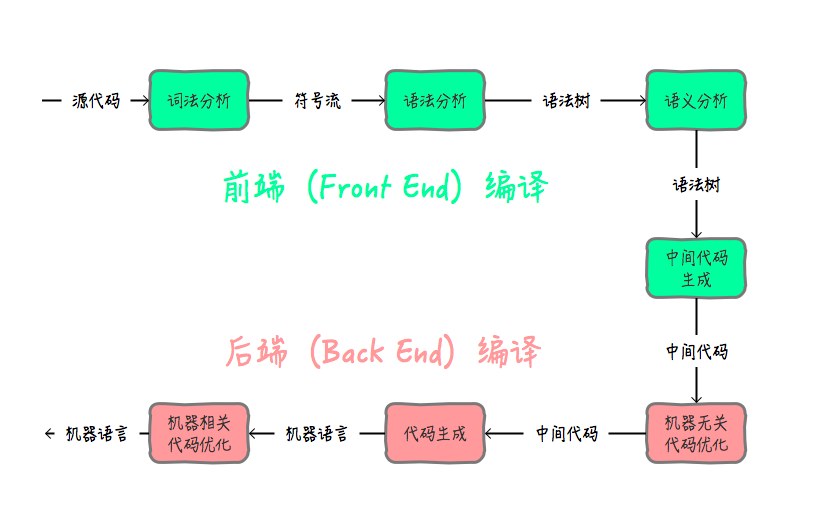
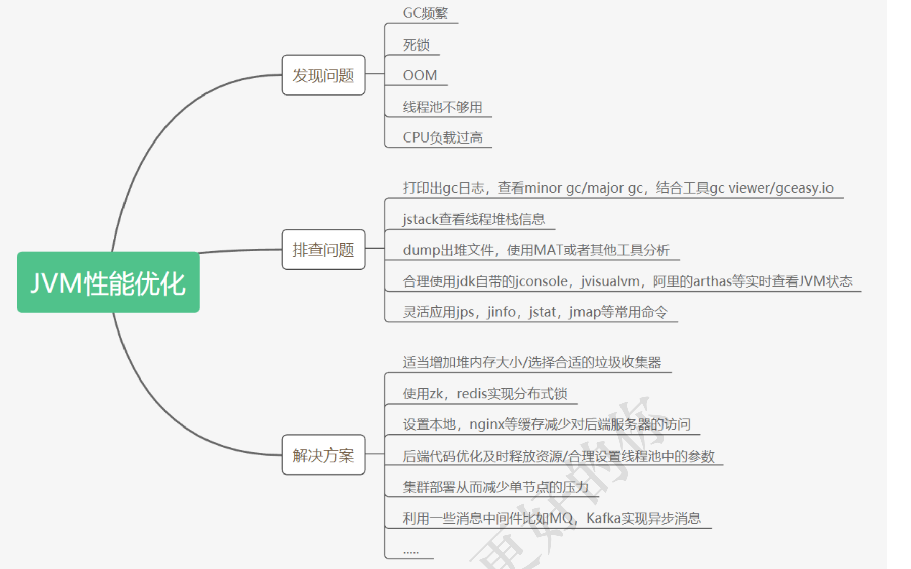

# JVM

Java Virtual Machine

OpenJDK,AlibabJDK(AJDK)

## JVM内存：






### Heap区：

1）Heap去是OOM故障的主要发源地，它存储了几乎所有的实例对象。堆由垃圾收集器回收。堆区由各子线程共享使用。通过**-Xms**256M **-Xmx**1024控制。设置成一样，避免GC后调整堆大小时带来额外压力。

2）分为**新生代**和**老年代**，其中新生代=**1个Eden区+2个Survivor区**(S0,S1)

3）如果老年代也放不下，就会产生FGC,可以通过设置-XX:+HeapDumpOnOutOfMemoryError，让jvm在遇到OOM异常的时候能够输出堆栈信息。



### Metaspace元空间：

元空间的前身是Perm区（被称为永久代），在JDK7 及之前的版本中才有Perm，现在的版本使用了Metaspace。因为Perm 在某些场景下，如果动态加载类过多，容易产生Perm 区的OOM（为了解决需要设定参数 -XX：MaxPermSize = 1280m），如果部署到新机器上，往往会因为JVM 参数没有修改导致故障再现，不熟悉此应用的人很难排查。所以，元空间就诞生了。元空间在本地内存中分配

OutOfMemoeryError:PermGenspace

### JVM Stack （虚拟机栈)：

栈的特性是先进后出的数据结构，JVM 是基于栈结构的运行环境。JVM 中的虚拟机栈是描述Java方法执行的内存区域，它是线程私有的。栈中的元素用于支持虚拟机进行方法调用，每个方法从开始调用到执行完成的过程。就是栈帧从入栈到出栈的过程。活动线程中只有位于栈顶的帧才是有效的，称为当前栈帧。正在执行的方法称为当前方法。

虚拟机栈通过压栈和出栈的方式，对每个方法对应的活动栈帧进行运算处理，方法正常执行结束，肯定会跳转到另一个栈帧上。在执行过程中，如果出现异常，会进行异常回溯，返回地址通过异常处理表确定。

**局部变量表：** 存放方法参数和局部变量的区域
**操作栈 ：** 一个初始状态为空的桶式结构栈。在方法执行过程中，会有各种指令往栈中写入和提取信息。
**动态连接**：每一个栈帧包含一个常量池中对当前方法的引用，目的是支持方法调用过程的动态连接
**方法返回地址：** 方法执行有两种退出情况： 1. 正常退出。2.异常退出。 无论何种退出情况都将返回到方法当前被调用的位置。方法退出的过程相当于弹出当前栈帧。

### 本地方法栈：

Native Method Stack 在JVM内存布局中，也是线程对象私有的。被称为Native 方法服务，线程开始调用本地方法时，会进入一个不再受JVM约束的世界。本地方法可以通过JNI来访问虚拟机运行时的数据区，甚至可以调用寄存器，具有和JVM相同的能力和权限。

### 程序计数寄存器：

每一个线程在创建后，都会产生自己的程序计数器和栈帧，程序计数器用来存放执行指令的偏移量和行号指示器，程序的执行或者恢复都要依赖程序计数器。程序计数器在各线程之间互不影响，此区域不会发生内存溢出异常。如果线程正在执行一个java方法

从线程共享的角度来看，堆空间和元空间都所有线程共享的，而虚拟机栈和本地方法栈，程序计数器是线程内部私有的。


### 对象实例化：

NEW->DUP->INVOKESPECIAL

1）**确认类元信息是否存在**。当JVM接受到new指令时，首先在metaspace 内**检查需要创建的类元信息是否存在**。若不存在，那么在双亲委派模式下，使用当前类加载器以ClassLoader +包名+类名为key 进行查找对应的.class 文件，如果没有找到文件，则抛出ClassNotFoundException 异常，如果找到，则进行类加载并生成对应的Class 类对象。
2）**分配对象内存**。首先计算对象占用空间大小，如果实例成员变量是引用变量，仅分配引用变量空间即可，即4个字节大小，接着在堆中划分一块内存给新对象。在分配内存空间时，需要进行同步操作，比如采用CAS失败重试，区域加锁等方式保证分配操作的原子性。
3）**设定默认值**。成员变量值都需要设定默认值，即各种不同形式的零值。
4）**设置对象头**。设置新对象的哈希码，GC信息，锁信息，对象所属的类元信息等。这个过程的具体设置方式取决JVM实现。
5）**执行init 方法**。初始化成员变量，执行实例化代码块，调用类的构造方法，并把堆内对象的首地址赋值给引用变量。

#### 设置对象头

I ）对象头（Object Header )
对象头占用12 个字节，存储内容包括对象标记（markOop ）和类元信息（klassOop ）。
对象标记存储对象本身运行时的数据，如哈希码、GC 标记、锁信息、线程关联信息等，
这部分数据在64 位NM 上占用8 个字节，称为"Mark word",为了存储更多的状
态言息,对象标记的存储恪式是非固定的（具休与JVM 的实现有关）。类元信患、存
储的是对象指向它的类元数据（即Kl ass ）的首地址’占用4 个字节，与refvar 开销一致。
( 2 ）实例数据（Instance Data )
存储本类对象的实例成员变量和所有可见的父类成员变量。如Integer 的实例
成员只有一个private int value ，占用4 个字节，所以加上对象头为16 个字节
( 3 ）对齐填充（Padding )
对象的存储空间分配单位是8 个字节，如果一个占用大小为16 个字节的对象，
增加一个成员变量byte 类型，此时需要占用17 个字节，但是也会分配24 个字节进
行对齐填充操作。



## Garbage Collect垃圾回收(GC)：

https://www.ibm.com/developerworks/cn/java/j-lo-JVMGarbageCollection/

https://www.ibm.com/developerworks/cn/java/j-lo-jvm-optimize-experience/index.html

Serial,CMS,G1主要三种垃圾回收器**-XX:UseG1GC**。

Java 会对内存进行自动分配与回收管理，使上层业务更加安全，方便地使用内存实现程序逻辑。GC 主要目的是清除不再使用的对象，自动释放内存。

### 确定垃圾算法：

#### 引用计算法：

一个堆内存（对象实例），如果没有被任何变量引用(栈),则为垃圾。引用计算就是记录对象被引用的次数。**效率高，实现简单，但无法解决循环依赖问题**。

```java
Class1 obj1 = new Class1();
Class1 obj2 = new Class1();
obj1.var1 = obj2;
obj2.var1 = obj1;
obj1 = null;
obj2 = null;
System.gc();
```

#### 可达性分析算法：

以GC Roots为对象的起点，从节点向下检索，选择引用连，没有则为垃圾。

能作为GC Root:类加载器、Thread、虚拟机栈的本地变量表、static成员、常量引用、本地方法栈的变量等。

### 垃圾收集算法：

- 标记-清除：标记出要回收的对象，然后再统一回收-->效率低效，容易产生大量碎片，碎片太大，导致创建大对象的时候没有连续空间，照成OOM
- 复制：把内存分为很多块，这一块用完，就改块存活的对象迁移到另外一块。-->内存使用不高即需要分配一半内存-->一般用于新生代回收
- 标记-整理：回收的时候把碎片整理成连续-->用于老年代回收
- 区分新老年代（分代收集）

### 垃圾收集器：



#### Serial收集器：

Serial收集器是最基本、发展历史最悠久的收集器，它是一种单线程收集器，不仅仅意味着它只会使用一个CPU或者一条收集线程去完成垃圾收集工作，更重要的是其在进行垃圾收集的时候需要暂停其他线程。

```ini
优点:简单高效，拥有很高的单线程收集效率 
缺点:收集过程需要暂停所有线程 
算法:复制算法
适用范围:新生代 
应用:Client模式下的默认新生代收集器
```

#### **Serial Old**收集器:

Serial Old收集器是Serial收集器的老年代版本，也是一个单线程收集器，不同的是采用"**标记-整理算 法**"，运行过程和Serial收集器一样。

#### ParNew收集器：

可以把这个收集器理解为Serial收集器的多线程版本。

```ini
优点:在多CPU时，比Serial效率高。 
缺点:收集过程暂停所有应用程序线程，单CPU时比Serial效率差。 
算法:复制算法
适用范围:新生代 
应用:运行在Server模式下的虚拟机中首选的新生代收集器
```

#### Parallel Scavenge收集器:

Parallel Scavenge收集器是一个新生代收集器，它也是使用复制算法的收集器，又是并行的多线程收集器，看上去和ParNew一样，但是Parallel Scanvenge更关注 系统的吞吐量 。

```ini
-XX:MaxGCPauseMillis控制最大的垃圾收集停顿时间，
-XX:GCTimeRatio直接设置吞吐量的大小。
```

#### Parallel Old收集器：

Parallel Old收集器是Parallel Scavenge收集器的老年代版本，使用多线程和"**标记-整理算法**"进行垃圾回收。吞吐量优先

#### CMS收集器：

以获取最短回收停顿时间为目标的收集器，主要采用标记-清楚算法，优点 并发收集，低停顿，确定就是算法本身的碎片问题。碎片太多，容易触发FullGC。

CMS(Concurrent Mark Sweep)收集器是一种以获取 最短回收停顿时间 为目标的收集器。采用的是"标记-清除算法",整个过程分为4步

```ini
(1)初始标记 CMS initial mark 标记GC Roots能关联到的对象 Stop The World-->速度很快
(2)并发标记 CMS concurrent mark 进行GC Roots Tracing 
(3)重新标记 CMS remark 修改并发标记因用户程序变动的内容 Stop The World
(4)并发清除 CMS concurrent sweep
优点:并发收集、低停顿 
缺点:产生大量空间碎片、并发阶段会降低吞吐量
```


#### G1收集器：

面向服务端的收集器，优点，并行并发，分带收集，空间整合。可预测停顿。

并行与并发 

分代收集(仍然保留了分代的概念)
 空间整合(整体上属于“标记-整理”算法，不会导致空间碎片) 可预测的停顿(比CMS更先进的地方在于能让使用者明确指定一个长度为M毫秒的时间片段内，消耗在垃圾收集 上的时间不得超过N毫秒)

使用G1收集器时，Java堆的内存布局与就与其他收集器有很大差别，**它将整个Java堆划分为多个 大小相等的独立区域(Region)**，虽然还**保留有新生代和老年代的概念**，**但新生代和老年代不再 是物理隔离的**了，它们都是一**部分Region(不需要连续)的集合**。

```ini
1)初始标记(Initial Marking):标记一下GC Roots能够关联的对象，并且修改TAMS的值，需要暂停用户线程
2)并发标记(Concurrent Marking):从GC Roots进行可达性分析，找出存活的对象，与用户线程并发执行
3)最终标记(Final Marking):修正在并发标记阶段因为用户程序的并发执行导致变动的数据，需要暂停用户线程
4)筛选回收(Live Data Counting and Evacuation):对各个Region的回收价值和成本进行排序，根据用户所期望的GC停顿时间制定回收计划
```

什么时候需要G1:

(1)50%以上的堆被存活对象占用

(2)对象分配和晋升的速度变化非常大 

(3)垃圾回收时间比较长

### 理解吞吐量和停顿时间:

停顿时间->垃圾收集器进行垃圾回收,终端应用执行响应的时间 

停顿时间越短就越适合需要和用户交互的程序，良好的响应速度能提升用户体验; 

吞吐量->运行用户代码时间/(运行用户代码时间+垃圾收集时间)

高吞吐量则可以高效地利用CPU时间，尽快完成程序的运算任务，主要适合在后台运算而不需要太多交互的任 务。

### 如何开启GC收集器：

(1)串行

 -XX:+UseSerialGC

 -XX:+UseSerialOldGC

(2)并行(吞吐量优先):

 -XX:+UseParallelGC 

-XX:+UseParallelOldGC

(3)并发收集器(响应时间优先)

 -XX:+UseConcMarkSweepGC 

-XX:+UseG1GC

### GC日志分析：

#### 打印GC日志：

-XX:+PrintGCDetails

 -XX:+PrintGCTimeStamps 

-XX:+PrintGCDateStamps 

-Xloggc:gc.log

```
[Full GC (Ergonomics) [PSYoungGen: 8192K->0K(9216K)] [ParOldGen: 8209K->496K(10240K)] 16401K->496K(19456K), [Metaspace: 3297K->3297K(1056768K)], 0.0086564 secs] [Times: user=0.01 sys=0.00, real=0.01 secs] 
Heap
```

Full GC：gc类型

[PSYoungGe：发生位置 年轻代

8192K->0K(9216K)：gc前的容量和gc后的容量

#### gc日志分析工具：

##### gceasy：

官网 :https://gceasy.io 

可以比较不同的垃圾收集器的吞吐量和停顿时间 

比如打开cms-gc.log和g1-gc.log

#####  **GCViewer**:


## 类加载：

#### 什么时候加载类？

1）类加载的触发机制：new，getstatic,putstatic,invokestatic，即实例化对象，读取和设置类的静态字段，调用类的静态方法。

2）使用reflect包的方法对类进行反射调用的时候。

3）当初始化一个类的时候，发现父类还没有进行初始化，**触发父类初始化先**。（子类如果未使用是不触发加载的）

4）当虚拟机启动时，指定的指定位执行主类，会优先初始化该类。

5）当使用动态语言支持的时候。

```java
Class1{
 static {
   //1,类加载初始化的的时候执行，只执行一次 一般用于初始化类的静态变量
   // 对应静态变量的赋值顺序和代码的顺序相关，如定义并赋值在前，static在后，则替换前面
 } 
  {
    //2,类被实例化的时候执行，即每次实例化执行，一般用于初始化对象的成员属性
    //对应属性的赋值顺序 也是参照定义和静态执行顺序
  }
  public Class1(){
    //3,构造方法
  }
}
```

```java
public class SupperClass {
  	//静态变量 如果再static方法后，则可以替换static里面的值 加载是按照顺序来的
    public static int value = 123;
		static {
        System.out.println("父类被加载了");
        //被重新赋值
        value = 124;
    }
    

    //常量
    public static final String V = "V";
}
public class SubClass extends SupperClass {

    private Integer v;
    private static Integer s;
    static {
        s = 1;
        System.out.println("子类被加载");
    }
    {
        v = 2;
        System.out.println();
        System.out.println("子类被实例化");
    }

    public SubClass(Integer v) {
        this.v = v;
        System.out.println("子类被创建");
    }
}
public class ClassTest {

    public static void main(String[] args) {

        //父类加载，子类不加载
        System.out.println(SubClass.value);

        //无任何加载 只是开闭空间，不加载类
        SupperClass[] sca = new SupperClass[10];

        //调用类的常量，并不适用类，不加载类
        System.out.println(SupperClass.V);

    }
}
```

### 类加载方式：

1）从zip包加载 , jar，EAR，WAR

2）从网络中获取，Applet。

3）运行时计算生成，动态代理

4）其他文件生成,jsp

5）从数据库中读取

...只要是二进制流都可。

数组类本身不通过类加载器创建，但是有相关性

### 类加载过程

任何程序都需要加载到内存中才能与CPU进行交流。字节码 .class 文件同样需要家长到内存中，才可以实例化类。ClassLoader 就是提前加载 .class 文件到内存中

过程： 加载、链接、初始化

加载： 读取类文件产生的二进制流，并转为特定的数据结构，初步校验cafe babe 魔法值，常量池、文件长度、是否有父类等，然后创建对应类的实例
链接包括验证、准备、解析三个过程。验证是更详细的校验，比如final 是否合规，类型是否正确、静态变量是否合理等；准备结果是为静态变量分配内存，并设定默认值，解析类和方法确保类与类之间的相互引用正确性，完成内存结构布局
初始化结果，执行类构造器方法，如果赋值运算是通过其他类的静态方法来完成的，那么会马上解析另一个类，在虚拟机栈中执行完毕后通过返回值进行赋值

### 双亲委派模型：

1）如果一个类加载器收到了类加载的请求，它首先不会自己去尝试加载这个类，而是把这个请求委派给父类加载器去完成。

2）每一个层次的类加载器都是如此。因此，所有的加载请求最终都应该传送到顶层的启动类加载器中。

3）只有当父加载器反馈自己无法完成这个加载请求时（搜索范围中没有找到所需的类），子加载器才会尝试自己去加载。

注：user ClassLoader -> **Application ClassLoader**（CLASSPATH） -> **Platform ClassLoader**（jre/lib/ext/*.jar等） -> **Bootstrap ClassLoader**（jre/lib/rt.jar等）

**对于任意一个类，都需要由加载它的类加载器和这个类本身一同确立其在虚拟机中的唯一性**，每一个类加载器，都拥有一个独立的类名称空间。因此，使用双亲委派模型来组织类加载器之间的关系，有一个显而易见的好处：**类随着它的类加载器一起具备了一种带有优先级的层次关系**。

注：**向上询问 是否父加载类可以加载，可以就使用父类加载，不可以就自己加载**。

例如类`java.lang.Object`，它由启动类加载器加载。双亲委派模型保证任何类加载器收到的对`java.lang.Object`的加载请求，最终都是委派给处于模型最顶端的启动类加载器进行加载，因此**Object类在程序的各种类加载器环境中都是同一个类**。

相反，如果没有使用双亲委派模型，由各个类加载器自行去加载的话，如果用户自己编写了一个称为java.lang.Object的类，并用自定义的类加载器加载，那系统中将会出现多个不同的Object类，Java类型体系中最基础的行为也就无法保证，应用程序也将会变得一片混乱。

#### 破坏双亲委派模型：

双亲委派不是强制性约束模型，而是一种推荐模型，所以可以被破坏

1）1.0和1.2的兼容

2）JNDI服务，Thread Contentx ClassLoader

3）热部署支持，OSGi


## 编译：



| JVM字节码                   | 注解                         |
| --------------------------- | ---------------------------- |
| ILOAD                       | 将int类型局部变量压入栈      |
| ALOAD                       | 将对象的引用的局部变量压入栈 |
| ISTORE,ASTORE               | 从操作栈顶存储局部变量表     |
| ICONST,BIPUSH,SIPUSH,LDC    | 将常量加载到操作栈顶         |
| IADD,IMUL                   | 运算指令                     |
| 12L,D2F                     | 类型转换指令                 |
| NEW,NEWARRAY                | 对象创建                     |
| GETFIELD,PUTFIELD,GETSTATIC | 访问属性                     |
| INSTANCEOF,CHECKCAST        | 检查实例类型指令             |
| POP                         | 出栈操作                     |
| DUP                         | 复制栈顶元素并压入栈         |
| INVOKEVIRTUAL               | 调用对象的实例方法           |
| INVOKEPECIAL                | 调用实例初始化方法，私有方法 |
| INVOKESTATIC                | 调用类静态方法               |
| RETRUEN                     | 返回void的类型               |
| ACC_SYNCHRONIZED，          | 同步方法标志                 |
| MONTITORENTER,MONITOREXIT   |                              |
|                             |                              |
|                             |                              |

字节码执行方式：

1）解释执行。

2）JIT编译执行。

3）JIT编译与解释混合执行（主流）

### 虚拟机字节码执行引擎：

每个方法从调用开始到执行完成的过程，都对应着一个从栈里面入栈到出栈的过程。

注：任何语言，只要有对应的编译器，编译成对应的JVM运行的字节码，就可以在虚拟机中执行。

## 虚拟机优化：

### 1）早期编译期优化：

javac编译器

1）词法，语法分析

2）填充符号表

3）注解处理器，processAnnotations()

4）泛型与类型擦除

5）自动装箱，拆箱与遍历循环

### 2）晚期运行期优化：

即时编译

即根据一些策略和技术，优化运行代码，如优化运行表达式，数组边界检查。

## JMM-Java内存模型

Java Memory Model

它是一个抽象的概念，

JMM是和多线程相关的，他描述了一组规则或规范，这个规范定义了一个线程对共享变量的写入时对另一个线程是可见的。

JMM就是围绕着多线程通信以及与其相关的一系列特性而建立的模型。JMM定义了一些语法集，这些语法集映射到Java语言中就是volatile、synchronized等关键字。而其中volatile的可见性，就是因为它直接操作的主内存


### CPU缓存和指令重排

在CPU和内存中间有一个缓存。

**当程序在运行过程中，会将运算需要的数据从主存复制一份到CPU的高速缓存当中，那么CPU进行计算时就可以直接从它的高速缓存读取数据和向其中写入数据，当运算结束之后，再将高速缓存中的数据刷新到主存当中。**

CPU缓存可以分为一级缓存（L1），二级缓存（L3），部分高端CPU还具有三级缓存（L3），每一级缓存中所储存的全部数据都是下一级缓存的一部分。

**当CPU要读取一个数据时，首先从一级缓存中查找，如果没有找到再从二级缓存中查找，如果还是没有就从三级缓存或内存中查找。**

在CPU和主存之间增加缓存，在多线程场景下就可能存在**缓存一致性问题**，也就是说，在多核CPU中，每个核的自己的缓存中，关于同一个数据的缓存内容可能不一致。

还有一个问题就是处理器可能会对输入代码进行乱序执行处理。这就是**处理器优化**。除了现在很多流行的处理器会对代码进行优化乱序处理，很多编程语言的编译器也会有类似的优化，比如Java虚拟机的即时编译器（JIT）也会做**指令重排**。

**原子性**是指在一个操作中就是cpu不可以在中途暂停然后再调度，既不被中断操作，要不执行完成，要不就不执行。

**可见性**是指当多个线程访问同一个变量时，一个线程修改了这个变量的值，其他线程能够立即看得到修改的值。

**有序性**即程序执行的顺序按照代码的先后顺序执行。

有没有发现，**缓存一致性问题**其实就是**可见性问题**。而**处理器优化**是可以导致**原子性问题**的。**指令重排**即会导致**有序性问题**。所以，后文将不再提起硬件层面的那些概念，而是直接使用大家熟悉的原子性、可见性和有序性。

Synchronized --> monitorenter/monitorexit -> 原子性

volatile/final->主内存->可见性

Synchronized/volatile->只准许单线程操作/禁止指令重排->有序性


## Java对象模型

java对象模型，是JVM中的存储对象的定义和模型

**对象的实例（instantOopDesc)保存在堆上，对象的元数据（instantKlass）保存在方法区，对象的引用保存在栈上**。

HotSpot虚拟机中，设计了一个OOP-Klass Model。OOP（Ordinary Object Pointer）指的是普通对象指针，而Klass用来描述对象实例的具体类型。

每一个Java类，在被JVM加载的时候，JVM会给这个类创建一个`instanceKlass`，保存在方法区，用来在JVM层表示该Java类。当我们在Java代码中，使用new创建一个对象的时候，JVM会创建一个`instanceOopDesc`对象，这个对象中包含了对象头以及实例数据。


**JVM内存结构，和Java虚拟机的运行时区域有关。 Java内存模型，和Java的并发编程有关。 Java对象模型，和Java对象在虚拟机中的表现形式有关**。


## JVM参数：

### 语法：

#### 标准参数：

-version 

-help 

-server 

-cp

```shell
➜  ~ java -version
java version "1.8.0_141"
Java(TM) SE Runtime Environment (build 1.8.0_141-b15)
Java HotSpot(TM) 64-Bit Server VM (build 25.141-b15, mixed mode)
```

#### -X参数非标准：

非标准参数，也就是在JDK各个版本中可能会变动

-Xint 解释执行
-Xcomp 第一次使用就编译成本地代码 

-Xmixed 混合模式，JVM自己来决定

#### -XX参数：

非标准化参数，相对不稳定，主要用于JVM调优和Debug

```ini
a.Boolean类型
格式:-XX:[+-]<name> +或-表示启用或者禁用name属性 
比如:
-XX:+UseConcMarkSweepGC 表示启用CMS类型的垃圾回收器
-XX:+UseG1GC 表示启用G1类型的垃圾回收器
b.非Boolean类型 
格式:-XX<name>=<value>表示name属性的值是value 
比如:-XX:MaxGCPauseMillis=500
```

#### 其他参数：

```ini
-Xms1000等价于-XX:InitialHeapSize=1000 
-Xmx1000等价于-XX:MaxHeapSize=1000 
-Xss100等价于-XX:ThreadStackSize=100
```

### 设置参数：

1）开发工具中设置比如IDEA，eclipse
2）运行jar包的时候:java -XX:+UseG1GC xxx.jar
3）web容器比如tomcat，可以在脚本中的进行设置 

4）通过jinfo实时调整某个java进程的参数(参数只有被标记为manageable的flags可以被实时修改)

## JVM性能调优：



### 常见问题：

(1)内存泄漏与内存溢出的区别

内存泄漏:对象无法得到及时的回收，持续占用内存空间，从而造成内存空间的浪费。

内存溢出:内存泄漏到一定的程度就会导致内存溢出，但是内存溢出也有可能是大对象导致的。

(2)young gc会有stw吗?

不管什么 GC，都会有 stop-the-world，只是发生时间的长短。

(3)major gc和full gc的区别

major gc指的是老年代的gc，而full gc等于young+old+metaspace的gc。

(4)G1与CMS的区别是什么

CMS 用于老年代的回收，而 G1 用于新生代和老年代的回收。

G1 使用了 Region 方式对堆内存进行了划分，且基于标记整理算法实现，整体减少了垃圾碎片的产生。

(5)什么是直接内存

直接内存是在java堆外的、直接向系统申请的内存空间。通常访问直接内存的速度会优于Java堆。因此出于性能的考 虑，读写频繁的场合可能会考虑使用直接内存。

(6)不可达的对象一定要被回收吗?

即使在可达性分析法中不可达的对象，也并非是“非死不可”的，这时候它们暂时处于“缓刑阶段”，要真正宣告一个对 象死亡，**至少要经历两次标记过程**;可达性分析法中不可达的对象被第一次标记并且进行一次筛选，筛选的条件是此 对象是否有必要执行 finalize 方法。当对象没有覆盖 finalize 方法，或 finalize 方法已经被虚拟机调用过时，虚拟机 将这两种情况视为没有必要执行。

被判定为需要执行的对象将会被放在一个队列中进行第二次标记，除非这个对象与引用链上的任何一个对象建立关 联，否则就会被真的回收。

(7)方法区中的无用类回收 

方法区主要回收的是无用的类，那么如何判断一个类是无用的类的呢?

判定一个常量是否是“废弃常量”比较简单，而要判定一个类是否是“无用的类”的条件则相对苛刻许多。类需要同时满 足下面 3 个条件才能算是 “无用的类” :

**该类所有的实例都已经被回收，也就是 Java 堆中不存在该类的任何实例**。
 **加载该类的 ClassLoader 已经被回收**。
 **该类对应的 java.lang.Class 对象没有在任何地方被引用，无法在任何地方通过反射访问该类的方法**。

虚拟机可以对满足上述 3 个条件的无用类进行回收，这里说的仅仅是“可以”，而并不是和对象一样不使用了就会必然 被回收。

(8)不同的引用 

JDK1.2以后，Java对引用进行了扩充:强引用、软引用、弱引用和虚引用

## JAVA引用：

### 强引用：

是指创建一个对象并把这个对象赋给一个引用变量。

```java
Object object =new Object();
String str ="hello";
```

### 软引用：

如果一个对象具有软引用，内存空间足够，垃圾回收器就不会回收它；

如果内存空间不足了，就会回收这些对象的内存。只要垃圾回收器没有回收它，该对象就可以被程序使用。

软引用可用来实现内存敏感的高速缓存,比如网页缓存、图片缓存等。使用软引用能防止内存泄露，增强程序的健壮性。  
SoftReference的特点是它的一个实例保存对一个Java对象的软引用， 该软引用的存在不妨碍垃圾收集线程对该Java对象的回收。也就是说，一旦SoftReference保存了对一个Java对象的软引用后，在垃圾线程对 这个Java对象回收前，**SoftReference类所提供的get()方法返回Java对象的强引用。另外，一旦垃圾线程回收该Java对象之 后，get()方法将返回null**。

```java
MyObject aRef = new  MyObject();
SoftReference aSoftRef=new SoftReference(aRef); 
//结束aReference对这个MyObject实例的强引用 即理论上MyObject可以回收了
aRef = null;
//重新获得对该实例的强引用。而回收之后，调用get()方法就只能得到null了。
MyObject anotherRef=(MyObject)aSoftRef.get();  
```

那么当这个SoftReference所软引用的aMyOhject被垃圾收集器回收的同时，ref所强引用的SoftReference对象被列入**ReferenceQueue**

### 弱引用（WeakReference）:

弱引用也是用来描述非必需对象的，当JVM进行垃圾回收时，无论内存是否充足，都会回收被弱引用关联的对象。在java中，用java.lang.ref.WeakReference类来表示

```java
WeakReference<People>reference=new WeakReference<People>(new People("zhouqian",20));  
System.out.println(reference.get());//正常值
System.gc();//通知GVM回收资源  
System.out.println(reference.get()); //null
```

弱引用可以和一个引用队列（ReferenceQueue）联合使用，如果弱引用所引用的对象被JVM回收，这个软引用就会被加入到与之关联的引用队列中。

### 虚引用（PhantomReference）：

虚引用和前面的软引用、弱引用不同，它并不影响对象的生命周期。在java中用java.lang.ref.PhantomReference类表示。如果一个对象与虚引用关联，则跟没有引用与之关联一样，在任何时候都可能被垃圾回收器回收。

要注意的是，虚引用必须和引用队列关联使用，当垃圾回收器准备回收一个对象时，如果发现它还有虚引用，就会把这个虚引用加入到与之 关联的引用队列中。程序可以通过判断引用队列中是否已经加入了虚引用，来了解被引用的对象是否将要被垃圾回收。如果程序发现某个虚引用已经被加入到引用队列，那么就可以在所引用的对象的内存被回收之前采取必要的行动。

```java
ReferenceQueue<String> queue = new ReferenceQueue<String>();  
PhantomReference<String> pr = new PhantomReference<String>(new String("hello"), queue);  
System.out.println(pr.get());
```

### 如何利用软引用和弱引用解决OOM问题

　　前面讲了关于软引用和弱引用相关的基础知识，那么到底如何利用它们来优化程序性能，从而避免OOM的问题呢？

下面举个例子，假如有一个应用需要读取大量的本地图片，如果每次读取图片都从硬盘读取，则会严重影响性能，但是如果全部加载到内存当中，又有可能造成内存溢出，此时使用软引用可以解决这个问题。

设计思路是：用一个HashMap来保存图片的路径 和 相应图片对象关联的软引用之间的映射关系，在内存不足时，JVM会自动回收这些缓存图片对象所占用的空间，从而有效地避免了OOM的问题。在Android开发中对于大量图片下载会经常用到。

https://www.jianshu.com/p/c571fa1c5554

## 内存溢出案例

https://mp.weixin.qq.com/s/08d4HpF67GsfKJPgW3jegQ

### 栈深度溢出

```java
public static void  testStackOverFlow(){ 
  	//栈不断递归，而且没有处理，所以虚拟机栈就不断深入不断深入，栈深度就这样溢出了
      BlowUpJVM.testStackOverFlow(); 
}
```

### JVM栈内存溢出

```java
public static void testStackOutOfMemory(){ 
    while (true) {   
            Thread thread = new Thread(new Runnable() {   
                   public void run() { 
                          while(true){ 
                      } 
                   }   
            });   
            thread.start();   
     }   
} 
```

线程的创建会直接在JVM栈中创建，但是本例子中，没看到内存溢出，主机先挂了，不是JVM挂了，真的是主机挂了，无论在mac还是在windows，都挂了。

### 永久代内存溢出

```java
public static void testPergemOutOfMemory1(){ 
   //方法一失败 
   List<String> list = new ArrayList<String>(); 
   while(true){ 
      list.add(UUID.randomUUID().toString().intern()); 
   } 
}
```

打算把String常量池堆满，没想到失败了，JDK1.7后常量池放到了堆里，也能进行垃圾回收了。

```java
public static void testPergemOutOfMemory2(){ 
   try { 
      while (true) { 
        //利用cglib，用Class把老年代堆满
         Enhancer enhancer = new Enhancer(); 
         enhancer.setSuperclass(OOM.class); 
         enhancer.setUseCache(false); 
         enhancer.setCallback(new MethodInterceptor() { 
            @Override 
            public Object intercept(Object obj, Method method, Object[] args, MethodProxy proxy) throws Throwable { 
               return proxy.invokeSuper(obj, args); 
            } 
         }); 
         enhancer.create(); 
      } 
   } 
   catch (Exception e){ 
      e.printStackTrace(); 
   } 
} 
```


JDK动态代理差生的类不会造成内存溢出，原因是：JDK动态代理产生的类信息，不会放到永久代中，而是放在堆中。

```java
public static void testPergemOutOfMemory3(){ 
   while(true){ 
   final OOM oom = new OOM(); 
   Proxy.newProxyInstance(oom.getClass().getClassLoader(), oom.getClass().getInterfaces(), new InvocationHandler() { 
         public Object invoke(Object proxy, Method method, Object[] args) throws Throwable { 
            Object result = method.invoke(oom, args); 
            return result; 
         } 
      }); 
   } 
} 
```

### 本地方法栈溢出

这个的原理就是不断创建线程池，而每个线程池都创建10个线程，这些线程池都是在本地方法区的，久而久之，本地方法区就溢出了。

```java
public static void testNativeMethodOutOfMemory(){ 
   int j = 0; 
   while(true){ 
      Printer.println(j++); 
      ExecutorService executors = Executors.newFixedThreadPool(50); 
      int i=0; 
      while(i++<10){ 
         executors.submit(new Runnable() { 
            public void run() { 
            } 
         }); 
      } 
   } 
} 
```

### 堆溢出

```java
public static void testOutOfHeapMemory(){ 
   List<StringBuffer> list = new ArrayList<StringBuffer>(); 
   while(true){ 
      StringBuffer B = new StringBuffer(); 
      for(int i = 0 ; i < 10000 ; i++){ 
         B.append(i); 
      } 
      list.add(B); 
   } 
}
```

不断往堆中塞新增的StringBuffer对象，堆满了就直接溢出了。
