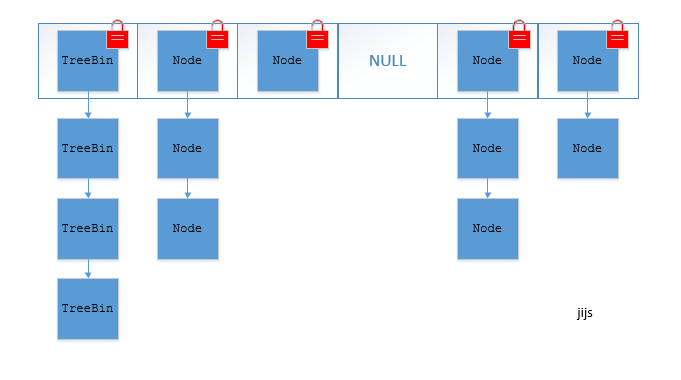

# Java手册

## 1）POJO

Plain(清楚的) Ordinary(普通) Java Object

| DO(Domain Object)         |      |
| ------------------------- | ---- |
| BO(Business Object)       |      |
| DTO(Data Transfer Object) |      |
| VO(View Object)           |      |
| AO(Application Object)    |      |
|                           |      |

注：POJO的类属性必须用包装数据类型，即Integer，RPC方法的返回值必须使用包装类型。所以的局部变量，推荐是基本数据类型。

注：包装类型缓存区间，-128-127，其中Character为0-127


## 2）覆写和重载

### **向上转型：**

1）无法调用到子类存在，父类不存在的方法。

2）可以调用到子类中覆写的父类方法。这是一种多态。

### **覆写要点：**

1）访问权限不能变小。

2）返回类型能够向上转型为父类的返回类型。

3）异常也能向上转型为父类异常。

4）方法名，参数类型及个数必须严格一致。

### 重载：

即方法名称相同，参数不一样。

优先级：

1）精确匹配。

2）如果是基本数据类型，自动转换成更大表示范围的基本类型。

3）通过自动拆箱与装箱。

4）通过子类向上转型继承路线依次匹配。

5）通过可变参数匹配

```java
class OverLoadMethod{
    public void methodForOverload(){
        System.out.println("无参数方法");
    }
    public void methodForOverload(int param){
        System.out.println("int");
    }
    public void methodForOverload(Integer param){
        System.out.println("Integer");
    }
    public void methodForOverload(Integer... params){
        System.out.println("Integer...");
    }
    public void methodForOverload(Object param){
        System.out.println("object");
    }
    
    
}
public class OverloadTest {
    
    public static void main(String[] args) {
        OverLoadMethod overLoadMethod = new OverLoadMethod();
        //int
        overLoadMethod.methodForOverload(7);
        //object
        overLoadMethod.methodForOverload(7L);
        //无参数方法
        overLoadMethod.methodForOverload();
        Integer[] ss = {7};
        //Integer...
        overLoadMethod.methodForOverload(ss);
    }
}
```

注：尽量少用覆写。

## UML图：


## 4）异常：


### 非受检异常：

运行时的异常，继承RuntimeException,不需要程序进行显示的补捉。**即即使throws显示声明 抛出该异常，也不需要try,受检异常 强制需要try**。

1）可预测异常，IndexOutOfBoundException,NullPointerExption可以提前做好边界检查。

2）需捕获的异常：如Dubbo的DubboTimeOutExption.

3）可透出异常：指框架自己会处理的异常，而程序无需关心，如Spring的NoSuchRequestHandlingExption

### 受检异常：

即需要代码捕获和处理的异常，否则编译报错。如SQLExption,ClassNotFoundExption.

throws 方法上显示声明

throw 抛出显示异常。

### Try代码块：

try-catch-finally 是处理程序异常的三部曲。当存在try 时，可以只有catch 代码块，
也可以只有finally 代码块，就是不能单独只有try 这个光杆司令。

契约式编程理念就完全处于防御式编程理念的下风，
所以我们推荐方法的返回值可以为null ，不强制返回空集合或者空对象等，但是必须
添加注释充分说明什么情况下会返回null 值。防止NP E 定是调用方的责任，需要
调用方进行事先判断。

注：避免在finally里面return.

### assert断言：

```java
int num = 10;
//不赞成使用，如果要，默认也不会报错，需要在运行的时候 -ea  即 java -ea Test
//AssertionError
assert num == 30:“自定义错误提示”;
```


## 5）日志：

1）应用中的扩展日志命名方式应该有统－的约定，通过命名能直观明了地表明当前日志文件是什么功能，如监控、访问日志等。推荐的日志文件命名方式为appName_logType logName.log 。其中，log Type 为
日志类型，推荐分类有stats 、monitor 、visit 等，logNam e 为日志描述。这种命名的好处是通过文件名就可以知道曰志文件属于什么应用，什么类型，什么目的，也有利于归类查找。例如，mppserv er 应用中单独监控时区转换异常的日志文件名定义为mppserver monitor timeZoneConvert.log 。

2）代码规约推荐曰志文件至少保存1 5 天，可以根据日志文件的重要程度、文件大小及磁盘空间再自行延长保存时间。

3）预先判断曰志级别，避免无效日志打印，区别对待错误日志，保证记录内容完整

### 日志框架：

#### 日志门面

门面设计模式是面向对象设计模式中的一种，日志框架采用的就是这种模式，类
似JDB C 的设计理念。它只提供一套接口规范，自身不负责日志功能的实现，目的是
让使用者不需要关注底层具体是哪个日志库来负责日志打印及具体的使用细节等。目
前用得最为广泛的曰志门面有两种slf4j 和commons -logging 。

#### 日志库

它具体实现了日志的相关功能，主流的日志库有三个，分别是log4j 、log -jdk 、
logback 。最早Java 要想记录曰志只能通过System.out 或System.err 来完成，非常不方便。
log4j 就是为了解决这一问题而提出的，它是最早诞生的曰志库。接着JD K 也在1 .4 版
本引入了一个日志库java. util.logging. Logger.，简称log-dk。这样市面上就出现两种日志
功能的实现，开发者在使用时需要关注所使用的日志库的具体细节。logback 是最晚出
现的，它与log4j 出自同一个作者，是log4j的升级版且本身就实现了slf4j的接口。

#### 日志适配器

曰志适配器分两种场景
( I ）日志门面适配器，因为slf4j规范是后来提出的此之前的日志库是没有
实现slf4j的接口的，例如log4j ；所以在工程里要想使用slf4j +log4j 的模式，就额
外需要个适配器（slf4j-log4j12 来解决接口不兼容的问题。
( 2 ）日志库适配器，在一些老的工程里，一开始为了开发简单而直接使用了日志库API来完成曰志打印，随着时间的推移想将原来直接调用日志库的模式改为业界标准的门面模式（例如slf4j +logback 组合），但老工程代码里打印曰志的地方太多，难以改动，所以需要个运队器来完成从旧日志库的API 到slf4j 的路由，这样在不改动原有代码的情况l、也能使用slf4j叫来统一管理曰志，而日后续自由替换具体日志库也不成可题。


## 6）数据结构与集合

集合与泛型的联合使用，可以把泛型的功能发挥到极致，很多程序员不清楚List、List<Object>、List<?>三者的区别，更加不能区分<? extends T>与<? super T>的使用场景。

List<?>是一个泛型，在没有赋值之前，表示它可以接受任何类型的集合赋值，赋值之后就不能再随便往里添加元素了
package Test;

import java.util.List;

public class ListNoGeneric {
    public static void main(String[] args){
        
```java
    //第一段：泛型出现之前的集合定义方式
    List a1 = new ArrayList();
    a1.add(new Object());
    a1.add(new Integer(111));
    a1.add(new String("hello a1a1"));
    
    //第二段：把a1引用赋值给a2，注意a2与a1的区别是增加了泛型限制<Object>
    List<Object> a2 = a1;
    a2.add(new Object());
    a2.add(new Integer(222));
    a2.add(new String("hello a2a2"));
    
    //第三段：把a1引用赋值给a3，注意a3与a1的区别是增加了泛型<Integer>
    List<Integer> a3 = a1;
    a3.add(new Integer(333));
    //以下两行代码编译错误，不允许增加非Integer的元素进入集合
    a3.add(new Object());
    a3.add(new Object());
    
    //第四段：把a1引用赋值给a4,a1与a4的区别是增加了通配符
    List<?> a4 = a1;
    //允许删除和消除元素
    a1.remove(0);
    a4.clear();
    //编译出错，不允许增加任何元素
    a4.add(new Object());
}
```

第一段说明：在定义List之后，毫不犹豫地往集合里装入三种不同的对象，即Object、Integer、String，遍历没有问题。
第二段说明：把a1赋值给a2，a2是List<Object>类型的，因为Object是所有对象的始祖，所以也可以再往里面装入三种不同的对象。我们经常认为List和List<Object>是完全相同的，至少从前两段来看是这样的。
第三段说明：泛型是在JDK5之后才出现的，考虑到向前兼容，因此历史代码有时需要赋值给新泛型代码，从编译器角度来说是允许的。
第四段说明：问号在正则表达式中可以匹配任何字符，List<?>成为通配符集合。它可以接收任何类型的集合引用赋值，不能添加任何元素，但是可以remove和clear，并非immuntable集合。List<?>一般作为参数来接收外部的集合，或者返回一个不知道具体元素类型的集合。

### ArrayList和LinkedList区别

- **1. 是否保证线程安全：** ArrayList 和 LinkedList 都是不同步的，也就是不保证线程安全；
- **2. 底层数据结构：** Arraylist 底层使用的是 Object 数组；LinkedList 底层使用的是双向链表数据结构（注意双向链表和双向循环链表的区别：）；
- **3. 插入和删除是否受元素位置的影响：** ① **ArrayList 采用数组存储，所以插入和删除元素的时间复杂度受元素位置的影响。** 比如：执行`add(E e)`方法的时候， ArrayList 会默认在将指定的元素追加到此列表的末尾，这种情况时间复杂度就是 O(1)。但是如果要在指定位置 i 插入和删除元素的话（`add(int index, E element)`）时间复杂度就为 O(n-i)。因为在进行上述操作的时候集合中第 i 和第 i 个元素之后的(n-i)个元素都要执行向后位/向前移一位的操作。 ② **LinkedList 采用链表存储，所以插入，删除元素时间复杂度不受元素位置的影响，都是近似 O(1) 而数组为近似 O(n) 。**
- **4. 是否支持快速随机访问：** LinkedList 不支持高效的随机元素访问，而 ArrayList 支持。快速随机访问就是通过元素的序号快速获取元素对象（对应于`get(int index)`方法）。
- **5. 内存空间占用：** ArrayList 的空 间浪费主要体现在在 list 列表的结尾会预留一定的容量空间，而 LinkedList 的空间花费则体现在它的每一个元素都需要消耗比 ArrayList 更多的空间（因为要存放直接后继和直接前驱以及数据）。

**补充内容:RandomAccess 接口**

```java
public interface RandomAccess {
}
```

查看源码我们发现实际上 RandomAccess 接口中什么都没有定义。所以，在我看来 RandomAccess 接口不过是一个标识罢了。标识什么？ 标识实现这个接口的类具有随机访问功能。

在 binarySearch() 方法中，它要判断传入的 list 是否 RamdomAccess 的实例，如果是，调用 indexedBinarySearch() 方法，如果不是，那么调用 iteratorBinarySearch() 方法

```java
    public static <T>
    int binarySearch(List<? extends Comparable<? super T>> list, T key) {
        if (list instanceof RandomAccess || list.size()<BINARYSEARCH_THRESHOLD)
            return Collections.indexedBinarySearch(list, key);
        else
            return Collections.iteratorBinarySearch(list, key);
    }

```

ArraysList 实现了 RandomAccess 接口， 而 LinkedList 没有实现。为什么呢？我觉得还是和底层数据结构有关！ArraysList 底层是数组，而 LinkedList 底层是链表。数组天然支持随机访问，时间复杂度为 O(1) ，所以称为快速随机访问。链表需要遍历到特定位置才能访问特定位置的元素，时间复杂度为 O(n) ，所以不支持快速随机访问。，ArraysList 实现了 RandomAccess 接口，就表明了他具有快速随机访问功能。 RandomAccess 接口只是标识，并不是说 ArraysList 实现 RandomAccess 接口才具有快速随机访问功能的！

**下面再总结一下 list 的遍历方式选择：**

- 实现了 RandomAccess 接口的 list，优先选择普通 for 循环 ，其次 foreach,
- 未实现 RandomAccess 接口的 ist， 优先选择 iterator 遍历（foreach 遍历底层也是通过 iterator 实现的），大 size 的数据，千万不要使用普通 for 循环

### HashMap,HashTable,HashSet

#### 1)JDK1.8 之前

JDK1.8 之前 HashMap 底层是 **数组和链表** 结合在一起使用也就是 **链表散列**。**HashMap 通过 key 的 hashCode 经过扰动函数处理过后得到 hash 值，然后通过 `(n - 1) & hash` 判断当前元素存放的位置（这里的 n 指的时数组的长度），如果当前位置存在元素的话，就判断该元素与要存入的元素的 hash 值以及 key 是否相同，如果相同的话，直接覆盖，不相同就通过拉链法解决冲突。**

**所谓扰动函数指的就是 HashMap 的 hash 方法。使用 hash 方法也就是扰动函数是为了防止一些实现比较差的 hashCode() 方法 换句话说使用扰动函数之后可以减少碰撞。**

**JDK 1.8 HashMap 的 hash 方法源码:**

JDK 1.8 的 hash 方法 相比于 JDK 1.7 hash 方法更加简化，但是原理不变。

```java
      static final int hash(Object key) {
        int h;
        // key.hashCode()：返回散列值也就是hashcode
        // ^ ：按位异或
        // >>>:无符号右移，忽略符号位，空位都以0补齐
        return (key == null) ? 0 : (h = key.hashCode()) ^ (h >>> 16);
    }
```

对比一下 JDK1.7 的 HashMap 的 hash 方法源码.

```java
static int hash(int h) {
    // This function ensures that hashCodes that differ only by
    // constant multiples at each bit position have a bounded
    // number of collisions (approximately 8 at default load factor).

    h ^= (h >>> 20) ^ (h >>> 12);
    return h ^ (h >>> 7) ^ (h >>> 4);
}
```

相比于 JDK1.8 的 hash 方法 ，JDK 1.7 的 hash 方法的性能会稍差一点点，因为毕竟扰动了 4 次。

#### 2)JDK1.8 之后

相比于之前的版本， JDK1.8 之后在解决哈希冲突时有了较大的变化，当链表长度大于阈值（默认为 8）时，将链表转化为红黑树，以减少搜索时间。

**红黑树特点:**

1.  每个节点非红即黑；
2.  根节点总是黑色的；
3.  每个叶子节点都是黑色的空节点（NIL 节点）；
4.  如果节点是红色的，则它的子节点必须是黑色的（反之不一定）；
5.  从根节点到叶节点或空子节点的每条路径，必须包含相同数目的黑色节点（即相同的黑色高度）

**红黑树的应用：**

TreeMap、TreeSet 以及 JDK1.8 之后的 HashMap 底层都用到了红黑树。

#### **HashMap 和 Hashtable 的区别**

1.  **线程是否安全：** HashMap 是非线程安全的，Hashtable 是线程安全的；Hashtable 内部的方法基本都经过 `synchronized` 修饰。（如果你要保证线程安全的话就使用 ConcurrentHashMap 吧！）；
2.  **效率：** 因为线程安全的问题，HashMap 要比 Hashtable 效率高一点。另外，Hashtable 基本被淘汰，不要在代码中使用它；
3.  **对 Null key 和 Null value 的支持：** HashMap 中，null 可以作为键，这样的键只有一个，可以有一个或多个键所对应的值为 null。但是在 Hashtable 中 put 进的键值只要有一个 null，直接抛出 NullPointerException。
4.  **初始容量大小和每次扩充容量大小的不同 ：** ① 创建时如果不指定容量初始值，Hashtable 默认的初始大小为 11，之后每次扩充，容量变为原来的 2n+1。HashMap 默认的初始化大小为 16。之后每次扩充，容量变为原来的 2 倍。② 创建时如果给定了容量初始值，那么 Hashtable 会直接使用你给定的大小，而 HashMap 会将其扩充为 2 的幂次方大小（HashMap 中的`tableSizeFor()`方法保证，下面给出了源代码）。也就是说 HashMap 总是使用 2 的幂作为哈希表的大小,后面会介绍到为什么是 2 的幂次方。
5.  **底层数据结构：** JDK1.8 以后的 HashMap 在解决哈希冲突时有了较大的变化，当链表长度大于阈值（默认为 8）时，将链表转化为红黑树，以减少搜索时间。Hashtable 没有这样的机制。

#### HashSet和HashMap

如果你看过 HashSet 源码的话就应该知道：HashSet 底层就是基于 HashMap 实现的。（HashSet 的源码非常非常少，因为除了 clone() 方法、writeObject()方法、readObject()方法是 HashSet 自己不得不实现之外，其他方法都是直接调用 HashMap 中的方法。）

### ConcurrentHashMap

ConcurrentHashMap 和 Hashtable 的区别主要体现在实现线程安全的方式上不同。

- **底层数据结构：** JDK1.7 的 ConcurrentHashMap 底层采用 **分段的数组+链表** 实现，JDK1.8 采用的数据结构跟 HashMap1.8 的结构一样，数组+链表/红黑二叉树。Hashtable 和 JDK1.8 之前的 HashMap 的底层数据结构类似都是采用 **数组+链表** 的形式，数组是 HashMap 的主体，链表则是主要为了解决哈希冲突而存在的；
- **实现线程安全的方式（重要）：** ① **在 JDK1.7 的时候，ConcurrentHashMap（分段锁）** 对整个桶数组进行了分割分段(Segment)，每一把锁只锁容器其中一部分数据，多线程访问容器里不同数据段的数据，就不会存在锁竞争，提高并发访问率。（默认分配 16 个 Segment，比 Hashtable 效率提高 16 倍。） **到了 JDK1.8 的时候已经摒弃了 Segment 的概念，而是直接用 Node 数组+链表+红黑树的数据结构来实现，并发控制使用 synchronized 和 CAS 来操作。（JDK1.6 以后 对 synchronized 锁做了很多优化）** 整个看起来就像是优化过且线程安全的 HashMap，虽然在 JDK1.8 中还能看到 Segment 的数据结构，但是已经简化了属性，只是为了兼容旧版本；② **Hashtable(同一把锁)**：使用 synchronized 来保证线程安全，效率非常低下。当一个线程访问同步方法时，其他线程也访问同步方法，可能会进入阻塞或轮询状态，如使用 put 添加元素，另一个线程不能使用 put 添加元素，也不能使用 get，竞争会越来越激烈效率越低。

#### HashTable


#### ConcurrentHashMap1.7


首先将数据分为一段一段的存储，然后给每一段数据配一把锁，当一个线程占用锁访问其中一个段数据时，其他段的数据也能被其他线程访问。

**ConcurrentHashMap 是由 Segment 数组结构和 HashEntry 数组结构组成**。

Segment 实现了 ReentrantLock，所以 Segment 是一种可重入锁，扮演锁的角色。HashEntry 用于存储键值对数据。

```java
static class Segment<K,V> extends ReentrantLock implements Serializable {
}
```

一个 ConcurrentHashMap 里包含一个 Segment 数组。Segment 的结构和 HashMap 类似，是一种数组和链表结构，一个 Segment 包含一个 HashEntry 数组，每个 HashEntry 是一个链表结构的元素，每个 Segment 守护着一个 HashEntry 数组里的元素，当对 HashEntry 数组的数据进行修改时，必须首先获得对应的 Segment 的锁。

#### ConcurrentHashMap1.8



ConcurrentHashMap 取消了 Segment 分段锁，采用 CAS 和 synchronized 来保证并发安全。数据结构跟 HashMap1.8 的结构类似，数组+链表/红黑二叉树。

synchronized 只锁定当前链表或红黑二叉树的首节点，这样只要 hash 不冲突，就不会产生并发，效率又提升 N 倍。

## 7）数据类型

数字在进行处理的时候如果超过了其最大的保存范围，那么将出现有循环的问题，而这种问题在Java中被称为数据溢出，那么要想解决这种溢出，可以继续扩大使用范围，比int范围更大的是long。

```java
System.out.println(max + 1) ;    // -2147483648，最大值 + 1 = 最小值
System.out.println(max + 2) ;    // -2147483647，最大值 + 2 = 次最小值
// int型变量 - int型常量 = int型计算结果
System.out.println(min - 1) ;    // 2147483647，最小值 - 1 = 最大值
```

**数据强制转化问题**：

```java
 byte num = (byte) 200 ;//正常
int x = 200 ;
byte num = (int) x ;//不正常
```

对于常量可以自动适配转换，但是如果对于变量，则还是必须执行强制转换处理

Java语言里面可以使用char进行中文数据的保存，是因为Java使用的是Unicode这种十六进制的编码。主要特点是：**可以包括任意的文字内容，**所以使得程序开发变得更加的简单

**StringJoiner**

java8的字符串拼接利器,底层为StringBuilder

```java
StringJoiner sj1 = new StringJoiner(":","[","]");

sj1.add("Hollis").add("hollischuang").add("Java干货");
System.out.println(sj1.toString());//[Hollis:hollischuang:Java干货]

//作用
list.stream().collect(Collectors.joining(":"))
```

https://www.hollischuang.com/archives/3186

通过查看反编译以后的代码，我们可以发现，原来字符串常量在拼接过程中，是将String转成了StringBuilder后，使用其append方法进行处理的。

那么也就是说，Java中的`+`对字符串的拼接，其实现原理是使用`StringBuilder.append`。

StringBuilder,StringJoiner 非线程安全  

StringBuffer

StringUtils -->StringBuilder

StringBuilder`<`StringBuffer`<`concat`<`+`<`StringUtils.join

`StringBuffer`在`StringBuilder`的基础上，做了同步处理，所以在耗时上会相对多一些。

### 包装类：

对象型：Character，Boolean

数字型：Number->Byte,Short,Integer,Long,Float,Double

注：**字符串String不属于**。基本类型里面没有字符串一说

装箱：将基本类型->包装类

拆箱：包装类->基本类型

自动装箱都是通过包装类的`valueOf()`方法来实现的.自动拆箱都是通过包装类对象的`xxxValue()`来实现的。

```java
//自动装箱
Integer obj = 99;
//自动拆箱
obj++;
int num = obj;

Integer integer=1; //装箱
int i=integer; //拆箱
//编译后
Integer integer=Integer.valueOf(1); 
int i=integer.intValue(); 
```

因为Java是一种面向对象语言，很多地方都需要使用对象而不是基本数据类型。比如，在集合类中，我们是无法将int 、double等类型放进去的。因为**集合的容器要求元素是Object类型**。

为了**让基本类型也具有对象的特征**，就出现了包装类型，它相当于将基本类型“包装起来”，使得它具有了对象的性质，并且为其添加了属性和方法，丰富了基本类型的操作。


## 8）细节点梳理

### 8.1）swiith的字符串判断：

```java
case "hello":
            System.out.println("hello");
            break;
//反编译后
case 99162322://hasCode
            if(s.equals("hello")) //equals 防止 hashCode碰撞
                System.out.println("hello");
            break;
```

### 8.2) equals()方法、hashCode()方法的区别

HashCode被设计用来提高性能。equals()方法与hashCode()方法的区别在于

如果两个对象相等(equal)，那么他们一定有相同的哈希值。
如果两个对象的哈希值相同，但他们未必相等(equal)。

### 8.3）null的使用注意事项

注：核心就是涉及使用和转换的时候 不准许

```java
public class NulTest {
    private static Object myObj;
    public static void main(String[] args) {
        //Object obj = NULL; 报错 null 只认null 大小写严格区分
        
        System.out.println(myObj);//null 静态的可以，但是如果是局部里面使用 会报错
      	String xx;
        //System.out.println(xx);//编译不通过
      
        String str = null;//OK
        Integer itr = null;
        String myStr = (String) null;//OK
        Integer myIntr = (Integer) null;

        //int i = null; 报错
        //int j = itr; //OK 运行的时候报错 null转对应值的时候

        //null不属于任何 即返回false
        if(itr instanceof Integer){
            System.out.println("1");
        }else{
            System.out.println("ok");
        }

        NulTest nulTest = null;
        nulTest.testStatic();//可以正常执行 打算编辑器会提示 因为属于类
        nulTest.testMethod();//报错

        //null可以用于 == !=等比较 其他的大于小于等会报错
        if(null == null){
            System.out.println("成立");
        }
    }
    private static void testStatic(){
        System.out.println("正常");
    }
    private void testMethod(){
        System.out.println("不正常");
    }
}
```

## 9）字符串相关

```java
implements java.io.Serializable, Comparable<String>, CharSequence
// 使用的数组字符存储
private final char value[];

/** Cache the hash code for the string */
private int hash; // Default to 0

//使用 StringBuilder和StringBuffer构造的时候
public String(StringBuilder builder) {
  this.value = Arrays.copyOf(builder.getValue(), builder.length());
}
public String(StringBuffer buffer) {
  synchronized(buffer) {
    this.value = Arrays.copyOf(buffer.getValue(), buffer.length());
  }
}
//null 输出的是null  int,long等基本类型的 都是调用的对应的装饰类 如Long.valueOf(long i)
public static String valueOf(Object obj) {
  return (obj == null) ? "null" : obj.toString();
}

//字符串可变性 保障控制
String(char[] value, boolean share) {
    // assert share : "unshared not supported";
    this.value = value;
}
char[] arr = new char[] {'x','z','y'};
String xzy = new String(arr);
arr[0] = 'b';
System.out.println(xzy);//xzy

//强制常量化 字符串对象的内部化引用
public native String intern();

public String substring(int beginIndex) {
  	//略过
    return (beginIndex == 0) ? this : new String(value, beginIndex, subLen);
}
//注意正则
String replaceFirst(String regex, String replacement)
String replaceAll(String regex, String replacement)
String replace(CharSequence target, CharSequence replacement)
  
//字符串比较
public boolean equals(Object anObject) {
  			//判断对象相等
        if (this == anObject) {
            return true;
        }
  			//是否来源  自动屏蔽null
        if (anObject instanceof String) {
            String anotherString = (String)anObject;
            int n = value.length;
          //长度
            if (n == anotherString.value.length) {
                char v1[] = value;
                char v2[] = anotherString.value;
                int i = 0;
              //单个判断
                while (n-- != 0) {
                    if (v1[i] != v2[i])
                        return false;
                    i++;
                }
                return true;
            }
        }
        return false;
    }
//字符串比较
public int compareTo(String anotherString) {
        int len1 = value.length;
        int len2 = anotherString.value.length;
  			//取的最小
        int lim = Math.min(len1, len2);
        char v1[] = value;
        char v2[] = anotherString.value;

        int k = 0;
        while (k < lim) {
            char c1 = v1[k];
            char c2 = v2[k];
          //单个不相等再比较
            if (c1 != c2) {
                return c1 - c2;
            }
            k++;
        }
  //包含了，就最后看长度比较
        return len1 - len2;
    }

public boolean startsWith(String prefix, int toffset) {
        char ta[] = value;
        int to = toffset;
        char pa[] = prefix.value;
        int po = 0;
        int pc = prefix.value.length;
        // Note: toffset might be near -1>>>1.
        if ((toffset < 0) || (toffset > value.length - pc)) {
            return false;
        }
  //取一段比较
        while (--pc >= 0) {
            if (ta[to++] != pa[po++]) {
                return false;
            }
        }
        return true;
    }
public boolean startsWith(String prefix) {
        return startsWith(prefix, 0);
    }
//直接用startsWith起始位置 从suffix的占用长度来算
public boolean endsWith(String suffix) {
        return startsWith(suffix, value.length - suffix.value.length);
    }

//注意regix 特定情况下 使用的是字符串分割
public String[] split(String regex, int limit)
  if (((regex.value.length == 1 &&
             ".$|()[{^?*+\\".indexOf(ch = regex.charAt(0)) == -1) ||
             (regex.length() == 2 &&
              regex.charAt(0) == '\\' &&
              (((ch = regex.charAt(1))-'0')|('9'-ch)) < 0 &&
              ((ch-'a')|('z'-ch)) < 0 &&
              ((ch-'A')|('Z'-ch)) < 0)) &&
            (ch < Character.MIN_HIGH_SURROGATE ||
             ch > Character.MAX_LOW_SURROGATE))
        {
// 底层 使用的是 StringJoiner    
public static String join(CharSequence delimiter, CharSequence... elements){
  StringJoiner joiner = new StringJoiner(delimiter);
        for (CharSequence cs: elements) {
            joiner.add(cs);
        }
        return joiner.toString();
}

    //去除首位空格算法
    public String trim() {
      int len = value.length;
      int st = 0;
      char[] val = value;    /* avoid getfield opcode */
			//两边来 判断 ''的起始
      while ((st < len) && (val[st] <= ' ')) {
        st++;
      }
      while ((st < len) && (val[len - 1] <= ' ')) {
        len--;
      }
      //最后使用substring
      return ((st > 0) || (len < value.length)) ? substring(st, len) : this;
    }
```

### StringBuilder和StringBuffer

StringBuffer --> extends AbstractStringBuilder

**注：StringBuffer的线程安全是在所有的方法上 加了一个synchronized,底层调用AbstractStringBuilder**

StringBuilder -> extends AbstractStringBuilder

方法基本是是AbstractStringBuilder

String 类中使用 final 关键字修饰字符数组来保存字符串，`private final char value[]`，所以 String 对象是不可变的(**final**)。而 StringBuilder 与 StringBuffer 都继承自 AbstractStringBuilder 类，在 AbstractStringBuilder 中也是使用字符数组保存字符串`char[]value` 但是没有用 final 关键字修饰，所以这两种对象都是可变的。

StringBuilder 与 StringBuffer 的构造方法都是调用父类构造方法也就是 AbstractStringBuilder 实现的，大家可以自行查阅源码。

AbstractStringBuilder.java

```java
abstract class AbstractStringBuilder implements Appendable, CharSequence {
    /**
     * The value is used for character storage.
     */
    char[] value;

    /**
     * The count is the number of characters used.
     */
    int count;
}
```

### 通过反射改变String的值

```java
 String s = "Hello Wold";
System.out.println(s);
Field v = String.class.getDeclaredField("value");
v.setAccessible(true);
char[] value = (char[]) v.get(s);
value[5] = '_';
System.out.println(s);//Hello_Wold
System.out.println("Hello Wold" == s);//true 即对象地址一样
System.out.println("Hello_Wold" == s);//false
```

```java
final char[] xx = new char[]{'x','y'};
xx[1] = 'z';
System.out.println(xx);//xz
```

即：不可变和final关系不大

### 常量池和字面量

`new String`也会检查**常量池**，如果有的话就直接引用，如果不存在就要在常量池创建一个，那么还要`intern`干啥？难道以下代码是没有意义的吗？

```java
String s1 = "Hollis";
String s2 = new String("Hollis");
String s3 = new String("Hollis").intern();

System.out.println(s1 == s2);//false 地址不同 因为new创建了一个新的对象s2 对象指向常量池
System.out.println(s1 == s3);//true 地址相同 因为常量池中已经有，虽然也创建了一个对象s3，引用，但是调用intern()则返回了常量池的引用 即产生了一个垃圾。所以 s1和s3的地址相同
```

而intern中说的“如果有的话就直接返回其引用”，指的是会把**字面量**对象的引用直接返回给定义的对象。这个过程是不会在Java堆中再创建一个String对象的。

## 10）枚举

关键字enum可以将一组具名的值的有限集合创建为一种新的类型，而这些具名的值可以作为常规的程序组件使用，这是一种非常有用的功能。

本质其实就是一个语法糖，编译器会最终编译成class。

### 基本概念：

```java
public enum t {
    SPRING,SUMMER,AUTUMN,WINTER;
}
```

编译后：

```java
public final class T extends Enum
{
    private T(String s, int i)
    {
        super(s, i);
    }
    public static T[] values()
    {
        T at[];
        int i;
        T at1[];
        System.arraycopy(at = ENUM$VALUES, 0, at1 = new T[i = at.length], 0, i);
        return at1;
    }

    public static T valueOf(String s)
    {
        return (T)Enum.valueOf(demo/T, s);
    }

    public static final T SPRING;
    public static final T SUMMER;
    public static final T AUTUMN;
    public static final T WINTER;
    private static final T ENUM$VALUES[];
    static
    {
        SPRING = new T("SPRING", 0);
        SUMMER = new T("SUMMER", 1);
        AUTUMN = new T("AUTUMN", 2);
        WINTER = new T("WINTER", 3);
        ENUM$VALUES = (new T[] {
            SPRING, SUMMER, AUTUMN, WINTER
        });
    }
}
```

1）编译成final类继承Enum-->**枚举不能被继承**。

2）都是static类型，即属性会在类加载后被初始化。-->**线程安全的**。

3）在序列化的时候Java仅仅是将枚举对象的name属性输出到结果中，反序列化的时候则是通过java.lang.Enum的valueOf方法来根据名字查找枚举对象。-->**序列化安全有保证**。

> 以前的所有的单例模式都有一个比较大的问题，就是一旦实现了Serializable接口之后，就不再是单例得了，因为，每次调用 readObject()方法返回的都是一个新创建出来的对象，有一种解决办法就是使用readResolve()方法来避免此事发生

Enum因此禁用了writeObject、readObject、readObjectNoData、writeReplace和readResolve等方法。

```java
public abstract class Enum<E extends Enum<E>>
        implements Comparable<E>, Serializable
  
  //不准许Close
	protected final Object clone() throws CloneNotSupportedException {
        throw new CloneNotSupportedException();
    }

	//不准许反序列化
	private void readObject(ObjectInputStream in) throws IOException,
        ClassNotFoundException {
        throw new InvalidObjectException("can't deserialize enum");
    }
	
   private void readObjectNoData() throws ObjectStreamException {
        throw new InvalidObjectException("can't deserialize enum");
    }
```

4）实现`Comparable`和`Serializable`接口 -->**可以序列化，可以比较**。

5）在Enum中，有两个成员变量，一个是名字(`name)`，一个是序号(`ordinal`)。 序号是一个枚举常量，表示在枚举中的位置，从0开始，依次递增

6）受保护的构造函数：-->参看反编译后的代码 static里面创建

```java
protected Enum(String name, int ordinal) {
    this.name = name;
    this.ordinal = ordinal;
}
```

7）实则是**多例设计模式**。

### 应用场景：

#### 1）当作常量使用

注：为什么不直接使用常量，因为常量**无法保证类型安全**，Enum可以控制类型。如定义状态0/1 我可以传递2，3，4等，但限制枚举，我只能传递对应的值。

#### 2）switch使用：

#### 3）可以在枚举里面添加新方法

#### 4）覆盖枚举方法

#### 5）实现接口

```java
public enum ColorEnums implements Behaviour {
    RED("红色");
    private String name;

    ColorEnums(String name) {
        this.name = name;
    }

    @Override
    public String getInfo() {
        return name;
    }
}
```

#### 6）使用接口组织枚举：

```java
public interface Food {

    enum Coffe implements Food{
        BLACK_COFFEE,DECAF_COFFEE
    }
    enum Dessert implements Food{
        FRUIT,CAKE,GELATO
    }
}
```

## 11）泛型

泛型类并没有自己独有的Class类对象。比如并不存在`List<String>.class`或是`List<Integer>.class`，而只有`List.class`。

`List<?>`就声明了List中包含的元素类型是未知的。 通配符所代表的其实是一组类型，但具体的类型是未知的。`List<?>`所声明的就是所有类型都是可以的。但是`List<?>`并不等同于`List<Object>`。`List<Object>`实际上确定了`List`中包含的是`Object`及其子类，在使用的时候都可以通过`Object`来进行引用。而`List<?>`则其中所包含的元素类型是不确定。其中可能包含的是`String`，也可能是 `Integer`。如果它包含了`String`的话，往里面添加`Integer`类型的元素就是错误的

```java
public void wildcard(List<?> list) {
  	//因为无法确定类型 所以直接使用编译不通过
    list.add(1);//编译错误 
}		
```

E – Element (在集合中使用，因为集合中存放的是元素)

T – Type（Java 类）

K – Key（键）

V – Value（值）

N – Number（数值类型）

？ – 表示不确定的java类型（无限制通配符类型）

S、U、V – 2nd、3rd、4th types

Object – 是所有类的根类，任何类的对象都可以设置给该Object引用变量，使用的时候可能需要类型强制转换，但是用使用了泛型T、E等这些标识符后，在实际用之前类型就已经确定了，不需要再进行类型强制转换。

```java
class Point< T>{  // 此处可以随便写标识符号，T是type的简称  
class Notepad< K,V>{  // 此处指定了两个泛型类型  

// 只能接收Number及其Number的子类 
public static void fun(Info< ? extends Number> temp)

// 只能接收String或Object类型的泛型  
public static void fun(Info< ? super String> temp){ 


  //无法向上转型
  Info< String> i1 = new Info< String>() ;  // 泛型类型为String  
  Info< Object> i2 = null ;  
  i2 = i1 ;        //这句会出错 incompatible types 
  
  interface Info< T>{  // 在接口上定义泛型  
  class InfoImpl< T> implements Info< T>{ // 定义泛型接口的子类 
  class InfoImpl implements Info< String>{ // 定义泛型接口的子类  
    
  public <T> T fun(T t){   // 可以接收任意类型的数据  
  	return t ;     // 直接把参数返回  
 	}
  public static < T> T[] fun1(T...arg){ // 接收可变参数  
  	return arg ;   // 返回泛型数组  
 	}
  
```

### 泛型擦除：

> 在**生成的Java字节代码中是不包含泛型中的类型信息**的。使用泛型的时候加上的类型参数，会被编译器在编译的时候去掉

类型擦除指的是通过类型参数合并，将泛型类型实例关联到同一份字节码上。编译器只为泛型类型生成一份字节码，并将其实例关联到这份字节码上。

```java
Map<String, String> map = new HashMap<String, String>();  
map.put("name", "hollis");  
map.put("age", "22");  
System.out.println(map.get("name"));  
System.out.println(map.get("age"));  
//编译后
Map map = new HashMap();  
map.put("name", "hollis");  
map.put("age", "22"); 
System.out.println((String) map.get("name"));  
System.out.println((String) map.get("age"));
```

### 泛型问题：

#### 泛型不能作为重载

```java
//下面是错误的 因为擦除问题，但是如果返回值不一样，又是可以的--BUG
public class GenericTypes {  

    public static void method(List<String> list) {  
        System.out.println("invoke method(List<String> list)");  
    }  

    public static void method(List<Integer> list) {  
        System.out.println("invoke method(List<Integer> list)");  
    }  
} 
```

#### 泛型不能catch

```java
//错误代码
public class MyException<T> extends Exception {
}
```

#### 注意泛型类里面的静态变量是属于类的

```java
public class StaticTest{
    public static void main(String[] args){
        GT<Integer> gti = new GT<Integer>();
        gti.var=1;
        GT<String> gts = new GT<String>();
        gts.var=2;//改变 则全部改
        System.out.println(gti.var);//2
    }
}
class GT<T>{
    public static int var=0;
    public void nothing(T x){}
}
```

### 泛型无法向上转型

```java
Info<String> i1 = new Info<String>() ;  // 泛型类型为String  
Info<Object> i2 = null ;  
i2 = i1 ;        //这句会出错 incompatible types  
```


## 12）集合

### 防止empty陷阱

```java
//注意 final
public static final List EMPTY_LIST = new EmptyList<>();

```

```java
List<String> list = Collections.EMPTY_LIST;
list.add("xx");//UnsupportedOperationException
System.out.println(list);
```

## 13）特殊注解：

### @SuppressWarnings()

忽略告警

### @Deprecated

过期申明

### @Override

申明复写父类方法

## 14）AutoCloseable接口

实现该接口的类，即可以自动调用close()关闭

```java
class MyClose implements AutoCloseable{

    @Override
    public void close() throws Exception {
        System.out.println("我被关闭了。。。");
    }
}
public class AutoCloseableTest {
    public static void main(String[] args) {
        try(MyClose close = new MyClose()){
            System.out.println("执行");
        }catch (Exception e){
            System.out.println("关闭异常");
        }
    }
}
```

### Cleaner类

对象回收前调用，Object 里面的finalize() 已经废弃

即类似析构函数，但是又不是，因为只有内存释放的时候才会调用（gc的时候）

1.9提供替代方案Cleaner,需要配合AutoCloseable使用，用于资源释放。

## 15）对象克隆Closeable接口

1）实现**Closeable**接口。

2）复写Object的**clone**()。

## 16）日期

SimpleDateFormat parse 字符串的时候有线程安全问题，format没有

```java
DateTimeFormatter formatter = DateTimeFormatter.ofPattern("yyyy-MM-dd HH:mm:ss");

LocalDateTime localDateTime = LocalDateTime.parse("2020-02-31 12:00:00",formatter);

ZoneId zoneId = ZoneId.systemDefault();

Instant instant = localDateTime.atZone(zoneId).toInstant();
Date date = Date.from(instant);
//自动归为 29日
System.out.println(date);
```

## 17）配置和国际化

**ResourceBundle**类和Locale类，MessageFormat。

```java
//读取Message.properties
ResourceBundle resourceBundle = ResourceBundle.getBundle("me.bigbig.test.Message");
System.out.println(resourceBundle.getString("test.key"));
//国际化 me.bigbig.test.Message_zh_CN.properties
//读取Message.properties
ResourceBundle resourceBundle = ResourceBundle.getBundle("me.bigbig.test.Message", Locale.CHINA);
//欢迎{0}您，光临{1}!
String v = resourceBundle.getString("test.key");
System.out.println(MessageFormat.format(v,"姓名","www.bigbig.me"));
```

## 18）排序比较Comparable接口

Comparable

Comparator 已经写好的类，不能修改，则借助该函数接口 实现排序，支持倒序

```java
Comparator<String> s = (s1,s2)->{
  return s1 > s2;
};
Arrays.sort(strArr,s);
Arrays.sort(strArr,s.reversed());
```

## 19）数组

```java
int[][] a=new int[3][];
System.out.println(a.length);//3
int[][] b=new int[3][5];
System.out.println(b.length);//3
```

无论几维，其实都是一维数组。例如arr，分配了3个空间，每个空间存放一个一维数组的地址，这样就成了“二维”数组。但是对于arr来说，他的长度就是3。

```java
//数组也是对象
Object obj = new int[10];
int[] arr = new int[3];

//“class [I”代表着”成员类型是int的数组”的class对象运行时类型的签名
System.out.println(arr.getClass());//class [I
```

## 20）hashCode和equals

1、如果两个对象相等，那么他们一定有相同的哈希值（hash code）。

即如果要重新equals，则必须同步重写HashCode()

2、如果两个对象的哈希值相等，那么这两个对象有可能相等也有可能不相等。（需要再通过equals来判断）

注：**涉及hash相关的操作 如HashMap，HashSet等 先是比较hashCode值，再比较equals**.

```java
public class Apple {
    private String color;

    public Apple(String color) {
        this.color = color;
    }

    public boolean equals(Object obj) {
        if(obj==null) return false;
        if (!(obj instanceof Apple))
            return false;   
        if (obj == this)
            return true;
        return this.color.equals(((Apple) obj).color);
    }

    public static void main(String[] args) {
        Apple a1 = new Apple("green");
        Apple a2 = new Apple("red");

        //hashMap stores apple type and its quantity
        HashMap<Apple, Integer> m = new HashMap<Apple, Integer>();
        m.put(a1, 10);
        m.put(a2, 20);
        System.out.println(m.get(new Apple("green")));//null
    }
}
```

hashcode方法的**默认实现会为每个对象返回一个不同的int类型的值**。所以，上面的代码中，第二个apple被创建出来时他将具有不同的哈希值。可以通过重写hashCode方法来解决。

```java
public int hashCode(){
    return this.color.hashCode();   
}
```

## 21）反射

只要有了 java.lang.Class 类 的对象，就可以通过其中的方法来获取到该类中的构造方法、域和方法。对应的方法分别是[ getConstructor ](http://download.oracle.com/javase/6/docs/api/java/lang/Class.html#getConstructor(java.lang.Class...))、[ getField ](http://download.oracle.com/javase/6/docs/api/java/lang/Class.html#getField(java.lang.String))和[ getMethod ](http://download.oracle.com/javase/6/docs/api/java/lang/Class.html#getMethod(java.lang.String, java.lang.Class...))。这三个方法还有相应的 getDeclaredXXX 版本，区别在于 getDeclaredXXX 版本的方法只会获取该类自身所声明的元素，而不会考虑继承下来的。[ Constructor ](http://download.oracle.com/javase/6/docs/api/java/lang/reflect/Constructor.html)、[ Field ](http://download.oracle.com/javase/6/docs/api/java/lang/reflect/Field.html)和[ Method ](http://download.oracle.com/javase/6/docs/api/java/lang/reflect/Method.html)这三个类分别表示类中的构造方法、域和方法。

```java
//获取List<String> 里面的String类型
public class ReflectTest {

    public static void main(String[] args) throws NoSuchFieldException {

        Field field = MyList.class.getDeclaredField("myList");
        Type  type  = field.getGenericType();

        if (type instanceof ParameterizedType) {
            ParameterizedType parameterizedType = (ParameterizedType) type;
            Type[]            actualTypes       = parameterizedType.getActualTypeArguments();
            for (Type aType : actualTypes) {
                if(aType instanceof Class){
                    Class clz = (Class) aType;
                    System.out.println(clz.getName());
                }
            }
        }

    }
}
class MyList {
    private List<String> myList;
}
```

### 动态代理

代理对象和被代理对象一般实现相同的接口，调用者与代理对象进行交互。代理的存在对于调用者来说是透明的，调用者看到的只是接口。代理对象则可以封装一些内部的处理逻辑，如访问控制、远程通信、日志、缓存等。

```java
// 传入List 生成一个对应的代理List类 然后禁用add方法
public List getList(final List list) {
        return (List) Proxy.newProxyInstance(MyList.class.getClassLoader(), new Class[] { List.class },
                new InvocationHandler() {
                    @Override
                    public Object invoke(Object proxy, Method method, Object[] args) throws Throwable {
                        if ("add".equals(method.getName())) {
                            System.out.println("xxxyyy");
                            throw new UnsupportedOperationException();
                        }
                        else {
                            return method.invoke(list, args);
                        }
                    }
                });
    }
```

### 工厂模式和反射

传统的工厂模式根据传入的名称，判断生成不同的类

利用反射实现更加方便

```java
class Factory{  
  public static Fruit getInstance(String className){  
    Fruit f=null;  
    try {  
      //核心代码
      f=(Fruit)Class.forName(className).newInstance();  
    } catch (Exception e) {  
      e.printStackTrace();  
    }  
    return f;  
  }  
}  
```

## 22）常用工具类

### IOUtils

### FileUtils

### StringUtils

- [isBlank ( )](http://www.programcreek.com/java-api-examples/index.php?class=org.apache.commons.lang3.StringUtils&method=isBlank)
- [isNotBlank ( )](http://www.programcreek.com/java-api-examples/index.php?class=org.apache.commons.lang3.StringUtils&method=isNotBlank)
- [isEmpty ( )](http://www.programcreek.com/java-api-examples/index.php?class=org.apache.commons.lang3.StringUtils&method=isEmpty)
- [isNotEmpty ( )](http://www.programcreek.com/java-api-examples/index.php?class=org.apache.commons.lang3.StringUtils&method=isNotEmpty)
- [join ( )](http://www.programcreek.com/java-api-examples/index.php?class=org.apache.commons.lang3.StringUtils&method=join)
- [equals ( )](http://www.programcreek.com/java-api-examples/index.php?class=org.apache.commons.lang3.StringUtils&method=equals)
- [split ( )](http://www.programcreek.com/java-api-examples/index.php?class=org.apache.commons.lang3.StringUtils&method=split)
- [EMPTY](http://www.programcreek.com/java-api-examples/index.php?class=org.apache.commons.lang3.StringUtils&method=EMPTY)
- [replace ( )](http://www.programcreek.com/java-api-examples/index.php?class=org.apache.commons.lang3.StringUtils&method=replace)
- [capitalize ( )](http://www.programcreek.com/java-api-examples/index.php?class=org.apache.commons.lang3.StringUtils&method=capitalize)

### EntityUtils

### FilenameUtils

- [getExtension ( )](http://www.programcreek.com/java-api-examples/index.php?class=org.apache.commons.io.FilenameUtils&method=getExtension)
- [getBaseName ( )](http://www.programcreek.com/java-api-examples/index.php?class=org.apache.commons.io.FilenameUtils&method=getBaseName)
- [getName ( )](http://www.programcreek.com/java-api-examples/index.php?class=org.apache.commons.io.FilenameUtils&method=getName)
- [concat ( )](http://www.programcreek.com/java-api-examples/index.php?class=org.apache.commons.io.FilenameUtils&method=concat)
- [removeExtension ( )](http://www.programcreek.com/java-api-examples/index.php?class=org.apache.commons.io.FilenameUtils&method=removeExtension)
- [normalize ( )](http://www.programcreek.com/java-api-examples/index.php?class=org.apache.commons.io.FilenameUtils&method=normalize)
- [wildcardMatch ( )](http://www.programcreek.com/java-api-examples/index.php?class=org.apache.commons.io.FilenameUtils&method=wildcardMatch)
- [separatorsToUnix ( )](http://www.programcreek.com/java-api-examples/index.php?class=org.apache.commons.io.FilenameUtils&method=separatorsToUnix)
- [getFullPath ( )](http://www.programcreek.com/java-api-examples/index.php?class=org.apache.commons.io.FilenameUtils&method=getFullPath)
- isExtension ( )

### ArrayUtils

- [contains ( )](http://www.programcreek.com/java-api-examples/index.php?class=org.apache.commons.lang.ArrayUtils&method=contains)
- [addAll ( )](http://www.programcreek.com/java-api-examples/index.php?class=org.apache.commons.lang.ArrayUtils&method=addAll)
- [clone ( )](http://www.programcreek.com/java-api-examples/index.php?class=org.apache.commons.lang.ArrayUtils&method=clone)
- [isEmpty ( )](http://www.programcreek.com/java-api-examples/index.php?class=org.apache.commons.lang.ArrayUtils&method=isEmpty)
- [add ( )](http://www.programcreek.com/java-api-examples/index.php?class=org.apache.commons.lang.ArrayUtils&method=add)
- [EMPTY_BYTE_ARRAY](http://www.programcreek.com/java-api-examples/index.php?class=org.apache.commons.lang.ArrayUtils&method=EMPTY_BYTE_ARRAY)
- [subarray ( )](http://www.programcreek.com/java-api-examples/index.php?class=org.apache.commons.lang.ArrayUtils&method=subarray)
- [indexOf ( )](http://www.programcreek.com/java-api-examples/index.php?class=org.apache.commons.lang.ArrayUtils&method=indexOf)
- [isEquals ( )](http://www.programcreek.com/java-api-examples/index.php?class=org.apache.commons.lang.ArrayUtils&method=isEquals)
- [toObject ( )](http://www.programcreek.com/java-api-examples/index.php?class=org.apache.commons.lang.ArrayUtils&method=toObject)

### StringEscapeUtils

- [escapeHtml ( )](http://www.programcreek.com/java-api-examples/index.php?class=org.apache.commons.lang.StringEscapeUtils&method=escapeHtml)
- [unescapeHtml ( )](http://www.programcreek.com/java-api-examples/index.php?class=org.apache.commons.lang.StringEscapeUtils&method=unescapeHtml)
- [escapeXml ( )](http://www.programcreek.com/java-api-examples/index.php?class=org.apache.commons.lang.StringEscapeUtils&method=escapeXml)
- [escapeSql ( )](http://www.programcreek.com/java-api-examples/index.php?class=org.apache.commons.lang.StringEscapeUtils&method=escapeSql)
- [unescapeJava ( )](http://www.programcreek.com/java-api-examples/index.php?class=org.apache.commons.lang.StringEscapeUtils&method=unescapeJava)
- [escapeJava ( )](http://www.programcreek.com/java-api-examples/index.php?class=org.apache.commons.lang.StringEscapeUtils&method=escapeJava)
- [escapeJavaScript ( )](http://www.programcreek.com/java-api-examples/index.php?class=org.apache.commons.lang.StringEscapeUtils&method=escapeJavaScript)
- [unescapeXml ( )](http://www.programcreek.com/java-api-examples/index.php?class=org.apache.commons.lang.StringEscapeUtils&method=unescapeXml)
- [unescapeJavaScript ( )](http://www.programcreek.com/java-api-examples/index.php?class=org.apache.commons.lang.StringEscapeUtils&method=unescapeJavaScript)

### URLEncodeUtils

- [format ( )](http://www.programcreek.com/java-api-examples/index.php?class=org.apache.http.client.utils.URLEncodedUtils&method=format)
- [parse ( )](http://www.programcreek.com/java-api-examples/index.php?class=org.apache.http.client.utils.URLEncodedUtils&method=parse)

### DigestUtils

- [md5Hex ( )](http://www.programcreek.com/java-api-examples/index.php?class=org.apache.commons.codec.digest.DigestUtils&method=md5Hex)
- [shaHex ( )](http://www.programcreek.com/java-api-examples/index.php?class=org.apache.commons.codec.digest.DigestUtils&method=shaHex)
- [sha256Hex ( )](http://www.programcreek.com/java-api-examples/index.php?class=org.apache.commons.codec.digest.DigestUtils&method=sha256Hex)
- [sha1Hex ( )](http://www.programcreek.com/java-api-examples/index.php?class=org.apache.commons.codec.digest.DigestUtils&method=sha1Hex)
- [sha ( )](http://www.programcreek.com/java-api-examples/index.php?class=org.apache.commons.codec.digest.DigestUtils&method=sha)
- [md5 ( )](http://www.programcreek.com/java-api-examples/index.php?class=org.apache.commons.codec.digest.DigestUtils&method=md5)
- [sha512Hex ( )](http://www.programcreek.com/java-api-examples/index.php?class=org.apache.commons.codec.digest.DigestUtils&method=sha512Hex)
- [sha1 ( )](http://www.programcreek.com/java-api-examples/index.php?class=org.apache.commons.codec.digest.DigestUtils&method=sha1)

### CollectionUtils

- [isEmpty ( )](http://www.programcreek.com/java-api-examples/index.php?class=org.apache.commons.collections.CollectionUtils&method=isEmpty)
- [isNotEmpty ( )](http://www.programcreek.com/java-api-examples/index.php?class=org.apache.commons.collections.CollectionUtils&method=isNotEmpty)
- [select ( )](http://www.programcreek.com/java-api-examples/index.php?class=org.apache.commons.collections.CollectionUtils&method=select)
- [transform ( )](http://www.programcreek.com/java-api-examples/index.php?class=org.apache.commons.collections.CollectionUtils&method=transform)
- [filter ( )](http://www.programcreek.com/java-api-examples/index.php?class=org.apache.commons.collections.CollectionUtils&method=filter)
- [find ( )](http://www.programcreek.com/java-api-examples/index.php?class=org.apache.commons.collections.CollectionUtils&method=find)
- [collect ( )](http://www.programcreek.com/java-api-examples/index.php?class=org.apache.commons.collections.CollectionUtils&method=collect)
- [forAllDo ( )](http://www.programcreek.com/java-api-examples/index.php?class=org.apache.commons.collections.CollectionUtils&method=forAllDo)
- [addAll ( )](http://www.programcreek.com/java-api-examples/index.php?class=org.apache.commons.collections.CollectionUtils&method=addAll)
- [isEqualCollection ( )](http://www.programcreek.com/java-api-examples/index.php?class=org.apache.commons.collections.CollectionUtils&method=isEqualCollection)

### PropertyUtils

- [getProperty ( )](http://www.programcreek.com/java-api-examples/index.php?class=org.apache.commons.beanutils.PropertyUtils&method=getProperty)
- [setProperty ( )](http://www.programcreek.com/java-api-examples/index.php?class=org.apache.commons.beanutils.PropertyUtils&method=setProperty)
- [getPropertyDescriptors ( )](http://www.programcreek.com/java-api-examples/index.php?class=org.apache.commons.beanutils.PropertyUtils&method=getPropertyDescriptors)
- [isReadable ( )](http://www.programcreek.com/java-api-examples/index.php?class=org.apache.commons.beanutils.PropertyUtils&method=isReadable)
- [copyProperties ( )](http://www.programcreek.com/java-api-examples/index.php?class=org.apache.commons.beanutils.PropertyUtils&method=copyProperties)
- [getPropertyDescriptor ( )](http://www.programcreek.com/java-api-examples/index.php?class=org.apache.commons.beanutils.PropertyUtils&method=getPropertyDescriptor)
- [getSimpleProperty ( )](http://www.programcreek.com/java-api-examples/index.php?class=org.apache.commons.beanutils.PropertyUtils&method=getSimpleProperty)
- [isWriteable ( )](http://www.programcreek.com/java-api-examples/index.php?class=org.apache.commons.beanutils.PropertyUtils&method=isWriteable)
- [setSimpleProperty ( )](http://www.programcreek.com/java-api-examples/index.php?class=org.apache.commons.beanutils.PropertyUtils&method=setSimpleProperty)
- [getPropertyType ( )](http://www.programcreek.com/java-api-examples/index.php?class=org.apache.commons.beanutils.PropertyUtils&method=getPropertyType)

### BeanUtils

- [copyProperties ( )](http://www.programcreek.com/java-api-examples/index.php?class=org.apache.commons.beanutils.BeanUtils&method=copyProperties)
- [getProperty ( )](http://www.programcreek.com/java-api-examples/index.php?class=org.apache.commons.beanutils.BeanUtils&method=getProperty)
- [setProperty ( )](http://www.programcreek.com/java-api-examples/index.php?class=org.apache.commons.beanutils.BeanUtils&method=setProperty)
- [describe ( )](http://www.programcreek.com/java-api-examples/index.php?class=org.apache.commons.beanutils.BeanUtils&method=describe)
- [populate ( )](http://www.programcreek.com/java-api-examples/index.php?class=org.apache.commons.beanutils.BeanUtils&method=populate)
- [copyProperty ( )](http://www.programcreek.com/java-api-examples/index.php?class=org.apache.commons.beanutils.BeanUtils&method=copyProperty)
- [cloneBean ( )](http://www.programcreek.com/java-api-examples/index.php?class=org.apache.commons.beanutils.BeanUtils&method=cloneBean)

## 23）Object类

```java
public final native Class<?> getClass()//native方法，用于返回当前运行时对象的Class对象，使用了final关键字修饰，故不允许子类重写。

public native int hashCode() //native方法，用于返回对象的哈希码，主要使用在哈希表中，比如JDK中的HashMap。
public boolean equals(Object obj)//用于比较2个对象的内存地址是否相等，String类对该方法进行了重写用户比较字符串的值是否相等。

protected native Object clone() throws CloneNotSupportedException//naitive方法，用于创建并返回当前对象的一份拷贝。一般情况下，对于任何对象 x，表达式 x.clone() != x 为true，x.clone().getClass() == x.getClass() 为true。Object本身没有实现Cloneable接口，所以不重写clone方法并且进行调用的话会发生CloneNotSupportedException异常。

public String toString()//返回类的名字@实例的哈希码的16进制的字符串。建议Object所有的子类都重写这个方法。

public final native void notify()//native方法，并且不能重写。唤醒一个在此对象监视器上等待的线程(监视器相当于就是锁的概念)。如果有多个线程在等待只会任意唤醒一个。

public final native void notifyAll()//native方法，并且不能重写。跟notify一样，唯一的区别就是会唤醒在此对象监视器上等待的所有线程，而不是一个线程。

public final native void wait(long timeout) throws InterruptedException//native方法，并且不能重写。暂停线程的执行。注意：sleep方法没有释放锁，而wait方法释放了锁 。timeout是等待时间。

public final void wait(long timeout, int nanos) throws InterruptedException//多了nanos参数，这个参数表示额外时间（以毫微秒为单位，范围是 0-999999）。 所以超时的时间还需要加上nanos毫秒。

public final void wait() throws InterruptedException//跟之前的2个wait方法一样，只不过该方法一直等待，没有超时时间这个概念

protected void finalize() throws Throwable { }//实例被垃圾回收器回收的时候触发的操作
```

## 24）final：

https://www.cnblogs.com/dolphin0520/p/3736238.html

1）修饰类，不能被继承

2）修饰方法，不能被重写

3）修饰变量，不能被重新赋值（==）

注：如果是基本数据类型包含字符串，则值不能变。如果是引用类型，即地址不能变（重新赋值），但是引用里面的数据是可以变的。

```java
public class Test {
    public static void main(String[] args)  {
        String a = "hello2"; 
        final String b = "hello";
        String d = "hello";
        String c = b + 2; 
        String e = d + 2;
        System.out.println((a == c));//true 因为b是final，所以c的值是10分确定的，这个时候就是字面常量了
        System.out.println((a == e));//false
    }
}

public class Test {
    public static void main(String[] args)  {
        String a = "hello2"; 
        final String b = getHello();//
        String c = b + 2; 
        System.out.println((a == c));//false
 
    }
     
    public static String getHello() {
        return "hello";
    }
}
```

