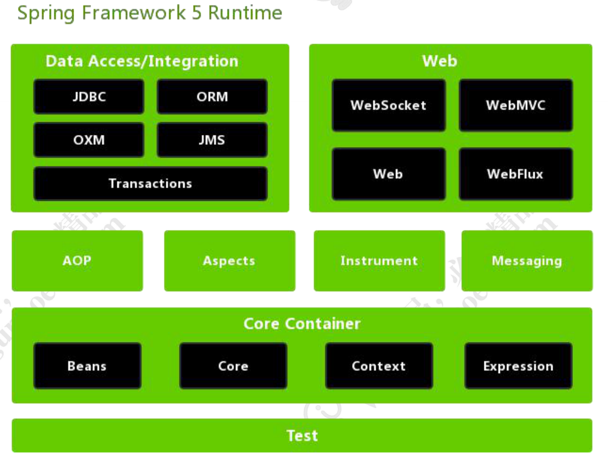

# Spring

**BOP** Bean Oriented Programming（面向 Bean 编 程）面向 Bean（普通的 Java 类）设计程序， 解放程序员。 一切从 Bean 开始。 

**AOP** Aspect Oriented Programming(面向切面编 程)找出多个类中有一定规律的代码，开发时拆 开，运行时再合并。 面向切面编程，即面向规则编程。 解耦，专人做专事。 

**IOC** Inversion of Control（控制反转） 将 new 对象的动作交给 Spring 管理，并由 Spring 保存已创建的对象（IOC 容器）。 转交控制权（即控制权反转） 

**DI/DL** Dependency Injection （ 依 赖 注 入 ） 或 者 Dependency Lookup（依赖查找） 依赖注入、依赖查找，Spring 不仅保存自己创 建的对象，而且保存对象与对象之间的关系。注入即赋值，主要三种方式构造方法、set 方法、 直接赋值。



## IOC：

IOC(Inversion of Control)控制反转：所谓控制反转，就是把原先我们代码里面需要实现的对象创 建、依赖的代码，反转给容器来帮忙实现。

### BeanFactory：

BeanFactory 作为最顶层的一个接口类，它定义了 IOC 容器的基本功能规范，BeanFactory 有三 个重要的子类：ListableBeanFactory、HierarchicalBeanFactory 和 AutowireCapableBeanFactory

### BeanDefinition：

Bean 对象在 Spring 实现中是 以 BeanDefinition 来描述的

### BeanDefintionReader：

Bean 的解析主要就是对 Spring 配置文件的解析。这个解析过程主要通过 BeanDefintionReader 来完成

### IOC容器初始化过程：

1、初始化的入口在容器实现中的 refresh()调用来完成。 

2、对 Bean 定义载入 IOC 容器使用的方法是 loadBeanDefinition(), 

通过 ResourceLoader 来完成资源文件位置的定位，DefaultResourceLoader 是默认的实现，同时上下文本身就给出了 ResourceLoader 的实现，可以从类路径，文件系统,URL 等 方式来定为资源位置。

容 器 通 过 BeanDefinitionReader 来 完 成 定 义 信 息 的 解 析 和 Bean 信 息 的 注 册

注：整个过程都只是 把Bean 封装在BeanDefinition 并没有初始化对象，在getBean的时候才初始化化，或者lazy等于false的（也是通过调用getBean来提前初始化对象）。

## DI：

1)、用户第一次调用 getBean()方法时，IOC 容器触发依赖注入。 

2)、当用户在配置文件中将< bean >元素配置了 lazy-init=false 属性，即让容器在解析注册 Bean 定义 

时进行预实例化，触发依赖注入。

### ObjectFactory：

ObjectFactory 使 用 委 派 模 式 ， 具 体 的 Bean 实 例 创 建 过 程 交 由 其 实 现 类AbstractAutowireCapableBeanFactory 完成

1)、createBeanInstance()方法，生成 Bean 所包含的 java 对象实例。 

2)、populateBean()方法，对 Bean 属性的依赖注入进行处理。

### SimpleInstantiationStrategy：

实例化Bean,getInstantiationStrategy().instantiate() 调用了 SimpleInstantiationStrategy 类中的实例化 Bean

### FactoryBean:

FactoryBean：工厂 Bean，是一个 Bean，作用是产生其他 bean 实例。

IOC里面的，BeanFactory：Bean 工厂，是一个工厂(Factory)，我们 Spring IOC 容器的最顶层接口就是这个 

BeanFactory，它的作用是管理 Bean，即实例化、定位、配置应用程序中的对象及建立这些对象间的 

依赖。 

在 getBean()方法 触发容器实例化 Bean 的时候会调用 AbstractBeanFactory 的 doGetBean()方法来进行实例化的过程


## AOP：

AOP 代理则可分为静态代理和动态代理两大类，其中静态代理是指使用 AOP 框架提供的命令进行编译，从而在编译阶段就可生成 AOP 代理类，因此也称为编译时增强；而动态代理则在运行时借助于 JDK 动态代理、CGLIB 等在内存中“临时”生成 AOP 动态代理类，因此也被称为运行时增强

Spring AOP也是对目标类增强，生成代理类。但是与AspectJ的最大区别在于---Spring AOP的运行时增强，而AspectJ是编译时增强。
 曾经以为AspectJ是Spring AOP一部分，是因为Spring AOP使用了AspectJ的Annotation。使用了Aspect来定义切面,使用Pointcut来定义切入点，使用Advice来定义增强处理。虽然使用了Aspect的Annotation，但是并没有使用它的编译器和织入器。其实现原理是JDK 动态代理，在运行时生成代理类。

1、Aspect(切面)：通常是一个类，里面可以定义切入点和通知。 

2、JointPoint(连接点)：程序执行过程中明确的点，一般是方法的调用。 

3、Advice(通知)：AOP 在特定的切入点上执行的增强处理，有 before、after、 afterReturning、afterThrowing、around

4、Pointcut(切入点)：就是带有通知的连接点，在程序中主要体现为书写切入点表达式 

AOP 框架创建的对象，实际就是使用代理对目标对象功能增强。Spring 中的 AOP 代理 可以使 JDK 动态代理，也可以是 CGLIB 代理，前者基于接口，后者基于子类。

注：**只能针对bean的使用，才能激发，如果手动新建的类或者什么，是不支持的**。支持private方法（通过其他方法调用内部private）不支持static，不支持final。使用的时候需要@Aspect，同时需要添加@Compent

添加的之内是本类，并不能监控到父类。

### execution配置：

execution(modifiers-pattern? ret-type-pattern declaring-type-pattern? name-pattern(param-pattern) throws-pattern?

modifiers-pattern：方法的操作权限 

ret-type-pattern：返回值 

declaring-type-pattern：方法所在的包 

name-pattern：方法名 

parm-pattern：参数名 

throws-pattern：异常

其 中 ， 除 **ret-type-pattern** 和 **name-pattern** 之 外 ， 其 他 都 是 可 选 的 。 上 例 中 ， execution(* 

com.spring.service.*.*(..))表示 com.spring.service 包下，返回值为任意类型；方法名任意；参数不作 

限制的所有方法。 这也是为什么一般前面有一个*

### 1）注解方式：

```java
//声明这是一个组件
@Component
//声明这是一个切面Bean  -->步骤1 定义一个切面
@Aspect
@Slf4j
public class AnnotaionAspect {
	
	//配置切入点,该方法无方法体,主要为方便同类中其他方法使用此处配置的切入点 
	@Pointcut("execution(* com.gupaoedu.vip.pattern.spring.aop.service..*(..))")
	public void aspect(){	}
	
	/*
	 * 配置前置通知,使用在方法aspect()上注册的切入点
	 * 同时接受JoinPoint切入点对象,可以没有该参数
	 */
	@Before("aspect()")
	public void before(JoinPoint joinPoint){

		log.info("before通知 " + joinPoint);
	}
	
	//配置后置通知,使用在方法aspect()上注册的切入点
	@After("aspect()")
	public void after(JoinPoint joinPoint){

		log.info("after通知  " + joinPoint);
	}
	
	//配置环绕通知,使用在方法aspect()上注册的切入点
	@Around("aspect()")
	public void around(JoinPoint joinPoint){
		long start = System.currentTimeMillis();
		try {
			((ProceedingJoinPoint) joinPoint).proceed();
			long end = System.currentTimeMillis();
			log.info("around通知 " + joinPoint + "\tUse time : " + (end - start) + " ms!");
		} catch (Throwable e) {
			long end = System.currentTimeMillis();
			log.info("around通知 " + joinPoint + "\tUse time : " + (end - start) + " ms with exception : " + e.getMessage());
		}
	}
	
	//配置后置返回通知,使用在方法aspect()上注册的切入点
	@AfterReturning("aspect()")
	public void afterReturn(JoinPoint joinPoint){
		log.info("afterReturn通知 " + joinPoint);
	}
	
	//配置抛出异常后通知,使用在方法aspect()上注册的切入点
	@AfterThrowing(pointcut="aspect()", throwing="ex")
	public void afterThrow(JoinPoint joinPoint, Exception ex){
		log.info("afterThrow通知 " + joinPoint + "\t" + ex.getMessage());
	}
	
}
```

```java
//声明这是一个组件
@Component
//声明这是一个切面Bean
@Aspect
@Slf4j
public class ArgsAspect {

	//配置切入点,该方法无方法体,主要为方便同类中其他方法使用此处配置的切入点
	@Pointcut("execution(* com.gupaoedu.vip.pattern.spring.aop.service..*(..))")
	public void aspect(){	}
	
	//配置前置通知,拦截返回值为cn.ysh.studio.spring.mvc.bean.User的方法
	@Before("execution(com.gupaoedu.vip.pattern.spring.aop.model.Member com.gupaoedu.vip.pattern.spring.aop.service..*(..))")
	public void beforeReturnUser(JoinPoint joinPoint){
		log.info("beforeReturnUser " + joinPoint);
	}

	//配置前置通知,拦截参数为cn.ysh.studio.spring.mvc.bean.User的方法
	@Before("execution(* com.gupaoedu.vip.pattern.spring.aop.service..*(com.gupaoedu.vip.pattern.spring.aop.model.Member))")
	public void beforeArgUser(JoinPoint joinPoint){
		log.info("beforeArgUser " + joinPoint);
	}

	//配置前置通知,拦截含有long类型参数的方法,并将参数值注入到当前方法的形参id中
	@Before("aspect()&&args(id)")
	public void beforeArgId(JoinPoint joinPoint, long id){
		log.info("beforeArgId " + joinPoint + "\tID:" + id);
	}
	
}
```

### 2）XML配置：

```xml
<bean id="xmlAspect" class="com.gupaoedu.vip.pattern.spring.aop.aspect.XmlAspect"></bean> <!-- AOP 配置 --> 
<aop:config> <!-- 声明一个切面,并注入切面 Bean,相当于@Aspect -->
  <aop:aspect ref="xmlAspect"> <!-- 配置一个切入点,相当于@Pointcut -->
    <aop:pointcut expression="execution(* com.gupaoedu.vip.pattern.spring.aop.service..*(..))" id="simplePointcut"/> <!-- 配置通知,相当于@Before、@After、@AfterReturn、@Around、@AfterThrowing --> 
    <aop:before pointcut-ref="simplePointcut" method="before"/> 
    <aop:after pointcut-ref="simplePointcut" method="after"/> 
    <aop:after-returning pointcut-ref="simplePointcut" method="afterReturn"/>
    <aop:after-throwing pointcut-ref="simplePointcut" method="afterThrow" throwing="ex"/> </aop:aspect>
</aop:config>
```

```java
@Slf4j
public class XmlAspect {

	
	/*
	 * 配置前置通知,使用在方法aspect()上注册的切入点
	 * 同时接受JoinPoint切入点对象,可以没有该参数
	 */
	public void before(JoinPoint joinPoint){
		log.info("" + joinPoint.getArgs()); //获取实参列表
		log.info("" + joinPoint.getKind());	//连接点类型，如method-execution
		log.info("" + joinPoint.getSignature()); //获取被调用的切点
		log.info("" + joinPoint.getTarget());	//获取目标对象
		log.info("" + joinPoint.getThis());	//获取this的值
		
		log.info("before通知 " + joinPoint);
	}
	
	//配置后置通知,使用在方法aspect()上注册的切入点
	public void after(JoinPoint joinPoint){
		log.info("after通知 " + joinPoint);
	}
	
	//配置环绕通知,使用在方法aspect()上注册的切入点
	public void around(JoinPoint joinPoint){
		long start = System.currentTimeMillis();
		try {
			((ProceedingJoinPoint) joinPoint).proceed();
			long end = System.currentTimeMillis();
			log.info("around通知 " + joinPoint + "\tUse time : " + (end - start) + " ms!");
		} catch (Throwable e) {
			long end = System.currentTimeMillis();
			log.info("around通知 " + joinPoint + "\tUse time : " + (end - start) + " ms with exception : " + e.getMessage());
		}
	}
	
	//配置后置返回通知,使用在方法aspect()上注册的切入点
	public void afterReturn(JoinPoint joinPoint){
		log.info("afterReturn通知 " + joinPoint);
	}
	
	//配置抛出异常后通知,使用在方法aspect()上注册的切入点
	public void afterThrow(JoinPoint joinPoint, Exception ex){
		log.info("afterThrow通知 " + joinPoint + "\t" + ex.getMessage());
	}
	
}
```

### SpringAOP和AspectJ AOP区别：

spring AOP属于运行时增强基于动态代理实现，AspectJ属于编译时候增强，基于字节码操作。

## MVC：

### DispatcherServlet:

SpringMVC 中的前端控制器(Front Controller), 负责接收 Request 并将 Request 转发给对应的处理组件。

### HandlerMapping:

HanlerMapping 是 SpringMVC 中 完 成 **url 到 Controller 映 射 的 组 件** 。 DispatcherServlet 接 收 Request, 然 后 从 HandlerMapping 查 找 处 理 Request 的 Controller。

### Controller：

处理 Request,并返回 ModelAndView 对象,Controller 是 SpringMVC 中负责处理 Request 的组件(类似于 Struts2 中的 Action),ModelAndView 是封装结果 视图的组件。 

### ModelAndView：

ViewResolver 视图解析器解析 ModelAndView 对象并返回对应的视图给客户端

### 九大组件：

#### HandlerMappings

HandlerMapping 是用来查找 Handler 的，也就是处理器，具体的表现形式可以是类也 可以是方法。比如，标注了@RequestMapping 的每个 method 都可以看成是一个 Handler，由 Handler 来负责实际的请求处理。 HandlerMapping 在请求到达之后， 它的作用便是找到请求相应的处理器 Handler 和 Interceptors。

#### HandlerAdapters：

因为 Spring MVC 中 Handler 可以是任意形式的，只要 能够处理请求便行, 但是把请求交给 Servlet 的时候，由于 Servlet 的方法结构都是如 doService(HttpServletRequest req, HttpServletResponse resp) 这样的形式，**让固定 的 Servlet 处理方法调用 Handler 来进行处理**，这一步工作便是 HandlerAdapter 要做 的事。 

#### HandlerExceptionResolvers：

是用来处理 Handler 过程中产生的异常情况的组件

#### ViewResolvers：

便是将 String 类型的视图名和Locale解析为View类型的视图。这个接口只有一个resolveViewName() 方法。从方法的定义就可以看出，Controller 层返回的 String 类型的视图名 viewName， 最终会在这里被解析成为View。View 是用来渲染页面的，也就是说，它会将程序返回 的参数和数据填入模板中，最终生成 html 文件

#### RequestToViewNameTranslator：

于从 Request 中获取 viewName. 因为 ViewResolver 是根据 ViewName 查找 View, 但有的 Handler 处理完成之后，没有设置 View 也没有设置 ViewName， 便要通过这个组件来从 Request 中查找 viewName。

#### LocaleResolver：

用于从 request 中解析出 Locale, 在中国大陆地区，Locale 当然就会是 zh-CN 之类， 用来表示一个区域。这个类也是 i18n 的基础。

#### ThemeResolver：

这个类是用来解析主题的。主题，就是样式，图片以及它们所形成的 显示效果的集合。Spring MVC 中一套主题对应一个 properties 文件，里面存放着跟当 前主题相关的所有资源，如图片，css 样式等。创建主题非常简单，只需准备好资源，然 后新建一个 "主题名.properties" 并将资源设置进去，放在 classpath 下，便可以在页面 中使用了

#### MultipartResolver：

MultipartResolver 用于处理上传请求，通过将普通的 Request 包装成 MultipartHttpServletRequest 来实现。MultipartHttpServletRequest 可以通过 getFile() 直接获得文件，如果是多个文件上传，还可以通过调用 getFileMap 得到 Map<FileName, File> 这样的结构。MultipartResolver 的作用就是用来封装普通 的 request，使其拥有处理文件上传的功能。

#### FlashMapManager：

说到 FlashMapManager，就得先提一下 FlashMap。 FlashMap 用于重定向 Redirect 时的参数数据传递，比如，在处理用户订单提交时，为 了避免重复提交，可以处理完 post 请求后 redirect 到一个 get 请求，这个 get 请求可以 用来显示订单详情之类的信息。这样做虽然可以规避用户刷新重新提交表单的问题，但 是在这个页面上要显示订单的信息，那这些数据从哪里去获取呢，因为 redirect 重定向 是没有传递参数这一功能的，如果不想把参数写进 url(其实也不推荐这么做，url 有长度 限制不说，把参数都直接暴露，感觉也不安全)， 那么就可以通过 flashMap 来传递

## 数据库相关：

### 1,原生方式：

```ini
spring.datasource.url=jdbc://mysql://127.0.0.1:3306/test
spring.datasource.username=root
spring.datasource.password=123456
spring.datasource.dirver-class-name=com.mysql.jdbc.Driver
```

pom定义

```xml
<dependency>
            <groupId>mysql</groupId>
            <artifactId>mysql-connector-java</artifactId>
        </dependency>
        <dependency>
            <groupId>org.springframework.boot</groupId>
            <artifactId>spring-boot-starter-jdbc</artifactId>
        </dependency>
```

应用：

```java
@RunWith(SpringRunner.class)
@SpringBootTest
public class MysqlApplicationTests {
    
    @Resource
    private JdbcTemplate jdbcTemplate;

    @Test
    public void contextLoads() {
    }
    
    @Test
    public void mysqlTest() {
        String sql = "select id,name,phone from t_user";
        List<User> userList = (List<User>) jdbcTemplate.query(sql, new RowMapper<User>() {
                    @Override
                    public User mapRow(ResultSet resultSet, int i) throws SQLException {
                        User user = new User();
                        user.setId(resultSet.getString("id"));
                        user.setName(resultSet.getString("name"));
                        user.setPhone(resultSet.getString("phone"));
                        return user;
                    }
                }
        );
        System.out.println(userList);
    }

}
```

注：单纯这样会报错，添加阿里的Druid连接池则不会

```xml
<dependency>
            <groupId>com.alibaba</groupId>
            <artifactId>druid-spring-boot-starter</artifactId>
            <version>1.1.9</version>
        </dependency>
```

#### 开启Durid监控：

默认就是开启的

http://127.0.0.1:8089/druid/index.html


如果想对特定url path加密等访问

```java
@Configuration
public class DruidConfiguration {
    @Bean
    public ServletRegistrationBean druidStatViewServlet(){
        ServletRegistrationBean servletRegistrationBean = new ServletRegistrationBean(new StatViewServlet(),"/druid/");
        //白名单
        servletRegistrationBean.addInitParameter("allow","127.0.0.1");
        //黑名单
        servletRegistrationBean.addInitParameter("deny","192.168.0.1");
        //账号
        servletRegistrationBean.addInitParameter("loginUsername","xiaoxiao");
        servletRegistrationBean.addInitParameter("loginPassword","123456");
        //是否可以重置数据
        servletRegistrationBean.addInitParameter("resetEnable","false");
        return servletRegistrationBean;
    }
    @Bean
    public FilterRegistrationBean druidStatFilter(){
        FilterRegistrationBean filterRegistrationBean = new FilterRegistrationBean(new WebStatFilter());
        filterRegistrationBean.addUrlPatterns("/*");
        filterRegistrationBean.addInitParameter("exclusions","*.js,*.gif,*.jpg,*.png,*.css,*.ico,/druid/*");
        return filterRegistrationBean;
    }
}
```

### 2）集成Spring Data JPA：

```xml
 <dependency>
            <groupId>org.springframework.boot</groupId>
            <artifactId>spring-boot-starter-data-jpa</artifactId>
        </dependency>
```

### 3）集成MyBatis：

#### 1）添加pom支持

```xml
<dependency>
            <groupId>org.mybatis.spring.boot</groupId>
            <artifactId>mybatis-spring-boot-starter</artifactId>
            <version>1.3.2</version>
        </dependency>
```

#### 2）添加配置：

```ini
#mybatis配置
mybatis.mapper-locations=classpath:/mappers/*Mapper.xml
mybatis.type-aliases-package=com.learnjava.demo.dao
```

#### 3）添加DAO：

```java
package com.learnjava.demo.dao;
@Mapper
public interface UserDAO {
    /**
     * 查找
     * @param name
     * @param phone
     * @return
     */
    User findByNameAndPhone(@Param("name") String name,@Param("phone") String phone);
}
```

注意：Mapper注解

#### 4）添加Mapper：

```xml
<?xml version="1.0" encoding="UTF-8" ?>
<!DOCTYPE mapper
        PUBLIC "-//mybatis.org//DTD Mapper 3.0//EN"
        "http://mybatis.org/dtd/mybatis-3-mapper.dtd">
<mapper namespace="com.learnjava.demo.dao.UserDAO">
    <select id="findByNameAndPhone" resultType="com.learnjava.demo.models.User">
        select * from t_user
        <where>
            name = #{name} AND phone= #{phone}
        </where>
    </select>
</mapper>
```

### 4）事务相关

事务应该具有 4 个属性：原子性、一致性、 隔离性、持久性。这四个属性通常称为 ACID 特性。 

原子性（Automicity）。一个事务是一个不可分割的工作单位，事务中包括的诸操作要 么都做，要么都不做。 

一致性（Consistency）。事务必须是使数据库从一个一致性状态变到另一个一致性状态。 一致性与原子性是密切相关的。 

隔离性（Isolation）。一个事务的执行不能被其他事务干扰。即一个事务内部的操作及 使用的数据对并发的其他事务是隔离的，并发执行的各个事务之间不能互相干扰。

持久性（Durability）。持久性也称永久性（Permanence），指一个事务一旦提交，它 对数据库中数据的改变就应该是永久性的。接下来的其他操作或故障不应该对其有任何 影响。

```java
//开启事务
@EnableTransactionManagement
//开启
@Transactional
```

```java
public @interface EnableTransactionManagement {
    boolean proxyTargetClass() default false;

  //默认模式为代理PROXY 还有一种模式是ASPECTJ
    AdviceMode mode() default AdviceMode.PROXY;

    int order() default 2147483647;
}
@Target({ElementType.METHOD, ElementType.TYPE})
@Retention(RetentionPolicy.RUNTIME)
@Inherited
@Documented
public @interface Transactional {
    @AliasFor("transactionManager")
    String value() default "";

    @AliasFor("value")
    String transactionManager() default "";

    //传播行为
    Propagation propagation() default Propagation.REQUIRED;

    //隔离级别
    Isolation isolation() default Isolation.DEFAULT;

    int timeout() default -1;

    boolean readOnly() default false;

    Class<? extends Throwable>[] rollbackFor() default {};

    String[] rollbackForClassName() default {};

    Class<? extends Throwable>[] noRollbackFor() default {};

    String[] noRollbackForClassName() default {};
}
```

#### 事务传播propagation属性：

主要解决多事务之间的嵌套问题和使用问题。

| 常量名称                  | 常量含义                                                     |
| ------------------------- | ------------------------------------------------------------ |
| PROPAGATION_REQUIRED      | 支持当前事务，如果当前没有事务，就新建 一个事务。这是最常见的选择，也是 Spring 默认的事务的传播。 |
| PROPAGATION_REQUIRES_NEW  | 新建事务，如果当前存在事务，把当前事务 挂起。新建的事务将和被挂起的事务没有任 何关系，是两个独立的事务，外层事务失败 回滚之后，不能回滚内层事务执行的结果， 内层事务失败抛出异常，外层事务捕获，也 可以不处理回滚操作 |
| PROPAGATION_SUPPORTS      | 支持当前事务，如果当前没有事务，就以非 事务方式执行。        |
| PROPAGATION_MANDATORY     | 支持当前事务，如果当前没有事务，就抛出 异常。                |
| PROPAGATION_NOT_SUPPORTED | 以非事务方式执行操作，如果当前存在事 务，就把当前事务挂起。  |
| PROPAGATION_NEVER         | 以非事务方式执行，如果当前存在事务，则 抛出异常。            |
| PROPAGATION_NESTED        | 如果一个活动的事务存在，则运行在一个嵌套的事务中。如果没有活动事务，则按 REQUIRED 属性执行。它使用了一个单独的 事务，这个事务拥有多个可以回滚的保存 点。内部事务的回滚不会对外部事务造成影 响。它只对 DataSourceTransactionManager 事务管 理器起效。 |

#### 事务隔离机制：

和MySQL等事务处理机制一样

| Spring                     | Mysql            | 解释                                                         |
| -------------------------- | ---------------- | ------------------------------------------------------------ |
| ISOLATION_DEFAULT          | 数据库默认       | 这是个 PlatfromTransactionManager 默 认的隔离级别，使用数据库默认的事务隔离 级别。另外四个与 JDBC 的隔离级别相对 应。 |
| ISOLATION_READ_UNCOMMITTED | Read-Uncommitted | 这是事务最低的隔离级别，它允许另外一个 事务可以看到这个事务未提交的数据。这种 隔离级别会产生脏读，不可重复读和幻像 读。 |
| ISOLATION_READ_COMMITTED   | Read-Committed   | 保证一个事务修改的数据提交后才能被另 外一个事务读取。另外一个事务不能读取该 事务未提交的数据。 |
| ISOLATION_REPEATABLE_READ  | Repeatable-Read  | 这种事务隔离级别可以防止脏读，不可重复 读。但是可能出现幻像读。 |
| ISOLATION_SERIALIZABLE     | Serializable     | 这是花费最高代价但是最可靠的事务隔离 级别。事务被处理为顺序执行。 |

## 常用注解：

### @Qualifier

qualifier的意思是合格者，通过这个标示，表明了哪个实现类才是我们所需要的

配合**@Autowired** 一起使用，当同一个Bean有不同的实例的时候，通过该注解选择

```java
@Autowired
@Qualifier("student1")
private Student student;
```

# ApplicationContextAware

https://www.jianshu.com/p/4c0723615a52

在我们的web程序中，用spring来管理各个实例(bean), 有时在程序中为了使用已被实例化的bean, 通常会用到这样的代码：

```java
ApplicationContext appContext = new ClassPathXmlApplicationContext("applicationContext-common.xml");  
AbcService abcService = (AbcService)appContext.getBean("abcService");  
```

但是这样就会存在一个问题：因为它会重新装载`applicationContext-common.xml`并实例化上下文bean，如果有些线程配置类也是在这个配置文件中，那么会造成做相同工作的的线程会被启两次。一次是web容器初始化时启动，另一次是上述代码显示的实例化了一次。当于重新初始化一遍！！！！这样就产生了冗余。

即使用ApplicationContextAware获取对应的上下文

```java
@Component
public class AppUtil implements ApplicationContextAware {

    private static ApplicationContext applicationContext;
    
    @Override
    public void setApplicationContext(ApplicationContext arg0) throws BeansException {
      //获取上下文
        applicationContext = arg0;
    }
    public static Object getObject(String id) {
        Object object = null;
        object = applicationContext.getBean(id);
        return object;
    }
}
```

## 事件监听：

### Bean

第一种：通过@PostConstruct 和 @PreDestroy 方法 实现初始化和销毁bean之前进行的操作

第二种是：通过 在xml中定义init-method 和  destory-method方法

第三种是： 通过bean实现InitializingBean和 DisposableBean接口

上下文关闭后

```java
@Component
@Slf4j
public class Bean1 {

    @PreDestroy
    public void destroy(){
        log.info("我是通过:@PreDestroy 关闭.......");
    }
}
```

#### DisposableBean

```java
@Component
@Slf4j
public class Bean2 implements DisposableBean {

    @Override
    public void destroy() throws Exception {
        log.info("我是通过:DisposableBean 关闭.......");
    }
}
```


```java
@Slf4j
public class Bean3 {

    public void destroy() {
        log.info("我是通过:bean  destroy关闭.......");
    }
}

@Configuration
public class Bean3Configuration {

    @Bean(destroyMethod = "destroy")
    public Bean3 initializeBean3() {
        return new Bean3();
    }
}
```

### ApplicationListener

```java
@Component
@Slf4j
public class MyApplicationListener implements ApplicationListener<ApplicationEvent> {

    @Override
    public void onApplicationEvent(ApplicationEvent event) {
        log.info("事件触发了....."+event.getClass().getName());
    }
}
```

### @EventListener

```
@Configuration
@Slf4j
public class MyEvent {

    @EventListener(classes = ApplicationEvent.class)
    public void listen(ApplicationEvent event){
        log.info("Event输出了ss....."+event.getClass().getName());
    }
}
```

常用spring boot事件：

ApplicationFailedEvent

ApplicationPreparedEvent

ApplicationReadyEvent

ApplicationStartedEvent

ApplicationStartingEvent

常用spring content事件：

ContextClosedEvent

ContextRefreshedEvent

ContextStartedEvent

ContextStoppedEvent

## 开机启动

接口是在容器启动成功后的最后一步回调（类似开机自启动）

### CommandLineRunner

### ApplicationRunner 

https://www.jianshu.com/p/5d4ffe267596

## EnvironmentPostProcessor

环境参数处理器

可以更改参数，或者添加全局参数

```java
org.apache.dubbo.spring.boot.env.DubboDefaultPropertiesEnvironmentPostProcessor
```

注意是在启动之前，log无效，需要添加META-INF/spring.factories

```ini
org.springframework.boot.env.EnvironmentPostProcessor=\
com.ec.crm.boot.application.configure.GlobalParamsBeanPostProcessor
```

## BeanPostProcessor

BeanPostProcessor是Spring IOC容器给我们提供的一个扩展接口

https://www.jianshu.com/p/1417eefd2ab1

针对bean可以添加扩展或者修改操作。

## InitializingBean

bean的初始化参数后扩展接口

```java
public interface InitializingBean {

	/**
	 * Invoked by the containing {@code BeanFactory} after it has set all bean properties
	 * and satisfied {@link BeanFactoryAware}, {@code ApplicationContextAware} etc.
	 * <p>This method allows the bean instance to perform validation of its overall
	 * configuration and final initialization when all bean properties have been set.
	 * @throws Exception in the event of misconfiguration (such as failure to set an
	 * essential property) or if initialization fails for any other reason
	 */
	void afterPropertiesSet() throws Exception;

}
```

