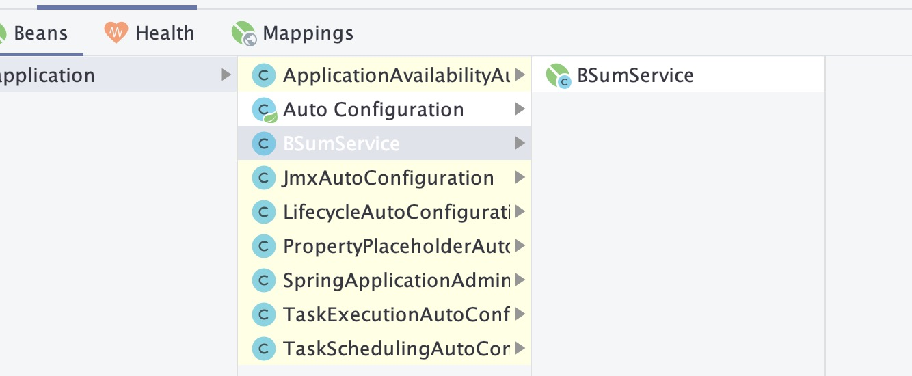
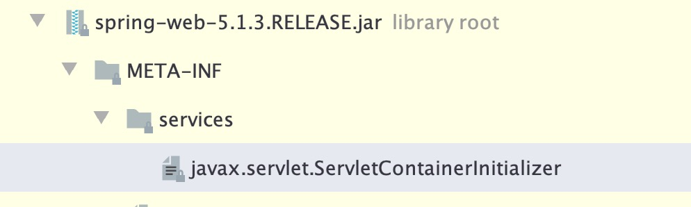
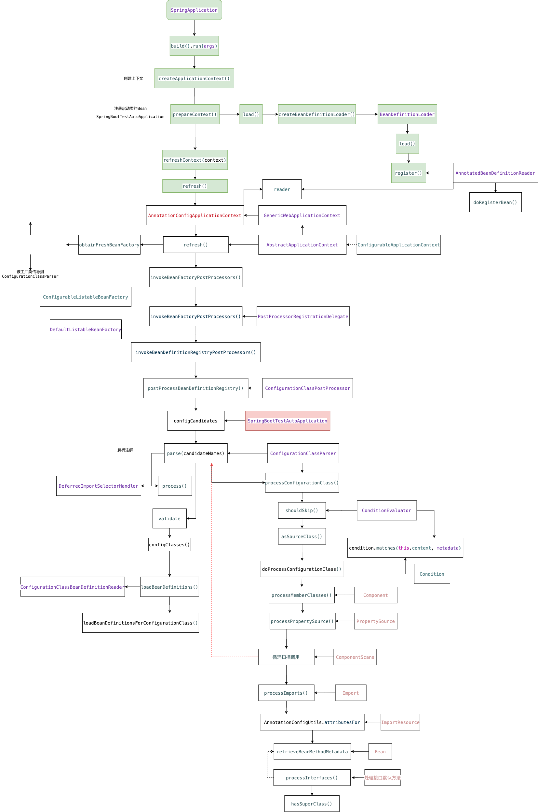

# SpringBoot深度研究

## 注解驱动：

### 注解驱动方式

#### <context:componet-scan />

ClassPathXmlApplicationContext

#### @Import

AnnotaionConfigApplicationContext

#### @ComponentScan

AnnotaionConfigApplicationContext

### 注解分类

https://springframework.guru/spring-framework-annotations/

#### Spring模式注解：

##### @Repository：

数据仓库模式注解

##### @Component：

通用组件模式注解

##### @Service：

服务模式注解

##### @Controller：

WEB控制器模式注解

##### @Configuration：

配置类模式注解

#### 装配注解：

##### @ImportResource：

替换XML<import>

##### @Import：

限定@Autowired依赖注入范围

1）加载配置类：

```java
//SchedulingConfiguration 为@Configuration标准
@Import(SchedulingConfiguration.class)
@Documented
public @interface EnableScheduling {

}
```

2）加载选择器：

```java
@Import(CachingConfigurationSelector.class)
public @interface EnableCaching
```

注：参看Enable

3）加载注册器

```java
@Import(AspectJAutoProxyRegistrar.class)
public @interface EnableAspectJAutoProxy
```

```java
class AspectJAutoProxyRegistrar implements ImportBeanDefinitionRegistrar {

	/**
	 * Register, escalate, and configure the AspectJ auto proxy creator based on the value
	 * of the @{@link EnableAspectJAutoProxy#proxyTargetClass()} attribute on the importing
	 * {@code @Configuration} class.
	 */
	@Override
	public void registerBeanDefinitions(
			AnnotationMetadata importingClassMetadata, BeanDefinitionRegistry registry) {

		AopConfigUtils.registerAspectJAnnotationAutoProxyCreatorIfNecessary(registry);

		AnnotationAttributes enableAspectJAutoProxy =
				AnnotationConfigUtils.attributesFor(importingClassMetadata, EnableAspectJAutoProxy.class);
		if (enableAspectJAutoProxy != null) {
			if (enableAspectJAutoProxy.getBoolean("proxyTargetClass")) {
				AopConfigUtils.forceAutoProxyCreatorToUseClassProxying(registry);
			}
			if (enableAspectJAutoProxy.getBoolean("exposeProxy")) {
				AopConfigUtils.forceAutoProxyCreatorToExposeProxy(registry);
			}
		}
	}

}
```

ImportBeanDefinitionRegistrar

可以动态加载bean

##### @ComponentScan：

扫描指定package下，标注Spring模式注解的类

#### 依赖注入：

##### @Autowired：

Bean依赖注入，支持多种依赖查找方式默认按照byType方式进行bean匹配.

##### @Qualifier：

细粒度的@Autowired依赖查找

注解在注解上，起到修饰的作用。

```java
//定义一个新注解
@Qualifier("BService")
public @interface BService{ ... }
//使用
@BService
@Autowired
private Service service;
//等价于 
@Qualifier("BService")
private Service service;

```

##### @Resource：

Bean依赖注入，仅支持名称依赖查找方式(JAVA原生)

```java
@Resource(name="tiger")
private Tiger tiger;

@Resource(type=Monkey.class)
private Monkey monkey;
```


#### Bean定义注解：

##### @Bean：

##### @DependsOn：

定义Bean初始化及销毁时的顺序

##### @Lazy：

 表示延迟初始化

##### @Primary：

自动装配时当出现多个Bean候选者时，被注解为@Primary的Bean将作为首选者，否则将抛出异常

##### @Role：

##### @Lookup：

##### @Scope：

用于指定scope作用域的

#### 条件装配注解：

##### @Profile：

配置化条件装配

##### @Conditional：

编程条件装配

#### 配置属性注解:

##### @PropertySource：

配置属性抽象ProertySource注解

##### @PropertySources：

PropertySource集合注解

#### 生命周期回调注解:

##### @PostConstruct：

用于指定初始化方法

##### @PreDestroy：

用于指定销毁方法

#### 注解属性注解:

##### @Aliasfor：

别名注解属性，实现复用目的，将一个或者多个注解的属性"别名"到某个注解中，

```java
//互相别名
@Import(EntityScanPackages.Registrar.class)
public @interface EntityScan {
  @AliasFor("basePackages")
	String[] value() default {};
  @AliasFor("value")
	String[] basePackages() default {};
}
```

##### @Inherited：

表示该注解可以被继承

#### 性能注解：

##### @Indexed：

添加索引，编译的时候->自动生成MATE-INF/spring.components文件，用以快速启动，

### 注解编程模型

#### 元注解Meta-Annotations：

一个能够声明在其他注解上的注解，如一个注解标注在其他注解上，那么它就是元注解。

@Documented为所有注解的元注解，java里面的:@Inherited(继承)，@Repeatable

#### Spring模式注解Stereotype-Annotations：

凡事被@Conponent元注解标注的注解，因为注解不能继承，所以通过此方式，达到派生。

#### Spring组合注解 Composed-Annotations：

通过在某个注解上添加一个或多个其他标记注解，达到组合成一个新的注解。如@SpringBootApplication

#### Spring注解属性别名和覆盖：

即注解组合实现的时候，属性重名(优先就近)，属性覆盖：隐式覆盖(高低顺序)，显示(@Aliasfor)

## Spring注解驱动设计模式:

### @Enable模块驱动

@EnableWebmvc，....

#### 1）注解驱动实现

```java
//1 新增配置类
@Configuration
public class HiConfiguration {

    @Bean
    public String hi(){
        return "Hi BorgXiao!";
    }
}
//2 添加注解
@Import(HiConfiguration.class)
public @interface EnableHi {
}

//引入使用
@EnableHi
@Configuration
public class SpringBootTestEnableApplication {

    public static void main(String[] args) {
        //构建spring 注解驱动上下文
        AnnotationConfigApplicationContext context = new AnnotationConfigApplicationContext();
        //注册引导类
        context.register(SpringBootTestEnableApplication.class);
        //启动上下文
        context.refresh();
        String hi = context.getBean("hi",String.class);
        System.out.println(hi);
        //关闭上下文
        context.close();
    }

}
```


#### 2）接口编程实现

需要实现ImportSelector或ImportBeanDefinitionRegiststrar接口

```java
//添加注解
@Import(ServerImportSelector.class)
public @interface EnableServer {
    Server.Type type();
}
//区别是不需要标准configuration
public class ServerImportSelector implements ImportSelector {

    @Override
    public String[] selectImports(AnnotationMetadata annotationMetadata) {
        Map<String,Object> stringObjectMap = annotationMetadata.getAnnotationAttributes(
                EnableServer.class.getName());

        Server.Type  type = (Server.Type )stringObjectMap.get("type");
        String[] classNames = new String[0];
        switch (type){
            case HTTP:
                classNames = new String[]{HttpServer.class.getName()};
                break;
            case FTP:
                classNames = new String[]{FtpServer.class.getName()};
                break;
        }
        return classNames;
    }
}
@EnableHi
@Configuration
@EnableServer(type = Type.FTP)
public class SpringBootTestEnableApplication {

    public static void main(String[] args) {
        //构建spring 注解驱动上下文
        AnnotationConfigApplicationContext context = new AnnotationConfigApplicationContext();
        //注册引导类
        context.register(SpringBootTestEnableApplication.class);
        //启动上下文
        context.refresh();
        String hi = context.getBean("hi",String.class);
        System.out.println(hi);

        Server server = context.getBean(Server.class);
        server.start();
        //关闭上下文
        context.close();
    }

}
```

#### 

### Spring条件装配：

#### @Profile：

```java
public interface SumService {
    void sum();
}
@Service
@Profile("A")
public class ASumService implements SumService {

    @Override
    public void sum() {
        System.out.println("AAAAAAAAA");
    }
}
@Service
@Profile("B")
public class BSumService implements SumService{

    @Override
    public void sum() {
        System.out.println("BBBBBB");
    }
}
@SpringBootApplication(scanBasePackages = {"org.borg.spring.boot.test.condition.service"})
public class ProfileBootstrap {

    public static void main(String[] args) {
        CountDownLatch countDownLatch = new CountDownLatch(1);
        ConfigurableApplicationContext context = new SpringApplicationBuilder(
                ProfileBootstrap.class).web(
                WebApplicationType.NONE).profiles("B").run(args);
        SumService sumService = context.getBean(SumService.class);
        sumService.sum();
        try {
            countDownLatch.await();
        } catch (InterruptedException e) {
            e.printStackTrace();
        }
    }
}
```




#### @Conditional：

继承Condition接口

OnClassCondition，xxx

```java
@Conditional(OnMyPropertyCondition.class)
public @interface ConditionalOnMyProperty {
    String name();
}
public class OnMyPropertyCondition implements Condition {
    
    @Override
    public boolean matches(ConditionContext context, AnnotatedTypeMetadata metadata) {
        //读取注解上的参数
        Map<String,Object> objectMap = metadata.getAnnotationAttributes(ConditionalOnMyProperty.class.getName());
        String name = objectMap.get("name").toString();
        //读取系统参数
        String sysName = System.getProperty("spring.test.name");

        //判断系统的参数和配置的是否一致
        return name.equals(sysName);
    }
}
public class ConditionalBootstrap {
    static{
        //设置系统参数
        System.setProperty("spring.test.name","BorgXiao");
    }

    //注册bean
    @Bean
    @ConditionalOnMyProperty(name = "BorgXiao")
    public String crm(){
        return "EC-CRM";
    }
    public static void main(String[] args) {

        ConfigurableApplicationContext context = new SpringApplicationBuilder(ConditionalBootstrap.class)
                .web(WebApplicationType.NONE)
                .run(args);
        // 通过名称和类型获取 helloWorld Bean
        String crm = context.getBean("crm", String.class);

        System.out.println(crm);

        // 关闭上下文
        context.close();
    }
}
```

注：匹配则会注册bean,不匹配不注册

OnClassCondition->FilteringSpringBootCondition->SpringBootCondition->Condition

##### 属性配置：

```java

@ConditionalOnProperty(prefix = "spring.aop", name = "auto", havingValue = "true", matchIfMissing = true)
```

##### 条件表达式：

```java
@ConditionalOnExpression("${endpoints.jmx.enabled:true} && ${spring.jmx.enabled:true}")
```

### Spring Web装配原理：

#### WEB加载原理：

https://blog.csdn.net/J080624/article/details/80016905

1）AnnotationConfigServletWebServerApplicationContext

SpringApplication 通过spring.factories加载

```java
setInitializers((Collection) getSpringFactoriesInstances(
      ApplicationContextInitializer.class));
```

```java
public static final String DEFAULT_CONTEXT_CLASS = "org.springframework.context."
			+ "annotation.AnnotationConfigApplicationContext";

	/**
	 * The class name of application context that will be used by default for web
	 * environments.
	 */
	public static final String DEFAULT_WEB_CONTEXT_CLASS = "org.springframework.boot."
			+ "web.servlet.context.AnnotationConfigServletWebServerApplicationContext";

	private static final String[] WEB_ENVIRONMENT_CLASSES = { "javax.servlet.Servlet",
			"org.springframework.web.context.ConfigurableWebApplicationContext" };

protected ConfigurableApplicationContext createApplicationContext() {
		Class<?> contextClass = this.applicationContextClass;
		if (contextClass == null) {
			try {
				switch (this.webApplicationType) {
				case SERVLET:
					contextClass = Class.forName(DEFAULT_WEB_CONTEXT_CLASS);
					break;
				case REACTIVE:
					contextClass = Class.forName(DEFAULT_REACTIVE_WEB_CONTEXT_CLASS);
					break;
				default:
					contextClass = Class.forName(DEFAULT_CONTEXT_CLASS);
				}
			}
			catch (ClassNotFoundException ex) {
				throw new IllegalStateException(
						"Unable create a default ApplicationContext, "
								+ "please specify an ApplicationContextClass",
						ex);
			}
		}
		return (ConfigurableApplicationContext) BeanUtils.instantiateClass(contextClass);
	}
```

AnnotationConfigServletWebServerApplicationContext(spring-boot)->ServletWebServerApplicationContext(spring-boot)->GenericWebApplicationContext(spring-web)->GenericApplicationContext(spring-context)->AbstractApplicationContext(spring-context)

2）ServletWebServerApplicationContext

```java
@Override
	protected void onRefresh() {
		super.onRefresh();
		try {
			createWebServer();
		}
		catch (Throwable ex) {
			throw new ApplicationContextException("Unable to start web server", ex);
		}
	}
//启动
getSelfInitializer().onStartup(servletContext);

//加载ServletContextInitializer
private void selfInitialize(ServletContext servletContext) throws ServletException {
		prepareWebApplicationContext(servletContext);
		registerApplicationScope(servletContext);
		WebApplicationContextUtils.registerEnvironmentBeans(getBeanFactory(), servletContext);
		for (ServletContextInitializer beans : getServletContextInitializerBeans()) {
			beans.onStartup(servletContext);
		}
	}
```

```java
ServletContextInitializerBeans extends AbstractCollection<ServletContextInitializer>
```

3）SPI：SpringServletContainerInitializer->ServletContainerInitializer



org.springframework.web.SpringServletContainerInitializer

#### 自定义实现web mvc

1）添加pom.xml

```xml
 <!-- 很重要 -->
<packaging>war</packaging>
<dependencies>
    <dependency>
      <groupId>javax.servlet</groupId>
      <artifactId>javax.servlet-api</artifactId>
      <version>3.0.1</version>
      <scope>provided</scope>
    </dependency>
    <dependency>
      <groupId>org.springframework</groupId>
      <artifactId>spring-webmvc</artifactId>
    </dependency>
  </dependencies>

  <build>
    <plugins>
      <plugin>
        <groupId>org.apache.maven.plugins</groupId>
        <artifactId>maven-war-plugin</artifactId>
        <configuration>
          <!--忽略错误 当web.xml不存在的时候 -->
          <failOnMissingWebXml>false</failOnMissingWebXml>
        </configuration>
      </plugin>
      <plugin>
        <groupId>org.apache.tomcat.maven</groupId>
        <artifactId>tomcat7-maven-plugin</artifactId>
        <version>2.1</version>
        <executions>
          <execution>
            <id>tomcat-run</id>
            <goals>
              <!--最终打包成可执行文件jar包 -->
              <goal>exec-war-only</goal>
            </goals>
            <phase>package</phase>
            <configuration>
              <!--serveletContext路径 -->
              <path>/</path>
            </configuration>
          </execution>
        </executions>
      </plugin>
    </plugins>
  </build>
```

2）添加@controller

```java
@Controller
public class HiController {
    @RequestMapping
    @ResponseBody
    public String hi(){
        return "Hi";
    }
}
```

3）添加WebInitializer

```java
public class MyWebInitializer extends AbstractAnnotationConfigDispatcherServletInitializer {

    @Override
    protected Class<?>[] getRootConfigClasses() {
        return new Class[0];
    }

    @Override
    protected Class<?>[] getServletConfigClasses() {
        return of(MyWebMvcConfiguration.class);
    }

    @Override
    protected String[] getServletMappings() {
        return of("/*");
    }
    private static <T> T[] of(T... values){
        return values;
    }
}
```

4）添加配置：

```java
@EnableWebMvc
@Configuration
@ComponentScan(basePackages = {"org.borg.spring.boot.test.web"})
public class MyWebMvcConfiguration {
}
```

5）打包，然后执行:java -jar target/spring-boot-test-web-0.0.1-SNAPSHOT-war-exec.jar 


## Spring Boot自动装配：

@EnableAutoConfiguration作用就是从classpath中搜寻所有的**META-INF/spring.factories配置文件**，并将其中org.springframework.boot.autoconfigure.EnableutoConfiguration对应的配置项通过反射（Java Refletion）**实例化为对应的标注了@Configuration的JavaConfig形式的IoC容器配置类**，然后汇总为一个并加载到IoC容器。这些功能配置类要生效的话，会去classpath中找是否有该类的依赖类（也就是pom.xml必须有对应功能的jar包才行）并且配置类里面注入了默认属性值类，功能类可以引用并赋默认值。生成功能类的原则是自定义优先，没有自定义时才会使用自动装配类。

https://www.cnblogs.com/loongk/p/11973642.html

### 自动装配：

@EnableAutoConfiguration

```java
@AutoConfigurationPackage
@Import({AutoConfigurationImportSelector.class})
public @interface EnableAutoConfiguration {
    String ENABLED_OVERRIDE_PROPERTY = "spring.boot.enableautoconfiguration";
  //按类型排除
    Class<?>[] exclude() default {};
  //按照名称排除
    String[] excludeName() default {};
}

public class AutoConfigurationImportSelector implements DeferredImportSelector
public interface DeferredImportSelector extends ImportSelector
```

AutoConfigurationImportSelector->DeferredImportSelector->ImportSelector

```java
//解析@Import
ConfigurationClassParser.processImports();
//加载对应的配置
ImportSelector.selectImports()
//对应实现  
AutoConfigurationExcludeFilter.getAutoConfigurations();
AutoConfigurationImportSelector.getCandidateConfigurations();
ImportAutoConfigurationImportSelector.loadFactoryNames();
```

1）**SpringFactoriesLoader**#loadFactoryNames：读取META-INF/spring.factorties资源中@EnableAutoConfiguration关联的Class

2）读取当前配置的数exclude和excludeName，并与配置项spring.autoconfigure.execlude里面的属性合并为自动装配class排除集合。

3）检查自动装配的Class排除集合是否合法。

4）排除候选自动装配Class集合中的排除名单。

5）再次过滤候选自动装配Class集合中class不存在的成员。

注：引导页只要被@EnableAutoConfiguration 注解的即可

自动装配类能够打包到外部的JAR文件中，并且被Spring Boot装载，同时自动装配也能被关联到"starter"中。

#### 自定义：

1）定义需要装配的Bean

```java
package org.borg.spring.boot.test.auto.configuration;
@Configuration
public class HelloWorldAutoConfiguration {

    /**
     * 装配我自己需要的Bean
     * @return
     */
    @Bean
    public String helloWorld(){
        return "HelloWorld...";
    }
}

```

2）添加META-INF/spring.factorties配置

```ini
org.springframework.boot.autoconfigure.EnableAutoConfiguration=\
  org.borg.spring.boot.test.auto.configuration.HelloWorldAutoConfiguration
```

3）开启自动装配@EnableAutoConfiguration

```java
package org.borg.spring.boot.test.auto;
@EnableAutoConfiguration
public class SpringBootTestAutoApplication {

    public static void main(String[] args) {
        ConfigurableApplicationContext context = new SpringApplicationBuilder(SpringBootTestAutoApplication.class)
                .web(WebApplicationType.NONE)
                .run(args);

        // helloWorld Bean 是否存在
        String helloWorld =
                context.getBean("helloWorld", String.class);

        System.out.println("helloWorld Bean : " + helloWorld);
        // 关闭上下文
        context.close();
    }
}
```

#### 事件监听：

AutoConfigurationImportListener

#### 失效：

1）使用@EnableAutoConfiguration exclude和excludeName

2）配置:spring.autoconfigure.execlude

#### 排序

```java
@AutoConfigureAfter
@AutoConfigureBefore
@AutoConfigureOrder
```

## 自定义starter：

官方：spring-boot-starter-xxx

自定义:xxx-spring-boot-starter

### pom.xml依赖

```xml
<dependency>
			<groupId>org.springframework.boot</groupId>
			<artifactId>spring-boot-starter</artifactId>
			<optional>true</optional>
		</dependency>
<!--
		<dependency>
			<groupId>org.springframework.boot</groupId>
			<artifactId>spring-boot-configuration-processor</artifactId>
			<optional>true</optional>
		</dependency>
-->

<plugin>
				<groupId>org.apache.maven.plugins</groupId>
				<artifactId>maven-source-plugin</artifactId>
				<executions>
					<execution>
						<phase>package</phase>
						<goals>
							<goal>jar-no-fork</goal>
						</goals>
					</execution>
				</executions>
			</plugin>
```

注：注意打包方式

### 1）@Enable驱动方式

参考Enbale模块驱动

使用方式：引入对应的starter包，然后启动类添加@EnableXxx

注：同理即通过手动导入或者手动包扫描

### 2）自动装配方式

参考自动装配

使用方式：保证启动类，有@EnableAutoConfiguration注解即可。

### 备注:

结合**条件装配**，既可以自定义实现功能复杂的starter。

即参照条件装配

## 理解SpringBootApplication

### @SpringBootApplication

```java
@SpringBootConfiguration
@EnableAutoConfiguration
@ComponentScan(
    excludeFilters = {@Filter(
    type = FilterType.CUSTOM,
    classes = {TypeExcludeFilter.class}
), @Filter(
    type = FilterType.CUSTOM,
    classes = {AutoConfigurationExcludeFilter.class}
)}
)
public @interface SpringBootApplication {
  @AliasFor(
        annotation = EnableAutoConfiguration.class
    )
    Class<?>[] exclude() default {};

    @AliasFor(
        annotation = EnableAutoConfiguration.class
    )
    String[] excludeName() default {};

    @AliasFor(
        annotation = ComponentScan.class,
        attribute = "basePackages"
    )
    String[] scanBasePackages() default {};

    @AliasFor(
        annotation = ComponentScan.class,
        attribute = "basePackageClasses"
    )
    Class<?>[] scanBasePackageClasses() default {};
}

@Configuration
public @interface SpringBootConfiguration {
}
@Component
public @interface Configuration {
    @AliasFor(
        annotation = Component.class
    )
    String value() default "";
}
```

### 流程图：



