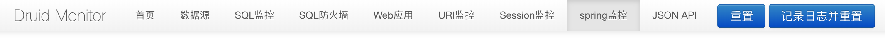

# SpringBoot 数据库实践

## 1,原生方式：

```ini
spring.datasource.url=jdbc://mysql://127.0.0.1:3306/test
spring.datasource.username=root
spring.datasource.password=123456
spring.datasource.dirver-class-name=com.mysql.jdbc.Driver
```

```xml
<dependency>
            <groupId>mysql</groupId>
            <artifactId>mysql-connector-java</artifactId>
        </dependency>
        <dependency>
            <groupId>org.springframework.boot</groupId>
            <artifactId>spring-boot-starter-jdbc</artifactId>
        </dependency>
```

```java
@RunWith(SpringRunner.class)
@SpringBootTest
public class MysqlApplicationTests {
    
    @Resource
    private JdbcTemplate jdbcTemplate;

    @Test
    public void contextLoads() {
    }
    
    @Test
    public void mysqlTest() {
        String sql = "select id,name,phone from t_user";
        List<User> userList = (List<User>) jdbcTemplate.query(sql, new RowMapper<User>() {
                    @Override
                    public User mapRow(ResultSet resultSet, int i) throws SQLException {
                        User user = new User();
                        user.setId(resultSet.getString("id"));
                        user.setName(resultSet.getString("name"));
                        user.setPhone(resultSet.getString("phone"));
                        return user;
                    }
                }
        );
        System.out.println(userList);
    }

}
```

注：单纯这样会报错，添加阿里的Druid连接池则不会

```xml
<dependency>
            <groupId>com.alibaba</groupId>
            <artifactId>druid-spring-boot-starter</artifactId>
            <version>1.1.9</version>
        </dependency>
```

### 开启Druid的监控

默认就是开启的

http://127.0.0.1:8089/druid/index.html



如果想对特定url path加密等访问

```java
@Configuration
public class DruidConfiguration {
    @Bean
    public ServletRegistrationBean druidStatViewServlet(){
        ServletRegistrationBean servletRegistrationBean = new ServletRegistrationBean(new StatViewServlet(),"/druid/");
        //白名单
        servletRegistrationBean.addInitParameter("allow","127.0.0.1");
        //黑名单
        servletRegistrationBean.addInitParameter("deny","192.168.0.1");
        //账号
        servletRegistrationBean.addInitParameter("loginUsername","xiaoxiao");
        servletRegistrationBean.addInitParameter("loginPassword","123456");
        //是否可以重置数据
        servletRegistrationBean.addInitParameter("resetEnable","false");
        return servletRegistrationBean;
    }
    @Bean
    public FilterRegistrationBean druidStatFilter(){
        FilterRegistrationBean filterRegistrationBean = new FilterRegistrationBean(new WebStatFilter());
        filterRegistrationBean.addUrlPatterns("/*");
        filterRegistrationBean.addInitParameter("exclusions","*.js,*.gif,*.jpg,*.png,*.css,*.ico,/druid/*");
        return filterRegistrationBean;
    }
}
```

```ini
#开启监控统计拦截的filters
spring.datasource.filters=stat,wall,log4j
#开启mergeSql和慢查询日志
spring.datasource.druid.connection-properties=druid.stat.mergeSql=true;druid.stat.slowSqlMills=5000
```

更多学习：https://github.com/alibaba/druid/wiki

## 2，集成Spring Data JPA

```xml
        <dependency>
            <groupId>org.springframework.boot</groupId>
            <artifactId>spring-boot-starter-data-jpa</artifactId>
        </dependency>
```

实验失败：找不到对应的包


### 3，集成MyBatis

#### 添加pom依赖

```xml
<dependency>
            <groupId>org.mybatis.spring.boot</groupId>
            <artifactId>mybatis-spring-boot-starter</artifactId>
            <version>1.3.2</version>
        </dependency>
```

#### 添加配置

```ini
#mybatis配置
mybatis.mapper-locations=classpath:/mappers/*Mapper.xml
mybatis.type-aliases-package=com.learnjava.demo.dao
```

#### 添加dao

```java
package com.learnjava.demo.dao;
@Mapper
public interface UserDao {
    /**
     * 查找
     * @param name
     * @param phone
     * @return
     */
    User findByNameAndPhone(@Param("name") String name,@Param("phone") String phone);
}
```

注意：Mapper注解

#### 添加mappers/UserMapper.xml

```xml
<?xml version="1.0" encoding="UTF-8" ?>
<!DOCTYPE mapper
        PUBLIC "-//mybatis.org//DTD Mapper 3.0//EN"
        "http://mybatis.org/dtd/mybatis-3-mapper.dtd">
<mapper namespace="com.learnjava.demo.dao.UserDao">
    <select id="findByNameAndPhone" resultType="com.learnjava.demo.models.User">
        select * from t_user
        <where>
            name = #{name} AND phone= #{phone}
        </where>
    </select>
</mapper>
```

添加对应服务和测试即可使用

## 4，声明式事务

```java
//开启事务
@EnableTransactionManagement
//开启
@Transactional
```

```java
public @interface EnableTransactionManagement {
    boolean proxyTargetClass() default false;

  //默认模式为代理PROXY 还有一种模式是ASPECTJ
    AdviceMode mode() default AdviceMode.PROXY;

    int order() default 2147483647;
}
```

```java
@Target({ElementType.METHOD, ElementType.TYPE})
@Retention(RetentionPolicy.RUNTIME)
@Inherited
@Documented
public @interface Transactional {
    @AliasFor("transactionManager")
    String value() default "";

    @AliasFor("value")
    String transactionManager() default "";

    //传播行为
    Propagation propagation() default Propagation.REQUIRED;

    //隔离级别
    Isolation isolation() default Isolation.DEFAULT;

    int timeout() default -1;

    boolean readOnly() default false;

    Class<? extends Throwable>[] rollbackFor() default {};

    String[] rollbackForClassName() default {};

    Class<? extends Throwable>[] noRollbackFor() default {};

    String[] noRollbackForClassName() default {};
}
```

### 传播行为Propagation

| 传播行为      | 含义                               |
| ------------- | ---------------------------------- |
| REQUIRED      | 默认行为，有则用，没有则创建       |
| SUPPORTS      | 有则用，没有则不用                 |
| MANDATORY     | 有则用，没有就抛异常               |
| REQUIRES_NEW  | 自己新建事务，把当前的事务挂起     |
| NOT_SUPPORTED | 非事务执行，当前有则挂起           |
| NEVER         | 非事务执行，当前有则抛出异常       |
| NESTED        | 有，则在嵌套事务内执行，没有则创建 |

所谓传播行为，就是在事务调用事务的时候的一种设置。

### 隔离级别isolation

| 隔离级别         | 含义                                                         |
| ---------------- | ------------------------------------------------------------ |
| DEFAULT          | 使用数据库默认的事务隔离级别                                 |
| READ_UNCOMMITTED | 最低级别，准许另外一个事务可以看到这个事务未提交的数据，会产生脏读，不可重复都和幻读 |
| READ_COMMITTED   |                                                              |
| REPEATABLE_READ  |                                                              |
| SERIALIZABLE     |                                                              |

#### 脏读：

一个事务

