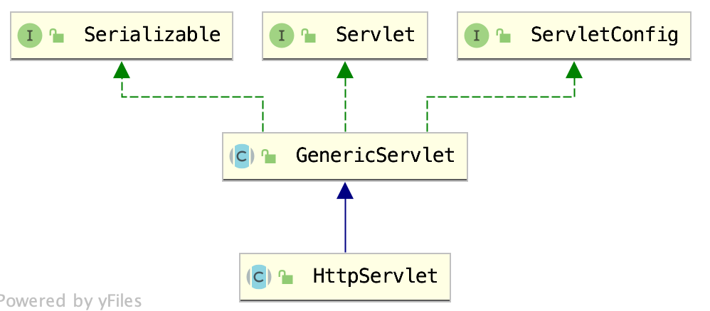
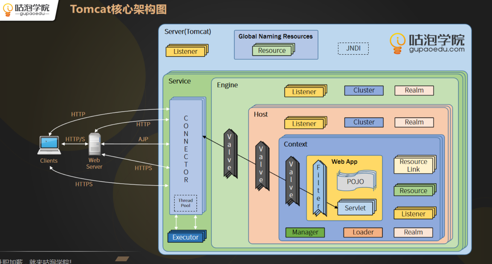

# Java Web

## Servlet

Servlet(Server Applet) 是基于 Java 技术的 web 组件,该组件由容器托管,用于生成动态内容。他是用Java编写的服务器端程序。其主要功能在于交互式地浏览和修改数据，生成动态Web内容。

Servlet的生命周期有四个阶段：加载并实例化、初始化、请求处理、销毁。主要涉及到的方法有`init`、`service`、`doGet`、`doPost`、`destory`等

Servlet容器通过维护一个线程池来处理多个请求，线程池中维护的是一组工作者线程（Worker Thread）。Servlet容器通过一个调度线程（Dispatcher Thread）来调度线程池中的线程。

**Servlet对象是单实例多线程，Servlet不是线程安全的** 

注：所谓的不安全注意是单实例，避免使用共享变量。

```java
ServerSocket server = new ServerSocket(8090);
Socket socket = server.accept();
```


```java

public class MyServlet extends HttpServlet{
 private static final long serialVersionUID = 1L;

 private String userName1 = null;//实例变量

 @Override
 protected void doGet(HttpServletRequest req, HttpServletResponse resp)
         throws ServletException, IOException{
  userName1 = req.getParameter("userName1");

  String userName2 = req.getParameter("userName2");//局部变量

  //TODO 其他处理
 }
}
```



```java
public interface Servlet {
	void init(ServletConfig config) throws ServletException;
	ServletConfig getServletConfig();
	void service(ServletRequest req, ServletResponse res)throws ServletException,IOException;
  String getServletInfo();
  void destroy();
}
```

## Tomcat：



https://tomcat.apache.org/tomcat-8.0-doc/architecture/overview.html

### Tomcat核心组件

#### Server：

表示一个整体的容器，提供对应接口。

#### Service：

是一个中间组件，它位于服务器内部，并将一个或多个连接器绑定到一个引擎上。

#### Engine：

引擎表示特定服务的请求处理管道。

#### Host：

主机是网络名称的关联，例如。www.yourcompany.com网站，到Tomcat服务器。一个引擎可以包含多个主机，并且主机元素还支持网络别名，例如yourcompany.com网站以及abc.yourcompany.com网站

#### Connector:

连接器处理与客户端的通信。Tomcat提供了多个连接器。其中包括用于大多数HTTP流量的HTTP连接器，尤其是当Tomcat作为独立服务器运行时，以及AJP连接器，它实现了将Tomcat连接到web服务器（如apachehttpd服务器）时使用的AJP协议。创建自定义连接器是一项重要的工作

主要负责处理Socket连接，以及Request与Response的转化

#### Context:

上下文表示web应用程序。一个主机可以包含多个上下文，**每个上下文都有一个唯一的路径**。类似a.com/mysql/,a.com/apache/ ，即路径前缀。

