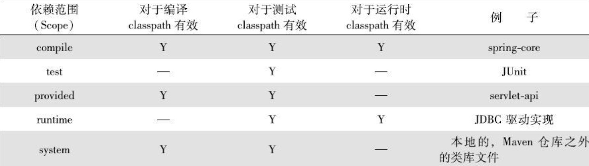

# Maven实战

## 1）基础知识

pom.xml （Project Object Model，项目对象模型）

### 配置项：

坐标

| 关键字                | 说明                                                         |
| --------------------- | ------------------------------------------------------------ |
| groupId               | 组，组织，项目等                                             |
| artifactId            | 具体模块                                                     |
| version               | 具体的版本号，SHAPSHOT 快照                                  |
| scope                 | 依赖范围，默认compile, 即在编译的哪个阶段用，如为test,表示只在测试的时候依赖有效，provided已提供的依赖范围，runtime运行时候的依赖范围，system系统依赖范围 |
| packaging             | 打包方式，默认为jar, 可以定义为war                           |
| classifiler           | 构建附属构件 如javadoc,sources                               |
| type                  | 依赖类型，默认为jar,正常情况下不需要制定                     |
| optional              | 标记依赖是否可选true/false（默认）                           |
| exclusions，exclusion | 用来排除依赖，只需要制定groupId和artifactId即可，不需要指定version等其他 |

注：scope 的作用是因为，测试，编译，运行的时候classpath不一致。所以有特殊情况下需要特殊制定。

#### scope详解：

1）compile：编译，测试，运行都有效（默认）

2）test：测试的时候有效如JUnit的依赖

3）provided：编译，测试有效，如servlet-api在编译的时候需要，但运行的时候不需要，因为容器已经提供，所以就不需要重复引入一遍

4）runtime：运行的时候有效，如jdbc的驱动。在编译和测试的时候只需要jdbc的jdk接口，在运行的时候才需要核心代码。

5）system：系统依赖范围，编译，测试有效，此依赖不是特殊制定本机特殊仓库绑定。




#### 传递依赖：

如项目需要引入包1，包1有自己的依赖，关系，如果不传递依赖，那就需要在项目中制定包1的依赖，一层层下去很麻烦，所以需要传递依赖，maven根据引入的包1，会自动引入包1依赖的包2，即包2就传递到了项目中来，项目对包1是第一直接依赖，包1对于包2是第2直接依赖，项目对包2是传递性依赖。

第2依赖是：compile,第一和传递性依赖一致

第2依赖是：test，依赖不会传递

第2依赖是：provided，值传递第一依赖范围为provided的依赖，且传递性依赖依然是provided

#### 依赖调解：

a->b->c->x(1.0) ,a->d->x(2.0)，x是a的传递依赖，这个时候a会使用哪个一个版本呢？所以需要maven依赖调解，

1）路径最近者优先，例子中x(2.0)的距离最近，会被解析使用。

2）第一声明者优先，如果路径相等，则谁先在pom中定义，加载谁。

#### 可选依赖optional：

a->b,b->x(可选),b->y(可选)

如果b中的x和y不指定可选，那就直接传递依赖了，假如都是compile，**指定可选，x,y将不会对a有任何影响**。

为什么需要可选，如b的项目，x和y是两种互斥特性，如Mysql和PostgreSQL，这样就方便了使用方自己控制使用哪一个。

注：理想情况下不应该使用可选依赖，应该单一原则，制定2个包。

### mvn 命令：

| 命令               | 说明                                           |
| ------------------ | ---------------------------------------------- |
| archetype:generate | 脚手架，即快速生成项目，注意，maven2不是该方式 |
| dependency:list    | 查看依赖                                       |
| dependency:tree    | 查看依赖树                                     |
| dependency:analyze | 分析当前项目的依赖                             |
|                    |                                                |

## 2）最佳实践

### 排除依赖：

传递性依赖，会给项目隐式的引入很多依赖，所以假如项目里面使用到了某个包，而该包又存在依赖性传递，则需要排除。

### 归类依赖：

如springwork有很多包，需要升级的时候一般是统一升级。

1）指定统一版本号

```xml
<properties>
	<springframewor.version>2.5.6</springframewor.version>
</properties
```

