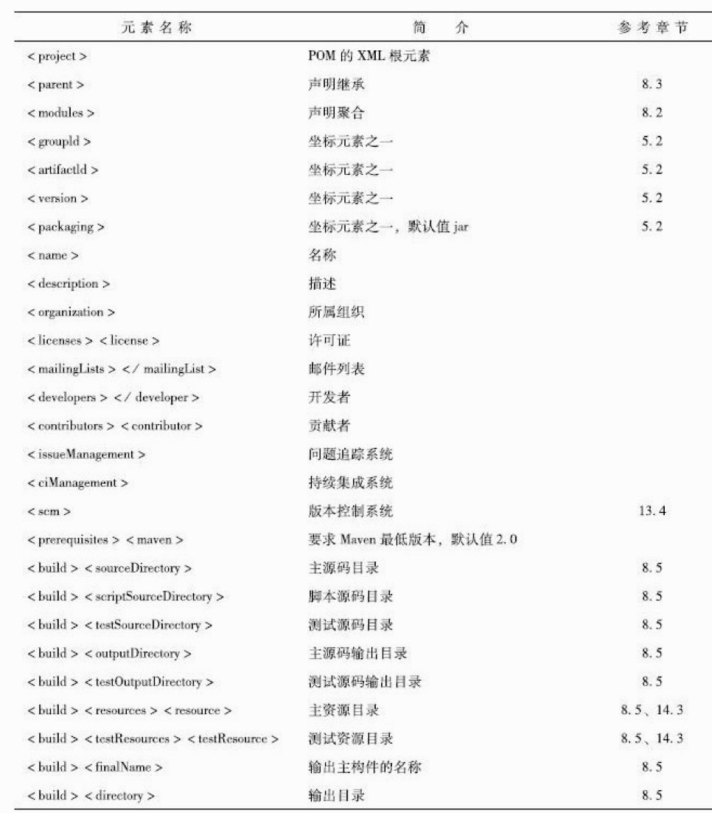

# Maven实战

## 1）基础知识

pom.xml （Project Object Model，项目对象模型）

### 配置项：

坐标

| 关键字                | 说明                                                         |
| --------------------- | ------------------------------------------------------------ |
| groupId               | 组，组织，项目等                                             |
| artifactId            | 具体模块                                                     |
| version               | 具体的版本号，SHAPSHOT 快照                                  |
| scope                 | 依赖范围，默认compile, 即在编译的哪个阶段用，如为test,表示只在测试的时候依赖有效，provided已提供的依赖范围，runtime运行时候的依赖范围，system系统依赖范围 |
| packaging             | 打包方式，默认为jar, 可以定义为war                           |
| classifiler           | 构建附属构件 如javadoc,sources                               |
| type                  | 依赖类型，默认为jar,正常情况下不需要制定                     |
| optional              | 标记依赖是否可选true/false（默认）                           |
| exclusions，exclusion | 用来排除依赖，只需要制定groupId和artifactId即可，不需要指定version等其他 |

注：scope 的作用是因为，测试，编译，运行的时候classpath不一致。所以有特殊情况下需要特殊制定。

#### scope详解：


##### 1）compile：

编译，测试，运行都有效（默认）

**默认就是compile**，什么都不配置也就是意味着compile。compile表示被依赖项目需要参与当前项目的编译，当然后续的测试，运行周期也参与其中，是一个比较强的依赖。打包的时候通常需要包含进去。

##### 2）test：

测试的时候有效如JUnit的依赖

scope为test表示依赖项目仅仅参与测试相关的工作，包括测试代码的编译，执行。比较典型的如junit。

##### 3）provided：

编译，测试有效，如servlet-api在编译的时候需要，但运行的时候不需要，因为容器已经提供，所以就不需要重复引入一遍

provided意味着打包的时候可以不用包进去，别的设施(Web Container)会提供。事实上该依赖理论上可以参与编译，测试，运行等周期。相当于compile，但是在打包阶段做了exclude的动作。

##### 4）runtime：

运行的时候有效，如jdbc的驱动。在编译和测试的时候只需要jdbc的jdk接口，在运行的时候才需要核心代码。

runntime表示被依赖项目无需参与项目的编译，不过后期的测试和运行周期需要其参与。与compile相比，跳过编译而已，说实话在终端的项目（非开源，企业内部系统）中，和compile区别不是很大。比较常见的如JSR×××的实现，对应的API jar是compile的，具体实现是runtime的，compile只需要知道接口就足够了。oracle jdbc驱动架包就是一个很好的例子，一般scope为runntime。另外runntime的依赖通常和optional搭配使用，optional为true。我可以用A实现，也可以用B实现。

##### 5）system：

系统依赖范围，编译，测试有效，此依赖不是特殊制定本机特殊仓库绑定。


#### 传递依赖：

如项目需要引入包1，包1有自己的依赖，关系，如果不传递依赖，那就需要在项目中制定包1的依赖，一层层下去很麻烦，所以需要传递依赖，maven根据引入的包1，会自动引入包1依赖的包2，即包2就传递到了项目中来，项目对包1是第一直接依赖，包1对于包2是第2直接依赖，项目对包2是传递性依赖。

第2依赖是：compile,第一和传递性依赖一致

第2依赖是：test，依赖不会传递

第2依赖是：provided，值传递第一依赖范围为provided的依赖，且传递性依赖依然是provided

#### 依赖调解：

a->b->c->x(1.0) ,a->d->x(2.0)，x是a的传递依赖，这个时候a会使用哪个一个版本呢？所以需要maven依赖调解，

1）路径最近者优先，例子中x(2.0)的距离最近，会被解析使用。

2）第一声明者优先，如果路径相等，则谁先在pom中定义，加载谁。

#### 可选依赖optional：

a->b,b->x(可选),b->y(可选)

如果b中的x和y不指定可选，那就直接传递依赖了，假如都是compile，**指定可选，x,y将不会对a有任何影响**。

为什么需要可选，如b的项目，x和y是两种互斥特性，如Mysql和PostgreSQL，这样就方便了使用方自己控制使用哪一个。

注：理想情况下不应该使用可选依赖，应该单一原则，制定2个包。

### mvn 命令：

| 命令               | 说明                                           |
| ------------------ | ---------------------------------------------- |
| archetype:generate | 脚手架，即快速生成项目，注意，maven2不是该方式 |
| dependency:list    | 查看依赖                                       |
| dependency:tree    | 查看依赖树                                     |
| dependency:analyze | 分析当前项目的依赖                             |
|                    |                                                |

## 2）最佳实践

### 排除依赖：

传递性依赖，会给项目隐式的引入很多依赖，所以假如项目里面使用到了某个包，而该包又存在依赖性传递，则需要排除。

### 归类依赖：

如springwork有很多包，需要升级的时候一般是统一升级。

1）指定统一版本号

```xml
<properties>
	<springframewor.version>2.5.6</springframewor.version>
</properties
```

### 关于快照：

在版本号后面添加SNAPSHOT，如：2.0-SNAPSHOT，这样在开发过程中，存在项目依赖的时候，每次构建maven会添加类似2.0-20191112.123333-12 （版本-时间-次数）

对于使用方，使用该依赖的时候，每次构建maven会自动下载最新的版本 mvn clean install -U **-U强制更新**

注：

基于快照版本机制，小张在构建成功之后才能将构件部署至仓库，而季MM可以完全不用考虑模块A的构建，并且她能确保随时得到模块A的最新可用的快照构件，而这一切都不需要额外的手工操作。

**当项目经过完善的测试后需要发布的时候，就应该将快照版本更改为发布版本**。例如，将2.1-SNAPSHOT更改为2.1，表示该版本已经稳定

快照版本只应该在组织内部的项目或模块间依赖使用，因为这时，组织对于这些快照版本的依赖具有完全的理解及控制权。项目不应该依赖于任何组织外部的快照版本依赖，由于快照版本的不稳定性，这样的依赖会造成潜在的危险。也就是说，即使项目构建今天是成功的，由于外部的快照版本依赖实际对应的构件随时可能变化，项目的构建就可能由于这些外部的不受控制的因素而失败

### 关于仓库：

当本地仓库没有依赖构件的时候，Maven会自动从远程仓库下载；当依赖版本为快照版本的时候，Maven会自动找到最新的快照。这背后的依赖解析机制可以概括如下：

1）当依赖的范围是system的时候，Maven直接从本地文件系统解析构件。

2）根据依赖坐标计算仓库路径后，尝试直接从本地仓库寻找构件，如果发现相应构件，则解析成功。

3）在本地仓库不存在相应构件的情况下，如果依赖的版本是显式的发布版本构件，如1.2、2.1-beta-1等，则遍历所有的远程仓库，发现后，下载并解析使用。

4）如果依赖的版本是RELEASE或者LATEST，则基于更新策略读取所有远程仓库的元数据groupId/artifactId/maven-metadata.xml，将其与本地仓库的对应元数据合并后，计算出RELEASE或者LATEST真实的值，然后基于这个真实的值检查本地和远程仓库，如步骤2）和3）。

5）如果依赖的版本是SNAPSHOT，则基于更新策略读取所有远程仓库的元数据groupId/artifactId/version/maven-metadata.xml，将其与本地仓库的对应元数据合并后，得到最新快照版本的值，然后基于该值检查本地仓库，或者从远程仓库下载。

6）如果最后解析得到的构件版本是时间戳格式的快照，如1.4.1-20091104.121450-121，则复制其时间戳格式的文件至非时间戳格式，如SNAPSHOT，并使用该非时间戳格式的构件。

注：**尽量不要使用RELEASE和LATEST**。

注版本对于的信息可以在:groupId/artifactId/version/maven-metadata.xml查看


### 仓库检索：

1）Sonatype Nexus：

https://repository.sonatype.org/

2）Jarvana：

域名已经失效

3）MVNbrowser:

http://www.mvnbrowser.com/

4）MVNrepository：

https://mvnrepository.com/

### 限制编码：

```xml
<properties> 
<project.build.sourceEncoding>UTF-8</project.build.sourceEncoding> 
</properties>
```

### 限制JDK版本：

```xml
<properties>
  <maven.compile.source>1.8</maven.compile.source> <maven.compile.target>1.7</maven.compile.target> 
</properties>

<plugin> 
  <groupId>org.apache.maven.plugins</groupId> 
  <artifactId>maven-compiler-plugin</artifactId> 
  <version>3.3</version> 
  <configuration> 
  <source>1.8</source> 
  <target>1.8</target> 
  </configuration> 
</plugin>
```


## 3）插件和生命周期


### defualt生命周期：


### 自定义插件：

注：http://maven.apache.org/plugins/index.html

```xml
<build>
    <plugins>
        <plugin>
            <groupId>org.apache.maven.plugins</groupId>
            <artifactId>maven-assembly-plugin</artifactId>
            <configuration>
                <descriptors>
                    <descriptor>assembly.xml</descriptor>
                </descriptors>
                <!--这样配置后，mvn deploy不会把assembly打的zip包上传到nexus-->
                <attach>false</attach>
            </configuration>
            <executions>
                <execution>
                    <id>make-assembly</id>
           					<!--绑定生命周期 -->
                    <phase>package</phase>
                    <goals>
                        <goal>single</goal>
                    </goals>
                </execution>
            </executions>
        </plugin>
    </plugins>
```

### 指定参数：

mvn install **-D**maven.test.skip = true

## 4）继承和聚合

### 可继承的信息：

1）groupId

2）version

3）description

4）organization,inceptionYear,url,developers

5）contributores。。。

6）properties:自定义的属性

7）dependencies：项目的依赖配置

8）dependencyManagement：项目的依赖管理配置

9）repositories：项目的仓库配置

10）build：包括项目的源码目录配置，输出目录配置，插件配置，插件管理配置等。

注：**dependencyManagement元素只是约束子模块的依赖性，并不会实际引入依赖**。

聚合模块与继承关系中的父模块除了POM之外都没有实际的内容

在现有的实际项目中，读者往往会发现一个POM既是聚合POM，又是父POM，这么做主要是为了方便。一般来说，融合使用聚合与继承也没有什么问题

Maven按序读取POM，如果该POM没有依赖模块，那么就构建该模块，否则就先构建其依赖模块，如果该依赖还依赖于其他模块，则进一步先构建依赖的依赖。

因此，当出现模块A依赖于B，而B又依赖于A的情况时，Maven就会报错。

### 避免循环依赖构建：

-am,--also-make 同时构建所列模块的依赖模块

-amd，--also-make-dependents 同时构建依赖于所列模块的模块

-pl,--projects 构建指定的模块，模块间用逗号分隔。

-rf，--resume-from 从指定的模块回复反应堆，指定顺序

在开发过程中，灵活应用上述4个参数，可以帮助我们跳过无须构建的模块，从而加速构建。在项目庞大、模块特别多的时候，这种效果就会异常明显

## 6）Nexus私服安装：

## 7）灵活构建：

### 属性：

内置属性：${basedir} 

POM属性：${project.artfactId}

自定义属性：<properties>中定义的

Setting属性：${stting.localRespostitory} setting.xml配置中的

Java系统属性：${user.home}

环境变量属性：${env.JAVA_HOME}

注：利用这些属性，可以做环境隔离定义和构建

### Maven Profile文件：

pom的一个子集，或者添加额外的配置元素。如环境的配置（db连接信息）

构建的时候**-P**dev，-Ptest

profiels.xml


### mvn site生成mavan站点

maven-site-pluain





### Settings元素：


