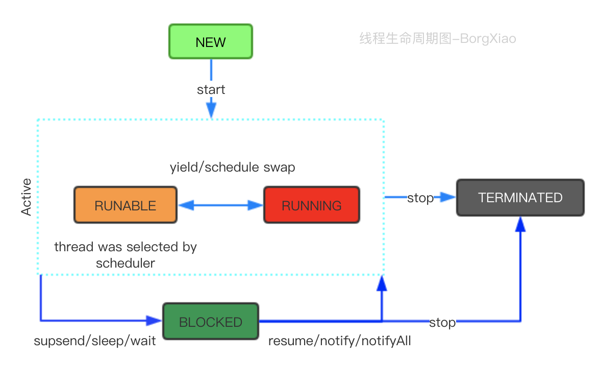

# Java多线程

## 1）基础理论

工具：Jconsole,Jstack。jvisualvm，javap

### 1.1）线程生命周期



- **NEW**：当用关键字new一个Thread，它只是Thread的对象的状态，线程本身还不存在，只有start的时候才会创建线程
- **RUNABLE**：可执行状态，即start后，具备执行资格，处于等CPU调度执行的状态。
- **RUNNING**：CPU通过轮询执行线程
- **BLOCKED**：阻塞状态
- **TERMINATED**：结束状态

注：start()只能执行一次，执行多次包illegalThreadStateException，Runnable接口只是线程的的执行单元的run方法的策略封装。

注：一个线程的创建者肯定由另外一个线程完成。被创建线程的父线程是创建它的线程。

### 1.2）线程Thread类API解析

```java
public Thread() {
    init(null, null, "Thread-" + nextThreadNum(), 0);
}
public Thread(Runnable target) {
        init(null, target, "Thread-" + nextThreadNum(), 0);
    }
//自增的nextThreadNum
public Thread(ThreadGroup group, Runnable target) {
        init(group, target, "Thread-" + nextThreadNum(), 0);
    }
public Thread(String name) {
        init(null, null, name, 0);
    }
public Thread(ThreadGroup group, String name) {
        init(group, null, name, 0);
    }
public Thread(Runnable target, String name) {
        init(null, target, name, 0);
    }
.....
  /**
     * Initializes a Thread.
     *
     * @param g the Thread group 指定线程组 无则用和父类
     * @param target the object whose run() method gets called
     * @param name the name of the new Thread
     * @param stackSize the desired stack size for the new thread, or
     *        zero to indicate that this parameter is to be ignored.
     新线程所需的堆栈大小，或零表示该参数将被忽略
     * @param acc the AccessControlContext to inherit, or
     *            AccessController.getContext() if null
     * @param inheritThreadLocals if {@code true}, inherit initial values for
     *            inheritable thread-locals from the constructing thread
     */
    private void init(ThreadGroup g, Runnable target, String name,
                      long stackSize, AccessControlContext acc,
                      boolean inheritThreadLocals)
```

注：stackSize代表程序的递归深度，0则忽略，默认为0

- **setName,getName**：设置或获取线程名字
- **currentThread,getId**：获取当前线程,获取当前线程ID
- **getThreadGroup**：获取当期线程的线程组
- **setDaemon**：设置为后台执行/守护线程
- **sleep**：休眠暂停执行，推荐使用工具**TimeUnit**。无cpu消耗，可以指定时间，会让线程短暂block，可以捕获到interrupt中断信号
- **yield**：放弃当前CPU的资源调度，但是如果CPU资源不紧张,则忽略，线程running->runnable。只是一个提示，会导致上下文切换，不会捕获interrupt中断信号，在JDK1.5之前 底层调用的sleep(0)。
- **setPriority,getPriority**：设置和获取线程的优先级。1-10之间，默认为5； 不建议使用，因为作用不大，闲暇时不会起作用，
- **getContextClassLoader,setContextClassLoader**：设置线程上下文类加载器。可以打破java类加载器的父委托机制，类似小后门。
- **interrupt**：可中断方法，即打断当前线程的阻塞状态，结束状态无效，内部状态interrupt flag将被设置，阻塞状态下的背中断，会捕获到InterruptedException。
- **interrupted,isInterrupted**：第一次执行会擦除interrupt flag标识，并返回true,后续操作无效返回false;是否被中断
- **join**：使当前线程永远等待下去，直到被另外的线程中断，或者join的线程执行结束，如在父线程A下，执行线程b.join，则A会等待B执行完毕。
- **stop**：不推荐使用以及废弃，如需要关闭可以结合interrupt
- **正常关闭**：1，正常执行完毕；2，捕获中断信息关闭(正常执行结束)；3，使用volatile开关。4，异常退出；5，进程假死(某个线程阻塞，或者线程出现死锁)。
- **getState**：获取当前线程的状态
- **wait**：Object的方法，调用很导致当前线程阻塞，即等待的，放弃monitor的所有权，进入 **wait set**，释放给其他线程。类似消费者，在等待消费，于sleep不同的事，sleep是Thread的方法，且wait必须在同步方法中执行，sleep不会释放monitor锁，wait会，sleep休眠后会自动退出阻塞，wait不行（如果没有设置时间的话）
- **notify**：Object的方法，唤醒正在单个执行wait的对象线程，没有wait则忽略，唤醒后，对象重新获取monitor的lock，继续工作，类似生产者。wait和notify操作的对象必须同一个，**且必须在同步方法中执行(aynchronized包裹下)**。
- **notifyAll**：一次唤醒多个线程。

注：虽然wait和notify必须在aynchronized下执行，但是在多线程下还是不安全的，如2个线程都进入了wait,其中一个被唤醒，唤醒后是继续执行wait后续的作业的。根本原因是wait和notify执行后放弃了monitor的所有权。

注：wait set(线程休息室)，

```java
public class EventQueue {
    
    private final int max;
    
    static class Event {
    
    }
    
    private final LinkedList<Event> eventQueue = new LinkedList<>();
    
    private final static int DEFAULT_MAX_EVENT = 10;
    
    public EventQueue() {
        this(DEFAULT_MAX_EVENT);
    }
    
    public EventQueue(int max) {
        this.max = max;
    }
    
    //生产
    public void offer(Event event) {
        synchronized (eventQueue) {
            if (eventQueue.size() >= max){
                try{
                    console("队列已经满了...");
                    eventQueue.wait();
                }catch (InterruptedException e){
                    e.printStackTrace();
                }
            }
            console("进入队列....");
            eventQueue.addLast(event);
            //通知消费
            eventQueue.notifyAll();
        }
    }
    //消费
    public Event take(){
        synchronized (eventQueue){
            //空 等待生成
            while(eventQueue.isEmpty()){
                try{
                    console("等待生产中....");
                    eventQueue.wait();
                }catch (InterruptedException e){
                    e.printStackTrace();
                }
            }
            //消费
            Event event = eventQueue.removeFirst();
            this.eventQueue.notifyAll();
            console("消费中...");
            return event;
        }
    }
    private void console(String message){
        System.out.printf("%s:%s\n",Thread.currentThread().getName(),message);
    }
}
```


```java
synchronized (s){
       try {
           s.wait(1000L);
           System.out.println(System.currentTimeMillis());
       } catch (InterruptedException e) {
           e.printStackTrace();
       }
   }
```

### 1.3）aynchronized

- 锁机制，确保共享变量的互斥访问
- 该命令包含JVM monitor enter(保证执行成功前，从主内存读取数据而不是缓存),monitor exit(保证共享变量刷入内存中)两个指令。
- 2个JVM必须成对出现。
- 可以用所有方法上，代码块。
- aynchronized(mutexObj)，mutexObj不能为null,
- 尽量锁的范围小点，不要太大
- 避免交叉锁
- this monitor对象的方法上 和class monitor 静态方法上。

注：弊端 无法控制阻塞时长，且阻塞不可中断。

### 1.4）Thread Group

默认情况下，新的线程都会被加入到main线程所在group。并不能管理线程，主要是对线程进行组织。

- **enumerate**：将group的active线程全部复制到Threa的数组中，如果recurse未true,则递归复制。
- **interrupt**：中断组下面所有的线程。
- **destory**：当组下面没有active线程的时候，即在父group把自己移除销毁。
- setDaemon：设置守护，不影响线程的daemon属性，为true,则当组下面没有active线程的时候自动destory.

### 1.5）Hook线程 捕获异常

- set/getUncaughtExptionHandler：线程在执行中不准许抛出checked的异常，在上下文中，派生它的线程是无法捕获运行出现的异常的信息，当线程运行错误会回调UncaughtExptionHandler接口。
- set/getDefaultUncaughtExptionHandler：
- Runtime.getRuntime().addShutDownHook(new Thread()); **常用生成lock文件，防止程序重复启动**。还有释放连接句柄的等操作，不要执行耗时操作，kill -9是无法监控的。


## 2）线程池

> 就是一个池子，里面存放已经创建好的线程，当有任务提交给线程池的时候，池中的线程主动执行任务，如果不够，则需要扩充，但是数量是有限的，就好比水界线，当任务小的时候，需要自动回收，释放资源，所以需要一个缓存的任务队列。

ExecutorService


## 3）Volatile关键字

只能修饰在类变量，和实例变量上，不能修饰方法参数，局部变量，和实例常量

并发3特性：原子性（要不全部成功，要不全部失败，不受外界干扰），有序性，可见性（变量被修改后，其他线程可以立即看到修改后的变量）。

Volatile关键字可以保证 可见性和有序性，无法保证原子性。

因为无法保证原子性，即为轻量级锁，不能完全替代synchronized关键字。

应用场景：

1）开关控制，利用可见性特点

2）状态标记，利用顺序特点

3）Singleton设计模式和double-check模式

### 7种单例设计模式：

#### 饿汉模式

不适用成员属性多的类

```java
public class Singleton {
    private static Singleton singleton = new Singleton();
    private Singleton(){
    
    }
    public static Singleton getInstance(){
        return singleton;
    }
}
```

#### 懒汉模式

```java
public class Singleton {
    private static Singleton singleton = null;
    private Singleton(){
    
    }
    public static Singleton getInstance(){
        if(singleton == null){
            singleton = new Singleton();
        }
        return singleton;
    }
}
```

#### 懒汉+同步方法

```java
public class Singleton {
    private static Singleton singleton = null;
    private Singleton(){
    
    }
    public static synchronized Singleton getInstance(){
        if(singleton == null){
            singleton = new Singleton();
        }
        return singleton;
    }
}
```

安全，但是性能低

#### Double-check

无法保证类的其他属性的加载顺序

```java
public class Singleton {
    private static Singleton singleton = null;
    private Singleton(){
    
    }
    public static Singleton getInstance(){
        if(singleton == null){
            synchronized (Singleton.class){
                if(singleton == null){
                    singleton = new Singleton();
                }
            }
            
        }
        return singleton;
    }
}
```

#### Volatile+Double-Check:

```java
public class Singleton {
    private volatile static Singleton singleton = null;
    private Singleton(){
    
    }
    public static Singleton getInstance(){
        if(singleton == null){
            synchronized (Singleton.class){
                if(singleton == null){
                    singleton = new Singleton();
                }
            }
            
        }
        return singleton;
    }
}
```

#### Holder方式

```java
public class Singleton {
    private Singleton(){
    
    }
    private static class Holder{
        private static Singleton singleton = new Singleton();
    }
    public static Singleton getInstance(){
        return Holder.singleton;
    }
}
```

#### 枚举：

```java
public enum Singleton {
    SINGLETON;
    Singleton(){
        //TODO
    }
    public static void method(){
        //TODO
    }
    public static Singleton getInstance(){
        return SINGLETON;
    }
}
```


[Java高并发编程详解]: 多线程与架构设计	"汪文君"

