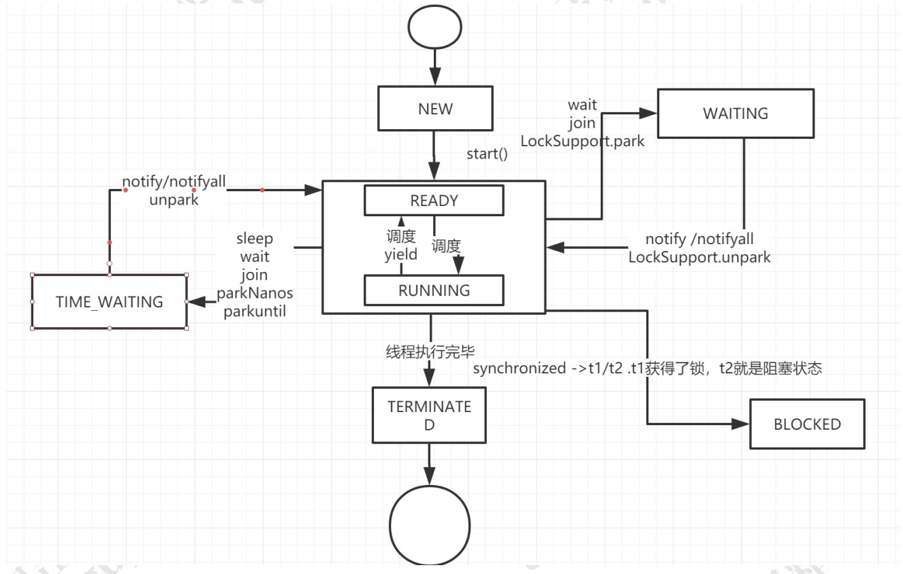
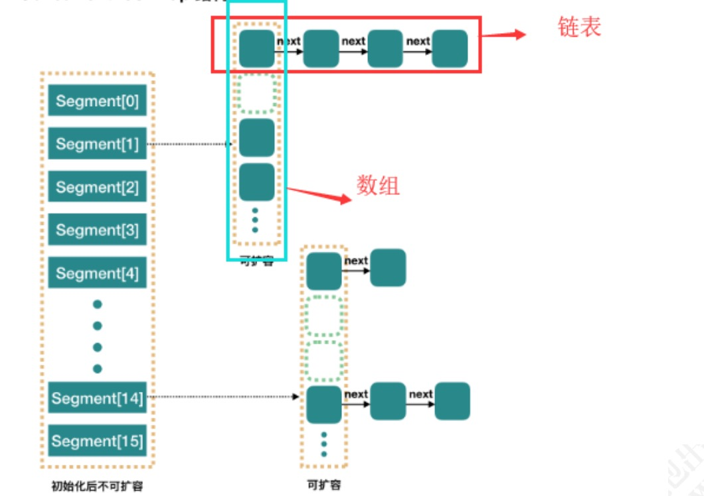

# Java多线程

## 1）基础理论

工具：Jconsole,Jstack。jvisualvm，javap

### 1.1）线程生命周期

#### 线程安全的实现方式：

1）互斥同步：悲观策略，synchronized：monitorenter,monitorexit；ReentrantLock

2）非阻塞同步：乐观策略，先操作，如果没有其他线程争用共享数据，就操作成功，有，就补偿。AtomicXXx,利用CAS原理，但是漏洞就是ABA问题，即虽然结果是A，但是中间发生了很多事情被忽略（中间有可能出现过c等）

3）无同步方案，就不涉及线程安全的代码


- **NEW**：当用关键字new一个Thread，它只是Thread的对象的状态，线程本身还不存在，只有start的时候才会创建线程
- **RUNABLE**：可执行状态，即start后，具备执行资格，处于等CPU调度执行的状态。
- **RUNNING**：CPU通过轮询执行线程
- **BLOCKED**：阻塞状态
- **TERMINATED**：结束状态

注：start()只能执行一次，执行多次包illegalThreadStateException，Runnable接口只是线程的的执行单元的run方法的策略封装。

注：一个线程的创建者肯定由另外一个线程完成。被创建线程的父线程是创建它的线程。

### 1.2）线程Thread类API解析

注：Thread的实现了**Runable接口**，但是实例化的时候，又支持传递Runable。

```java
public Thread() {
    init(null, null, "Thread-" + nextThreadNum(), 0);
}
//常用
public Thread(Runnable target) {
        init(null, target, "Thread-" + nextThreadNum(), 0);
    }
//自增的nextThreadNum
public Thread(ThreadGroup group, Runnable target) {
        init(group, target, "Thread-" + nextThreadNum(), 0);
    }
public Thread(String name) {
        init(null, null, name, 0);
    }
public Thread(ThreadGroup group, String name) {
        init(group, null, name, 0);
    }
public Thread(Runnable target, String name) {
        init(null, target, name, 0);
    }
.....
  /**
     * Initializes a Thread.
     *
     * @param g the Thread group 指定线程组 无则用和父类
     * @param target the object whose run() method gets called
     * @param name the name of the new Thread
     * @param stackSize the desired stack size for the new thread, or
     *        zero to indicate that this parameter is to be ignored.
     新线程所需的堆栈大小，或零表示该参数将被忽略
     * @param acc the AccessControlContext to inherit, or
     *            AccessController.getContext() if null
     * @param inheritThreadLocals if {@code true}, inherit initial values for
     *            inheritable thread-locals from the constructing thread
     */
    private void init(ThreadGroup g, Runnable target, String name,
                      long stackSize, AccessControlContext acc,
                      boolean inheritThreadLocals)
```

注：stackSize代表程序的递归深度，0则忽略，默认为0

- **setName,getName**：设置或获取线程名字
- **currentThread,getId**：获取当前线程,获取当前线程ID
- **getThreadGroup**：获取当期线程的线程组
- **setDaemon**：设置为后台执行/守护线程
- **sleep**：休眠暂停执行，推荐使用工具**TimeUnit**。无cpu消耗，可以指定时间，会让线程短暂block，可以捕获到interrupt中断信号
- **yield**：放弃当前CPU的资源调度，但是如果CPU资源不紧张,则忽略，线程running->runnable。只是一个提示，会导致上下文切换，不会捕获interrupt中断信号，在JDK1.5之前 底层调用的sleep(0)。
- **setPriority,getPriority**：设置和获取线程的优先级。1-10之间，默认为5； 不建议使用，因为作用不大，闲暇时不会起作用，
- **getContextClassLoader,setContextClassLoader**：设置线程上下文类加载器。可以打破java类加载器的父委托机制，类似小后门。
- **interrupt**：可中断方法，即打断当前线程的阻塞状态，结束状态无效，内部状态interrupt flag将被设置，阻塞状态下的背中断，会捕获到InterruptedException。
- **interrupted,isInterrupted**：第一次执行会擦除interrupt flag标识，并返回true,后续操作无效返回false;是否被中断
- **join**：使当前线程永远等待下去，直到被另外的线程中断，或者join的线程执行结束，如在父线程A下，执行线程b.join，则A会等待B执行完毕。
- **stop**：不推荐使用以及废弃，如需要关闭可以结合interrupt
- **正常关闭**：1，正常执行完毕；2，捕获中断信息关闭(正常执行结束)；3，使用volatile开关。4，异常退出；5，进程假死(某个线程阻塞，或者线程出现死锁)。
- **getState**：获取当前线程的状态
- **wait**：Object的方法，调用很导致当前线程阻塞，即等待的，放弃monitor的所有权，进入 **wait set**，释放给其他线程。类似消费者，在等待消费，于sleep不同的事，sleep是Thread的方法，且wait必须在同步方法中执行，sleep不会释放monitor锁，wait会，sleep休眠后会自动退出阻塞，wait不行（如果没有设置时间的话）
- **notify**：Object的方法，唤醒正在单个执行wait的对象线程，没有wait则忽略，唤醒后，对象重新获取monitor的lock，继续工作，类似生产者。wait和notify操作的对象必须同一个，**且必须在同步方法中执行(aynchronized包裹下)**。
- **notifyAll**：一次唤醒多个线程。

注：虽然wait和notify必须在aynchronized下执行，但是在多线程下还是不安全的，如2个线程都进入了wait,其中一个被唤醒，唤醒后是继续执行wait后续的作业的。根本原因是wait和notify执行后放弃了monitor的所有权。

```java
class MyThread exends Thread{
  
}
//使用
MyThread myT = new MyThread("自定义线程");
myT.start();

//Runable 传递
Thread t = new Thread(()->{
  //TODO
});

```


注：wait set(线程休息室)，

```java
public class EventQueue {
    
    private final int max;
    
    static class Event {
    
    }
    
    private final LinkedList<Event> eventQueue = new LinkedList<>();
    
    private final static int DEFAULT_MAX_EVENT = 10;
    
    public EventQueue() {
        this(DEFAULT_MAX_EVENT);
    }
    
    public EventQueue(int max) {
        this.max = max;
    }
    
    //生产
    public void offer(Event event) {
        synchronized (eventQueue) {
            if (eventQueue.size() >= max){
                try{
                    console("队列已经满了...");
                    eventQueue.wait();
                }catch (InterruptedException e){
                    e.printStackTrace();
                }
            }
            console("进入队列....");
            eventQueue.addLast(event);
            //通知消费
            eventQueue.notifyAll();
        }
    }
    //消费
    public Event take(){
        synchronized (eventQueue){
            //空 等待生成
            while(eventQueue.isEmpty()){
                try{
                    console("等待生产中....");
                    eventQueue.wait();
                }catch (InterruptedException e){
                    e.printStackTrace();
                }
            }
            //消费
            Event event = eventQueue.removeFirst();
            this.eventQueue.notifyAll();
            console("消费中...");
            return event;
        }
    }
    private void console(String message){
        System.out.printf("%s:%s\n",Thread.currentThread().getName(),message);
    }
}
```


#### notify和wait为对象方法,sleep为线程方法

- 两者最主要的区别在于：**sleep 方法没有释放锁，而 wait 方法释放了锁** 。
- 两者都可以暂停线程的执行。
- Wait 通常被用于线程间交互/通信，sleep 通常被用于暂停执行。
- wait() 方法被调用后，线程不会自动苏醒，需要别的线程调用同一个对象上的 notify() 或者 notifyAll() 方法。sleep() 方法执行完成后，线程会自动苏醒。或者可以使用 wait(long timeout)超时后线程会自动苏醒。

如果要调用notify或者wait,线程必须持有对象锁

```java
//The current thread must own this object's monitor
String s = "xx";
synchronized (s){
  try {
    //正常
    System.out.println(System.currentTimeMillis());
    s.wait(1000L);
    System.out.println(System.currentTimeMillis());
  } catch (InterruptedException e) {
    e.printStackTrace();
  }
}
System.out.println(System.currentTimeMillis());
try {
  //报错
  s.wait(1000L);
} catch (InterruptedException e) {
  e.printStackTrace();
}
System.out.println(System.currentTimeMillis());
```

#### run()和start()

都是Thead的方法，如果直接调用start() 即是通过线程的方式调用，如果直接调用run()等于没有使用线程方式，而是直接调用Runable接口的run()方法直接执行

### 1.3）aynchronized

- 锁机制，确保共享变量的互斥访问
- 该命令包含JVM monitor enter(保证执行成功前，从主内存读取数据而不是缓存),monitor exit(保证共享变量刷入内存中)两个指令。
- 2个JVM必须成对出现。
- 可以用所有方法上，代码块。
- aynchronized(mutexObj)，mutexObj不能为null,
- 尽量锁的范围小点，不要太大
- 避免交叉锁
- this monitor对象的方法上 和class monitor 静态方法上。

注：弊端 无法控制阻塞时长，且阻塞不可中断。

### 1.4）Thread Group

默认情况下，新的线程都会被加入到main线程所在group。并不能管理线程，主要是对线程进行组织。

- **enumerate**：将group的active线程全部复制到Threa的数组中，如果recurse未true,则递归复制。
- **interrupt**：中断组下面所有的线程。
- **destory**：当组下面没有active线程的时候，即在父group把自己移除销毁。
- setDaemon：设置守护，不影响线程的daemon属性，为true,则当组下面没有active线程的时候自动destory.

### 1.5）Hook线程 捕获异常

- set/getUncaughtExptionHandler：线程在执行中不准许抛出checked的异常，在上下文中，派生它的线程是无法捕获运行出现的异常的信息，当线程运行错误会回调UncaughtExptionHandler接口。
- set/getDefaultUncaughtExptionHandler：
- Runtime.getRuntime().addShutDownHook(new Thread()); **常用生成lock文件，防止程序重复启动**。还有释放连接句柄的等操作，不要执行耗时操作，kill -9是无法监控的。


### 1.6）线程的创建方式：

#### Callable实现多线程：

1.5开始

```java
@FunctionalInterface
public interface Callable<V> {
    V call() throws Exception;
}
public interface Future<V> {}

Callable<String> callable = ()->{
  //TODO
  return "线程返回";
};
FutureTask<String> task = new FutureTask<>(callable);
Thread t = new Thread(task);
t.start();

String xx = task.get();
System.out.println(xx);
```

#### **继承 Thread 类创建线程**

```java
public class MyThread extends Thread { 
	public void run() { 
	System.out.println("MyThread.run()"); 
	} 
}
```

#### **实现 Runnable 接口创建线程**

```java
public class MyThread extends OtherClass implements Runnable { 
	public void run() { 
		System.out.println("MyThread.run()"); 
	} 
}
```


## 2）线程池

> 就是一个池子，里面存放已经创建好的线程，当有任务提交给线程池的时候，池中的线程主动执行任务，如果不够，则需要扩充，但是数量是有限的，就好比水界线，当任务小的时候，需要自动回收，释放资源，所以需要一个缓存的任务队列。

### ThreadPoolExecutor:

####  工具类Executors 

```java
Executors 返回线程池对象的弊端如下：

FixedThreadPool 和 SingleThreadExecutor ： 允许请求的队列长度为 Integer.MAX_VALUE,可能堆积大量的请求，从而导致OOM。
CachedThreadPool 和 ScheduledThreadPool ： 允许创建的线程数量为 Integer.MAX_VALUE ，可能会创建大量线程，从而导致OOM。
```


#### newFixedThreadPool：

该方法返回一个固定线程数量的线程池。该线程池中的**线程数量始终不变**。当有一个新的任务提交时，线程池中若有空闲线程，则立即执行。若没有，则新的任务会被暂存在一个任务队列中，待有线程空闲时，便处理在任务队列中的任务。

适用于为了满足资源管理需求，而需要限制当前线程数量的应用场景。它适用于负载比较重的服务器；

#### newSingleThreadExecutor: 

方法返回一个**只有一个线程的线程池**。若多余一个任务被提交到该线程池，任务会被保存在一个任务队列中，待线程空闲，按先入先出的顺序执行队列中的任务。

适用于需要保证顺序地执行各个任务并且在任意时间点，不会有多个线程是活动的应用场景；

#### newCachedThreadPool：

该方法返回一个可根据实际情况调整线程数量的线程池。**线程池的线程数量不确定**，但若有空闲线程可以复用，则会优先使用可复用的线程。若所有线程均在工作，又有新的任务提交，则会创建新的线程处理任务。所有线程在当前任务执行完毕后，将返回线程池进行复用。

适用于执行很多的短期异步任务的小程序，或者是负载较轻的服务器；

#### newScheduledThreadPool: 

创建一个可以指定线程的数量的线程池，但是这个线程池还带有延迟和周期性执行任务的功能，类似定时器。

### 核心参数

```java
public ThreadPoolExecutor(int corePoolSize, //核心线程数量
int maximumPoolSize, //最大线程数
long keepAliveTime, //超时时间,超出核心线程数量以外的线程空余存活时间
TimeUnit unit, //存活时间单位
BlockingQueue<Runnable> workQueue, //保存执行任务的队列
ThreadFactory threadFactory,//创建新线程使用的工厂
RejectedExecutionHandler handler //当任务无法执行的时候的处理方式)
```

### 拒绝策略：

1、AbortPolicy：直接抛出异常，默认策略；

2、CallerRunsPolicy：用调用者所在的线程来执行任务；

3、DiscardOldestPolicy：丢弃阻塞队列中靠最前的任务，并执行当前任务；

4、DiscardPolicy：直接丢弃任务；

当然也可以根据应用场景实现 RejectedExecutionHandler 接口，自定义饱和策略，如记录日志或持久化存储不能处理的任务

### 执行任务：

执行任务有两种方法，一种是 submit、一种是 execute；这两个方法是有区别的，那么基于这个区别我们再来看看。

#### **execute 和 submit 区别**

1. execute 只可以接收一个 Runnable 的参数

2. execute 如果出现异常会抛出

3. execute 没有返回值

1. submit 可以接收 Runable 和 Callable 这两种类型的参数，

2. 对于 submit 方法，如果传入一个 Callable，可以得到一个 Future 的返回值

3. submit 方法调用不会抛异常，除非调用 Future.get

###  使用开源类库ThreadFactoryBuilder 

如 apache 和 guava 等。”他推荐使用 guava 提供的 ThreadFactoryBuilder 来创建线程池

## 3）Volatile关键字

只能修饰在类变量，和实例变量上，不能修饰方法参数，局部变量，和实例常量

并发3特性：原子性（要不全部成功，要不全部失败，不受外界干扰），有序性，可见性（变量被修改后，其他线程可以立即看到修改后的变量）。

Volatile关键字可以保证 可见性和有序性，无法保证原子性。

### 可见性：

Java内存模型规定了**所有的变量都存储在主内存**中，每条线程还有自己的**工作内存**，线程的工作内存中保存了该线程中是用到的变量的**主内存副本拷贝**，线程对变量的所有操作都必须在工作内存中进行，而不能直接读写主内存。

Java中的`volatile`关键字提供了一个功能，那就是被其修饰的变量在被修改后可以立即同步到主内存，被其修饰的变量在每次是用之前都从主内存刷新。因此，可以使用`volatile`来保证多线程操作时变量的可见性。

### 有序性：

通过禁止指令重排而定。被`volatile`修饰的变量的操作，会严格按照代码顺序执行，`load->add->save` 的执行顺序就是：load、add、save。

### 原子性：

为了保证原子性，需要通过字节码指令`monitorenter`和`monitorexit`，但是`volatile`和这两个指令之间是没有任何关系的。

**所以，`volatile`是不能保证原子性的。**因为无法保证原子性，即为轻量级锁，不能完全替代synchronized关键字。

### 应用场景：

1）开关控制，利用可见性特点

2）状态标记，利用顺序特点

3）Singleton设计模式和double-check模式


## 4）锁：

### 自旋锁与自适应自旋锁

因为共享数据的锁定状态很短，所以为了避免线程切换照成性能问题，就让该线程忙循环(自旋)的过程。

上面一般会设置一个等待时间，如果不设置等待时间，让他自适应的过程就是自适应自旋锁。

### 锁消除：

即编译器在运行中，对一些同步代码，检测到不可能存在共享数据的问题，取消对应的锁。

```java
{
  //虽然StringBuffer内部有锁，但是在这里使用的时候不涉及线程安全，所以编译器会去掉对应的同步操作
  StringBuffer sb = new StringBuffer();
  sb.append(s1);
  sb.append(s2);
  return sb.toString();
}
```

### 轻量级锁：

轻量是针对使用来说的。

### 偏向锁：

锁会偏向于第一个获得它的线程。


## 6）ThreadLocal类

可以保持当前线程(用户)的一种数据存储类，类似储物柜，每一个用户有自己的小柜子。

```java
public class ThreadLocal<T> {
  public T get() {}
  public void set(T value) {
    //原理就是以当前线程作为key 内部衍射一个MAP
    Thread t = Thread.currentThread();
    ThreadLocalMap map = getMap(t);
    if (map != null)
      map.set(this, value);
    else
      createMap(t, value);
  }
  public void remove() {}
  //内部类
  static class ThreadLocalMap {}
}
```

```java
 class Message{
    private String message;
    public void setMessage(String mess){
        message = mess;
    }
    public String getMessage(){
        return message;
    }
}
class StoreMessage{
    public Message message;
}
public class ThreadLocalTest {

    public static void main(String[] args) {
        StoreMessage storeMessage = new StoreMessage();

        ThreadLocal<Message> ss = new ThreadLocal<>();

        Thread a = new Thread(()->{
            Message s = new Message();
            s.setMessage("xxx");
            storeMessage.message = s;
            ss.set(s);
            System.out.println("错乱输出："+storeMessage.message.getMessage());
            System.out.println("正确输出："+ss.get().getMessage());
        });
        Thread b = new Thread(()->{
            Message s = new Message();
            s.setMessage("yyy");
            storeMessage.message = s;
            ss.set(s);
            System.out.println("错乱输出："+storeMessage.message.getMessage());
            System.out.println("正确输出："+ss.get().getMessage());
        });
        Thread c = new Thread(()->{
            Message s = new Message();
            s.setMessage("zzz");
            storeMessage.message = s;
            ss.set(s);
            System.out.println("错乱输出："+storeMessage.message.getMessage());
            System.out.println("正确输出："+ss.get().getMessage());
        });
        a.start();
        b.start();
        c.start();
    }
}
```

## 7）synchronized

1. 修饰实例方法，作用于**当前实例加锁**，进入同步代码前要获得当前实例的锁

2. 静态方法，作用于**当前类对象加锁**，进入同步代码前要获得当前类对象的锁

3. 修饰代码块，**指定加锁对象，对给定对象加锁**，进入同步代码库前要获得给定对象的锁。

```java
public class SynchronizeTest {

    //同步方法
    public synchronized void m1(){

    }
    public void m2(){
        //同步代码块 必须传入对象
        synchronized (SynchronizeTest.class){

        }
    }
}
```

`javap -c -v SynchronizeTest`

```java
  public me.bigbig.test.SynchronizeTest();
    descriptor: ()V
    flags: ACC_PUBLIC
    Code:
      stack=1, locals=1, args_size=1
         0: aload_0
         1: invokespecial #1                  // Method java/lang/Object."<init>":()V
         4: return
      LineNumberTable:
        line 10: 0

  public synchronized void m1();
    descriptor: ()V
     //注意ACC_SYNCHRONIZED
    flags: ACC_PUBLIC, ACC_SYNCHRONIZED
    Code:
      stack=2, locals=1, args_size=1
         0: getstatic     #2                  // Field java/lang/System.out:Ljava/io/PrintStream;
         3: ldc           #3                  // String xx
         5: invokevirtual #4                  // Method java/io/PrintStream.println:(Ljava/lang/String;)V
         8: return
      LineNumberTable:
        line 14: 0
        line 15: 8

  public void m2();
    descriptor: ()V
    flags: ACC_PUBLIC
    Code:
      stack=2, locals=3, args_size=1
         0: ldc           #5                  // class me/bigbig/test/SynchronizeTest
         2: dup
         3: astore_1
           //注意monitorenter monitorexit
         4: monitorenter
         5: aload_1
         6: monitorexit
         7: goto          15
        10: astore_2
        11: aload_1
        12: monitorexit
        13: aload_2
        14: athrow
        15: return
      Exception table:
         from    to  target type
             5     7    10   any
            10    13    10   any
      LineNumberTable:
        line 18: 0
        line 19: 5
        line 20: 15
      StackMapTable: number_of_entries = 2
        frame_type = 255 /* full_frame */
          offset_delta = 10
          locals = [ class me/bigbig/test/SynchronizeTest, class java/lang/Object ]
          stack = [ class java/lang/Throwable ]
        frame_type = 250 /* chop */
          offset_delta = 4
}

```

### 同步方法：

通过`ACC_SYNCHRONIZED`关键字隐式的对方法进行加锁。当线程要执行的方法被标注上`ACC_SYNCHRONIZED`时，需要先获得锁才能执行该方法。

### 同步代码块：

通过`monitorenter`和`monitorexit`执行来进行加锁。当线程执行到`monitorenter`的时候要先获得所锁，才能执行后面的方法。当线程执行到`monitorexit`的时候则要释放锁。

每个对象自身维护这一个被加锁次数的计数器，当计数器数字为0时表示可以被任意线程获得锁。当计数器不为0时，只有获得锁的线程才能再次获得锁。即可重入锁。

### 锁升级：

#### 1）偏向锁(cas)：

当一个线程访问加了同步锁的代码块时，会在对象头中存储当前线程的 ID，后续这个线程进入和退出这段加了同步锁的代码块时，不需要再次加锁和释放锁。而是直接比较对象头里面是否存储了指向当前线程的偏向锁，

发现 cas 失败也就是存在线程竞争时，直接把被偏向的锁对象升级到被加了轻量级锁的状态

#### 2）轻量级锁：

锁升级为轻量级锁之后，对象的 Markword 也会进行相应的的变化。

升级为轻量级锁的过程：

1. 线程在自己的栈桢中创建锁记录 LockRecord。

2. 将锁对象的对象头中的MarkWord复制到线程的刚刚创建的锁记录中。

3. 将锁记录中的 Owner 指针指向锁对象。

4. 将锁对象的对象头的 MarkWord替换为指向锁记录的指针。

注：轻量级锁在加锁过程中，用到了自旋锁。即原地转圈圈

轻量级锁的锁释放逻辑其实就是获得锁的逆向逻辑，通过CAS 操作把线程栈帧中的 LockRecord 替换回到锁对象的MarkWord 中，如果成功表示没有竞争。如果失败，表示当前锁存在竞争，那么轻量级锁就会膨胀成为重量级锁

#### 3）重量级锁：

通过`monitorenter`和`monitorexit`执行来进行加锁

### synchronized 和 ReentrantLock 的区别

**① 两者都是可重入锁**

两者都是可重入锁。“可重入锁”概念是：自己可以再次获取自己的内部锁。比如一个线程获得了某个对象的锁，此时这个对象锁还没有释放，当其再次想要获取这个对象的锁的时候还是可以获取的，如果不可锁重入的话，就会造成死锁。同一个线程每次获取锁，锁的计数器都自增 1，所以要等到锁的计数器下降为 0 时才能释放锁。

**② synchronized 依赖于 JVM 而 ReentrantLock 依赖于 API**

synchronized 是依赖于 JVM 实现的，前面我们也讲到了 虚拟机团队在 JDK1.6 为 synchronized 关键字进行了很多优化，但是这些优化都是在虚拟机层面实现的，并没有直接暴露给我们。ReentrantLock 是 JDK 层面实现的（也就是 API 层面，需要 lock() 和 unlock() 方法配合 try/finally 语句块来完成），所以我们可以通过查看它的源代码，来看它是如何实现的。

**③ ReentrantLock 比 synchronized 增加了一些高级功能**

相比 synchronized，ReentrantLock 增加了一些高级功能。主要来说主要有三点：**① 等待可中断；② 可实现公平锁；③ 可实现选择性通知（锁可以绑定多个条件）**

- **ReentrantLock 提供了一种能够中断等待锁的线程的机制**，通过 lock.lockInterruptibly() 来实现这个机制。也就是说正在等待的线程可以选择放弃等待，改为处理其他事情。
- **ReentrantLock 可以指定是公平锁还是非公平锁。而 synchronized 只能是非公平锁。所谓的公平锁就是先等待的线程先获得锁。** ReentrantLock 默认情况是非公平的，可以通过 ReentrantLock 类的`ReentrantLock(boolean fair)`构造方法来制定是否是公平的。
- synchronized 关键字与 wait()和 notify/notifyAll()方法相结合可以实现等待/通知机制，ReentrantLock 类当然也可以实现，但是需要借助于 Condition 接口与 newCondition() 方法。Condition 是 JDK1.5 之后才有的，它具有很好的灵活性，比如可以实现多路通知功能也就是在一个 Lock 对象中可以创建多个 Condition 实例（即对象监视器），**线程对象可以注册在指定的 Condition 中，从而可以有选择性的进行线程通知，在调度线程上更加灵活。 在使用 notify/notifyAll()方法进行通知时，被通知的线程是由 JVM 选择的，用 ReentrantLock 类结合 Condition 实例可以实现“选择性通知”** ，这个功能非常重要，而且是 Condition 接口默认提供的。而 synchronized 关键字就相当于整个 Lock 对象中只有一个 Condition 实例，所有的线程都注册在它一个身上。如果执行 notifyAll()方法的话就会通知所有处于等待状态的线程这样会造成很大的效率问题，而 Condition 实例的 signalAll()方法 只会唤醒注册在该 Condition 实例中的所有等待线程。

如果你想使用上述功能，那么选择 ReentrantLock 是一个不错的选择。

**④ 两者的性能已经相差无几**

在 JDK1.6 之前，synchronized 的性能是比 ReentrantLock 差很多。具体表示为：synchronized 关键字吞吐量随线程数的增加，下降得非常严重。而 ReentrantLock 基本保持一个比较稳定的水平。我觉得这也侧面反映了， synchronized 关键字还有非常大的优化余地。后续的技术发展也证明了这一点，我们上面也讲了在 JDK1.6 之后 JVM 团队对 synchronized 关键字做了很多优化。JDK1.6 之后，synchronized 和 ReentrantLock 的性能基本是持平了。所以网上那些说因为性能才选择 ReentrantLock 的文章都是错的！JDK1.6 之后，性能已经不是选择 synchronized 和 ReentrantLock 的影响因素了！而且虚拟机在未来的性能改进中会更偏向于原生的 synchronized，所以还是提倡在 synchronized 能满足你的需求的情况下，优先考虑使用 synchronized 关键字来进行同步！优化后的 synchronized 和 ReentrantLock 一样，在很多地方都是用到了 CAS 操作。

## 8）并发基础

### 线程6状态：

**NEW：**初始状态，线程被构建，但是还没有调用 start 方法

**RUNNABLED：**运行状态，JAVA 线程把操作系统中的就绪和运行两种状态统一称为“运行中”

**BLOCKED：**阻塞状态，表示线程进入等待状态,也就是线程因为某种原因放弃了 CPU 使用权，阻塞也分为几种情况

等待阻塞：运行的线程执行wait方法，-->放入等待队列

同步阻塞：运行的线程在获取对象的同步锁时，若该同步锁被其他线程锁占用了，那么 jvm 会把当前的线程放入到锁池中

其他阻塞：运行的线程执行 Thread.sleep 或者 t.join 方法，或者发出了 I/O 请求时，JVM 会把当前线程设置为阻塞状态，当 sleep 结束、join 线程终止、io 处理完毕则线程恢复

**WAITING：**进入该状态的线程需要等待其他线程做出一些特定动作（通知或中断）

**TIME_WAITING：**超时等待状态，超时以后自动返回

**TERMINATED：**终止状态，表示当前线程执行完毕



### 线程终止：

#### **interrupt 方法**

当其他线程通过调用当前线程的 interrupt 方法，表示向当、前线程打个招呼，**告诉他可以中断线程的执行了，至于什么时候中断，取决于当前线程自己**。线程通过检查资深是否被中断来进行相应，可以通过isInterrupted()来判断是否被中断。

## 9）J.U.C 并发工具类

Java.util.concurrent 是在并发编程中比较常用的工具类

### AbstractQueuedSynchronizer：

同步队列 AQS，全称 AbstractQueuedSynchronizer，它是一个同步工具也是 Lock 用来实现线程同步的核心组件

从使用层面来说，AQS 的功能分为两种：**独占和共享**

独占锁，每次只能有一个线程持有锁，比如前面给大家演示的 ReentrantLock 就是以独占方式实现的互斥锁

共享锁 ， 允许多个线程同时获取锁 ， 并 发 访 问 共 享 资 源 ， 比 如ReentrantReadWriteLock

AQS 队列内部维护的是一个 **FIFO 的双向链表**.

每个 Node 其实是由线程封装，当线程争抢锁失败后会封装成 Node 加入到 ASQ 队列中去；当获取锁的线程释放锁以后，会从队列中唤醒一个阻塞的节点(线程)。

#### Lock：

Lock 本质上是一个接口，它定义了释放锁和获得锁的抽象方法，定义成接口就意味着它定义了锁的一个标准规范，也同时意味着锁的不同实现。

#### ReentrantLock：

表示重入锁，它是唯一一个实现了 Lock 接口的类

重入锁指的是线程在获得锁之后，再次获取该锁不需要阻塞，而是直接关联一次计数器增加重入次数。 

注：可以避免程序死锁。

```java
private static int count=0;
static Lock lock=new ReentrantLock();
public static void inc(){
	lock.lock();
try {
	Thread.sleep(1);
} catch (InterruptedException e) {
	e.printStackTrace();
}
	count++;
	lock.unlock();
}
```

Sync 有两个具体的实现类，分别是：

NofairSync：表示可以存在抢占锁的功能，也就是说不管当前队列上是否存在其他线程等待，新线程都有机会抢占锁。通过cas操作**unsafe.compareAndSwapInt**(this, stateOffset, expect, update);活动锁。cas失败则退换为FairSync

FairSync: 表示所有线程严格按照 FIFO 来获取锁，通过队列机制来排队实现

注：fair是公平的意思。

```java
public class ReentrantLock implements Lock, java.io.Serializable {
    /** Synchronizer providing all implementation mechanics */
    private final Sync sync;
    abstract static class Sync extends AbstractQueuedSynchronizer

      static final class NonfairSync extends Sync
        static final class FairSync extends Sync
```


#### ReentrantReadWriteLock：

重入读写锁，它实现了 **ReadWriteLock** 接口，在这个类中维护了两个锁，一个是 ReadLock，一个是 WriteLock，他们都分别实现了 Lock接口。读写锁是一种适合读多写少的场景下解决线程安全问题的工具，基本原则是： 读和读不互斥、读和写互斥、写和写互斥。也就是说涉及到影响数据变化的操作都会存在互斥。

**StampedLock：** 

stampedLock 是 JDK8 引入的新的锁机制，可以简单认为是读写锁的一个改进版本，读写锁虽然通过分离读和写的功能使得读和读之间可以完全并发，但是读和写是有冲突的，如果大量的读线程存在，可能会引起写线程的饥饿。stampedLock 是一种**乐观的读策略**，使得乐观锁完全不会阻塞写线程。

注：stamped 冲压;盖印

#### **Condition**：

 wait/notify 的基本使用，结合synchronized 可以实现对线程的通信。既然 J.U.C 里面提供了锁的实现机制，那 J.U.C 里面有没有提供类似的线程通信的工具呢？ 

Condition 是一个多线程协调通信的工具类，可以让某些线程一起等待某个条件（condition），只有满足条件时，线程才会被唤醒。

当调用 await 方法后，当前线程会释放锁并等待，而其他线程调用 condition 对象的 signal 或者 signalall 方法通知并被阻塞的线程，然后自己执行 unlock 释放锁，被唤醒的线程获得之前的锁继续执行，最后释放锁。

所以，condition 中两个最重要的方法，一个是 await，一个是 signal 方法

await:把当前线程阻塞挂起 -->wait

signal:唤醒阻塞的线程 -->notify

### CountDonwLatch

用给定的计数初始化 `CountDownLatch`。由于调用了 `countDown()` 方法，所以在当前计数到达零之前，`await` 方法会一直受阻塞。之后，会释放所有等待的线程，`await` 的所有后续调用都将立即返回。

```java
public class CountDownLatchTest {
    protected static ExecutorService executorService = Executors.newFixedThreadPool(5);

    public static CountDownLatch countDownLatch;

    public static void main(String[] args) {
        //容量5
        countDownLatch = new CountDownLatch(8);
        //8个线程
        for (int i=0;i<8;i++){
            final int x = i;
            executorService.execute(()->{
                System.out.println("stat:"+x);
                try{
                    //TODO
                }catch (Exception e){
                    //TODO
                }finally {
                    //运行结束减1
                    countDownLatch.countDown();
                }
            });
        }
        try{
            //等待执行
            countDownLatch.await();
            //System.exit(0);//程序退出
        }catch (InterruptedException e){
            e.printStackTrace();
        }
    }
}
```

### **Semaphore**:

意思：信号量

semaphore 也就是我们常说的信号灯，semaphore 可以控制同时访问的线程个数，通过 acquire 获取一个许可，如果没有就等待，通过 release 释放一个许可。有点类似限流的作用。叫信号灯的原因也和他的用处有关，比如某商场就 5 个停车位，每个停车位只能停一辆车，如果这个时候来了 10 辆车，必须要等前面有空的车位才能进入

```java
public class SemaphoreTest {

    public static void main(String[] args) {
        //5个车位
        Semaphore semaphore = new Semaphore(5);
        for (int i =0;i<10;i++){
            new Car(i,semaphore).start();
        }
    }
    static class Car extends Thread{
        private int num;
        private Semaphore semaphore;
        public Car(int num,Semaphore s){
            this.num = num;
            this.semaphore = s;
        }

        @Override
        public void run() {
            try{
                //获取许可
                semaphore.acquire();
                System.out.println("第"+num+"占用一个停车位");
                TimeUnit.SECONDS.sleep(2);
                System.out.println("第"+num+"车离开了");
                //释放许可
                semaphore.release();
            }catch (InterruptedException e){
                e.printStackTrace();
            }
        }
    }
}
```

注：Semaphore 比较常见的就是用来做限流操作

### **CyclicBarrier**

CyclicBarrier 的字面意思是可循环使用（Cyclic）的屏障（Barrier）。它要做的事情是，让一组线程到达一个屏障（也可以叫同步点）时被阻塞，直到最后一个线程到达屏障时，**屏障才会开门，所有被屏障拦截的线程才会继续工作**。CyclicBarrier 默认的构造方法是 CyclicBarrier(int parties)，其参数表示屏障拦截的线程数量，每个线程调用 await 方法告诉 CyclicBarrier 当前线程已经到达了屏障，然后当前线程被阻塞

简单点就是，设置了一道门，要等所有人到齐了才开。

```java
public class CyclicBarrierTest {
    public static void main(String[] args) {
        CountDownLatch countDownLatch = new CountDownLatch(1);
        CyclicBarrier cyclicBarrier = new CyclicBarrier(3);
        for (int i=0;i<3;i++){
            new Thread(()->{
                try {
                    //先等等
                    TimeUnit.SECONDS.sleep(1);
                    //阻止执行
                    cyclicBarrier.await();
                } catch (Exception e) {
                    e.printStackTrace();
                }
              	//结果就是几乎同时执行输出
                System.out.println(System.currentTimeMillis());
            }).start();
        }
        System.out.println("主程序先执行");
        try {
            countDownLatch.await();
        } catch (InterruptedException e) {
            e.printStackTrace();
        }
    }
}
```

CyclicBarrier 相比 CountDownLatch 来说，要简单很多，源码实现是基于 ReentrantLock 和 Condition 的组合使用。看如下示意图，CyclicBarrier 和 CountDownLatch 是不是很像，只是 CyclicBarrier 可以有不止一个栅栏，因为它的栅栏（Barrier）可以重复使用（Cyclic）

### **ConcurrentHashMap**：

 ConrruentHashMap 由一个个 Segment 组 成 ， 简 单 来 说 ，ConcurrentHashMap **是一个 Segment 数组，它通过继承 ReentrantLock 来进行加锁**，通过每次锁住一个 segment 来保证每个 segment 内的操作的线程安全性从而实现全局线程安全。

当每个操作分布在不同的 segment 上的时候，默认情况下，理论上可以同时支持 16 个线程的并发写入。



相比于 1.7 版本，它做了两个改进

1. 取消了 segment 分段设计，直接**使用 Node 数组来保存数据**，并且采用 **Node 数组元素作为锁**来实现每一行数据进行加锁来进一步减少并发冲突的概率

2. 将原本数组+单向链表的数据结构变更为了**数组+单向链表+红黑树的结构**。

```java
static class Node<K,V> implements Map.Entry<K,V> 
  /**
     * The array of bins. Lazily initialized upon first insertion.
     * Size is always a power of two. Accessed directly by iterators.
     */
    transient volatile Node<K,V>[] table;

    /**
     * The next table to use; non-null only while resizing.
     */
    private transient volatile Node<K,V>[] nextTable;
static class Segment<K,V> extends ReentrantLock implements Serializable
```

简单来说，它把 Node 数组当作多个线程之间共享的任务队列，然后通过维护一个指针来划分每个线程锁负责的区间，每个线程通过区间逆向遍历来实现扩容，一个已经迁移完的bucket 会被替换为一个 ForwardingNode 节点，标记当前 bucket 已经被其他线程迁移完了

### 阻塞队列：

1. 插入操作

add(e) ：添加元素到队列中，如果队列满了，继续插入元素会报错，IllegalStateException。 

offer(e) : 添加元素到队列，同时会返回元素是否插入成功的状态，如果成功则返回 true

put(e) ：当阻塞队列满了以后，生产者继续通过put添加元素，队列会一直阻塞生产者线程，直到队列可用

offer(e,time,unit) ：当阻塞队列满了以后继续添加元素，生产者线程会被阻塞指定时间，如果超时，则线程直接

退出

2. 移除操作

remove()：当队列为空时，调用 remove 会返回 false，如果元素移除成功，则返回 true

poll(): 当队列中存在元素，则从队列中取出一个元素，如果队列为空，则直接返回 null

take()：基于阻塞的方式获取队列中的元素，如果队列为空，则 take 方法会一直阻塞，直到队列中有新的数据可

以消费

poll(time,unit)：带超时机制的获取数据，如果队列为空，则会等待指定的时间再去获取元素返回

#### ArrayBlockingQueue ：

数组实现的有界阻塞队列, 此队列按照先进先出（FIFO）的原则对元素进行排序。

注：通过锁，然后两个条件

```java
lock = new ReentrantLock(fair); //重入锁，出
队和入队持有这一把锁
notEmpty = lock.newCondition(); //初始化非空
等待队列
notFull = lock.newCondition(); //初始化非满
等待队列
```


#### LinkedBlockingQueue ：

链表实现的有界阻塞队列, 此队列的默认和最大长度为Integer.MAX_VALUE。此队列按照先进先出的原则对元素进行排序

#### PriorityBlockingQueue ：

支持优先级排序的无界阻塞队列, 默认情况下元素采取自然顺序升序排列。也可以自定义类实现 compareTo()方法来指定元素排序规则，或者初始化 PriorityBlockingQueue 时，指定构造参数 Comparator 来对元素进行排序

#### DelayQueue：

优先级队列实现的无界阻塞队列

#### SynchronousQueue ：

不存储元素的阻塞队列, 每一个 put 操作必须等待一个 take 操作，否则不能继续添加元素。

#### LinkedTransferQueue：

链表实现的无界阻塞队列

#### LinkedBlockingDeque ：

链表实现的双向阻塞队列

### 原子操作类：

1. 原子更新基本类型

   AtomicBoolean、AtomicInteger、AtomicLong

2. 原子更新数组

   AtomicIntegerArray 、 AtomicLongArray 、AtomicReferenceArray

3. 原子更新引用

   AtomicReference 、 AtomicReferenceFieldUpdater 、AtomicMarkableReference（更新带有标记位的引用类

型）

4. 原子更新字段

   AtomicIntegerFieldUpdater、AtomicLongFieldUpdater、AtomicStampedReference

## 10）常用操作

### 编写死锁代码：

获取到资源1的锁
获取到资源2的锁
Thread[Thread-1,5,main]等待资源1的锁
Thread[Thread-0,5,main]等待资源2的锁

```java
String x1 = "资源1";
String x2 = "资源2";
new Thread(()->{
  synchronized (x1){
    System.out.println("获取到资源1的锁");
    try {
      Thread.sleep(1000);
    } catch (InterruptedException e) {
      e.printStackTrace();
    }
    System.out.println(Thread.currentThread()+"等待资源2的锁");
    synchronized (x2){
      System.out.println(Thread.currentThread()+"获取到资源2");
    }
  }
}).start();

new Thread(()->{
  synchronized (x2){
    System.out.println("获取到资源2的锁");
    try {
      Thread.sleep(1000);
    } catch (InterruptedException e) {
      e.printStackTrace();
    }
    System.out.println(Thread.currentThread()+"等待资源1的锁");
    synchronized (x1){
      System.out.println(Thread.currentThread()+"获取到资源1");
    }
  }
}).start();
```

