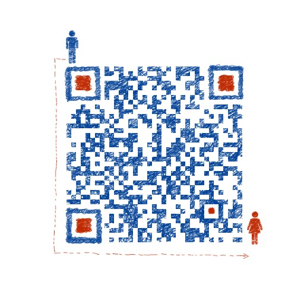

# 学习笔记
## 介绍：

本目录为学习笔记和书籍的一些感悟笔记，许多信息源于网络和书本，仅用于个人非商业目的，如其中有侵犯权益的地方，请联系borgxiao@126.com 及时修改。

同时也欢迎添加个人微信一起沟通学习：

## 目录：

- [GO语言](./Golang)

- [读书笔记](./读书笔记)
- [PHP](./PHP/)
- [基础知识](./基础)
- [经济](./经济)
- [解决方案](./方案)
- [JAVA语言](./Java)
- [基础架构](./基础)

