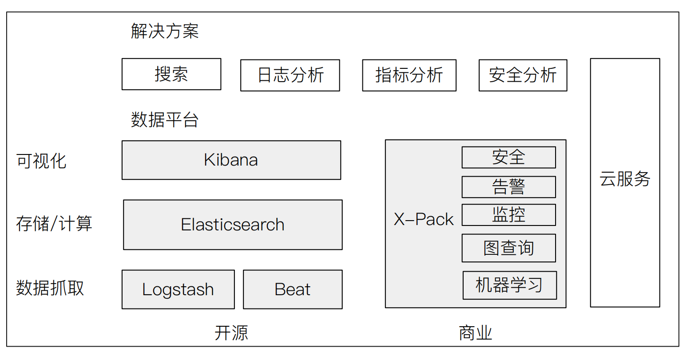
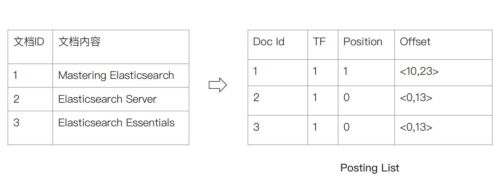
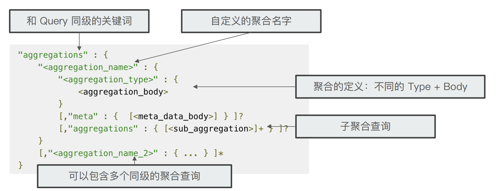
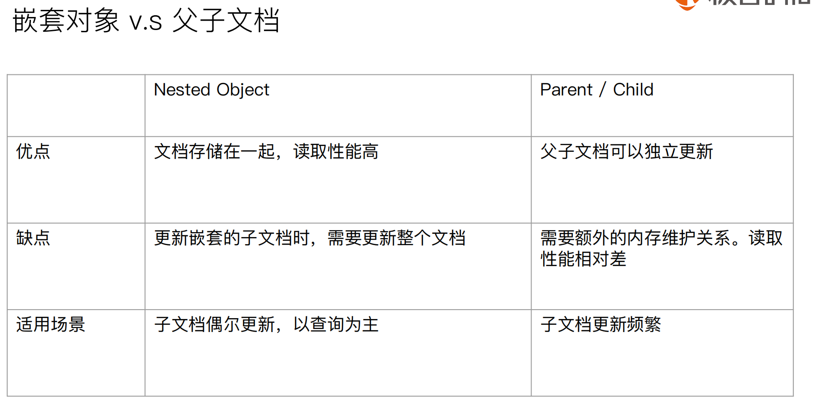
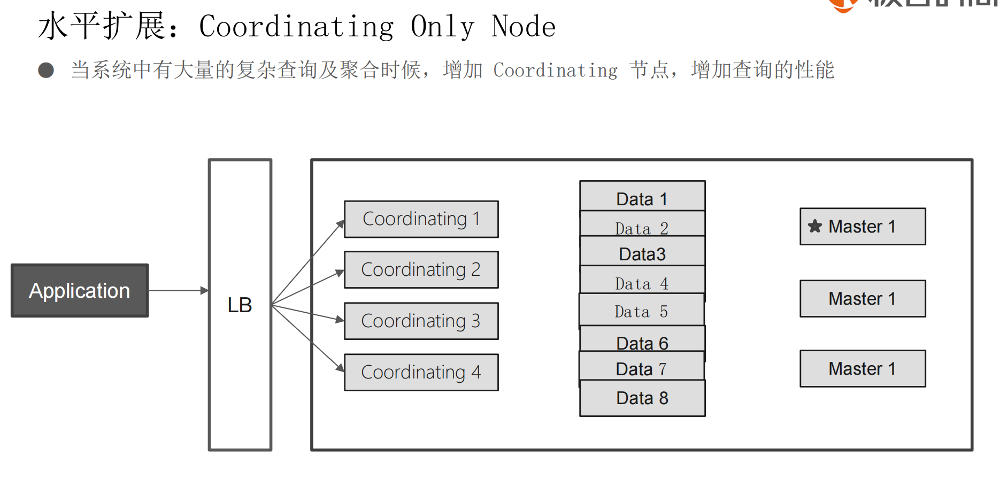
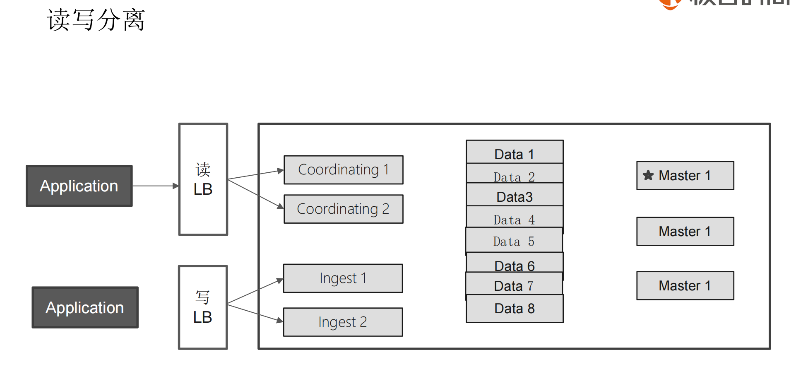

## 简介：

### Elastic Stack 生态圈



ElasticSearch是一个基于Lucene的搜索服务器。它提供了一个分布式多用户能力的全文搜索引擎，基于RESTful web接口。Elasticsearch是用Java开发的，并作为Apache许可条款下的开放源码发布，是当前流行的企业级搜索引擎。设计用于[云计算](https://baike.baidu.com/item/%E4%BA%91%E8%AE%A1%E7%AE%97)中，能够达到实时搜索，稳定，可靠，快速，安装使用方便。

轻松的横向扩展，可支持PB级的结构化和非结构化数据处理。

源于：为老婆做一个搜索菜谱搜索。

### 应用场景：

英国卫报：实时分析公众对文章的回应。

维基百科，和GitHub站内实时搜索。

百度，实时日志分析。

### 版本问题：

1.x->2.x->**5.x**,因为：Lucene的版本问题，为了统一。

https://www.elastic.co/

head插件

集群分布式部署

### 安装和启动：

```shell
https://www.elastic.co/guide/en/elasticsearch/reference/7.14/brew.html
brew install elastic/tap/elasticsearch-full

```

注：https://127.0.0.1:9200 

```json
{
  "name" : "77a082ffcbdc",
  "cluster_name" : "docker-cluster",
  "cluster_uuid" : "zu9QN9zBTAmsbpfUQZdpDA",
  "version" : {
    "number" : "7.14.0",
    "build_flavor" : "default",
    "build_type" : "docker",
    "build_hash" : "dd5a0a2acaa2045ff9624f3729fc8a6f40835aa1",
    "build_date" : "2021-07-29T20:49:32.864135063Z",
    "build_snapshot" : false,
    "lucene_version" : "8.9.0",
    "minimum_wire_compatibility_version" : "6.8.0",
    "minimum_index_compatibility_version" : "6.0.0-beta1"
  },
  "tagline" : "You Know, for Search"
}
```

```shell
docker network create elastic
docker pull docker.elastic.co/elasticsearch/elasticsearch:7.14.0
docker run --name es74 --net elastic -p 9200:9200 -p 9300:9300 -e "discovery.type=single-node" docker.elastic.co/elasticsearch/elasticsearch:7.14.0

docker pull docker.elastic.co/kibana/kibana:7.14.0
docker run --name kibana74 --net elastic -p 5601:5601 -e "ELASTICSEARCH_HOSTS=http://es74:9200" docker.elastic.co/kibana/kibana:7.14.0
```

注：http://localhost:5601/  访问kibana

### 目录

```shell
sh-4.4# ls
LICENSE.txt  NOTICE.txt  README.asciidoc  bin  config  data  jdk  lib  logs  modules  plugins
sh-4.4# cd config/
sh-4.4# ls
analysis-ik             elasticsearch.yml  jvm.options.d           log4j2.properties  roles.yml  users_roles
elasticsearch.keystore  jvm.options        log4j2.file.properties  role_mapping.yml   users
sh-4.4# cat elasticsearch.yml 
cluster.name: "docker-cluster"
network.host: 0.0.0.0
```


| 目录    | 配置文件          | 描叙                                                  |
| ------- | ----------------- | ----------------------------------------------------- |
| bin     |                   | 脚本文件，包括启动elasticsearch，安装插件，运行统计等 |
| config  | elasticsearch.yml | 集群配置文件                                          |
| JDK     |                   | Java运行环境                                          |
| data    | path.data         | 数据文件                                              |
| lib     |                   | Java库                                                |
| logs    | path.log          | 日志文件                                              |
| modules |                   | es安装的模块                                          |
| plugins |                   | es安装的插件                                          |


## 概念

### 集群(Cluster)

集群(cluster)是一组具有相同`cluster.name`的节点集合，他们协同工作，共享数据并提供故障转移和扩展功能，当然一个节点也可以组成一个集群。

集群由唯一名称标识，默认情况下为“elasticsearch”。此名称很重要，因为如果节点设置为按名称加入集群的话，则该节点只能是集群的一部分。

集群状态通过 **绿**，**黄**，**红** 来标识

- **绿色** - 一切都很好（集群功能齐全）。
- **黄色** - 所有数据均可用，但尚未分配一些副本（集群功能齐全）。
- **红色** - 某些数据由于某种原因不可用（集群部分功能）。

我们可以在 Kibana 控制台中运行以下命令`GET /_cluster/health`，得到如下信息：

```json
{
  "cluster_name" : "docker-cluster",
  "status" : "yellow",
  "timed_out" : false,
  "number_of_nodes" : 1,
  "number_of_data_nodes" : 1,
  "active_primary_shards" : 9,
  "active_shards" : 9,
  "relocating_shards" : 0,
  "initializing_shards" : 0,
  "unassigned_shards" : 1,
  "delayed_unassigned_shards" : 0,
  "number_of_pending_tasks" : 0,
  "number_of_in_flight_fetch" : 0,
  "task_max_waiting_in_queue_millis" : 0,
  "active_shards_percent_as_number" : 90.0
}
```

### 节点(Node)

节点，一个运行的 ES 实例就是一个节点，节点存储数据并参与集群的索引和搜索功能。

可以将节点配置为按集群名称加入特定集群。

node.name=node1

### 索引(Index)-数据库和表

索引是具有某些类似特征的文档集合，可以理解为数据库和表

索引由名称标识（必须全部小写）

#### 倒排索引

正排索引-->目录  倒排索引-->索引页

包含两个部分

1) 单词词典，记录所有文档的单词，记录单词到倒排列表的关联关系
2) 倒排列表posting list，记录了单词对应的文档结合，由倒排索引项组成



#### 别名alias

1）实现0停机运维

2）创建不同的查询视图

```json
PUT movies-2019/_doc/1
{
  "name":"the matrix",
  "rating":5
}
PUT movies-2019/_doc/2
{
  "name":"Speed",
  "rating":3
}
POST _aliases
{
  "actions": [
    {
      "add": {
        "index": "movies-2019",
        "alias": "movies-latest"
      }
    }
  ]
}
GET movies-latest/_search
//设置条件 rating >= 4的才
POST _aliases
{
  "actions": [
    {
      "add": {
        "index": "movies-2019",
        "alias": "movies-lastest-highrate",
        "filter": {
          "range": {
            "rating": {
              "gte": 4
            }
          }
        }
      }
    }
  ]
}
GET movies-lastest-highrate/_search
```

#### segment

单个索引文件被称为segment，不可变更，多个汇总在一起为Index(shard)， 汇总信息保留在Commit Point ,删除的文档信息，保存在.del文件中

#### refresh

将index buffer 写入segment的过程叫refresh，refresh不执行fsync操作

默认1秒发生一次，index.refresh_interval配置，refresh后，才可以被检索到。

如果有大量数据写入，就会产生多个segment，Index buffer被占满，会触发refresh，默认值为JVM的10%

#### Transaction Log

segment是写在缓存的，为了保证数据不丢失，在index的同时，写入log 高版本log默认写入磁盘，每个分片有一个log

#### flush

调用refresh，清空index Buffer，并refresh

调用fsync,将缓存的中的segment写入磁盘

清空删除transaction log

默认30分钟执行一次，或者transaction log满(默认512MB)

#### Merge

segment很多，需要定期被合并(减少segment数量，/删除已经删除的文档)

默认会自动进行合并操作，

手动操作：POST myindex/_forcemerge


### ~~类型(Type)~~-表

曾经是索引的逻辑类别/分区，允许您在同一索引中存储不同类型的文档，例如，一种类型用于用户，另一种类型用于博客帖子。

> **在 6.0.0 中弃用，以后将不再可能在索引中创建多个类型，并且将在更高版本中删除类型的整个概念**。

注意，**为了兼容不指定类型后，类型自动为_doc** 可以发现后续操作文档的时候都需要带上_doc。

### 文档(Document)-行

档是可以建立索引的基本信息单元。例如，您可以为单个客户提供文档，为单个产品提供一个文档，为单个订单提供一个文档。该文档以JSON（JavaScript Object Notation）表示，JSON是一种普遍存在的互联网数据交换格式。

### 分片(Shards)

Elasticsearch 提供了将索引细分为多个称为分片的功能。创建索引时，只需定义所需的分片数即可。每个分片本身都是一个功能齐全且独立的“索引”，可以托管在集群中的任何节点上。

设置分片的目的及原因主要是：

- 它允许您水平拆分/缩放内容量
- 它允许您跨分片（可能在多个节点上）分布和并行化操作，从而提高性能/吞吐量

分片的分布方式以及如何将其文档聚合回搜索请求的机制完全由 Elasticsearch 管理，对用户而言是透明的。

**number_of_shards:3**

#### 分片路由算法

shared = hash(_routing) % number_of_primary_shards

```json
GET posts/_doc/1?routing=bigdata
```

**_routing默认值为文档的ID**。

### 副本(Replicasedit)

**number_of_replicas:1**

副本，是对分片的复制。目的是为了当分片/节点发生故障时提供高可用性，它允许您扩展搜索量/吞吐量，因为可以在所有副本上并行执行搜索。

每个索引可以拆分为多个分片。索引也可以复制为零次（表示没有副本）或更多次。复制之后，每个索引将具有主分片(从原始分片复制而来的)和复制分片(主分片的副本)。

副本无法分片，集群状态黄色

副本是主分片的拷贝，主要是高可用(提高查询QPS和防止数据丢失)，

缺点：需要占用和主分片一样的资源,所以副本越多，索引速度就越慢，就越消耗内存资源（有几个就降低多少倍）。


### 属性(Fields)-列

#### 字段类型

- 字符串类型
  主要包括：text 和 keyword。keyword字段只能按其确切值进行搜索
- 数字类型
  主要包括：long, integer, short, byte, double, float, half_float, scaled_float
- 日期类型
- 布尔类型
- 二进制类型
- 范围数据类型
  integer_range, float_range, long_range, double_range, date_range

### 分词

Analysis 文本分析是把全文本转换一些列单词term/token的过程，也叫分词

#### 内置分词器

standard：默认分词，按词切分，小写处理

simple：按照非字母切分(符号被过滤),小写处理

stop：小写处理，停用词过滤 the a is

whitespace：按照空格切分，不转小写

keyword：不分词，直接将输入当作输出

patter：正则表达式，默认\W+ 非空字符分隔


#### _analyze分词测试

```shell
POST _analyze
{
  "text": ["阿里巴巴welcome"]
}
#返回数据
{
  "tokens" : [
    {
      "token" : "阿",
      "start_offset" : 0,
      "end_offset" : 1,
      "type" : "<IDEOGRAPHIC>",
      "position" : 0
    },
    {
      "token" : "里",
      "start_offset" : 1,
      "end_offset" : 2,
      "type" : "<IDEOGRAPHIC>",
      "position" : 1
    },
    {
      "token" : "巴",
      "start_offset" : 2,
      "end_offset" : 3,
      "type" : "<IDEOGRAPHIC>",
      "position" : 2
    },
    {
      "token" : "巴",
      "start_offset" : 3,
      "end_offset" : 4,
      "type" : "<IDEOGRAPHIC>",
      "position" : 3
    },
    {
      "token" : "welcome",
      "start_offset" : 4,
      "end_offset" : 11,
      "type" : "<ALPHANUM>",
      "position" : 4
    }
  ]
}
#分词后
POST _analyze
{
  "analyzer": "ik_smart",
  "text": ["阿里巴巴welcome"]
}

  "tokens" : [
    {
      "token" : "阿里巴巴",
      "start_offset" : 0,
      "end_offset" : 4,
      "type" : "CN_WORD",
      "position" : 0
    },
    {
      "token" : "welcome",
      "start_offset" : 4,
      "end_offset" : 11,
      "type" : "ENGLISH",
      "position" : 1
    }
  ]
}
```

#### ik分词安装

https://github.com/medcl/elasticsearch-analysis-ik

analyzer: `ik_smart` , `ik_max_word` , Tokenizer: `ik_smart` , `ik_max_word`

```shell
# 下载 https://github.com/medcl/elasticsearch-analysis-ik/releases/download/v7.14.0/elasticsearch-analysis-ik-7.14.0.zip
# 解压
unzip elasticsearch-analysis-ik-7.14.0.zip
# 改名
mv elasticsearch ik
# 复制到容器中
docker cp ./ik es74:/usr/share/elasticsearch/plugins

#使用该方式安装上面的方法导致重启失败
elasticsearch-plugin install https://github.com/medcl/elasticsearch-analysis-ik/releases/download/v7.14.0/elasticsearch-analysis-ik-7.14.0.zip
#安装后需要重启
```

#### hanlp

面向自然语言处理工具包https://www.hanlp.com/

https://github.com/KennFalcon/elasticsearch-analysis-hanlp

hanlp: hanlp默认分词

hanlp_standard: 标准分词

hanlp_index: 索引分词

hanlp_nlp: NLP分词

hanlp_crf: CRF分词

hanlp_n_short: N-最短路分词

hanlp_dijkstra: 最短路分词

hanlp_speed: 极速词典分词

#### pingying

https://github.com/medcl/elasticsearch-analysis-pinyin

中文转拼音

- `keep_first_letter` when this option enabled, eg: `刘德华`>`ldh`, default: true
- `keep_separate_first_letter` when this option enabled, will keep first letters separately, eg: `刘德华`>`l`,`d`,`h`, default: false, NOTE: query result maybe too fuzziness due to term too frequency
- `limit_first_letter_length` set max length of the first_letter result, default: 16
- `keep_full_pinyin` when this option enabled, eg: `刘德华`> [`liu`,`de`,`hua`], default: true
- `keep_joined_full_pinyin` when this option enabled, eg: `刘德华`> [`liudehua`], default: false
- `keep_none_chinese` keep non chinese letter or number in result, default: true
- `keep_none_chinese_together` keep non chinese letter together, default: true, eg: `DJ音乐家` -> `DJ`,`yin`,`yue`,`jia`, when set to `false`, eg: `DJ音乐家` -> `D`,`J`,`yin`,`yue`,`jia`, NOTE: `keep_none_chinese` should be enabled first

.....


#### 过滤

```json
POST _analyze
{
  "tokenizer":"keyword",
  "char_filter":["html_strip"],//过滤数据
  "text": "<b>hello world</b>"
}
//返回结果
{
  "tokens" : [
    {
      "token" : "hello world",
      "start_offset" : 3,
      "end_offset" : 18,
      "type" : "word",
      "position" : 0
    }
  ]
}
//目录分词 会按照/ 分很多目录
POST _analyze
{
  "tokenizer":"path_hierarchy",
  "text":"/user/ymruan/a/b/c/d/e"
}

//使用char filter进行替换 - 替换为_
POST _analyze
{
  "tokenizer": "standard",
  "char_filter": [
      {
        "type" : "mapping",
        "mappings" : [ "- => _"]
        //"mappings" : [ ":) => happy", ":( => sad"] 表情替换
      }
    ],
  "text": "123-456, I-test! test-990 650-555-1234"
}

GET _analyze
{
  "tokenizer": "whitespace",
  "filter": ["stop","snowball"],
  "text": ["The gilrs in China are playing this game!"]
}

//正则表达式
GET _analyze
{
  "tokenizer": "standard",
  "char_filter": [
      {
        "type" : "pattern_replace",
        "pattern" : "http://(.*)",
        "replacement" : "$1"
      }
    ],
    "text" : "http://www.elastic.co"
}
```


## 基本操作

### Index

```json
PUT index1/_doc/1
{
  "title":"ddsdd"
}
#返回
{
  "_index" : "index1",
  "_type" : "_doc",
  "_id" : "1",
  "_version" : 1,
  "result" : "created",
  "_shards" : {
    "total" : 2,
    "successful" : 1,
    "failed" : 0
  },
  "_seq_no" : 0,
  "_primary_term" : 1
}
#再次执行 result updated version +1 
{
  "_index" : "index1",
  "_type" : "_doc",
  "_id" : "1",
  "_version" : 2,
  "result" : "updated",
  "_shards" : {
    "total" : 2,
    "successful" : 1,
    "failed" : 0
  },
  "_seq_no" : 1,
  "_primary_term" : 1
}
```

ps：如果ID不存在，创建新文档，否则，会先删除现有文档，再创建新文档，版本号新增，可以理解为replace操作

### create

```json
PUT index1/_create/1
{
  "title":"创建失败因为ID已经存在"
}
PUT index1/_create/2
{
  "title":"成功创建"
}
//注意这里只能 POST 否则失败
POST index1/_doc
{
  "title":"不指定ID,自动生成"
}
//也可以适应op_type方式
PUT users/_doc/1?op_type=create
{
    "user" : "Jack",
    "post_date" : "2019-05-15T14:12:12",
    "message" : "trying out Elasticsearch"
}
```

### Read

```json
// GET index1/_doc/1
{
  "_index" : "index1",
  "_type" : "_doc",
  "_id" : "1",
  "_version" : 4,
  "_seq_no" : 3,
  "_primary_term" : 1,
  "found" : true,
  "_source" : {
    "title" : "替换"
  }
}
```

### Update

```json
POST index1/_update/1
{
  "doc": {
    "title":"标题修改"
  }
}
//不存在则会失败
//用下面的也可以更新，但是如果不存在会创建
POST index1/_doc/1
{
  "title":"标题修改2"
}
```

#### 乐观锁

```json
//内部版本控制，seq_no=1 且 primary_term=1 则更新成功
PUT products/_doc/1?if_seq_no=1&if_primary_term=1
{
  "title":"iphone",
  "count":100
}
//外部控制，version>旧的version则更新成功
PUT products/_doc/1?version=30000&version_type=external
{
  "title":"iphone",
  "count":100
}
```


### Delete

```json
DELETE index1/_doc/1
```

### 批处理

#### _bulk 批量执行动作

```shell
POST _bulk
{"index":{"_index":"test","_id":"1"}}
{"field1":"value1"}
{"delete":{"_index":"test","_id":"2"}}
{"create":{"_index":"test2","_id":"3"}}
{"field1":"value3"}
{"update":{"_id":"1","_index":"test"}}
{"doc":{"field2":"value2"}}
```


#### _mget批量读取

```json
POST _mget
{
  "docs": [
    {
      "_index": "index1",
      "_id": 1
    },
    {
      "_index": "index1",
      "_id": 2
    }
  ]
}
//返回结果，
{
  "docs" : [
    {
      "_index" : "index1",
      "_type" : "_doc",
      "_id" : "1",
      "found" : false
    },
    {
      "_index" : "index1",
      "_type" : "_doc",
      "_id" : "2",
      "_version" : 1,
      "_seq_no" : 4,
      "_primary_term" : 1,
      "found" : true,
      "_source" : {
        "title" : "成功创建"
      }
    }
  ]
}

//URI中指定index
GET /test/_mget
{
    "docs" : [
        {
            "_id" : "1"
        },
        {
            "_id" : "2"
        }
    ]
}

//指定不同字段
GET /_mget
{
    "docs" : [
        {
            "_index" : "test",
            "_id" : "1",
            "_source" : false
        },
        {
            "_index" : "test",
            "_id" : "2",
            "_source" : ["field3", "field4"]
        },
        {
            "_index" : "test",
            "_id" : "3",
            "_source" : {
                "include": ["user"],
                "exclude": ["user.location"]
            }
        }
    ]
}
```

#### _msearch批量查询

```shell
POST kibana_sample_data_ecommerce/_msearch
{}
{"query" : {"match_all" : {}},"size":1}
{"index" : "kibana_sample_data_flights"}
{"query" : {"match_all" : {}},"size":2}
```

注：第2次查询可以查询到数据

## 数据查询

### 流程

检索分为两个阶段，query和fetch, 假设3个主分片 一个副

1）节点接收请求，然后以协调者的身份，从主副分片(6个)中随机取3个分片，发送查询请求

2）被选中的分片执行查询，进行排序，每个分片返回from+size的文档ID和排序值给协调者节点

3）协调者接收到数据后，进行重新排序, 选取from到from+size的文档ID，以multi get 方式，到相应的分片获取详情文档数据

问题：

1）每个分片需要查询文档个数=from+size

2）最终协调节点需要处理 number_of_shard*(from+size)

3）深度分页

4）每个分片基于自己的分片进行相关度计算，会导致打分偏离，特别是一些数据量很少的时候。

```json
//获取所有数据 默认10条
/_search

//获取index1所有数据 
/index1/_search

//获取index1和index2的所有数据
/index1,index2/_search

//获取index*开头的所有数据
/index*/_search

```


### 返回字段说明

| 字段           | 含义                          |
| -------------- | ----------------------------- |
| took           | 耗时 毫秒                     |
| timed_out      | 是否超时                      |
| _shards        | 分片情况                      |
| hits           | 结果                          |
| hits.total     | 总数                          |
| hits.max_score | 最高的匹配程度，本例是`1.0`。 |

### URL查询

```shell
#基本查询
GET /movies/_search?q=2012&df=title&sort=year:desc&from=0&size=10&timeout=1s

#带profile
GET /movies/_search?q=2012&df=title
{
	"profile":"true"
}
#泛查询，正对_all,所有字段
GET /movies/_search?q=2012
{
	"profile":"true"
}
#指定字段
GET /movies/_search?q=title:2012&sort=year:desc&from=0&size=10&timeout=1s
{
	"profile":"true"
}
# 查找美丽心灵, Mind为泛查询
GET /movies/_search?q=title:Beautiful Mind
{
	"profile":"true"
}
# 泛查询
GET /movies/_search?q=title:2012
{
	"profile":"true"
}

#使用引号，Phrase查询
GET /movies/_search?q=title:"Beautiful Mind"
{
	"profile":"true"
}

#分组，Bool查询
GET /movies/_search?q=title:(Beautiful Mind)
{
	"profile":"true"
}
#布尔操作符
# 查找美丽心灵
GET /movies/_search?q=title:(Beautiful AND Mind)
{
	"profile":"true"
}

# 查找美丽心灵
GET /movies/_search?q=title:(Beautiful NOT Mind)
{
	"profile":"true"
}

# 查找美丽心灵
GET /movies/_search?q=title:(Beautiful %2BMind)
{
	"profile":"true"
}


#范围查询 ,区间写法
GET /movies/_search?q=title:beautiful AND year:[2002 TO 2018%7D
{
	"profile":"true"
}


#通配符查询
GET /movies/_search?q=title:b*
{
	"profile":"true"
}

//模糊匹配&近似度匹配
GET /movies/_search?q=title:beautifl~1
{
	"profile":"true"
}

GET /movies/_search?q=title:"Lord Rings"~2
{
	"profile":"true"
}

```


### DSL查询

```shell
POST /kibana_sample_data_ecommerce/_search
{
  "from":10,
  "size":20,
  "query":{
    "match_all": {}
  }
}
#对日期排序
POST kibana_sample_data_ecommerce/_search
{
  "sort":[{"order_date":"desc"}],
  "query":{
    "match_all": {}
  }

}

```

### Term/terms查询

1）对输入不会做分词，所以检索的时候大小写需要注意，一般的分词都会小写，所以检索必须用小写

2）通过constant score就查询替换为filtering 避免打分，并利用缓存，提高性能

```json
POST /products/_search
{
  "query": {
    "term": {
      "desc": {
        //"value": "iPhone" //原始数据写的是大写，但是通过大写无法检索
        "value":"iphone" //因为默认 index会全部小写化
      }
    }
  }
}
POST /products/_search
{
  "query": {
    "term": {
      "desc.keyword": {
        "value":"iPhone" //使用key查询可以查询出来
      }
    }
  }
}
//不打分 提高性能
POST /products/_search
{
  "explain": true,
  "query": {
    "constant_score": {
      "filter": {
        "term": {
          "productID.keyword": "XHDK-A-1293-#fJ3"
        }
      }

    }
  }
}
```

### 全文本检索

1）查询的时候，会对输入查询进行分词，然后每个词进行底层检索，最终将结果进行合并，并为每个文档算分

```json
POST groups/_search
{
  "query": {
    "match_phrase": {
      "names": "Water Smith"
    }
  }
}
POST groups/_search
{
  "query": {
    "match": {
      "names": "Water"
    }
  }
}
POST groups/_search
{
  "query": {
    "match": {
      "names": "Water Smith",
      "operator":"AND"
    }
  }
}
```

### 结构化查询

profile:

explain：

```json
POST products/_search
{
  "profile": "true", //性能分析
  "explain": true,//解析分析
  "query": {
    "term": {
      "price": {
        "value": "20"
      }
    }
  }
}

POST kibana_sample_data_flights/_search
{
  "query": {
    "term": {
      "FlightDelay": {
        "value": "false"
      }
    }
  }
}
POST kibana_sample_data_flights/_search
{
  "query": {
    "constant_score": {
      "filter": {
        "term": {
          "FlightDelay": {
            "value": "false"
          }
        }
      }
    }
  }
}
POST kibana_sample_data_flights/_search
{
  "query": {
    "range": {
      "AvgTicketPrice": {
        "gt": 900
      }
    }
  }
}
POST kibana_sample_data_flights/_search
{
  "query": {
    "range": {
      "timestamp": {
        "gte": "2023-05-09"
      }
    }
  }
}

#exists查询
POST products/_search
{
  "query": {
    "constant_score": {
      "filter": {
        "exists": {
          "field": "date"
        }
      }
    }
  }
}
```

### bool查询

一个bool是一个或者多个子查询语句的组合，包含4种字句，2个影响分数，2个不影响，同层级的竞争字段具有相同权重，通过嵌套bool查询，可以改变权重

must：必须匹配 计分

should：或 计分

must_not:必须不匹配 不计分

filter：必须匹配，不计分

```json
#基本语法
POST /products/_search
{
  "query": {
    "bool" : {
      "must" : {
        "term" : { "price" : "30" }
      },
      "filter": {
        "term" : { "avaliable" : "true" }
      },
      "must_not" : {
        "range" : {
          "price" : { "lte" : 10 }
        }
      },
      "should" : [
        { "term" : { "productID.keyword" : "JODL-X-1937-#pV7" } },
        { "term" : { "productID.keyword" : "XHDK-A-1293-#fJ3" } }
      ],
      "minimum_should_match" :1
    }
  }
}
#嵌套，实现了 should not 逻辑
POST /products/_search
{
  "query": {
    "bool": {
      "must": {
        "term": {
          "price": "30"
        }
      },
      "should": [
        {
          "bool": {
            "must_not": {
              "term": {
                "avaliable": "false"
              }
            }
          }
        }
      ],
      "minimum_should_match": 1
    }
  }
}
```

### search template

使用模板检索

```json
//新增脚本
POST _scripts/ptpl
{
  "script": {
    "lang": "mustache",
    "source": {
      "_source": [
        "productID","desc"
      ],
      "size": 20,
      "query": {
        "multi_match": {
          "query": "{{q}}",
          "fields": ["desc"]
        }
      }
    }
  }
}
//查看脚本
GET _scripts/ptpl
//使用模板
POST products/_search/template
{
  "id": "ptpl",
  "params": {
    "q": "BMP"
  }
}
```

### 控制打分


```json
POST /blogs/_search
{
  "query": {
    "function_score": {
      "query": {
        "multi_match": {
          "query":    "popularity",
          "fields": [ "title", "content" ]
        }
      },
      // 启用自己的字段记分 默认是：新的分数 = 查询得分*字段计分
      "field_value_factor": {
        "field": "votes"
      }
    }
  }
}
POST /blogs/_search
{
  "query": {
    "function_score": {
      "query": {
        "multi_match": {
          "query":    "popularity",
          "fields": [ "title", "content" ]
        }
      },
      // 老*log(1+factor*votes)
      "field_value_factor": {
        "field": "votes",
        //使用log函数
        "modifier": "log1p",
        //默认为1
        "factor": 1
      }
    }
  }
}
POST /blogs/_search
{
  "query": {
    "function_score": {
      "query": {
        "multi_match": {
          "query":    "popularity",
          "fields": [ "title", "content" ]
        }
      },
      "field_value_factor": {
        "field": "votes",
        "modifier": "log1p" ,
        "factor": 0.1
      },
      //计算方式 默认是相乘multiply, 还有min/max/replace
      "boost_mode": "sum",
      //最大值
      "max_boost": 3
    }
  }
}
//随机分数
POST /blogs/_search
{
  "query": {
    "function_score": {
      "random_score": {
        "seed": 911119
      }
    }
  }
}
```

### suggest高亮

```json
POST /articles/_search
{
  "suggest": {
    "my-suggestion": {
      "text": "lucne and elasticsear rock hello world ",
      "phrase": {
        "field": "body",
        "max_errors":2,
        "confidence":0,
        "direct_generator":[{
          "field":"body",
          "suggest_mode":"always"
        }],
        "highlight": {
          "pre_tag": "<em>",
          "post_tag": "</em>"
        }
      }
    }
  }
}
```

#### Completion suggester

即搜索建议，对性能要求高的，如百度的关键字输入提示，并非通过倒排索引完成，而是数据编码为fst和索引放在一起，整个fst会被加载到内存，速度很快

1）只能前缀查找

2）索引字段类型设置为conpletion

```json
PUT articles
{
  "mappings": {
    "properties": {
      "title_completion":{
        "type": "completion"
      }
    }
  }
}
POST articles/_search?pretty
{
  "size": 0,
  "suggest": {
    "article-suggester": {
      "prefix": "elk ",
      "completion": {
        "field": "title_completion"
      }
    }
  }
}
```

还可以按照自定义分类

```json
PUT comments/_mapping
{
  "properties": {
    "comment_autocomplete":{
      //设置类型
      "type": "completion",
      //指定分类
      "contexts":[{
        "type":"category",
        
        "name":"comment_category"
      }]
    }
  }
}

POST comments/_doc
{
  "comment":"I love the star war movies",
  "comment_autocomplete":{
    "input":["star wars"],
    "contexts":{
      //指定分类
      "comment_category":"movies"
    }
  }
}
POST comments/_search
{
  "suggest": {
    "MY_SUGGESTION": {
      "prefix": "sta",
      "completion":{
        "field":"comment_autocomplete",
        //指定分类
        "contexts":{
          "comment_category":"coffee"
        }
      }
    }
  }
}
```

### 排序

1）默认是按照_score分数排序

2）排序是针对原始内容进行的，倒排索引无法发挥作用

3）需要用到正排索引，

4）默认不支持文本排序

默认两种实现方式

Fielddata：旧，搜索的时候动态创建，创建在JVM heap中，索引速度快，不占用额外磁盘空间

doc values：新，索引的时候就创建好了，创建位置磁盘，避免大量内存使用。（不支持text类型，可以使用keyword）

```json
#多字段排序
POST /kibana_sample_data_ecommerce/_search
{
  "size": 5,
  "query": {
    "match_all": {

    }
  },
  "sort": [
    {"order_date": {"order": "desc"}},
    {"_doc":{"order": "asc"}},
    {"_score":{ "order": "desc"}}
  ]
}

//打开 text的 fielddata
PUT kibana_sample_data_ecommerce/_mapping
{
  "properties": {
    "customer_full_name" : {
          "type" : "text",
      		//keyword
          "fielddata": true,
          "fields" : {
            "keyword" : {
              "type" : "keyword",
              "ignore_above" : 256
            }
          }
        }
  }
}
//设置doc_values
PUT test_keyword/_mapping
{
  "properties": {
    "user_name":{
      "type": "keyword",
      "doc_values":true
    }
  }
}

```

### 分页

from 

size

```json
POST tmdb/_search
{
  "from": 10000,
  "size": 1,
  "query": {
    "match_all": {

    }
  }
}

```

#### search_after

利用排序值，或者最后一条结果的排序值，来进行检索

解决了深度分页问题，这里如果有新数据进来会影响排序

```json
//第一页正常获取，得到对应的最后一条的 age和_id的值
POST users/_search
{
    "size": 1,
    "query": {
        "match_all": {}
    },
    "sort": [
        {"age": "desc"} ,
        {"_id": "asc"}    
    ]
}
//把第一页的age和_id值带入检索
POST users/_search
{
    "size": 1,
    "query": {
        "match_all": {}
    },
    "search_after":
        [
          13,
          "4"],
    "sort": [
        {"age": "desc"} ,
        {"_id": "asc"}    
    ]
}
```

#### Scroll API

注意快照创建后，有效期内(默认一分钟)，新数据写入是无法被检索到了。适用于大批量导出数据

```json
//创建一个快照 保留5分钟
POST /users/_search?scroll=5m
{
    "size": 1,
    "query": {
        "match_all" : {
        }
    }
}
//返回得到一个快照ID
{
  "_scroll_id" : "FGluY2x1ZGVfY29udGV4dF91dWlkDXF1ZXJ5QW5kRmV0Y2gBFjV4UEVxaElrUllPaUxoMkxER0ljMmcAAAAAAAAJcBZaQ0I5TkxCZVFyYTRXZVdzTUJBclVR",
  "took" : 2,
  "timed_out" : false,
  "_shards" : {
    "total" : 1,
    "successful" : 1,
    "skipped" : 0,
    "failed" : 0
  },
  "hits" : {
    "total" : {
      "value" : 5,
      "relation" : "eq"
    },
    "max_score" : 1.0,
    "hits" : [
      {
        "_index" : "users",
        "_type" : "_doc",
        "_id" : "1",
        "_score" : 1.0,
        "_source" : {
          "name" : "user1",
          "age" : 10
        }
      }
    ]
  }
}
// 根据scollID 进行下一次拉取
POST /_search/scroll
{
  "scroll": "1m",
  "scroll_id": "FGluY2x1ZGVfY29udGV4dF91dWlkDXF1ZXJ5QW5kRmV0Y2gBFjV4UEVxaElrUllPaUxoMkxER0ljMmcAAAAAAAAJPhZaQ0I5TkxCZVFyYTRXZVdzTUJBclVR"
}
```


## 统计



统计总共分两个部分一个

Bucket 就是MySQL中的group by，即分桶

Metric 就是统计方法 如min,max,sum,avg等

```json
// 按照DestCountry 分组统计
GET kibana_sample_data_flights/_search
{
	"size": 0,
	"aggs":{
		"flight_dest":{
			"terms":{
				"field":"DestCountry"
			}
		}
	}
}
//返回结果
{
  "took" : 123,
  "timed_out" : false,
  "_shards" : {
    "total" : 1,
    "successful" : 1,
    "skipped" : 0,
    "failed" : 0
  },
  "hits" : { //查询结果单独列出 如果有查询的话
    "total" : {
      "value" : 10000,
      "relation" : "gte"
    },
    "max_score" : null,
    "hits" : [ ]
  },
  "aggregations" : { //统计数据结果单独列出
    "flight_dest" : {  //自定义字段返回
      "doc_count_error_upper_bound" : 0,
      "sum_other_doc_count" : 3187,
      "buckets" : [  //返回的分组
        {
          "key" : "IT", //名称
          "doc_count" : 2371 //统计值
        },
        {
          "key" : "US",
          "doc_count" : 1987
        }
        ....
      ]
    }
  }
}
//查看航班目的地的统计信息，增加平均，最高最低价格
GET kibana_sample_data_flights/_search
{
	"size": 0,
	"aggs":{
		"flight_dest":{
			"terms":{
				"field":"DestCountry" //分组
			},
			"aggs":{
				"avg_price":{
					"avg":{
						"field":"AvgTicketPrice" //平均
					}
				},
				"max_price":{
					"max":{
						"field":"AvgTicketPrice" //最大
					}
				},
				"min_price":{
					"min":{
						"field":"AvgTicketPrice" //最小
					}
				}
			}
		}
	}
}
//返回结果
{
  "took" : 273,
  "timed_out" : false,
  "_shards" : {
    "total" : 1,
    "successful" : 1,
    "skipped" : 0,
    "failed" : 0
  },
  "hits" : {
    "total" : {
      "value" : 10000,
      "relation" : "gte"
    },
    "max_score" : null,
    "hits" : [ ]
  },
  "aggregations" : {
    "flight_dest" : {
      "doc_count_error_upper_bound" : 0,
      "sum_other_doc_count" : 3187,
      "buckets" : [
        {
          "key" : "IT",
          "doc_count" : 2371,
          "max_price" : { //最大值
            "value" : 1195.3363037109375
          },
          "min_price" : { //最小值
            "value" : 100.57646942138672
          },
          "avg_price" : { //平均值
            "value" : 586.9627099618385
          }
        }
        ....
      ]
    }
  }
}

//嵌套统计
GET kibana_sample_data_flights/_search
{
	"size": 0,
	"aggs":{
		"flight_dest":{
			"terms":{
				"field":"DestCountry"
			},
			"aggs":{
				"stats_price":{
					"stats":{ //包含所有总数，最小，最大，平均
						"field":"AvgTicketPrice"
					}
				},
				"wather":{ //分组下面 再分组
				  "terms": {
				    "field": "DestWeather",
				    "size": 5
				  }
				}

			}
		}
	}
}
{
  "took" : 142,
  "timed_out" : false,
  "_shards" : {
    "total" : 1,
    "successful" : 1,
    "skipped" : 0,
    "failed" : 0
  },
  "hits" : {
    "total" : {
      "value" : 10000,
      "relation" : "gte"
    },
    "max_score" : null,
    "hits" : [ ]
  },
  "aggregations" : {
    "flight_dest" : {
      "doc_count_error_upper_bound" : 0,
      "sum_other_doc_count" : 3187,
      "buckets" : [
        {
          "key" : "IT", //第一分组的统计
          "doc_count" : 2371,
          "wather" : { //分组下面再分组
            "doc_count_error_upper_bound" : 0,
            "sum_other_doc_count" : 506,
            "buckets" : [
              {
                "key" : "Clear",
                "doc_count" : 428
              },
              {
                "key" : "Sunny",
                "doc_count" : 424
              },
              {
                "key" : "Rain",
                "doc_count" : 417
              },
              {
                "key" : "Cloudy",
                "doc_count" : 414
              },
              {
                "key" : "Heavy Fog",
                "doc_count" : 182
              }
            ]
          },
          "stats_price" : { //第一分组下面的统计
            "count" : 2371,
            "min" : 100.57646942138672,
            "max" : 1195.3363037109375,
            "avg" : 586.9627099618385,
            "sum" : 1391688.585319519
          }
        },
        ....

      ]
    }
  }
}
```

### metric

单值输出

min，max，avg， sum, cardinality(同distinct count)

多值输出

stats, extends stats

percentile,percentile rank

top hits

```json
# Metric 聚合，找到最低的工资
POST employees/_search
{
  "size": 0,
  "aggs": {
    "min_salary": {
      "min": {
        "field":"salary"
      }
    }
  }
}

# Metric 聚合，找到最高的工资
POST employees/_search
{
  "size": 0,
  "aggs": {
    "max_salary": {
      "max": {
        "field":"salary"
      }
    }
  }
}
```


### Terms agg

字段需要打开fielddata 或者 keyword 把doc_value开启

```json
//自定义分桶
POST employees/_search
{
  "size": 0,
  "aggs": {
    "salary_range": {
      "range": {
        "field":"salary",
        "ranges":[
          {
            "to":10000
          },
          {
            "from":10000,
            "to":20000
          },
          {
            "key":">20000",
            "from":20000
          }
        ]
      }
    }
  }
}

//Salary Histogram,工资0到10万，以 5000一个区间进行分桶
POST employees/_search
{
  "size": 0,
  "aggs": {
    "salary_histrogram": {
      "histogram": {
        "field":"salary",
        "interval":5000,
        "extended_bounds":{
          "min":0,
          "max":100000

        }
      }
    }
  }
}
```

### pipeline聚合分析

在同级下面，对bucket进行聚合分析

```json
# 平均工资最低的工作类型
POST employees/_search
{
  "size": 0,
  "aggs": {
    "jobs": {
      "terms": {
        "field": "job.keyword",
        "size": 10
      },
      "aggs": {
        "avg_salary": {
          "avg": {
            "field": "salary"
          }
        }
      }
    },
    //新定义一个分析
    "min_salary_by_job":{
      //求最小桶 max_bucket avg_bucket等
      "min_bucket": {
        //桶路径
        "buckets_path": "jobs>avg_salary"
      }
    }
  }
}
```

### 范围

```json
// Query 
POST employees/_search
{
  "size": 0,
  //通过query限制统计的范围
  "query": {
    "range": {
      "age": {
        "gte": 20
      }
    }
  },
  "aggs": {
    "jobs": {
      "terms": {
        "field":"job.keyword"
        
      }
    }
  }
}

//Filter
POST employees/_search
{
  "size": 0,
  "aggs": {
    "older_person": {
      //过滤
      "filter":{
        "range":{
          "age":{
            "from":35
          }
        }
      },
      "aggs":{
         "jobs":{
           "terms": {
        "field":"job.keyword"
      }
      }
    }},
    "all_jobs": {
      "terms": {
        "field":"job.keyword"
        
      }
    }
  }
}

//global
POST employees/_search
{
  "size": 0,
  "query": {
    "range": {
      "age": {
        "gte": 40
      }
    }
  },
  "aggs": {
    "jobs": {
      "terms": {
        "field":"job.keyword"
        
      }
    },
    
    "all":{
      "global":{},
      "aggs":{
        "salary_avg":{
          "avg":{
            "field":"salary"
          }
        }
      }
    }
  }
}

//排序 order count and key
POST employees/_search
{
  "size": 0,
  "query": {
    "range": {
      "age": {
        "gte": 20
      }
    }
  },
  "aggs": {
    "jobs": {
      "terms": {
        "field":"job.keyword",
        //排序按照字段
        "order":[
          {"_count":"asc"},
          {"_key":"desc"}
          ]
        
      }
    }
  }
}
//排序 order
POST employees/_search
{
  "size": 0,
  "aggs": {
    "jobs": {
      "terms": {
        "field":"job.keyword",
        "order":[  {
          //按照子桶排序
            "avg_salary":"desc"
          }]
        
        
      },
    "aggs": {
      "avg_salary": {
        "avg": {
          "field":"salary"
        }
      }
    }
    }
  }
}
```


## 监控

### _cat

GET _cat/nodes 查看所有节点

GET _cat/health 查看es健康状态

Get _cat/master 查看主节点

GET _cat/indices 查看所有索引

GET /_cat/XXX?format=json 格式化json输出

```json
{
    "health" : "yellow",
    "status" : "open",
    "index" : "db",
    "uuid" : "yEMqZadRQvGB4VNTBSlE2g",
    "pri" : "1",
    "rep" : "1",
    "docs.count" : "2",
    "docs.deleted" : "0",
    "store.size" : "7.5kb",
    "pri.store.size" : "7.5kb"
  }
```

GET /_cat/XXX/?v 开启详细输出

```shell
#查看索引相关信息
GET kibana_sample_data_ecommerce

#查看索引的文档总数
GET kibana_sample_data_ecommerce/_count

#查看前10条文档，了解文档格式
POST kibana_sample_data_ecommerce/_search
{
}

#_cat indices API
#查看indices
GET /_cat/indices/kibana*?v&s=index

#查看状态为绿的索引
GET /_cat/indices?v&health=green

#按照文档个数排序
GET /_cat/indices?v&s=docs.count:desc

#查看具体的字段
GET /_cat/indices/kibana*?pri&v&h=health,index,pri,rep,docs.count,mt

#How much memory is used per index?
GET /_cat/indices?v&h=i,tm&s=tm:desc
```


## mapping

### 属性配置

| 属性值        | 含义                                                       |
| ------------- | ---------------------------------------------------------- |
| enabled=false | 只存储，不支持检索和聚合分析，数据保存在_source中          |
| index         | 时候构建索引,false，无法被搜索，但是支持agg, 还在_source中 |
| norms         | 如果字段用来过滤和聚合分析，可以关闭，节约存储             |
| doc_values    | 用于排序和聚合分析                                         |
| fielddata     | 如果要对text类型启用排序和聚合分析                         |
| store         | 默认不查重，数据默认存储在_source中                        |
| coerce        | 默认开启，时候数据类型自动转换,如字符串转数字              |
| multifield    | 多字段特性                                                 |
| dynamic       | 控制mapping的自动更新                                      |

```json
PUT books
{
      "mappings" : {
      "properties" : {
        "author" : {"type" : "keyword"},
        //不索引
        "cover_url" : {"type" : "keyword","index": false},
        "description" : {"type" : "text"},
        "public_date" : {"type" : "date"},
        "title" : {
          "type" : "text",
          //多字段
          "fields" : {
            "keyword" : {
              "type" : "keyword",
              "ignore_above" : 100
            }
          }
        }
      }
    }
}
```

### 注意事项

1）关联关系，优先使用object,其次是nested，如果频繁更新可以使用父子文档

2）避免使用过多的字段，默认最大字段数1000个

3）尽量不要打开dynamic

4）避免正则查询

5）避免空值引起聚合不准


### 相关操作

```json
//查看mapping  
GET users/_mapping
```


### 动态mapping

类似数据库中的表结构定义，主要作用

- 定义所以下的字段名字
- 定义字段的类型
- 定义倒排索引相关的配置（是否被索引？采用的Analyzer）

1）在写入文档时候，如果索引不存在会自动创建索引

2）无需手动定义mapping，es会自动根据文档信息，推算出字段的类型

3）有时候会推送的不对

4）当类型设置不对时，会导致一些功能无法正常运行。

5）dynamic=true一旦新增字段文档写入，mapping也会更新

6）dynamic=false ,新增字段mapping不会被更新，但是会出现在_source中

7）dynamic=strict 严格模式，不索引


### 显示配置mapping

```json
PUT users
{
    "mappings" : {
      "properties" : {
        "firstName" : {
          "type" : "text"
        },
        "lastName" : {
          "type" : "text"
        },
        "mobile" : {
          "type" : "text",
          "index": false //不可以被检索
        }
      }
    }
}
```

#### 支持null

```json
"mobile" : {
          "type" : "keyword",
          "null_value": "NULL" //支持null写入和查询
        }

PUT users/_doc/1
{
  "firstName":"Ruan",
  "lastName": "Yiming",
  "mobile": null
}


PUT users/_doc/2
{
  "firstName":"Ruan2",
  "lastName": "Yiming2"

}
//只可以检索出文档1，那才是真正的null, 文档2是没有对应字段
GET users/_search
{
  "query": {
    "match": {
      "mobile":"NULL"
    }
  }
}
```

#### Copy to

可以把数据复制到一个检索字段里面，注意，该字段并不存在在_source里面

```json
PUT users
{
  "mappings": {
    "properties": {
      "firstName":{
        "type": "text",
        "copy_to": "fullName"
      },
      "lastName":{
        "type": "text",
        "copy_to": "fullName"
      }
    }
  }
}
PUT users/_doc/1
{
  "firstName":"Ruan",
  "lastName": "Yiming"
}

GET users/_search?q=fullName:(Ruan Yiming)

//原始数据无fullName
{
  "_index" : "users",
  "_type" : "_doc",
  "_id" : "1",
  "_version" : 1,
  "_seq_no" : 0,
  "_primary_term" : 1,
  "found" : true,
  "_source" : {
    "firstName" : "Ruan",
    "lastName" : "Yiming"
  }
}
```


### Index template

帮助设定mappings和setings，自动匹配到新创建的索引上。根据order值从小到大，匹配大的覆盖小的。起到规范的作用，如分库(index)的时候，就不需要一个个index设置

```json
//默认模板
PUT _template/template_default
{
  "index_patterns": ["*"],
  "order" : 0,
  "version": 1,
  "settings": {
    "number_of_shards": 1,
    "number_of_replicas":1
  }
}
//添加模板
PUT /_template/template_test
{
    "index_patterns" : ["test*"],
    "order" : 1,
    "settings" : {
    	"number_of_shards": 1,
        "number_of_replicas" : 2
    },
    "mappings" : {
    	"date_detection": false,
    	"numeric_detection": true
    }
}
```


### 动态模板

这个主要针对index里面的动态字段，根据规则匹配

```json
PUT my_index
{
  "mappings": {
    "dynamic_templates": [
            {
        "strings_as_boolean": {
          "match_mapping_type":   "string",
          "match":"is*",
          "mapping": {
            "type": "boolean"
          }
        }
      },
      {
        "strings_as_keywords": {
          "match_mapping_type":   "string",
          "mapping": {
            "type": "keyword"
          }
        }
      }
    ]
  }
}
```

### update by  query

类似重新索引，

```json
//修改 Mapping，增加子字段，使用英文分词器
//旧数据不影响，新数据才会重新支持新字段
PUT blogs/_mapping
{
      "properties" : {
        "content" : {
          "type" : "text",
          //为原因的content字段添加子字段 english
          "fields" : {
            //子字段
            "english" : {
              "type" : "text",
              "analyzer":"english"
            }
          }
        }
      }
    }
//写入文档
PUT blogs/_doc/2
{
  "content":"Elasticsearch rocks",
    "keyword":"elasticsearch"
}

// 查询新写入文档 新数据支持新的子字段
POST blogs/_search
{
  "query": {
    "match": {
      "content.english": "Elasticsearch"
    }
  }
}

//Update所有文档 即可以重新索引数据
POST blogs/_update_by_query
{
}

```

### reindex

1）重新索引，类似 copy，适用于更改字段索引类型操作

2）支持异步操作POST reindex?wait_for_completion=false

3）支持跨集群操作

```json
//创建新的索引并且设定新的Mapping
PUT blogs_fix/
{
  "mappings": {
        "properties" : {
        "content" : {
          "type" : "text",
          "fields" : {
            "english" : {
              "type" : "text",
              "analyzer" : "english"
            }
          }
        },
        "keyword" : {
          "type" : "keyword"
        }
      }    
  }
}

//Reindx API
POST  _reindex
{
  //原始
  "source": {
    "index": "blogs"
  },
  //目标
  "dest": {
    "index": "blogs_fix"
  }
}

//查看任务
GET _tasks?detailed=true&actions=*reindex
```

### 分片

优点：一个索引可以分布在不同的节点，多个节点可以并行执行，查询可以并行执行，数据写入也可以分散到多个机器

缺点：太多的话，每次搜索请求，需要从每个分片上获取数据，分片的meta信息由master节点维护，过多，会增加管理的负担，一般分片数控制在10w以内


## 插件

注意安装的时候一定要对应es的版本

### 核心插件

```shell
sudo bin/elasticsearch-plugin install analysis-icu
sh-4.4# sudo elasticsearch-plugin install analysis-icu
-> Installing analysis-icu
-> Downloading analysis-icu from elastic
[=================================================] 100%?? 
-> Installed analysis-icu
-> Please restart Elasticsearch to activate any plugins installed
```

核心插件直接安装即可

### 外部插件

```shell
sudo bin/elasticsearch-plugin install [url] 
sudo bin/elasticsearch-plugin install file:///path/to/plugin.zip
```

```shell
sudo elasticsearch-plugin install https://github.com/medcl/elasticsearch-analysis-ik/releases/download/v7.14.0/elasticsearch-analysis-ik-7.14.0.zip
```

### 查看和删除

```shell
sudo bin/elasticsearch-plugin list
sudo bin/elasticsearch-plugin remove [pluginname]
```

## 关联

### 对象

#### 1对1

```json
PUT /blog
{
  "mappings": {
    "properties": {
      "content": {
        "type": "text"
      },
      "time": {
        "type": "date"
      },
      //嵌套对象
      "user": {
        //单独设置每个字段类型
        "properties": {
          "city": {
            "type": "text"
          },
          "userid": {
            "type": "long"
          },
          "username": {
            "type": "keyword"
          }
        }
      }
    }
  }
}
PUT blog/_doc/1
{
  "content":"I like Elasticsearch",
  "time":"2019-01-01T00:00:00",
  //嵌套对象
  "user":{
    "userid":1,
    "username":"Jack",
    "city":"Shanghai"
  }
}

POST blog/_search
{
  "query": {
    "bool": {
      "must": [
        {"match": {"content": "Elasticsearch"}},
        //查询
        {"match": {"user.username": "Jack"}}
      ]
    }
  }
}

```

#### 1对n

这种查询的时候数组里面的字段是独立存在的，也就是检索的时候每个字段是对立的，并没有关系

因为es存储的时候被处理成扁平式键值对结构

```json
"properties" : {
//设置和普通一样
        "actors" : {
          "properties" : {
            "first_name" : {
              "type" : "keyword"
            },
            "last_name" : {
              "type" : "keyword"
            }
          }
        },
 // 写入一条电影信息
POST my_movies/_doc/1
{
  "title":"Speed",
  "actors":[
    {
      "first_name":"Keanu",
      "last_name":"Reeves"
    },

    {
      "first_name":"Dennis",
      "last_name":"Hopper"
    }

  ]
}
// 查询电影信息
POST my_movies/_search
{
  "query": {
    "bool": {
      "must": [
        //两个条件独立
        {"match": {"actors.first_name": "Keanu"}},
        {"match": {"actors.last_name": "Hopper"}}
      ]
    }
  }
}
```

### nested

对象被独立索引，nested文档会被保存在多个文档中，在查询的时候做join处理

```json
PUT my_movies
{
      "mappings" : {
      "properties" : {
        "actors" : {
          "type": "nested",
          "properties" : {
            "first_name" : {"type" : "keyword"},
            "last_name" : {"type" : "keyword"}
          }},
        "title" : {
          "type" : "text",
          "fields" : {"keyword":{"type":"keyword","ignore_above":256}}
        }
      }
    }
}
```

同join查询

```json
POST my_movies/_search
{
  "query": {
    "bool": {
      "must": [
        {"match": {"title": "Speed"}},
        {
        //使用nested查询 同join查询
          "nested": {
            "path": "actors",
            "query": {
              "bool": {
                //连在一起查询
                "must": [
                  {"match": {
                    "actors.first_name": "Keanu"
                  }},

                  {"match": {
                    "actors.last_name": "Reeves"
                  }}
                ]
              }
            }
          }
        }
      ]
    }
  }
}
//agg 的nested
POST my_movies/_search
{
  "size": 0,
  "aggs": {
    "actors": {
      //nested agg
      "nested": {
        "path": "actors"
      },
      "aggs": {
        "actor_name": {
          "terms": {
            "field": "actors.first_name",
            "size": 10
          }
        }
      }
    }
  }
}
```

### 父子文档



1）对象和Nested，每次更新的，需要重新索引整个对象(包含根对象和嵌套对象)

2）父子文档，就类似数据库中的join,真正把父子分离了两个对象

3）更新父子文档不会相互重新索引

4）目前来看父子类似一个索引里面2个type(表)，然后通过一些关联起来

5）唯一的优势是可以联合查询通过 has_child, has_parent 

```json
//设定 Parent/Child Mapping
PUT my_blogs
{
  "settings": {
    "number_of_shards": 2
  },
  "mappings": {
    "properties": {
      //定义关系字段
      "blog_comments_relation": {
        "type": "join",//定义关系
        "relations": {
          //映射父文档名称parantName  子文档名称childName
          "parantName": "childName"
        }
      },
      "content": {
        "type": "text"
      },
      "title": {
        "type": "keyword"
      }
    }
  }
}


//索引父文档
PUT my_blogs/_doc/blog1
{
  "title":"Learning Elasticsearch",
  "content":"learning ELK @ geektime",
  "blog_comments_relation":{
    //定义为父类型
    "name":"parantName"
  }
}
//查看文档
GET my_blogs/_doc/blog1

//索引父文档
PUT my_blogs/_doc/blog2
{
  "title":"Learning Hadoop",
  "content":"learning Hadoop",
    "blog_comments_relation":{
    "name":"parantName"
  }
}


//索引子文档 需要添加一个routing保证数据在同一个索引
//这里也可以看出，子文档添加其实和普通文档添加区别不大
PUT my_blogs/_doc/comment1?routing=blog1
{
  "comment":"I am learning ELK",
  "username":"Jack",
  "blog_comments_relation":{
    //定义值类型名称
    "name":"childName",
    //确定父类型ID
    "parent":"blog1"
  }
}

//索引子文档
PUT my_blogs/_doc/comment2?routing=blog2
{
  "comment":"I like Hadoop!!!!!",
  "username":"Jack",
  "blog_comments_relation":{
    "name":"childName",
    "parent":"blog2"
  }
}

//索引子文档
PUT my_blogs/_doc/comment3?routing=blog2
{
  "comment":"Hello Hadoop",
  "username":"Bob",
  "blog_comments_relation":{
    "name":"childName",
    "parent":"blog2"
  }
}

//查询所有文档 这里返回了所有父子文档
POST my_blogs/_search
{

}


//根据父文档ID查看 这里只是查询到父类型文档，和添加的时候一样，并不能看到子文档
GET my_blogs/_doc/blog2

# Parent Id 查询
POST my_blogs/_search
{
  "query": {
    "parent_id": {
      "type": "childName",
      "id": "blog2"
    }
  }
}

// Has Child 查询,返回父文档
POST my_blogs/_search
{
  "query": {
    //查询是否有子文档
    "has_child": {
      "type": "childName",
      "query" : {
                "match": {
                    "username" : "Jack"
                }
            }
    }
  }
}


//Has Parent 查询，返回相关的子文档
POST my_blogs/_search
{
  "query": {
    //查询父类
    "has_parent": {
     
      "parent_type": "parantName",
      "query" : {
                "match": {
                    "title" : "Learning Hadoop"
                }
            }
    }
  }
}


//通过ID ，访问子文档 和父类获取无区别
GET my_blogs/_doc/comment3
//通过ID和routing ，访问子文档
GET my_blogs/_doc/comment3?routing=blog2

//更新子文档
PUT my_blogs/_doc/comment3?routing=blog2
{
    "comment": "Hello Hadoop??",
    "blog_comments_relation": {
      "name": "childName",
      "parent": "blog2"
    }
}
```

## 脚本

### ingest预处理

1）具有预处理数据能力，可拦截index或Bulk API请求

2）对数据进行转换，并重新返回给index或bulk API

```json
PUT tech_blogs/_doc/1
{
  "title":"Introducing big data......",
  "tags":"hadoop,elasticsearch,spark",
  "content":"You konw, for big data"
}

// 使用 _simulate模拟测试文档
POST _ingest/pipeline/_simulate
{
  "pipeline": {
    "description": "to split blog tags",
    //处理器
    "processors": [
      {
        //分割
        "split": {
          "field": "tags",
          //使用,
          "separator": ","
        }
      }
    ]
  },
  //文档
  "docs": [
    {
      "_index": "index",
      "_id": "id",
      "_source": {
        "title": "Introducing big data......",
        "tags": "hadoop,elasticsearch,spark",
        "content": "You konw, for big data"
      }
    },
    {
      "_index": "index",
      "_id": "idxx",
      "_source": {
        "title": "Introducing cloud computering",
        "tags": "openstack,k8s",
        "content": "You konw, for cloud"
      }
    }
  ]
}
```


```json
// 为ES添加一个 Pipeline
PUT _ingest/pipeline/blog_pipeline
{
  "description": "a blog pipeline",
  //处理器
  "processors": [
      {
        "split": {
          "field": "tags",
          "separator": ","
        }
      },

   //添加默认字段
      {
        "set":{
          "field": "views",
          "value": 0
        }
      }
    ]
}
//查看Pipleline
GET _ingest/pipeline/blog_pipeline
//测试pipeline
POST _ingest/pipeline/blog_pipeline/_simulate
{
  "docs": [
    {
      "_source": {
        "title": "Introducing cloud computering",
        "tags": "openstack,k8s",
        "content": "You konw, for cloud"
      }
    }
  ]
}
//使用pipeline更新数据,pipeline=blog_pipeline
PUT tech_blogs/_doc/2?pipeline=blog_pipeline
{
  "title": "Introducing cloud computering",
  "tags": "openstack,k8s",
  "content": "You konw, for cloud"
}
//增加update_by_query的条件
POST tech_blogs/_update_by_query?pipeline=blog_pipeline
{
    "query": {
        "bool": {
            "must_not": {
                "exists": {
                    "field": "views"
                }
            }
        }
    }
}
```

### Painless

1）扩展支持java语法，支持所以的java数据类型和java api子集，性能高，安全，支持显示类型或者动态定义类型

2）可以对文档字段进行加工处理，更新或者删除字段，处理数据聚合操作，script field对返回字段提前进行计算

3）function score对文档进行算分处理

4）可以在ingest中，reindex ,update by query中使用

| 上下文       | 语法                   |
| ------------ | ---------------------- |
| lngestion    | ctx.fIeld_name         |
| update       | ctx._source.field_name |
| Search & agg | doc["field_name"]      |


```json
// 增加一个 Script Prcessor
POST _ingest/pipeline/_simulate
{
  "pipeline": {
    "description": "to split blog tags",
    "processors": [
      {
        "split": {
          "field": "tags",
          "separator": ","
        }
      },
      //新增一个content_length字段 值为content的长度
      {
        "script": {
          "source": """
          if(ctx.containsKey("content")){
            ctx.content_length = ctx.content.length();
          }else{
            ctx.content_length=0;
          }


          """
        }
      },

      {
        "set":{
          "field": "views",
          "value": 0
        }
      }
    ]
  },

  "docs": [
    {
      "_index":"index",
      "_id":"id",
      "_source":{
        "title":"Introducing big data......",
  "tags":"hadoop,elasticsearch,spark",
  "content":"You konw, for big data"
      }
    },


    {
      "_index":"index",
      "_id":"idxx",
      "_source":{
        "title":"Introducing cloud computering",
  "tags":"openstack,k8s",
  "content":"You konw, for cloud"
      }
    }

    ]
}
```

使用脚本自增加100

```json
POST tech_blogs/_update/1
{
  "script": {
    //自增 加上新值
    "source": "ctx._source.views += params.new_views",
    "params": {
      //参数
      "new_views":100
    }
  }
}
```

脚本相关操作

```json
//保存脚本在 Cluster State
POST _scripts/update_views
{
  "script":{
    "lang": "painless",
    "source": "ctx._source.views += params.new_views"
  }
}
//查看脚本
GET _scripts/update_views
//使用脚本更新
POST tech_blogs/_update/1
{
  "script": {
    //脚本ID
    "id": "update_views",
    //传递参数
    "params": {
      "new_views":1000
    }
  }
}
//查询的时候生成字段，值为随机
GET tech_blogs/_search
{
  "script_fields": {
    //字段名称
    "rnd_views": {
      "script": {
        "lang": "painless",
        //值为views加上随机数
        "source": """
          java.util.Random rnd = new Random();
          doc['views'].value+rnd.nextInt(1000);
        """
      }
    }
  },
  "query": {
    "match_all": {}
  }
}
```

## 集群

### 权限auth验证

```shell
# 修改 kibana.yml
elasticsearch.username: "kibana"
elasticsearch.password: "changeme"
```


### HTTPS数据传输加密

```shell

# ES 启用 https
bin/elasticsearch -E node.name=node0 -E cluster.name=geektime -E path.data=node0_data -E http.port=9200 -E xpack.security.enabled=true -E xpack.security.transport.ssl.enabled=true -E xpack.security.transport.ssl.verification_mode=certificate -E xpack.security.transport.ssl.keystore.path=certs/elastic-certificates.p12 -E xpack.security.http.ssl.enabled=true -E xpack.security.http.ssl.keystore.path=certs/elastic-certificates.p12 -E xpack.security.http.ssl.truststore.path=certs/elastic-certificates.p12
# 为 Kibna 配置 HTTPS
# 生成后解压，包含了instance.crt 和 instance.key
bin/elasticsearch-certutil ca --pem

server.ssl.enabled: true
server.ssl.certificate: config/certs/instance.crt
server.ssl.key: config/certs/instance.key

```

### 节点

#### master节点

负责集群状态的管理，使用低配置CPU，RAM和磁盘

```ini
node.master:true
node.ingest:false
node.data:false
```

#### Data节点

负责数据的储存和处理客户端请求，使用高配置CPU，RAM和磁盘

```ini
node.master:false
node.ingest:false
node.data:true
```

#### Ingest节点

负责数据处理，高CPU，中RAM，低配置磁盘

```ini
node.master:false
node.ingest:true
node.data:false
```

#### Coordinate节点

负责负载均衡，降低master和data的负载，负责搜索结果的gather/reduce

```ini
node.master:false
node.ingest:false
node.data:false
```





### 冷热节点

适用于一些日志数据或者分表数据，新的储存hot,历史数据存储在warm

Hot Nodes：使用高的，更新频率高的，使用高配置，

Warm nodes：用于保存数据，使用不多，且基本上没有更新,

```ini
node.attr.my_node_type=hot
PUT index1
{
 "setings":{
 	"index.routing.allocation.require.my_node_type":"hot"
 }
}
```

### 提升写性能

1）只需要聚合不需要检索的字段，index设置为false

2）不需要算分的，norms设置为false

3）不要对字符串使用默认的dynamic_mapping，不要设置太多字段

4）index_options控制在创建倒排索引时，优化该配置

5）关闭_source，减少IO操作

6）调整refresh值，默认1秒，-1，则禁止，降低频率，增加写入性能(实时性受影响)

7）适当增大静态配置参数 indices.memory.index_buffer_size 默认10% 达到就会refresh

8）降低translog写入磁盘的频率(但容灾能力也下降了) durability=async（异步） 默认request；sync_interval设置为60s flsuh_threhod_size默认为512mb，可以适当调大

9）大批量写的时候可以先把副本设置为0，完成后再添加。index.routing.allocation.total_share_per_node限定每个索引在每个节点的可分配主分片数

10）单个bulk请求体，数据量不要太大。建议5-15MB,超时时间建议60s


```json
PUT myindex
{
  "settings": {
    "index": {
      //30一次refresh
      "refresh_interval": "30s",
      "number_of_shards": "2"
    },
    "routing": {
      "allocation": {
        //控制分片，避免数据热点
        "total_shards_per_node": "3"
      }
    },
    //降低translog落盘
    "translog": {
      "sync_interval": "30s",
      "durability": "async"
    },
    "number_of_replicas": 0
  },
  "mappings": {
    //避免不必要的字段索引
    "dynamic": false,
    "properties": {}
  }
}
```

### 提高读性能

1）es != 关系数据库

2）使用nested慢几倍，使用parent/child慢几100倍

3）可以冗余字段计算好存储进去，避免查询的时候script计算

4）尽量使用filter context，利用缓存机制，减少不必要的算分

5）结合profile和explain分析慢查询的问题，持续优化数据模型

6）严禁使用正则表达式查询

7）优化分片，分片过多，会导致必要的查询开销，单个分片控制在20G


## 监控

```json
// Node Stats：
GET _nodes/stats

//Cluster Stats:
GET _cluster/stats

//Index Stats:
GET kibana_sample_data_ecommerce/_stats
GET blogs/_stats

//Pending Cluster Tasks API:
GET _cluster/pending_tasks

//查看所有的 tasks，也支持 cancel task
GET _tasks


GET _nodes/thread_pool
GET _nodes/stats/thread_pool
GET _cat/thread_pool?v
//hot
GET _nodes/hot_threads
GET _nodes/stats/thread_pool
```

### 设置慢查询限制

```json
//设置索引超时时间
PUT my_index/_settings
{
  "index.indexing.slowlog":{
    "threshold.index":{
      "warn":"10s",
      "info": "4s",
      "debug":"2s",
      "trace":"0s"
    },
    "level":"trace",
    "source":1000  
  }
}
//设置查询超时时间
PUT my_index/
{
  "settings": {
    "index.search.slowlog.threshold": {
      "query.warn": "10s",
      "query.info": "3s",
      "query.debug": "2s",
      "query.trace": "0s",
      "fetch.warn": "1s",
      "fetch.info": "600ms",
      "fetch.debug": "400ms",
      "fetch.trace": "0s"
    }
  }
}
```

## 实战使用

### 深度分页问题

1）为了避免出现深度分页，可以通过

```json
PUT /es_db/_settings
{
"index.max_result_window":"2000"
}
```

该参数主要用于限制内存的消化

2）采取scroll 查询

```json
# 保留1分钟
GET /es_db/_search?scroll=1m
{
"query":{...},
 "size":100        
}
//结果会返回第一页的结果 和scrollId
{
  "_scroll_id":"xsddsdsss........",
  "took":1,
  ....
}
//第二次查询直接使用id查询
GET /_search/scroll
{
  "scroll":"1m",
  "scroll_id":"xsddsdsss........"
}
//后面继续使用相同的方式获取，直到没有数据
```

