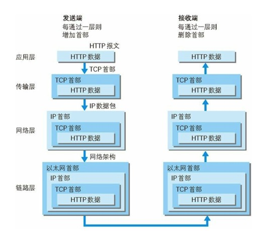
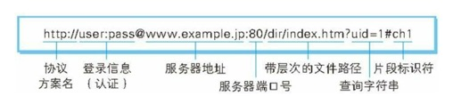
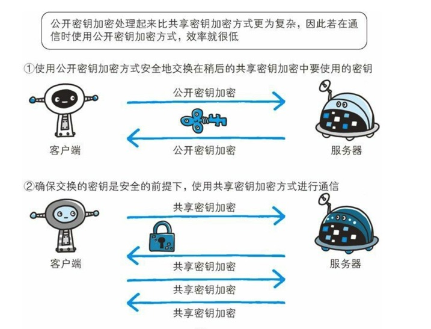
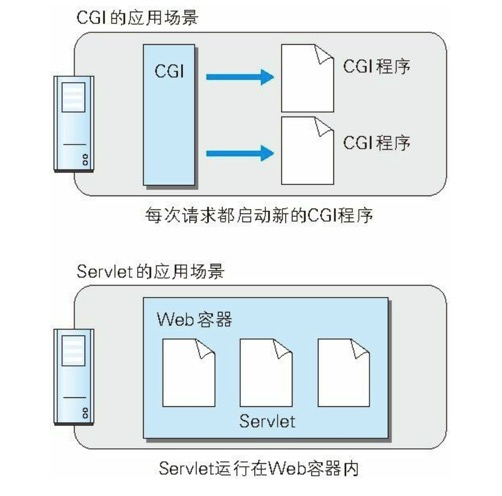

# 图解HTTP

[日]上野 宣

作者以简单的明了的角度带我们理解了HTTP。

## 前言了解




### 负责传输的IP协议

IP(Internet Protocol)网际协议位于网络层。作用就是把各种数据传输给对方。依赖MAc地址，通常情况下，多台计算机和网络设备中转才能连接到对方，而进行中转的时候，**利用下一站的中转设备的MAC地址来搜索下一个中转的目标**。这时候就会用到**ARP协议**（Address Resolution Protocol）地址解析协议。

### 确保可靠性的TCP协议

负责提供可靠的字节流服务。为了传输方便，将大块数据分割成以报文段(segment)为单位的数据包进行管理。为了确保数据能够到达目标，采取三次握手策略。握手过程中使用了TCP标志(flag)  **SYN**(synchronize)同步和**ACK**(acknowledgement)确认。发送端发送带SYN标志的数据包给对方，接收方收到后，回传一个带SYN/ACK标志的数据包表示传达确认信息，最后，发送端再回传一个带ACK标志的数据包，代表握手结束。

### 负责域名解析的DNS服务

DNS(Domain Name System) 位于应用层的协议，提供域名到IP地址间的解析服务。

### URI和URL

URL (Uniform Resource Locator)统一资源定位符，指网页地址。

URI(Uniform Resource Identifier)统一资源标识符。包含URL



## HTTP协议

通过请求和相应的交换方式达成通信。

### 请求报文

请求的方法，URI，协议版本，可选的首部字段，和内容实体组成。

```http
POST /form/entry HTTP/1.1
Host:bigbig.me
Connection:keep-alive
Content-Type:application/x-www-form-urlencoded
Content-Length:16

name=admin&age=21
```

### 响应报文

协议版本，状态码，状态码原因短语，可选的响应首字段以及实体内容构成。

```http
HTTP/1.1 200 ok
Date:Tue,10 Jul 2016 06:50:15 GMT
Content-Length:362
Content-Type:text/html

<html>
....
```

### HTTP是无状态协议

对于发送过的请求和响应都不做持久化处理。

#### 使用Cookie的状态管理

解决HTTP本身无状态的问题

### 持久连接节省通信量

使用HTTP keep-alive或HTTP connection reuse方法。只要任意一端没有明确提出断开连接，则保持TCP连接状态。

#### 管线化

持久连接使得多数请求已管线化（pipeline）方式发送成为可能。不用等待响应也可以直接发送下一个请求。

## HTTP传输的方法

| 名称      | 描述                                       |
| ------- | ---------------------------------------- |
| GET     | 获取资源                                     |
| POST    | 传输实体主体                                   |
| PUT     | 传输文件，由于PUT方法本身不带验证机制，慎用。                 |
| HEAD    | 获取报文首部，和get一样，只是不返回报文主体内容，用于确认URI的有效性及资源更新的日期等 |
| DELETE  | 删除文件，和put相反                              |
| OPTIONS | 询问支持的方法，查询服务端支持的方法。                      |
| TRACE   | 追踪路径，和Max-Forwards搭配使用。                  |
| CONNECT | 要求用隧道协议连接代理                              |

## HTTP报文

```http
报文首部
空行{CR+LF} 
报文主体
```

`CR`（回车符号）对应16进制0x0d

`LF` （换行符号）对应16进制0x0a

```http
GET / HTTP/1.1
Host:bigbig.me
User-Agent:Mozilla/5.0
Accept:text/html,application/xhtml+xml
Accept-Language:cn,zh-cn
Accept-Encoding:gzip,deflate
DNT:1
Connection:keep-alive
If-Modified-Since:Fri,31 Aug 2016 02:02:20
If-None-Match:"43554adc-132a-433ac"
Cache-Control:max-age=0
```

### 通用首部字段：

| 字段名称              | 说明                        |
| ----------------- | ------------------------- |
| Cache-Control     | 控制缓冲的行为                   |
| Connection        | 逐跳首部，连接的管理                |
| Date              | 创建报文的日期和时间                |
| Pragma            | 报文指令,历史遗留，Pragma:no-cache |
| Trailer           | 报文末端的首部                   |
| Transfer-Encoding | 指定报文主体的传输编码方式             |
| Upgrade           | 升级为其他协议                   |
| Via               | 代理服务器的相关信息                |
| Warning           | 错误通知                      |

#### Cache-Control

```http
Cache-Control:private,max-age=0,no-cache
```

多个指令之间用“,”分割。

##### 缓存请求指令

| 指令              | 参数   | 说明              |
| --------------- | ---- | --------------- |
| no-cache        | 无    | 强制向源服务器再次验证     |
| no-store        | 无    | 不缓存请求或响应的任何内容   |
| max-age=[秒]     | 必需   | 响应的最大Age值       |
| max-stale(=[秒]) | 可省略  | 接收已过期的响应        |
| min-fresh=[秒]   | 必需   | 期望在指定时间内的响应任然有效 |
| no-transform    | 无    | 代理不可更改媒体类型      |
| only-if-cached  | 无    | 从缓存获取资源         |
| cache-extension | -    | 新指令标记(token)    |

##### 缓存响应指令

| 指令               | 参数   | 说明                      |
| ---------------- | ---- | ----------------------- |
| public           | 无    | 可向任意方提响应的缓存             |
| private          | 可省略  | 仅向特定用户返回响应              |
| no-cache         | 可省略  | 缓存前必须先确认其有效性            |
| no-store         | 无    | 不缓存请求或响应的任何内容           |
| no-transform     | 无    | 代理不可更改媒体类型              |
| must-revalidate  | 无    | 可缓存但必须再向源服务器进行确认        |
| proxy-revalidate | 无    | 要求中间缓存服务器对缓存的响应有效性再进行确认 |
| max-age=[秒]      | 必需   | 响应的最大age值               |
| s-maxage=[秒]     | 必需   | 公共缓存服务响应的最大值Age         |
| cache-extention  | -    | 新指令标记(token)            |

**public指令：**

表明其他用户也可以使用该缓存。

**private指令：**

只是特定用户的缓存。其他用户不可以使用该缓存。

**no-cache指令：**

防止从缓存中返回过期的资源。

客户端请求设置no-cache,则表示：我不要缓存过的，请给我从源服务器那里拿来的资源。

服务端响应设置no-cache,则表示：你可以缓存，但每次使用前记得先向我确认一下。

**no-store指令：**

暗示请求或响应中包含机密信息，不要缓存。no-cache只是不缓存过期的资源，该指令才是真正的不缓存。

**s-maxgae指令：**

同max-age指令，不同的是，该指令只使用于提供多位用户的公共缓存服务器。

**max-age指令：**

```http
Cache-Control:max-age=604800(单位:秒)
```

客户端请求包含：要是缓存过期没有超过max-age时间，就把它给直接给我。

服务端响应包含：在max-age时间内，不必再向我确认和请求，你可以直接支配该缓存。

在HTTP/1.1中同时存在Expires时，会优先使用Max-age，HTTP/1.0中会优先使用Expires

**Min-fresh指令：**

要求缓存服务器返回至少还未过知道时间的缓存资源。

**Max-stale指令：**

如果指令未知道参数值，即不指定时间，表示无论多久，客户端都会接收响应。如果指定了值，那么即使过期，只要仍然处于max-stale指定的时间内，仍旧会被客户端接收。

**Only-if-cached指令：**

表示客户端仅在缓存服务器本地缓存目标资源的情况下才会要求其返回。

**must-revalidate指令**

代理会向源服务器再次验证即将返回的响应缓存是否仍然有效。

**proxy-revalidate指令**

要求所有的缓存服务器在接收到客户端带有该指令的请求返回响应前，必须再次验证缓存的有效性。

**no-transform指令**

规定无论在请求还是响应中，缓存都不能更改主体的媒体类型。

#### Connection:

**1）控制不再转发给代理的首部字段**

客户端：

```http
GET / HTTP/1.1
Upgrade:HTTP/1.1
Connection:Upgrade
```

代理服务器：

```http
GET / HTTP/1.1
```

标识不需要转发的指令。

**2）管理持久化连接**

```http
GET / HTTP/1.1
Connection:Keep-Alive
```

```http
HTTP/1.1 200 ok
Keep-Alive:timeout=10,max=500
Connection:Keep-Alive
....
```

#### Date：

表明创建HTTP报文的日期和时间。

Date:Tue,03 Jul 2016 04:40:59 GMT

Date:Tue Jul 03 04 04-40-59 2016

#### Trailer：

表明在报文主体记录了哪些首部字段，需要特别关注。即我在报文中写了很重要的指令Expires，请务必仔细阅读报文。

#### Transfer-Encoding:

规定传输报文主体的采用的编码方式。一般值为：

Transfer-Encoding:chunked 。

#### Upgrade：

客户端：能让我适应TLS/1.0,检测是否可使用更高的版本进行通信。

```http
GET /index.htm HTTP/1.1
Upgrade:TLS/1.0
Connection:Upgrade
```

服务端：可以使用这些更高的版本通信

```http
HTTP/1.1 101 Switching Protocols
Upgrade:TLS/1.0,HTTP/1.1
Connection:Upgrade
```

#### Via：

用于追踪客户端于服务端之间的请求和响应报文的传输路径。

报文在经过代理或者网关时，会先在首部字段Via中附加该服务器的信息，然后进行转发。

```http
GET / HTTP/1.1
```

```http
GET / HTTP/1.1
Via:1.0 Squid/3.1
```

```http
GET / HTTP/1.1
Via:1.0 Squid/3.1,1.1 bigbig.me(Squid/2,7)
```

#### Warning：

告知用户一些缓存相关问题的警告

```http
Warning:113 gw.bigbig.me:8080 "Heuristic expiration" Tue,03
```

### 请求首部字段

| 字段名                 | 说明                             |
| ------------------- | ------------------------------ |
| Accept              | 用户代理可处理的媒体类型                   |
| Accept-Charset      | 优先的字符集                         |
| Accept-Encoding     | 优先的内容编码                        |
| Accept-Language     | 优先的语言（自然语言）                    |
| Authorization       | Web认证信息                        |
| Expect              | 期待服务器的特点行为                     |
| From                | 用户的电子邮箱地址                      |
| Host                | 请求的资源所在服务器                     |
| If-Match            | 比较实体标记(Etag)                   |
| If-Modified-Since   | 比较资源的更新时间                      |
| If-None-Match       | 比较实体标记（和If-Match反）             |
| If-Range            | 资源未更新时发生实体Byte的范围请求            |
| If-Unmodified-Since | 比较资源的更新时间（和If-Modified-Since反） |
| Max-Forwards        | 最大的传输逐跳数                       |
| Proxy-Authorization | 代理服务器要求客户端的认证                  |
| Range               | 实体的字节范围请求                      |
| Referer             | 来源请求URI                        |
| TE                  | 传输编码的优先级                       |
| User-Agent          | HTTP客户端程序的信息                   |

#### Accept：

请给我该资源的对应的格式。

Accept:**text/plain;q=0.3**,text/htm

最好发给我html格式(7/10)的，如果没有，给我text格式(3/10)的也可以。

```http
q=来额外表示权重，用分号进行分割，权重值在0-1之间。默认表示1.0
```

#### Accept-Charset：

客户端：我想以这个字符集阅读返回的页面。

```http
Accept-Charset:iso-8859-5,unicode-1-1;q=0.8
```

#### Accept-Encoding：

告知服务器支持的内容编码和内容编码的优先级顺序。

```http
Accept-Encoding:gzip,deflate
```

**gizp：**GNU zip生成的编码格式采用LZ77算法

**compress:**采用LZW算法

**deflate:**组合使用zlib格式，由deflate压缩算法生成编码格式

**indentity:**不执行压缩或不变化默认编码格式

#### Accept-Language:

告知服务器能够处理的自然语言集和对应的优先级

```http
Accept-Language:zh-cn,zh;q=0.7,en-us,en;q=0.3
```

#### Authorization:

当服务端返回需要认证的时候，把具体的认证信息发送给服务端。

采用base64

Authorization:Basic dWV…==

#### Expect：

期望服务端能做到。

```http
Expect:100-continue
```

#### From：

告知服务端用户的电子邮箱

#### Host:

指定访问的主机

#### If-xxx：

客户端指定对应的条件，如果服务端判断指定条件为真时，才会执行请求。

**If-Match和If-no-Match：**

如果实体标记匹配则返回。

```http
GET /index.htm HTTP/1.1
If-Match:"123456"
```

```http
HTTP/1.1 200 ok
ETag:"123456"
```

如果不匹配则返回412Precondition Failed。

可以使用*指定。代码所有，将忽略ETag的值。

**If-Modified-Since和If-Unmodified-Since:**

在指定的日期时间后，资源发生了更新，服务器会接收请求。否则返回304 Not Modified.

```http
GET /index.html HTTP/1.1
If-Modified-Since:Thu,15 Apr 2016 00:00:00 GMT
```

```http
HTTP/1.1 200 ok
Last-Modified:Sun,29 Aug 2016 14:03:05 GMT
```

```http
HTTP/1.1 304 Not Modified
```

#### If-Range

告知服务器若指定的If-Range字段值（ETag值或时间）和请求的ETag或时间一样，则安之指定范围返回请求，反之，返回全部资源。

```http
GET /index.html HTTP/1.1
If-Range:"123456"
Range:bytes=5001-10000
```

若：返回的响应Etag值匹配123456则返回

```http
HTTP/1.1 206 Partial Content
Content-Range:bytes 50001-10000/10000
Content-Length:5000
```

如果使用If-Match:"123456" 和 Range:5001-10000 当失效的时候会返回412 Percondition Faild(你要的资源以及没有了，你重新发个请求过来吧)，即需要2次请求。

#### Max-Forwards：

指定可经过的服务器最大数目，很多请求会中间经历过几次代理。指定Max-Forwards时，则会在经历过指定值之后返回。每经历一台-1，直到0。

#### Proxy-Authorization：

当收到代理服务器发来的认证咨询时，用该首部字段发送认证信息。

#### Range：

获取部分资源的范围请求。

#### Referer：

告知服务器请求的原始资源URI

#### TE：

告知服务端客户端能够处理响应的**传输编码**方式和优先级。和Accept-Encoding很像，但该指令只是用于传输编码。

#### User-Agent：

告知服务端客户端的相关信息。

### 响应首部字段

| 字段名称               | 说明             |
| ------------------ | -------------- |
| Accept-Ranges      | 是否接受字节范围请求     |
| Age                | 推算资源创建经历过的时间   |
| ETag               | 资源的匹配信息        |
| Location           | 令客户端重定向到指定的URI |
| Proxy-Authenticate | 代理服务器对客户端的认证信息 |
| Retry-After        | 对再次发起请求的时机要求   |
| Server             | HTTP服务器的安装信息   |
| Vary               | 代理服务器的缓存的管理信息  |
| WWW-Authenticate   | 服务器对客户端的认证信息   |
| Allow              | 资源可执行的HTTP方法   |
| Content-Encoding   | 实体主体适用的编码方式    |
| Content-Language   | 实体主体的自然语言      |
| Content-Length     | 实体主体的大小，单位字节   |
| Content-Location   | 代替对应资源的URI     |
| Content-MD5        | 实体主体的报文摘要      |
| Content-Range      | 实体主体的位置范围      |
| Content-Type       | 实体主体的媒介类型      |
| Expires            | 实体主体过期的日期时间    |
| Last-Modified      | 资源的最后修改日期时间    |

#### Accept-Ranges：

告知客户端服务端是否能处理返回请求

Accept-Ranges:bytes 表示可以

Accept-Ranges:none 表示不行

#### Age:

告知客户端，源服务器在多久前创建了响应。单位秒。

#### ETag：

告知客户端实体标识。服务端生成的，没有统一算法。

强Etag：“123456” 不论实体发送多么微小的变化都会更改其值

弱ETag：W/"123456" 只有资源发生了根本改变，才会变化。

#### Location:

配合3xx使用。重定向的地址。

#### Proxy-Authenticate:

把代理服务器要求的认证信息发送给客户端。

#### Retry-After:

告知客户端应该多久之后再次发送请求，配合503 Service Unavailable使用。单位秒

Retry-After:120 过5分钟后再来访问。

#### Server:

告知客户端，服务端相关的信息。

#### Vary：

告知代理服务器，只对响应的首部字段返回

```http
GET /sample.html HTTP/1.1
Accept-Language:en-us
```

中间有代理，服务端返回给代理

```http
HTTP/1.1 200 ok
Vary:Accept-Language
```

#### WWW-Authenticate：

告知客户端需带认证信息来访问。告知具体的方案是Basic还是Digest。和401 Unauthorized配合使用。

#### Allow:

告知客户端服务端支持的请求方法

Allow:GET,HEAD,POST 

对应错误状态码405 Method Not Allowed

#### Content-Encoding:

告知客户端，服务端使用的内容编码方式。gizp/compress/deflate/identity

Content-Encoding:gzip

#### Content-Language:

告知客户端，主体使用的自然语言

Content-Language:zh-CN

#### Content-Length:

告知客户端实体主体部分的大小，单位字节

#### Content-Location：

告知客户端报文主体部分对应的URI

如访问的是http://bigbig.me 返回的是http://bigbig.me/index-zh.html

#### Content-MD5：

报文主体md5后再base64编码。用于确认报文的准确性。

#### Content-Range：

针对客户端的范围请求，返回响应告知对应的返回范围。

```http
Content-Range:bytes 5001-10000/10000
```

返回的是5001-10000实体内容，内容总长度是10000。

#### Content-Type：

告知客户端返回的主体对象的媒体类型。

```http
Content-Type:text/html;charset=UTF-8 
```

参数charset告知使用的字符集。

#### Expires：

告知客户端对应资源能使用多久，即在什么时候到期。

Expires:Web,04 Jul 2016 08:26:05 GMT

#### Last-Modified：

告知客户端对应资源什么时候被修改。


### 非HTTP/1.1首部字段

#### Cookie:

Set-Cookie：响应首部字段，服务端设置

Cookie:请求首部字段，客户端带上。

```http
Set-Cookie:name=xxx;expires=Tue,05,Jul 2016 07:00:00;path=/;domain=bigbig.me;secure;HttpOnly
```

| 属性           | 说明                          |
| ------------ | --------------------------- |
| NAME=VALUE   | 对应名称和值                      |
| expires=DATE | 有效期，不指定则为对应的浏览器关闭前为止        |
| path=PATH    | 将服务器上的文件目录作为cookie的适用对象     |
| domain=域名    |                             |
| Secure       | 仅在https安全通行的时候才会发送cookie    |
| HttpOnly     | 现在对应cookie不能被javascript脚本访问 |

#### X-Frame-Options:

响应首部，控制网站内的其他web站点frame标签显示问题，防止点击劫持攻击。

**DENY:**拒绝

**SAMEORIGIN:**同源域名下许可。

X-Frame-Options:DNEY

#### X-XSS-Protection:

响应首部，针对XSS攻击的对策，用于控制浏览器XSS防护机制的开关

0/1:关闭/开启

X-XSS-Protection:1

#### DNT：

请求首部，do not track，拒绝个人信息被收集。拒绝被精准广告追踪的一种方法。

0/1：同意/拒绝

#### P3P：

响应首部，The Platform for Privacy Perferences在线隐私偏好平台。可以放web网站上的个人隐私变成一种仅供查询可以理解的形式。以达到保护用户隐私的目的。

### Content-Description:


### End-to-End和Hop-By-hop首部

定义缓存代理和非缓存代理的行为。

#### 端到端首部End-toend Header

分在此类中的首部会穿法给请求/响应对应的最终接收目标，且必须保持在由缓存生成的响应中。另外规定它必须被转发

#### 逐跳首部Hop-by-hop Header

分在此类别的中的首部只对单次转发有效，会通过缓存或代理而不再转发。


## HTTP状态码

| 状态码  | 类别                             |
| ---- | ------------------------------ |
| 1xx  | infomational(信息状态码)，接收的请求在处理   |
| 2xx  | Success(成功状态码),请求正常的处理完毕       |
| 3xx  | Redirection(重定向),需要进行附加操作以完成请求 |
| 4xx  | Client Error(客户端错误)，服务器无法处理请求  |
| 5xx  | Server Error(服务端错误),服务器处理请求出错  |

### 204 No content

请求处理成功，但没有资源可返回。

### 206 Partial Content

表示客户端请求部分范围资源，而服务端成功执行了该请求，响应报文包含由`Content-Range`指定范围的实体内容。

### 301 Moved Permanently

永久性重定向。

### 302 Found

临时性重定向。

### 303 See Other

和302同，唯一不同的是，303指定只能用get请求新的地址。

### 304 Not Modified

客户端附带条件请求，服务端准许请求访问的资源，但未满足对应的条件。

如：If-Match,If-Modified-Since,If-None-Match,If-Range,If-Unmodified-Since.

### 307 Temporary Redirect

同302 遵循浏览器标准，不会冲post转get

### 400 Bad Request

请求报文中存在语法错误。

### 401 Unauthorized

需要认证信息。

### 403 Forbidden

不准许访问的资源

### 404 Not Found

没有找到对应的资源

### 500 Internal server Error

内部资源出故障

### 503 Service Unavailable

服务器超负载或在进行停机维护。

## HTTP的安全问题

### HTTP的不足：

1. 通信使用明文（不加密）内容可能被窃听。
2. 不验证通信方的身份，可能遭遇伪装。
3. 无法证明报文的完整性，可能被篡改。

### HTTPS：

HTTP+通信加密+证书+完整性保护

身披SSL外壳的HTTP。使用SSL(Secure Socket Layer)和TLS(Transport Layer Security)

SSL独立于HTTP协议，

**SSL采取公开密钥加密技术**：Public-Key cryptography.

**对称密钥加密：**加密和解密使用同一个密钥的方式称为共享加密密钥加密。该方案的难点是如何把密钥安全的给到对方。如果密钥给别人拿到，则就失去了意义。

**使用两把密钥的公开密钥加密：**非对称密钥，一把私有密钥，一把公开密钥，即，别人用我公开的密钥加密东西，然后发送给我，我再用自己的私有密钥解密。这样就只有我自己的私有密钥才能打开。不担心被窃听。**服务端开销大**，处理慢。

**HTTPS采用混合加密机制：**采用共享加密和公开密钥加密两个并用的混合加密机制。主要原因是公开密钥的方式，处理速度慢。



### 证明公开密钥正确性的证书：

公开加密的另外一个问题是，客户端不能确信现在访问的服务端就是预想的对应服务器。

为了解决该问题，所以引入了数字证书认证机构（CA,Certificate Authority ）借助第三方信任机构（已经植入在对应的浏览器中）。

1. 服务器提前把自己的公开密钥放入至数字证书认证机构
2. 数字认证机构用自己的私有密钥，在服务端的公开密钥签署数字签名并颁发公钥证书。
3. 客户端访问的时候先从认证机构下载对应的证书，得到服务端的公开密钥。
4. 用公开密钥加密后发送请求。

### SSL和TLS:

SSL开始由网景公司倡导，开发SSL3.0之前的版本，后面转移到IETF手中，IETF以SSL3.0为基准，制定了TLS1.0和TLS1.1和TLS1.2。目前主流是SSL3.0和TLS1.0

### HTTPS比HTTP要慢2-100倍：

所以有时候只在核心地方加密。

## 消除HTTP瓶颈

- 一条连接上只能发送一个请求
- 请求只能从客户端开始，客户端不可以接收响应以外的指令。
- 请求、响应首部未经过压缩，首部信息越多，延迟越大。
- 发送冗长的首部。每次发送相同的首部造成浪费较多。
- 可任意选择压缩格式，非强制性。

### Ajax解决方案：

### Comet解决方案：

延迟应答，模拟实现服务端向客户端推送功能。为了保留响应，一次连接的持续时间会变长，维护连接消耗更多的资源。未解决协议本身问题。

### SPDY解决方案：

在TCP/IP的应用层与传输层之间通过新追加会话层的运行方式。考虑到安全性问题，规定使用SSL。

- 多路复用流：通过单一的TCP连接，可以无限制处理多个HTTP请求。
- 赋予请求优先级。
- 压缩HTTP首部
- 增加推送功能
- 服务提升功能，可以主动提升客户端请求所需要的资源。

缺点：只是将单个域名的通信多路复用，不支持多个域名。

### 使用websocket：

推送功能，减少通信量。

### HTTP/2.0

SPDY+(HTTPSeed + Mobility) + NetWork-Friendly HTTP Upgrade

Google：SPDY，HTTP Speed + Mobility ：微软，提高移动端通信速度和性能标准

NetWork-Friendly HTTP Upgrade 移动端通信改善HTTP性能的标准。

- 多路复用，SPDY
- TLS义务化,Speed+Mobility,
- 协商，Speed+Mobility,Friendly
- 客户端拉拽Client Pull 、服务端推送Server Push ，Speed+Mobility
- 流量恐慌，SPDY
- Websocket：Speed+Mobility

在HTTP/2中，在应用层（HTTP2.0）和传输层（TCP或者UDP）之间加了一层：**二进制分帧层**。这是HTTP2中最大的改变

在HTTP1.1协议中，浏览器客户端在同一时间，针对同一域名下的请求有一定数量的限制，超过了这个限制的请求就会被阻塞。而**多路复用**允许同时通过单一的 HTTP2.0 连接发起多重的“请求-响应”消息。

HTTP/1.1的header带有大量信息，而且每次都要重复发送。HTTP/2 为了减少这部分开销，采用了HPACK 头部压缩算法对Header进行压缩。

### WebDAV：

web服务器管理文件。基于web的分布式创作和版本控制。

## WEB服务器：

### CGI：

Common Gateway Interface：通用网关接口，指web服务器在接收到客户端发送请求后转发给程序的一组机制。使用CGI的程序叫做CGI程序，通常是Perl,PHP,Ruby,C等。

### java的Servlet：

在服务器上创建动态内容的程序，对比CGI，CGI由于每次接到请求，程序都要跟着启动一次。因此访问量过大，web服务器压力非常大。而servlet的运行和web服务器相同的进程中，所以负载较小。



## 单点登录：

1）每个域名只能带上自己的sessionId

2）二级域名，可以使用cookie设置根域名有效。

登录过程：

1）浏览器，访问 A.com的时候，先访问跳转到oss.com。没有session，则返回登录页面。

2）输入密码登录到oss.com ,给浏览器返回登录后的oss_session。

3）oss.com创建一个令牌，跳转发给A.com

4）A.com把令牌再传入oss.com验证令牌是否一致。验证通过，创建a_session，返回到浏览器。

5）浏览器再次访问A.com,因为有a_sessionId所以可以正常使用。

6）浏览器访问B.com 没有b_session,

7）浏览器跳转到oss.com，因为有oss_session,

8）oss.com创建一个令牌，跳转发给B.com

9）B.com把令牌再传入oss.com验证令牌是否一致，验证通过，创建b_session.返回给浏览器。

https://yq.aliyun.com/articles/636281


https://www.cnblogs.com/ywlaker/p/6113927.html

