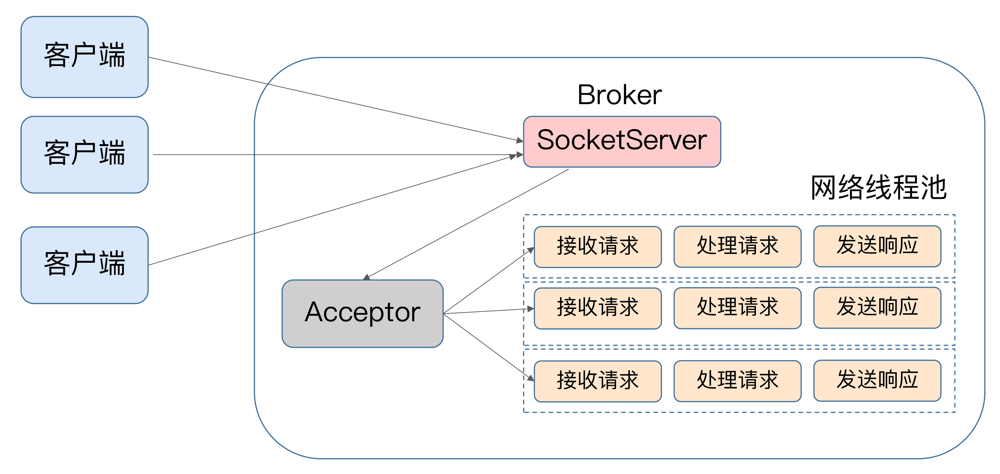
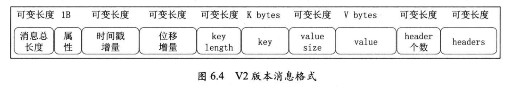
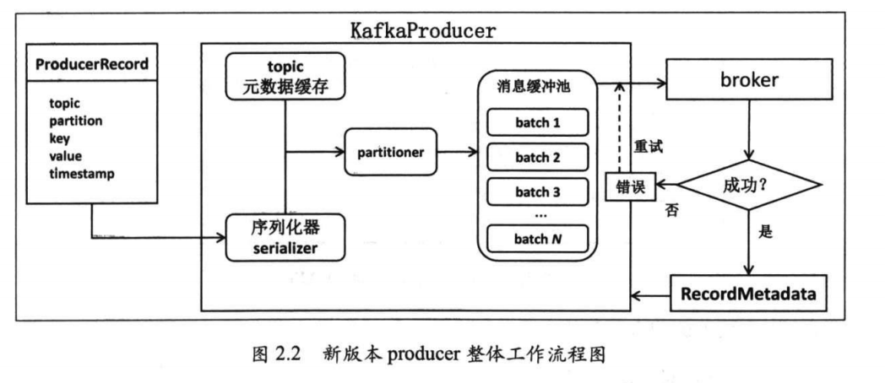
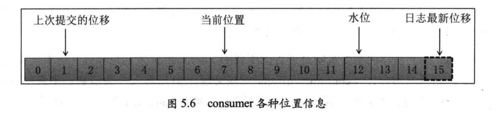
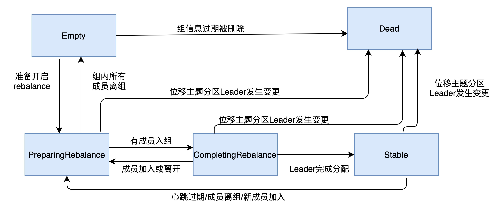
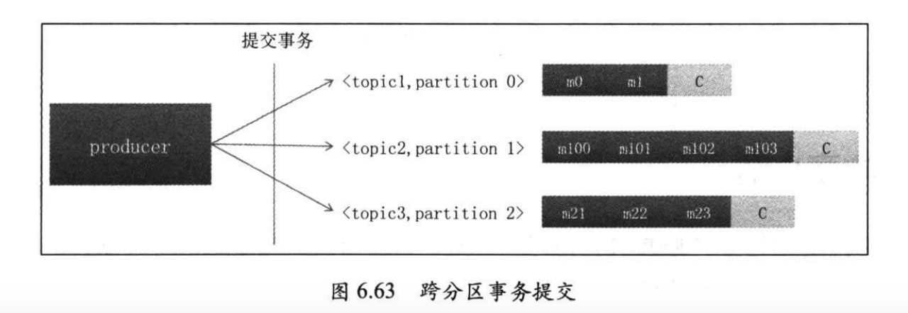

# kafka实战

scala编写的

https://kafka.apache.org/documentation/

各个配置参数含义：

https://www.cnblogs.com/yx88/p/11013338.html

https://www.cnblogs.com/miracleYu/p/10213807.html


Apache Kafka 是消息引擎系统，也是一个分布式流处理平台（Distributed Streaming Platform)

Kafka 在设计之初就旨在提供三个方面的特性：**提供一套 API 实现生产者和消费者；降低网络传输和磁盘存储开销；实现高伸缩性架构**。

**Apache Kafka**，也称社区版 Kafka。优势在于迭代速度快，社区响应度高，使用它可以让你有更高的把控度；缺陷在于仅提供基础核心组件，缺失一些高级的特性。

**Confluent Kafka**，Confluent 公司提供的 Kafka。优势在于集成了很多高级特性且由 Kafka 原班人马打造，质量上有保证；缺陷在于相关文档资料不全，普及率较低，没有太多可供参考的范例。

**CDH/HDP Kafka**，大数据云公司提供的 Kafka，内嵌 Apache Kafka。优势在于操作简单，节省运维成本；缺陷在于把控度低，演进速度较慢

## 特点

### 吞吐量/延迟

1）消息是批量写，假设有一小批消息，先等等8毫秒（则消息延迟2+8毫秒，增加了4倍），但是8毫秒内累计了1000条消息，那么吞吐量100000条/秒，提示200倍

2）kafka大量使用操作系统页缓存，内存操作速度快且命中率高，不和底层文件系统打交道，I/O操作由操作系统处理，且写入采取的是追加模式，避免了随机写操作(**这样就导致kafka不支持消息内容更改**)

3）使用以sendfile为代表的零拷贝技术加强网络间的数据传输效率

### 消息持久化

很多消息中间件都是消息消费完毕，则删除

1）解耦消息发送与消息消费，即 发送是发送，消费是消费，kafka直接成为了一个数据库

2）实现灵活的消息处理，因为消息已经被存储，者可以灵活的根据位移和时间消费

注：不好的地方，就是消费者要注意重复消费问题。业务需要幂等性。

### 负载均衡和故障转移

1）智能分区领导者选举实现 负载均衡

2）通过会话心跳机制，依靠zk实现故障转移

### 伸缩性

依靠zk实现集群化部署

## 名称含义


### 消息：Record

Kafka 是消息引擎嘛，这里的消息就是指 Kafka 处理的主要对象。

### 主题：Topic

主题是承载消息的逻辑容器，在实际使用中多用来区分具体的业务。

### 分区：Partition

一个有序不变的消息序列。每个主题下可以有多个分区。

### 消息位移：Offset

表示分区中每条消息的位置信息，是一个单调递增且不变的值。

### 副本：Replica

Kafka 中同一条消息能够被拷贝到多个地方以提供数据冗余，这些地方就是所谓的副本。副本还分为领导者副本和追随者副本，各自有不同的角色划分。副本是在分区层级下的，即每个分区可配置多个副本实现高可用。

### 生产者：Producer

向主题发布新消息的应用程序。

### 消费者：Consumer

从主题订阅新消息的应用程序。

### 消费者位移：Consumer Offset

表征消费者消费进度，每个消费者都有自己的消费者位移。

### 消费者组：Consumer Group

多个消费者实例共同组成的一个组，同时消费多个分区以实现高吞吐。

### 重平衡：Rebalance

消费者组内某个消费者实例挂掉后，其他消费者实例自动重新分配订阅主题分区的过程。Rebalance 是 Kafka 消费者端实现高可用的重要手段。

## Broker服务器

理解为kafka一个服务器



### 参数配置

#### borker.id

唯一标识

#### log.dirs

可以指派多个目录，用逗号分隔，这里就可以挂载多个物理硬盘

如/home/kafka1,/home/kafka2,/home/kafka3这样。

如果有条件的话你最好保证这些目录挂载到不同的物理磁盘上。这样做有两个好处：

提升读写性能：比起单块磁盘，多块物理磁盘同时读写数据有更高的吞吐量。

能够实现故障转移：即 Failover。

#### zookeeper.connect

zk的配置

#### listeners

开放给客户端的监听端口，还有一个advertised.listeners 用于IaaS环境，用于配置多块网卡

#### auto.create.topics.enable

建议是false,即不准许自动创建topic,不然如果发送者随便写一些topic，比较乱

#### unclean.leader.election.enable

是否开启unclean leader选举 ，对应 ISR. **建议false**.

假设那些保存数据比较多的副本都挂了怎么办？我们还要不要进行 Leader 选举了？此时这个参数就派上用场了。如果设置成 **false，那么就坚持之前的原则，坚决不能让那些落后太多的副本竞选 Leader**。这样做的后果是这个分区就不可用了，因为没有 Leader 了。**反之如果是 true，那么 Kafka 允许你从那些“跑得慢”的副本中选一个出来当 Leader**。这样做的后果是数据有可能就丢失了，因为这些副本保存的数据本来就不全，当了 Leader 之后它本人就变得膨胀了，认为自己的数据才是权威的。

#### delete.topic.enable

是否准许kafka删除topic

#### log.reterntion.{hours|minutes|ms}

消息的留存时间控制，日志有效性留存

log.retention.hours=168表示默认保存 7 天的数据，自动删除 7 天前的数据

#### log.retention.bytes

上一个 是时间维度，这一个是存储空间的定义留存。最大保留多少日志

这个值默认是 -1，表明你想在这台 Broker 上保存多少数据都可以，至少在容量方面 Broker 绝对为你开绿灯，不会做任何阻拦

#### num.network.threads

后台处理网络请求的线程数 默认3 只负责转发请求，它会将接收到的请求转化到后面的处理线程中

#### num.io.threads

处理网络请求的线程数数 默认8个，监听转发过来的网络请求，实时处理数据。

#### message.max.bytes

最大消息大小，默认977kb 


### topic 级别参数

#### message.max.bytes

最大消息大小，默认977kb  覆盖broker

#### reterntion.{hours|minutes|ms}

消息的留存时间控制，日志有效性留存 覆盖broker

#### retention.bytes

上一个 是时间维度，这一个是存储空间的定义留存。最大保留多少日志 覆盖broker


### JVM

推荐使用G1，6G堆空间

### 设计原理

#### 消息格式：



#### 消息压缩

Producer 发送压缩消息到 Broker 后，Broker 照单全收并原样保存起来。当 Consumer 程序请求这部分消息时，Broker 依然原样发送出去，当消息到达 Consumer 端后，由 Consumer 自行解压缩还原成之前的消息

它自然就知道了这些消息使用的是哪种压缩算法。如果用一句话总结一下压缩和解压缩，那么我希望你记住这句话：**Producer 端压缩、Broker 端保持、Consumer 端解压缩**。

除了在 Consumer 端解压缩，Broker 端也会进行解压缩。注意了，这和前面提到消息格式转换时发生的解压缩是不同的场景。每个压缩过的消息集合在 Broker 端写入时都要发生解压缩操作，目的就是为了对消息执行各种验证。-->尽量避免producer和broker的压缩格式不一样

吞吐量：LZ4>Snappy>zstd 和GZIP

压缩比:zstd > LZ4 >gzip > snappy


#### 集群管理

注册到zk 目录 /borkers/ids/<broker.id> 注册信息存储的JSON格式，其中json的version表版本，目前有4个版本

注册的是一个临时节点。

kafka的在zk下面的储存

- /brokers:里面保持所以kafka集群的所有信息，包括每台broker的注册信息，集群上所有的topic信息等
- /controller,保存了controller组件，负责集群领导者选举，也负责controller的动态选举
- /admin 保存管理脚本的输出结果，如删除topic,对分区进行重分配操作
- /isr_change_notification:保存ISR列表发生变化的分区列表，controller会注册一个监听器监控该节点下子节点的变更。
- /config 保存各种资源的定制化配置信息，如/config/topics/< topic> 
- /cluster:保存集群简要信息，ID和版本号
- /controller_epoch:保存controller组件版本号，用来隔绝无效controller请求

#### 副本与ISR设计

一个kafka分区本质上就是一个备份日志，即利用多份相同的备份共同提高冗余机制来保持系统高可用，这些备份被称为**副本(replica)**.,kafka把分区的所有副本均匀的分配到所有的broker上，并从这些副本中挑选一个座位**leader副本**，对外提供服务，其他的副本则为**follower副本**；followe副本，只能被动的向leader副本请求数据，保持和leader的副本同步。-->每个分区有自己的leader副本

一旦leader副本挂掉，follower副本就会竞争成为新的leader副本，当然不是所有的followe副本有资格竞争，如一些落后很多的副本，如果成为leader，会照成数据丢失，所以引入ISR概念。

所谓**ISR**,就是kafka集群动态维护的一组**同步副本集合(in-sync replicas)**，每个topic有自己独立的ISR列表

ISR列表的所有副本与leader保持同步状态，其中leader副本总是包含在ISR列表中，只有在ISR列表中的副本才有资格成为leader, 且producer写入的消息，只有被ISR列表所有的副本接收到，才会被视作 "已提交" 状态。

假如起始位移为0

1）broker1上的leader副本接收到消息，把自己的**LEO(log end offset日志末端位移)**值更新为1

2）broker2和broker3上的follow副本各种发送请求给broker1. ->fetch请求

3）broker1分别把该消息推送给follower副本。

4）follower副本接收到消息后，更新自己的LEO为1

5）leader副本接收到其他followe副本请求影响后，更新**HW(high watermark)**值为1，这个时候位移为0的消息才可以被consumer消费

##### ISR

通过replica.lag.time.max.ms控制 默认10秒，如果一个follower副本落后leader的时间持续性地超过了这个参数值，那么表示follower副本就是"不同步"的,则被踢出ISR列表，后续如果更上，再会假如进来。

##### Unclean 领导者选举（Unclean Leader Election）

unclean即不干净的 选举

既然 ISR 是可以动态调整的，那么自然就可以出现这样的情形：ISR 为空。因为 Leader 副本天然就在 ISR 中，如果 ISR 为空了，就说明 Leader 副本也“挂掉”了，Kafka 需要重新选举一个新的 Leader。可是 ISR 是空，此时该怎么选举新 Leader 呢？

**Kafka 把所有不在 ISR 中的存活副本都称为非同步副本**。通常来说，**非同步副本落后 Leader 太多，因此，如果选择这些副本作为新 Leader，就可能出现数据的丢失**。毕竟，这些副本中保存的消息远远落后于老 Leader 中的消息。在 Kafka 中，选举这种副本的过程称为 Unclean 领导者选举。Broker 端参数 **unclean.leader.election.enable** 控制是否允许 Unclean 领导者选举。开启 Unclean 领导者选举可能会造成数据丢失，但好处是，它使得分区 Leader 副本一直存在，不至于停止对外提供服务，因此提升了高可用性

建议是关闭

#### 日志存储设计

按照时间顺序在日志末尾追加写入记录 record(消息和一些必要的元数据信息打包在一起封装成一个record写入日志)，理解为消息集合或者消息batch。

日志是已分区为单位，即每个分区都有它自己的日志，该日志称为，分区日志 partition log。

对于每个日志文件，又细分为日志段文件log segment file以及日志段索引文件。

```shell
ll -h /.../datalogs/kafka_1/test-0
... 00000000000000000.index
... 00000000000000000.log
... 00000000000000000.timeindex
... 00000000000001450.index
... 00000000000001450.log
... 00000000000001450.timeindex
```

test-0 表示topic我test的0分区，如果有5个分区，test-0,test-1，..test-4

20位数字标识，第二段 1450表示 有日志1449条，1450表示第一条的位移号，每个段文件是通过log.segment.bytes控制，默认1G，每段填满后，则生成新的日志段。

.index为位移索引文件,log.index.interval.bytes 默认4k，根据该值，每4k增加一个索引项。

.timeindex为时间戳索引文件

两个索引都是按照顺序来的，即查找的时候通过二分查找即可快速定位

索引文件又分当前日志段和非当前日志段，非当前的只读。

##### 日志留存

kafka会定期清除日志，清除的单位是日志段文件，删除符合清除策略的日志段文件和对应的两个索引文件

基于时间，log.retention.{hours|minutes|ms}，基于大小log.retention.bytes 默认-1 不限制

##### 日志压实log compaction

相同key的消息被压缩成最新的value的消息(?消息不能修改，哪里来的相同的key，-->特殊topic的位移）

Kafka 提供了专门的后台线程定期地巡检待 Compact 的主题，看看是否存在满足条件的可删除数据。这个后台线程叫 Log Cleaner

#### controller设计

控制器，是在broker里面选举出来，担当的一个特殊角色，用来管理和协调kafka集群。管理所有分区的状态，并执行相应的管理操作。集群中任意时刻，只能有一个controller.

1.主题管理（创建、删除、增加分区）

2.分区重分配

3.Preferred（首选） 领导者选举

4.集群成员管理（新增 Broker、Broker 主动关闭、Broker 宕机）

5.数据服务

控制器上保存了最全的集群元数据信息，其他所有 Broker 会定期接收控制器发来的元数据更新请求，从而更新其内存中的缓存数据。


## 生产者producer



1）发送过程被划分到两个不同的线程，用户主线程和sender I/O线程

2）完全异步发送消息，并提供回调机制callback用于判断发送成功与否

3）分批机制，每个批次中包含多个发送请求，提升了整体吞吐量

4）更加合理的分区策略，对于没有指定key的消息而言，采取的是轮询分区发送。

5）底层统一使用基于java selector的网络客户端，结合java的future实现更加健壮和优雅的生命周期管理。

### 流程步骤

1）序列化+计算目标分区 --主线程

2）追加写入消息缓冲区(acumulator)--主线程

默认32MB buffer.memory的缓存区，专门保持待发送的消息，关键参数linger.ms,batch.size。缓冲区理解为本质是一个HashMap(**消息批次信息batches**)，里面包含了每个topic分区下的batch队列，

batches数据结构{"test-0"->[batch1,batch2],"test-2"->[batch3]},test-0标识topic  test 0分区，

消息写入缓冲区，则主线程的任务就基本完成，剩下的就是等待sender线程发送消息并执行返回结果

3）Sender线程预处理及消息发送--异步sender线程

不断轮询获取缓冲区已经准备的数据，将轮询的batch 按照目标分区的所在的leader broker进行分组，发送给目标broker,等待返回response

4）sender线程处理response--异步sender线程


```java
public interface Producer<K, V> extends Closeable {

    void initTransactions();

    void beginTransaction() throws ProducerFencedException;


    void sendOffsetsToTransaction(Map<TopicPartition, OffsetAndMetadata> offsets,
                                  String consumerGroupId) throws ProducerFencedException;

    void sendOffsetsToTransaction(Map<TopicPartition, OffsetAndMetadata> offsets,
                                  ConsumerGroupMetadata groupMetadata) throws ProducerFencedException;


    void commitTransaction() throws ProducerFencedException;

    void abortTransaction() throws ProducerFencedException;

    Future<RecordMetadata> send(ProducerRecord<K, V> record);

    Future<RecordMetadata> send(ProducerRecord<K, V> record, Callback callback);

    void flush();

    List<PartitionInfo> partitionsFor(String topic);

    Map<MetricName, ? extends Metric> metrics();

    void close();

    @Deprecated
    default void close(long timeout, TimeUnit unit) {
        close(Duration.ofMillis(unit.toMillis(timeout)));
    }
    void close(Duration timeout);
}
```

### 参数配置

##### bootstrap.servers

kafka broker的服务器连接，k1:9002,k2:9002,k3:9002 多个逗号分隔

注：启动的时候会连接其中的某一台，然后获取信息集群信息，再根据topic和分区连接目标服务器

#### Key.serializer

key的序列化

#### value.serializer

消息的序列化

#### acks

用于控制消息的持久性，

- acks=0 表示发送后，不理睬leader broker的返回影响，高吞吐量用，无法感知消息是否发送失败，回调就没有意义，消息可能丢失
- acks=all | -1 表示会等待所有的ISR成功写入后影响，只要ISR列表中有一个存活，消息肯定不会丢失，低吞吐量
- acks =1   默认参数，是0和all的择中方案。

#### buffer.memory

缓存消息的缓冲区大小，默认32M，producer向缓冲区写消息，专属I/O线程负责消息发送。

#### compression.type

消息压缩,默认值none不压缩，GZIP,Snappy,LZ4（推荐）

压缩的好处，降低磁盘占用，和带宽，坏处消耗cpu

#### retries

重试次数，如果出现网络故障，生产者会自动重试，默认为0

注意：重试可能照成消息重复和乱序。retry.backoff.ms 两次间隔时间，默认100毫秒

#### batch.size

消息并不是条条发送，而是batch满的时候(一般情况)，才发送，参数太小，即包含的消息少，吞吐量降低，太大，者producer会给batch分配的固定内存会增大，默认值16384，16KB

#### linger.ms

正常情况，是达到batch.size满的时候才发送，但是如果如果需要消息理解发送，则改参数

默认为0，即立即发送，其它，者延迟发送 释义：徘徊/逗留时间

#### max.request.size

发送消息的最大消息大小，默认1048576字节

#### request.timeout.ms

消息发送后，broker需要在规定的时间内返回 默认30秒，如果没有则异常，TimeoutException

### 调优参数控制

#### 调优吞吐量

1）适当增加batch.size 比如 100-512kb

2）适当增加linger.ms 如 10-100毫秒

3）设置compression.type=lz4

4）acks=0 或1

5）retries=0

6）多线程共享producer或分区很多，增加buffer.memory

#### 调优延时

1）设置linger.ms = 0

2）设置compression.type=none

3）设置acks=1或0

#### 调优持久性

1）acks =all

2) 调大retries

3）max.in.flight.requests.connection=1

4）enable.idempotence=true 启用幂等性

### 分区机制

消息发送的时候，如果指定了key,者会相同的key发送到同一个分区。如果没有指定key,则轮询平均分配到各分区

#### 分区策略

1）轮询策略

2）随机策略

3）按消息键保存策略


#### 自定义分区机制

1）创建一个类，实现org.apache.kafka.clients.producer.Partitioner 的

2）设置producer的 partitioner.class的参数为自定义的类

### producer拦截器

```java
Properties props = new Properties();
List interceptors = new ArrayList<>();
interceptors.add("com.yourcompany.kafkaproject.interceptors.AddTimestampInterceptor"); 1interceptors.add("com.yourcompany.kafkaproject.interceptors.UpdateCounterInterceptor"); 
props.put(ProducerConfig.INTERCEPTOR_CLASSES_CONFIG, interceptors);
```


```java
package org.apache.kafka.clients.producer;

import org.apache.kafka.common.Configurable;

public interface ProducerInterceptor<K, V> extends Configurable {
  //在计算分区前调用 消息发送之前被调用
    public ProducerRecord<K, V> onSend(ProducerRecord<K, V> record);
  //消息发送后，producer回调逻辑触发前，或者消息发送失败的时候调用，即消息成功提交或发送失败之后被调用
    public void onAcknowledgement(RecordMetadata metadata, Exception exception);
    public void close();
}
```

支持配置多个拦截器

### 多线程处理

#### 多线程单producer实例

线程安全，全局构造一个producer实例，实现简单，性能好，坏处是一旦某个线程破溃，导致所以的用户线程无法工作

#### 多线程多producer实例

每个线程有自己的专属实例，配置参数可以更细化，单个实例异常不影响其他的producer。需要较大的内存开销

### 消息不丢失方案

1）不要使用 producer.send(msg)，而要使用 producer.send(msg, callback)。记住，一定要使用带有回调通知的 send 方法。

2）设置 acks = all。acks 是 Producer 的一个参数，代表了你对“已提交”消息的定义。如果设置成 all，则表明所有副本 Broker 都要接收到消息，该消息才算是“已提交”。这是最高等级的“已提交”定义。

3）设置 retries 为一个较大的值。这里的 retries 同样是 Producer 的参数，对应前面提到的 Producer 自动重试。当出现网络的瞬时抖动时，消息发送可能会失败，此时配置了 retries > 0 的 Producer 能够自动重试消息发送，避免消息丢失。

4）设置 **unclean.leader.election.enable** = false。这是 Broker 端的参数，它控制的是哪些 Broker 有资格竞选分区的 Leader。如果一个 Broker 落后原先的 Leader 太多，那么它一旦成为新的 Leader，必然会造成消息的丢失。故一般都要将该参数设置成 false，即不允许这种情况的发生。

5）设置 **replication.factor** >= 3。这也是 Broker 端的参数。其实这里想表述的是，最好将消息多保存几份，毕竟目前防止消息丢失的主要机制就是冗余。

6）设置 **min.insync.replicas** > 1。这依然是 Broker 端参数，控制的是消息至少要被写入到多少个副本才算是“已提交”。设置成大于 1 可以提升消息持久性。在实际环境中千万不要使用默认值 1。

7）确保 replication.factor > min.insync.replicas。如果两者相等，那么只要有一个副本挂机，整个分区就无法正常工作了。我们不仅要改善消息的持久性，防止数据丢失，还要在不降低可用性的基础上完成。推荐设置成 replication.factor = min.insync.replicas + 1。

8）确保消息消费完成再提交。Consumer 端有个参数 enable.auto.commit，最好把它设置成 false，并采用手动提交位移的方式。就像前面说的，这对于单 Consumer 多线程处理的场景而言是至关重要的。

### 生产者TCP连接

1）KafkaProducer 实例创建时启动 Sender 线程，从而创建与 bootstrap.servers 中所有 Broker 的 TCP 连接。2）KafkaProducer 实例首次更新元数据信息之后，还会再次创建与集群中所有 Broker 的 TCP 连接。

3）如果 Producer 端发送消息到某台 Broker 时发现没有与该 Broker 的 TCP 连接，那么也会立即创建连接。

4）如果设置 Producer 端 connections.max.idle.ms 参数大于 0，则步骤 1 中创建的 TCP 连接会被自动关闭；如果设置该参数 =-1，那么步骤 1 中创建的 TCP 连接将无法被关闭，从而成为“僵尸”连接。

## 消费者consumer

### 分类

#### 消费者组consumer grop

同一个组下面，可以有1-n个consumer实例，其中的实例可以是一个线程，或者其他机器上的独立进程

group.id 唯一标识一个consumer group

每个实例都会为它消费的分区，维护自己的位置信息来记录当前消费了多少条消息。

##### __consumer_offsets

旧版本 消费者位移是存放在zk上面，因为zk不善于存储频繁写入，所以废弃

该topic 自动被创建，可以理解为是一个特殊的topic,而这个topic记录的就是，默认该topic 50个分区

key：**group.id+topic+分区号**

value:位移值

##### Consumer group rebalance

rebalance为一种协议，定义consumer 如何达成一致分配订阅topic所有分区，同topic和组下面一个分区只能被一个实例订阅。

#### 独立消费者standalone consumer

没有消费者组重平衡概念

### consumer接口

```java
public interface Consumer<K, V> extends Closeable {

    Set<TopicPartition> assignment();

    Set<String> subscription();

  //即一个consumer实例可以订阅多个topic
    void subscribe(Collection<String> topics);

    void subscribe(Collection<String> topics, ConsumerRebalanceListener callback);
//独立consumer
    void assign(Collection<TopicPartition> partitions);

    void subscribe(Pattern pattern, ConsumerRebalanceListener callback);

    void subscribe(Pattern pattern);

    void unsubscribe();

    @Deprecated
    ConsumerRecords<K, V> poll(long timeout);
  //从kafka角度 poll返回，即认为consumer成功消费了消息，通常情况下，consumer poll拿到了足够多的可用数据，会立即返回，如果没有足够多，会阻塞状态，直到timeout
    ConsumerRecords<K, V> poll(Duration timeout);

    void commitSync();

    void commitSync(Duration timeout);

    void commitSync(Map<TopicPartition, OffsetAndMetadata> offsets);
    void commitSync(final Map<TopicPartition, OffsetAndMetadata> offsets, final Duration timeout);
    void commitAsync();
    void commitAsync(OffsetCommitCallback callback);

    void commitAsync(Map<TopicPartition, OffsetAndMetadata> offsets, OffsetCommitCallback callback);
    void seek(TopicPartition partition, long offset);

    void seek(TopicPartition partition, OffsetAndMetadata offsetAndMetadata);

    void seekToBeginning(Collection<TopicPartition> partitions);

    void seekToEnd(Collection<TopicPartition> partitions);
    long position(TopicPartition partition);
    
    long position(TopicPartition partition, final Duration timeout);

    @Deprecated
    OffsetAndMetadata committed(TopicPartition partition);
    @Deprecated
    OffsetAndMetadata committed(TopicPartition partition, final Duration timeout);

    Map<TopicPartition, OffsetAndMetadata> committed(Set<TopicPartition> partitions);

    Map<TopicPartition, OffsetAndMetadata> committed(Set<TopicPartition> partitions, final Duration timeout);

    Map<MetricName, ? extends Metric> metrics();
  //获取对应topic的分区信息
    List<PartitionInfo> partitionsFor(String topic);

    List<PartitionInfo> partitionsFor(String topic, Duration timeout);

    Map<String, List<PartitionInfo>> listTopics();

    Map<String, List<PartitionInfo>> listTopics(Duration timeout);

    Set<TopicPartition> paused();
    void pause(Collection<TopicPartition> partitions);

    void resume(Collection<TopicPartition> partitions);

    Map<TopicPartition, OffsetAndTimestamp> offsetsForTimes(Map<TopicPartition, Long> timestampsToSearch);

    Map<TopicPartition, OffsetAndTimestamp> offsetsForTimes(Map<TopicPartition, Long> timestampsToSearch, Duration timeout);

    Map<TopicPartition, Long> beginningOffsets(Collection<TopicPartition> partitions);
    Map<TopicPartition, Long> beginningOffsets(Collection<TopicPartition> partitions, Duration timeout);

    Map<TopicPartition, Long> endOffsets(Collection<TopicPartition> partitions);

    Map<TopicPartition, Long> endOffsets(Collection<TopicPartition> partitions, Duration timeout);
    ConsumerGroupMetadata groupMetadata();

    void close();

    @Deprecated
    void close(long timeout, TimeUnit unit);

    void close(Duration timeout);
    void wakeup();

}

public final class TopicPartition implements Serializable {
   private int hash = 0;
    private final int partition;
    private final String topic;
  
}
```

### 重要参数

#### session.timeout.ms

检测组内成员发生崩溃的时间，如设置5分钟，即加入一个实例崩溃，则最多5分钟后才能感知，重新开始rebalance重平衡，注：0.10.1.0之前的版本还有max.poll.interval.ms含义

默认是10秒

#### heartbeat.interval.ms

心跳的间隔时间，当consumer得知要开启新一轮的reballance的时候，会将决定消息 塞进 心跳请求中，所以这个就是控制心跳的，所以改值 < session.timeout.ms

#### max.poll.interval.ms

两次poll的最大间隔时间，如果超过该时间，则会触发重新平衡，导致消息重复消费或者异常。需要根据业务的处理时间来定。默认是5分钟

#### max.poll.records

单次poll调用返回的最大消息数，极端做法是设置为1，默认500，根据消费者情况而定，消费的很快，建议者大点，如果消费很慢，就不要一次性拉取这么多了

#### auto.offset.reset

位移消费重置

- earliest：指定从最早的位移开始消费，最早的位移不一定是0
- latest：从最新处位移开始消费。
- none:指定如果未发现位移信息，或者位移越界，抛出异常，一半不用

#### enable.auto.commit

是否自动提交位移，如设置为true,则需要用户手动提交位移。为true则consumer后台会自动提交位移

如果值是 true，则 Consumer 在后台默默地为你定期提交位移，提交间隔由一个专属的参数 **auto.commit.interval.ms** 来控制。自动提交位移有一个显著的优点，就是省事，你不用操心位移提交的事情，就能保证消息消费不会丢失。但这一点同时也是缺点。因为它太省事了，以至于丧失了很大的灵活性和可控性，你完全没法把控 Consumer 端的位移管理

#### fetch.max.bytes

单次获取数据的最大字节数，如果单条消息很大，建议设置较大值

#### connections.max.idle.ms

consumer的和broker的 socket连接，如果空闲超过该值，就会被释放关闭，默认9分钟，如果不希望关闭则设置为-1

### consumer拦截器

**org.apache.kafka.clients.consumer.ConsumerInterceptor** 接口，这里面也有两个核心方法。

onConsume：该方法在消息返回给 Consumer 程序之前调用。也就是说在开始正式处理消息之前，拦截器会先拦一道，搞一些事情，之后再返回给你。

onCommit：Consumer 在提交位移之后调用该方法。通常你可以在该方法中做一些记账类的动作，比如打日志等。

### 参数调优

#### 调优吞吐量

1）采用多consumer实例

2）增加fetch.min.bytes 如 100000

#### 调优延时

fetch.min.bytes=1

#### 调优持久性

1）auto.commint.enable = false

2）消费成功后调用commitSync提交位移

#### 调优可用性

1）设置session.timeout.ms 为较低的值

### 订阅topic

1) topic支持多个

2）支持正则表达式

### 消息轮询

1）多线程，为每个分区，单独开启独立线程去处理 ->旧

2）采用类似 select I/O模型，使用一个线程同时管理多个socket连接

先创建一个kafkaconsumer的线程为用户主线程，同时在后台创建一个心跳线程。其中rebalance,poll,coord管理，异步任务结构的处理，位移提交等都是在主线程里面运行。

- poll首次调用的时候，会根据auto.offset.reset，来设定消费者的位移，一旦提交成功，后续的rebalance完成后都会将位置设置为上次已提交的位移
- 传递给poll的超时设定参数，用于控制consumer等待消息的最大阻塞时间，如consumer拉取，本次至少1MB,但是broker端无法满足，要求，就会等待，poll满足，1）足够多的可用数据，2）等待超过指定超时时间，就会返回。
- 新版是线程不安全的，不准许把同一个consumer实例用在多个线程中。
- 需要定期执行其他子任务，推荐poll(较小的超时时间) + 运行标识bool变量方式
- 不需要定期执行其他的子任务，推荐poll(MAX_VALUE) + 捕获WakeupException的方式
- consumer运行一段时间后，必须提交自己的自己的位移值，如果consumer崩溃或者关闭，它复制的分区就会被其他的consumer消费，所以如果之前的consumer没有提交位移值，则会出现消息重复消费
- consumer提交位移，主要是通过向所属的coordinator发送位移提交请求事项，位移会被提交到_consumer_offsets topic后面追加写入一条位移消息
- 默认是位移是自动提交的，间隔时间是auto.commit.interval.ms 5秒，

### 位移提交

**Consumer 需要向 Kafka 汇报自己的位移数据，这个汇报过程被称为提交位移（Committing Offsets**）。因为 Consumer 能够同时消费多个分区的数据，所以位移的提交实际上是在分区粒度上进行的，即 Consumer 需要为分配给它的每个分区提交各自的位移数据。

**提交位移主要是为了表征 Consumer 的消费进度**，这样当 Consumer 发生故障重启之后，就能够从 Kafka 中读取之前提交的位移值，然后从相应的位移处继续消费，从而避免整个消费过程重来一遍。

注：**位移提交的语义保障是由你来负责的，Kafka 只会“无脑”地接受你提交的位移**。


分区中当期最新消费消息的为准，称为位移。如consumer已经读取了N条消息，则位移提交N,因为位移是从0开始的，位移为N,是第N+1条消息，下次consumer则从第N+1条消息开始消费。

消息有可能的处理机制：

- 最多一次(at most once) ，消息可能丢失，但是不会被重复处理
- 最少一次(at least once),消息不会丢失，但可能会被处理多次。kafka的默认处理机制
- 精确一次(exactly once)，消息一定会被处理，且只会被处理一次



- 上次提交位移：last committed offset, consumer最近一次提交的offset值
- 当前位置(current position)：consumer已读取，但是尚未提交(offset)的时的位置
- 水位(watermark)：也被称为高水位(high watermark) ，严格来说不属于consumer范畴，而是属于分区日志概念，水位左边所有的消息，即图中<=12的消息都是可以读取的，>12的 consumer是无法读取
- 日志终端唯一(log end offset,LEO) ，也为日志最新位移，不属于consumer范畴，而是分区日志管理，它表示了某个分区副本当前保存消息对应的最大位移值，正常情况LEO>=水位，即如果有3个副本，就有3个LEO，只有当所有副本，都保存了该条消息，leader副本才会向上移动水位。表示，13，14，15这三条消息还未完成备份，属于未提交消息，consumer是看不到的。

### 消费者组态



### 重平衡rebalance

Rebalance 本质上是一种协议，**规定了一个 Consumer Group 下的所有 Consumer 如何达成一致，来分配订阅 Topic 的每个分区**。比如某个 Group 下有 20 个 Consumer 实例，它订阅了一个具有 100 个分区的 Topic。正常情况下，Kafka 平均会为每个 Consumer 分配 5 个分区。这个分配的过程就叫 Rebalance。


重平衡是有generation版本概念的，即每一次触发rebalance都会生成新的generation，之前的分配则废弃，这时候，如果之前的提交consumer提交offset会报错

#### 触发条件

- 组成员发生变更，如新加入，主动离开，崩溃(无法在指定的时间内完成消息处理)
- 组订阅topic数发生变更，如订阅用的是正则，如果有新的topic创建，满足正则，也会触发
- 组订阅topic的分区数发生变更。

#### 分区匹配

parttion.assignment.stategy来配置

1）range策略，基于范围分配

2）round-robin策略，基于顺序轮询分配

3）sticky策略，带有黏性，避免两次rebalance跨度太大

#### rebalance协议

- JoinGroup请求：consumer请求加入组 
- SyncGroup请求：group leader把分配方案同步更新到组内所有成员中
- Heartbeat请求：consumer汇报心跳 表明自己还活着
- LeaveGroup请求：consumer主动通知coordinator(协调员) 自己即将离组
- DescribeGroup请求：查看组的所有信息，包含成员信息，协议信息，分配方案以及订阅信息等。

#### rebalance流程

coordinator的broker：Math.abs(groupId.hashCOde) % 50（offsets.topic.num.parttions）,假如是5，者找到topic __consumer_offsets分区5的leader副本所在的broker

coordinator负责接收rebalance请求，然后把从group consumer里面选择一个leader,该leader负责分区分配方案，然后把方案同步(SyncGroup)发给coordinator(所有consumer实例都会发生该请求，只是leader包含了分配方案)，然后coordinator把分配方案，放在SyncGroup里面的response返回给各自的consumer.

注：分配方案放在consumer端执行，好处就是，如果分区策略有变动，也只是重启consumer，而不是kafka服务器

#### 如何避免rebalance

缺点：

1）Rebalance 影响 Consumer 端 TPS。这个之前也反复提到了，这里就不再具体讲了。总之就是，在 Rebalance 期间，Consumer 会停下手头的事情，什么也干不了。

2）Rebalance 很慢

3）Rebalance 效率不高。

Consumer 端有个参数，叫 session.timeout.ms，就是被用来表征此事的。该参数的默认值是 10 秒，即如果 Coordinator 在 10 秒之内没有收到 Group 下某 Consumer 实例的心跳，它就会认为这个 Consumer 实例已经挂了。可以这么说，**session.timeout.ms 决定了 Consumer 存活性的时间间隔**

除了这个参数，Consumer 还提供了一个允许你控制发送心跳请求频率的参数，就是 **heartbeat.interval.ms**。这个值设置得越小，Consumer 实例发送心跳请求的频率就越高。

Consumer 端还有一个参数，用于控制 Consumer 实际消费能力对 Rebalance 的影响，即 **max.poll.interval.ms** 参数。它限定了 Consumer 端应用程序两次调用 poll 方法的最大时间间隔。它的默认值是 5 分钟，表示你的 Consumer 程序如果在 5 分钟之内无法消费完 poll 方法返回的消息，那么 Consumer 会主动发起“离开组”的请求，Coordinator 也会开启新一轮 Rebalance。

##### 如何做

1）如果是因为心跳问题：

设置 session.timeout.ms = 6s。

设置 heartbeat.interval.ms = 2s。要保证 Consumer 实例在被判定为“dead”之前，**能够发送至少 3 轮的心跳请求，即 session.timeout.ms >= 3 * heartbeat.interval.ms**。

2）consumer消费问题：

max.poll.interval.ms  如果要避免非预期的 Rebalance，你最好将该参数值设置得大一点

### 多线程消费实例

#### 每个线程维护一个kafkaconsumer实例

弊端是，如果分区固定，则线程数是固定的，无法扩展，socket连接开销大，但是实现简单，位移管理简单，且线程安全，顺序安全


```java
public class ConsumerRunnable implements Runnable{

    /**
     * 每个线程维护私有的consumer实例
     */
    private final KafkaConsumer<String,String> consumer;

    public ConsumerRunnable(String brokerList,String groupId,String topic){
        Properties properties = new Properties();
        properties.put("bootstrap.servers",brokerList);
        properties.put("group.id",groupId);
        // ....其他配置
        this.consumer = new KafkaConsumer<String, String>(properties);
        consumer.subscribe(Collections.singletonList(topic));

    }

    @Override
    public void run() {

        while (true){
            ConsumerRecords<String,String> consumerRecords = this.consumer.poll(200);
            for (ConsumerRecord<String,String> record : consumerRecords){
                //TODO
            }
        }

    }
}
public class ConsumerGroup {

    private List<ConsumerRunnable> consumerRunnableList;
    
    public ConsumerGroup(int consumerNum,String groupId,String topic,String brokerList){
        consumerRunnableList = new ArrayList<>(consumerNum);
        for (int i = 0;i<consumerNum;i++){
            ConsumerRunnable consumerRunnable = new ConsumerRunnable(brokerList,groupId,topic);
            consumerRunnableList.add(consumerRunnable);
        }
    }
    public void execute(){
        for (ConsumerRunnable task : consumerRunnableList){
            new Thread(task).start();
        }
    }
    
}
ConsumerGroup consumerGroup = new ConsumerGroup(2,"test","test-topic","地址");
consumerGroup.execute();
```


#### 单KafkaConsumer实例+多worker线程

将消息获取和处理解耦。即按照正常情况，单个kafkaconsumer实例获取消息，然后用多线程并发消费和处理消息。

优点是消息获取和处理解耦，可以独立扩展consumer数和worker数，伸缩性好，

缺点是，分区内消息顺序不好维护，处理链路变成，位移管理困难，worker线程异常导致消费数据丢失(因为解耦，处理的失败正确与否已经不知)。

```java

private final KafkaConsumer<String, String> consumer;
private ExecutorService executors;
...


private int workerNum = ...;
executors = new ThreadPoolExecutor(
  workerNum, workerNum, 0L, TimeUnit.MILLISECONDS,
  new ArrayBlockingQueue<>(1000), 
  new ThreadPoolExecutor.CallerRunsPolicy());


...
while (true)  {
  ConsumerRecords<String, String> records = 
    consumer.poll(Duration.ofSeconds(1));
  for (final ConsumerRecord record : records) {
    executors.submit(new Worker(record));
  }
}
..
```


### standalone(独立) consumer

使用方式,直接调用Consumer.assgin() 而不是subscribe()

```java
List<TopicPartition> topicList = new ArrayList<>();
//获取分区信息
LIst<PartitionInfo> partitionList = consumer.partitionsFor("test-to[ic]");
for(PartitionInfo partitionInfo : partitionList){
  topicList.add(new TopicParttion(partitionInfo.topic(),partitionInfo.partition()));
}
//分配布置消费
consumer.assign(topicList);
```

注：如果发生多次assgin调用，以最后一次为准。

独立consumer彼此独立工作互不干扰，任何一个consumer崩溃不影响其他consumer工作。

### Consumer端TCP连接

#### 触发连接

**1.发起 FindCoordinator 请求时。**

当消费者程序首次启动调用 poll 方法时，它需要向 Kafka 集群发送一个名为 FindCoordinator 的请求，希望 Kafka 集群告诉它哪个 Broker 是管理它的协调者。

消费者程序会向集群中当前负载最小的那台 Broker 发送请求。负载是如何评估的呢？其实很简单，就是看消费者连接的所有 Broker 中，谁的待发送请求最少。

**2.连接协调者时。**

Broker 处理完上一步发送的 FindCoordinator 请求之后，会返还对应的响应结果（Response），显式地告诉消费者哪个 Broker 是真正的协调者，因此在这一步，消费者知晓了真正的协调者后，会创建连向该 Broker 的 Socket 连接。只有成功连入协调者，协调者才能开启正常的组协调操作，比如加入组、等待组分配方案、心跳请求处理、位移获取、位移提交等。

**3.消费数据时。**

消费者会为每个要消费的分区创建与该分区领导者副本所在 Broker 连接的 TCP。

假设消费者要消费 5 个分区的数据，这 5 个分区各自的领导者副本分布在 4 台 Broker 上，那么该消费者在消费时会创建与这 4 台 Broker 的 Socket 连接。

#### 何时关闭

和生产者类似，消费者关闭 Socket 也分为主动关闭和 Kafka 自动关闭。主动关闭是指你显式地调用消费者 API 的方法去关闭消费者，具体方式就是手动调用 KafkaConsumer.close() 方法，或者是执行 Kill 命令，不论是 Kill -2 还是 Kill -9；而 Kafka 自动关闭是由消费者端参数 **connection.max.idle.ms** 控制的，默认是9分钟。

和生产者有些不同的是，如果在编写消费者程序时，你使用了循环的方式来调用 poll 方法消费消息，那么上面提到的所有请求都会被定期发送到 Broker，因此这些 Socket 连接上总是能保证有请求在发送，从而也就实现了“长连接”的效果。

#### 3类TCP连接

确定协调者发生的连接，获取集群数据

连接协调者

从leader 副本拉取消息

不管上面的如何，连接是根据三元组确定。即只会唯一连接，因为三次可能连接的是同一台broker。

## 冥等与事务

### 冥等性Producer

在 Kafka 中，Producer 默认不是幂等性的，但我们可以创建幂等性 Producer。它其实是 0.11.0.0 版本引入的新功能

即 props.put(“enable.idempotence”, ture)，或 props.put(ProducerConfig.ENABLE_IDEMPOTENCE_CONFIG， true)。

enable.idempotence 被设置成 true 后，Producer 自动升级成幂等性 Producer，其他所有的代码逻辑都不需要改变

Kafka 自动帮你做消息的重复去重。底层具体的原理很简单，就是经典的用空间去换时间的优化思路，即在 Broker 端多保存一些字段。当 Producer **发送了具有相同字段值的消息后，Broker 能够自动知晓这些消息已经重复**了，于是可以在后台默默地把它们“丢弃”掉。

注意：**冥等性只能实现单分区上的冥等，且只能实现单会话上的冥等，不能实现跨会话的冥等性**。

### 事务

Kafka 自 0.11 版本开始也提供了对事务的支持，目前主要是在 read committed 隔离级别上做事情。它能保证多条消息原子性地写入到目标分区，同时也能保证 Consumer 只能看到事务成功提交的消息。


无论是producer还是consumer 可以将一组消息放入一个原子性单元中统一处理



c是一类特殊的消息，即控制消息，事务和普通消息一样，只是在消息属性字段中专门用1位标识是控制消息，控制消息又分两类，commit和abort，分别表示事务的提交和终止。consumer就是根据这个识别边界。

#### 事务性producer

和幂等性 Producer 一样，

1）开启 enable.idempotence = true。

2）设置 Producer 端参数 transactional. id。最好为其设置一个有意义的名字。

```java
producer.initTransactions();
try { 
  producer.beginTransaction();
  producer.send(record1); 
  producer.send(record2); 
  producer.commitTransaction();
} catch (KafkaException e) {
  producer.abortTransaction();
}
```

注：比起幂等性 Producer，事务型 Producer 的性能要更差，在实际使用过程中，我们需要仔细评估引入事务的开销，切不可无脑地启用事务。

#### Consumer事务

因此在 Consumer 端，读取事务型 Producer 发送的消息也是需要一些变更的。设置 **isolation.level** 参数的值即可。

当前这个参数有两个取值：

**read_uncommitted：这是默认值**，表明 Consumer 能够读取到 Kafka 写入的任何消息，不论事务型 Producer 提交事务还是终止事务，其写入的消息都可以读取。很显然，如果你用了事务型 Producer，那么对应的 Consumer 就不要使用这个值。

**read_committed**：表明 Consumer 只会读取事务型 Producer 成功提交事务写入的消息。当然了，它也能看到非事务型 Producer 写入的所有消息

## 大数据处理

作为消息队列，需要一套系统负责处理消息，在kafka和其他系统间搬进搬出(数据连接器connector)，同时还需要一套系统来实现消息的业务处理逻辑（数据处理系统）。

数据连接器connector：**Apache Flume**,Kettle,Facebook Scribe,**Kafka connect**

数据处理系统：Apache Hadoop,Apache Spark,Apache Storm,**Apache Flink**，**kafka strems**

### Kafka Connect

由source connector和sink connector组成

source connector：负责把输入数据从外部系统导入到kafka中

sink（淹没，下层） connector：负责把输出数据导出到其他外部系统

注：支持较低，一般用**Confluent Kafka**

### Kafka Streams

它只是一个客户端API库，依托Kafka core提供的功能来处理和分析保持于kafka topic之中的消息数据。

```java

package kafkalearn.demo.wordcount;


import org.apache.kafka.clients.consumer.ConsumerConfig;
import org.apache.kafka.common.serialization.Serdes;
import org.apache.kafka.streams.KafkaStreams;
import org.apache.kafka.streams.StreamsBuilder;
import org.apache.kafka.streams.StreamsConfig;
import org.apache.kafka.streams.kstream.KStream;
import org.apache.kafka.streams.kstream.KTable;
import org.apache.kafka.streams.kstream.Produced;


import java.util.Arrays;
import java.util.Locale;
import java.util.Properties;
import java.util.concurrent.CountDownLatch;


public final class WordCountDemo {
    public static void main(final String[] args) {
        final Properties props = new Properties();
        props.put(StreamsConfig.APPLICATION_ID_CONFIG, "wordcount-stream-demo");
        props.put(StreamsConfig.BOOTSTRAP_SERVERS_CONFIG, "localhost:9092");
        props.put(StreamsConfig.DEFAULT_KEY_SERDE_CLASS_CONFIG, Serdes.String().getClass().getName());
        props.put(StreamsConfig.DEFAULT_VALUE_SERDE_CLASS_CONFIG, Serdes.String().getClass().getName());
        props.put(ConsumerConfig.AUTO_OFFSET_RESET_CONFIG, "earliest");


        final StreamsBuilder builder = new StreamsBuilder();


        final KStream<String, String> source = builder.stream("wordcount-input-topic");


        final KTable<String, Long> counts = source
            .flatMapValues(value -> Arrays.asList(value.toLowerCase(Locale.getDefault()).split(" ")))
            .groupBy((key, value) -> value)
            .count();


        counts.toStream().to("wordcount-output-topic", Produced.with(Serdes.String(), Serdes.Long()));


        final KafkaStreams streams = new KafkaStreams(builder.build(), props);
        final CountDownLatch latch = new CountDownLatch(1);


        Runtime.getRuntime().addShutdownHook(new Thread("wordcount-stream-demo-jvm-hook") {
            @Override
            public void run() {
                streams.close();
                latch.countDown();
            }
        });


        try {
            streams.start();
            latch.await();
        } catch (final Throwable e) {
            System.exit(1);
        }
        System.exit(0)
```

## Spring Boot整合kafka

```xml
<dependency>
        <groupId>org.springframework.kafka</groupId>
        <artifactId>spring-kafka</artifactId>
    </dependency>
```


