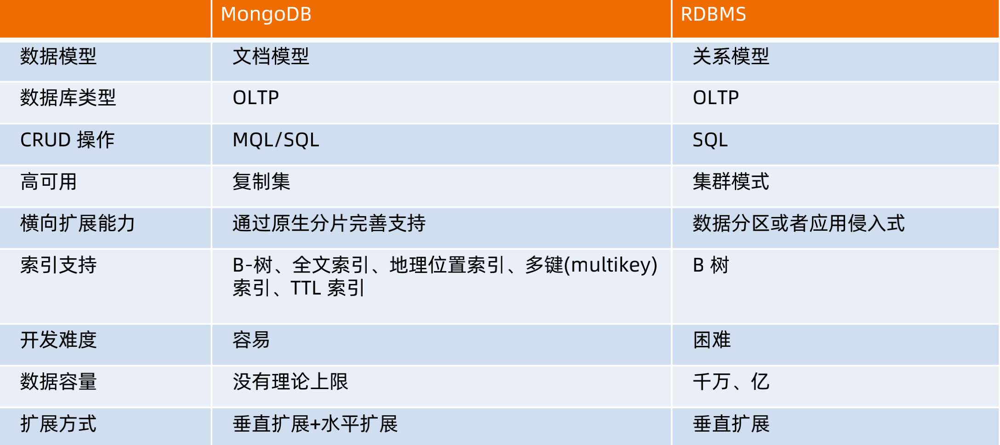

# MongoDB

https://www.mongodb.com/docs/manual/tutorial/getting-started/

MongoDB 是一个基于分布式文件存储的数据库。由 C++ 语言编写。旨在为 WEB 应用提供可扩展的高性能数据存储解决方案。

MongoDB 是一个介于关系数据库和非关系数据库之间的产品，是非关系数据库当中功能最丰富，最像关系数据库的。



## 概念：

| SQL术语/概念 | MongoDB术语/概念 | 解释/说明                           |
| :----------- | :--------------- | :---------------------------------- |
| database     | database         | 数据库                              |
| table        | collection       | 数据库表/集合                       |
| row          | document         | 数据记录行/文档                     |
| column       | field            | 数据字段/域                         |
| index        | index            | 索引                                |
| table joins  |                  | 表连接,MongoDB不支持                |
| primary key  | primary key      | 主键,MongoDB自动将_id字段设置为主键 |

### 连接配置：

https://www.mongodb.com/docs/drivers/java/sync/current/fundamentals/connection/connection-options/

### 数据库操作：

数据库也通过名字来标识。数据库名可以是满足以下条件的任意UTF-8字符串。

- 不能是空字符串（"")。
- 不得含有' '（空格)、.、$、/、\和\0 (空字符)。
- 应全部小写。
- 最多64字节。

```mariadb
> show dbs  //展示所有数据库
admin   0.000GB
config  0.000GB
local   0.000GB
> db //展示当前所在数据库
admin
> use local //切换数据库  如果数据库不存在则创建
switched to db local
> db
local
> db.dropDatabase() //删除数据库
{ "ok" : 1 }
```

- **admin**： 从权限的角度来看，这是"root"数据库。要是将一个用户添加到这个数据库，这个用户自动继承所有数据库的权限。一些特定的服务器端命令也只能从这个数据库运行，比如列出所有的数据库或者关闭服务器。
- **local:** 这个数据永远不会被复制，可以用来存储限于本地单台服务器的任意集合
- **config**: 当Mongo用于分片设置时，config数据库在内部使用，用于保存分片的相关信息。


### 数据类型：

| 数据类型           | 描述                                                         |
| :----------------- | :----------------------------------------------------------- |
| String             | 字符串。存储数据常用的数据类型。在 MongoDB 中，UTF-8 编码的字符串才是合法的。 |
| Integer            | 整型数值。用于存储数值。根据你所采用的服务器，可分为 32 位或 64 位。 |
| Boolean            | 布尔值。用于存储布尔值（真/假）。                            |
| Double             | 双精度浮点值。用于存储浮点值。                               |
| Min/Max keys       | 将一个值与 BSON（二进制的 JSON）元素的最低值和最高值相对比。 |
| Array              | 用于将数组或列表或多个值存储为一个键。                       |
| Timestamp          | 时间戳。记录文档修改或添加的具体时间。                       |
| Object             | 用于内嵌文档。                                               |
| Null               | 用于创建空值。                                               |
| Symbol             | 符号。该数据类型基本上等同于字符串类型，但不同的是，它一般用于采用特殊符号类型的语言。 |
| Date               | 日期时间。用 UNIX 时间格式来存储当前日期或时间。你可以指定自己的日期时间：创建 Date 对象，传入年月日信息。 |
| Object ID          | 对象 ID。用于创建文档的 ID。                                 |
| Binary Data        | 二进制数据。用于存储二进制数据。                             |
| Code               | 代码类型。用于在文档中存储 JavaScript 代码。                 |
| Regular expression | 正则表达式类型。用于存储正则表达式。                         |


### 集合(表)操作：

- 集合名不能是空字符串""。
- 集合名不能含有\0字符（空字符)，这个字符表示集合名的结尾。
- 集合名不能以"system."开头，这是为系统集合保留的前缀。
- 用户创建的集合名字不能含有保留字符。有些驱动程序的确支持在集合名里面包含，这是因为某些系统生成的集合中包含该字符。除非你要访问这种系统创建的集合，否则千万不要在名字里出现$。

```mariadb
> use test
switched to db test
> db.createCollection("user") //创建集合
{ "ok" : 1 }
> show tables //列出所有的表 show collections 也可以
user
> db.user.drop() //删除表
true
```

注：创建集合的 可以指定特殊参数db.createCollection(name, options)

| 字段        | 类型 | 描述                                                         |
| :---------- | :--- | :----------------------------------------------------------- |
| capped      | 布尔 | （可选）如果为 true，则创建固定集合。固定集合是指有着固定大小的集合，当达到最大值时，它会自动覆盖最早的文档。 **当该值为 true 时，必须指定 size 参数。** |
| autoIndexId | 布尔 | 3.2 之后不再支持该参数。（可选）如为 true，自动在 _id 字段创建索引。默认为 false。 |
| size        | 数值 | （可选）为固定集合指定一个最大值，即字节数。 **如果 capped 为 true，也需要指定该字段。** |
| max         | 数值 | （可选）指定固定集合中包含文档的最大数量。                   |


### 文档操作：

文档键命名规范：

- 键不能含有\0 (空字符)。这个字符用来表示键的结尾。
- .和$有特别的意义，只有在特定环境下才能使用。
- 以下划线"_"开头的键是保留的(不是严格要求的)。

#### 文档ID：

```mariadb
> var n = ObjectId()
> n.getTimestamp()
ISODate("2022-07-28T02:10:45Z")
> n.str
62e1f02598cfcbbf6ac3870f
> var n1 = ObjectId("ddffgg")
Error: invalid object id: length :
@(shell):1:10
```

ObjectId 类似唯一主键，可以很快的去生成和排序，包含 12 bytes，含义是：

- 前 4 个字节表示创建 **unix** 时间戳,格林尼治时间 **UTC** 时间，比北京时间晚了 8 个小时
- 接下来的 3 个字节是机器标识码
- 紧接的两个字节由进程 id 组成 PID
- 最后三个字节是随机数

#### 插入语句

```mariadb
// 插入一条数据
> db.user1.insertOne({"name":"哈哈","tag":[1,3,2],"age":23})
{
	"acknowledged" : true,
	"insertedId" : ObjectId("62e1f90598cfcbbf6ac38710")
}
//插入多条数据
> db.user1.insertMany([{"name":"123"},{"name":"234"}])
{
	"acknowledged" : true,
	"insertedIds" : [
		ObjectId("62e1f92f98cfcbbf6ac38711"),
		ObjectId("62e1f92f98cfcbbf6ac38712")
	]
}

//查找数据
> db.user1.find()
{ "_id" : ObjectId("62e1f90598cfcbbf6ac38710"), "name" : "哈哈", "tag" : [ 1, 3, 2 ], "age" : 23 }
{ "_id" : ObjectId("62e1f92f98cfcbbf6ac38711"), "name" : "123" }
{ "_id" : ObjectId("62e1f92f98cfcbbf6ac38712"), "name" : "234" }
```

写入参数说明：

- document：要写入的文档。
- writeConcern：写入策略，默认为 1，即要求确认写操作，0 是不要求。
- ordered：指定是否按顺序写入，默认 true，按顺序写入。

#### 更新语句

##### 跟新已经存在的文档

```mariadb
db.collection.update(
   <query>,
   <update>,
   {
     upsert: <boolean>,
     multi: <boolean>,
     writeConcern: <document>
   }
)
```

**参数说明：**

- **query** : update的查询条件，类似sql update查询内where后面的。
- **update** : update的对象和一些更新的操作符（如$,$inc...）等，也可以理解为sql update查询内set后面的
- **upsert** : 可选，这个参数的意思是，如果不存在update的记录，是否插入objNew,true为插入，默认是false，不插入。
- **multi** : 可选，mongodb 默认是false,只更新找到的第一条记录，如果这个参数为true,就把按条件查出来多条记录全部更新。
- **writeConcern** :可选，抛出异常的级别。

```mariadb
> db.user1.update({"name":"123"},{$set:{"age":24}})
WriteResult({ "nMatched" : 1, "nUpserted" : 0, "nModified" : 1 })

//查找 注意 区分类型的
> db.user1.find({"name":123}).pretty()
> db.user1.find({"name":"123"}).pretty()
{ "_id" : ObjectId("62e1f92f98cfcbbf6ac38711"), "name" : "123", "age" : 24 }
> db.user1.find({"name":"123"})
```

##### 替换已有文档

save() 方法通过传入的文档来替换已有文档，_id 主键存在就更新，不存在就插入。

```mariadb
db.collection.save(
   <document>,
   {
     writeConcern: <document>
   }
)
```

```shell
> db.user1.save({"_id":ObjectId("62e1f92f98cfcbbf6ac38711"),"title":"xxx"})
WriteResult({ "nMatched" : 1, "nUpserted" : 0, "nModified" : 1 })
> db.user1.find()
{ "_id" : ObjectId("62e1f90598cfcbbf6ac38710"), "name" : "哈哈", "tag" : [ 1, 3, 2 ], "age" : 23 }
{ "_id" : ObjectId("62e1f92f98cfcbbf6ac38711"), "title" : "xxx" }
```

#### 删除文档

```mariadb
db.collection.remove(
   <query>,
   {
     justOne: <boolean>,
     writeConcern: <document>
   }
)
```

- **query** :（可选）删除的文档的条件。
- **justOne** : （可选）如果设为 true 或 1，则只删除一个文档，如果不设置该参数，或使用默认值 false，则删除所有匹配条件的文档。
- **writeConcern** :（可选）抛出异常的级别。

清空表：db.collection.remove({})

```mariadb
> db.user1.remove({"age":23})
WriteResult({ "nRemoved" : 1 })
```

#### 查询文档

```mariadb
db.collection.find(query, projection)
```

- **query** ：可选，使用查询操作符指定查询条件
- **projection** ：可选，使用投影操作符指定返回的键。查询时返回文档中所有键值， 只需省略该参数即可（默认省略）。

如果你需要以易读的方式来读取数据，可以使用 pretty() 方法，语法格式如下：

##### 查询对比

| 操作       | 格式                     | 范例                                        | RDBMS中的类似语句       |
| :--------- | :----------------------- | :------------------------------------------ | :---------------------- |
| 等于       | `{<key>:<value>`}        | `db.col.find({"by":"菜鸟教程"}).pretty()`   | `where by = '菜鸟教程'` |
| 小于       | `{<key>:{$lt:<value>}}`  | `db.col.find({"likes":{$lt:50}}).pretty()`  | `where likes < 50`      |
| 小于或等于 | `{<key>:{$lte:<value>}}` | `db.col.find({"likes":{$lte:50}}).pretty()` | `where likes <= 50`     |
| 大于       | `{<key>:{$gt:<value>}}`  | `db.col.find({"likes":{$gt:50}}).pretty()`  | `where likes > 50`      |
| 大于或等于 | `{<key>:{$gte:<value>}}` | `db.col.find({"likes":{$gte:50}}).pretty()` | `where likes >= 50`     |
| 不等于     | `{<key>:{$ne:<value>}}`  | `db.col.find({"likes":{$ne:50}}).pretty()`  | `where likes != 50`     |

##### and查询

```mariadb
>db.col.find({key1:value1, key2:value2}).pretty()
```

and查询 也可以 用 $and

##### or查询

```mariadb
>db.col.find(
   {
      $or: [
         {key1: value1}, {key2:value2}
      ]
   }
).pretty()
```

```
//where likes>50 AND (by = '菜鸟教程' OR title = 'MongoDB 教程')
>db.col.find({"likes": {$gt:50}, $or: [{"by": "菜鸟教程"},{"title": "MongoDB 教程"}]})
```

##### 类型查询

```mariadb
db.col.find({"title" : {$type : 2}})
或
db.col.find({"title" : {$type : 'string'}})
```

注：每个数据类型都有自己的类型ID和定义

##### limit和skip

```mariadb
>db.col.find({},{"title":1,_id:0}).limit(1).skip(1)
```

##### sort排序

```mariadb
>db.COLLECTION_NAME.find().sort({KEY:1})
```

在 MongoDB 中使用 sort() 方法对数据进行排序，sort() 方法可以通过参数指定排序的字段，并使用 1 和 -1 来指定排序的方式，其中 1 为升序排列，而 -1 是用于降序排列。

##### explain()语句分析

```mariadb
> db.user1.find({"name":"x1"}).explain()
```

##### 强制索引hint()

```mariadb
>db.users.find({gender:"M"},{user_name:1,_id:0}).hint({gender:1,user_name:1})
```

##### 正则

```mariadb
> db.address.find({"company":{$regex:"中国"}})
{ "_id" : ObjectId("62e230e998cfcbbf6ac38719"), "company" : "enjoy 中国的飞机" }
{ "_id" : ObjectId("62e230e998cfcbbf6ac3871a"), "company" : "六度人和深圳中国" }
```


```mariadb
//不区分大小
>db.posts.find({post_text:{$regex:"runoob",$options:"$i"}})
//数组字段也支持
>db.posts.find({tags:{$regex:"run"}})
```

## 索引

```mariadb
>db.collection.createIndex(keys, options)
```

| Parameter              | Type          | Description                                                  |
| :--------------------- | :------------ | :----------------------------------------------------------- |
| background             | Boolean       | 建索引过程会阻塞其它数据库操作，background可指定以后台方式创建索引，即增加 "background" 可选参数。 "background" 默认值为**false**。 |
| unique                 | Boolean       | 建立的索引是否唯一。指定为true创建唯一索引。默认值为**false**. |
| name                   | string        | 索引的名称。如果未指定，MongoDB的通过连接索引的字段名和排序顺序生成一个索引名称。 |
| dropDups               | Boolean       | **3.0+版本已废弃。**在建立唯一索引时是否删除重复记录,指定 true 创建唯一索引。默认值为 **false**. |
| sparse                 | Boolean       | 对文档中不存在的字段数据不启用索引；这个参数需要特别注意，如果设置为true的话，在索引字段中不会查询出不包含对应字段的文档.。默认值为 **false**. |
| **expireAfterSeconds** | integer       | 指定一个以秒为单位的数值，完成 TTL设定，设定集合的生存时间。 |
| v                      | index version | 索引的版本号。默认的索引版本取决于mongod创建索引时运行的版本。 |
| weights                | document      | 索引权重值，数值在 1 到 99,999 之间，表示该索引相对于其他索引字段的得分权重。 |
| default_language       | string        | 对于文本索引，该参数决定了停用词及词干和词器的规则的列表。 默认为英语 |
| language_override      | string        | 对于文本索引，该参数指定了包含在文档中的字段名，语言覆盖默认的language，默认值为 language. |

法中 Key 值为你要创建的索引字段，1 为指定按升序创建索引，如果你想按降序来创建索引指定为 -1 即可。

```mariadb
db.col.createIndex({"title":1,"description":-1})
db.values.createIndex({open: 1, close: 1}, {background: true})
```

```mariadb
//创建索引
> db.user1.createIndex({"name":1})
{
	"numIndexesBefore" : 1,
	"numIndexesAfter" : 2,
	"createdCollectionAutomatically" : false,
	"ok" : 1
}

//查看索引
> db.user1.getIndexes()
[
	{
		"v" : 2,
		"key" : {
			"_id" : 1
		},
		"name" : "_id_"
	},
	{
		"v" : 2,
		"key" : {
			"name" : 1
		},
		"name" : "name_1"
	}
]
```

删除所有索引 db.col.dropIndexes()

删除对应索引 db.col.dropIndex("索引名称")

注，通过一些参数，可以指定索引过期删除，对应的索引字段必须是日期类型

### 覆盖索引查询

- 所有的查询字段是索引的一部分
- 所有的查询返回字段在同一个索引中

理解为，就是mysql的查询数据和就是索引数据

### 索引数组字段

在数组中创建索引，需要对数组中的每个字段依次建立索引。所以在我们为数组 tags 创建索引时，会为 music、cricket、blogs三个值建立单独的索引。

使用以下命令创建数组索引：

```mariadb
>db.users.ensureIndex({"tags":1})
```

### 索引子文档字段

```mariadb
>db.users.ensureIndex({"address.city":1,"address.state":1,"address.pincode":1})
```

### 注意事项

由于索引是存储在内存(RAM)中,你应该确保该索引的大小不超过内存的限制。

如果索引的大小大于内存的限制，MongoDB会删除一些索引，这将导致性能下降

索引不能被以下的查询使用：

- 正则表达式及非操作符，如 $nin, $not, 等。
- 算术运算符，如 $mod, 等。
- $where 子句

- 集合中索引不能超过64个
- 索引名的长度不能超过128个字符
- 一个复合索引最多可以有31个字段

### 全文检索

开启全文索引

```shell
>db.adminCommand({setParameter:true,textSearchEnabled:true})
mongod --setParameter textSearchEnabled=true
```

```mariadb
> db.address.insertMany([{"company":"enjoy 中国的飞机"},{"company":"六度人和深圳中国"}])
{
	"acknowledged" : true,
	"insertedIds" : [
		ObjectId("62e230e998cfcbbf6ac38719"),
		ObjectId("62e230e998cfcbbf6ac3871a")
	]
}
> db.address.createIndex({"company":"text"})
{
	"numIndexesBefore" : 1,
	"numIndexesAfter" : 2,
	"createdCollectionAutomatically" : false,
	"ok" : 1
}
> db.address.getIndexes()
[
	{
		"v" : 2,
		"key" : {
			"_id" : 1
		},
		"name" : "_id_"
	},
	{
		"v" : 2,
		"key" : {
			"_fts" : "text",
			"_ftsx" : 1
		},
		"name" : "company_text",
		"weights" : {
			"company" : 1
		},
		"default_language" : "english",
		"language_override" : "language",
		"textIndexVersion" : 3
	}
]
```

```mariadb
> db.address.find({"company":"中国"})
> db.address.find({$text:{$search:"中国"}})
> db.address.find({$text:{$search:"enjoy"}})
{ "_id" : ObjectId("62e230e998cfcbbf6ac38719"), "company" : "enjoy 中国的飞机" }
> db.address.find({$text:{$search:"中国的飞机"}})
{ "_id" : ObjectId("62e230e998cfcbbf6ac38719"), "company" : "enjoy 中国的飞机" }
>
> db.address.find({"company":"中国的飞机"})
```

使用正则

```mariadb
> db.address.find({"company":{$regex:"中国"}})
{ "_id" : ObjectId("62e230e998cfcbbf6ac38719"), "company" : "enjoy 中国的飞机" }
{ "_id" : ObjectId("62e230e998cfcbbf6ac3871a"), "company" : "六度人和深圳中国" }
```


## 聚合查询

```mariadb
>db.COLLECTION_NAME.aggregate(AGGREGATE_OPERATION)
```

```mariadb
//select by_user, count(*) from mycol group by by_user
> db.mycol.aggregate([{$group : {_id : "$by_user", num_tutorial : {$sum : 1}}}])
```

| 表达式    | 描述                                                         | 实例                                                         |
| :-------- | :----------------------------------------------------------- | :----------------------------------------------------------- |
| $sum      | 计算总和。                                                   | db.mycol.aggregate([{$group : {_id : "$by_user", num_tutorial : {$sum : "$likes"}}}]) |
| $avg      | 计算平均值                                                   | db.mycol.aggregate([{$group : {_id : "$by_user", num_tutorial : {$avg : "$likes"}}}]) |
| $min      | 获取集合中所有文档对应值得最小值。                           | db.mycol.aggregate([{$group : {_id : "$by_user", num_tutorial : {$min : "$likes"}}}]) |
| $max      | 获取集合中所有文档对应值得最大值。                           | db.mycol.aggregate([{$group : {_id : "$by_user", num_tutorial : {$max : "$likes"}}}]) |
| $push     | 将值加入一个数组中，不会判断是否有重复的值。                 | db.mycol.aggregate([{$group : {_id : "$by_user", url : {$push: "$url"}}}]) |
| $addToSet | 将值加入一个数组中，会判断是否有重复的值，若相同的值在数组中已经存在了，则不加入。 | db.mycol.aggregate([{$group : {_id : "$by_user", url : {$addToSet : "$url"}}}]) |
| $first    | 根据资源文档的排序获取第一个文档数据。                       | db.mycol.aggregate([{$group : {_id : "$by_user", first_url : {$first : "$url"}}}]) |
| $last     | 根据资源文档的排序获取最后一个文档数据                       | db.mycol.aggregate([{$group : {_id : "$by_user", last_url : {$last : "$url"}}}]) |

## 管道

MongoDB的聚合管道将MongoDB文档在一个管道处理完毕后将结果传递给下一个管道处理。管道操作是可以重复的。

表达式：处理输入文档并输出。表达式是无状态的，只能用于计算当前聚合管道的文档，不能处理其它的文档。

这里我们介绍一下聚合框架中常用的几个操作：

### $project：

修改输入文档的结构。可以用来重命名、增加或删除域，也可以用于创建计算结果以及嵌套文档。 **要查询的字段**

### $match：

用于过滤数据，只输出符合条件的文档。$match使用MongoDB的标准查询操作。

### $limit：

用来限制MongoDB聚合管道返回的文档数。

### $skip：

在聚合管道中跳过指定数量的文档，并返回余下的文档。

### $unwind：

将文档中的某一个数组类型字段拆分成多条，每条包含数组中的一个值。

### $group：

将集合中的文档分组，可用于统计结果。

### $sort：

将输入文档排序后输出。

### $geoNear：

输出接近某一地理位置的有序文档。

```mariadb
> db.user1.aggregate({$project:{"name":1}})
{ "_id" : ObjectId("62e1f92f98cfcbbf6ac38711") }
{ "_id" : ObjectId("62e1f92f98cfcbbf6ac38712"), "name" : "234" }
{ "_id" : ObjectId("62e1fe8598cfcbbf6ac38713"), "name" : 234 }
> db.user1.aggregate([{$project:{"name":1}},{$match:{"name":234}}])
{ "_id" : ObjectId("62e1fe8598cfcbbf6ac38713"), "name" : 234 }
```

## 副本集

MongoDB复制是将数据同步在多个服务器的过程。

复制提供了数据的冗余备份，并在多个服务器上存储数据副本，提高了数据的可用性， 并可以保证数据的安全性。

复制还允许您从硬件故障和服务中断中恢复数据。

mongodb的复制至少需要两个节点。其中一个是主节点，负责处理客户端请求，其余的都是从节点，负责复制主节点上的数据。

mongodb各个节点常见的搭配方式为：一主一从、一主多从。

主节点记录在其上的所有操作oplog，从节点定期轮询主节点获取这些操作，然后对自己的数据副本执行这些操作，从而保证从节点的数据与主节点一致


## 分片

在Mongodb里面存在另一种集群，就是分片技术,可以满足MongoDB数据量大量增长的需求。

当MongoDB存储海量的数据时，一台机器可能不足以存储数据，也可能不足以提供可接受的读写吞吐量。这时，我们就可以通过在多台机器上分割数据，使得数据库系统能存储和处理更多的数据。

- 复制所有的写入操作到主节点
- 延迟的敏感数据会在主节点查询
- 单个副本集限制在12个节点
- 当请求量巨大时会出现内存不足。
- 本地磁盘不足
- 垂直扩展价格昂贵


- Shard:

  用于存储实际的数据块，实际生产环境中一个shard server角色可由几台机器组个一个replica set承担，防止主机单点故障

- Config Server:

  mongod实例，存储了整个 ClusterMetadata，其中包括 chunk信息。

- Query Routers:

  前端路由，客户端由此接入，且让整个集群看上去像单一数据库，前端应用可以透明使用。

## 备份和恢复

```mariadb
>mongodump -h dbhost -d dbname -o dbdirectory
>mongorestore -h <hostname><:port> -d dbname <path>
```

## 监控

在你已经安装部署并允许MongoDB服务后，你必须要了解MongoDB的运行情况，并查看MongoDB的性能。这样在大流量得情况下可以很好的应对并保证MongoDB正常运作。

MongoDB中提供了**mongostat** 和 **mongotop** 两个命令来监控MongoDB的运行情况。

## 数据建模

MongoDB 中的关系可以是：

- 1:1 (1对1)
- 1: N (1对多)
- N: 1 (多对1)
- N: N (多对多)

### 嵌入

```json
{
   "_id":ObjectId("52ffc33cd85242f436000001"),
   "contact": "987654321",
   "dob": "01-01-1991",
   "name": "Tom Benzamin",
   "address": [
      {
         "building": "22 A, Indiana Apt",
         "pincode": 123456,
         "city": "Los Angeles",
         "state": "California"
      },
      {
         "building": "170 A, Acropolis Apt",
         "pincode": 456789,
         "city": "Chicago",
         "state": "Illinois"
      }]
} 
```

```mariadb
> db.user1.find({"address.city":"Chicago"})
{ "_id" : ObjectId("62e2282598cfcbbf6ac38714"), "contact" : "987654321", "dob" : "01-01-1991", "name" : "Tom Benzamin", "address" : [ { "building" : "22 A, Indiana Apt", "pincode" : 123456, "city" : "Los Angeles", "state" : "California" }, { "building" : "170 A, Acropolis Apt", "pincode" : 456789, "city" : "Chicago", "state" : "Illinois" } ] }
```

### 引入

引用式关系是设计数据库时经常用到的方法，这种方法把用户数据文档和用户地址数据文档分开，通过引用文档的 **id** 字段来建立关系。

```json
{
   "_id":ObjectId("52ffc33cd85242f436000001"),
   "contact": "987654321",
   "dob": "01-01-1991",
   "name": "Tom Benzamin",
   "address_ids": [
      ObjectId("52ffc4a5d85242602e000000"),
      ObjectId("52ffc4a5d85242602e000001")
   ]
}
```

```mariadb
//先查出结果
>var result = db.users.findOne({"name":"Tom Benzamin"},{"address_ids":1})

//通过文档ID再查询
>var addresses = db.address.find({"_id":{"$in":result["address_ids"]}})
```

### 关联

```mariadb
> db.user1.insertMany([{"name":"x1","address":[ObjectId("62e229be98cfcbbf6ac38715")]}])
{
	"acknowledged" : true,
	"insertedIds" : [
		ObjectId("62e22a1f98cfcbbf6ac38717")
	]
}
> db.user1.insertMany([{"name":"x2","address":[ObjectId("62e229be98cfcbbf6ac38715"),ObjectId("62e229d298cfcbbf6ac38716")]}])
{
	"acknowledged" : true,
	"insertedIds" : [
		ObjectId("62e22a3b98cfcbbf6ac38718")
	]
}
```

```mariadb
{ $ref : , $id : , $db :  }
```

- $ref：集合名称
- $id：引用的id
- $db:数据库名称，可选参数

注：即可以进一步通过$ref查询，感觉意义不大，还不如直接查询

## 原子操作

ongodb不支持事务，所以，在你的项目中应用时，要注意这点。无论什么设计，都不要要求mongodb保证数据的完整性。

但是mongodb提供了许多原子操作，比如文档的保存，修改，删除等，都是原子操作。

所谓原子操作就是要么这个文档保存到Mongodb，要么没有保存到Mongodb，不会出现查询到的文档没有保存完整的情况。

#### $set

用来指定一个键并更新键值，若键不存在并创建。

```
{ $set : { field : value } }
```

#### $unset

用来删除一个键。

```
{ $unset : { field : 1} }
```

#### $inc

$inc可以对文档的某个值为数字型（只能为满足要求的数字）的键进行增减的操作。

```
{ $inc : { field : value } }
```

#### $push，$pushAll

把value追加到field里面去，field一定要是数组类型才行，如果field不存在，会新增一个数组类型加进去。

```
{ $push : { field : value } }
```

#### $pull

从数组field内删除一个等于value值。

```
{ $pull : { field : _value } }
```

#### $addToSet

增加一个值到数组内，而且只有当这个值不在数组内才增加。

#### $pop

删除数组的第一个或最后一个元素

```
{ $pop : { field : 1 } }
```

#### $rename

修改字段名称

```
{ $rename : { old_field_name : new_field_name } }
```

#### $bit

位操作，integer类型

```
{$bit : { field : {and : 5}}}
```

## Map Reduce


## 复杂技巧

### 更新数组中的某个数据

```mariadb
db.dbName.update(
   {"items.itemValue":"null"},
   {$set:{'items.2.itemValue':'我被更新了'}},
   {multi:false}
 )
```

### 数组添加元素

```mariadb
> db.user1.update({"name":"x1"},{"$push":{"tags":1}})
WriteResult({ "nMatched" : 1, "nUpserted" : 0, "nModified" : 1 })
> db.user1.find({"name":"x1"})
{ "_id" : ObjectId("62e22a1f98cfcbbf6ac38717"), "name" : "x1", "address" : [ ObjectId("62e229be98cfcbbf6ac38715") ], "tags" : [ 1 ] }
> db.user1.update({"name":"x1"},{$addToSet:{"tags":[1,2]}})
WriteResult({ "nMatched" : 1, "nUpserted" : 0, "nModified" : 1 })
> db.user1.find({"name":"x1"})
{ "_id" : ObjectId("62e22a1f98cfcbbf6ac38717"), "name" : "x1", "address" : [ ObjectId("62e229be98cfcbbf6ac38715") ], "tags" : [ 1, [ 1, 2 ] ] }
```

多个值添加用

```mariadb
> db.user1.update({"name":"x1"},{$addToSet:{"tags":{$each:[1,2]}}})
WriteResult({ "nMatched" : 1, "nUpserted" : 0, "nModified" : 1 })
> db.user1.find({"name":"x1"})
{ "_id" : ObjectId("62e22a1f98cfcbbf6ac38717"), "name" : "x1", "address" : [ ObjectId("62e229be98cfcbbf6ac38715") ], "tags" : [ 1, [ 1, 2 ], 2 ] }
```

精确移除

```mariadb
db.survey.update(

  { },

  
  { $pull: { results: { score: 8 , item: "B" } } },

  { multi: true }

)

db.country.update({“name”:“China”},{"$pull":{“province”:{“name”:“Hebei”}}});
```

### 自定义文档ID：

```mariadb
> db.user1.insert({"_id":"21299-12-中国的孤独鳏寡电话给好地方肺结核或打开","name":"x3"})
WriteResult({ "nInserted" : 1 })
> db.user1.find({"name":"x3"})
{ "_id" : "21299-12-中国的孤独鳏寡电话给好地方肺结核或打开", "name" : "x3" }
```

写入的时候指定对应的_id，不指定则客户端系统生成

要建立索引的字段的长度有一个限制，即1024个字节.这是对索引条目大小的限制，而不是文档字段大小的限制，该大小限制为〜16MB(完整文档的最大大小).

出于性能方面的原因，您实际上并不希望索引字段的字段值较大，因为与此类较大值的比较要慢得多.还要记住，每个索引都维护着被索引值的副本，因此将需要大量的内存.反过来，这意味着要更频繁地访问磁盘以在内存中交换虚拟内存页面，这又会对性能产生负面影响.

是的，限制为800个字节

### 数组大小判断查询

```mariadb
//大小查询
db.data.find({num:{$size:2}})

// 错误的，该方法无法使用
db.data.find({num:{$size:{$gt:2}}});

//判断数组中的某个指定索引的元素是否存在，例如如果要求数组⼤⼩大于2 其中2位索引位置
db.data.find({"tags.2":{$exists:1}})

```

## 管理工具

MongoDB Compass

RockerMongoDB

