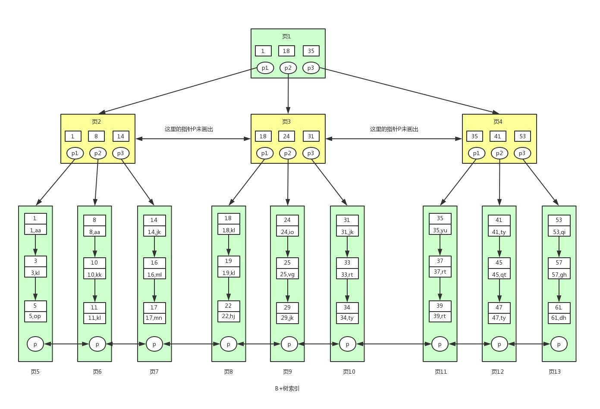

# MySQL注意事项


1、 Connector:用来支持各种语言和 SQL 的交互，比如 PHP，Python，Java 的 JDBC;

2、 Management Serveices & Utilities:系统管理和控制工具，包括备份恢复、MySQL 复制、集群等等;

3、Connection Pool:连接池，管理需要缓冲的资源，包括用户密码权限线程等;

4、SQL Interface:用来接收用户的 SQL 命令，返回用户需要的查询结果

5、Parser:用来解析 SQL 语句;

6、Optimizer:查询优化器;

7、Cache and Buffer:查询缓存，除了行记录的缓存之外，还有表缓存，Key 缓存，权限缓存等等;

8、Pluggable Storage Engines:插件式存储引擎，它提供 API 给服务层使用，跟具体的文件打交道。


## 1）通信协议：

单工-遥控器

半双工：对讲机

全双工：打电话

MySQL 使用了**半双工**的通信方式：

要么是客户端向服务端发送数据，要么是服务端向客户端发送数据，这两个动作不能 同时发生。所以客户端发送 SQL 语句给服务端的时候，(在一次连接里面)数据是不能 分成小块发送的，不管你的 SQL 语句有多大，都是一次性发送。

比如我们用 MyBatis 动态 SQL 生成了一个批量插入的语句，插入 10 万条数据，values 后面跟了一长串的内容，或者 where 条件 in 里面的值太多，会出现问题。这个时候我们必须要调整 MySQL 服务器配置 **max_allowed_packet** 参数的值(默认 是 **4M**)，把它调大，否则就会报错。

对于服务端来说，也是一次性发送所有的数据，不能因为你已经取到了想 要的数据就中断操作，这个时候会对网络和内存产生大量消耗。所以，我们一定要在程序里面避免不带 limit 的这种操作，比如一次把所有满足条件 的数据全部查出来，一定要先 count 一下。如果数据量的话，可以分批查询。

## 2）数据库事务：

### ACID：

**原子性（Atomicity）**：事务作为一个整体被执行，包含在其中的对数据库的操作要么全部被执行，要么都不执行。undo log
**一致性（Consistency）**：事务应确保数据库的状态从一个一致状态转变为另一个一致状态。一致状态的含义是数据库中的数据应满足完整性约束。
**隔离性（Isolation）**：多个事务并发执行时，一个事务的执行不应影响其他事务的执行。
**持久性（Durability）**：一个事务一旦提交，他对数据库的修改应该永久保存在数据库中。redo log和double write双写缓冲

### 事务并发导致问题：

#### SQL92 的标准


T表示同一个事务中

#### 脏写或者更新丢失Lost Update：

当两个或多个事务选择同一行，然后基于最初选定的值更新该行时，由于每个事务都不知道其他事务的存 

在，就会发生丢失更新问题–**最后的更新覆盖了由其他事务所做的更新**。

#### 脏读Drity Read：

某个事务已更新一份数据，另一个事务在此时读取了同一份数据，由于某些原因，前一个RollBack了操作，则后一个事务所读取的数据就会是不正确的。

T1修改值->T2读取到该值->T1回滚->T2读取到脏数据

注：**事务A读取到了事务B已经修改但是为提交的数据**。

#### 不可重复读Non-repeatable read：

在一个事务的两次查询之中数据不一致，这可能是两次查询过程中间插入了一个事务更新的原有的数据。

T1读取值->T2->修改值->T1读取到另外一个值 

即同一个T1事务中，出现了2次不一样的结果

#### 幻读Phantom Read：

在一个事务的两次查询中数据笔数不一致

和不可重复读类似，只是上面的说的都是读取一行记录的时候。

幻读发生读取一定范围的数据的时候。

T1读取1批数据->T2中间插入数据->T1读取另外的结果数据。

产生幻读的原因是，**行锁只能锁住行，但是新插入记录这个动作，要更新的是记录之间的“间隙”**。因此，为了解决幻读问题，InnoDB 只好引入新的锁，也就是**间隙锁 (Gap Lock)**。-->参看间歇锁。

注：**不可重复读是修改或者删除，幻读是插入**。都是一个事务前后读取数据不一致，不客户重复是因为修改和删除引起，幻读是因为写入引起。

#### 解决读取问题的方案：

##### LBCC:

1）基于锁的并发控制 Lock Based Concurrency Control(LBCC)。

如果仅仅是基于锁来实现事务隔离，一个事务读取的时候不允许其他时候修改，那 就意味着不支持并发的读写操作，而我们的大多数应用都是读多写少的，这样会极大地 影响操作数据的效率。

##### MVCC:

2）多版本的并发控制 Multi Version Concurrency Control (MVCC)。

如果要让一个事务前后两次读取的数据保持一致， 那么我们可以在修改数据的时候给它建立一个备份或者叫快照，后面再来读取这个快照 就行了

MVCC 的核心思想是: 我可以查到在我这个事务开始之前已经存在的数据，即使它 在后面被修改或者删除了。在我这个事务之后新增的数据，我是查不到的。

这个快照什么时候创建?读取数据的时候，怎么保证能读取到这个快照而不 是最新的数据?这个怎么实现呢?

InnoDB 为每行记录都实现了两个隐藏字段:

DB_TRX_ID，6 字节:插入或更新行的最后一个事务的事务 ID，事务编号是自动递 增的(我们把它理解为创建版本号，在数据新增或者修改为新数据的时候，记录当前事 务 ID)。

DB_ROLL_PTR，7 字节:回滚指针(我们把它理解为删除版本号，数据被删除或记 录为旧数据的时候，记录当前事务 ID)。

https://www.processon.com/view/link/5d29999ee4b07917e2e09298 MVCC 演示图

即每一行数据有2个版本号，新增版本号，和删除版本号。

MVCC 的查找规则:只能查找创建时间小于等于当前事务 ID 的数据，和删除时间大于当前事务 ID 的行(或未删除)。

新增一条数据，新增版本号+1.删除一条数据，删除版本号+1.

修改数据 == 新增一条数据，+ 删除一条数据。

在 InnoDB 中，MVCC 是通过 Undo log 实现的。

### 数据库锁：

#### 一、按操作划分

可分为`DML锁`、`DDL锁`

#### 二、按锁的粒度划分

可分为全局锁，`表级锁`，`行级锁`，`页级锁`

**全局锁：**

全局锁就是对整个数据库实例加锁，备份数据的时候常用。命令是 Flush tables with read lock (FTWRL)

既然要全库只读，**为什么不使用 set global readonly=true 的方式呢**？

一是，在有些系统中，readonly 的值会被用来做其他逻辑，比如用来判断一个库是主库还是备库。因此，修改 global 变量的方式影响面更大，我不建议你使用。

二是，在异常处理机制上有差异。如果执行 FTWRL 命令之后由于客户端发生异常断开，那么 MySQL 会自动释放这个全局锁，整个库回到可以正常更新的状态。而将整个库设置为 readonly 之后，如果客户端发生异常，则数据库就会一直保持 readonly 状态，这样会导致整个库长时间处于不可写状态，风险较高。

##### **行锁**：

开销大，加锁慢；会出现死锁；锁定粒度最小，发生锁冲突的概率最低，并发度也最高。

InnoDB行锁是通过给索引上的索引项加锁来实现的，这一点MySQL与Oracle不同，后者是通过在数据块中对相应数据行加锁来实现的。InnoDB这种行锁实现特点意味着：**只有通过索引条件检索数据，InnoDB才使用行级锁，否则，InnoDB将使用表锁！**

##### 死锁：

是因为死锁的发生需要满足一定的条件，所以在发生死 锁时，InnoDB 一般都能通过算法(wait-for graph)自动检测到。
那么死锁需要满足什么条件?死锁的产生条件:因为锁本身是互斥的，

(1)同一时刻只能有一个事务持有这把锁，

(2)其他的事 务需要在这个事务释放锁之后才能获取锁，而不可以强行剥夺，

(3)**当多个事务形成等 待环路的时候，即发生死锁**。

举例:
理发店有两个总监。一个负责剪头的 Tony 总监，一个负责洗头的 Kelvin 总监。

Tony 不能同时给两个人剪头，这个就叫**互斥**。
Tony 在给别人在剪头的时候，你不能让他停下来帮你剪头，这个**叫不能强行剥夺**。

如果 Tony 的客户对 Kelvin 总监说:你不帮我洗头我怎么剪头?Kelvin 的客户对 Tony总监说:你不帮我剪头我怎么洗头?这个就叫**形成等待环路**。

MyISAM中是不会产生死锁的，因为MyISAM总是一次性获得所需的全部锁，要么全部满足，要么全部等待。而在InnoDB中，锁是逐步获得的，就造成了死锁的可能。

在MySQL中，行级锁并不是直接锁记录，而是锁索引。索引分为主键索引和非主键索引两种，如果一条sql语句操作了主键索引，MySQL就会锁定这条主键索引；如果一条语句操作了非主键索引，MySQL会先锁定该非主键索引，再锁定相关的主键索引。 在UPDATE、DELETE操作时，MySQL不仅锁定WHERE条件扫描过的所有索引记录，而且会锁定相邻的键值，即所谓的next-key locking。

当两个事务同时执行，**一个锁住了主键索引，在等待其他相关索引。另一个锁定了非主键索引，在等待主键索引。这样就会发生死锁**。

```mysql
select * from information_schema.INNODB_TRX; -- 当前运行的所有事务 ，还有具体的语句
select * from information_schema.INNODB_LOCKS; -- 当前出现的锁
select * from information_schema.INNODB_LOCK_WAITS; -- 锁等待的对应关系
```


```mysql
mysql> begin;##1
Query OK, 0 rows affected (0.00 sec)

mysql> select * from t_user where id =100 for update;##2 无100行
Empty set (0.00 sec)

mysql> insert into t_user(id,name,phone) values(100,"xx","123");##6
ERROR 1213 (40001): Deadlock found when trying to get lock; try restarting transaction
```

```mysql
mysql> begin;##3
Query OK, 0 rows affected (0.00 sec)

mysql> select * from t_user where id =100 for update;##4 无100行
Empty set (0.00 sec)
mysql> insert into t_user(id,name,phone) values(100,"xx","123");##5
Query OK, 1 row affected (14.31 sec)
```

##### 锁释放：

事务结束(commit，rollback);客户端连接断开。

##### **避免死锁：**

1.  在程序中，操作多张表时，尽量以相同的顺序来访问(避免形成等待环路);
2.  批量操作单张表数据的时候，先对数据进行排序(避免形成等待环路);
3. 申请足够级别的锁，如果要操作数据，就申请排它锁;
4. 尽量使用索引访问数据，避免没有 where 条件的操作，避免锁表;
5. 如果可以，大事务化成小事务;
6. 使用等值查询而不是范围查询查询数据，命中记录，避免间隙锁对并发的影响。

发生死锁后，InnoDB一般都可以检测到（innodb_deadlock_detect=on），并使一个事务释放锁回退，另一个获取锁完成事务。

设置等待时间：innodb_lock_wait_timeout

##### **表锁：**

表锁的语法是 **lock tables … read/write**。

可以用 unlock tables 主动释放锁，也可以在客户端断开的时候自动释放。需要注意，lock tables 语法除了会限制别的线程的读写外，也限定了本线程接下来的操作对象。

表级的锁是 **MDL（metadata lock)**

在 MySQL 5.5 版本中引入了 MDL，当对**一个表做增删改查操作的时候，加 MDL 读锁**；**当要对表做结构变更操作的时候，加 MDL 写锁**。--非常重要。即修改小表也有可能把数据库堵塞。


开销小，加锁快；不会出现死锁；锁定粒度大，发出锁冲突的概率最高，并发度最低。

##### **页锁：**

开销和加锁时间界于表锁和行锁之间；会出现死锁；锁定粒度界于表锁和行锁之间，并发度一般。

#### 三、按锁级别划分

可分为`共享锁`，`排他锁`

**共享锁**又称**读锁**，是读取操作创建的锁。其他用户可以并发读取数据，但任何事务都不能对数据进行修改（获取数据上的排他锁），直到已释放所有共享锁。

SELECT ... LOCK IN SHARE MODE;

**排他锁**又称**写锁**，如果事务T对数据A加上排他锁后，则其他事务不能再对A加任任何类型的封锁。获准排他锁的事务既能读数据，又能修改数据。

SELECT ... FOR UPDATE;

对于insert、update、delete，InnoDB会自动给涉及的数据加排他锁（X）；对于一般的Select语句，InnoDB不会加任何锁，事务可以通过以下语句给显示加共享锁或排他锁。

#### 四、按加锁方式划分

可分为`自动锁`、`显示锁`

#### 五、按使用方式划分

可分为`乐观锁`、`悲观锁`

#### 锁的算法：

##### 记录锁：

对于唯一性的索引(包括唯一索引和主键索引)使用等值查询，**精准匹配到一条记录**的时候，这个时候使用的就是记录锁。

##### 间隙锁：

**间隙锁和行锁合称 next-key lock，每个 next-key lock 是前开后闭区间**。也就是说，我们的表 t 初始化以后，如果用 select * from t for update 要把整个表所有记录锁起来，就形成了 7 个 next-key lock，分别是 (-∞,0]、(0,5]、(5,10]、(10,15]、(15,20]、(20, 25]、(25, +supremum]。

**间隙锁的引入，可能会导致同样的语句锁住更大的范围，这其实是影响了并发度的**。参看死锁。

间隙锁主要是阻塞插入 insert。相同的间隙锁之间不冲突。


##### 临键锁：

当我们使用了范围查询，不仅仅命中了 Record 记录，还包含了 Gap 间隙，在这种情况下我们使用的就是临键锁，它是 MySQL 里面默认的行锁算法，相当于 **记录锁加上间隙锁**。

**唯一性索引，等值查询匹配到一条记录的时候，退化成记录锁。 没有匹配到任何记录的时候，退化成间隙锁**。

临键锁，锁住**最后一个 key 的下一个左开右闭的区间**。

```mysql
select * from t2 where id >5 and id <=7 for update; -- 锁住(4,7]和(7,10] 
select * from t2 where id >8 and id <=10 for update; -- 锁住 (7,10]，(10,+∞)
```

为什么要锁住下一个左开右闭的区间?——就是为了解决幻读的问题。

#### 什么时候会上锁？

1）原则 1：加锁的基本单位是 **next-key lock**。next-key lock 是**前开后闭区间**。

2）原则 2：查找过程中**访问到的对象才会加锁**。

3）优化 1：索引上的等值查询，给唯一索引加锁的时候，**next-key lock 退化为行锁**。

4）优化 2：索引上的等值查询，向右遍历时且最后一个值不满足等值条件的时候，next-key lock 退化为间隙锁。

5）一个 bug：**唯一索引上的范围查询会访问到不满足条件的第一个值为止**。

案例分析：源数据

```mysql
CREATE TABLE `t` ( `id` int(11) NOT NULL, `c` int(11) DEFAULT NULL, `d` int(11) DEFAULT NULL, PRIMARY KEY (`id`), KEY `c` (`c`)) ENGINE=InnoDB;
insert into t values(0,0,0),(5,5,5),(10,10,10),(15,15,15),(20,20,20),(25,25,25);
```

**案例-等值查询间隙锁**：

```mysql
mysql> update t1 set d=d+1 where id =7;
```

根据原则 1，加锁单位是 next-key lock，session A 加锁范围就是 (5,10]；

同时根据优化 2，这是一个等值查询 (id=7)，而 id=10 不满足查询条件，next-key lock 退化成间隙锁，因此最终加锁的范围是 (5,10)。

session B 要往这个间隙里面插入 id=8 的记录会被锁住，但是 session C 修改 id=10 这行是可以的。

**案例-非唯一索引等值**

```mysql
mysql> select id from t1 where c=5 lock in share mode;
```

根据原则 1，加锁单位是 next-key lock，因此会给 (0,5]加上 next-key lock。

要注意 c 是普通索引，因此仅访问 c=5 这一条记录是不能马上停下来的，需要向右遍历，查到 c=10 才放弃。根据原则 2，访问到的都要加锁，因此要给 (5,10]加 next-key lock。

但是同时这个符合优化 2：等值判断，向右遍历，最后一个值不满足 c=5 这个等值条件，因此退化成间隙锁 (5,10)。

根据原则 2 ，只有访问到的对象才会加锁，这个查询使用覆盖索引，并不需要访问主键索引，所以主键索引上没有加任何锁，这就是为什么 session B 的 update 语句可以执行完成。

但 session C 要插入一个 (7,7,7) 的记录，就会被 session A 的间隙锁 (5,10) 锁住。

**案例-主键索引范围锁**

```mysql
mysql> select * from t where id>=10 and id<11 for update;
```

开始执行的时候，要找到第一个 id=10 的行，因此本该是 next-key lock(5,10]。 根据优化 1， 主键 id 上的等值条件，退化成行锁，只加了 id=10 这一行的行锁。

范围查找就往后继续找，找到 id=15 这一行停下来，因此需要加 next-key lock(10,15]。

所以，session A 这时候锁的范围就是主键索引上，行锁 id=10 和 next-key lock(10,15]。这样，session B 和 session C 的结果你就能理解了。

注：参看，MySQL实战45讲，21 | 为什么我只改一行的语句，锁这么多？

#### 为什么锁表？

InnoDB 的锁锁住的应该不是 Record。 那为什么在没有索引或者没有用到索引的情况下，会锁住整张表

为什么锁表，是因为查询没有使用索引，会进行全表扫描，然后把每一个隐藏的聚集索引都锁住了。

#### 为什么通过唯一索引给数据行加锁，主键索引也会被锁住？

索引存储的是二级索引和主键的值。比如 name=4，存储的是 name 的索引和主键 id 的值 4。

而主键索引里面除了索引之外，还存储了完整的数据。所以我们通过辅助索引锁定 一行数据的时候它跟我们检索数据的步骤是一样的，会通过主键值找到主键索引，然后也锁定。

### 事务隔离级别：

所谓事务隔离就是每个操作是一个事务空间，隔离级别就是多个空间之间的联系。

查询数据库的隔离级别

```mysql
mysql> show variables like 'transaction_isolation';
+-----------------------+-----------------+
| Variable_name         | Value           |
+-----------------------+-----------------+
| transaction_isolation | REPEATABLE-READ |
+-----------------------+-----------------+
1 row in set (0.12 sec)
mysql> select @@tx_isolation;
+-----------------+
| @@tx_isolation  |
+-----------------+
| REPEATABLE-READ |
+-----------------+
1 row in set, 1 warning (0.00 sec)

#设置隔离级别
mysql> set session transaction isolation level read uncommitted;
Query OK, 0 rows affected (0.01 sec)
```

**常看当前数据库的事务隔离级别: show variables like 'tx_isolation';** 

**设置事务隔离级别：**set tx_isolation='REPEATABLE-READ';

**Mysql默认的事务隔离级别是可重复读，用Spring开发程序时，如果不设置隔离级别默认用Mysql设置的隔** 

**离级别，如果Spring设置了就用已经设置的隔离级别** 

在 MySQL 里，有两个“视图”的概念：

一个是 view。它是一个用查询语句定义的虚拟表，在调用的时候执行查询语句并生成结果。创建视图的语法是 create view … ，而它的查询方法与表一样。

另一个是 InnoDB 在实现 **MVCC 时用到的一致性读视图**，即 consistent read view，用于支持 RC（Read Committed，读提交）和 RR（Repeatable Read，可重复读）隔离级别的实现。它没有物理结构，作用是事务执行期间用来定义“**我能看到什么数据**”。不是说copy一份数据，而是通过事务ID，去区别版本数据。

**InnoDB 利用了“所有数据都有多个版本”的这个特性，实现了“秒级创建快照”的能力**。

**事务的隔离机制也是通过版本的概念虚拟出了视图，实现隔离**。

注：下面的隔离级别，从小到大

#### 1）未提交读READ-UNCOMMITTED：

Read Uncommitted

一个事务还没提交时，它做的变更就能被别的事务看到。

查询不加锁，修改加排他锁。即最普通的，这样会导致脏读。

#### 2）提交读READ-COMMITTED：

Read Committed

一个事务提交之后，它做的变更才会被其他事务看到。

查询加共享锁（查询完毕就释放），修改加排他锁（事务结束就释放），解决脏读，但是不能解决可重复读

#### 3）可重复读REPEATABLE-READ-默认级别：

Repeatable Read

一个事务执行过程中看到的数据，总是跟这个事务在启动时看到的数据是一致的。当然在可重复读隔离级别下，未提交变更对其他事务也是不可见的。

查询加共享锁（整个事务完毕才释放），修改加排他锁（事务结束才释放），解决不可重复读，但是解决不了幻读。

#### 4）可序列化/串行化SERIALIZABLE：

Serializable

顾名思义是对于同一行记录，“写”会加“写锁”，“读”会加“读锁”。当出现读写锁冲突的时候，后访问的事务必须等前一个事务执行完成，才能继续执行。

查询增加表级共享锁，修改增加表级排它锁。

```mysql
mysql> create table T(c int) engine=InnoDB;insert into T(c) values(1);
```

| 事务A               | 事务B                   |
| ------------------- | ----------------------- |
| 启动事务查询得到值1 | 启动事务                |
|                     | 查询到值为1，将1修改为2 |
| 查询到 v1           |                         |
|                     | 提交事务                |
| 查询到v2            |                         |
| 提交事务A           |                         |
| 查询到v3            |                         |

未提交读：v1，v2,v3 都为2

读提交：v1为1，v2,v3为2

可重复读：v1,v2为1，v3为2

串行化：v1,v2为1，v3为2，事务A会锁住数据，只有A提交后，B才能执行。

```mysql
#关闭事务自动提交
mysql> set autocommit=off;
Query OK, 0 rows affected (0.00 sec)
mysql> show variables like 'autocommit';
+---------------+-------+
| Variable_name | Value |
+---------------+-------+
| autocommit    | OFF   |
+---------------+-------+
1 row in set (0.01 sec)
#开始事务
mysql> start transaction;
Query OK, 0 rows affected (0.00 sec)

mysql> update T set c =2 where c = 1;
Query OK, 1 row affected (0.00 sec)
Rows matched: 1  Changed: 1  Warnings: 0
#提交事务
mysql> commit;
#回滚事务
mysql> rollback;
```

注：自己多模拟一下即可。验证正常。

https://www.cnblogs.com/JohnABC/p/3521061.html

## 3）常用函数：

### 字符串相关操作

#### concat字符串拼接

```mysql
mysql> select concat("str1",",","str2");
+---------------------------+
| concat("str1",",","str2") |
+---------------------------+
| str1,str2                 |
+---------------------------+
1 row in set (0.01 sec)
```

#### repeat重复字符串

```mysql
mysql> select repeat("str1",3);
+------------------+
| repeat("str1",3) |
+------------------+
| str1str1str1     |
+------------------+
1 row in set (0.00 sec)
```

#### quote添加单引号

```mysql
mysql> select quote("str"),quote("\"str\""),quote("'str'");
+--------------+------------------+----------------+
| quote("str") | quote("\"str\"") | quote("'str'") |
+--------------+------------------+----------------+
| 'str'        | '"str"'          | '\'str\''      |
+--------------+------------------+----------------+
1 row in set (0.00 sec)
```

#### replace字符串替换

```mysql
mysql> select replace("st1str1","st","qa");
+------------------------------+
| replace("st1str1","st","qa") |
+------------------------------+
| qa1qar1                      |
+------------------------------+
1 row in set (0.00 sec)
```

#### 其他

**reverse**(str)反转字符串

**left**(str,len),right(str,len)字符串截取

 从左从右 其他的有**lpad** rpad等左右填充  **rtrim**() ltrim() trim()

space(N)生成N个空格字符串

### 数字函数

**DIV**整除 SELECT 5 DIV 2 == 2

abs(x)绝对值 

ceil() floor()

**MOD**(N,M)

**RAND**([N]) 返回随机数范围在0-1之间  N为整数，当作种子，产生重复序列

### 日期函数

DATE_ADD和DATE_SUB：日期相加和日期相减；

## 4）数据类型问题：

### 数字类型

| 类型         | 大小                                     | 范围（有符号）                                               | 范围（无符号）                                               | 用途            |
| :----------- | :--------------------------------------- | :----------------------------------------------------------- | :----------------------------------------------------------- | :-------------- |
| TINYINT      | 1 字节                                   | (-128，127)                                                  | (0，255)                                                     | 小整数值        |
| SMALLINT     | 2 字节                                   | (-32 768，32 767)                                            | (0，65 535)                                                  | 大整数值        |
| MEDIUMINT    | 3 字节                                   | (-8 388 608，8 388 607)                                      | (0，16 777 215)                                              | 大整数值        |
| INT或INTEGER | 4 字节                                   | (-2 147 483 648，2 147 483 647)                              | (0，4 294 967 295)                                           | 大整数值        |
| BIGINT       | 8 字节                                   | (-9,223,372,036,854,775,808，9 223 372 036 854 775 807)      | (0，18 446 744 073 709 551 615)                              | 极大整数值      |
| FLOAT        | 4 字节                                   | (-3.402 823 466 E+38，-1.175 494 351 E-38)，0，(1.175 494 351 E-38，3.402 823 466 351 E+38) | 0，(1.175 494 351 E-38，3.402 823 466 E+38)                  | 单精度 浮点数值 |
| DOUBLE       | 8 字节                                   | (-1.797 693 134 862 315 7 E+308，-2.225 073 858 507 201 4 E-308)，0，(2.225 073 858 507 201 4 E-308，1.797 693 134 862 315 7 E+308) | 0，(2.225 073 858 507 201 4 E-308，1.797 693 134 862 315 7 E+308) | 双精度 浮点数值 |
| DECIMAL      | 对DECIMAL(M,D) ，如果M>D，为M+2否则为D+2 | 依赖于M和D的值                                               | 依赖于M和D的值                                               | 小数值          |

#### decimal的长度问题

- M是最大位数（精度），范围是1到65。可不指定，默认值是10。
- D是小数点右边的位数（小数位）。范围是0到30，并且不能大于M，可不指定，默认值是0。
- M默认为10，D默认为0，D不大于M。
- DECIMAL(5,2)可存储范围是从-999.99到999.99，超出存储范围会报错。
- 存储数值时，小数位不足会自动补0，首位数字为0自动忽略。
- 小数位超出会截断，产生告警，并按四舍五入处理。
- 使用DECIMAL字段时，建议M，D参数手动指定，并按需分配。

#### **int(10)数字只对 ZEROFILl类型有效**

10用来设置宽度，内部存储的还是真实的数字，而不是0001数据。

#### 避免使用UNSIGNED

### 日期类型：

| 类型      | 大小 | 范围                                                         | 格式                | 用途                     |
| :-------- | :--- | :----------------------------------------------------------- | :------------------ | :----------------------- |
| DATE      | 3    | 1000-01-01/9999-12-31                                        | YYYY-MM-DD          | 日期值                   |
| TIME      | 3    | '-838:59:59'/'838:59:59'                                     | HH:MM:SS            | 时间值或持续时间         |
| YEAR      | 1    | 1901/2155                                                    | YYYY                | 年份值                   |
| DATETIME  | 8    | 1000-01-01 00:00:00/9999-12-31 23:59:59                      | YYYY-MM-DD HH:MM:SS | 混合日期和时间值         |
| TIMESTAMP | 4    | 1970-01-01 00:00:00/2038结束时间是第 **2147483647** 秒，北京时间 **2038-1-19 11:14:07**，格林尼治时间 2038年1月19日 凌晨 03:14:07 | YYYYMMDD HHMMSS     | 混合日期和时间值，时间戳 |

#### 注意事项：

- mysql存储的最小时间单位为秒
- 建议使用date存储日期
- mysql用自带的date,time datetime存储时间，而不是字符串
- 使用timestamp和datetime的时候可以用current_timestamp
-  DATETIME的存储格式是一个YYYYMMDD HH:MM:SS的整数，与时区无关，你存了什么，读出来就是什么
-  有时人们把Unix的时间戳保存为整数值，但是这通常没有任何好处，这种格式处理起来不太方便，我们并不推荐它


### 字符串类型：

| 类型       | 大小                | 用途                            |
| :--------- | :------------------ | :------------------------------ |
| CHAR       | 0-255字节           | 定长字符串                      |
| VARCHAR    | 0-65535 字节        | 变长字符串                      |
| TINYBLOB   | 0-255字节           | 不超过 255 个字符的二进制字符串 |
| TINYTEXT   | 0-255字节           | 短文本字符串                    |
| BLOB       | 0-65 535字节        | 二进制形式的长文本数据          |
| TEXT       | 0-65 535字节        | 长文本数据                      |
| MEDIUMBLOB | 0-16 777 215字节    | 二进制形式的中等长度文本数据    |
| MEDIUMTEXT | 0-16 777 215字节    | 中等长度文本数据                |
| LONGBLOB   | 0-4 294 967 295字节 | 二进制形式的极大文本数据        |
| LONGTEXT   | 0-4 294 967 295字节 | 极大文本数据                    |

## 5）explain详解

```java
mysql> explain select * from t_user\G;
*************************** 1. row ***************************
           id: 1
  select_type: SIMPLE
        table: t_user
   partitions: NULL
         type: ALL
possible_keys: NULL
          key: NULL
      key_len: NULL
          ref: NULL
         rows: 8
     filtered: 100.00
        Extra: NULL
1 row in set, 1 warning (0.00 sec)

ERROR:
```

### elect_type:

SUBQUERY 子查询
SIMPLE 无子查询，和UNION
PRIMARY 如果查询任何复杂的子部分，最外层则为primary
derived 表示包含在where的子查询的select，mysql会递归执行并将结果放到临时表
UNION 在UNION中的第2个和随后的select被标记为union
union result 从union的匿名临时表检索结果

### type:

all 全表扫描 使用limit，或Extra列显示 Using distinct/not exists
index 和全表扫描一样，只是按照索引进行排序，缺点是要承担索引依次序读取整个表的开销（随机性很大）如果Extra为Using index说明使用覆盖索引，它只扫描索引数据，而不是按照索引次序的每一行。
range 范围扫描就是一个限制的索引扫描，它开始索引的某一点，返回匹配这个值域，比全索引扫描好点。(有BETWEEN或者>等)
ref 索引查找，它返回所有匹配某个单个值的行。然而，它可能找到多个符合条件的行。因此它是查找和扫描的混合体. 非主键，非唯一，非唯一性索引前缀
eq_ref 强调唯一性。
const,system mysql对查询的某部分进行优化并将其转化为一个常量。
NULL 表示执行阶段用不着再访问表或者索引。

### 其他：

**possible_keys**：表示查询可以使用哪些索引。
**key**：表示mysql决定采用哪个索引来优化对表的访问。有可能如果不存在于possible_keys.
**key_len**：索引使用长度。
**ref**：展示之前的表在key列记录的索引中查找所用的列或常量。
**rows**：估计需要读取的行数。
**filtered**：一个估算的百分比值，估算值*rows，估算真实行数

### extra：

**Using index** 使用覆盖索引
**Using where** 在存储引擎检索行后进行过滤
Using temporay 使用了一个临时表
**Using filesort** 使用外部索引排序，而不是按照索引次序从表里读取数据
Range checked for each record(index map:N) 没有好用的索引，新的索引将在联接的没一行上重新估算

## 6）三大范式

### 1）确保每列保持原子性

第一范式是最基本的范式。如果数据库表中的**所有字段值都是不可分解的原子值**，就说明该数据库表满足了第一范式。

第一范式的合理遵循需要根据系统的实际需求来定。比如某些数据库系统中需要用到“地址”这个属性，本来直接将“地址”属性设计成一个数据库表的字段就行。但是如果系统经常会访问“地址”属性中的“城市”部分，那么就非要将“地址”这个属性重新拆分为省份、城市、详细地址等多个部分进行存储，这样在对地址中某一部分操作的时候将非常方便

### 2）确保每列都和主键有相关性

也就是说在一个数据库表中，一个表中只能保存一种数据，不可以把多种数据保存在同一张数据库表中。

比如要设计一个订单信息表，因为订单中可能会有多种商品，所以要将订单编号和商品编号作为数据库表的联合主键

### 3）确保每列都和主键列直接相关,而不是间接相关

比如在设计一个订单数据表的时候，可以将客户编号作为一个外键和订单表建立相应的关系。而不可以在订单表中添加关于客户其它信息（比如姓名、所属公司等）的字段

## 7）执行流程


### 查询缓存：

默认关闭的意思就是不推荐使用，为什么 MySQL 不推荐使用它自带的缓存呢?

主要是因为 MySQL 自带的缓存的应用场景有限，第一个是它要求 SQL 语句必须一 模一样，中间多一个空格，字母大小写不同都被认为是不同的的 SQL。

第二个是表里面任何一条数据发生变化的时候，这张表所有缓存都会失效，所以对 于有大量数据更新的应用，也不适合。

### 语法解析和预处理：

Parser & Preprocessor：对语句基于 SQL 语法进行词法和语法分析和语义的解析。

#### 词法解析：

词法分析就是把一个完整的 SQL 语句打碎成一个个的单词。

#### 语法解析：

第二步就是语法分析，语法分析会对 SQL 做一些语法检查，比如单引号有没有闭合， 然后根据 MySQL 定义的语法规则，根据 SQL 语句生成一个数据结构。这个数据结构我 们把它叫做**解析树(select_lex)**

#### 预处理器：

检查表和列名是否存在，检查名字和别名，保证没有歧义。 预处理之后得到一个新的解析树。

### 查询优化器：

一条 SQL 语句是可以有很多种执行方式的，最终返回相同的结 果，他们是等价的。

查询优化器的目的就是根据解析树生成不同的执行计划(Execution Plan)，然后选择一种最优的执行计划，MySQL 里面使用的是**基于开销(cost)的优化器**，那种执行计划开销最小，就用哪种。

show status like 'Last_query_cost';

MySQL 的优化器能处理哪些优化类型呢? 举两个简单的例子:

1、当我们对多张表进行关联查询的时候，以哪个表的数据作为基准表。

2、有多个索引可以使用的时候，选择哪个索引。

#### 开启执行计划分析：

SHOW VARIABLES LIKE 'optimizer_trace';

 set optimizer_trace='enabled=on';

执行对应的查询 语句

查看分析报告：select * from information_schema.optimizer_trace\G

优化器最终会把解析树变成一个**查询执行计划**，查询执行计划是一个数据结构。 当然，这个执行计划是不是一定是最优的执行计划呢?不一定，因为 MySQL 也有可能覆盖不到所有的执行计划。


## 存储引擎：

在 MySQL 里面，支持多种存储引擎，他们是可以替换的，所以叫做插件式的存储引 擎。

在 MySQL 里面，我们创建的每一张表都可以指定它的存储引擎，而不是一个数据库 只能使用一个存储引擎。存储引擎的使用是**以表为单位的**。而且，创建表之后还可以修 改存储引擎。

```shell
mysql> show engines\G;
*************************** 1. row ***************************
      Engine: InnoDB
     Support: DEFAULT
     Comment: Supports transactions, row-level locking, and foreign keys
Transactions: YES
          XA: YES
  Savepoints: YES
*************************** 2. row ***************************
      Engine: MRG_MYISAM
     Support: YES
     Comment: Collection of identical MyISAM tables
Transactions: NO
          XA: NO
  Savepoints: NO
*************************** 3. row ***************************
      Engine: MEMORY
     Support: YES
     Comment: Hash based, stored in memory, useful for temporary tables
Transactions: NO
          XA: NO
  Savepoints: NO
*************************** 4. row ***************************
      Engine: BLACKHOLE
     Support: YES
     Comment: /dev/null storage engine (anything you write to it disappears)
Transactions: NO
          XA: NO
  Savepoints: NO
*************************** 5. row ***************************
      Engine: MyISAM
     Support: YES
     Comment: MyISAM storage engine
Transactions: NO
          XA: NO
  Savepoints: NO
*************************** 6. row ***************************
      Engine: CSV
     Support: YES
     Comment: CSV storage engine
Transactions: NO
          XA: NO
  Savepoints: NO
*************************** 7. row ***************************
      Engine: ARCHIVE
     Support: YES
     Comment: Archive storage engine
Transactions: NO
          XA: NO
  Savepoints: NO
*************************** 8. row ***************************
      Engine: PERFORMANCE_SCHEMA
     Support: YES
     Comment: Performance Schema
Transactions: NO
          XA: NO
  Savepoints: NO
*************************** 9. row ***************************
      Engine: FEDERATED
     Support: NO
     Comment: Federated MySQL storage engine
Transactions: NULL
          XA: NULL
  Savepoints: NULL
9 rows in set (0.02 sec)
```

注：XA 协议用来实现分布式事务(分为本地资源管理器，事务管理器)。 Savepoints 用来实现子事务(嵌套事务)。创建了一个 Savepoints 之后，事务

就可以回滚到这个点，不会影响到创建 Savepoints 之前的操作。

### MyISAM：

支持表级别的锁(插入和更新会锁表)。不支持事务。

拥有较高的插入(insert)和查询(select)速度。
存储了表的行数(count 速度更快)。

适合:只读之类的数据分析的项目。

3个文件：.frm、.MYD、.MYI

.frm 是 MySQL 里面表结构定义的文件，不管你建表 的时候选用任何一个存储引擎都会生成。

.MYD 文件，D 代表 Data，是 MyISAM 的数据文件，存放数据记录

.MYI 文件，I 代表 Index，是 MyISAM 的索引文件，存放索引。

MyISAM 的 B+Tree 里面，叶子节点存储的是数据文件对应的磁盘地址。所以从索引文件.MYI 中找到键值后，会到数据文件.MYD 中获取相应的数据记录。

### InnoDB：

支持事务，支持外键，因此数据的完整性、一致性更高。 

支持行级别的锁和表级别的锁。 

支持读写并发，写不阻塞读(MVCC)。

 特殊的索引存放方式，可以减少 IO，提升查询效率。

 适合:经常更新的表，存在并发读写或者有事务处理的业务系统。

2个文件：.ibd 文件

在 InnoDB 里面，它是以主键为索引来组织数据的存储的，所以索引文件和数据文 件是同一个文件，都在.ibd 文件里面。

为什么在辅助索引里面存储的是主键值而不是主键的磁盘地址呢?如果主键的数据 类型比较大，是不是比存地址更消耗空间呢?

是因为有分叉和合并的操作，这个时候键值的地址会发生变化，所以在辅助索引里 面不能存储地址。

另一个问题，如果一张表没有主键怎么办?
 1、如果我们定义了主键(PRIMARY KEY)，那么 InnoDB 会选择主键作为聚集索引。

 2、如果没有显式定义主键，则 InnoDB 会选择第一个不包含有 NULL 值的唯一索引作为主键索引。

3、如果也没有这样的唯一索引，则 InnoDB 会选择内置 6 字节长的 ROWID 作为隐藏的聚集索引，它会随着行记录的写入而主键递增。

#### 架构图：


#### 内存结构：

##### 缓冲池 Buffer Pool

InnnoDB 的数据都是放在磁盘上的，InnoDB 操作数据有一个最小的逻辑单 位，**叫做页(索引页和数据页)**

InnoDB 使用了一种缓冲池的技术，也就是把磁盘读到的页放到一 块内存区域里面。这个内存区域就叫 Buffer Pool。

修改数据的时候，先修改缓冲池里面的页。内存的数据页和磁盘数据不一致的时候， 我们把它叫做**脏页**。InnoDB 里面有专门的后台线程把 Buffer Pool 的数据写入到磁盘， 每隔一段时间就一次性地把多个修改写入磁盘，这个动作就叫做**刷脏**。

SHOW VARIABLES like '%innodb_buffer_pool%';

##### Change Buffer 写缓冲

如果这个数据页不是唯一索引，不存在数据重复的情况，也就不需要从磁盘加载索 引页判断数据是不是重复(唯一性检查)。这种情况下可以先把修改记录在内存的缓冲 池中，从而提升更新语句(Insert、Delete、Update)的执行速度。

##### Adaptive Hash Index：

##### redo Log Buffer:

参看日志系统

#### 磁盘结构：

##### 系统表空间system tablespace：

在默认情况下 InnoDB 存储引擎有一个共享表空间(对应文件/var/lib/mysql/ ibdata1)，也叫系统表空间。

InnoDB 系统表空间包含 InnoDB 数据字典和双写缓冲区，Change Buffer 和 UndoLogs)，如果没有指定 file-per-table，也包含用户创建的表和索引数据。

InnoDB 页大小一般为 16K，操作系统页 大小为 4K，InnoDB 的页写入到磁盘时，一个页需要分 4 次写。

如果存储引擎正在写入页的数据到磁盘时发生了宕机，可能出现页只写了一部分的 情况，比如只写了 4K，就宕机了，这种情况叫做部分写失效(partial page write)，可 能会导致数据丢失。

show variables like 'innodb_doublewrite';

我们不是有 redo log 吗?但是有个问题，如果这个页本身已经损坏了，用它来做崩 溃恢复是没有意义的。所以在对于应用 redo log 之前，**需要一个页的副本**。如果出现了 写入失效，就用页的副本来还原这个页，然后再应用 redo log。这个页的副本就是 **double write**，InnoDB 的双写技术。通过它实现了数据页的可靠性。

在默认情况下，**所有的表共享一个系统表空间，这个文件会越来越大，而且它的空 间不会收缩**。

##### 独占表空间 file-per-table tablespaces：

让每张表独占一个表空间。这个开关通过 innodb_file_per_table 设置，默 认开启。

SHOW VARIABLES LIKE 'innodb_file_per_table';

开启后，则每张表会开辟一个表空间，这个文件就是数据目录下的 ibd 文件(例如 /var/lib/mysql/gupao/user_innodb.ibd)，存放表的索引和数据。

但是其他类的数据，如回滚(undo)信息，插入缓冲索引页、系统事务信息，二次 写缓冲(Double write buffer)等还是存放在原来的共享表空间内。

##### 通用表空间 general tablespaces：

通用表空间也是一种共享的表空间，跟 ibdata1 类似。可以创建一个通用的表空间，用来存储不同数据库的表，数据路径和文件可以自定 义。

```mysql
create tablespace ts2673 add datafile '/var/lib/mysql/ts2673.ibd' file_block_size=16K engine=innodb;
create table t2673(id integer) tablespace ts2673;
```

不同表空间的数据是可以移动的。 删除表空间需要先删除里面的所有表

##### 临时表空间 temporary tablespaces:

存储临时表的数据，包括用户创建的临时表，和磁盘的内部临时表。对应数据目录 下的 ibtmp1 文件。当数据服务器正常关闭时，该表空间被删除，下次重新产生。

##### Redo log:

参看日志系统

##### undo log tablespace：

u n d o l o g( 撤 销 日 志 或 回 滚 日 志 )记 录 了 事 务 发 生 之 前 的 数 据 状 态( 不 包 括 s e l e c t )。 如果修改数据时出现异常，可以用 undo log 来实现回滚操作(保持原子性)。

在执行 undo 的时候，仅仅是将数据从逻辑上恢复至事务之前的状态，而不是从物 理页面上操作实现的，**属于逻辑格式的日志**。

redo Log 和 undo Log 与事务密切相关，统称为事务日志。

undo Log 的数据默认在系统表空间 ibdata1 文件中，因为共享表空间不会自动收 缩，也可以单独创建一个undo 表空间。

show global variables like '%undo%';

```mysql
update user set name = 'penyuyan' where id=1;
```

1、事务开始，从内存或磁盘取到这条数据，返回给 Server 的执行器; 

2、执行器修改这一行数据的值为 penyuyan;
3、记录 name=qingshan 到 undo log;
4、记录 name=penyuyan 到 redo log;

5、调用存储引擎接口，在内存(Buffer Pool)中修改 name=penyuyan; 

6、 事务提交。

## 8）日志系统


### redo log重做日志

是一块特殊的固定大小的内存空间，类似黑板。所有的动作优先先记录在黑板上，后面空闲时候或者写满了在同步到磁盘。

InnoDB 的 redo log 是**固定大小**的，比如可以配置为一组 **4 个文件**，每个文件的大小是 1GB，那么这块“粉板”总共就可以记录 4GB 的操作。从头开始写，写到末尾就又回到开头**循环**写。

1）redo log 是 **InnoDB 引擎特有的**；binlog 是 MySQL 的 Server 层实现的，所有引擎都可以使用。

2）redo log 是物理日志，记录的是“**在某个数据页上做了什么修改**”；binlog 是逻辑日志，**记录的是这个语句的原始逻辑**，比如“给 ID=2 这一行的 c 字段加 1 ”。

3）redo log 是循环写的，空间固定会用完；binlog 是可以追加写入的。“追加写”是指 binlog 文件写到一定大小后会切换到下一个，并不会覆盖以前的日志。

show variables like 'innodb_log%';

对应于/var/lib/mysql/目录下的 ib_logfile0 和 ib_logfile1，每个 48M。

这种日志和磁盘配合的整个过程，其实就是 MySQL 里的 WAL 技术 (Write-Ahead Logging)，它的关键点就是先写日志，再写磁盘。

#### 数据读取：

磁盘的最小组成单元是扇区，通常是 512 个字节。 

操作系统和内存打交道，最小的单位是页 Page。

操作系统和磁盘打交道，读写磁盘，最小的单位是块 Block。

#### 随机 IO：

找到相应的数据需 要等到磁臂旋转到指定的页，然后盘片寻找到对应的扇区，才能找到我们所需要的一块 数据，一次进行此过程直到找完所有数据，这个就是随机 IO，读取数据速度较慢。

#### 顺序IO:

假设我们已经找到了第一块数据，并且其他所需的数据就在这一块数据后边，那么就不需要重新寻址，可以依次拿到我们所需的数据，这个就叫顺序 IO。

#### 为什么先写日志再写磁盘?

刷盘是随机 I/O，而记录日志是顺序 I/O，顺序 I/O 效率更高。因此先把修改写入日志，可以延迟刷盘时机，进而提升系统吞吐。

当然 redo log 也不是每一次都直接写入磁盘，在 Buffer Pool 里面有一块内存区域 (**Log Buffer**)专门用来保存即将要写入日志文件的数据，默认 16M，它一样可以节省 磁盘 IO。

#### Log Buffer 什么时候写入 log file?

SHOW VARIABLES LIKE 'innodb_flush_log_at_trx_commit'; 默认为1

0(延迟写)：log buffer 将每秒一次地写入 log file 中，并且 log file 的 flush 操作同时进行。 该模式下，在事务提交的时候，不会主动触发写入磁盘的操作。

1(默认，实时 写，实时刷)：每次事务提交时 MySQL 都会把 log buffer 的数据写入 log file，并且刷到磁盘 中去。

2(实时写，延 迟刷)：每次事务提交时 MySQL 都会把 log buffer 的数据写入 log file。但是 flush 操 作并不会同时进行。该模式下，MySQL 会每秒执行一次 flush 操作。


### binlog归档日志

Server 层也有自己的日志，称为 binlog（归档日志），类似账单表。

事务执行过程中，先把日志写到 binlog cache，事务提交的时候，再把 binlog cache 写到 binlog 文件中。

一个事务的 binlog 是不能被拆开的，因此不论这个事务多大，也要确保一次性写入。这就涉及到了 binlog cache 的保存问题。

系统给 binlog cache 分配了一片内存，每个线程一个，参数 binlog_cache_size 用于控制单个线程内 binlog cache 所占内存的大小。如果超过了这个参数规定的大小，就要暂存到磁盘。

1）sync_binlog=0 的时候，表示每次提交事务都只 write，不 fsync；

2）sync_binlog=1 的时候，表示每次提交事务都会执行 fsync；

3）sync_binlog=N(N>1) 的时候，表示每次提交事务都 write，但累积 N 个事务后才 fsync。

在出现 IO 瓶颈的场景里，将 sync_binlog 设置成一个比较大的值，可以提升性能。在实际的业务场景中，考虑到丢失日志量的可控性，一般不建议将这个参数设成 0，比较常见的是将其设置为 100~1000 中的某个数值。

#### 日志格式：

1）statement：

记录到 binlog 里的是**语句原文**，因此可能会出现这样一种情况：在主库执行这条 SQL 语句的时候，用的是索引 a；而在备库执行这条 SQL 语句的时候，却使用了索引 t_modified

2）row：

binlog 里面**记录了真实删除行的主键 id**，这样 binlog 传到备库去的时候，就肯定会删除 id=4 的行，不会有主备删除不同行的问题。

SET TIMESTAMP=1546103491。它用 SET TIMESTAMP 命令约定了接下来的 now() 函数的返回时间。

3）mixed混合模式

因为有些 **statement 格式的 binlog 可能会导致主备不一致**，所以要使用 row 格式。

但 **row 格式的缺点是，很占空间**。


### 日志写入顺序


1）内存中载入和更新数据。

2）写入redolog 处于prepare阶段。

3）写入binlog日志。

4）写入redolog处于commit阶段。

注：redolog为两阶段提交。

## 9）索引

索引类型：Normal普通索引,Unique唯一索引，Full Text全文索引

索引方式：BTREE,HASH

MySQL 的存储结构分为 5 级:表空间（table space）、段（segment）、簇（extend）、页（page）、行（row）。

**表空间 Table Space:**

表空间可以看做是 InnoDB 存储引擎逻辑结构的 最高层，所有的数据都存放在表空间中系统表空间、独占表空间、通用表空间、 临时表空间、Undo 表空间。

**段 Segment**:

表空间是由各个段组成的，常见的段有数据段、索引段、回滚段等，段是一个逻辑 的概念。一个 ibd 文件(独立表空间文件)里面会由很多个段组成。

创建一个索引会创建两个段，一个是**索引段**:leaf node segment，一个是**数据段**: non-leaf node segment。索引段管理非叶子节点的数据。数据段管理叶子节点的数据。 也就是说，一个表的段数，就是索引的个数乘以 2。

**簇 Extent**

一个段(Segment)又由很多的簇(也可以叫区)组成，每个区的大小是 1MB(64 个连续的页)。

每一个段至少会有一个簇，一个段所管理的空间大小是无限的，可以一直扩展下去， 但是扩展的最小单位就是簇。

**页 Page**

簇是由连续的页(Page) 组成的空间，一个簇中有 64 个连续的页。 (1MB/16KB=64)。这些页面在物理上和 逻辑上都是连续的。

跟大多数数据库一样，InnoDB 也有页的概念(也可以称为块)，每个页默认 16KB。 页是 InnoDB 存储引擎磁盘管理的最小单位，通过 innodb_page_size 设置。

一个表空间最多拥有 2^32 个页，默认情况下一个页的大小为 16KB，也就是说一个 表空间最多存储 **64TB** 的数据。

**行 Row**:

InnoDB 存储引擎是面向行的(row-oriented)，也就是说数据的存放按行进行存 放。

Antelope[ˈæntɪləʊp](羚羊)是 InnoDB 内置的文件格式，有两种行格式: REDUNDANT[rɪˈdʌndənt] Row Format
 COMPACT Row Format(5.6 默认)

Barracuda[ˌbærəˈkjuːdə](梭子鱼)是 InnoDB Plugin 支持的文件格式，新增了 两种行格式:

DYNAMIC Row Format(5.7 默认) 

COMPRESSED Row Format

**主键索引的叶子节点存的是整行数据**。

在 InnoDB 里，主键索引也被称为**聚簇索引**（clustered index）。**非主键索引的叶子节点内容是主键的值**。在 InnoDB 里，非主键索引也被称为**二级索引**（secondary index）。

1）如果语句是 select * from T where ID=500，即主键查询方式，则只需要搜索 ID 这棵 B+ 树；

2）如果语句是 select * from T where k=5，即普通索引查询方式，则需要先搜索 k 索引树，得到 ID 的值为 500，再到 ID 索引树搜索一次。这个过程称为**回表**。

我们应当尽量**减少从磁盘中读取数据的次数。** **另外，从磁盘中读取数据时，都是按照磁盘块来读取的，并不是一条一条的读。** 

应该寻找一种单个节点**可以存储多个键值和数据的平衡树**。也就是我们接下来要说的B树。
B树（**Balance Tree**）即为平衡树的意思。

B+树为了减少从磁盘的读，所以定义的树的**高度是4层**；即4次回盘。

```mysql
#查看表索引
mysql> show index from t_user\G;
*************************** 1. row ***************************
        Table: t_user
   Non_unique: 0
     Key_name: PRIMARY
 Seq_in_index: 1
  Column_name: id
    Collation: A
  Cardinality: 8
     Sub_part: NULL
       Packed: NULL
         Null:
   Index_type: BTREE
      Comment:
Index_comment:
1 row in set (0.00 sec)

ERROR:
No query specified
```



1）B+树**非叶子节点上是不存储数据的，仅存储键值**，而B树节点中不仅存储键值，也会存储数据。

之所以这么做是因为在数据库中页的大小是固定的，innodb中页的默认大小是16KB。如果不存储数据，那么就会存储更多的键值，相应的树的阶数（节点的子节点树）就会更大，树就会更矮更胖，如此一来我们查找数据进行磁盘的IO次数有会再次减少，数据查询的效率也会更快。

2） 因为B+树索引的**所有数据均存储在叶子节点**，而且**数据是按照顺序排列的**。

B+树使得**范围查找，排序查找，分组查找以及去重查找变得异常简单**。而B树因为数据分散在各个节点，要实现这一点是很不容易的

3）B+Tree 的每个叶子节点增加了一个指向相邻叶子节点的指针，它的最后一个数 据会指向下一个叶子节点的第一个数据，形成了一个有序链表的结构。

4）它是根据左闭右开的区间 [ )来检索数据。

比如我们要查找 28，在根节点就找到了键值，但是因为它不是页子节点，所以 会继续往下搜寻，28 是[28,66)的左闭右开的区间的临界值，所以会走中间的子节点，然 后继续搜索，它又是[28,34)的左闭右开的区间的临界值，所以会走左边的子节点，最后 在叶子节点上找到了需要的数据。

总结就是：父节点存储key,子节点存储value。与二叉不同，为了减少IO读写维持高度，所以一个节点存储多个值。

注：https://www.hollischuang.com/archives/4110

#### 聚簇索引：

就是索引键值的逻辑顺序跟表数据行的物理存储顺序是一致的。(比如字典的目录 是按拼音排序的，内容也是按拼音排序的，按拼音排序的这种目录就叫聚集索引)。

在 InnoDB 里面，它组织数据的方式叫做叫做(聚集)索引组织表(clustered index organize table)，所以**主键索引是聚集索引，非主键都是非聚集索引**。


### 索引维护：

B+ 树为了维护索引有序性，在插入新值的时候需要做必要的维护

**自增主键**的插入数据模式，正符合了我们前面提到的递增插入的场景。每次插入一条新记录，都是追加操作，都不涉及到挪动其他记录，也不会触发叶子节点的分裂。

### 索引检索：

#### 列的离散(sàn)度：

count(distinct(column_name)) : count(*)，列的全部不同值和所有数据行的比例。 数据行数相同的情况下，分子越大，列的离散度就越高。

建立索引，要使用离散度(选择度)更高的字段。

#### 覆盖索引：

因为二级查询的数据的子节点为主键，假如

select ID from T where k between 3 and 5。这个时候就不需要回表。

由于覆盖索引可以减少树的搜索次数，显著提升查询性能，所以使用覆盖索引是一个常用的性能优化手段

#### 最左前缀原则：

因为可以支持最左前缀，所以当已经有了 (a,b) 这个联合索引后，一般就不需要单独在 a 上建立索引了。因此，第一原则是，如果通过调整顺序，可以少维护一个索引，那么这个顺序往往就是需要优先考虑采用的。

#### 索引下推：

在 MySQL 5.6 之前，只能从 ID3 开始一个个回表。到主键索引上找出数据行，再对比字段值。

而 MySQL 5.6 引入的索引下推优化（index condition pushdown)， 可**以在索引遍历过程中，对索引中包含的字段先做判断**，直接过滤掉不满足条件的记录，减少回表次数。-->利用的也是联合索引的规则。

#### 索引用错：

1）使用 force index 最主要的问题还是变更的及时性

2）我们可以考虑修改语句，引导 MySQL 使用我们期望的索引

3）新建一个更合适的索引，来提供给优化器做选择，或删掉误用的索引

#### 字符串索引：

1）直接创建完整索引，这样可能比较占用空间；

2）创建前缀索引，节省空间，但会增加查询扫描次数，并且不能使用覆盖索引；

3）**倒序存储**，再创建前缀索引，用于绕过字符串本身前缀的区分度不够的问题；

4）创建 **hash 字段索引**，查询性能稳定，有额外的存储和计算消耗，跟第三种方式一样，都不支持范围扫描。

#### 避免使用函数：

对索引字段做函数操作，可能会破坏索引值的有序性，因此优化器就决定放弃走树搜索功能。需要注意的是，优化器并不是要放弃使用这个索引。

**避免隐式的类型转换**；如索引是字符串，然后传递的检索条件是数字。

**避免隐式的编码转换**；即数据编码不同，也会触发转换函数。

#### 索引失效：

1、索引列上使用函数(replace\SUBSTR\CONCAT\sum count avg)、表达式、 计算(+ - * /):

2、字符串不加引号，出现隐式转换

3、like 条件中前面带%

4、负向查询 NOT LIKE 不能，!= (<>)和 NOT IN 在某些情况下可以:

### **索引的注意事项**

1. 避免 where 子句中对字段施加函数，这会造成无法命中索引。
2. 在使用 InnoDB 时使用与业务无关的自增主键作为主键，即使用逻辑主键，而不要使用业务主键。
3. 将打算加索引的列建议设置为 NOT NULL ，因为 NULL 比空字符串需要更多的存储空间（不仅仅是索引列，普通的列如果业务允许都建议设置为 NOT NULL）
4. 删除长期未使用的索引，不用的索引的存在会造成不必要的性能损耗 MySQL 5.7 可以通过查询 sys 库的 schema_unused_indexes 视图来查询哪些索引从未被使用
5. 在使用 limit offset 查询缓慢时，可以借助索引来提高性能

## 10）表空间问题

delete 命令其实只是把记录的位置，或者数据页标记为了“可复用”，但磁盘文件的大小是不会变的。也就是说，通过 delete 命令是不能回收表空间的。这些可以复用，而没有被使用的空间，看起来就像是“空洞”。

不止是**删除数据会造成空洞，插入数据也会**。如果数据是按照索引递增顺序插入的，那么索引是紧凑的。但如果数据是随机插入的，就可能造成索引的数据页分裂。

注解决思路：重建表

1）copy数据到新表，rename

2）alter table A engine=InnoDB

```mysql
alter table t engine=innodb,ALGORITHM=inplace;
alter table t engine=innodb,ALGORITHM=copy;
```

analyze table t 其实不是重建表，只是对表的索引信息做重新统计，没有修改数据，这个过程中加了 MDL 读锁；

optimize table t 等于 recreate+analyze。

## 11）count问题

count(*)、count(主键 id) 和 count(1) 都表示返回满足条件的结果集的总行数；推荐使用count( *),因为做底层语句做了优化。

而 count(字段），则表示返回满足条件的数据行里面，参数“字段”不为 NULL 的总个数。

## 12）排序

### 全字段排序：

Extra 这个字段中的“Using filesort”表示的就是需要排序，MySQL 会给每个线程分配一块内存用于排序，称为 **sort_buffer**。可能在内存中完成，也可能需要使用外部排序，这取决于排序所需的内存和参数 **sort_buffer_size**。

根据索引和查询的字段取到所有的数据->放入sort_buffer，然后根据对应的字段排序。-

内存不够，就需要临时文件number_of_tmp_files。

注：所谓全字段，就是查询的所有字段都放进内存中

### rowid排序：

当查询的字段太多，则换个rowid排序。

```mysql
#city、name、age 这三个字段的定义总长度是 36
#该参数控制到底使用全字段还是rowid排序
SET max_length_for_sort_data = 16;
```

该算法只是吧需要排序的字段和主键放进去内存中，参与排序。排序后，需要再通过主键获取到数据，即多了一次查表。

order by rand() 使用了内存临时表，内存临时表排序的时候使用了 rowid 排序方法。

注：如果 MySQL 认为内存足够大，会优先选择全字段排序，把需要的字段都放到 sort_buffer 中，这样排序后就会直接从内存里面返回查询结果了，不用再回到原表去取数据

#### 随机排序策略：

1）取得这个表的主键 id 的最大值 M 和最小值 N;取 max(id) 和 min(id) 都是不需要扫描索引的

2）用随机函数生成一个最大值到最小值之间的数 X = (M-N)*rand() + N;

3）取不小于 X 的第一个 ID 的行。

```mysql
mysql> select max(id),min(id) into @M,@N from t_user;
Query OK, 1 row affected (0.00 sec)

mysql> set @X = floor((@M-@N+1)*rand() + @N);
Query OK, 0 rows affected (0.00 sec)
mysql> select * from t_user where id >= @X limit 1;
```


### 覆盖索引排序：

如果能够用到索引本身的有序性，则不需要排序。

## 13）自增主键

表的结构定义存放在后缀名为.frm 的文件中，但是并不会保存自增值。

在 MySQL 5.7 及之前的版本，自增值保存在内存里，并没有持久化。每次重启后，第一次打开表的时候，都会去找自增值的最大值 max(id)，然后将 max(id)+1 作为这个表当前的自增值。

在 MySQL 8.0 版本，将自增值的变更记录在了 redo log 中，重启的时候依靠 redo log 恢复重启之前的值。

新的自增值生成算法是：从 **auto_increment_offset** 开始，以 **auto_increment_increment** 为步长，持续叠加，直到找到第一个大于 X 的值，作为新的自增值。

执行器调用 InnoDB 引擎接口写入一行，传入的这一行的值是 (0,1,1);

InnoDB 发现用户没有指定自增 id 的值，获取表 t 当前的自增值 2；

将传入的行的值改成 (2,1,1);将表的自增值改成 3；

继续执行插入数据操作，由于已经存在 c=1 的记录，所以报 Duplicate key error，语句返回。

**从库自增ID问题**：

binlog日志格式为：statement

在 insert 语句之前，还有一句 **SET INSERT_ID**=1。这条命令的意思是，这个线程里下一次需要用到自增值的时候，不论当前表的自增值是多少，固定用 1 这个值。

所以自增 id 的生成顺序，和 binlog 的写入顺序可能是不同的，但是日志里面添加了对应的SET INSERT_ID，所以从库的自增ID也可以正常进行。

### 自增ID出现不连续：

1）唯一索引导致冲突，主键不会回滚。

2）事务回滚，主键不会回滚。


**innodb_autoinc_lock_mode：**

设置为 0 时，表示采用之前 MySQL 5.0 版本的策略，即语句执行结束后才释放锁；

这个参数的值被设置为 1 时：

普通 insert 语句，自增锁在申请之后就马上释放；

类似 insert … select 这样的批量插入数据的语句，自增锁还是要等语句结束后才被释放；

参数的值被设置为 2 时，所有的申请自增主键的动作都是申请后就释放锁。

### 自增ID用完后：

1）表的自增 id 达到上限后，再申请时它的值就不会改变，进而导致继续插入数据时报主键冲突的错误。

2）row_id(系统的虚拟ID) 达到上限后，则会归 0 再重新递增，如果出现相同的 row_id，后写的数据会覆盖之前的数据。

3）Xid (binlog的事务ID)只需要不在同一个 binlog 文件中出现重复值即可。虽然理论上会出现重复值，但是概率极小，可以忽略不计。

4）InnoDB 的 max_trx_id 递增值每次 MySQL 重启都会被保存起来，所以我们文章中提到的脏读的例子就是一个必现的 bug，好在留给我们的时间还很充裕。

5）thread_id 是我们使用中最常见的，而且也是处理得最好的一个自增 id 逻辑了。

## 14）常用技巧

###  Join

**Index Nested-Loop Join算法NLJ：**

join 语句执行过程中，**驱动表是走全表扫描，而被驱动表是走树搜索**。

假设被驱动表的行数是 M。每次在被驱动表查一行数据，要先搜索索引 a，再搜索主键索引。每次搜索一棵树近似复杂度是以 2 为底的 M 的对数，记为 log2M，所以在被驱动表上查一行的时间复杂度是 2*log2M。

使用 join 语句，性能比强行拆成多个单表执行 SQL 语句的性能要好；

如果**使用 join 语句的话，需要让小表做驱动表**。

注：先查主表过滤出数据，然后再通过on去被驱动表匹配数据。

**Block Nested-Loop Join算法BNL：**

先从表一和表2分别取出满足条件的数据，在进行ON匹配。内存中聚合计算。


能不能使用 join 语句？

如果可以使用 Index Nested-Loop Join 算法，也就是说**可以用上被驱动表上的索引**，其实是没问题的；

如果使用 Block Nested-Loop Join 算法，扫描行数就会过多。尤其是在大表上的 join 操作，这样可能要扫描被驱动表很多次，会占用大量的系统资源。所以这种 join 尽量不要用。

如果要使用 join，应该选择大表做驱动表还是**选择小表做驱动表**？

如果是 Index Nested-Loop Join 算法，应该选择**小表做驱动表**；

如果是 Block Nested-Loop Join 算法：在 join_buffer_size 足够大的时候，是一样的；在 join_buffer_size 不够大的时候（这种情况更常见），应该选择小表做驱动表。所以，这个问题的结论就是，总是应该使用小表做驱动表。当然了，这里我需要说明下，什么叫作“小表”。

在决定哪个表做驱动表的时候，应该是**两个表按照各自的条件过滤，过滤完成之后，计算参与 join 的各个字段的总数据量，数据量小的那个表，就是“小表”，**应该作为驱动表。


因为**大多数的数据都是按照主键递增顺序插入得到的，所以我们可以认为，如果按照主键的递增顺序查询的话，对磁盘的读比较接近顺序读，能够提升读性能**。这，就是 **MRR 优化的设计思路**。

此时，语句的执行流程变成了这样：

1）根据索引 a，定位到满足条件的记录，将 id 值放入 read_rnd_buffer 中 ;

2）将 read_rnd_buffer 中的 id 进行递增排序；

3）排序后的 id 数组，依次到主键 id 索引中查记录，并作为结果返回。

MRR 能够提升性能的核心在于，这条查询语句在索引 a 上做的是一个范围查询（**也就是说，这是一个多值查询），可以得到足够多的主键 id**。这样通过排序以后，再去主键索引查数据，才能体现出“顺序性”的优势。

**Batched Key Access算法BKA：**

MySQL 在 5.6 版本后开始引入的 Batched Key Access(BKA) 算法了。这个 BKA 算法，其实就是对 NLJ 算法的优化。


**left join 的语义**，就不能把被驱动表的字段放在 where 条件里面做等值判断或不等值判断，必须都写在 on 里面

### disinct和group By

distinct 和 group by 这两条语句的语义和执行流程是相同的，因此执行性能也相同。

```mysql
#正常group by 前面有count(*)聚合
select a,count(*) from t group by a order by null;
```

### 如何快速复制一张表

**1）物理拷贝的方式速度最快**，尤其对于大表拷贝来说是最快的方法。如果出现误删表的情况，用备份恢复出误删之前的**临时库，然后再把临时库中的表拷贝到生产库上，是恢复数据最快的方法**。但是，这种方法的使用也有一定的局限性：**必须是全表拷贝，不能只拷贝部分数据；需要到服务器上拷贝数据**，在用户无法登录数据库主机的场景下无法使用；由于是通过拷贝物理文件实现的，源表和目标表都是使用 InnoDB 引擎时才能使用。

1）执行 create table r like t，创建一个相同表结构的空表；

2）执行 alter table r discard tablespace，这时候 r.ibd 文件会被删除；

3）执行 flush table t for export，这时候 db1 目录下会生成一个 t.cfg 文件；

4）在 db1 目录下执行 cp t.cfg r.cfg; cp t.ibd r.ibd；这两个命令（这里需要注意的是，拷贝得到的两个文件，MySQL 进程要有读写权限）；

5）执行 unlock tables，这时候 t.cfg 文件会被删除；

6）执行 alter table r import tablespace，将这个 r.ibd 文件作为表 r 的新的表空间，由于这个文件的数据内容和 t.ibd 是相同的，所以表 r 中就有了和表 t 相同的数据。

```mysql
mysql> create table r like t1;
Query OK, 0 rows affected (0.02 sec)

mysql> alter table r discard tablespace;
Query OK, 0 rows affected (0.01 sec)

mysql> flush table t1 for export;
Query OK, 0 rows affected (0.00 sec)

mysql> unlock tables;
Query OK, 0 rows affected (0.00 sec)

mysql> alter table r import tablespace;
Query OK, 0 rows affected (0.01 sec)
```

```shell
➜  mysql cd test
➜  test ls
T.frm      r.frm      t1.cfg     t1.ibd     t_user.ibd
db.opt     t.ibd      t1.frm     t_user.frm
➜  test cp t1.cfg r.cfg
➜  test cp t1.ibd r.ibd
➜  test ls
T.frm      r.cfg      r.ibd      t1.frm     t_user.frm
db.opt     r.frm      t.ibd      t1.ibd     t_user.ibd
```

**2）用 mysqldump 生成包含 INSERT 语句文件的方法**，可以在 where 参数增加过滤条件，来实现只导出部分数据。这个方式的不足之一是，不能使用 join 这种比较复杂的 where 条件写法。

```shell
mysqldump -h$host -P$port -u$user --add-locks=0 --no-create-info --single-transaction  --set-gtid-purged=OFF db1 t --where="a>900" --result-file=/client_tmp/t.sql
```

–single-transaction 的作用是，在导出数据的时候不需要对表 db1.t 加表锁，而是使用 START TRANSACTION WITH CONSISTENT SNAPSHOT 的方法；

–add-locks 设置为 0，表示在输出的文件结果里，不增加" LOCK TABLES t WRITE;" ；

–no-create-info 的意思是，不需要导出表结构；

–set-gtid-purged=off 表示的是，不输出跟 GTID 相关的信息；

–result-file 指定了输出文件的路径，其中 client 表示生成的文件是在客户端机器上的。

**3）用 select … into outfile 的方法是最灵活的**，支持所有的 SQL 写法。但，这个方法的缺点之一就是，每次只能导出一张表的数据，而且表结构也需要另外的语句单独备份。

```mysql
select * from db1.t where a>900 into outfile '/server_tmp/t.csv';
#导入
load data infile '/server_tmp/t.csv' into table db2.t;
```

这条命令不会帮你覆盖文件，因此你需要确保 /server_tmp/t.csv 这个文件不存在，否则执行语句时就会因为有同名文件的存在而报错。

### Show processlist：

**Sleep：**线程正在等待客户端，以向它发送一个新语句
**Query：**线程正在执行查询或往客户端发送数据
**Locked：**该查询被其它查询锁定
**Copying to tmp table on disk：**临时结果集合大于 tmp_table_size。线程把临时表从存储器内部格式改 变为磁盘模式，以节约存储器
**Sending data：**线程正在为 SELECT 语句处理行，同时正在向客户端发送数据
**Sorting for group：**线程正在进行分类，以满足 GROUP BY 要求
**Sorting for order：**线程正在进行分类，以满足 ORDER BY 要求

#### show variables like 'max_connections';

在 5.7 版本中默认是 151 个，最大可以设置成 16384(2^14)。

#### show global status like 'Thread%';

Threads_cached:缓存中的线程连接数。

Threads_connected:当前打开的连接数。

Threads_created:为处理连接创建的线程数。 

Threads_running:非睡眠状态的连接数，通常指并发连接数。

每产生一个连接或者一个会话，在服务端就会创建一个线程来处理。反过来，如果要杀死会话，就是 Kill 线程。

### 大小写问题：

utf8_general_ci 不区分大小写，这个你在注册用户名和邮箱的时候就要使用。
utf8_general_cs 区分大小写，如果用户名和邮箱用这个 就会照成不良后果
utf8_bin:字符串每个字符串用二进制数据编译存储。 区分大小写，而且可以存二进制的内容

## 数据库优化：

### 1）连接-配置优化：

1、从服务端来说，我们可以增加服务端的可用连接数。

(1)修改配置参数增加可用连接数，修改 max_connections 的大小:

```mysql
show variables like 'max_connections'; -- 修改最大连接数，当有多个应用连接的时候
```

(2)或者，或者及时释放不活动的连接。交互式和非交互式的客户端的默认超时时间都是 28800 秒，8 小时，我们可以把这个值调小。

```mysql
show global variables like 'wait_timeout'; -- 及时释放不活动的连接，注意不要释放连接池还在使用的连接
```

2、从客户端来说，可以减少从服务端获取的连接数。

引入连接池，实现连接的重用。

实际情况并不是这样。连接池并不是越大越好，只要维护一定数量大小的连接池， 其他的客户端排队等待获取连接就可以了。有的时候连接池越大，效率反而越低。

Druid 的默认最大连接池大小是 8。Hikari 的默认最大连接池大小是 10。

建议是**机器核数乘以 2 加 1**。也就是说，4 核的机器，连接池维护 9 个连接就 够了。这个公式从一定程度上来说对其他数据库也是适用的。这里面还有一个减少连接 池大小实现提升并发度和吞吐量的案例。

### 2）缓存-架构优化：

1）运行独立的缓存服务，属于架构层面的优化。

2）减少单台数据库服务器的读写压力

如果单台数据库服务满足不了访问需求，那我们可以做数据库的集群方案。

主从复制。读写分离

#### 主从复制：

##### 单线程：

在早期的 MySQL 中，slave 的 SQL 线程是单线程。master 可以支持 SQL 语句的并行执行，配置了多少的最大连接数就是最多同时多少个 SQL 并行执行。
而 slave 的 SQL 却只能单线程排队执行，在主库并发量很大的情况下，同步数据肯定会出现延迟。

##### 异步与全同步：

**MySQL 默认是异步复制的**。也就是说， 对于主节点来说，写入 binlog，事务结束，就返回给客户端了。对于 slave 来说，接收 到 binlog，就完事儿了，master 不关心 slave 的数据有没有写入成功。

如果要减少延迟，是不是可以**等待全部从库的事务执行完毕**，才返回给客户端呢? 这样的方式叫做**全同步复制**。从库写完数据，主库才返会给客户端。

##### 半同步复制：

主库在执行完客户端提交的事务后不是立刻返回给客户端，而是**等待至少一个从库接收到 binlog 并写到 relay log 中才返回给客户端**。master 不会等待很长的时间，但是 返回给客户端的时候，数据就即将写入成功了，因为它只剩最后一步了:就是读取 relay log，写入从库。

##### 多库并行复制：

如果 3 条语句是在三个数据库执行，操作各自的 数据库，是不是肯定不会产生并发的问题呢?执行的顺序也没有要求。当然是，所以如 果是操作三个数据库，这三个数据库的从库的 SQL 线程可以并发执行。这是 MySQL 5.6 版本里面支持的多库并行复制。

##### 异步复制之 **GTID** 复制：

我们可以把那些在主库上并行执行的事务，分为一个组，并且给他们编号， 这一个组的事务在从库上面也可以并行执行。这个编号，我们把它叫做 GTID(Global Transaction Identifiers)，这种主从复制的方式，我们把它叫做基于 GTID 的复制。

#### 分库分表

垂直分库，减少并发压力。水平分表，解决存储瓶颈。 垂直分库的做法，把一个数据库按照业务拆分成不同的数据库:

#### 高可用方案：

1）传统的 HAProxy + keepalived 的方案，基于主从复制。

2）基于 NDB 集群存储引擎的 MySQL Cluster。

3）**Galera**一种多主同步复制的集群方案。

4）**MHA/MMM  **MMM(Master-Master replication manager for MySQL)，一种多主的高可用 架构，是一个日本人开发的，像美团这样的公司早期也有大量使用 MMM。

MHA(MySQL Master High Available)

MMM 和 MHA 都是对外提供一个虚拟 IP，并且监控主节点和从节点，当主节点发 生故障的时候，需要把一个从节点提升为主节点，并且把从节点里面比主节点缺少的数 据补上，把 VIP 指向新的主节点。

5）**MGR** MySQL 5.7.17 版本推出的 InnoDB Cluster，也叫 MySQL Group Replicatioin (MGR)，这个套件里面包括了 mysql shell 和 mysql-route。

MySQL MGR是**MySQL组复制（Group Replication）**的简称。 MGR是一种基于 shared-nothing 的，更方便实现数据 一致性 及 高可用 集群方案，此外它还支持 故障自动检测 及 多节点并行写 等特性。 它由一组MySQL实例构成，每个实例都有一份 完整 的数据，实例间通过组通讯消息系统（ GCS ）交互通信协同。 GCS可保证消息的 原子性 和消息在所有组成员的 整体顺序一致 。 MGR是MySQL自带的一个插件（plugin），可以灵活部署。 它要求组内每个MySQL实例都要基于ROW格式的binlog，并开启GTID。 MGR架构图如下所示，主要是APIs层、组件层、复制协议模块层和GCS API+Paxos引擎层构成。

### 3）优化器—SQL 语句分析与优化

优化器就是对我们的 SQL 语句进行分析，生成执行计划。

我们的服务层每天执行了这么多 SQL 语句，它怎么知道哪些 SQL 语句比较慢呢?

第一步，我们要把 SQL 执行情况记录下来。

#### 慢日志

慢查询日志 slow query log

```mysql
show variables like 'slow_query%';
set @@global.slow_query_log=1; -- 1 开启，0 关闭，重启后失效
set @@global.long_query_time=3; -- mysql 默认的慢查询时间是 10 秒，另开一个窗口后才会查到最新值 ​

```

```ini
slow_query_log = ON
long_query_time=2
slow_query_log_file =/var/lib/mysql/localhost-slow.log
```

慢日志分析：

##### mysqldumpslow

```shell
mysqldumpslow -s t -t 20 -g 'select' /var/lib/mysql/localhost-slow.log
```

Count 代表这个 SQL 执行了多少次;
 Time 代表执行的时间，括号里面是累计时间; Lock 表示锁定的时间，括号是累计;
 Rows 表示返回的记录数，括号是累计。

#### SHOW PROFILE

查看SQL 语句执行的时候使用的资源，比如 CPU、IO 的消耗情况。

```mysql
select @@profiling; 
set @@profiling=1;
show profiles;
```

#### show processlist 

运行线程

```mysql
show processlist;
select * from information_schema.processlist;
```

#### show status

SHOW STATUS 用于查看 MySQL 服务器运行状态(重启后会清空)，有 session 和 global 两种作用域，格式:参数-值。

```mysql
SHOW GLOBAL STATUS LIKE 'com_select'; -- 查看 select 次数
```

#### show engine :

show engine 用来显示存储引擎的当前运行信息，包括事务持有的表锁、行锁信息; 事务的锁等待情况;线程信号量等待;文件 IO 请求;buffer pool 统计信息。

```mysql
show engine innodb status;
show variables like 'innodb_status_output%';
-- 开启输出:
SET GLOBAL innodb_status_output=ON;
SET GLOBAL innodb_status_output_locks=ON;
```

#### EXPLAIN 执行计划:

**type** 连接类型

在常用的链接类型中:system > const > eq_ref > ref > range > index > all 这 里 并 没 有 列 举 全 部 ( 其 他 : fulltext 、 ref_or_null 、 index_merger 、unique_subquery、index_subquery)。

**const**

主键索引或者唯一索引，只能查到一条数据的 SQL

**select type** 查询类型

SIMPLE:简单查询，不包含子查询，不包含关联查询 union。

PRIMARY:子查询 SQL 语句中的主查询，也就是最外面的那层查询。

SUBQUERY:子查询中所有的内层查询都是 SUBQUERY 类型的。

DERIVED：衍生查询，表示在得到最终查询结果之前会用到临时表

UNION：用到了 UNION 查询。

UNION RESULT:主要是显示哪些表之间存在 UNION 查询。<union2,3>代表 id=2 和 id=3 的查询 存在 UNION

#### 索引优化：

### 4）存储引擎

为不同的业务表选择不同的存储引擎，例如:查询插入操作多的业务表，用 MyISAM。 临时数据用 Memeroy。常规的并发大更新多的表用 InnoDB。

交易历史表:在年底为下一年度建立 12 个分区，每个月一个分区。 

渠道交易表:分成当日表;当月表;历史表，历史表再做分区。

##### 字段定义

原则:使用可以正确存储数据的最小数据类型。

非空字段尽量定义成 NOT NULL，提供默认值，或者使用特殊值、空串代替 null。

NULL 类型的存储、优化、使用都会存在问题。

### 5）AUO-INC锁

AUTO-INC锁其实是innodb对于auto_increment的一种处理方法,它是在对有auto_increment关键字的索引进行插入的时候获取的一种特殊的表级锁.为什么需要AUTO-INC锁呢?原因是为了当数据插入到具有AUTO_INCREMENT列的表中时,给定序列的插入 statements的可预测且可重复的语句中分配auto-increment 值,并确保任何 auto-increment值分配的auto-increment是连续的,什么意思呢?

```mysql
Tx1: INSERT INTO t1 (c2) SELECT 1000 rows from another table …
Tx2: INSERT INTO t1 (c2) VALUES (‘xxx’);
```

上面有两条语句,AUTO-INC锁可以保证Tx1中插入的那1000条数据的auto_increment值要么全部大于Tx2中的值,要么全小于Tx2.

由此不难看出这种表的锁定粒度是一个语句,可以保证语句内的auto_increment值是连续的,也正因为此,其并发性显然并不高,当我们向一个有AUTO_INCREMENT关键字的主键插入值的时候,每条语句都要对这个表锁进行竞争,这样的并发潜力其实是很低下的,所以innodb通过innodb_autoinc_lock_mode的不同取值来提供不同的锁定机制,来显著提高SQL语句的可伸缩性和性能.

insert 类型插入可以分为三类

**simple insert** 即我们可以预先知道插入行数的插入
**bulk insert** 我们提前不知道行数的插入 比如 insert into tablename from (select …),显然子查询中的行数我们是提前不知道的
**mixed-mode insert** 就是简单插入的集合,但是其中有一些不是我们需要重新指定的auto_increment,举一个官方文档中的例子 INSERT INTO t1 (c1,c2) VALUES (1,'a'), (NULL,'b'), (5,'c'), (NULL,'d');,虽然看上去像简单插入,但是其中有些值是不需要我们重新生成auto_increment的,所以我们无法预知插入的行数.

#### innodb_autoinc_lock_mode

```mysql
mysql> select @innodb_autoinc_lock_mode;
+------------------------------------------------------+
| @innodb_autoinc_lock_mode                            |
+------------------------------------------------------+
| 0x                                                   |
+------------------------------------------------------+
1 row in set (0.00 sec)
```

innodb_autoinc_lock_mode有三种取值,分别对应与不同锁定模式

**innodb_autoinc_lock_mode = 0(“传统”锁定模式)**

在这种模式下,就用到了我们的主题AUTO-INC锁.这种锁定模式提供了与 MySQL 5.1 中引入innodb_autoinc_lock_mode configuration 参数之前相同的行为.其实MySQL默认的设置是后面要说的innodb_autoinc_lock_mode = 1,那么为什么还要保留传统锁定模式呢,答案就是为了向前兼容与性能测试.

这种模式其实就如我们上面的例子,即每当执行insert的时候,都会得到一个表级锁(AUTO-INC锁),使得语句中生成的auto_increment为顺序,且在binlog中重放的时候,可以保证master与slive中数据的auto_increment是相同的.但毕竟是表级锁,当在同一时间多个事务中执行insert的时候,对于AUTO-INC锁的争夺会限制并发潜力.

但有些情况我们也可思考我们是否需要维护这一限制,即同一语句中保证auto_increment的值为顺序,设置innodb_autoinc_lock_mode = 0.如果我们不使用binlog来进行主从复制的话,其实设置innodb_autoinc_lock_mode为2可能是一个更好的选择,其会放弃使用表级锁,带来更高的并发潜力与效率,但是也有坏处,就是在两处执行同一语句(主从复制),数据中的auto_increment值大概率是不同的.

**innodb_autoinc_lock_mode = 1(“连续”锁定模式)**

这也是MySQL的默认模式,其在保证了innodb_autoinc_lock_mode = 0中每个语句中的值为顺序的情况下又增加了并发性,确实是一种很优秀的选择.

我们上面提到了三种插入方式,innodb_autoinc_lock_mode = 1的情况下对于三种插入方式的做法也不相同.

**innodb_autoinc_lock_mode = 2(“交错”锁定模式)**


```mysql
mysql> replace into r1 (id,name) value(3,"x2");
Query OK, 1 row affected (0.00 sec)

mysql> show create table  r1;
+-------+------------------------------------------------------------------------------------------------------------------------------------------------------------------------+
| Table | Create Table                                                                                                                                                           |
+-------+------------------------------------------------------------------------------------------------------------------------------------------------------------------------+
| r1    | CREATE TABLE `r1` (
  `id` int NOT NULL AUTO_INCREMENT,
  `name` varchar(100) DEFAULT NULL,
  PRIMARY KEY (`id`)
) ENGINE=InnoDB AUTO_INCREMENT=4 DEFAULT CHARSET=utf8 |
+-------+------------------------------------------------------------------------------------------------------------------------------------------------------------------------+
1 row in set (0.00 sec)

mysql> replace into r1 (id,name) value(3,"x3");
Query OK, 2 rows affected (0.01 sec)

mysql> show create table  r1;
+-------+------------------------------------------------------------------------------------------------------------------------------------------------------------------------+
| Table | Create Table                                                                                                                                                           |
+-------+------------------------------------------------------------------------------------------------------------------------------------------------------------------------+
| r1    | CREATE TABLE `r1` (
  `id` int NOT NULL AUTO_INCREMENT,
  `name` varchar(100) DEFAULT NULL,
  PRIMARY KEY (`id`)
) ENGINE=InnoDB AUTO_INCREMENT=4 DEFAULT CHARSET=utf8 |
+-------+------------------------------------------------------------------------------------------------------------------------------------------------------------------------+
1 row in set (0.00 sec)
mysql> show create table r2;
+-------+----------------------------------------------------------------------------------------------------------------------------------------------------------------------------------------------+
| Table | Create Table                                                                                                                                                                                 |
+-------+----------------------------------------------------------------------------------------------------------------------------------------------------------------------------------------------+
| r2    | CREATE TABLE `r2` (
  `id` int NOT NULL AUTO_INCREMENT,
  `name` char(100) NOT NULL,
  PRIMARY KEY (`id`),
  UNIQUE KEY `unx` (`name`)
) ENGINE=InnoDB AUTO_INCREMENT=2 DEFAULT CHARSET=utf8 |
+-------+----------------------------------------------------------------------------------------------------------------------------------------------------------------------------------------------+
1 row in set (0.00 sec)

mysql> replace into r2(name) value("x");
Query OK, 2 rows affected (0.01 sec)

mysql> show create table r2;
+-------+----------------------------------------------------------------------------------------------------------------------------------------------------------------------------------------------+
| Table | Create Table                                                                                                                                                                                 |
+-------+----------------------------------------------------------------------------------------------------------------------------------------------------------------------------------------------+
| r2    | CREATE TABLE `r2` (
  `id` int NOT NULL AUTO_INCREMENT,
  `name` char(100) NOT NULL,
  PRIMARY KEY (`id`),
  UNIQUE KEY `unx` (`name`)
) ENGINE=InnoDB AUTO_INCREMENT=3 DEFAULT CHARSET=utf8 |
+-------+----------------------------------------------------------------------------------------------------------------------------------------------------------------------------------------------+
1 row in set (0.00 sec)

mysql> replace into r2(name) value("x1");
Query OK, 1 row affected (0.00 sec)

mysql> show create table r2;
+-------+----------------------------------------------------------------------------------------------------------------------------------------------------------------------------------------------+
| Table | Create Table                                                                                                                                                                                 |
+-------+----------------------------------------------------------------------------------------------------------------------------------------------------------------------------------------------+
| r2    | CREATE TABLE `r2` (
  `id` int NOT NULL AUTO_INCREMENT,
  `name` char(100) NOT NULL,
  PRIMARY KEY (`id`),
  UNIQUE KEY `unx` (`name`)
) ENGINE=InnoDB AUTO_INCREMENT=4 DEFAULT CHARSET=utf8 |
+-------+----------------------------------------------------------------------------------------------------------------------------------------------------------------------------------------------+
1 row in set (0.00 sec)
```

注：replace into和insert into on duplicate key update语句，在不涉及主键的情况下，都会导致自增ID改变。


#### 自增ID丢失问题

因为mysql InnoDB 自增ID的值是查重在内存中，重启后会丢失，

这个时候就会导致一些月份表，迁移后，由于当日表没有数据，如果发生数据库重启，这时候当日表又会重新从1开始。

https://baijiahao.baidu.com/s?id=1637367920353569708
