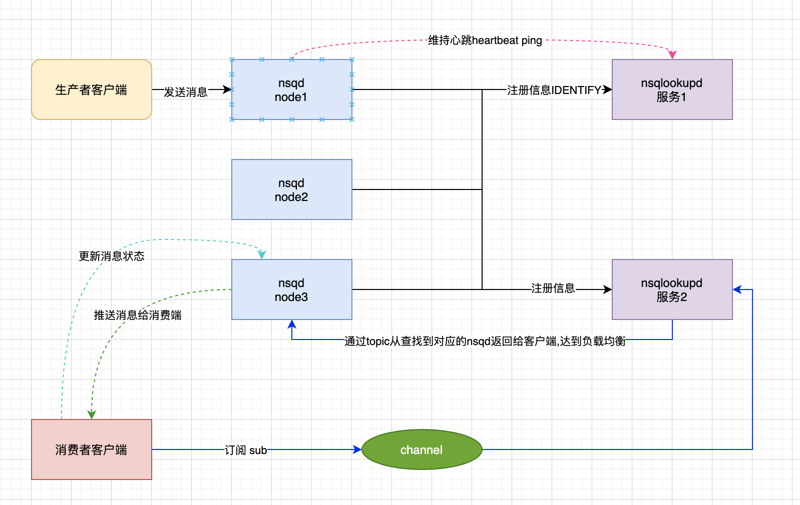
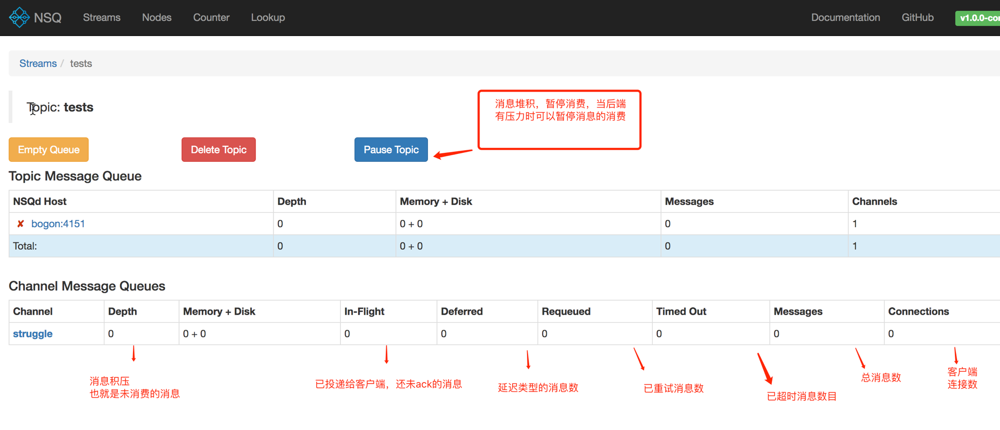

# NSQ深入理解

https://wiki.jikexueyuan.com/project/nsq-guide/nsqlookupd.html

https://developer.aliyun.com/article/739451

NSQ 是实时的分布式消息处理平台，其设计的目的是用来大规模地处理每天数以十亿计级别的消息。它具有分布式和去中心化拓扑结构，该结构具有无单点故障、故障容错、高可用性以及能够保证消息的可靠传递的特征。

- 消息不可持久化(默认) 如果将 `--mem-queue-size` 设置为 0，所有的消息将会存储到磁盘。我们不用担心消息会丢失，nsq 内部机制保证在程序关闭时将队列中的数据持久化到硬盘，重启后就会恢复。
- 消息可以被投递多次（客户端超时，连接失效，重新排队，等等）。由客户端负责操作。
- 消息无序性，投递消息机制类似，它是由重新队列(requeues)，内存和磁盘存储的混合导致的，实际上，节点间不会共享任何信息。
- 消费者最终找出所有话题的生产者，`nsqlookupd` 节点不会维持状态，也不会回答查询。

#### nsq数据流转图


## 组件工具

每个nsqd是一个独立的服务端，用于分布式，用于接收消息投递，可以理解为是一个真正的服务端。

nsqlookupd 只是一个工具服务，类似服务发现，主要用于消费者找到对应的nsqd，并消费里面的数据，并实现生产者和消费者隔离。

单个 nsqd 可以有很多的话题，每个话题可以有多通道。一个通道接收到一个话题中所有消息的副本，启用组播方式的传输，使消息同时在每个通道的所有订阅用户间分发，从而实现负载平衡。

#### nsq生成和消费整体交互图



### nsqlookupd:

```shell
➜  ~ nsqlookupd
[nsqlookupd] 2020/12/30 14:06:02.345799 nsqlookupd v1.0.0-compat (built w/go1.9.1)
[nsqlookupd] 2020/12/30 14:06:02.347175 TCP: listening on [::]:4160
[nsqlookupd] 2020/12/30 14:06:02.347184 HTTP: listening on [::]:4161
[nsqlookupd] 2020/12/30 14:06:57.758638 TCP: new client(127.0.0.1:61856)
[nsqlookupd] 2020/12/30 14:06:57.758765 CLIENT(127.0.0.1:61856): desired protocol magic '  V1'
[nsqlookupd] 2020/12/30 14:06:57.760190 CLIENT(127.0.0.1:61856): IDENTIFY Address:BorgXiaode.local TCP:4150 HTTP:4151 Version:1.0.0-compat
[nsqlookupd] 2020/12/30 14:06:57.760282 DB: client(127.0.0.1:61856) REGISTER category:client key: subkey:
[nsqlookupd] 2020/12/30 14:07:12.759994 CLIENT(127.0.0.1:61856): pinged (last ping 14.999827s)
```

服务端：开启端口 4160,4161, 客户端连接到：new client(127.0.0.1:61856)，然后CLIENT(127.0.0.1:61856): pinged (last ping 14.999827s)

主要负责服务发现 负责nsqd的心跳、状态监测，给客户端、nsqadmin提供nsqd地址与状态

管理拓扑信息并提供最终一致性的发现服务。`nsqlookupd`，它提供了一个目录服务，消费者可以查找到提供他们感兴趣订阅话题的 `nsqd` 地址 。在配置方面，把消费者与生产者解耦开（它们都分别只需要知道哪里去连接 `nsqlookupd` 的共同实例，而不是对方），降低复杂性和维护。

```shell
-http-address="0.0.0.0:4161": <addr>:<port> 监听 HTTP 客户端
-inactive-producer-timeout=5m0s: 从上次 ping 之后，生产者驻留在活跃列表中的时长
-tcp-address="0.0.0.0:4160": TCP 客户端监听的 <addr>:<port> 
-broadcast-address: 这个 lookupd 节点的外部地址, (默认是 OS 主机名)
-tombstone-lifetime=45s: 生产者保持 tombstoned  的时长
-verbose=false: 允许输出日志
-version=false: 打印版本信息
```


### nsqd：

```shell
➜  ~ nsqd --lookupd-tcp-address=127.0.0.1:4160
[nsqd] 2020/12/30 14:06:57.753641 nsqd v1.0.0-compat (built w/go1.9.1)
[nsqd] 2020/12/30 14:06:57.753812 ID: 779
[nsqd] 2020/12/30 14:06:57.753910 NSQ: persisting topic/channel metadata to nsqd.dat
[nsqd] 2020/12/30 14:06:57.757156 TCP: listening on [::]:4150
[nsqd] 2020/12/30 14:06:57.757251 HTTP: listening on [::]:4151
[nsqd] 2020/12/30 14:06:57.757913 LOOKUP(127.0.0.1:4160): adding peer
[nsqd] 2020/12/30 14:06:57.757936 LOOKUP connecting to 127.0.0.1:4160
[nsqd] 2020/12/30 14:06:57.761251 LOOKUPD(127.0.0.1:4160): peer info {TCPPort:4160 HTTPPort:4161 Version:1.0.0-compat BroadcastAddress:BorgXiaode.local}
[nsqd] 2020/12/30 14:07:12.759799 LOOKUPD(127.0.0.1:4160): sending heartbeat
[nsqd] 2020/12/30 14:07:27.758926 LOOKUPD(127.0.0.1:4160): sending heartbeat
```

客户端 连接服务端，开启端口4150，4151，连接服务端，维持心跳

一个接收、排队、然后转发消息到客户端的进程。`nsqd` 提供一个 `--mem-queue-size` 配置选项，这将决定一个队列保存在内存中的消息数量。如果队列深度超过此阈值，消息将透明地写入磁盘,把这个值设置的比较低（如 1 或甚至是 0）。磁盘支持的队列被设计为在不重启的情况下存在（虽然消息可能被传递两次）。

```shell
-auth-http-address=: <addr>:<port> 查询授权服务器 (可能会给多次)
-broadcast-address="": 通过 lookupd  注册的地址（默认名是 OS）
-config="": 配置文件路径
-data-path="": 缓存消息的磁盘路径
-deflate=true: 运行协商压缩特性（客户端压缩）
-e2e-processing-latency-percentile=: 消息处理时间的百分比（通过逗号可以多次指定，默认为 none）
-e2e-processing-latency-window-time=10m0s: 计算这段时间里，点对点时间延迟（例如，60s 仅计算过去 60 秒）
-http-address="0.0.0.0:4151": 为 HTTP 客户端监听 <addr>:<port>
-https-address="": 为 HTTPS 客户端 监听 <addr>:<port>
-lookupd-tcp-address=: 解析 TCP 地址名字 (可能会给多次)
-max-body-size=5123840: 单个命令体的最大尺寸
-max-bytes-per-file=104857600: 每个磁盘队列文件的字节数
-max-deflate-level=6: 最大的压缩比率等级（> values == > nsqd CPU usage)
-max-heartbeat-interval=1m0s: 在客户端心跳间，最大的客户端配置时间间隔
-max-message-size=1024768: (弃用 --max-msg-size) 单个消息体的最大字节数
-max-msg-size=1024768: 单个消息体的最大字节数
-max-msg-timeout=15m0s: 消息超时的最大时间间隔
-max-output-buffer-size=65536: 最大客户端输出缓存可配置大小(字节）
-max-output-buffer-timeout=1s: 在 flushing 到客户端前，最长的配置时间间隔。
-max-rdy-count=2500: 客户端最大的 RDY 数量
-max-req-timeout=1h0m0s: 消息重新排队的超时时间
-mem-queue-size=10000: 内存里的消息数(per topic/channel)
-msg-timeout="60s": 自动重新队列消息前需要等待的时间
-snappy=true: 打开快速选项 (客户端压缩)
-statsd-address="": 统计进程的 UDP <addr>:<port>
-statsd-interval="60s": 从推送到统计的时间间隔
-statsd-mem-stats=true: 切换发送内存和 GC 统计数据
-statsd-prefix="nsq.%s": 发送给统计keys 的前缀(%s for host replacement)
-sync-every=2500: 磁盘队列 fsync 的消息数
-sync-timeout=2s: 每个磁盘队列 fsync 平均耗时
-tcp-address="0.0.0.0:4150": TCP 客户端 监听的 <addr>:<port>
-tls-cert="": 证书文件路径
-tls-client-auth-policy="": 客户端证书授权策略 ('require' or 'require-verify')
-tls-key="": 私钥路径文件
-tls-required=false: 客户端连接需求 TLS
-tls-root-ca-file="": 私钥证书授权 PEM 路径
-verbose=false: 打开日志
-version=false: 打印版本
-worker-id=0: 进程的唯一码(默认是主机名的哈希值)
```


### nsqadmin：

```shell
➜  ~ nsqadmin --lookupd-http-address=127.0.0.1:4161
[nsqadmin] 2020/12/30 14:07:39.425343 nsqadmin v1.0.0-compat (built w/go1.9.1)
[nsqadmin] 2020/12/30 14:07:39.426663 HTTP: listening on [::]:4171
[nsqadmin] 2020/12/30 14:08:23.254386 200 GET / (127.0.0.1:61874) 3.3496ms
```

理解是一个web管理ui界面

用于实时查看集群的统计数据（并且执行各种各样的管理任务）。

#### adminUI个参数含义图



#### nsq管理界面字段含义

| 字段名            | 含义                                                         |
| ----------------- | ------------------------------------------------------------ |
| **Depth**         | Current sum of messages in memory on disk (i.e. the “backlog” of messages pending delivery) **当前消息数：内存和硬盘转存的消息数，即当前的积压量** |
| **Memory + Disk** | 内存和硬盘分别积压的消息数                                   |
| **In-Flight**     | Current count of messages delivered but not yet finished (FIN), requeued (REQ) or timed out **当前未完成的消息数：包括发送但未返回FIN/重新入队列REQ/超时TIMEOUT 三种消息数之和，代表已经投递还未消费掉的消息** |
| **Deferred**      | Current count of messages that were requeued and explicitly deferred which are not yet available for delivery. **重新入队的延迟消息数，指还未发布的重入队消息数量，即未消费的定时（延时）消息数** |
| **Requeued**      | Total count of messages that have been added back to the queue due to time outs or explicit requeues.**重新入队列的消息数** |
| **Timed Out**     | Total count of messages that were requeued after not receiving a response from the client before the configured timeout. **已重入队列但按配置的超时时间内还收到响应的消息数** |
| **Messages**      | Total count of new messages recieved since node startup. **节点启动后的所有新消息总数，真正的消息次数** |
| **Connections**   | Current number of connected clients. **客户端连接数**        |
| **Client Hos**t   | Client ID (hostname) and on-hover the connection remote-address.**客户端的主机名及端口** |
| **Protocol**      | NSQ protocol version and client user-agent. **NSQ协议版本和客户端nsq版本信息** |
| **Attributes**    | TLS and AUTH connection state. **传输层安全和认证连接的状态** |
| **NSQd Host**     | Address of the nsqd node connected to nsqd. **节点的地址**   |
| **In-flight**     | Number of messages sent on a connection which are not yet Finished or Requeued. **当前未完成的消息数：包括发送但未返回FIN/重新入队列REQ/超时TIMEOUT 三种消息数之和.** |
| **Ready Count**   | Max number of messages that can be in-flight on this connection. This is controlled by a client’s max_in_flight setting. **本次连接的最大能未完成的消息数，可由客户端的 max_in_flight 参数控制，ready count比较重要，go的客户端是通过设置max-in-flight 除以客户端连接数得到的，代表一次推给客户端多少条消息，或者客户端准备一次性接受多少条消息，谨慎设置其值，因为可能造成服务器压力，如果消费能力比较弱，rdy建议设置的低一点** |
| **Finished**      | Sum of Finish (FIN) responses. **完成的消息数，即返回FIN的消息数** |
| **Requeued**      | Sum of Requeue (REQ) responses. **重新入队的消息数，即返回REQ的消息数量** |
| **Messages**      | Count of messages sent to this connection. **发送到本客户端的总消息数** |

### nsq_to_file

```shell
➜  ~ nsq_to_file --topic=test --output-dir=/tmp --lookupd-http-address=127.0.0.1:4161
2020/12/30 14:15:29 INF    1 [test/nsq_to_file] querying nsqlookupd http://127.0.0.1:4161/lookup?topic=test
2020/12/30 14:15:29 ERR    1 [test/nsq_to_file] error querying nsqlookupd (http://127.0.0.1:4161/lookup?topic=test) - got response 404 Not Found "{\"message\":\"TOPIC_NOT_FOUND\"}"
```

### topic

主题，可以理解为一类消息

### channel

通道，可以理解为组

### 消息格式

```shell
[x][x][x][x][x][x][x][x][x][x][x][x]...
|  (int32) ||  (int32) || (binary)
|  4-byte  ||  4-byte  || N-byte
------------------------------------...
    size      frame ID     data
    
IDENTIFY\n
[ 4-byte size in bytes ][ N-byte JSON data ]
```

### nsq_tail

消费指定的话题（topic）/通道（channel），并写到 stdout (和 tail(1) 类似)。

```shell
-channel="": NSQ 通道（channel）
-consumer-opt=: 传递给 nsq.Consumer (可能会给多次, http://godoc.org/github.com/bitly/go-nsq#Config)
-lookupd-http-address=: lookupd HTTP 地址 (可能会给多次)
-max-in-flight=200: 最大的消息数 to allow in flight
-n=0: total messages to show (will wait if starved)
-nsqd-tcp-address=: nsqd TCP 地址 (可能会给多次)
-reader-opt=: (已经抛弃) 使用 --consumer-opt
-topic="": NSQ 话题（topic）
-version=false: 打印版本信息
```

## 生成与消费

### 生产者producer

1）消息是直接发送给nsqd

2）消息存储于单个nsqd中，而不是多个(在单个下消息其实就是有序的，不考虑requeue)

3）同一个topic,可以存在于不同的nsqd服务中，也可以只存在于一个中

4）所以推荐部署，是每个生产者拥有自己独立的nsqd。即本地发送。也可以保证顺序

强烈推荐 `nsqd` 和**生产**消息的服务一起运行。

`nsqd` 是一个相对轻量的进程，它能很好和其他进程协同运行。

这个模式有利于结构化消息流为一个消费问题，而不是一个生产问题。

另一个好处是它能将来自服务端的内容形成有效的独立，分享，简仓（silo）的数据。

5）java客户端，通过连接和随机发送消息到多个nsqd里面。类似负载均衡。

### 消费者consumer

当客户端连接到 `nsqd` 和并订阅到一个通道时，它被放置在一个 `RDY` 为 0 状态。这意味着，还没有信息被发送到客户端。当客户端已准备好接收消息发送，更新它的命令 RDY 状态到它准备处理的数量，比如 100。无需任何额外的指令，当 100 条消息可用时，将被传递到客户端（服务器端为那个客户端每次递减 RDY 计数）。

客户端库的被设计成在 `RDY` 数达到配置 `max-in-flight` 的 25% 发送一个命令来更新 RDY 计数（并适当考虑连接到多个 `nsqd` 情况下，适当地分配）。

发送给消费者的消息总会被nsq先存储在InFlight队列, 消费者处理完消息需要给nsq发送`FIN`消息, 这时nsq才算完成了消息的投递.

如果消费者没有发送`FIN`给nsq的话(如断线了)会出现什么情况? 在nsq后台有一个专门的协程处理InFlight队列, 当消息超过了一定时间还没有被`FIN` 则会**重新加入队列**发送给其他消费者.

V2 版本的协议让客户端拥有心跳功能。每隔 30 秒（默认设置），`nsqd` 将会发送一个 `_heartbeat_` 响应，并期待返回。如果客户端空闲，发送 `NOP`命令。如果 2 个 `_heartbeat_` 响应没有被应答， `nsqd` 将会超时，并且强制关闭客户端连接。`IDENTIFY` 命令可以用来改变/禁用这个行为。

作为消息队列的消费者。通过和NSQD建立TCP连接，就可以订阅指定Topic的消息进行消费。在订阅消息的时候，需要指定Topic和Channel两个参数。

NSQD在接受到来自消费者的SUB（订阅）请求后，会找到指定Topic下的Channel，若Channel不存在，则会创建一个新的Channel。并通过Channel中的 memoryMsgChan和backendMsgChan向消费者发送消息。

消费者优先消费memoryMsgChan中的消息。

如果消费者消费消息的速度过快，或者生产者生产不及时导致memoryMsgChan中没有数据。消费者会通过backendMsgChan直接消费存储在磁盘上的数据

### channel通道

In-fligth，requeue,timeOut 等都只和channel关联。即同一个topic,不同channel,彼此间完全独立。

## 常用命令

### IDENTIFY

更新服务器上的客户端元数据和协商功能。

### SUB

订阅话题（topic) /通道（channel)

```shell
SUB <topic_name> <channel_name>\n

<topic_name> - 字符串 (建议包含 #ephemeral 后缀)
<channel_name> - 字符串 (建议包含 #ephemeral 后缀)
```

### PUB

发布一个消息到 **话题（topic)**:

```shell
PUB <topic_name>\n
[ 4-byte size in bytes ][ N-byte binary data ]

<topic_name> - 字符串 (建议 having #ephemeral suffix)
```

### MPUB

发布多个消息到 **话题（topic)** (自动):

```shell
MPUB <topic_name>\n
[ 4-byte body size ]
[ 4-byte num messages ]
[ 4-byte message #1 size ][ N-byte binary data ]
      ... (repeated <num_messages> times)

<topic_name> - 字符串 (建议 having #ephemeral suffix)
```

### RDY

更新 `RDY` 状态 (表示你已经准备好接收`N` 消息)

注意: `nsqd` `v0.2.20+` 使用 `--max-rdy-count` 表示这个值

```shell
RDY <count>\n

<count> - a string representation of integer N where 0 < N <= configured_max
```

### FIN

完成一个消息 (表示成功处理)

```shell
FIN <message_id>\n

<message_id> - message id as 16-byte hex string
```

### REQ

重新将消息队列（表示处理失败）

这个消息放在队尾，表示已经发布过，但是因为很多实现细节问题，不要严格信赖这个，将来会改进。

简单来说，消息在传播途中，并且超时就表示 `REQ`。

```shell
REQ <message_id> <timeout>\n

<message_id> - message id as 16-byte hex string
<timeout> - a string representation of integer N where N <= configured max timeout
    0 is a special case that will not defer re-queueing
```

整数N的字符串表示形式，其中N<=配置的最大超时0是不会延迟重新排队的特殊情况报错 

### TOUCH

重置传播途中的消息超时时间

### CLS

清除连接（不再发送消息）

## 常见问题

### 关于requeue

requeue后，requeue数量会增加，同时nsq消息数量也会增加（只针对消费者端，channel总的消息数是不变的,上层的记录的实在真实的总数，如requeued Timed Out等数量），但是**消息ID，和消息时间不变，只是尝试次数增加。attempts 首次的时候为1 后面不断累加**

```shell
	
2020-12-31 10:03:53,353	INFO	com.ec.crm.user.rule.job.consumer.TestConsumer.handleMessage	41895	pool-17-thread-5	28	收到消息,messageDTO:NSQMessageDTO{id='0e511e5456467000', attempts=1, timestamp=Thu Dec 31 10:04:21 CST 2020, message='tewst11222'}			
2020-12-31 10:03:58,585	INFO	com.ec.crm.user.rule.job.consumer.TestConsumer.handleMessage	47127	pool-17-thread-3	28	收到消息,messageDTO:NSQMessageDTO{id='0e511e5456467000', attempts=2, timestamp=Thu Dec 31 10:04:21 CST 2020, message='tewst11222'}				
2020-12-31 10:04:04,054	INFO	com.ec.crm.user.rule.job.consumer.TestConsumer.handleMessage	52596	pool-17-thread-4	28	收到消息,messageDTO:NSQMessageDTO{id='0e511e5456467000', attempts=3, timestamp=Thu Dec 31 10:04:21 CST 2020, message='tewst11222'}			
2020-12-31 10:04:09,332	INFO	com.ec.crm.user.rule.job.consumer.TestConsumer.handleMessage	57874	pool-17-thread-1	28	收到消息,messageDTO:NSQMessageDTO{id='0e511e5456467000', attempts=4, timestamp=Thu Dec 31 10:04:21 CST 2020, message='tewst11222'}			
2020-12-31 10:04:14,737	INFO	com.ec.crm.boot.nsq.consumer.AbstractNsqConsumer.debugLog		
2020-12-31 10:04:14,737	INFO	com.ec.crm.user.rule.job.consumer.TestConsumer.handleMessage	63279	pool-17-thread-2	28	收到消息,messageDTO:NSQMessageDTO{id='0e511e5456467000', attempts=5, timestamp=Thu Dec 31 10:04:21 CST 2020, message='tewst11222'}			
```

requeue的 有个过期时间设置，如果设置，则表示延迟多少毫秒之后requeue，注意单位是毫秒。

### 消息超时

消息超时，并不影响消费任务下次投递。

对发送给客户端信息设置为在in-flight中，如果处理成功就把这个消息从in-flight的状态中去掉，如果在规定的时间内没有收到客户端的反馈，则认为这个消息超时，然后重新归队，两次进行处理。所以无论是哪种特殊情况，`nsq`统一认为消息为超时。

`nsq`处理过期数据的算法，总结一下就是，使用协程定时去扫描随机的`channel`里是否有过期数据。

https://developer.aliyun.com/article/724308?spm=a2c6h.13262185.0.0.266a35ddr8pina

```go
HTTPClientConnectTimeout: 2 * time.Second,
HTTPClientRequestTimeout: 5 * time.Second,
// 内存最大队列数
MemQueueSize:    10000,
MaxBytesPerFile: 100 * 1024 * 1024,
SyncEvery:       2500,
SyncTimeout:     2 * time.Second,

// 扫描channel的时间间隔
QueueScanInterval:        100 * time.Millisecond,
// 刷新扫描的时间间隔        
QueueScanRefreshInterval: 5 * time.Second,
QueueScanSelectionCount:  20,
// 最大的扫描池数量        
QueueScanWorkerPoolMax:   4,
// 标识百分比        
QueueScanDirtyPercent:    0.25,
// 消息超时
MsgTimeout:    60 * time.Second,
MaxMsgTimeout: 15 * time.Minute,
MaxMsgSize:    1024 * 1024,
MaxBodySize:   5 * 1024 * 1024,
MaxReqTimeout: 1 * time.Hour,
ClientTimeout: 60 * time.Second,
```

从配置得知，消息默认超时时间是60秒，60秒后，消息超时,从 in-flight移除， depth+1,重新进入队列。同时还有一个req超时时间。

消息被触发拿到，超过60秒，没有被处理，就会触发超时重试，如果没有任何消费者了，就不存在再次timeout。也就是超时只针对消费端而言。

### 去中心化原理

`nsqlookupd`用于管理整个网络拓扑结构，nsqd用他实现服务的注册，客户端使用他得到所有的nsqd服务节点信息，然后所有的consumer端连接
实现原理如下，

- `nsqd`把自己的服务信息广播给一个或者多个`nsqlookupd`
- `客户端`连接一个或者多个`nsqlookupd`，通过`nsqlookupd`得到所有的`nsqd`的连接信息，进行连接消费，
- 如果某个`nsqd`出现问题，down机了，会和`nsqlookupd`断开，这样`客户端`从`nsqlookupd`得到的`nsqd`的列表永远是可用的。`客户端`连接的是所有的`nsqd`，一个出问题了就用其他的连接，所以也不会受影响。

### 消息负载

`nsq`的处理方式是客户端主动向`nsqd`报告自已的可处理消息数量（也就是`RDY`命令）。`nsqd`根据每个连接的客户端的可处理消息的状态来随机把消息发送到可用的客户端，来进行消息处理

`MaxInFlight` 来设置最大的处理中的消息数量，会根据这个变量计算在是否更新`RDY`；初始化的时候 客户端会向连接的nsqd服务端来发送updateRDY来设置最大处理数，

同时订阅同一`topic`的客户端（comsumer）有很多个，每个客户端根据自己的配置或状态发送`RDY`命令到`nsqd`表明自己能处理多少消息量
nsqd服务端会检查每个客户端的的状态是否可以发送消息。也就是`IsReadyForMessages`方法，判断inFlightCount是否大于readyCount，如果大于或者等于就不再给客户端发送数据，等待`Ready`后才会再给客户端发送数据

### 各命令操作完毕后

如果NSQD收到了来自客户端的FIN命令，会把消息从inflight队列中删除。

如果NSQD收到了来自客户端的REQ命令，会把消息重新放入channel的内存或磁盘队列中。

如果NSQD收到了来自客户端的TOUCH命令，会把消息的超时时间进行重置。

### NSQ中的优先级队列

在NSQ中，有两个最小堆实现的优先级队列，分别为: PriorityQueue，inFlightPqueue。分别用作延迟消息和消息的at least once机制。

**堆排序(以大顶堆为例)**

堆排序的基本操作:

- MAX-HEAPIFY ： 运行时间为O(logn)，是保持最大堆性质的关键。
- BUILD-MAX-HEAP：以线性时间运行，可以在无序的输入数组基础上构造出大顶堆。
- HEAP-SORT：运行时间为O(nlogn)，对一个数组原地进行排序。
- MAX-HEAP-INSER，HEAP-INCREASE-KEY, 运行时间均为O(logn)，可以让堆结构作为优先队列使用。

https://swanspouse.github.io/2018/11/29/nsq-pqueue/

