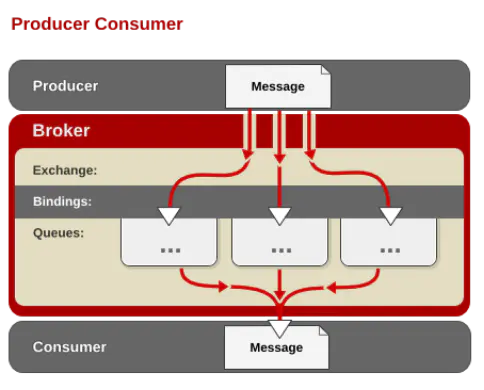
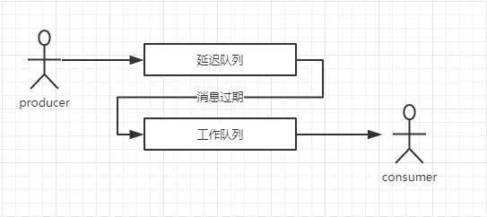
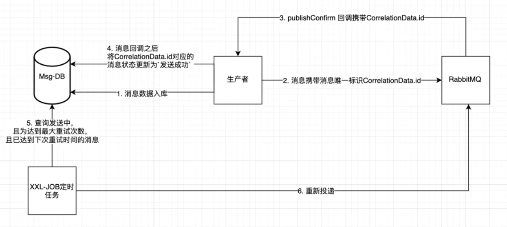
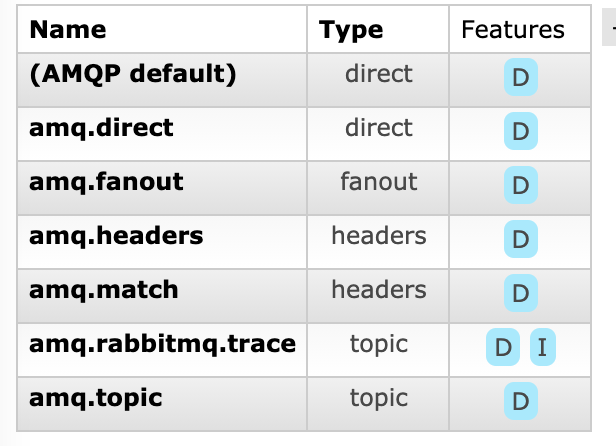
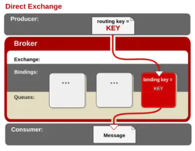
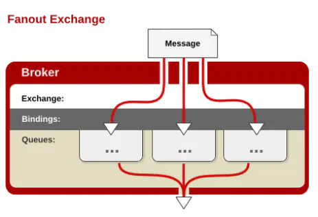
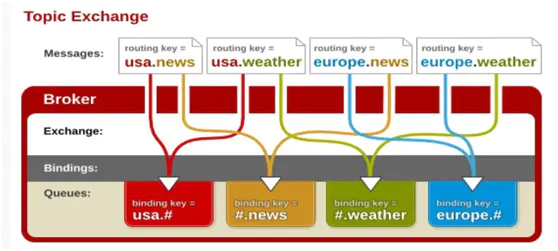

# 深入RabbitMQ

MQ全称是Message Queue，可以理解为消息队列的意思，简单来说就是消息以管道的方式进行传递。

RabbitMQ是一个实现了AMQP（Advanced Message Queuing Protocol）高级消息队列协议的消息队列服务，用Erlang语言的。

https://www.jianshu.com/c/3ab8f98cf4c7

## docker安装

```shell
➜  ~ docker pull rabbitmq
Status: Downloaded newer image for rabbitmq:latest
#创建容器并启动
 ~ docker run -it --name myrabbitmq -p 15672:15672 -p 5672:5672 rabbitmq:latest
 #查看
 ➜  ~ docker ps -a
CONTAINER ID        IMAGE               COMMAND                  CREATED             STATUS                       PORTS                    NAMES
7631af6918cc        rabbitmq:latest     "docker-entrypoint.s…"   26 minutes ago      Created                                               myrabbitmq
➜  ~ docker start myrabbitmq
Error response from daemon: driver failed programming external connectivity on endpoint myrabbitmq (dc40aaaa35a1544fa02d53deb12202a16133503b6b086eba25ff01cf6a9fdea1): Error starting userland proxy: Bind for 0.0.0.0:5672 failed: port is already allocated
Error: failed to start containers: myrabbitmq
➜  ~ lsof -i tcp:5672
COMMAND  PID     USER   FD   TYPE             DEVICE SIZE/OFF NODE NAME
java    6291 borgxiao  134u  IPv6 0x1cdc8e430610d977      0t0  TCP *:amqp (LISTEN)
➜  ~ kill 6291
➜  ~ lsof -i tcp:5672
➜  ~ docker start myrabbitmq
myrabbitmq
#进入容器
➜  ~ docker exec -it myrabbitmq /bin/bash
root@7631af6918cc:/#
```

- -d 后台进程运行
- hostname RabbitMQ主机名称
- name 容器名称
- -p port:port 本地端口:容器端口
- -p 15672:15672 http访问端口
- -p 5672:5672 amqp访问端口

```shell
#启动插件
root@7631af6918cc:/var/log# rabbitmq-plugins enable rabbitmq_management
http://ip地址:15672，这里的用户名和密码默认都是guest

#添加用户，并设置身份
docker exec -it 镜像ID /bin/bash
 rabbitmqctl add_user xiao xiao
```

## 为什么选择RabbitMQ

现在的市面上有很多MQ可以选择，比如ActiveMQ、ZeroMQ、Appche Qpid，那问题来了为什么要选择RabbitMQ？

1. 除了Qpid，RabbitMQ是唯一一个实现了AMQP标准的消息服务器；
2. 可靠性，RabbitMQ的持久化支持，保证了消息的稳定性；
3. 高并发，RabbitMQ使用了Erlang开发语言，Erlang是为电话交换机开发的语言，天生自带高并发光环，和高可用特性；
4. 集群部署简单，正是应为Erlang使得RabbitMQ集群部署变的超级简单；
5. 社区活跃度高，根据网上资料来看，RabbitMQ也是首选；

## 基本概念

**AMQP:**advanced Message Queuing Protocol(高级消息队列协议)

**ConnectionFactory（连接管理器）：**应用程序与Rabbit之间建立连接的管理器，程序代码中使用；

**Channel（信道）：**消息推送使用的通道；

**Exchange（交换器）：**用于接受、分配消息；

**Queue（队列）**：用于存储生产者的消息；

**RoutingKey（路由键）**：用于把生成者的数据分配到交换器上；

**BindingKey（绑定键）**：用于把交换器的消息绑定到队列上

### 工作机制




应用程序和Rabbit Server之间会创建一个TCP连接，一旦TCP打开，并通过了认证，应用程序和Rabbit就创建了一条**AMQP信道（Channel）**。

信道是创建在“真实”TCP上的虚拟连接，AMQP命令都是通过信道发送出去的，每个信道都会有一个唯一的ID，不论是发布消息，订阅队列或者介绍消息都是通过信道完成的。

#### 消息

消息包含两部分：**有效载荷（payload）和标签（label）**

**有效载荷：**即要传递的数据，可以是任何数据

**标签：**并且RabbitMQ用它来决定谁将获得消息的拷贝，可以理解为消息传输的地址，AMQP只会用标签表述这条信息，然后把消息交由Rabbit，Rabbit会根据标签把消息发送给感兴趣的接收方，这种通信方式是一种**“发后即忘(fire-and-forget)”**的单项方式

##### 属性值：

**Properties（属性）**
 **content_type**：传输协议
 **content_encoding**：编码方式
 **priority**：优先级
 **correlation_id**：rpc属性，请求的唯一标识。
 **reply_to**：rpc属性，
 **expiration**：消息的过期时间
 **message_id**：消息的id
 **timestamp**：消息的时间戳

#### 消费者

消费者很容易理解，他们连接到代理服务器上，并订阅到队列上，把消息想象成一个具名邮箱，每当消息到达特定邮箱时，RabbitMQ会将其发送给其中一个订阅的/监听消费者

当消费者接受到消息是，它只得到消息的一部分：有效载荷

#### 代理

就是**RabbitMQ本身，用于扮演“快递”的角色**，本身不生产消息，只是扮演“快递”的角色。

#### 信道

你必须首先连接到Rabbit，才能消费或者发布消息，你在应用程序和Rabbit代理服务器之间创建一条TCP连接，一旦TCP连接打开，应用程序就可以创建一条AMQP信道

信道是建立在“真实的”tcp连接内的虚拟连接

**为什么不直接通过TCP连接发送AMQP命令？**
 主要原因是对于操作系统来说建立和销毁TCP会话是非常昂贵的开销

如果我们为所有线程只使用一条TCP连接，但又确保每个线程的私密性，就像拥有独立连接一样的话，那不就非常完美了

线程启动后会在现成的连接上创建一条信道，也就获得了连接Rabbit上的私密通信路径，而不会给操作系统的TCP栈造成额外负担，在一条TCP连接上创建多少条信道是没有限制的，把它想象成一束光纤电缆就可以了

#### 队列

AMQP消息路由必须有三部分：**交换器、队列和绑定**

**生产者把消息发布到交换器上，消息最终到达队列，并被消费者接收，绑定决定了消息如何从路由器路由到特定的队列**

消费者通过以下两种方式从特定的队列中接收消息：

- 通过AMQP的**basic.comsume**命令订阅，这样就会将信道置为接收模式，知道取消对队列的订阅为止
- 如果我们只想从队列获取单条消息而不是持续订阅，向队列发送单条消息是通过AMQP的**basic.get**，如果要获取更多的消息的话，需要再次发送basic.get命令。
   （不要将basic.get放在循环里面来替代basic.consume）因为这样做会影响Rabbit的性能

**如果消息到达了无人订阅的队列呢？**
 这种情况下，消息会在队列中等待，一旦有消费者订阅到该队列，那么队列上的消息会发给消费者

当Rabbit队列拥有多个消费者时，**队列收到的消息将以循环（round-robin）的方式发给消费者，每条消息只会发送给一个订阅的消费者**

消费者接收到**每一条消息都必须进行确认**，消费者必须通过AMQP的**basic.ack**命令显式的向RabbitMQ发送一个确认，或者在订阅到队列的时候就将**auto_ack**参数设置为true，当设置了auto_ack时，一旦消费者接收消息，RabbitMQ会自动视其确认了消息

注意：消费者对消息的确认和告诉生产者消息已经被接收了这两件事情毫无关系

消费者通过确认命令告诉rabbitMQ它已经正确的接收了消息，**通过RabbitMQ才能安全地把消息从队列中删除**

如果应用程序接收了消息，因为bug忘记确认接收的话，消**息在队列的状态会从“Ready”变为“Unacked”**

如果消息收到却未确认，Rabbit将不会再给这个应用程序发送更多的消息了，这是因为Rabbit认为你没有准备好接收下一条消息。

此条消息会一直保持Unacked的状态，直到你确认了消息，或者断开与Rabbit的连接，Rabbit会自动把消息改完Ready状态，分发给其他订阅者。

##### 属性值

**Durability：**是否持久化，Durable是，Transient是否。如果不持久化，那么在服务器宕机或重启之后Queue就会丢失。

**Auto delete：**如果选择yes，当最后一个消费者不在监听Queue的时候，该Queue就会自动删除，一般选择false。

**Arguments：**AMQP协议留给AMQP实现者扩展使用的。
 **x-message-ttl：**一个消息推送到队列中的存活时间。设置的值之后还没消费就会被删除。
 **x-expires**：在自动删除该队列的时候，可以使用该队列的时间。
 **x-max-length：**在队列头部删除元素之前，队列可以包含多少个（就绪）消息，如果再次向队列中发送消息，会删除最早的那条消息，用来控制队列中消息的数量。
 **x-max-length-bytes：**在队列头部删除元素之前，队列的总消息体的大小，用来控制队列中消息的总大小。
 **x-dead-letter-exchange：**当消息被拒绝或者消息过期，消息重新发送到的交换机（Exchange）的可选名称。
 **x-dead-letter-routing-key：**当消息被拒绝或者消息过期，消息重新发送到的交换机绑定的Route key的名称，如果没有设置则使用之前的Route key。
 **x-max-priority：**队列支持的最大优先级数，如果没有设置则不支持消息优先级
 **x-queue-mode：**将队列设置为延迟模式，在磁盘上保留尽可能多的消息以减少RAM使用; 如果未设置，队列将保持在内存中的缓存，以尽可能快地传递消息。
 **x-queue-master-locator**：将队列设置为主位置模式，确定在节点集群上声明队列主节点所在的规则。

##### Dead-Letter(死信)队列

**消息会变成死信消息的场景：**

1. 消息被`(basic.reject() or basic.nack()) and requeue = false`，即消息被消费者拒绝签收，并且重新入队为false。
    1.1 有一种场景需要注意下：消费者设置了自动ACK，当重复投递次数达到了设置的最大retry次数之后，消息也会投递到死信队列，但是内部的原理还是调用了`nack`/`reject`。
2. 消息过期，过了TTL存活时间。
3. 队列设置了`x-max-length`最大消息数量且当前队列中的消息已经达到了这个数量，再次投递，消息将被挤掉，被挤掉的是最靠近被消费那一端的消息。

设计思路：生产者 --> 消息 --> 交换机 --> 队列 --> 变成死信 --> DLX交换机 -->队列 --> 消费者

应用场景，消息延迟处理

```java

@Bean("deadLetterExchange")
public Exchange deadLetterExchange() {
  return ExchangeBuilder.directExchange("DL_EXCHANGE").durable(true).build();
}

@Bean("deadLetterQueue")
public Queue deadLetterQueue() {
  Map<String, Object> args = new HashMap<>(2);
  //x-dead-letter-exchange    声明  死信交换机
  args.put("x-dead-letter-exchange", "DL_EXCHANGE");
  //x-dead-letter-routing-key    声明 死信路由键
  args.put("x-dead-letter-routing-key", "KEY_R");
  return QueueBuilder.durable("DL_QUEUE").withArguments(args).build();
}

@Bean("redirectQueue")
public Queue redirectQueue() {
  return QueueBuilder.durable("REDIRECT_QUEUE").build();
}

//死信路由通过 DL_KEY 绑定键绑定到死信队列上.
@Bean
public Binding deadLetterBinding() {
  return new Binding("DL_QUEUE", Binding.DestinationType.QUEUE, "DL_EXCHANGE", "DL_KEY", null);

}

//死信路由通过 KEY_R 绑定键绑定到死信队列上.
@Bean
public Binding redirectBinding() {
  return new Binding("REDIRECT_QUEUE", Binding.DestinationType.QUEUE, "DL_EXCHANGE", "KEY_R", null);
}
```

1）声明了一个direct模式的exchange。

2）声明了一个死信队列deadLetterQueue，该队列配置了一些属性`x-dead-letter-exchange`表明死信交换机，`x-dead-letter-routing-key`表明死信路由键，因为是direct模式，所以需要设置这个路由键。

3）声明了一个替补队列redirectQueue，变成死信的消息最终就是存放在这个队列的。

4）声明绑定关系，分别是死信队列以及替补队列和交换机的绑定。

那么如何模拟生成一个死信消息呢，可以在发送到DL_QUEUE的消息在10秒后失效，然后转发到替补队列中，代码实现如下

```java

public void sendMsg(String content) {
  CorrelationData correlationId = new CorrelationData(UUID.randomUUID().toString());
  MessagePostProcessor messagePostProcessor = message -> {
    MessageProperties messageProperties = message.getMessageProperties();
    //设置编码
    messageProperties.setContentEncoding("utf-8");
    //设置过期时间10*1000毫秒
    messageProperties.setExpiration("5000");
    return message;
  };
  rabbitTemplate.convertAndSend("DL_EXCHANGE", "DL_KEY", content, messagePostProcessor);
}
```

**消息首先进入DL_QUEUE，5秒后失效，被转发到REDIRECT_QUEUE中**。

### 消息拒绝：

#### **有关超时**

RabbitMQ是没有超时概念的，如果一个消费者消费一条消息要花费很长时间，比如10分钟，那么这个过程会一直进行下去。除非你采用其他策略来中断它或者重试。

#### **消费者挂了怎么办**

选择1：断开与Rabbit的连接，这样Rabbit会重新把消息分派给另一个消费者；

选择2：拒绝Rabbit发送的消息使用channel.basicReject(long deliveryTag, boolean requeue)，参数1：消息的id；参数2：处理消息的方式，如果是true，Rabbib会重新分配这个消息给其他订阅者，如果设置成false的话，Rabbit会把消息发送到一个特殊的“死信”队列，用来存放被拒绝而不重新放入队列的消息。

```java
channel.queueDeclare(config.QueueName, false, false, false, null);
GetResponse resp = channel.basicGet(config.QueueName, false);
String message = new String(resp.getBody(), "UTF-8");
//消息拒绝
channel.basicReject(resp.getEnvelope().getDeliveryTag(), true); 
```

### 消息公平分发

场景：现在有两个消费者，A的吞吐量为10，B的吞吐量为5。
在默认的模式下面，消息队列不管消费者是否处理完毕，都会继续下发下一条消息，造成的结果就是A 获取10条消息，B也获取10条消息

```java
channel.basicQos(int prefetchCount);
```

这个语句就会使得一次性下发prefetchCount个消息，等待处理完成后在下发同样的数量的消息，这样会提升系统的整体的吞吐量。

### 消息延迟

#### 消息TTL

队列设置：

- x-expires：队列ttl，当队列未使用(没有任何消费者、没有被重新声明、过期时间段内未调用过Basic.Get命令)时，会被删除。服务器重启后，持久化的队列过期时间会重新计算，x-expires单位为毫秒，不能设置为0
- x-message-ttl ：队列中消息的ttl

发布消息设置：

- expiration：单条消息ttl（若x-message-ttl也设置，取最短的ttl）

消息抛出

- 消息过期后，抛出需要满足两个条件，1个是消息过期，1个是在队列头部
- 若消息已过期，并且不在头部，当消费者消费掉头部未过期的消息之后，过期的消息仍会被抛出，不会被消费者消费掉。

#### 死信交互器DLX

dlx和普通交换器并没有区别，可以绑定多个队列

队列声明的时候，可以设置死信参数

- **x-dead-letter-exchange** 指定队列的死信交换器
- **x-dead-letter-routing-key** 指定dlx的路由键，可与延迟队列的路由键不同

消息满足一定的条件会进入死信路由

- 一个消息被Consumer拒收了，并且reject方法的参数里requeue是false。也就是说不会被再次放在队列里，被其他消费者使用。
- 消息过期
- 队列的长度限制满了。排在前面的消息会被丢弃或者扔到死信路由上。



- queue1作为延迟队列，用于存储消息等到过期后转到任务队列
- queue2作为任务队列，已经经过延迟的消息，在这里被消费

### 消息可靠传递

https://www.jianshu.com/p/d33ada5ae346



### 交换机Exchange



当你想要将消息投递到队列时，你通过把消息发送给**交换器**来完成。然后，根据确定的规则，RabbitMQ将会决定消息该投递到哪个队列，这些规则被称为**路由键(routing key)**。**队列通过路由键绑定到交换器**，当你把消息发送到代理服务器时，消息将拥有一个路由键（即使是空的）
 Rabbit也会将其和绑定使用的路由键进行匹配，如果匹配的话，那么消息将会投递到队列，如果路由的消息不匹配任何绑定模式的话，消息将进入“黑洞”

交换机类型总共4种

**Virtual host**:属于哪个Virtual host。

**Name**：名字，同一个Virtual host里面的Name不能重复。

**Durability**： 是否持久化，Durable：持久化。Transient：不持久化。

**Auto delete**：当最后一个绑定（队列或者exchange）被unbind之后，该exchange自动被删除。

**Internal**： 是否是内部专用exchange，是的话，就意味着我们不能往该exchange里面发消息。

**Arguments**： 参数，是AMQP协议留给AMQP实现做扩展使用的。
 alternate_exchange配置的时候，exchange根据路由路由不到对应的队列的时候，这时候消息被路由到指定的alternate_exchange的value值配置的exchange上。（下面的博客会有说明这参数的具体使用）

#### direct直连

默认的交换器类型，也非常的简单，如果路由键匹配的话，理解为直连



```java
// 声明队列【参数说明：参数一：队列名称，参数二：是否持久化；参数三：是否独占模式；参数四：消费者断开连接时是否删除队列；参数五：消息其他参数】
channel.queueDeclare(config.QueueName, false, false, false, null);
String message = String.format("当前时间：%s", new Date().getTime());
// 推送内容【参数说明：参数一：交换机名称；参数二：队列名称，参数三：消息的其他属性-路由的headers信息；参数四：消息主体】
channel.basicPublish("", config.QueueName, null, message.getBytes("UTF-8"));


// 声明队列【参数说明：参数一：队列名称，参数二：是否持久化；参数三：是否独占模式；参数四：消费者断开连接时是否删除队列；参数五：消息其他参数】
channel.queueDeclare(config.QueueName, false, false, false, null);
Consumer defaultConsumer = new DefaultConsumer(channel) {
	@Override
	public void handleDelivery(String consumerTag, Envelope envelope, AMQP.BasicProperties properties,
			byte[] body) throws IOException {
		String message = new String(body, "utf-8"); // 消息正文
		System.out.println("收到消息 => " + message);
		channel.basicAck(envelope.getDeliveryTag(), false); // 手动确认消息【参数说明：参数一：该消息的index；参数二：是否批量应答，true批量确认小于当前id的消息】
	}
};
channel.basicConsume(config.QueueName, false, "", defaultConsumer);
```

#### fanout发布/订阅

fanout(扇形)有别于direct交换器，fanout是一种**发布/订阅模式的交换器**，当你发送一条消息的时候，交换器会把消息广播到所有附加到这个交换器的队列上。



```java
final String ExchangeName = "fanoutec"; // 交换器名称
channel.exchangeDeclare(ExchangeName, "fanout"); // 声明fanout交换器
String message = "时间：" + new Date().getTime();
channel.basicPublish(ExchangeName, "", null, message.getBytes("UTF-8"));
```

```java
channel.exchangeDeclare(ExchangeName, "fanout"); // 声明fanout交换器
String queueName = channel.queueDeclare().getQueue(); // 声明队列
channel.queueBind(queueName, ExchangeName, "");
Consumer consumer = new DefaultConsumer(channel) {
	@Override
	public void handleDelivery(String consumerTag, Envelope envelope, AMQP.BasicProperties properties,
			byte[] body) throws IOException {
		String message = new String(body, "UTF-8");
	}
};
channel.basicConsume(queueName, true, consumer);
```

fanout和direct的区别最多的在接收端，fanout需要绑定队列到对应的交换器用于订阅消息。

其中channel.queueDeclare().getQueue()为随机队列，Rabbit会随机生成队列名称，一旦消费者断开连接，该队列会自动删除。

**注意：**对于fanout交换器来说routingKey（路由键）是无效的，这个参数是被忽略的。

#### topic匹配订阅



topic交换器运行和fanout类似，但是可以更灵活的匹配自己想要订阅的信息，这个时候**routingKey**路由键就排上用场了，使用路由键进行消息（规则）匹配。

假设我们现在有一个日志系统，会把所有日志级别的日志发送到交换器，warning、log、error、fatal，但我们只想处理error以上的日志，要怎么处理？这就需要使用topic路由器了。

topic路由器的关键在于定义路由键，定义routingKey名称不能超过255字节，使用“.”作为分隔符，例如：com.mq.rabbit.error。

消费消息的时候routingKey可以使用下面字符匹配消息：

- "*"匹配一个分段(用“.”分割)的内容；
- "#"匹配0和多个字符；

例如发布了一个“com.mq.rabbit.error”的消息：

能匹配上的路由键：

- cn.mq.rabbit.*
- cn.mq.rabbit.#
- \#.error
- cn.mq.#
- \#

不能匹配上的路由键：

- cn.mq.*
- *.error
- *

```java
String routingKey = "com.mq.rabbit.error";
channel.exchangeDeclare(ExchangeName, "topic"); // 声明topic交换器
String message = "时间：" + new Date().getTime();
channel.basicPublish(ExchangeName, routingKey, null, message.getBytes("UTF-8"));
```

```java
channel.exchangeDeclare(ExchangeName, "topic"); // 声明topic交换器
String queueName = channel.queueDeclare().getQueue(); // 声明队列
String routingKey = "#.error";
channel.queueBind(queueName, ExchangeName, routingKey);
Consumer consumer = new DefaultConsumer(channel) {
	@Override
	public void handleDelivery(String consumerTag, Envelope envelope, AMQP.BasicProperties properties,
			byte[] body) throws IOException {
		String message = new String(body, "UTF-8");
		System.out.println(routingKey + "|接收消息 => " + message);
	}
};
channel.basicConsume(queueName, true, consumer);
```

#### headers

允许你匹配AMQP消息的header而非路由键，除此之外，和direct交换器完全一致，但是性能差很多，因此它并不实用，而且几乎用不到

### 虚拟主机

- 每个RabbitMQ服务器都能创建虚拟的消息服务器，我们称之为**虚拟主机(vhost)**每一个vhost本质上是一个mini版的RabbitMQ服务器，拥有自己的队列、交换器和绑定等等
- 更重要的是，**他拥有自己的权限机制**，**这使得你能够安全地使用一个RabbitMQ服务器来服务众多的应用程序**
- vhost就像是虚拟机之与物理服务器一样：他们在各个实例间提供逻辑上的分离，允许你为不同程序安全保密地运行数据，它既能将同一个Rabbit的众多客户区分开来，又可以避免队列和交换器命名冲突
- vhost是AMQP概念的基础，你必须在连接时进行指定
- RabbitMQ包含了一个开箱即用的默认vhost:"/"，如果你不需要多个vhost，那么就使用默认的吧，使用缺省的guest用户名和密码guest就可以访问默认的vhost
- 当你在RabbitMQ集群上创建vhost，整个集群上都会创建该vhost，vhost不仅消除了为基础架构中的每一层运行一个RabbitMQ服务器的需要，同样也避免了为每一层创建不同集群

```shell
rabbitmqctl add_vhost test #添加vhost
Adding vhost "test" ...

rabbitmqctl list_vhosts #列出所有vhost
Listing vhosts ...
name
/
test
rabbitmqctl delete_vhost test #删除所有vhost
Deleting vhost "test" ...
```

### 消息持久化

重启RabbitMQ后，队列和交换器都会消失（随同里面的消息），原因在于每个队列和交换器的durable属性，该属性默认为false

当你把消息发送到Rabbit服务器的时候，你需要选择你是否要进行持久化，但这并不能保证Rabbit能从崩溃中恢复，想要Rabbit消息能恢复必须满足3个条件：

1. 投递消息的时候**durable(持久)**设置为true，消息持久化，代码：channel.queueDeclare(x, true, false, false, null)，参数2设置为true持久化；
2. 设置投递模式deliveryMode设置为2（持久），代码：channel.basicPublish(x, x, MessageProperties.PERSISTENT_TEXT_PLAIN,x)，参数3设置为存储纯文本到磁盘；
3. 消息已经到达持久化交换器上/消息已经到达持久化的队列；

Rabbit会将你的持久化消息写入磁盘上的持久化日志文件，等消息被消费之后，Rabbit会把这条消息标识为等待垃圾回收。

RabbitMQ确保持久性消息能从服务器重启中恢复的方式是,将他们写入磁盘上的一个持久化日志文件。当发布一条持久化消息到持久交换器上时，Rabbit会在消息提交到日志文件后才发送响应

如果RabbitMQ重启，服务器会自动重建交换器和队列，重播持久性日志文件中的消息到合适的队列或者交换器上

你可以为所有消息都启动持久化，但是你也要为此付出代价：**性能**，写入磁盘要比写入内存慢了不止一点点，而且会极大的减少RabbitMQ服务器每秒可处理的消息总数，导致消息吞度量降低至少10倍的情况并不少见

持久化消息在RabbitMQ内建集群环境中工作的并不好，实际上集群上的队列均匀分布在各个节点上而且没有冗余，如果运行a队列的节点崩溃了，那么直到节点恢复前，这个队列就从整个集群消失了，而且这个节点上的所有队列不可用，而且持久化队列也无法重建

### 事务使用

要想消息不丢失

RabbitMQ有两种方式来解决这个问题：

1. 通过AMQP提供的事务机制实现；
2. 使用发送者确认模式实现；

#### 事务使用

事务的实现主要是对信道（Channel）的设置，主要的方法有三个：

1. channel.txSelect()声明启动事务模式；
2. channel.txComment()提交事务；
3. channel.txRollback()回滚事务；

```java
try {
	channel.txSelect(); // 声明事务
	// 发送消息
	channel.basicPublish("", _queueName, MessageProperties.PERSISTENT_TEXT_PLAIN, message.getBytes("UTF-8"));
	channel.txCommit(); // 提交事务
} catch (Exception e) {
	channel.txRollback();
} finally {
	channel.close();
	conn.close();
}

```

#### Confirm发送确认模式

RabbitMQ团队决定拿出更好的方案来保证消息投递：发送方确认模式

和事务相仿，你需要告诉Rabbit将信道设置成confirm模式

- 一旦信道进入confirm模式，所有在信道上发布的消息都会被指派一个唯一的id号（从1开始)
- 一旦消息被投递给所有匹配的队列后，信道会发送一个发送方确认模式给生产者应用程序（包含唯一的id），这使得生产者知晓消息已经安全到达目的队列了(如果消息和队列是可持久化的，那么确认消息只会在队列将消息写入磁盘后才会发生)
- 发送方确认模式最大的好处是他们是**异步**的
- 如果Rabbit发生了内部错误从而导致了消息的丢失，Rabbit会发送一条nack消息，就像发送方确认消息那样，只不过这次说明的是消息已经丢失了
- 由于没有消息回滚的概念，因此发送方确认模式更加轻量级，同时对Rabbit代理服务器的性能几乎没有影响

**Confirm的三种实现方式：**

方式一：channel.waitForConfirms()普通发送方确认模式；

方式二：channel.waitForConfirmsOrDie()批量确认模式；

方式三：channel.addConfirmListener()异步监听发送方确认模式；

## RabbitMQ集群

RabbitMQ 最优秀的功能之一就是内建集群，这个功能设计的目的是允许消费者和生产者在节点崩溃的情况下继续运行，以及通过添加更多的节点来线性扩展消息通信吞吐量。RabbitMQ 内部利用 Erlang 提供的分布式通信框架 **OTP** 来满足上述需求，使客户端在失去一个 RabbitMQ 节点连接的情况下，还是能够重新连接到集群中的任何其他节点继续生产、消费消息。

RabbitMQ 会始终记录以下四种类型的内部元数据：

1. 队列元数据
    包括队列名称和它们的属性，比如是否可持久化，是否自动删除
2. 交换器元数据
    交换器名称、类型、属性
3. 绑定元数据
    内部是一张表格记录如何将消息路由到队列
4. vhost 元数据
    为 vhost 内部的队列、交换器、绑定提供命名空间和安全属性

当在集群中声明队列、交换器、绑定的时候，这些操作会直到所有集群节点都成功提交元数据变更后才返回。集群中有**内存节点和磁盘节点两种类型**，内存节点虽然不写入磁盘，但是它的执行比磁盘节点要好。内存节点可以提供出色的性能，磁盘节点能保障配置信息在节点重启后仍然可用，那集群中如何平衡这两者呢？

RabbitMQ 只要求集群中至少有一个磁盘节点，所有其他节点可以是内存节点，当节点加入火离开集群时，它们必须要将该变更通知到至少一个磁盘节点。如果只有一个磁盘节点，刚好又是该节点崩溃了，那么集群可以继续路由消息，但不能创建队列、创建交换器、创建绑定、添加用户、更改权限、添加或删除集群节点。换句话说集群中的唯一磁盘节点崩溃的话，集群仍然可以运行，但知道该节点恢复，否则无法更改任何东西。

## Spring-boot集成

```ini
rabbitmq:
    template:
      # 使用return-callback时必须设置mandatory为true
      mandatory: true
    # 消息发送到交换机确认机制,是否确认回调
    publisher-confirms: true
    # 消息发送到交换机确认机制，是否返回回调
    publisher-returns: true
    listener:
      simple:
        # 并发消费者初始化值
        concurrency: 5
        # 最大值
        max-concurrency: 10
        # 每个消费者每次监听时可拉取处理的消息数量
        prefetch: 20
        # 确认模式设置为手动签收
        acknowledge-mode: manual
```


```xml
<parent>
		<groupId>org.springframework.boot</groupId>
		<artifactId>spring-boot-starter-parent</artifactId>
		<version>2.4.3</version>
		<relativePath/> <!-- lookup parent from repository -->
	</parent>
<dependency>
			<groupId>org.springframework.boot</groupId>
			<artifactId>spring-boot-starter-amqp</artifactId>
		</dependency>
```

```java
ConfigurableApplicationContext applicationContext = SpringApplication.run(RabbitmqSpringBootTestApplication.class, args);
		AmqpTemplate amqpTemplate = applicationContext.getBean(AmqpTemplate.class);
		amqpTemplate.convertAndSend("test-exchange","routingKey.test","消息内容");
```

method<channel.close>(reply-code=404, reply-text=NOT_FOUND - no exchange 'test-exchange' in vhost '/', class-id=60, method-id=40)

手动创建exchange之后错误消失

### 消息发送

```java
//直接发送模式，消息需要封装成Message
void send(Message message) throws AmqpException;
void send(String routingKey, Message message) throws AmqpException;
void send(String exchange, String routingKey, Message message) throws AmqpException;
//直接发送模式，消息会自动转换
void convertAndSend(Object message) throws AmqpException;
void convertAndSend(String routingKey, Object message) throws AmqpException;
void convertAndSend(String exchange, String routingKey, Object message) throws AmqpException;
//回调模式
...
void convertAndSend(String exchange, String routingKey, Object message, MessagePostProcessor messagePostProcessor)
			throws AmqpException;
```

注：不指定exchange则会发送到默认的exchange上面，不指定routingKey则默认，如果指定exchange需要提前创建

### 消息接收

原生：

```java
channel = rabbitConnection.createChannel();
//绑定 注意queue需要提前创建
channel.queueBind("test-ex-queue","test-exchange","routingKey.#");
Channel finalChannel = channel;
channel.basicConsume("test-ex-queue",false,"",new DefaultConsumer(finalChannel){
  @Override
  public void handleDelivery(String consumerTag, Envelope envelope,
                             BasicProperties properties, byte[] body) throws IOException {
    String routingKey = envelope.getRoutingKey();
    String contentType = properties.getContentType();
    String content = new String(body, StandardCharsets.UTF_8);
    System.out.println("收到消息："+content+","+routingKey+","+contentType);
    finalChannel.basicAck(envelope.getDeliveryTag(),false);
  }
});
//收到消息：消息内容,routingKey.test,text/plain
```

spring:

```java
@RabbitListener
String[] queues() default {};
//会自动创建
Queue[] queuesToDeclare() default {};
//绑定exchange和queue
QueueBinding[] bindings() default {};
```

使用的时候也可以通过一些bean的定义，提前定义和绑定好关系：

```java
package com.zb.rabbitMQtest.t3publishSubscribe.config;

import org.springframework.amqp.core.*;
import org.springframework.context.annotation.Bean;
import org.springframework.context.annotation.Configuration;

/**
 * @author 张博
 */
@Configuration
public class Config {
  //定义交换机，发生的时候直接获取 fanoutExchange bean 然后getName() fanoutExchange.getName()
    @Bean
    public FanoutExchange fanoutExchange() {
        return new FanoutExchange("fanout-exchange");
    }
  //定义queue
    @Bean
    public Queue autoDeleteQueue0() {
        return new AnonymousQueue();
    }
//定义绑定 则使用的时候，就不需要再手动绑定QueueBinding[]
    @Bean
    public Binding binding0(FanoutExchange fanoutExchange, Queue autoDeleteQueue0) {
        return BindingBuilder.bind(autoDeleteQueue0).to(fanoutExchange);
    }
}
//消费者直接使用
@RabbitListener(queues = "#{autoDeleteQueue0.name}")
    public void receiver0(String str) {
        System.out.println("receiver0++++++++++:" + str);
    }

```

注意：DirectExchange，FanoutExchange，TopicExchange等继承AbstractExchange

注：**注册的Bean 即exchange和queue,会自动创建好**。

### 完整案例

#### 配置

```java
@Configuration
public class ConfirmConfiguration {

    /**
     * 声明confirm.message队列
     */
    @Bean
    public Queue confirmQueue() {
        return new Queue("confirm.message");
    }

    /**
     * 声明一个名为exchange-2的交换机
     */
    @Bean
    public TopicExchange exchange2() {
        return new TopicExchange("exchange-2");
    }

    /**
     * 将confirm.message的队列绑定到exchange-2交换机
     */
    @Bean
    public Binding bindMessage1() {
        return BindingBuilder.bind(confirmQueue()).to(exchange2()).with("confirm.message");
    }
}
```

#### 生产者

```java
@Component
@Slf4j
public class ConfirmProducer {
    @Resource
    private RabbitTemplate rabbitTemplate;

    /**
     * 如果消息没有到exchange,则confirm回调,ack=false
     * 如果消息到达exchange,则confirm回调,ack=true
     * exchange到queue成功,则不回调return
     * exchange到queue失败,则回调return(需设置mandatory=true,否则不回回调,消息就丢了)
     */
    private final RabbitTemplate.ConfirmCallback confirmCallback = (correlationData, ack, cause) -> {
        if (!ack) {
            log.error("消息发送失败：correlationData: {},cause: {}", correlationData, cause);
        }else {
            log.info("消息发送成功：correlationData: {},ack: {}", correlationData, ack);
        }
    };

    private final RabbitTemplate.ReturnCallback returnCallback = (message, replyCode, replyText, exchange, routeKey) ->
            log.error("消息丢失: exchange: {},routeKey: {},replyCode: {},replyText: {}", exchange, routeKey, replyCode, replyText);

    /**
     * 发送消息
     * @param message 消息内容
     */
    public void send(String message) {
        // 构建回调返回的数据
        CorrelationData correlationData = new CorrelationData();
        correlationData.setId(TimeUtil.localDateTimeToStamp(LocalDateTime.now()) + "");

        Message message1 = MessageBuilder.withBody(message.toString().getBytes())
                .setContentType(MessageProperties.CONTENT_TYPE_TEXT_PLAIN)
                // 将CorrelationData的id 与 Message的correlationId绑定，然后关系保存起来,然后人工处理
                .setCorrelationId(correlationData.getId())
                .build();
        rabbitTemplate.setConfirmCallback(confirmCallback);
        rabbitTemplate.setReturnCallback(returnCallback);
        rabbitTemplate.convertAndSend("exchange-2", "confirm.message", message1, correlationData);
    }
}
```

#### 消费者

```java
@Component
@Slf4j
public class ConfirmConsumer {

    @RabbitListener(bindings = @QueueBinding(value = @Queue(value = "confirm.message",durable = "true")
            ,exchange = @Exchange(value = "exchange-2",type = "topic")
            ,key = "confirm.message"))
    public void receive(String message, Message message1, Channel channel) throws IOException {
        log.info("消费者收到消息：{}", message);
        long deliverTag = message1.getMessageProperties().getDeliveryTag();
        //第一个deliveryTag参数为每条信息带有的tag值，第二个multiple参数为布尔类型
        //为true时会将小于等于此次tag的所有消息都确认掉，如果为false则只确认当前tag的信息，可根据实际情况进行选择。
        channel.basicAck(deliverTag, false);
    }
}
```


## 应用场景

https://www.rabbitmq.com/getstarted.html

### 简单模式

一个生产者一个消费者一个队列非常简单的结构，基本上这个结构没有什么用


### Work模式

一个生产一个队列，多个消费者，每个消费者获取的消息唯一


### 订阅模式

Exchange将会把消息投递到所有它已知的Q，然后连接Q 的所有的C都能获取到消息。此时ExchangeType的模式为**fanout**,

这种模式适用于通知，例如通知所有的商户周五晚上服务器更新


```java
//生产者 exchange为fanout 不指定routingkey
channel.exchangeDeclare(EXCHANGE_NAME, "fanout");
channel.basicPublish(EXCHANGE_NAME, "", null, message.getBytes("UTF-8"));

//消费者 
String queueName = channel.queueDeclare().getQueue();//create a non-durable, exclusive(独立), autodelete queue with a generated name
channel.queueBind(queueName, EXCHANGE_NAME, "");
//消费者公共
DeliverCallback deliverCallback = (consumerTag, delivery) -> {
        String message = new String(delivery.getBody(), "UTF-8");
        System.out.println(" [x] Received '" + message + "'");
    };
    channel.basicConsume(queueName, true, deliverCallback, consumerTag -> { });
```


### 路由模式

由routing key决定把消息往哪个队列里面投递，有binding 匹配routing key的结果来决定C是否可以获取此Q中的消息，这种模式下ExchangeType必须为**direct**

在集群的环境下，我们会将一个系统的所有消息都交由这个集群来处理，所以所有的消息必须要归类，那么这个模式就在这种情况下可以高效的处理消息


```java
Queue.BindOk queueBind(String queue, String exchange, String routingKey) throws IOException;
```

```java
//生产者 exchange为direct 并且发送消息的时候带上routingKey
channel.exchangeDeclare(EXCHANGE_NAME, "direct");
channel.basicPublish(EXCHANGE_NAME, "info", null, message.getBytes());
channel.basicPublish(EXCHANGE_NAME, "error", null, message.getBytes());

//消费者 1 不同消费者订阅固定的routingKey
String queueName = channel.queueDeclare().getQueue();
channel.queueBind(queueName, EXCHANGE_NAME, "info");

//消费者 2 绑定多个routingKey
String queueName = channel.queueDeclare().getQueue();
channel.queueBind(queueName, EXCHANGE_NAME, "warn");
channel.queueBind(queueName, EXCHANGE_NAME, "error");


```


### Topics模式

和路由模式不同，在这种模式下可以模糊匹配


```java
//生产者 定义exchange为topic 发送消息带上routingKey
channel.exchangeDeclare(EXCHANGE_NAME, "topic");
channel.basicPublish(EXCHANGE_NAME, routingKey, null, message.getBytes("UTF-8"));

//消费者1
String queueName = channel.queueDeclare().getQueue();
channel.queueBind(queueName, EXCHANGE_NAME, "#");

//消费者2
String queueName = channel.queueDeclare().getQueue();
channel.queueBind(queueName, EXCHANGE_NAME, "kern.*");
channel.queueBind(queueName, EXCHANGE_NAME, "*.critical");
```


### RPC模式

一般不用，其实就是一个简单模式的变种，通过rabbitMQ模拟RPC调用


```java
//客户端 发送到rcp_queue 并指定回调到自动创建到replyQueueName上
final String corrId = UUID.randomUUID().toString();
String replyQueueName = channel.queueDeclare().getQueue();
AMQP.BasicProperties props = new AMQP.BasicProperties
  .Builder()
  .correlationId(corrId)
  .replyTo(replyQueueName)
  .build();

channel.basicPublish("", "rpc_queue", props, message.getBytes("UTF-8"));
//同时接收消费
final BlockingQueue<String> response = new ArrayBlockingQueue<>(1);

String ctag = channel.basicConsume(replyQueueName, true, (consumerTag, delivery) -> {
  if (delivery.getProperties().getCorrelationId().equals(corrId)) {
    response.offer(new String(delivery.getBody(), "UTF-8"));
  }
}, consumerTag -> {
});

String result = response.take();
channel.basicCancel(ctag);

//服务端
channel.queueDeclare(RPC_QUEUE_NAME, false, false, false, null);
channel.queuePurge(RPC_QUEUE_NAME);
channel.basicQos(1);
Object monitor = new Object();
DeliverCallback deliverCallback = (consumerTag, delivery) -> {
  AMQP.BasicProperties replyProps = new AMQP.BasicProperties
    .Builder()
    .correlationId(delivery.getProperties().getCorrelationId())
    .build();

  String response = "";

  try {
    String message = new String(delivery.getBody(), "UTF-8");
    int n = Integer.parseInt(message);

    System.out.println(" [.] fib(" + message + ")");
    response += fib(n);
  } catch (RuntimeException e) {
    System.out.println(" [.] " + e.toString());
  } finally {
    channel.basicPublish("", delivery.getProperties().getReplyTo(), replyProps, response.getBytes("UTF-8"));
    channel.basicAck(delivery.getEnvelope().getDeliveryTag(), false);
    // RabbitMq consumer worker thread notifies the RPC server owner thread
    synchronized (monitor) {
      monitor.notify();
    }
  }
};
channel.basicConsume(RPC_QUEUE_NAME, false, deliverCallback, (consumerTag -> { }));
```


## Channel详解

```java
public interface Channel extends ShutdownNotifier, AutoCloseable{
	Connection getConnection();
  void addReturnListener(ReturnListener listener);
  ReturnListener addReturnListener(ReturnCallback returnCallback);
  boolean removeReturnListener(ReturnListener listener);
  void addConfirmListener(ConfirmListener listener);
  ConfirmListener addConfirmListener(ConfirmCallback ackCallback, ConfirmCallback nackCallback);
  Consumer getDefaultConsumer();
  //限流等参数控制
  void basicQos(int prefetchSize, int prefetchCount, boolean global) throws IOException;
  //消息发送
  void basicPublish(String exchange, String routingKey, BasicProperties props, byte[] body) throws IOException;
  Exchange.DeclareOk exchangeDeclare(String exchange, BuiltinExchangeType type, boolean durable) throws IOException;
  ....
}
```

