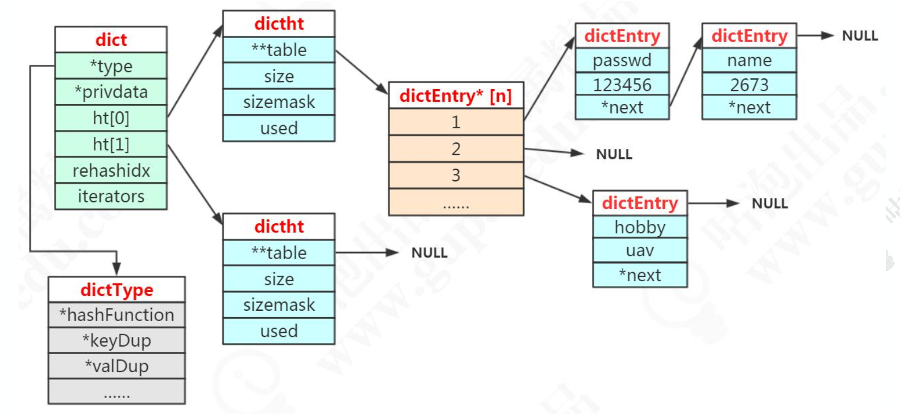
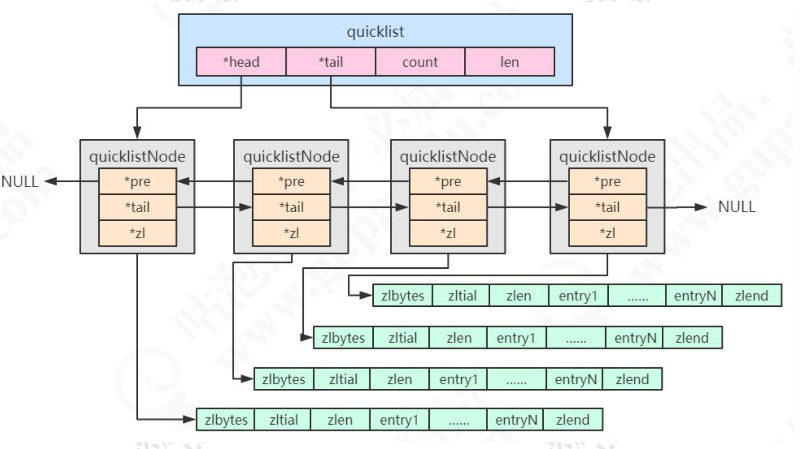
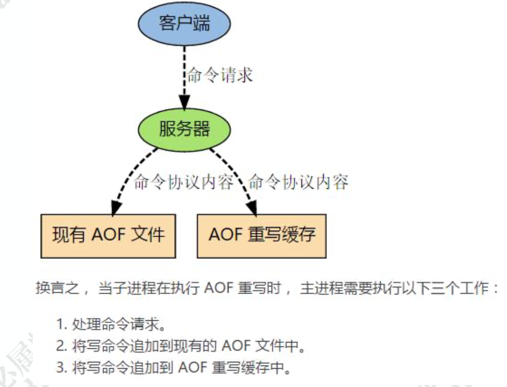
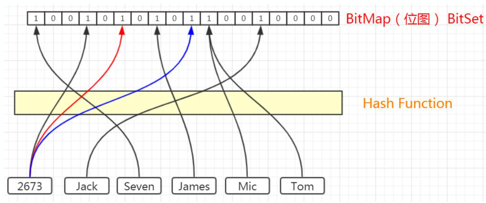

# Redis

为什么叫 REDIS 呢?它的全称是 REmote DIctionary Service，直接翻译过来是远 程字典服务。

Redis 的特性:
1)更丰富的数据类型

2)进程内与跨进程;单机与分布式 

3)功能丰富:持久化机制、过期策略 

4)支持多种编程语言

5)高可用，集群

默认有 16 个库(0-15)，可以在配置文件中修改，默认使用第一个 db0。


## Redis数据结构

Redis 是 KV 的数据库，它是通过 **hashtable** 实现的(我 们把这个叫做外层的哈希)。所以每个键值对都会有一个 **dictEntry**(源码位置:dict.h)， 里面指向了 key 和 value 的指针。**next 指向下一个 dictEntry**。

### redisObject

```c
typedef struct redisObject {
unsigned type:4; /* 对象的类型，包括:OBJ_STRING、OBJ_LIST、OBJ_HASH、OBJ_SET、OBJ_ZSET */ unsigned encoding:4; /* 具体的数据结构 */
unsigned lru:LRU_BITS; /* 24 位，对象最后一次被命令程序访问的时间，与内存回收有关 */
int refcount; /* 引用计数。当 refcount 为 0 的时候，表示该对象已经不被任何对象引用，则可以进行垃圾回收了
*/
void *ptr; /* 指向对象实际的数据结构 */
} robj;
```

```shell
127.0.0.1:6379> type k1
string
```


## 基本数据类型：

### 1）String

可以用来存储字符串、整数、浮点数。

key 是字符串，但是 Redis 没有直接使用 C 的字符数组，而是存储在自定义的 SDS 中。

value 既不是直接作为字符串存储，也不是直接存储在 SDS 中，而是存储在 redisObject 中。实际上五种常用的数据类型的任何一种，都是通过 redisObject 来存储 的。

字符串类型的内部编码有三种:
 1、int，存储 8 个字节的长整型(long，2^63-1)。
 2、embstr, 代表 embstr 格式的 SDS(Simple Dynamic String 简单动态字符串)，存储小于 44 个字节的字符串。
 3、raw，存储大于 44 个字节的字符串(3.2 版本之前是 39 字节)

#### SDS 的特点:

 1、不用担心内存溢出问题，如果需要会对 SDS 进行扩容。 2、获取字符串长度时间复杂度为 O(1)，因为定义了 len 属性。 3、通过“空间预分配”( sdsMakeRoomFor)和“惰性空间释放”，防止多

次重分配内存。
 4、判断是否结束的标志是 len 属性(它同样以'\0'结尾是因为这样就可以使用 C语言中函数库操作字符串的函数了)，可以包含'\0'。

#### embstr 和 raw 的区别?

embstr 的使用只分配一次内存空间(因为 RedisObject 和 SDS 是连续的)，而 raw 需要分配两次内存空间(分别为 RedisObject 和 SDS 分配空间)。

因此与 raw 相比，embstr 的好处在于创建时少分配一次空间，删除时少释放一次 空间，以及对象的所有数据连在一起，寻找方便。

而 embstr 的坏处也很明显，如果字符串的长度增加需要重新分配内存时，整个 RedisObject 和 SDS 都需要重新分配空间，因此 Redis 中的 embstr 实现为只读。

#### int 和 embstr 什么时候转化为 raw?

当 int 数据不再是整数，或大小超过了 long 的范围 (2^63-1=9223372036854775807)时，自动转化为embstr。

#### 明明没有超过阈值，为什么变成 raw 了?

对于 embstr，由于其实现是只读的，因此在对 embstr 对象进行修改时，都会先 转化为 raw 再进行修改。

因此，只要是修改 embstr 对象，修改后的对象一定是 raw 的，无论是否达到了 44 个字节。

#### 当长度小于阈值时，会还原吗?

关于 Redis 内部编码的转换，都符合以下规律:编码转换在 Redis 写入数据时完 成，且转换过程不可逆，只能从小内存编码向大内存编码转换(但是不包括重新 set)。

#### 位统计：

String 类型的 BITCOUNT(1.6.6 的 bitmap 数据结构介绍)。 字符是以 8 位二进制存储的。

因为 bit 非常节省空间(1 MB=8388608 bit)，可以用来做大数据量的统计。

```shell
127.0.0.1:6379> set k2 a
OK
127.0.0.1:6379> setbit k2 6 1
(integer) 0
127.0.0.1:6379> setbit k2 7 0
(integer) 1
127.0.0.1:6379> get k2
"b"
BITOP AND destkey key [key ...] ，对一个或多个 key 求逻辑并，并将结果保存到 destkey 。 
BITOP OR destkey key [key ...] ，对一个或多个 key 求逻辑或，并将结果保存到 destkey 。 
BITOP XOR destkey key [key ...] ，对一个或多个 key 求逻辑异或，并将结果保存到 destkey 。 
BITOP NOT destkey key ，对给定 key 求逻辑非，并将结果保存到 destkey 。
```

### 2）Hash

包含键值对的无序散列表。value 只能是字符串，不能嵌套其他类型。

edis 中每个 hash 可以存储 232 - 1 键值对（40多亿）。

同样是存储字符串，Hash 与 String 的主要区别?
 1、把所有相关的值聚集到一个 key 中，节省内存空间
 2、只使用一个 key，减少 key 冲突 

 3、当需要批量获取值的时候，只需要使用一个命令，减少内存/IO/CPU 的消耗

Hash 不适合的场景:
 1、Field 不能单独设置过期时间
 2、没有 bit 操作
 3、需要考虑数据量分布的问题(value 值非常大的时候，无法分布到多个节点)

```shell
27.0.0.1:6379> hset h1 f1 6
(integer) 1
127.0.0.1:6379> hset h1 f1 x1 f2 x2 f3 x3
(integer) 2
127.0.0.1:6379> hget h1 f1
"x1"
127.0.0.1:6379> hgetall h1
1) "f1"
2) "x1"
3) "f2"
4) "x2"
5) "f3"
6) "x3"
127.0.0.1:6379> hmget h1 f1 f2 f3
1) "x1"
2) "x2"
3) "x3"
127.0.0.1:6379> hkeys h1
1) "f1"
2) "f2"
3) "f3"
127.0.0.1:6379> hvals h1
1) "x1"
2) "x2"
3) "x3"
```

#### 数据结构：

Redis 的 Hash 本身也是一个 KV 的结构，类似于 Java 中的 HashMap。

外层的哈希(Redis KV 的实现)只用到了 hashtable。当存储 hash 数据类型时， 我们把它叫做**内层的哈希**。内层的哈希底层可以使用两种数据结构实现:

ziplist:OBJ_ENCODING_ZIPLIST(压缩列表)

 hashtable:OBJ_ENCODING_HT(哈希表)

```shell
127.0.0.1:6379> object encoding h1
"ziplist"
```

#### ziplist：

当 hash 对象同时满足以下两个条件的时候，使用 ziplist 编码:

 1)所有的键值对的健和值的字符串长度都小于等于 64byte(一个英文字母一个字节);
 2)哈希对象保存的键值对数量小于 512 个。

ziplist 是一个经过**特殊编码**的**双向链表**，它不存储指向上一个链表节点和指向下一 个链表节点的指针，而是存储**上一个节点长度和当前节点长度**，通过牺牲部分读写性能， 来换取高效的内存空间利用率，是一种时间换空间的思想。只用在字段个数少，字段值 小的场景里面。

```c
typedef struct zlentry {
unsigned int prevrawlensize; /* 上一个链表节点占用的长度 */
unsigned int prevrawlen; /* 存储上一个链表节点的长度数值所需要的字节数 */
  unsigned int lensize; /* 存储当前链表节点长度数值所需要的字节数 */
  unsigned int len; /* 当前链表节点占用的长度 */
  unsigned int headersize; /* 当前链表节点的头部大小(prevrawlensize + lensize)，即非数据域的大小 */
  unsigned char encoding;  /* 编码方式 */
  unsigned char *p;/* 压缩链表以字符串的形式保存，该指针指向当前节点起始位置 */
} zlentry;
```

#### hashtable(dict)：

hashtable 被称为字典(dictionary)，它是一个数组+链表的结构。

```c
typedef struct dictEntry {
void *key; /* key 关键字定义 */
union {
void *val; uint64_t u64; /* value 定义 */ int64_t s64; double d;
} v;
struct dictEntry *next; /* 指向下一个键值对节点 */
} dictEntry;

typedef struct dictht {
dictEntry **table; /* 哈希表数组 */
unsigned long size; /* 哈希表大小 */
unsigned long sizemask; /* 掩码大小，用于计算索引值。总是等于 size-1 */ unsigned long used; /* 已有节点数 */
} dictht;

typedef struct dict {
dictType *type; /* 字典类型 */
void *privdata; /* 私有数据 */
dictht ht[2]; /* 一个字典有两个哈希表 */
long rehashidx; /* rehash 索引 */
unsigned long iterators; /* 当前正在使用的迭代器数量 */
} dict;
```



注意:dictht 后面是 NULL 说明第二个 ht 还没用到。dictEntry*后面是 NULL 说明没有 hash 到这个地址。dictEntry 后面是 NULL 说明没有发生哈希冲突。

**问题:为什么要定义两个哈希表呢?ht[2]**

redis 的 hash 默认使用的是 ht[0]，ht[1]不会初始化和分配空间。

哈希表 dictht 是用链地址法来解决碰撞问题的。在这种情况下，哈希表的性能取决 于它的大小(size 属性)和它所保存的节点的数量(used 属性)之间的比率:

比率在 1:1 时(一个哈希表 ht 只存储一个节点 entry)，哈希表的性能最好; 如果节点数量比哈希表的大小要大很多的话(这个比例用 ratio 表示，5 表示平均

一个 ht 存储 5 个 entry)，那么哈希表就会退化成多个链表，哈希表本身的性能优势就不再存在。 在这种情况下需要扩容。Redis 里面的这种操作叫做 rehash。

rehash 的步骤:
 1、为字符 ht[1]哈希表分配空间，这个哈希表的空间大小取决于要执行的操作，以及 ht[0]当前包含的键值对的数量。扩展:ht[1]的大小为第一个大于等于 ht[0].used*2。
 2、将所有的 ht[0]上的节点 rehash 到 ht[1]上，重新计算 hash 值和索引，然后放

入指定的位置。
 3、当 ht[0]全部迁移到了 ht[1]之后，释放 ht[0]的空间，将 ht[1]设置为 ht[0]表，并创建新的 ht[1]，为下次 rehash 做准备。

### 3）List列表

存储有序的字符串(从左到右)，元素可以重复。可以充当队列和栈的角色。

个列表最多可以包含 232 - 1 个元素 (4294967295, 每个列表超过40亿个元素)。

```shell
127.0.0.1:6379> lpush q1 a
(integer) 1
127.0.0.1:6379> lpush q1 b c
(integer) 3
127.0.0.1:6379> rpush q1 d e
(integer) 5
127.0.0.1:6379> lpop q1
"c"
127.0.0.1:6379> rpop q1
"e"
127.0.0.1:6379> lindex q1 0
"b"
127.0.0.1:6379> lrange q1 0 -1
1) "b"
2) "a"
3) "d"
```

在早期的版本中，数据量较小时用 ziplist 存储，达到临界值时转换为 linkedlist 进 行存储，分别对应 OBJ_ENCODING_ZIPLIST 和 OBJ_ENCODING_LINKEDLIST 。3.2 版本之后，统一用 **quicklist** 来存储。quicklist 存储了一个双向链表，每个节点 都是一个 ziplist。

#### quicklist:

quicklist(快速列表)是 ziplist 和 linkedlist 的结合体。

```c
typedef struct quicklist {
quicklistNode *head; /* 指向双向列表的表头 */ 
  quicklistNode *tail; /* 指向双向列表的表尾 */
unsigned long count;/* 所有的 ziplist 中一共存了多少个元素 */
unsigned long len;/* 双向链表的长度，node 的数量 */
int fill : 16;/* fill factor for individual no */
unsigned int compress : 16; /* 压缩深度，0:不压缩; */
} quicklist;

typedef struct quicklistNode {
struct quicklistNode *prev; /* 前一个节点 */
struct quicklistNode *next; /* 后一个节点 */
  unsigned char *zl; /* 指向实际的 ziplist */
unsigned int sz; /* 当前 ziplist 占用多少字节 */
  unsignedintcount:16;/* 当前ziplist中存储了多少个元素，占16bit(下同)，最大65536个*/
  unsigned int encoding : 2; /* 是否采用了 LZF 压缩算法压缩节点，1:RAW 2:LZF */
    unsigned int container : 2; /* 2:ziplist，未来可能支持其他结构存储 */
    unsigned int recompress : 1; /* 当前 ziplist 是不是已经被解压出来作临时使用 */
    unsigned int attempted_compress : 1; /* 测试用 */
    unsigned int extra : 10; /* 预留给未来使用 */
} quicklistNode;
```



#### 消息队列：

List 提供了两个阻塞的弹出操作:BLPOP/BRPOP，可以设置超时时间。

BLPOP:BLPOP key1 timeout 移出并获取列表的第一个元素， 如果列表没有元素 会阻塞列表直到等待超时或发现可弹出元素为止。

BRPOP:BRPOP key1 timeout 移出并获取列表的最后一个元素， 如果列表没有元 素会阻塞列表直到等待超时或发现可弹出元素为止。

队列:先进先出:rpush blpop，左头右尾，右边进入队列，左边出队列。

 栈:先进后出:rpush brpop

### 4）Set集合

String 类型的无序集合，最大存储数量 2^32-1(40 亿左右)。

```shell
127.0.0.1:6379> sadd myset a b c d
(integer) 4
127.0.0.1:6379> smembers myset
1) "d"
2) "a"
3) "c"
4) "b"
127.0.0.1:6379> scard myset
(integer) 4
127.0.0.1:6379> srandmember myset
"c"
127.0.0.1:6379> spop myset
"b"
127.0.0.1:6379> simember myset a
(error) ERR unknown command 'simember'
127.0.0.1:6379> sismember myset a
(integer) 1
```

Redis 用 intset 或 hashtable 存储 set。如果元素都是整数类型，就用 inset 存储。 如果不是整数类型，就用 hashtable(数组+链表的存来储结构)。

key 就是元素的值，value 为 null。 如果元素个数超过 512 个，也会用 hashtable 存储。

#### 应用场景：

点赞、签到、打卡，商品标签

点赞了这条微博:sadd like:t1001 u3001 

取消点赞:srem like:t1001 u3001 

是否点赞:sismember like:t1001 u3001 

点赞的所有用户:smembers like:t1001 

点赞数:scard like:t1001

sadd tags:i5001 画面清晰细腻

 sadd tags:i5001 真彩清晰显示屏 

sadd tags:i5001 流畅至极

获取差集：sdiff set1 set2
获取交集(intersection )： sinter set1 set2
获取并集：sunion set1 set2

### 5）ZSet有序集合

sorted set，有序的 set，每个元素有个 score。 score 相同时，按照 key 的 ASCII 码排序。

不同的是每个元素都会关联一个 **double 类型的分数**。redis 正是通过分数来为集合中的成员进行从小到大的排序。

集合中最大的成员数为 232 - 1 (4294967295, 每个集合可存储40多亿个成员)。

```shell
127.0.0.1:6379> zadd myzset 10 java 20 php 30 ruby 40 cpp
(integer) 4
127.0.0.1:6379> zrange myzset 0 -1 withscores
1) "java"
2) "10"
3) "php"
4) "20"
5) "ruby"
6) "30"
7) "cpp"
8) "40"
127.0.0.1:6379> zrevrange myzset 0 -1 withscores
1) "cpp"
2) "40"
3) "ruby"
4) "30"
5) "php"
6) "20"
7) "java"
8) "10"
127.0.0.1:6379> zrangebyscore myzset 20 30
1) "php"
2) "ruby"
127.0.0.1:6379> zrem myzset php cpp
(integer) 2
127.0.0.1:6379> zcard myzset
(integer) 2
127.0.0.1:6379> zincrby myzset  3 java
"13"
```

同时满足以下条件时使用 ziplist 编码:

1) 元素数量小于 128 个
2) 所有 member 的长度都小于 64 字节

在 ziplist 的内部，按照 score 排序递增来存储。插入的时候要移动之后的数据。

超过阈值之后，使用 skiplist+dict 存储。

#### skiplist跳表：

为什么不用 AVL 树或者红黑树?因为 skiplist 更加简洁。

#### 应用：

排行榜

id 为 6001 的新闻点击数加 1:zincrby hotNews:20190926 1 n6001 

获取今天点击最多的 15 条:zrevrange hotNews:20190926 0 15 withscores

### 6）其他数据结构

#### 1）BitMap：

Bitmaps 是在字符串类型上面定义的位操作。一个字节由 8 个二进制位组成。

setbit key offset value

`offset` 参数必须大于或等于 `0` ，小于 2^32 (bit 映射被限制在 512 MB 之内)。

因为 Redis 字符串的大小被限制在 512 兆(megabytes)以内， 所以用户能够使用的最大偏移量为 2^29-1(536870911) ， 如果你需要使用比这更大的空间， 请使用多个 `key。`

value：0/1

getbit key offset：检测对应位有没有人

bitcount key [start] [end]：被设置为 `1` 的位的数量

应用场景:用户访问统计，在线用户统计，用户签到

##### 在线用户统计：

```shell
127.0.0.1:6379> setbit ucount 64634 1
(integer) 0
127.0.0.1:6379> setbit ucount 98302 1
(integer) 0
127.0.0.1:6379> getbit ucount 64634
(integer) 1
127.0.0.1:6379> bitcount ucount 0 -1
(integer) 2
```

注：每个用户一登录就设置对应的ID 位为0，通过bitcount统计在线用户数量。

语法：bitop operation destkey key [key ...]

operation 可以是 AND 、 OR 、 NOT 、 XOR 这四种操作中的任意一种：

BITOP AND destkey key [key ...] ，对一个或多个 key 求逻辑并，并将结果保存到 destkey 。
BITOP OR destkey key [key ...] ，对一个或多个 key 求逻辑或，并将结果保存到 destkey 。
BITOP XOR destkey key [key ...] ，对一个或多个 key 求逻辑异或，并将结果保存到 destkey 。
BITOP NOT destkey key ，对给定 key 求逻辑非，并将结果保存到 destkey 。
除了 NOT 操作之外，其他操作都可以接受一个或多个 key 作为输入。　

##### 用户签到：

```php
$todayTime = strtotime($todayDate);
$offset = floor(($todayTime - $startTime) / 86400);

echo "今天是第{$offset}天" . PHP_EOL;

//签到
//一年一个用户会占用多少空间呢？大约365/8=45.625个字节，好小，有木有被惊呆？
$redis->setBit($cacheKey, $offset, 1);

//查询签到情况
$bitStatus = $redis->getBit($cacheKey, $offset);
echo 1 == $bitStatus ? '今天已经签到啦' : '还没有签到呢';
echo PHP_EOL;

//计算总签到次数
echo $redis->bitCount($cacheKey) . PHP_EOL;
```

#### 2）**Hyperloglogs**：

Hyperloglogs:提供了一种**不太准确的基数统计方法**，比如统计网站的 UV，存在 一定的误差。Redis HyperLogLog 是用来做基数统计的算法，HyperLogLog 的优点是，在输入元素的数量或者体积非常非常大时，计算基数所需的空间总是固定 的、并且是很小的。

基数就是指一个集合中不同值的数目，比如[a,b,c,d]的基数就是4，[a,b,c,d,a]的基数还是4，因为a重复了一个，不算。基数也可以称之为Distinct Value，简称DV。下文中可能有时候称呼为基数，有时候称之为DV，但都是同一个意思。HyperLogLog算法就是用来计算基数的。

1）HyperLogLog是一种算法，并非redis独有
2）目的是做基数统计，故不是集合，不会保存元数据，只记录数量而不是数值。
3）耗空间极小，支持输入非常体积的数据量
4）核心是基数估算算法，主要表现为计算时内存的使用和数据合并的处理。最终数值存在一定误差
5）redis中每个hyperloglog key占用了12K的内存用于标记基数（官方文档）
6）pfadd命令并不会一次性分配12k内存，而是随着基数的增加而逐渐增加内存分配；而pfmerge操作则会将7）sourcekey合并后存储在12k大小的key中，这由hyperloglog合并操作的原理（两个hyperloglog合并时需要单独比较每个桶的值）可以很容易理解。
误差说明：基数估计的结果是一个带有 0.81% 标准错误（standard error）的近似值。是可接受的范围
8）Redis 对 HyperLogLog 的存储进行了优化，在计数比较小时，它的存储空间采用稀疏矩阵存储，空间占用很小，仅仅在计数慢慢变大，稀疏矩阵占用空间渐渐超过了阈值时才会一次性转变成稠密矩阵，才会占用 12k 的空间

```shell
redis 127.0.0.1:6379> PFADD mykey "redis"  
1) (integer) 1  
redis 127.0.0.1:6379> PFADD mykey "mongodb"  
1) (integer) 1  
redis 127.0.0.1:6379> PFADD mykey "mysql"  
1) (integer) 1  
redis 127.0.0.1:6379> PFCOUNT mykey  
(integer) 3
```

https://www.jianshu.com/p/55defda6dcd2

#### 3）**Streams**：

5.0 推出的数据类型。支持多播的可持久化的消息队列，用于实现发布订阅功能，借 鉴了 kafka 的设计。

#### 4）GEO

Redis 的 GEO 是 3.2 版本的新特性。这个功能可以将用户给定的地理位置信息储存起来， 并对这些信息进行操作。

## Redis事务

我们知道 Redis 的单个命令是原子性的(比如 get set mget mset)，如果涉及到 多个命令的时候，需要把多个命令作为一个不可分割的处理序列，就需要用到事务。

例如我们之前说的用 setnx 实现分布式锁，我们先 set，然后设置对 key 设置 expire， 防止 del 发生异常的时候锁不会被释放，业务处理完了以后再 del，这三个动作我们就希 望它们作为一组命令执行。

Redis 的事务有两个特点: 1、按进入队列的顺序执行。 2、不会受到其他客户端的请求的影响。

Redis 的事务涉及到四个命令:**multi(开启事务)，exec(执行事务)，discard (取消事务)，watch(监视)**

通过 multi 的命令开启事务。事务不能嵌套，多个 multi 命令效果一样。

multi 执行后，客户端可以继续向服务器发送任意多条命令， 这些命令不会立即被 执行， 而是被放到一个队列中， 当 exec 命令被调用时， 所有队列中的命令才会被执 行。

通过 exec 的命令执行事务。如果没有执行 exec，所有的命令都不会被执行。 如果中途不想执行事务了，怎么办?可以调用 discard 可以清空事务队列，放弃执行。

### Watch：

在 Redis 中还提供了一个 watch 命令。

它可以为 Redis 事务提供 CAS 乐观锁行为(Check and Set / Compare and Swap)，也就是多个线程更新变量的时候，会跟原值做比较，只有它没有被其他线程修 改的情况下，才更新成新的值。

我们可以用 watch 监视一个或者多个 key，如果开启事务之后，至少有一个被监视 key 键在 exec 执行之前被修改了， 那么整个事务都会被取消(key 提前过期除外)。可 以用 unwatch 取消

## Lua脚本：

使用 Lua 脚本来执行 Redis 命令的好处:

1、一次发送多个命令，减少网络开销。
 2、Redis 会将整个脚本作为一个整体执行，不会被其他请求打断，保持原子性。 

3、对于复杂的组合命令，我们可以放在文件中，可以实现程序之间的命令集复用。

为了防止某个脚本执行时间过长导致 Redis 无法提供服务，Redis 提供了 lua-time-limit 参数限制脚本的最长运行时间，默认为 5 秒钟。

lua-time-limit 5000(redis.conf 配置文件中)

## Redis为什么这么快

### 内存：

KV 结构的内存数据库，时间复杂度 O(1)。

### 单线程：

单线程有什么好处呢?
 1、没有创建线程、销毁线程带来的消耗 

2、避免了上线文切换导致的 CPU 消耗

 3、避免了线程之间带来的竞争问题，例如加锁释放锁死锁等等

CPU 不是 redis 的瓶颈。Redis 的瓶颈最有可能是机器内存 或者网络带宽。既然单线程容易实现，而且 CPU 不会成为瓶颈，那就顺理成章地采用单 线程的方案了。

### 异步非阻塞：

异步非阻塞 I/O，多路复用处理并发连接。

多路指的是多个 TCP 连接(Socket 或 Channel)。 复用指的是复用一个或多个线程。

多路复用有很多的实现，以 select 为例，当用户进程调用了多路复用器，进程会被 阻塞。内核会监视多路复用器负责的所有 socket，当任何一个 socket 的数据准备好了， 多路复用器就会返回。这时候用户进程再调用read 操作，把数据从内核缓冲区拷贝到用 户空间。

I/O 多路复用的特点是通过一种机制一个进程能同时等待多个文件描述符， 而这些文件描述符(套接字描述符)其中的任意一个进入读就绪(readable)状态，select() 函数就可以返回。

Redis 的多路复用， 提供了 select, epoll, evport, kqueue 几种选择，在编译的时 候来选择一种

## 过期策略：

Reids 所有的数据都是存储在内存中的，在某些情况下需要对占用的内存空间进行回 收。内存回收主要分为两类，一类是 key 过期，一类是内存使用达到上限(max_memory) 触发内存淘汰。

### 定时过期-主动淘汰

每个设置过期时间的 key 都需要创建一个定时器，到过期时间就会立即清除。该策 略可以立即清除过期的数据，对内存很友好;但是会占用大量的 CPU 资源去处理过期的 数据，从而影响缓存的响应时间和吞吐量。

### 惰性过期

只有当访问一个 key 时，才会判断该 key 是否已过期，过期则清除。该策略可以最 大化地节省 CPU 资源，却对内存非常不友好。极端情况可能出现大量的过期 key 没有再 次被访问，从而不会被清除，占用大量内存。

每隔一定的时间，会扫描一定数量的数据库的 expires 字典中一定数量的 key，并清 除其中已过期的 key。该策略是前两者的一个折中方案。通过调整定时扫描的时间间隔和 每次扫描的限定耗时，可以在不同情况下使得 CPU 和内存资源达到最优的平衡效果。

### Redis LRU

Redis LRU 对传统的 LRU 算法进行了改良，通过随机采样来调整算法的精度。 如果淘汰策略是 LRU，则根据配置的采样值 maxmemory_samples(默认是 5 个),

随机从数据库中选择 m 个 key, 淘汰其中热度最低的 key 对应的缓存数据。所以采样参 数m配置的数值越大, 就越能精确的查找到待淘汰的缓存数据,但是也消耗更多的CPU计 算,执行效率降低。

Redis 中所有对象结构都有一个 lru 字段, 且使用了 unsigned 的低 24 位，这个字段 用来记录对象的热度。对象被创建时会记录 lru 值。在被访问的时候也会更新 lru 的值。 但是不是获取系统当前的时间戳，而是设置为全局变量 server.lruclock 的值。

## 持久化

### RDB快照

RDB 是 Redis 默认的持久化方案。当满足一定条件的时候，会把当前内存中的数 据写入磁盘，生成一个快照文件 dump.rdb。Redis 重启会通过加载 dump.rdb 文件恢 复数据。

```ini
save 900 1 # 900 秒内至少有一个 key 被修改(包括添加) 
save 300 10 # 400 秒内至少有 10 个 key 被修改
save 60 10000 # 60 秒内至少有 10000 个 key 被修改

# 文件名称
dbfilename dump.rdb
# 是否是LZF压缩rdb文件 
rdbcompression yes
# 开启数据校验 
rdbchecksum yes
```

RDB 还有两种触发方式:
 b)shutdown 触发，保证服务器正常关闭。
 c)flushall，RDB 文件是空的，没什么意义(删掉 dump.rdb 演示一下)。

#### 手动触发：

save：

save 在生成快照的时候会阻塞当前 Redis 服务器， Redis 不能处理其他命令。如果 内存中的数据比较多，会造成 Redis 长时间的阻塞。生产环境不建议使用这个命令。

bgsave：

执行 bgsave 时，Redis 会在后台异步进行快照操作，快照同时还可以响应客户端请 求。

具体操作是 Redis 进程执行 fork 操作创建子进程(copy-on-write)，RDB 持久化 过程由子进程负责，完成后自动结束。它不会记录 fork 之后后续的命令。阻塞只发生在 fork 阶段，一般时间很短。

一、优势
 1.RDB 是一个非常紧凑(compact)的文件，它保存了 redis 在某个时间点上的数据集。这种文件非常适合用于进行备份和灾难恢复。
 2.生成 RDB 文件的时候，redis 主进程会 fork()一个子进程来处理所有保存工作，主进程不需要进行任何磁盘 IO 操作。
 3.RDB 在恢复大数据集时的速度比 AOF 的恢复速度要快。
 二、劣势
 1、RDB 方式数据没办法做到实时持久化/秒级持久化。因为 bgsave 每次运行都要执行 fork 操作创建子进程，频繁执行成本过高。

 2、在一定间隔时间做一次备份，所以如果 redis 意外 down 掉的话，就会丢失最后一次快照之后的所有修改(数据有丢失)。 如果数据相对来说比较重要，希望将损失降到最小，则可以使用 AOF 方式进行持久化。

### AOF：

Append Only File
 AOF:Redis 默认不开启。AOF 采用日志的形式来记录每个写操作，并**追加**到文件中。开启后，执行更改 Redis 数据的命令时，就会把命令写入到 AOF 文件中。

Redis 重启时会根据日志文件的内容把写指令从前到后执行一次以完成数据的恢复工作。

```ini
# 开关
appendonly no
# 文件名
appendfilename "appendonly.aof"
```

由于操作系统的缓存机制，AOF 数据并没有真正地写入硬盘，而是进入了系统的硬盘缓存。什么时候把缓冲区的内容写入到 AOF 文件?

AOF 持久化策略(硬盘缓存到磁盘)，**默认 everysec**
**no**表示不执行fsync，由操作系统保证数据同步到磁盘，速度最快，但是不太安全; 

**always**表示每次写入都执行fsync，以保证数据同步到磁盘，效率很低;

**everysec** 表示每秒执行一次 fsync，可能会导致丢失这 1s 数据。**通常选择 everysec** ，兼顾安全性和效率。

文件越来越大，怎么办?

为了解决这个问题，Redis 新增了重写机制，当 AOF 文件的大小超过所设定的阈值 时，Redis 就会启动 AOF 文件的**内容压缩，只保留可以恢复数据的最小指令集**。

可以使用命令 **bgrewriteaof** 来重写。

AOF 文件重写并不是对原文件进行重新整理，而是直接读取服务器现有的键值对， 然后用一条命令去代替之前记录这个键值对的多条命令，生成一个新的文件后去替换原 来的 AOF 文件。

```ini
# 重写触发机制 
auto-aof-rewrite-percentage 100 
auto-aof-rewrite-min-size 64mb
```



优点:

1、AOF 持久化的方法提供了多种的同步频率，即使使用默认的同步频率每秒同步 一次，Redis 最多也就丢失 1 秒的数据而已。

缺点:

1、对于具有相同数据的的 Redis，AOF 文件通常会比 RDF 文件体积更大(RDB 存的是数据快照)。

2、虽然 AOF 提供了多种同步的频率，默认情况下，每秒同步一次的频率也具有较 高的性能。在高并发的情况下，RDB 比 AOF 具好更好的性能保证。

## 集群：

### 主从复制：

slaveof 192.168.8.203 6379

从节点不能写入数据(只读)，只能从 master 节点同步数据。get 成功，set 失败

1、slave node 启动时(执行 slaveof 命令)，会在自己本地保存 master node 的 信息，包括 master node 的 host 和 ip。

2、slave node 内部有个定时任务 replicationCron(源码 replication.c)，每隔 1 秒钟检查是否有新的 master node 要连接和复制，如果发现，就跟 master node 建立 socket 网络连接，如果连接成功，从节点为该 socket 建立一个专门处理复制工作的文件 事件处理器，负责后续的复制工作，如接收 RDB 文件、接收命令传播等。

当从节点变成了主节点的一个客户端之后，会给主节点发送 ping 请求。

3、master node 第一次执行全量复制，通过 bgsave 命令在本地生成一份 RDB 快 照，将 RDB 快照文件发给 slave node(如果超时会重连，可以调大 repl-timeout 的值)。 slave node 首先清除自己的旧数据，然后用 RDB 文件加载数据。

redis> info replication

通过 master_repl_offset 记录的偏移量

#### 主从的不足点：

1、RDB 文件过大的情况下，同步非常耗时。

2、在一主一从或者一主多从的情况下，如果主服务器挂了，对外提供的服务就不可 用了，单点问题没有得到解决。如果每次都是手动把之前的从服务器切换成主服务器， 这个比较费时费力，还会造成一定时间的服务不可用。

### Sentinel哨兵：

创建一台监控服务器来监控所有 Redis 服务节点的状态，比如，master 节点超过一 定时间没有给监控服务器发送心跳报文，就把 master 标记为下线，然后把某一个 slave 变成 master。应用每一次都是从这个监控服务器拿到 master 的地址。

问题是:如果监控服务器本身出问题了怎么办?那我们就拿不到 master 的地址了， 应用也没有办法访问。

那我们再创建一个监控服务器，来监控监控服务器......似乎陷入死循环了，这个问题 怎么解决?

为了保证监控服务器的可用性，我们会对 Sentinel 做集群的部署。**Sentinel 既监控 所有的 Redis 服务，Sentinel 之间也相互监控**。

Redis 的 Sentinel 就是这种思路:**通过运行监控服务器来保证服务的可用性**。

启动一个或者多个 Sentinel 的服务(通过 src/redis-sentinel)，它本质上只 **是一个运行在特殊模式之下的 Redis**，Sentinel 通过 info 命令得到被监听 Redis 机器的 master，slave 等信息。

Sentinel 默认以每秒钟 1 次的频率向 Redis 服务节点发送 PING 命令。如果在 down-after-milliseconds 内都没有收到有效回复，Sentinel 会将该服务器标记为下线


1、选出 Sentinel Leader 之后，由 Sentinel Leader 向某个节点发送 slaveof no one 命令，让它成为独立节点。

2、然后向其他节点发送 slaveof x.x.x.x xxxx(本机服务)，让它们成为这个节点的 子节点，故障转移完成。

#### Ratf算法：

Raft 是一个共识算法(consensus algorithm)。比如比特币之类的加密货币，就 需要共识算法。Spring Cloud 的注册中心解决方案 Consul 也用到了 Raft 协议。

Raft 的核心思想:**先到先得，少数服从多数**。

Sentinle 的 Raft 算法和 Raft 论文略有不同。
 1、master 客观下线触发选举，而不是过了 election timeout 时间开始选举。

 2、Leader 并不会把自己成为 Leader 的消息发给其他 Sentinel。其他 Sentinel 等

待 Leader 从 slave 选出 master 后，检测到新的 master 正常工作后，就会去掉客观下 线的标识，从而不需要进入故障转移流程。

3、选出 Sentinel Leader 之后，由 Sentinel Leader 向某个节点发送 slaveof no one 命令，让它成为独立节点。

4、然后向其他节点发送 slaveof x.x.x.x xxxx(本机服务)，让它们成为这个节点的 子节点，故障转移完成。


关于从节点选举，一共有四个因素影响选举的结果，分别是**断开连接时长、优先级 排序、复制数量、进程 id**。

如果与哨兵连接断开的比较久，超过了某个阈值，就直接失去了选举权。如果拥有 选举权，那就看谁的优先级高，这个在配置文件里可以设置(replica-priority 100)， 数值越小优先级越高。如果优先级相同，就看谁从 master 中复制的数据最多(复制偏移量最大)，选最多 的那个，如果复制数量也相同，就选择进程 id 最小的那个。

无论是 Jedis 还是 Spring Boot(2.x 版本默认是 Lettuce)，都**只需要配置全部哨 兵的地址，由哨兵返回当前的 master 节点地址**。

#### 不足点：

主从切换的过程中会丢失数据，因为只有一个 master。 **只能单点写，没有解决水平扩容的问题**。 如果数据量非常大，这个时候我们需要多个 master-slave 的 group，把数据分布到不同的 group 中。

理解为**哨兵模式只是解决了主从复制的自动恢复问题**。

### 分布式方案：

#### 客户端实现：

第一种是在客户端实现相关的逻 辑，例如用取模或者一致性哈希对 key 进行分片，查询和修改都先判断 key 的路由。

注：Jedis 客户端提供了 Redis Sharding 的方案，并且支持连接池。

#### 代理模式：

第二种是把做分片处理的逻辑抽取出来，运行一个独立的代理服务，客户端连接到 这个代理服务，代理服务做请求的转发。

注：典型的代理分区方案有 Twitter 开源的 Twemproxy 和国内的豌豆荚开源的 Codis。

Codis 把所有的 key 分成了 N 个槽(例如 1024)，每个槽对应一个分组， 一个分组对应于一个或者一组 Redis 实例。Codis 对 key 进行 CRC32 运算，得到一个 32 位的数字，然后模以 N(槽的个数)，得到余数，这个就是 key 对应的槽，槽后面就 是 Redis 的实例

#### 集群模式Redis Cluster：

第三种就是基于服务端实现。

Redis Cluster 是在 Redis 3.0 的版本正式推出的，用来解决分布式的需求，同时也 可以实现高可用。**跟 Codis 不一样，它是去中心化的，客户端可以连接到任意一个可用 节点**。

数据分片有几个关键的问题需要解决:

 1、数据怎么相对均匀地分片 

2、客户端怎么访问到相应的节点和数据 

3、重新分片的过程，怎么保证正常服务

Redis Cluster 可以看成是由多个 Redis 实例组成的数据集合。客户端不需要关注数 据的子集到底存储在哪个节点，只需要关注这个集合整体。

##### 一致性哈希的原理:

把所有的哈希值空间组织成一个虚拟的圆环(哈希环)，整个空间按顺时针方向组 织。因为是环形空间，0 和 2^32-1 是重叠的。

但是这样的一致性哈希算法有一个缺点，因为节点不一定是均匀地分布的，特别是 在节点数比较少的情况下，所以数据不能得到均匀分布。解决这个问题的办法是**引入虚 拟节点(Virtual Node)**。

##### 虚拟槽：

Redis 既没有用哈希取模，也没有用一致性哈希，而是用**虚拟槽**来实现的。

Redis 创建了 16384 个槽(slot)，每个节点负责一定区间的 slot。比如 Node1 负 责 0-5460，Node2 负责 5461-10922，Node3 负责 10923-16383。

Redis 的每个 master 节点维护一个 **16384 位(2048bytes=2KB)**的位序列，比如:

序列的第 0 位是 1，就代表第一个 slot 是它负责;序列的第 1 位是 0，代表第二个 slot 不归它负责。

对象分布到 Redis 节点上时，对 key 用 CRC16 算法计算再%16384，得到一个 slot 的值，数据落到负责这个 slot 的 Redis 节点上。

注意:key 与 slot 的关系是永远不会变的，会变的只有 slot 和 Redis 节点的关系。

理解就是用2KB的一个bit位标识自己复制的位，0/1 1表示负责


**怎么让相关的数据落到同一个节点上?**即如果2个相同类型的数据，2个key想落到同一个redis上

在 key 里面加入**{hash tag}**即可。Redis 在计算槽编号的时候只会获取{}之间的字符 串进行槽编号计算，这样由于上面两个不同的键，{}里面的字符串是相同的，因此他们可 以被计算出相同的槽

127.0.0.1:7293> set a{qs}a 1 OK
127.0.0.1:7293> set a{qs}b 1 OK

127.0.0.1:7293> set a{qs}c 1  OK

**客户端连接到哪一台服务器?访问的数据不在当前节点上，怎么办?**

比如在 7291 端口的 Redis 的 redis-cli 客户端操作:

127.0.0.1:7291> set qs 1
 (error) MOVED 13724 127.0.0.1:7293

服务端返回 MOVED，也就是根据 key 计算出来的 slot 不归 7191 端口管理，而是 归 7293 端口管理，服务端返回 MOVED 告诉客户端去 7293 端口操作。

这个时候更换端口，用 redis-cli –p 7293 操作，才会返回 OK。或者用./redis-cli -c -p port 的命令(c 代表 cluster)。**这样客户端需要连接两次**。

Jedis 等客户端会在本地维护一份 slot——node 的映射关系，大部分时候不需要重 定向，所以叫做 smart jedis(需要客户端支持)。

##### 新增节点数据迁移：

因为 key 和 slot 的关系是永远不会变的，当新增了节点的时候，需要把原有的 slot 分配给新的节点负责，并且把相关的数据迁移过来。

新增的节点没有哈希槽，不能分布数据，在原来的任意一个节点上执行:

redis-cli --cluster reshard 127.0.0.1:7291
 输入需要分配的哈希槽的数量(比如 500)，和哈希槽的来源节点(可以输入 all 或者 id)。

Redis Cluster 既**能够实现主从的角色分配，又能够实现主从切换**，**相当于集成了 Replication 和 Sentinal 的功能**。

##### 优势

 \1. 无中心架构。
 \2. 数据按照 slot 存储分布在多个节点，节点间数据共享，可动态调整数据分布。
 \3. 可扩展性，可线性扩展到 1000 个节点(官方推荐不超过 1000 个)，节点可动态添加或删除。
 \4. 高可用性，部分节点不可用时，集群仍可用。通过增加 Slave 做 standby 数据副本，能够实现故障自动 failover，节点之间通过 gossip 协议交换状态信息，用投票机制 完成 Slave 到 Master 的角色提升。

\5. 降低运维成本，提高系统的扩展性和可用性。

##### 不足

\1. Client 实现复杂，驱动要求实现 Smart Client，缓存 slots mapping 信息并及时 更新，提高了开发难度，客户端的不成熟影响业务的稳定性。

\2. 节点会因为某些原因发生阻塞(阻塞时间大于 clutser-node-timeout)，被判断 下线，这种 failover 是没有必要的。

\3. 数据通过异步复制，不保证数据的强一致性。

\4. 多个业务使用同一套集群时，无法根据统计区分冷热数据，资源隔离性较差，容易出现相互影响的情况。

## Redis客户端

### Jedis:

Jedis 有 4 种工作模式:单节点、分片、哨兵、集群。

3 种请求模式:Client、Pipeline、事务。

Client 模式就是客户端发送一个命令，阻 塞等待服务端执行，然后读取 返回结果。

Pipeline 模式是一次性发送多个命令，最后一 次取回所有的返回结果，这种模式通过减少网络的往返时间和 io 读写次数，大幅度提高 通信性能。

第三种是事务模式。Transaction 模式即开启 Redis 的事务管理，事务模式开 启后，所有的命令(除了 exec，discard，multi 和 watch)到达服务端以后不会立即执 行，会进入一个等待队列。

### Luttece:

与 Jedis 相比，Lettuce 则完全克服了其线程不安全的缺点:Lettuce 是一个可伸缩 的线程安全的 Redis 客户端，支持同步、异步和响应式模式(Reactive)。多个线程可 以共享一个连接实例，而不必担心多线程并发问题。

它基于 Netty 框架构建，支持 Redis 的高级功能，如 Pipeline、发布订阅，事务、 Sentinel，集群，支持连接池。

### Redisson：

Redisson是一个在Redis的**基础上实现的Java驻内存数据网格**（In-Memory Data Grid）。它不仅提供了一系列的分布式的Java常用对象，还提供了许多分布式服务。其中包括(`BitSet`, `Set`, `Multimap`, `SortedSet`, `Map`, `List`, `Queue`, `BlockingQueue`, `Deque`, `BlockingDeque`, `Semaphore`, `Lock`, `AtomicLong`, `CountDownLatch`, `Publish / Subscribe`, `Bloom filter`, `Remote service`, `Spring cache`, `Executor service`, `Live Object service`, `Scheduler service`) Redisson提供了使用Redis的最简单和最便捷的方法。Redisson的宗旨是促进使用者对Redis的关注分离（Separation of Concern），从而让使用者能够将精力更集中地放在处理业务逻辑上。

基于 Netty 实现，采用非阻塞 IO，性能高

支持异步请求
 支持连接池、pipeline、LUA Scripting、Redis Sentinel、Redis Cluster 不支持事务，官方建议以 LUA Scripting 代替事务 主从、哨兵、集群都支持。Spring 也可以配置和注入 RedissonClient。

在 Redisson 里面提供了更加简单的分布式锁的实现。

Redisson 跟 Jedis 定位不同，它不是一个单纯的 Redis 客户端，而是基于 Redis 实 现的分布式的服务，如果有需要用到一些分布式的数据结构，比如我们还可以基于 **Redisson 的分布式队列实现分布式事务**，就可以引入 Redisson 的依赖实现。

https://yq.aliyun.com/users/7cqhdxtuiehao

## 缓存雪崩：

1)加互斥锁或者使用队列，针对同一个 key 只允许一个线程到数据库查询 

2)缓存定时预先更新，避免同时失效

3)通过加随机数，使 key 在不同的时间过期

4)缓存永不过期

## 缓存穿透：

(1)缓存空数据

 (2)缓存特殊字符串，比如&&

### 布隆过滤器：



是不是位图容量越大越好呢?不管存多少个元素，都创建一个几万亿大小的位图， 可以吗?当然不行，因为越大的位图容量，意味着越多的内存消耗，所以我们要创建一 个合适大小的位图容量。

除了扩大位图容量，我们还有什么降低哈希碰撞概率的方法呢?

如果**两个元素经过一次哈希计算，得到的相同下标的概率比较高，我可以不可以计 算多次呢? 原来我只用一个哈希函数，现在我对于每一个要存储的元素都用多个哈希函 数计算，这样每次计算出来的下标都相同的概率就小得多了**。

从元素的角度来说: 

3、如果元素实际存在，布隆过滤器一定判断存在 

4、如果元素实际不存在，布隆过滤器可能判断存在

注：com.google.guava

## Redis数据淘汰策略

### volatile-lru：

从已经设置过期时间的数据集中挑选最少使用的数据淘汰。

### volatile-ttl：

从已经设置过期时间的数据集中挑选将要过期的数据淘汰

### Volatile-random：

从已经设置过期时间的数据集中随机挑选

### Allkeys-lru：

当内存不足以容纳重新写入数据时，在键空间中，移除最近很少使用的的key.

### Allkeys-random:

当内存不足以容纳重新写入数据时，在键空间中，随机移除.

### no-eviction：

当内存不足以容纳重新写入数据时,新写入直接失败。

### Volatile-lfu：

从已经设置过期时间的数据集中挑选最不经常用的数据淘汰

### Allkeys-lfu：

当内存不足以容纳重新写入数据时，在键空间中，移除最不经常用的数据淘汰

## 缓存不一致解决方案

| 操作顺序               | 是否有并发请求 | 潜在问题                                     | 现象                                                     | 应对方案                                       |
| ---------------------- | -------------- | -------------------------------------------- | -------------------------------------------------------- | ---------------------------------------------- |
| 先删缓存，再更新数据库 | 无             | 缓存删除成功，但是数据库更新失败             | 应用从数据库读取到旧数据                                 | 重试数据库更新                                 |
| 先删缓存，再更新数据库 | 有             | 缓存删除成功，数据尚未更新，有并发读请求     | 并发读取到旧值，并更新到缓存，导致后续缓存读请求都是旧值 | 延迟双删除，先删除，再更新数据，在延迟删除缓存 |
| 先更新数据库再删除缓存 | 无             | 数据库更新成功，缓存删除失败                 | 应用从缓存读取到旧数据                                   | 重试缓存删除                                   |
| 先更新数据库再删除缓存 | 有             | 数据库更新成功后，尚未删除缓存，有并发读请求 | 并发请求从缓存中读取到旧值                               | 只是段时间内存在，等缓存删除后，问题恢复正常   |

## Pika

https://github.com/Qihoo360/pika

Pika 的底层存储使用了 RocksDB 来保存数据，但是，RocksDB 只提供了单值的键值对类型，RocksDB 键值对中的值就是单个值，而 Redis 键值对中的值还可以是集合类型。

可以理解为 就是把所有redis数据类型，都分拆为 key value结构

## Codis

 Redis Cluster 方案正式发布前，业界已经广泛使用的 Codis。

Codis 集群中包含了 4 类关键组件。

codis server：这是进行了二次开发的 Redis 实例，其中增加了额外的数据结构，支持数据迁移操作，主要负责处理具体的数据读写请求。

codis proxy：接收客户端请求，并把请求转发给 codis server。

Zookeeper 集群：保存集群元数据，例如数据位置信息和 codis proxy 信息。

codis dashboard 和 codis fe：共同组成了集群管理工具。其中，codis dashboard 负责执行集群管理工作，包括增删 codis server、codis proxy 和进行数据迁移。而 codis fe 负责提供 dashboard 的 Web 操作界面，便于我们直接在 Web 界面上进行集群管理。


第一步，Codis 集群一共有 1024 个 Slot，编号依次是 0 到 1023。我们可以把这些 Slot 手动分配给 codis server，每个 server 上包含一部分 Slot。当然，我们也可以让 codis dashboard 进行自动分配，例如，dashboard 把 1024 个 Slot 在所有 server 上均分。

第二步，当客户端要读写数据时，会使用 CRC32 算法计算数据 key 的哈希值，并把这个哈希值对 1024 取模。而取模后的值，则对应 Slot 的编号。此时，根据第一步分配的 Slot 和 server 对应关系，我们就可以知道数据保存在哪个 server 上了。

## NVM

新型非易失存储（Non-Volatile Memory，NVM）

NVM 的三大特点：性能高、容量大、数据可以持久化保存。软件系统可以像访问传统 DRAM 内存一样，访问 NVM 内存。目前，Intel 已经推出了 NVM 内存产品 Optane AEP。

这款 NVM 内存产品给软件提供了两种使用模式，分别是 Memory 模式和 App Direct 模式。在 Memory 模式时，Redis 可以利用 NVM 容量大的特点，实现大容量实例，保存更多数据。在使用 App Direct 模式时，Redis 可以直接在持久化内存上进行数据读写，在这种情况下，Redis 不用再使用 RDB 或 AOF 文件了，数据在机器掉电后也不会丢失。而且，实例可以直接使用持久化内存上的数据进行恢复，恢复速度特别快。

NVM 内存是近年来存储设备领域中一个非常大的变化，它既能持久化保存数据，还能像内存一样快速访问，这必然会给当前基于 DRAM 和硬盘的系统软件优化带来新的机遇。现在，很多互联网大厂已经开始使用 NVM 内存了，希望你能够关注这个重要趋势，为未来的发展做好准备。

