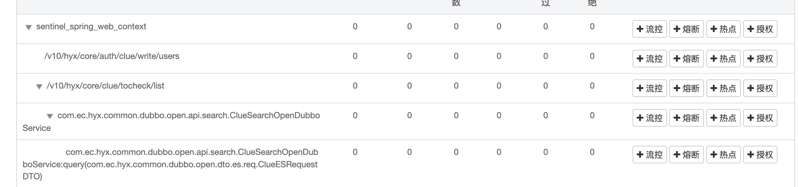
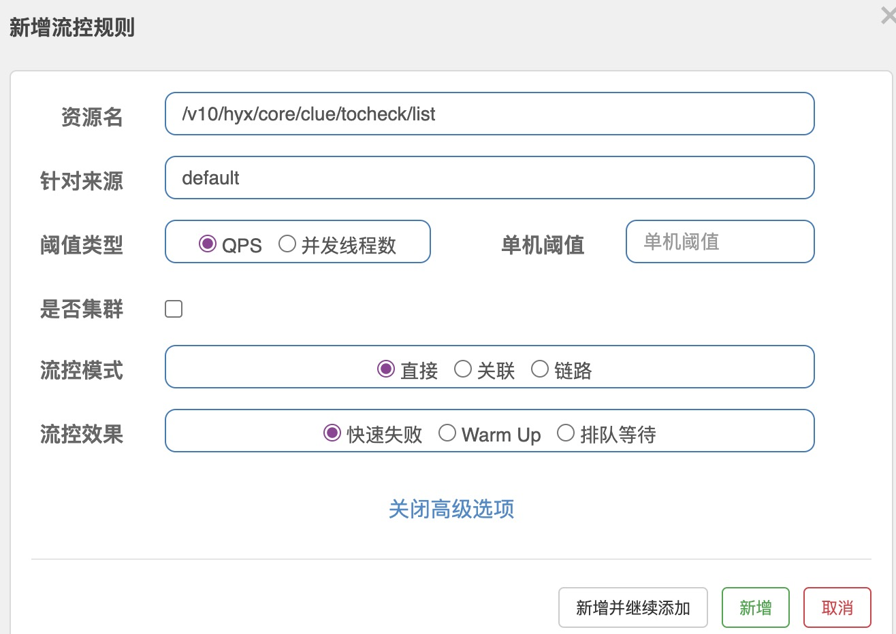
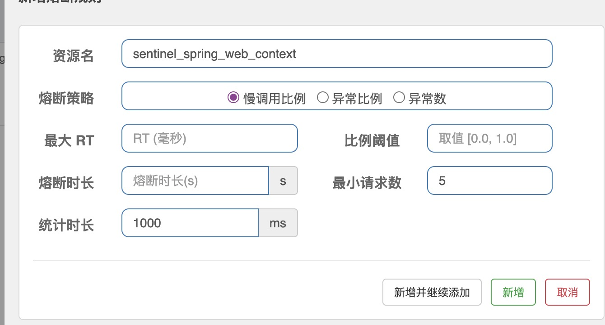
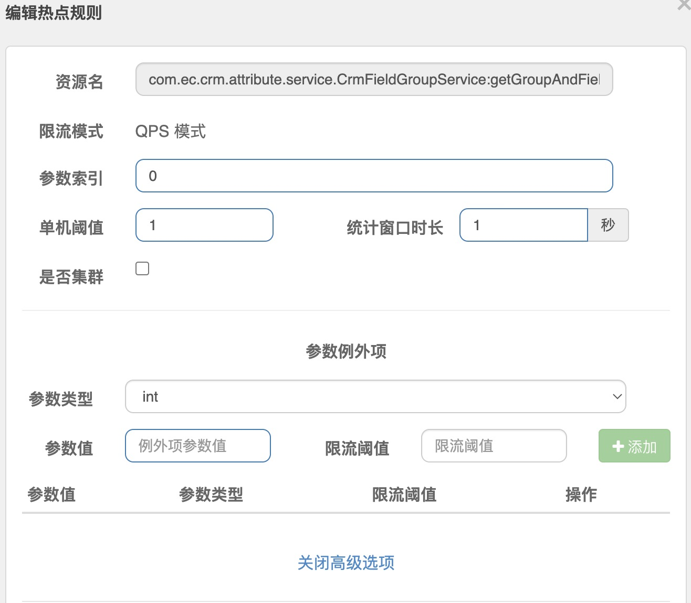

# Sentinel熔断限流

随着微服务的流行，服务和服务之间的稳定性变得越来越重要。Sentinel 是面向分布式、多语言异构化服务架构的流量治理组件，主要以流量为切入点，从流量路由、流量控制、流量整形、熔断降级、系统自适应过载保护、热点流量防护等多个维度来帮助开发者保障微服务的稳定性。

https://sentinelguard.io/zh-cn/docs/introduction.html


## 基本概念

```xml
<dependency>
    <groupId>com.alibaba.csp</groupId>
    <artifactId>sentinel-core</artifactId>
    <version>1.8.6</version>
</dependency>
```


### 1）资源：

资源是 Sentinel 的关键概念。它可以是 Java 应用程序中的任何内容，例如，由应用程序提供的服务，或由应用程序调用的其它应用提供的服务，甚至可以是一段代码。在接下来的文档中，我们都会用资源来描述代码块。

注：**也就是我们可以通过try自定义包裹任意一段代码为资源。其他的dubbo和spring mvc等适配器都是基于对应的拦截器，适配器等帮我们定义好了资源**。



```java
//方法1
try (Entry entry = SphU.entry("资源名称")) {
            // 被保护的逻辑
            System.out.println("hello world");
	} catch (BlockException ex) {
            // 处理被流控的逻辑
	    System.out.println("blocked!");
	}
//方法2
SentinelResource("HelloWorld")

//异步
 try {
    AsyncEntry entry = SphU.asyncEntry(resourceName);

    // 异步调用.
    doAsync(userId, result -> {
        try {
            // 在此处处理异步调用的结果.
        } finally {
            // 在回调结束后 exit.
            entry.exit();
        }
    });
} catch (BlockException ex) {
    // Request blocked.
    // Handle the exception (e.g. retry or fallback).
}

```


```java
try(Entry entry = SphU.entry("crmInfo")){
  crmInfoDto = searchCrmService.getCrmInfoWithExtendByCrmId(authUserInfo.getCorpId(), crmId);
  TimeUnit.SECONDS.sleep(5);
}catch (FlowException fe){
  logger.error("被限流了++++++++++++++++++++++++++++++",fe);
}catch (BlockException be){
  logger.error("被熔断了++++++++++++++++++++++++++++++",be);
}catch (Exception e){

}
```


### 2）规则：

有了资源，我们就可以基于资源做 限流，熔断处理等。

```java
private static void initFlowRules(){
    List<FlowRule> rules = new ArrayList<>();
    FlowRule rule = new FlowRule();
  //资源名称
    rule.setResource("HelloWorld");
    rule.setGrade(RuleConstant.FLOW_GRADE_QPS);
    // Set limit QPS to 20.
    rule.setCount(20);
    rules.add(rule);
    FlowRuleManager.loadRules(rules);
}
```

### 3）控制台

Sentinel 开源控制台支持实时监控和规则管理，规则台只是简单的获取统计数据，和实时从上报的应用里面拉取配置，外加配置管理

应用如果想要接入控制台：

```xml
<dependency>
    <groupId>com.alibaba.csp</groupId>
    <artifactId>sentinel-transport-simple-http</artifactId>
    <version>1.8.6</version>
</dependency>
```

-Dcsp.sentinel.dashboard.server=consoleIp:port

```
spring.cloud.sentinel.transport.dashboard=consoleIp:port
```

consoleIp:port : 控制台的访问地址

## 工作流程

### 插槽slot chain

在 Sentinel 里面，所有的资源都对应一个资源名称以及一个 Entry。Entry 可以通过对主流框架的适配自动创建，也可以通过注解的方式或调用 API 显式创建；每一个 Entry 创建的时候，同时也会创建一系列功能插槽（slot chain）

- `NodeSelectorSlot` 负责收集资源的路径，并将这些资源的调用路径，以树状结构存储起来，用于根据调用路径来限流降级；
- `ClusterBuilderSlot` 则用于存储资源的统计信息以及调用者信息，例如该资源的 RT, QPS, thread count 等等，这些信息将用作为多维度限流，降级的依据；
- `StatisticSlot` 则用于记录、统计不同纬度的 runtime 指标监控信息；
- `FlowSlot` 则用于根据预设的限流规则以及前面 slot 统计的状态，来进行流量控制；
- `AuthoritySlot` 则根据配置的黑白名单和调用来源信息，来做黑白名单控制；
- `DegradeSlot` 则通过统计信息以及预设的规则，来做熔断降级；
- `SystemSlot` 则通过系统的状态，例如 load1 等，来控制总的入口流量；


## 规则使用

### 流量控制FlowRule



|      Field      | 说明                                                         | 默认值                        |
| :-------------: | :----------------------------------------------------------- | :---------------------------- |
|    resource     | 资源名，资源名是限流规则的作用对象                           |                               |
|      count      | 限流阈值                                                     |                               |
|      grade      | 限流阈值类型，QPS 或线程数模式                               | QPS 模式                      |
|    limitApp     | 流控针对的调用来源                                           | `default`，代表不区分调用来源 |
|    strategy     | 调用关系限流策略：直接、链路、关联                           | 根据资源本身（直接）          |
| controlBehavior | 流控效果（直接拒绝 / 排队等待 / 慢启动模式），不支持按调用关系限流 | 直接拒绝                      |

异常：**FlowException**

查看当前应用的统计信息：curl http://localhost:8719/cnode?id=resourceName

#### 直接拒绝

（`RuleConstant.CONTROL_BEHAVIOR_DEFAULT`）方式。该方式是默认的流量控制方式，当QPS超过任意规则的阈值后，新的请求就会被立即拒绝，拒绝方式为抛出`FlowException`

#### 冷启动

（`RuleConstant.CONTROL_BEHAVIOR_WARM_UP`）方式。该方式主要用于系统长期处于低水位的情况下，当流量突然增加时，直接把系统拉升到高水位可能瞬间把系统压垮。通过"冷启动"，让通过的流量缓慢增加，在一定时间内逐渐增加到阈值上限，给冷系统一个预热的时间，避免冷系统被压垮的情况。

#### 匀速器

`RuleConstant.CONTROL_BEHAVIOR_RATE_LIMITER`）方式。这种方式严格控制了请求通过的间隔时间，也即是让请求以均匀的速度通过，对应的是漏桶算法。

#### 关联：

A->B

限制只有调用方为(A)的才限制。

#### 链路：

```
                  machine-root 链路
                    /       \
                   /         \
             Entrance1     Entrance2 关联
                /             \
               /               \
      DefaultNode(nodeA)   DefaultNode(nodeA)
```

调用关系包括调用方、被调用方(关联)；方法又可能会调用其它方法，形成一个调用链路的层次关系.

### 熔断降级规则 DegradeRule



|       Field        | 说明                                                         | 默认值     |
| :----------------: | :----------------------------------------------------------- | :--------- |
|      resource      | 资源名，即规则的作用对象                                     |            |
|       grade        | 熔断策略，支持慢调用比例/异常比例/异常数策略                 | 慢调用比例 |
|       count        | 慢调用比例模式下为慢调用临界 RT（超出该值计为慢调用）；异常比例/异常数模式下为对应的阈值 |            |
|     timeWindow     | 熔断时长，单位为 s                                           |            |
|  minRequestAmount  | 熔断触发的最小请求数，请求数小于该值时即使异常比率超出阈值也不会熔断（1.7.0 引入） | 5          |
|   statIntervalMs   | 统计时长（单位为 ms），如 60*1000 代表分钟级（1.8.0 引入）   | 1000 ms    |
| slowRatioThreshold | 慢调用比例阈值，仅慢调用比例模式有效（1.8.0 引入）           |            |

异常：**BlockException**


- 慢调用比例 (`SLOW_REQUEST_RATIO`)：选择以慢调用比例作为阈值，需要设置允许的慢调用 RT（即最大的响应时间），请求的响应时间大于该值则统计为慢调用。当单位统计时长（`statIntervalMs`）内请求数目大于设置的最小请求数目，并且慢调用的比例大于阈值，则接下来的熔断时长内请求会自动被熔断。经过熔断时长后熔断器会进入探测恢复状态（HALF-OPEN 状态），若接下来的一个请求响应时间小于设置的慢调用 RT 则结束熔断，若大于设置的慢调用 RT 则会再次被熔断。
- 异常比例 (`ERROR_RATIO`)：当单位统计时长（`statIntervalMs`）内请求数目大于设置的最小请求数目，并且异常的比例大于阈值，则接下来的熔断时长内请求会自动被熔断。经过熔断时长后熔断器会进入探测恢复状态（HALF-OPEN 状态），若接下来的一个请求成功完成（没有错误）则结束熔断，否则会再次被熔断。异常比率的阈值范围是 `[0.0, 1.0]`，代表 0% - 100%。
- 异常数 (`ERROR_COUNT`)：当单位统计时长内的异常数目超过阈值之后会自动进行熔断。经过熔断时长后熔断器会进入探测恢复状态（HALF-OPEN 状态），若接下来的一个请求成功完成（没有错误）则结束熔断，否则会再次被熔断。

### 系统保护规则 SystemRule

|       Field       | 说明                                   | 默认值      |
| :---------------: | :------------------------------------- | :---------- |
| highestSystemLoad | `load1` 触发值，用于触发自适应控制阶段 | -1 (不生效) |
|       avgRt       | 所有入口流量的平均响应时间             | -1 (不生效) |
|     maxThread     | 入口流量的最大并发数                   | -1 (不生效) |
|        qps        | 所有入口资源的 QPS                     | -1 (不生效) |
|  highestCpuUsage  | 当前系统的 CPU 使用率（0.0-1.0）       | -1 (不生效) |

### 访问控制规则 AuthorityRule

黑白名单根据资源的请求来源（`origin`）限制资源是否通过，若配置白名单则只有请求来源位于白名单内时才可通过；若配置黑名单则请求来源位于黑名单时不通过，其余的请求通过

- `resource`：资源名，即限流规则的作用对象
- `limitApp`：对应的黑名单/白名单，不同 origin 用 `,` 分隔，如 `appA,appB`
- `strategy`：限制模式，`AUTHORITY_WHITE` 为白名单模式，`AUTHORITY_BLACK` 为黑名单模式，默认为白名单模式

### 热点规则 ParamFlowRule



|       属性        | 说明                                                         | 默认值   |
| :---------------: | :----------------------------------------------------------- | :------- |
|     resource      | 资源名，必填                                                 |          |
|       count       | 限流阈值，必填                                               |          |
|       grade       | 限流模式                                                     | QPS 模式 |
|   durationInSec   | 统计窗口时间长度（单位为秒），1.6.0 版本开始支持             | 1s       |
|  controlBehavior  | 流控效果（支持快速失败和匀速排队模式），1.6.0 版本开始支持   | 快速失败 |
| maxQueueingTimeMs | 最大排队等待时长（仅在匀速排队模式生效），1.6.0 版本开始支持 | 0ms      |
|     paramIdx      | 热点参数的索引，必填，对应 `SphU.entry(xxx, args)` 中的参数索引位置 |          |
| paramFlowItemList | 参数例外项，可以针对指定的参数值单独设置限流阈值，不受前面 `count` 阈值的限制。**仅支持基本类型和字符串类型** |          |
|    clusterMode    | 是否是集群参数流控规则                                       | `false`  |
|   clusterConfig   | 集群流控相关配置                                             |          |

```java
ParamFlowRule rule = new ParamFlowRule(RESOURCE_KEY)
            .setParamIdx(0)
            .setGrade(RuleConstant.FLOW_GRADE_QPS)
            //.setDurationInSec(3)
            //.setControlBehavior(RuleConstant.CONTROL_BEHAVIOR_RATE_LIMITER)
            //.setMaxQueueingTimeMs(600)
            .setCount(5);

        // We can set threshold count for specific parameter value individually.
        // Here we add an exception item. That means: QPS threshold of entries with parameter `PARAM_B` (type: int)
        // in index 0 will be 10, rather than the global threshold (5).
        ParamFlowItem item = new ParamFlowItem().setObject(String.valueOf(PARAM_B))
            .setClassType(int.class.getName())
            .setCount(10);

        ParamFlowItem item1 = new ParamFlowItem().setObject(String.valueOf(PARAM_C))
                .setClassType(int.class.getName())
                .setCount(10);
        rule.setParamFlowItemList(Arrays.asList(item,item1));
        ParamFlowRuleManager.loadRules(Collections.singletonList(rule));
```

注：**参数的配置，可以配置不同的参数值，不同的限制规则**。

## 集群：

每个应用都是独立的配置，是自己控制。如需要集群控制，这实时就需要指定多个节点的中的一台为服务者，其他的为客户端。

方案1：指定其中一个节点为服务者

方案2：独立部署一个节点为服务者

## 运维

### 1）日志

无论触发了限流、熔断降级还是系统保护，它们的秒级拦截详情日志都在 `${user_home}/logs/csp/sentinel-block.log`里。如果没有发生拦截，则该日志不会出现

产生秒级监控日志，日志文件默认为 `${user_home}/logs/csp/${app_name}-${pid}-metrics.log`（会随时间滚动

`{user_home}/logs/csp/sentinel-record.log.xxx` 里。该日志包含规则的推送、接收、处理等记录，排查问题的时候会非常有帮助

`${log_dir}/sentinel-cluster-client.log`：Token Client 日志，会记录请求失败的信息

### 2）实时监控

curl http://localhost:8719/clusterNode

```json
[
 {"avgRt":0.0, //平均响应时间
 "blockRequest":0, //每分钟拦截的请求个数
 "blockedQps":0.0, //每秒拦截个数
 "curThreadNum":0, //并发个数
 "passQps":1.0, // 每秒成功通过请求
 "passReqQps":1.0, //每秒到来的请求
 "resourceName":"/registry/machine", 资源名称
 "timeStamp":1529905824134, //时间戳
 "totalQps":1.0, // 每分钟请求数
 "totalRequest":193}, 
  ....
]
```

curl http://localhost:8719/cnode?id=xxxx

其中 `id` 对应 resource name


curl http://localhost:8719/origin?id=xxxx

## 自定义使用

### 1）全局开关

```java
com.alibaba.csp.sentinel.Constants
/**
     * The global switch for Sentinel.
     */
    public static volatile boolean ON = true;
```

方式1，可以通过终端命令全局关闭

```java
com.alibaba.csp.sentinel.command.handler.OnOffSetCommandHandler
```

方案2，应用自定义，即通过配置变更，等更改改值。

### 2）自定义插槽

代码完全参考官方

```java
@Spi(order = 1)
public class DemoSlot extends AbstractLinkedProcessorSlot<DefaultNode> {

    @Override
    public void entry(Context context, ResourceWrapper resourceWrapper, DefaultNode node, int count, boolean prioritized, Object... args)
            throws Throwable {
        System.out.println("------Entering for entry on DemoSlot------");
        System.out.println("Current context: " + context.getName());
        System.out.println("Current entry resource: " + context.getCurEntry().getResourceWrapper().getName());

        if(context.getCurEntry().getResourceWrapper().getName().equals("abc")){
            throw new AuthorityException(context.getOrigin(), "测试异常");
        }
        fireEntry(context, resourceWrapper, node, count, prioritized, args);

    }

    @Override
    public void exit(Context context, ResourceWrapper resourceWrapper, int count, Object... args) {
        System.out.println("------Exiting for entry on DemoSlot------");
        System.out.println("Current context: " + context.getName());
        System.out.println("Current entry resource: " + context.getCurEntry().getResourceWrapper().getName());

        fireExit(context, resourceWrapper, count, args);
    }
}
```

参照Spi，在META-INF.services下面的com.alibaba.csp.sentinel.slotchain.ProcessorSlot文件中添加com.alibaba.csp.sentinel.demo.slot.DemoSlot

### 3）替换系统的插槽

通过自定义插槽，然后添加我们自己定义的插槽。

```java
@Spi
//关键是实现 SlotChainBuilder
public class DemoSlotChainBuilder implements SlotChainBuilder {

    @Override
    public ProcessorSlotChain build() {
        ProcessorSlotChain chain = new DefaultProcessorSlotChain();

        List<ProcessorSlot> sortedSlotList = SpiLoader.of(ProcessorSlot.class).loadInstanceListSorted();
        // Filter out `DegradeSlot`
        // Test for `DemoDegradeRuleApplication`, the demo will not be blocked by `DegradeException`
      //移除系统的插槽
        sortedSlotList.removeIf(o -> DegradeSlot.class.equals(o.getClass()));
        for (ProcessorSlot slot : sortedSlotList) {
            System.out.println("处理进程:"+slot.getClass().getCanonicalName());
            if (!(slot instanceof AbstractLinkedProcessorSlot)) {
                RecordLog.warn("The ProcessorSlot(" + slot.getClass().getCanonicalName() + ") is not an instance of AbstractLinkedProcessorSlot, can't be added into ProcessorSlotChain");
                continue;
            }

            chain.addLast((AbstractLinkedProcessorSlot<?>) slot);
        }

        return chain;
    }

    /**
     * Another way to build the slot chain, add slot one by one with `SpiLoader#loadInstance`.
     * Note that the sentinel's default slots and the order of them are very important, be careful when customizing,
     * refer to the constants for slot order definitions in {@link com.alibaba.csp.sentinel.Constants}.
     */
    /*
    @Override
    public ProcessorSlotChain build() {
        ProcessorSlotChain chain = new DefaultProcessorSlotChain();

        // Create a `SpiLoader` instance
        SpiLoader<ProcessorSlot> spiLoader = SpiLoader.of(ProcessorSlot.class);

        // Add `NodeSelectorSlot`, load by class
        chain.addLast((AbstractLinkedProcessorSlot<?>) spiLoader.loadInstance(NodeSelectorSlot.class));

        // Add `ClusterBuilderSlot`, load by aliasname(default is classname)
        chain.addLast((AbstractLinkedProcessorSlot<?>) spiLoader.loadInstance("com.alibaba.csp.sentinel.slots.clusterbuilder.ClusterBuilderSlot"));

        // Add `StatisticSlot`
        chain.addLast((AbstractLinkedProcessorSlot<?>) spiLoader.loadInstance(StatisticSlot.class));

        // Add `FlowSlot`
        chain.addLast((AbstractLinkedProcessorSlot<?>) spiLoader.loadInstance(FlowSlot.class));

        // Add `DegradeSlot`
        // Test for `DemoDegradeRuleApplication`
        // If we don't add `DegradeSlot`, the demo will not be blocked by `DegradeException`
        // If it's added, we can see the expected DegradeException
//        chain.addLast((AbstractLinkedProcessorSlot<?>) spiLoader.loadInstance(DegradeSlot.class));
        return chain;
    }
    */
}
```

com.alibaba.csp.sentinel.slotchain.SlotChainBuilder 下添加DemoSlotChainBuilder

### 4）系统插槽顺序

```java
/**
     * Order of default processor slots
     */
public static final int ORDER_NODE_SELECTOR_SLOT = -10000;
public static final int ORDER_CLUSTER_BUILDER_SLOT = -9000;
public static final int ORDER_LOG_SLOT = -8000;
public static final int ORDER_STATISTIC_SLOT = -7000;
public static final int ORDER_AUTHORITY_SLOT = -6000;
public static final int ORDER_SYSTEM_SLOT = -5000;
public static final int ORDER_FLOW_SLOT = -2000;
public static final int ORDER_DEFAULT_CIRCUIT_BREAKER_SLOT = -1500;
public static final int ORDER_DEGRADE_SLOT = -1000;
```

顺序：越小越靠前

### 5）初始化过程扩展

提供 `InitFunc` SPI接口，可以添加自定义的一些初始化逻辑，如动态规则源注册等。

