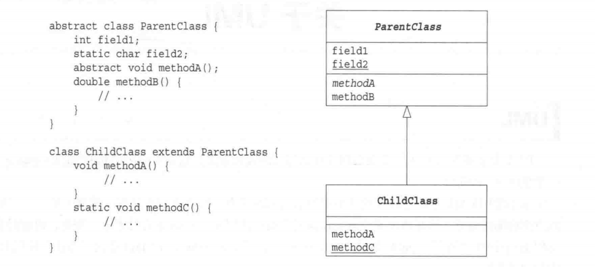
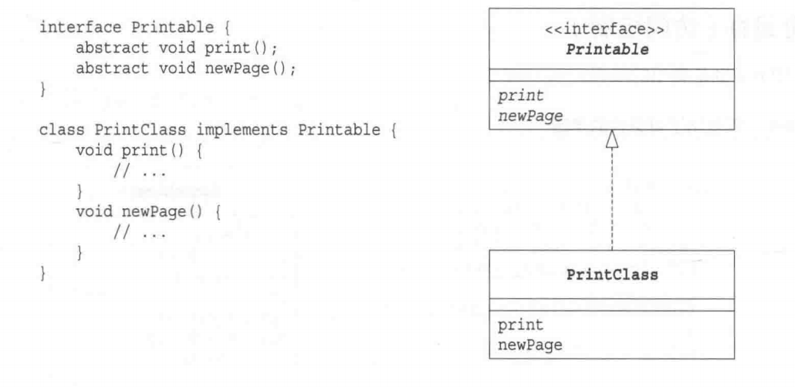
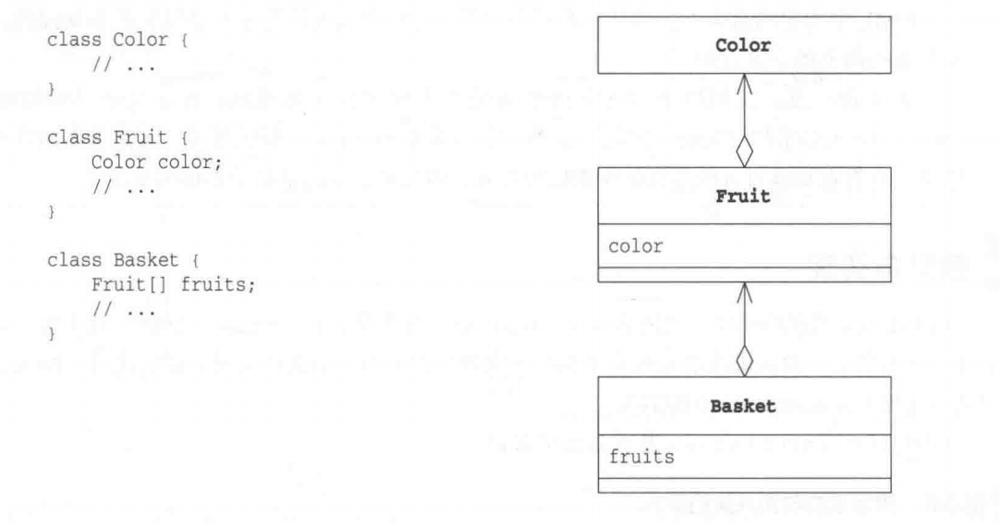
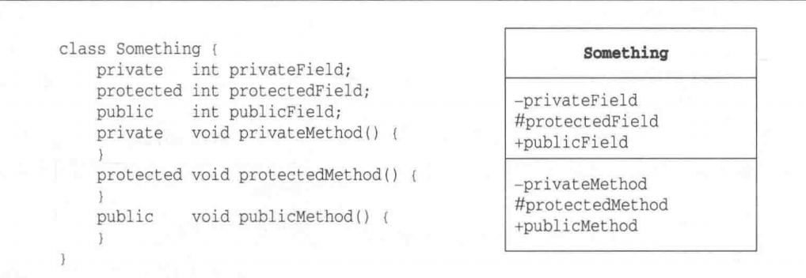
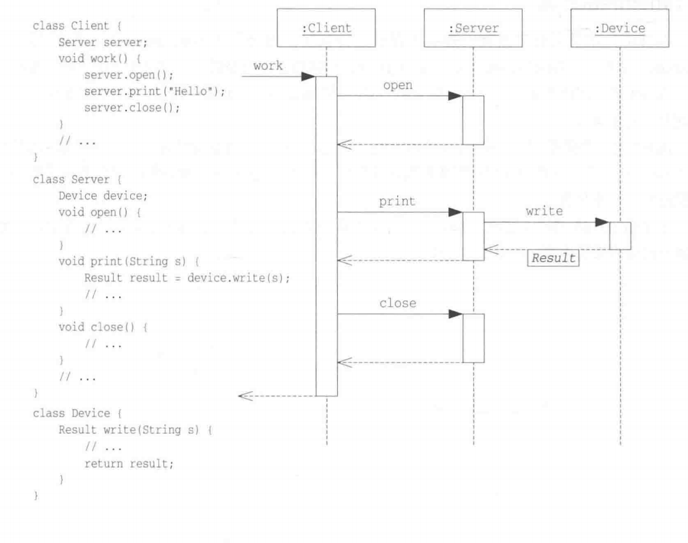

# UML画图

## 1）继承关系

1）继承，用空三角,实线

2）abstract 类，abstract方法 ，斜体表示

3）static字段，static方法，下划线

## 2）接口实现

实现接口，用空三角，虚线

## 3）聚合关系

箭头+空三棱型

## 4）可见性

+表示public方法和字段

-表示private方法和字段

井号 表示protected方法和字段 

## 时序图

