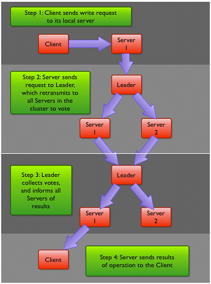

# ZooKeeper探究

顺序一致性：客户端的更新顺序与他们被发送的顺序相一致；

原子性：更新操作要么全部成功，要么全部失败；

单一试图：无论客户端连接到哪一个服务器，都可以看到相同的ZooKeeper视图；

可靠性：一旦一个更新操作被应用，那么在客户端再次更新它之前，其值将不会被改变；

实时性：在特定的一段时间内，系统的任何变更都将被客户端检测到；

## 1）是什么？

> 书封面上的猫也颇有渊源。雅虎研究院早期的一篇关于 ZooKeeper(动物管理员)的文章谈到，分布式进程管理就像养一群猫一样，而 ZooKeeper这个名字比CatHerder更好一些 ，

CAP理论的核心观点是任何软件系统都无法同时满足一致性、可用性以及分区容错性。ZooKeeper是个**CP**（一致性+分区容错性）的


ZooKeeper是一个[分布式](https://baike.baidu.com/item/分布式/19276232)的，开放源码的[分布式应用程序](https://baike.baidu.com/item/分布式应用程序/9854429)协调服务，是[Google](https://baike.baidu.com/item/Google)的Chubby一个[开源](https://baike.baidu.com/item/开源/246339)的实现，是Hadoop和Hbase的重要组件。它是一个为分布式应用提供一致性服务的软件，提供的功能包括：配置维护、域名服务、分布式同步、组服务等。

ZooKeeper的目标就是封装好复杂易出错的关键服务，将简单易用的接口和性能高效、功能稳定的系统提供给用户。

ZooKeeper包含一个简单的原语集， [1] 提供Java和C的接口。

ZooKeeper代码版本中，提供了分布式独享锁、选举、队列的接口，代码在$zookeeper_home\src\recipes。其中分布锁和队列有[Java](https://baike.baidu.com/item/Java/85979)和C两个版本，选举只有Java版本。


在Zookeeper中，**znode是一个跟Unix文件系统路径相似的节点**，可以往这个节点存储或获取数据。如果在创建znode时Flag设置为**EPHEMERAL**(临时节点)，那么当创建这个znode的节点和Zookeeper失去连接后，这个znode将不再存在在Zookeeper里，Zookeeper使用**Watcher**察觉事件信息。当客户端接收到事件信息，比如连接超时、节点数据改变、子节点改变，可以调用相应的行为来处理数据。Zookeeper的Wiki页面展示了如何使用Zookeeper来处理事件通知，队列，优先队列，锁，共享锁，可撤销的共享锁，两阶段提交


https://www.cnblogs.com/ultranms/p/9585191.html

https://blog.csdn.net/liyiming2017?t=1

https://www.jianshu.com/p/e68c06a5d002


### 1.1）事物操作   

在ZooKeeper中，能改变ZooKeeper服务器状态的操作称为事务操作。一般包括数据节点创建与删除、数据内容更新和客户端会话创建与失效等操作。对应每一个事务请求，ZooKeeper都会为其分配一个全局唯一的事务ID，用 ZXID 表示，通常是一个64位的数字。每一个 ZXID对应一次更新操作，从这些 ZXID 中可以间接地识别出 ZooKeeper 处理这些事务操作请求的
全局顺序。

### 1.2）Watcher(事件监听器)

ZooKeeper 中一个很重要的特性。ZooKeeper允许用户在指定节点上注册一些 Watcher，并且在一些特定事件触发的时候，ZooKeeper服务端会将事件通知到感兴趣的客户端上去。

ZooKeeper数据模型的结构整体上可以看作是一棵树，每个节点称做一个ZNode。每个ZNode都可以通过其路径唯一标识在每个ZNode上可存储少量数据(默认是**1M,** 可以通过配置修改, 通常不建议在ZNode上存储大量的数据)

ZooKeeper支持一种Watch操作，Client可以在某个ZNode上设置一个Watcher，来Watch该ZNode上的变化。如果该ZNode上有相应的变化，就会触发这个Watcher，把相应的事件通知给设置Watcher的Client。需要注意的是，**ZooKeeper中的Watcher是一次性的，即触发一次就会被取消，如果想继续Watch的话，需要客户端重新设置Watcher**

**一旦设置监视点就无法移除。要想 移除一个监视点，只有两个方法，一是触发这个监视点，二是使其会话 被关闭或过期**。 

### 1.3）节点状态

每个集群中的节点都有一个状态 `LOOKING`, `FOLLOWING`, `LEADING`, `OBSERVING`。都属于这4种，每个节点启动的时候都是LOOKING状态，如果这个节点参与选举但最后不是leader，则状态是FOLLOWING，如果不参与选举则是OBSERVING，leader的状态是LEADING。

### 1.4）ZooKeeper集群服务

ZooKeeper服务器端运行于两种模式下:**独立模式(standalone)和 仲裁模式(quorum)**。独立模式几乎与其术语所描述的一样:有一个单 独的服务器，ZooKeeper状态无法复制。在仲裁模式下，具有一组 ZooKeeper服务器，我们称为ZooKeeper集合(ZooKeeper ensemble)， 

ZooKeeper 官方确实给出了关于奇数的建议，但绝大部分 ZooKeeper 用户对于这个建议认识有偏差。一个 ZooKeeper 集群如果要对外提供可用的服务，那么集群中必须要有过半的机器正常工作并且彼此之间能够正常通信。基于这个特性，如果想搭建一个能够允许 N 台机器 down 掉的集群，那么就要部署一个由 2*N+1 台服务器构成的 ZooKeeper 集群。因此，一个由 3 台机器构成的 ZooKeeper 集群，能够在挂掉 1 台机器后依然正常工作，而对于一个由 5 台服务器构成的 ZooKeeper 集群，能够对 2 台机器挂掉的情况进行容灾。注意，如果是一个由6台服务器构成的 ZooKeeper 集群，同样只能够挂掉 2 台机器，因为如果挂掉 3 台，剩下的机器就无法实现过半了。

zookeeper有这样一个特性：

【集群中只要有超过过半的机器是正常工作的，那么整个集群对外就是可用的】

 也就是说如果有2个zookeeper，那么只要有1个死了zookeeper就不能用了，因为1没有过半，所以2个zookeeper的死亡容忍度为0；

同理，要是有3个zookeeper，一个死了，还剩下2个正常的，过半了，所以3个zookeeper的容忍度为1；

同理你多列举几个：2->0;3->1;4->1;5->2;6->2会发现一个规律，2n和2n-1的容忍度是一样的，

都是n-1，所以为了更加高效，何必增加那一个不必要的zookeeper呢。

**投票值取 决于该服务器的标识符和其最新的zxid** 。

### 1.5）ZooKeeper可伸缩性

那么，ZooKeeper为什么要引入Observer这个角色呢？其实在ZooKeeper中引入Observer，主要是为了使ZooKeeper具有更好的可伸缩性。那么，何为可伸缩性？关于伸缩性，对于不同的人意味着不同的事情。 而在这里是说，如果我们的工作负载可以通过给系统分配更多的资源来分担，那么这个系统就是可伸缩的；一个不可伸缩的系统却无法通过增加资源来提升性能，甚至会在工作负载增加时，性能会急剧下降。
在Observer出现以前，ZooKeeper的伸缩性由Follower来实现，我们可以通过添加Follower节点的数量来保证ZooKeeper服务的读性能。但是随着Follower节点数量的增加，ZooKeeper服务的写性能受到了影响。


**Leader复制写和更新数据，Server(Follow)复制客户端的读操作，如果有写都中转到Leader**。**Leader写的时候需要投票**，投票是通过ZAB协议。**Observer就是不参与投票的Server,因为太多的Server投票性能会下降**。


**Zab:ZooKeeper原子广播协议 (ZooKeeper Atomic Broadcast protocol)** ：

1.群首向所有追随者**发送一个PROPOSAL消息**p。

 2.当一个追随者接收到消息p后，会响应群首一个**ACK消息**，通知群首其已**接受该提案(proposal)**。

 3.当收到仲裁数量的服务器发送的确认消息后(该仲裁数包括群首自己)，群首就会发送消息通知追随者进行提交**(COMMIT)操作**。 

来自Client的所有写请求，都要转发给ZK服务中唯一的Server**—**Leader，由Leader根据该请求发起一个Proposal（请求）。然后，其他的Server对该Proposal（请求）进行Vote（投票）。之后，Leader对Vote（投票）进行收集，当Vote数量过半时Leader会向所有的Server发送一个通知消息。最后，当Client所连接的Server收到该消息时，会把该操作更新到内存中并对Client的写请求做出回应。



追随者将 会检查所发送的提案消息是否属于其所追随的群首，并确认群首所广播 的提案消息和提交事务消失的顺序正确。 

 Observer可以接受客户端的连接，并将写请求转发给Leader节点。但是，Leader节点不会要求 Observer参加投票。相反，Observer不参与投票过程，仅仅在上述第3歩那样，和其他服务节点一起得到投票结果。


ZooKeeper状态的客户端请求(create、delete和 setData)将会被转发给群首，群首执行相应的请求，并形成状态的更 新，我们称为**事务(transaction)** 。

同时一个事务还具有幂等性，也就是说，我们可以对同一个事务执 行两次，我们得到的结果还是一样的，我们甚至还可以对多个事务执行 多次，同样也会得到一样的结果，前提是我们确保多个事务的执行顺序 每次都是一样的。 

当群首产生了一个事务，就会为该事务分配一个标识符，我们称之 为ZooKeeper会话ID`(zxid)` 。


**zxid**为一个long型(64位)整数，分为两部分:**时间戳(epoch)部分**和**计数器(counter)**部分。每个部分为32位 。


### 1.6）节点：

**需要注意的是，ZooKeeper并不允许局部写入或读取znode节点的数 据。当设置一个znode节点的数据或读取时，znode节点的内容会被整个 替换或全部读取进来** 

znode节点可以是**持久(persistent)节点**，还可以是**临时 (ephemeral)节点**。持久的znode，如/path，只能通过调用delete来进行 删除。临时的znode与之相反，当创建该节点的客户端崩溃或关闭了与 ZooKeeper的连接时，这个节点就会被删除 。

**临时节点删除：**

1.当创建该znode的客户端的会话因超时或主动关闭而中止时。

 2.当某个客户端(不一定是创建者)主动删除该节点时。 

**有序节点**：

一个znode还可以设置为有序(sequential)节点。一个有序znode节 点被分配唯一个单调递增的整数。当创建有序节点时，一个序号会被追 加到路径之后。例如，如果一个客户端创建了一个有序znode节点，其 路径为/tasks/task-，那么ZooKeeper将会分配一个序号，如1，并将这个 数字追加到路径之后，最后该znode节点为/tasks/task-1。有序znode通过 提供了创建具有唯一名称的znode的简单方式。同时也通过这种方式可 以直观地查看znode的创建顺序 

**znode一共有4种类型:持久的(persistent)、临时的 (ephemeral)、持久有序的(persistent_sequential)和临时有序的 (ephemeral_sequential)**。 

sync为异步调 用的方法，客户端在读操作前调用该方法，假如客户端从某些直接通道 收到了某个节点变化的通知，并要读取这个znode节点，客户端就可以 通过sync方法，然后再调用getData方法 

### 1.7）版本：

每一个znode都有一个版本号，它随着每次数据变化而自增。两个 API操作可以有条件地执行:setData和delete。这两个调用以版本号作为 转入参数，只有当转入参数的版本号与服务器上的版本号一致时调用才 会成功。 

### 1.8）会话：

在对ZooKeeper集合执行任何请求前，一个客户端必须先与服务建 立会话。会话的概念非常重要，对ZooKeeper的运行也非常关键。客户 端提交给ZooKeeper的所有操作均关联在一个会话上。当一个会话因某种原因而中止时，在这个会话期间创建的临时节点将会消失 。

客户端通过TCP协议与服务器进行连接并通信， 但当会话无法与当前连接的服务器继续通信时，会话就可能转移到另一 个服务器上。ZooKeeper客户端库透明地转移一个会话到不同的服务器。 

**会话提供了顺序保障**，这就意味着同一个会话中的请求会以 FIFO(先进先出)顺序执行。通常，一个客户端只打开一个会话，因此 客户端请求将全部以FIFO顺序执行。如果客户端拥有多个并发的会话， FIFO顺序在多个会话之间未必能够保持。而即使一个客户端中连贯的会 话并不重叠，也未必能够保证FIFO顺序。 

ZooKeeper服务器的一个重要任务就是跟踪并维护这些会话 

### 1.9）ACl权限控制：

每次创建znode节点时，必须设置访问权限，而**且子 节点并不会继承父节点的访问权限**。**访问权限的检查也是基于每一个 znode节点的**，如果一个客户端可以访问一个znode节点，即使这个客户 端无权访问该节点的父节点，仍然可以访问这个znode节点。 


### 存储：

存储主要分两大块，事务日志和快照。

**事务日志：**

ZooKeeper为文件预分配大的数据块，来避免每次写入所带来的文 件增长的元数据管理开销，如果你通过对这些文件进行十六进制转储打 印，你会发现这些文件中全部以null字符(\0)填充，只有在最开始部 分有少量的二进制数据，服务器运行一段时间后，其中的null字符逐渐 被日志数据替换。 

快照文件并不会被预分配空间，所以文件大小也更加准确地反映了 其中包含的数据大小。 

## 2）客户端使用：

启动：

```shell
➜  apache-zookeeper-3.5.6-bin ls
LICENSE.txt          README.md            bin                  docs                 logs
NOTICE.txt           README_packaging.txt conf                 lib
#查看配置
➜  apache-zookeeper-3.5.6-bin ls ./conf
configuration.xsl log4j.properties  zoo.cfg

#查看命令
➜  apache-zookeeper-3.5.6-bin ls ./bin
README.txt             zkCli.sh               zkServer-initialize.sh zkTxnLogToolkit.cmd
zkCleanup.sh           zkEnv.cmd              zkServer.cmd           zkTxnLogToolkit.sh
zkCli.cmd              zkEnv.sh               zkServer.sh

#启动
➜  apache-zookeeper-3.5.6-bin ./bin/zkServer.sh start
/usr/bin/java
ZooKeeper JMX enabled by default
Using config: /Users/borgxiao/Documents/work/soft/apache-zookeeper-3.5.6-bin/bin/../conf/zoo.cfg
Starting zookeeper ... STARTED

```

客户端连接使用：

```shell
➜  apache-zookeeper-3.5.6-bin ./zkCli.sh -server 192.168.1.76:2181

#列出节点
[zk: 192.168.1.76:2181(CONNECTED) 1] ls /
[WebConsolechangedb, a, admin, app_watch,...]

[zk: 192.168.1.76:2181(CONNECTED) 2] help
ZooKeeper -server host:port cmd args
	addauth scheme auth
	close 
	config [-c] [-w] [-s]
	connect host:port
	create [-s] [-e] [-c] [-t ttl] path [data] [acl] #创建
	delete [-v version] path #删除
	deleteall path
	delquota [-n|-b] path
	get [-s] [-w] path #获取
	getAcl [-s] path
	history
	listquota path
	ls [-s] [-w] [-R] path  #列出
	ls2 path [watch] #列出并监控
	printwatches on|off
	quit
	reconfig [-s] [-v version] [[-file path] | [-members serverID=host:port1:port2;port3[,...]*]] | [-add serverId=host:port1:port2;port3[,...]]* [-remove serverId[,...]*]
	redo cmdno
	removewatches path [-c|-d|-a] [-l]
	rmr path
	set [-s] [-v version] path data #更新
	setAcl [-s] [-v version] [-R] path acl #更新权限
	setquota -n|-b val path
	stat [-w] path #查看信息
	sync path

```

```shell
[zk: 192.168.1.76:2181(CONNECTED) 3] create -e /borgxiao "test1"
Created /borgxiao
[zk: 192.168.1.76:2181(CONNECTED) 4] get /borgxiao
test1
[zk: 192.168.1.76:2181(CONNECTED) 5] create -e /borgxiao "test1"
Node already exists: /borgxiao
[zk: 192.168.1.76:2181(CONNECTED) 6] stat /borgxiao true
'stat path [watch]' has been deprecated. Please use 'stat [-w] path' instead.
cZxid = 0x1310a9f249
ctime = Thu Dec 12 17:51:20 CST 2019
mZxid = 0x1310a9f249
mtime = Thu Dec 12 17:51:20 CST 2019
pZxid = 0x1310a9f249
cversion = 0
dataVersion = 0
aclVersion = 0
ephemeralOwner = 0x16c83d6cec84998
dataLength = 5
numChildren = 0

#注意客户端的连接ID
[zk: 192.168.1.76:2181(CONNECTED) 7] set /borgxiao "test2"

WATCHER::

WatchedEvent state:SyncConnected type:NodeDataChanged path:/borgxiao
[zk: 192.168.1.76:2181(CONNECTED) 8] get /borgxiao
test2
[zk: 192.168.1.76:2181(CONNECTED) 9] stat /borgxiao
cZxid = 0x1310a9f249
ctime = Thu Dec 12 17:51:20 CST 2019
mZxid = 0x1310a9fdcc
mtime = Thu Dec 12 17:53:51 CST 2019
pZxid = 0x1310a9f249
cversion = 0
dataVersion = 1 #版本号变更了
aclVersion = 0
ephemeralOwner = 0x16c83d6cec84998
dataLength = 5
numChildren = 0

[zk: 192.168.1.76:2181(CONNECTED) 10] delete /borgxiao
[zk: 192.168.1.76:2181(CONNECTED) 11] get /borgxiao
org.apache.zookeeper.KeeperException$NoNodeException: KeeperErrorCode = NoNode for /borgxiao

```

czxid 创建该节点的事物ID

ctime 创建该节点的时间

mZxid 更新该节点的事物ID

mtime 更新该节点的时间

pZxid 操作当前节点的子节点列表的事物ID(这种操作包含增加子节点，删除子节点)

cversion 当前节点的子节点版本号

dataVersion 当前节点的数据版本号

aclVersion 当前节点的acl权限版本号

ephemeralowner 当前节点的如果是临时节点，该属性是临时节点的事物ID

dataLength 当前节点的d的数据长度

numchildren 当前节点的子节点个数


dubbo查看：**

```shell
[zk: 192.168.1.76:2181(CONNECTED) 12] ls /dubbo
[cn.binarywang.wx.miniapp.api.WxMaUserService,..]
[zk: 192.168.1.76:2181(CONNECTED) 13] ls /dubbo/org.apache.dubbo.samples.monitor.api.DemoService
#4个目录
[configurators, consumers, providers, routers]
[zk: 192.168.1.76:2181(CONNECTED) 14] get /dubbo/org.apache.dubbo.samples.monitor.api.DemoService
192.168.10.1
[zk: 192.168.1.76:2181(CONNECTED) 23] get /dubbo/com.ec.crm.core.service.AddCrmService/consumers/consumer%3A%2F%2F10.22.8.57%2Fcom.ec.crm.core.service.AddCrmService%3Fapplication%3Dcrm-api%26category%3Dconsumers%26check%3Dfalse%26dubbo%3D2.6.2%26interface%3Dcom.ec.crm.core.service.AddCrmService%26loadbalance%3Droundrobin%26methods%3DbuildOne%2CbuildSimple%2CbuildOneOrSave%26pid%3D1%26qos.enable%3Dfalse%26retries%3D0%26revision%3D0.0.1-SNAPSHOT%26side%3Dconsumer%26timeout%3D4000%26timestamp%3D1576121923521%26version%3D0.0.1
10.22.8.57
```

**监控Telnet查看信息**

```shell
#stat 查看信息
➜  apache-zookeeper-3.5.6-bin telnet 192.168.1.76 2181
Trying 192.168.1.76...
Connected to 192.168.1.76.
Escape character is '^]'.
stat
Zookeeper version: 3.4.5-cdh4.7.1--1, built on 11/18/2014 15:33 GMT
#客户端数
Clients:
 /10.22.28.28:35996[1](queued=0,recved=942,sent=942)
 
 Latency min/avg/max: 0/0/1674
Received: 424411033
Sent: 428216633
#连接数
Connections: 114
Outstanding: 0
Zxid: 0x1310ab446e
#当前节点模式
Mode: follower
#总节点数
Node count: 14042

# srvr 同stat 只是没有客户端列表
➜  apache-zookeeper-3.5.6-bin telnet 192.168.1.76 2181
Trying 192.168.1.76...
Connected to 192.168.1.76.
Escape character is '^]'.
srvr
Zookeeper version: 3.4.5-cdh4.7.1--1, built on 11/18/2014 15:33 GMT
Latency min/avg/max: 0/0/1674
Received: 424415408
Sent: 428221055
Connections: 114
Outstanding: 0
Zxid: 0x1310ab4b19
Mode: follower
Node count: 14043

#dump
提供会话信息，列出当前活动的会话信息以及这些会话的过期时 间。该命令只能在群首服务器上运行


#conf
列出该服务器启动运行所使用的基本配置参数。
➜  apache-zookeeper-3.5.6-bin telnet 192.168.1.76 2181
Trying 192.168.1.76...
Connected to 192.168.1.76.
Escape character is '^]'.
config
clientPort=2181
dataDir=/var/lib/zookeeper/version-2
dataLogDir=/var/lib/zookeeper/version-2
tickTime=2000
maxClientCnxns=100
minSessionTimeout=4000
maxSessionTimeout=40000
serverId=1
initLimit=10
syncLimit=5
electionAlg=3
electionPort=3888
quorumPort=2888
peerType=0

#envi
列出各种各样的Java环境参数。

#mntr 
提供了比stat命令更加详细的服务器统计数据

#wchs
列出该服务器所跟踪的监视点的简短摘要信息
wchs
45 connections watching 127 paths
Total watches:336
#wchc
列出该服务器所跟踪的监视点的详细信息，根据会话进行分组

#cons，crst
cons命令列出该服务器上每个连接的详细统计信息，crst重置这些 连接信息中的计数器为0


```


## 3）配置：

```ini
#单位毫秒会话超时时间 客户端最小会话超时事件为两个tick时间
#每个tick的毫秒数。后面的initLimit和syncLimit都以tick为单位
tickTime=2000
#初始化同步阶段时长
initLimit=10

#追随者与群首进行sync操作时的超时值，单位为tick值的倍 数。
#同步确认时长
syncLimit=5

#快照目录配置
dataDir=./data 
#事物日志配置
dataLogDir=./txnlog

#设置为观察者
peerType=observer

#客户端端口配置
clientPort=2181 
server.1=127.0.0.1:2222:2223 
server.2=127.0.0.1:3333:3334 
server.3=127.0.0.1:4444:4445
```


## 4）API库：

Curator作为ZooKeeper的一个高层次封装库 。

```xml
<!-- https://mvnrepository.com/artifact/org.apache.zookeeper/zookeeper -->
<dependency>
    <groupId>org.apache.zookeeper</groupId>
    <artifactId>zookeeper</artifactId>
    <version>3.5.6</version>
</dependency>
```

```java
public class ZooKeeperConnection {
    private ZooKeeper zoo;
    //countDownLatch这个类使一个线程等待其他线程各自执行完毕后再执行。
    //是通过一个计数器来实现的，计数器的初始值是线程的数量。每当一个线程执行完毕后，计数器的值就-1，当计数器的值为0时，表示所有线程都执行完毕，然后在闭锁上等待的线程就可以恢复工作了。
    final CountDownLatch connectedSignal = new CountDownLatch(1);
    public ZooKeeper connect(String host) throws IOException, InterruptedException {
        zoo = new ZooKeeper(host, 5000, new Watcher() {
            public void process(WatchedEvent watchedEvent) {
                if (watchedEvent.getState() == Event.KeeperState.SyncConnected) {
                    System.out.println("我被触发了");
                    connectedSignal.countDown();
                }
            }
        });
        connectedSignal.await();
        return zoo;
    }
    public void close() throws InterruptedException {
        zoo.close();
    }
}
```

```java
//地址，session超时时间
//WatchedEvent
ZooKeeper zooKeeper = new ZooKeeperConnection().connect("127.0.0.1:2181");
String value = "测试";
//打印/test1
String result = zooKeeper.create("/test1",value.getBytes(),ZooDefs.Ids.OPEN_ACL_UNSAFE, CreateMode.EPHEMERAL);
System.out.println(result);
//CONNECTED
System.out.println(zooKeeper.getState());
//true
Stat stat = zooKeeper.exists("/test1",false);
//0
System.out.println(stat.getVersion());

byte[] bn = zooKeeper.getData("/test1", new Watcher() {
    public void process(WatchedEvent watchedEvent) {
        //SyncConnected
        System.out.println(watchedEvent.getState());
    }
}, null);
String data = new String(bn,
        "UTF-8");
System.out.println(data);

zooKeeper.setData("/test1","哈哈".getBytes(),stat.getVersion());
bn = zooKeeper.getData("/test1",false,null);

//注意需要制定字符集
data = new String(bn,
        "UTF-8");
System.out.println(data);
//1
System.out.println(zooKeeper.exists("/test1",false).getVersion());

//[zookeeper, test1]
System.out.println(zooKeeper.getChildren("/",null));

//有序节点
String value1 = "测试2";
String p = zooKeeper.create("/test2",value1.getBytes(),ZooDefs.Ids.OPEN_ACL_UNSAFE,CreateMode.PERSISTENT_SEQUENTIAL);
System.out.println(p);
//会报错 因为真实节点名称：test20000000024
//byte[] v1 = zooKeeper.getData("/test2",false,null);
//System.out.println(new String(v1,"UTF-8"));
Stat s = zooKeeper.exists(p,false);
System.out.println(s);
```

- **connect** - 连接到ZooKeeper集合
- **create**- 创建znode
- **exists**- 检查znode是否存在及其信息
- **getData** - 从特定的znode获取数据
- **setData** - 在特定的znode中设置数据
- **getChildren** - 获取特定znode中的所有子节点
- **delete** - 删除特定的znode及其所有子项
- **close** - 关闭连接

注意：很多方法都有对应的Watcher添加，监视器类型的回调函数。当指定的znode的数据改变时，ZooKeeper集合将通过监视器回调进行通知。这是一次性通知。不要把完成回调和watch回调搞混。ZooKeeper.exists()完成时的回调

https://www.w3cschool.cn/zookeeper/zookeeper_api.html

### 分布式事务锁：

https://www.jianshu.com/p/a974eec257e6

1）使用临时节点机制。

2）谁创建临时节点成功，就代表获取到锁

3）没有获取到锁的客户端，则监听该临时节点，等待获取到锁的客户端执行完毕释放。

4）获取到锁的客户端，任务执行完毕，删除锁。

**注：无法保证争抢顺序，即使不公平锁，羊群效应，没有抢到的都会监听锁，并发高的时候，压力会很大。**

5）在永久节点下面创建临时顺序节点。/lock/cli_

6）客户端在对应的临时节点下/lock 创建自己的顺序节点。

7）客户端通过获取/lock下面的子几点，顺序执行。

8）如果自己的锁节点不在第一位，则监听自己前一位的锁节点。例如，自己锁节点lock_000000002，那么则监听lock_000000001.

```java
public class ZooKeeperLock {
    
    private ZooKeeper zkClient;
    
    private static final String LOCK_ROOT_PATH = "/Locks";
    
    private static final String LOCK_NODE_NAME = "Lock_";
    
    private String lockPath;
    
    private Watcher watcher = new Watcher() {
        public void process(WatchedEvent watchedEvent) {
            System.out.println(watchedEvent.getPath() + " 前锁释放");
            synchronized (this){
                notifyAll();
            }
        }
    };
    
    public ZooKeeperLock() throws IOException {
        zkClient = new ZooKeeper("127.0.0.1:2181", 10000, new Watcher() {
            public void process(WatchedEvent watchedEvent) {
                if(watchedEvent.getState() == Event.KeeperState.Disconnected){
                    System.out.println("失去连接");
                }
            }
        });
    }
    
    /**
     * 获取锁
     * @throws InterruptedException
     * @throws KeeperException
     */
    public void acquireLock() throws InterruptedException, KeeperException {
        //创建节点
        createLock();
        //尝试获取锁
        attemptLock();
    }
    
    private void createLock () throws KeeperException,InterruptedException {
        //创建根节点
        Stat stat = zkClient.exists(LOCK_ROOT_PATH,false);
        if(stat == null){
            zkClient.create(LOCK_ROOT_PATH,new byte[0], ZooDefs.Ids.OPEN_ACL_UNSAFE,CreateMode.PERSISTENT);
        }
        //临时顺序节点
        String lockPath = zkClient.create(LOCK_ROOT_PATH+"/"+LOCK_NODE_NAME,Thread.currentThread().getName().getBytes(),ZooDefs.Ids.OPEN_ACL_UNSAFE,CreateMode.EPHEMERAL_SEQUENTIAL);
        System.out.println(Thread.currentThread().getName() + "锁创建："+lockPath);
        this.lockPath = lockPath;
    }
    
    private void attemptLock() throws KeeperException,InterruptedException {
        List<String> lockPaths = null;
        lockPaths = zkClient.getChildren(LOCK_ROOT_PATH,false);
        Collections.sort(lockPaths);
        //去掉根名称
        int index = lockPaths.indexOf(lockPath.substring(LOCK_ROOT_PATH.length() + 1));
        if(index == 0){
            System.out.println(Thread.currentThread().getName() + " 锁获得,lockPath:"+lockPath);
            return;
        }else{
            //前一个
            String preLockPath = lockPaths.get(index - 1);
            Stat stat = zkClient.exists(LOCK_ROOT_PATH + "/" + preLockPath,watcher);
            //重新执行
            if(stat == null){
                attemptLock();
            }else{
                System.out.println(" 等待前锁释放,preLockPath:"+preLockPath);
                synchronized (watcher){
                    watcher.wait();
                }
                attemptLock();
            }
        }
    }
    public void releaseLock() throws KeeperException,InterruptedException {
        zkClient.delete(lockPath,-1);
        zkClient.close();
        System.out.println("锁释放："+lockPath);
    }
}
```

## 5）常用命令

1. `echo stat|nc 127.0.0.1 2181` 查看哪个节点被选择作为follower或者leader
2. 使用`echo ruok|nc 127.0.0.1 2181` 测试是否启动了该Server，若回复imok表示已经启动。
3. `echo dump| nc 127.0.0.1 2181` ,列出未经处理的会话和临时节点。
4. `echo kill | nc 127.0.0.1 2181` ,关掉server
5. `echo conf | nc 127.0.0.1 2181` ,输出相关服务配置的详细信息。
6. `echo cons | nc 127.0.0.1 2181` ,列出所有连接到服务器的客户端的完全的连接 / 会话的详细信息。
7. `echo envi |nc 127.0.0.1 2181` ,输出关于服务环境的详细信息（区别于 conf 命令）。
8. `echo reqs | nc 127.0.0.1 2181` ,列出未经处理的请求。
9. `echo wchs | nc 127.0.0.1 2181` ,列出服务器 watch 的详细信息。
10. `echo wchc | nc 127.0.0.1 2181` ,通过 session 列出服务器 watch 的详细信息，它的输出是一个与 watch 相关的会话的列表。
11. `echo wchp | nc 127.0.0.1 2181` ,通过路径列出服务器 watch 的详细信息。它输出一个与 session 相关的路径。

连接到ZooKeeper 服务 `./zkCli.sh -server localhost:2181`

`ls`(查看当前节点数据),
`ls2`(查看当前节点数据并能看到更新次数等数据) ,
`create`(创建一个节点) ,
`get`(得到一个节点，包含数据和更新次数等数据),
`set`(修改节点)
`delete`(删除一个节点)

