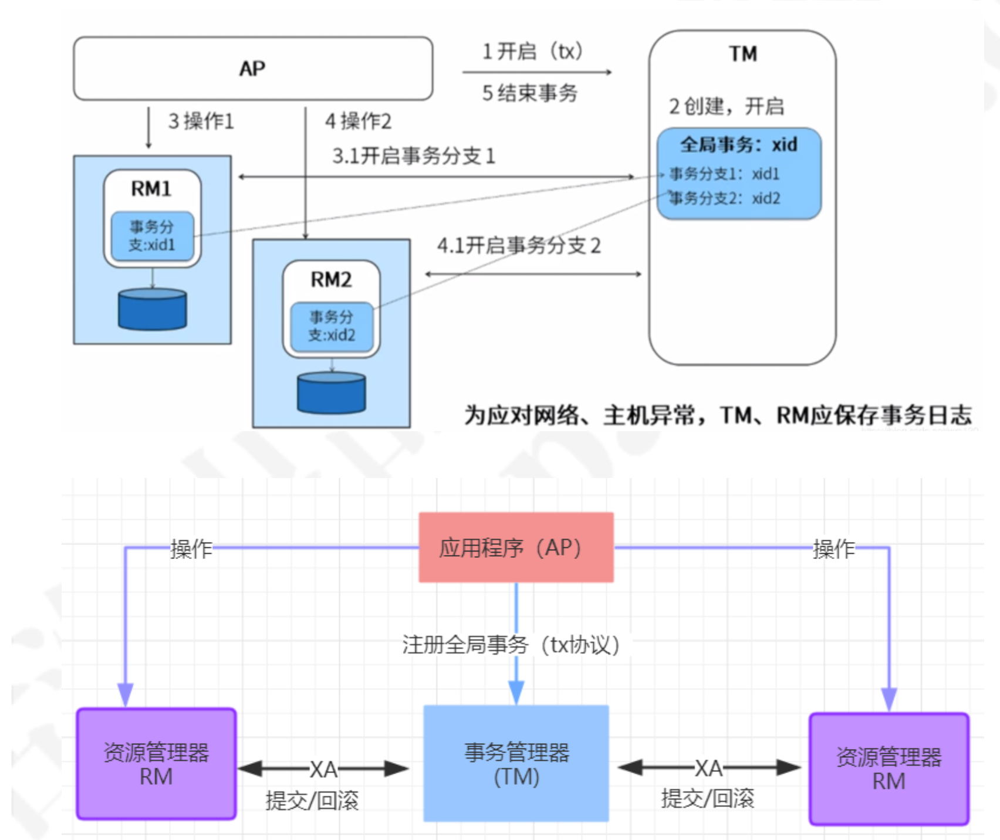
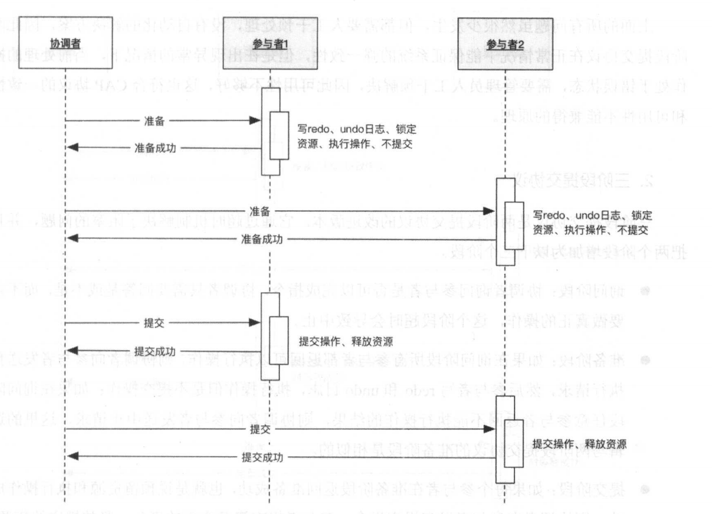
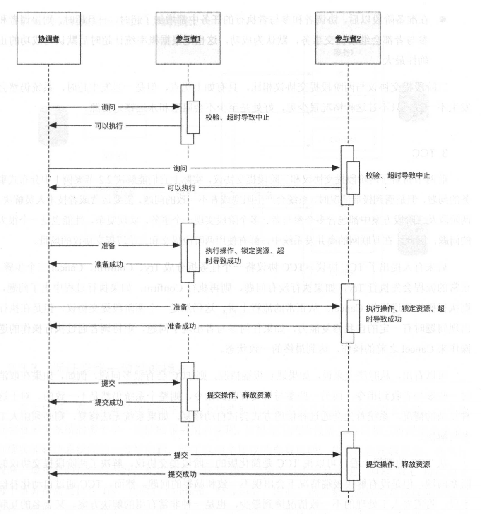

# 分布式事务

## X/OpenDTP角色

X/Open DTP(X/Open Distributed Transaction Processing Reference Model) 是X/Open这个组织定义

的一套分布式事务的标准，也就是定义了规范和API接口，由各个厂商进行具体的实现。 这个标准提出了使用**二阶段提交(2PC – Two-Phase-Commit)**来保证分布式事务的完整性。后来J2EE也遵循了X/OpenDTP规范，设计并实现了java里的分布式事务编程接口规范-JTA

在X/OpenDTP事务模型中，定义了三个角色
 AP: application, 应用程序，也就是业务层。哪些操作属于一个事务，就是AP定义的

RM: Resource Manager，资源管理器。一般是数据库，也可以是其他资源管理器，比如消息队列， 文件系统

TM: Transaction Manager ，事务管理器、事务协调者，负责接收来自用户程序(AP)发起的XA事务 指令，并调度和协调参与事务的所有RM(数据库)，确保事务正确完成

## 2PC两阶段提交

RM在第一阶段会做两件事:
  1.记录事务日志:reduo，undo
  2.返回给TM信息，ok、error
 存在问题: **如果第一阶段完成后TM宕机或网络出现故障了，此时RM会一直阻塞，发生了死锁，因为没 有timeout机制，3pc就针对此问题进行了改造，加入了timeout机制**

第二阶段：

根据第一个阶段的返回结果进行提交或者回滚

## 3PC两阶段提交

1）在2pc基础上增加了询问

2）在2pc基础上增加了超时

## CAP理论：

CAP的含义:

**C:Consistency 一致性** 同一数据的多个副本是否实时相同。

**A:Availability 可用性** 可用性:一定时间内 & 系统返回一个明确的结果 则称为该系统可用。

**P:Partition tolerance 分区容错性** 将同一服务分布在多个系统中，从而保证某一个系统宕机， 仍然有其他系统提供相同的服务。

CAP理论告诉我们，在分布式系统中，C、A、P三个条件中我们最多只能选择两个。那么问题来了，究 竟选择哪两个条件较为合适呢?

对于一个业务系统来说，可用性和分区容错性是必须要满足的两个条件，并且这两者是相辅相成的。业 务系统之所以使用分布式系统，主要原因有两个:

提升整体性能 当业务量猛增，单个服务器已经无法满足我们的业务需求的时候，就需要使用分布 式系统，使用多个节点提供相同的功能，从而整体上提升系统的性能，这就是使用分布式系统的第 一个原因。
 实现分区容错性 单一节点 或 多个节点处于相同的网络环境下，那么会存在一定的风险，万一该 机房断电、该地区发生自然灾害，那么业务系统就全面瘫痪了。为了防止这一问题，采用分布式系 统，将多个子系统分布在不同的地域、不同的机房中，从而保证系统高可用性。

这说明**分区容错性是分布式系统的根本**，如果分区容错性不能满足，那使用分布式系统将失去意义。

在互联网行业竞争激烈的今天，相同领域的 竞争者不甚枚举，系统的间歇性不可用会立马导致用户流向竞争对手。因此，我们只能通过牺牲一致性 来换取系统的**可用性**和**分区容错**

## Base理论：

CAP理论告诉我们一个悲惨但不得不接受的事实——我们只能在C、A、P中选择两个条件。而对于业务 系统而言，我们往往选择牺牲一致性来换取系统的可用性和分区容错性。不过这里要指出的是，所谓 的“牺牲一致性”并不是完全放弃数据一致性，而是牺牲**强一致性**换取**弱一致性**

**BA:Basic Available 基本可用** 整个系统在某些不可抗力的情况下，仍然能够保证“可用性”，即一定时间内仍然能够返回一个明确的结果。只不过“基本可用”和“高可用”的区别是:“一定时间”可以适当延长 当举行大促时，响应时间可以适当延长 给部分用户返回一个降级页面 给部分用户直接返回一个降级页面，从而缓解服务器压 力。但要注意，**返回降级页面仍然是返回明确结果**。

**S:Soft State:柔性状态** 同一数据的不同副本的状态，可以不需要实时一致。

**E:Eventual Consisstency:最终一致性** 同一数据的不同副本的状态，可以不需要实时一致，但 一定要保证经过一定时间后仍然是一致的。

## 分布式解决方案：

### 最大努力通知方案：

即重试n次。

### TCC两阶段补充方案：

TCC是Try-Confirm-Cancel， 比如在支付场景中，先冻结一笔资金，再去发起支付。如果支付成功，则将冻结资金进行实际扣除;如果支付失败，则取消资金冻结。

#### Try阶段

完成所有业务检查(一致性)，预留业务资源(准隔离性) 

#### Confirm阶段 

确认执行业务操作，不做任何业务检查，只使用Try阶段预留的业务资源。

#### Cancel阶段

取消Try阶段预留的业务资源。Try阶段出现异常时，取消所有业务资源预留请求

### 状态机：

什么是状态机?是一种特殊的组织代码的方式，用这种方式能够确保你的对象随时都知道自己所处的状 态以及所能做的操作。它也是一种用来进行对象行为建模的工具，用于描述对象在它的生命周期内所经 历的状态序列，以及如何响应来自外界的各种事件。

状态机这个概念大家都不陌生，比如TCP协议的状态机

1）实现幂等

2）通过状态驱动数据的变化

3）业务流程以及逻辑更加清晰，特别是应对复杂的业务场景

### 幂等：

简单来说:重复调用多次产生的业务结果与调用一次产生的业务结果相同; 在分布式架构中，我们调用 一个远程服务去完成一个操作，除了成功和失败以外，**还有未知状态，那么针对这个未知状态，我们会 采取一些重试的行**为; 或者在消息中间件的使用场景中，**消费者可能会重复收到消息**。对于这两种情 况，消费端或者服务端需要采取一定的手段，也就是考虑到重发的情况下保证数据的安全性。一般我们 常用的手段

1. 状态机实现幂等
2. 数据库唯一约束实现幂等
3. 通过tokenid的方式去识别每次请求判断是重复

## 最终一次性解决方案

### 1）查询模式：

所有的业务有流水号，查询所有业务的执行情况

### 2）补充模式：

根据查询模式的结果，实现业务回滚和补偿。

### 3）异步确保模式：

属于补充模式的一种，即保证主业务流程正常，然后异步通过消息通知其他业务进行操作

### 4）定期校验模式：

保证业务有全局ID，根据ID校验各业务，改服务一般是独立应用，一般用于金融行业，对账。

### 5）可靠消息模式：

在第异步确保模式下，发消息的时候假如写入数据库，即消息落地，且消息有状态。

