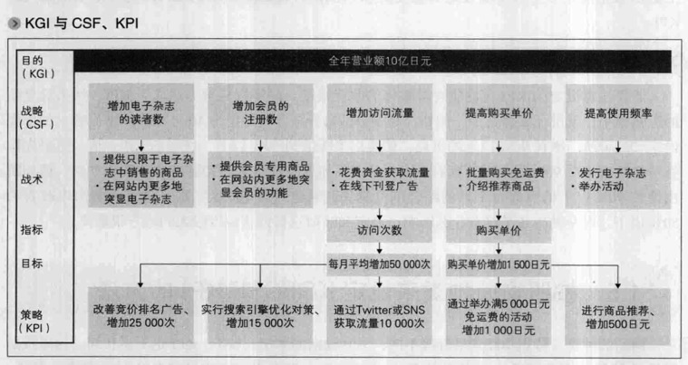
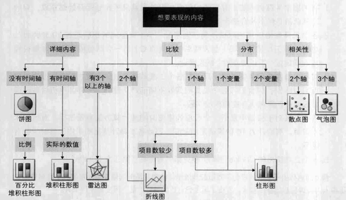

# 图解网站分析 让流量倍增的网站优化方法

作者：【日】小川卓

## 网站目标与KGI

进行网站分析首先要做的就是将目标可视化。

### KGI的设定方法：

> KGI (key goal indicator，关键性目标指标)。

设定对应的CSF和KPI：

如KGI设定为，营业额提高20%，那么CSF就是为提高营业额要做些神马。

### 设定KPI的注意事项：

1. 具备可行性
2. 变动因素小
3. 改善幅度大

## 网站分析主要指标：

- PV 浏览量
- 访问次数（会话数，总访问者数，访问数）
- 访问者数（唯一身份访问者数，UU数，独立用户数，独立浏览者数）
- 新访问者/回访者（第一次访问和第一次以上的访问）
- 转化（网站设定的任意目标，通常是到达特定的页面来判断）
- 跳转/退出/跳出（A->B，在A退出，A->old回退back）
- 停留时间

## 识别图表：

## 创建定期的监控报告：

1）对网站进行定期的检查和维修。

2）创造发现网站问题的契机。

本质就是定期生成报表，来核查网站是否健康等。

## 通过细分进行网站分析：

1. 按照流量来源分类
2. 按照搜索关键词分类
3. 按照入口页分类
4. 按照新访问者/回访者分类
5. 按照内容分类
6. 按照有无转化率分类