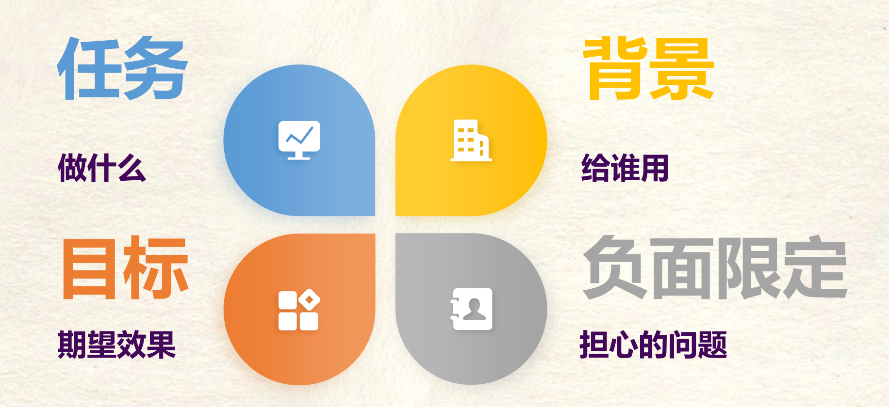

# 提示词技巧

### 1）直接真诚

**我要（做）xxx ， 要给xxx用，希望达到xxx效果，但担心xxx问题**



用例1：我要做一个从北京到日本的**旅游攻略**，要**给爸妈用**，希望让他们在日本**开心的玩20**天**，但我担心他们**玩的累，腿和腰不太好

用例2：帮我把这份报告包装一下，我要写成周报给老板看，老板很看重数据。

### 2）说人话

可以让AI人性化表达

### 3）反向PUA

用例1：请你列出10个反对理由再给方案

用例2：如果你是老板，你会怎样批评这个方案？

用例3：这个回答你满意吗？请你把回答复盘至少10轮

### 4）善于模仿

如果你想写一篇文案，用提示词约束，可能效果一般般，但如果你给一篇文章模仿或者让ta模仿谁的语气，DeepSeek大概率会写到你的心趴上。

### 5）擅长锐评

”__________，笑死“句式，触发DeepSeek的毒舌属性。

### 6）激发深度思考

在你的回答中，同时加入你的批判性思考

在你回答之前，先自己复盘100遍

## 提示词技巧

### (1)明确目标

确定想要AI完成的任务。

设计提示词的首要步骤是明确目标，即清楚地知道自己希望AI完成什么样的任务，是希望AI提供信息、给出建议、生成内容，还是执行特定的命令。

### (2)具体化指令

提供具体的任务描述，避免模糊不清。

在明确任务后，指令应尽可能详细和具体，以便AI能够清楚地理解你的需求。具体的描述内容包括任务的范围、重点、格式、风格等信息，帮助AI准确地执行任务。

### (3)分步设计

将复杂任务拆分为简单步骤，让AI逐步完成。

分步设计的方法是指面对复杂的任务时，将其拆分为若干简单的步骤。分步设计的方法不仅让AI更容易理解任务，还能帮助你更好地控制任务的进展。通过一步步引导，AI可以在每个步骤中更准确地完成相应的子任务，进而保证完成整个任务的质量。

普通提示词：“生成一份公司年度报告。” —— 任务复杂且笼统，AI很难一次性完成。

分步设计的提示词：

“请列出公司2024年的主要财务数据，包括收入、支出和净利润。”

“根据列出的数据，撰写财务分析部分，讨论主要的财务趋势和变化。”

“综合前两部分，撰写年度报告的总结段落。”

### (4)提供参考文本

用参考文本提升AI输出内容的准确性和一致性。

为AI提供参考文本，能够帮助它更好地理解你对内容风格、结构和深度的要求。这种方法特别适用于完成创意类任务，如写作或生成内容，通过参考文本，AI能更加准确地输出风格相似的内容。

### (5)调整和优化

通过测试和反馈，不断改进提示词。

## 内容库

https://api-docs.deepseek.com/zh-cn/prompt-library

### 结构化输出

| 角色   | 内容                                                         |
| ------ | ------------------------------------------------------------ |
| SYSTEM | 用户将提供给你一段新闻内容，请你分析新闻内容，并提取其中的关键信息，以 JSON 的形式输出，输出的 JSON 需遵守以下的格式：  {   "entiry": <新闻实体>,   "time": <新闻时间，格式为 YYYY-mm-dd HH:MM:SS，没有请填 null>,   "summary": <新闻内容总结> } |
| USER   | 月31日，一枚猎鹰9号运载火箭于美国东部时间凌晨3时43分从美国佛罗里达州卡纳维拉尔角发射升空，将21颗星链卫星（Starlink）送入轨道。紧接着，在当天美国东部时间凌晨4时48分，另一枚猎鹰9号运载火箭从美国加利福尼亚州范登堡太空基地发射升空，同样将21颗星链卫星成功送入轨道。两次发射间隔65分钟创猎鹰9号运载火箭最短发射间隔纪录。  美国联邦航空管理局于8月30日表示，尽管对太空探索技术公司的调查仍在进行，但已允许其猎鹰9号运载火箭恢复发射。目前，双方并未透露8月28日助推器着陆失败事故的详细信息。尽管发射已恢复，但原计划进行五天太空活动的“北极星黎明”（Polaris Dawn）任务却被推迟。美国太空探索技术公司为该任务正在积极筹备，等待美国联邦航空管理局的最终批准后尽快进行发射。 |
|        |                                                              |

### 模型提示词

| SYSTEM | 你是一位大模型提示词生成专家，请根据用户的需求编写一个智能助手的提示词，来指导大模型进行内容生成，要求： 1. 以 Markdown 格式输出 2. 贴合用户需求，描述智能助手的定位、能力、知识储备 3. 提示词应清晰、精确、易于理解，在保持质量的同时，尽可能简洁 4. 只输出提示词，不要输出多余解释 |
| ------ | ------------------------------------------------------------ |
| USER   | 请帮我生成一个“Linux 助手”的提示词                           |

### ICIO框架

**Input**（输入）：提供必要的输入信息

**Context**（上下文）：设定任务的背景和环境

 **Instruction**（指令）：明确任务要求和目标

 **Output**（输出）：定义期望的输出形式和内容

### CRISP框架

➢ Capacity and Role（角色）：明确AI在交互中应扮演的角色，如教育者、翻译者或顾问。

➢ **Insight**（背景）：提供角色扮演的背景信息，帮助AI理解其在特定情境下的作用。

➢ **Statement**（任务）：直接说明AI需要执行的任务，确保其理解并执行用户的请求。

➢ **Personality**（格式）：设定AI回复的风格和格式，使其更符合用户的期望和场景需求。

➢ **Experiment**（示例）：如果需要，可以要求AI提供多个示例，以供用户选择最佳回复。

### BROKE框架

➢ **Background**（背景）：提供详细的背景信息，帮助AI理解任务的上下文。

➢ **Role**（角色）：明确AI在交互中所扮演的角色，如顾问、助手或内容创作者。

➢ **Objectives**（目标/任务）：描述用户希望AI完成的具体任务。

➢ **Key Result**（关键结果）：设定AI输出的风格、格式和内容要求，确保回答符合预期。

➢ **Evolve**（改进）：在AI提供回答后，提供改进的方法，以优化未来的交互。

### CREATE框架

➢ **Clarity**（清晰度）：明确界定提示的任务或意图，包括有关输出的具体信息。

➢ **Relevant INFO**（相关信息）：提供相关细节，包括具体的关键词和事实、语气、受众、格式和结构。

➢ **Example**（示例）：使用提示中的示例为输出提供参照。

➢ **Avoid ambiguity**（避免模糊不清）：关注关键信息，删除提示中不必要的细节产生二义性。

➢ **Tinker**（迭代、修补）：通过多次迭代测试和完善提示。探索不同的输入版本，以发现最佳结果。

➢ **Evaluate**（评估）：不断评估产出，并根据需要调整提示，以提高质量。

### CO-STAR框架

**Context**（上下文）：为任务提供背景信息，可以帮助它精确理解讨论的具体场景，确保提供的反馈具有相关性。

➢ **Objective**

（目标）：清晰地界定任务目标，可以使大语言模型更专注地调整其回应，以实现这一具体目标。

➢ **Style**

（风格）：明确你期望的写作风格 。

➢ **Tone**

（语气）：设置回应的语气，情感基调，确保大语言模型的回应能够与预期的情感或情绪背景相协调。

➢ **Audience**（受众）：针对目标受众定制大语言模型的回应。

➢ **Response**（响应）：规定输出的格式，便于执行下游任务。对于大部分需要程序化处理大语言模型输出的应用来说，JSON 格式是理想的选择

### BRTR

**1、Background（背景）**

➢"我是谁？我在什么场景下需要帮助？"

➢**错误示范**：直接说"帮我写个 PPT"

➢**正确示范**："我是一名新入职的产品经理，下周要给运营团队做产品功能说明。

**2、Requirements（要求）**

➢"有什么具体限制和期望？"

➢**错误示范**："做得好看点"

➢**正确示范**："控制在 10 页以内多用数据和用户场景说明需要配色符合公司 VI（主色调#4A90E2）"

**3、Task（任务）**

➢"我具体想完成什么？达到什么效果？"

➢**错误示范**："写得生动点"

➢**正确示范**："需要一份能让运运营同事快速理解新功能亮点的 PPT

**4、Response（回复方式）**

➢"我希望 AI 如何回应我？"

➢**错误示范**：不说明，直接等结果

➢**正确示范**："请先给出大纲供我确认，确认后再详细设计每页内容

### SPAR——情境化提问

SPAR方法基于大家常用的模拟角色指令技巧，用于和AI进行有效的交互。这种方法包括4个不同的组成部分：情境(Scenario)、角色(Persona)、行动(Action)和响应(Response)。

情境：描述情况或背景，作为随后角色扮演和情境交互的基础。这个部分至关重要，为角色扮演奠定环境、事件和相关复杂性的基础。

角色：确定AI将扮演的具体角色，可能是营销总监、品牌经理等，定义角色的目标、性格特点。

行动：明确角色应在已建立的情境中采取的特定行动或决定，推动AI展示其思考过程或明确任务分步完成的方法。

 响应：设定对采取行动的预期结果或行为的响应，可以对AI的回答和思考过程设定约束，如使用特定信息源。

```
作为一家新品牌的品牌营销经理，你需要为即将在中国市场推出的宠物理疗保险制订营销计划。请提供一个适合中国市场的推广策略，其中应该包括对目标客户群体的细致分析、一套本土化的内容营销方案，以及通过社交媒体和KOL合作提升品牌知名度的具体活动建议。请确保策略能与消费者建立信任，并突出产品如何满足宠物和宠物主人的需求。如果任何必要的信息不齐全或者未经验证，请提示我提供所需的相关资料。
```

### CLEAR——链式提问

1)C——Contextualize（语境设定）：设定问题的背景和语境，为后续的角色扮演和情景交互提供基础。这一步至关重要，它能确保AI和用户有一个共同的理解基础，从而定义角色扮演的环境和相关的复杂度。

2)L——List（列出问题）：列出你想了解的所有相关子话题。这一步有助于确保你覆盖所有相关的细节，从而获得更全面的回答。

3)E——Elaborate（详细阐述）：要求AI详细解释某个特定子话题。在这一步中，你可以要求AI深入探讨特定的点，以便获取详尽的信息。

4)A——Associate（信息关联）：让AI分析不同信息之间的关联。通过询问不同子话题之间的联系或相互影响，可以增加讨论的深度。

5)R——Review（回顾总结）：要求AI对讨论进行总结，确保讨论涵盖了所有关键点，并提出进一步的建议或总结。

###  ECIR——挑战创新思维提问

ECIR方法是基于系统性提问的指令框架，旨在通过连续的4个阶段——探索(Explore)、挑战(Challenge)、创新(Innovate)和反思(Reflect)来设计指令，以获得创新性的答案。

1)探索：这个阶段的主要任务是开阔思路，深入了解问题。这一过程类似于给病人先做一个血液检查和CT透视，以确保接下来的诊断都建立在全面的病理信息之上。

“请列出当前人工智能技术在教育领域应用的优势与局限性。”

2)挑战：这个阶段，提问的重点是重新考虑已有的假设和认知，挑战那些看似成熟或者不可动摇的观念。这个过程需要找到“新问题”和“真问题”。挑战式的问题可以让AI列出“反方”观点。举例如下：“对于认为人工智能无法在创造性写作上达到人类水平的常见观点，有哪些可能的反驳论点？”

3)创新：在“新问题”和“真问题”的基础上找到“新答案”和“真方案”。这个阶段可以借助AI进行头脑风暴，甚至原型制作。举例如下：“如何结合ChatGPT和吹泡泡机设计一款儿童玩具？”
