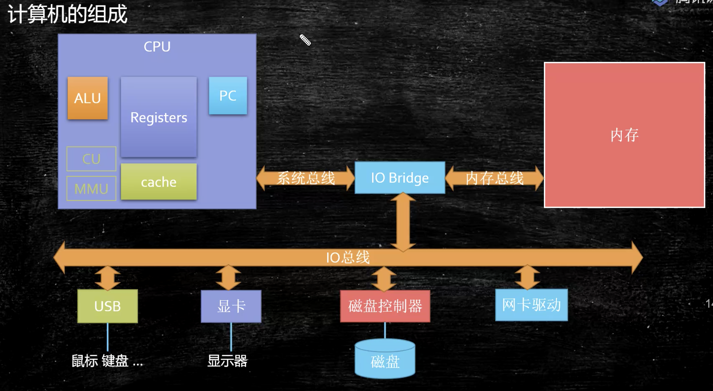

# 操作系统

## 进程，线程，纤(协)程(Fiber)

为什么需要协程？

线程开启数量有限，协程，是用户态线程，在调度和切换的时候不需要经过os.

优势：1：占有资源很少 OS : 线程1M Fiber：4K; 2：切换比较简单 ;3：启动很多个10W+

## 原码，反码，补码

1 + (-1)

### 原码：

二进制，最高位标识正负 1表示负数

0000001

1000001

1000010  = -2

### 反码：

保留最高位的符号位 正数不变，如果是负数，则全部全部取反

0000001

1111110 反码

1111111 =  -0

### 补码：

正数不变，负数，则对反码加1,在补码中用(-128)代替 了(-0),所以补码的表示范围为 – (-128~0~127),共256个

0000001

1111111 补码

0000000  正确

所以补码的设计目的是： 

1） 使符号位能与有效值部分一起参加运算，从而简化运算规则 

2）使减法运算转换为加法运算，进一步简化计算机中运算器的线路设计