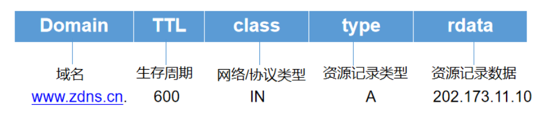

## 简介：

源于：慕课网，讲师：Jeson

开源，稳定的DNS服务。域名解析服务。

https://www.cnblogs.com/crazymakercircle/p/14976612.html

## Bind服务：

www.bigbig.me.

.根域  me 一级域名  bigbig.me 二级域名

A记录：标准的 域名->IP地址

CNANE记录：域名->域名->IP地址  如www.bigbig.me —> bigbig.me -> 1.0.0.1(A记录) 用于多个域名指向同一个域名www.img.bigbig.me —>img1.aliyun.con ->10.0.1

准许一个域名，用另外运营商解析A记录。

MX记录：邮件服务的解析。

NS记录：域名->DNS解析服务->IP地址。

### 安装：

yum install bind bind-chroot

rpm -qa | grep bind

rpm -ql bind | more 查看安装哪些文件内容

/etc/init.d/named start

### 配置：

options{} 整个bind的全局选项

logging{} 日志

zone{} DNS域名解析

zooe "bigbig.me"{

​	type master;

​	file "bigbig.me.zone"

};

//bigbig.me.zone配置

$TTL 7200 //生效时间

@ IN SOA bigbig.me. **borgxiao.bigbig.me.** (101 1H 15M 1W 1D)  加粗的为邮箱，因为@为特殊字符换成点 SOA权威解析记录

bigbig.me. IN NS dns1.bigbig,me.

dns1 IN A 10.0.0.1

www IN A 2.2.2.2

### 测试：

dig @10.0.0.1 www.bigbig.me  查找DNS服务10.0.0.1的www.bigbig.me

正向解析：A记录

反向解析：PTR记录

配置DNS:/etc/resolv.conf

nslookup:通用，window支持

➜  bin nslookup www.bigbig.me
Server:		120.196.165.24
Address:	120.196.165.24#53

Non-authoritative answer:
Name:	www.bigbig.me
Address: 119.23.59.238

dig：专业

host:简单明了

➜  bin host -t NS www.bigbig.me
www.bigbig.me has no NS record

➜  bin host -t A www.bigbig.me
www.bigbig.me has address 119.23.59.238
➜  bin host www.bigbig.me
www.bigbig.me has address 119.23.59.238

## Bind负载均衡：

### DNS转发：

递归查询：client->server,然后server递归查询 一次请求得到结果

迭代查询：server->server1->server2->…结果 多次请求得到结果

recursion:yes/no 是否准许递归

forwarders

### DNS主从模式：

区域：正向，反向。全量区域传输，增量区域传输。

### DNS传输限制：

基于主机传输限制。

DES:对称加密，加密和解密用相同的密钥，简单快捷

IDEA:非对称加密  公钥，私钥，安全性高


## 智能DNS:

即，电信的访问电信，联通访问联通。。

1，减少动态服务的响应时间。

2，CDN加速。

3，负载均衡。

4，防止DDOS攻击。

通过IP库来实现。APINC。

DNS信息污染。因为使用的是UDP。

## DNS资源目录



记录一条域名信息映射关系，称之为资源记录（RR）。当我们查询域名www.zdns.cn的时候，查询结果得到的资源记录结构体中有如下数据：

- TTL，就是生存周期，是递归服务器会在缓存中保存该资源记录的时长。
- 网络/协议类型，它的代表的标识是IN，IN就是internet，目前DNS系统主要支持的协议是IN。
- type，就是资源记录类型，一般的网站都是都是A记录（IPv4的主机地址）。
- rdata是资源记录数据，就是域名关联的信息数据。

每个区域（Zone）数据库文件都是由资源记录（RR）构成的，一个资源记录就是一行文本，提供了一组有用的 DNS 配置信息。在DNS系统中，最常见的资源记录是Internet类记录，该记录由包含4个字段的数据构成：Name、Value、Type、TTL。其中Name和Value可以理解为一对键值对，但是其具体含义取决于Type的类型，TTL记录了该条记录应当从缓存中删除的时间。

常见的资源记录类型如表所示。

| 类型  | 编码 | 内容                                                         |
| :---- | :--- | :----------------------------------------------------------- |
| A     | 1    | 将 DNS 域名映射到 IPv4 地址，基本作用是说明一个域名对应了哪些 IPv4 地址 |
| NS    | 2    | 权威名称服务器记录，用于说明这个区域有哪些 DNS 服务器负责解析 |
| CNAME | 5    | 别名记录，主机别名对应的规范名称                             |
| SOA   | 6    | 起始授权机构记录，NS 记录说明了有多台服务器在进行解析，但哪一个才是主服务器，NS 并没有说明，SOA 记录了说明在众多 NS 记录里哪一台才是主要的服务器 |
| PTR   | 12   | IP 地址反向解析，是 A 记录的逆向记录，作用是把 IP 地址解析为域名 |
| MX    | 15   | 邮件交换记录，指定负责接收和发送到域中的电子邮件的主机       |
| TXT   | 16   | 文本资源记录，用来为某个主机名或域名设置的说明               |
| AAAA  | 28   | 将 DNS 域名映射到 IPv6 地址，基本作用是说明一个域名对应了哪些 IPv6 地址 |

### **CNAME :**

通常称别名指向您可以为一个主机设置别名。
比如设置 test.mydomain.com，用来指向一个主机www.rddns.com ,那么以后就可以用test.mydomain.com来代替访问www.rddns.com了。

说明：·

- CNAME的目标主机地址只能使用主机名，不能使用IP地址；
- 主机名前不能有任何其他前缀，如：[http://等是不被允许的](http://xn--ihqx1fh8z53oltfnpwi2e/)；
- A记录优先于CNAME记录。即如果一个主机地址同时存在A记录和CNAME记录，则CNAME记录不生效。

### NS：

服务器解析记录, 用来表明由哪台服务器对该域名进行解析。这里的NS记录只对子域名生效。

例如用户希望由12.34.56.78 这台服务器解析 news.mydomain.com，则需要设置 news.mydomain.com 的NS记录。

说明：

- “优先级”中的数字越小表示级别越高；
- “IP地址/主机名”中既可以填写IP地址，也可以填写像 ns.mydomain.com 这样的主机地址，但必须保证该主机地址有效。

> 如，将news.mydomain.com的NS记录指向到 ns.mydomain.com，在设置NS记录的同时还需要设置ns.mydomain.com的指向，否则NS记录将无法正常解析；

- NS记录优先于A记录。

```shell
➜  ~ nslookup www.scrm.com
Server:		192.168.1.197
Address:	192.168.1.197#53

Non-authoritative answer:
www.scrm.com	canonical name = 31a42839a612735be0e8a34719aa955d.qcloudzygj.com.
31a42839a612735be0e8a34719aa955d.qcloudzygj.com	canonical name = b89884c7a07675ca-cl2.qcloudcjgj.com.
Name:	b89884c7a07675ca-cl2.qcloudcjgj.com
Address: 81.69.64.51
```


## DNS解析过程

1、缓存查找IP

2、本机的hosts文件查找IP

3、DNS服务器查找IP

```shell
➜  ~ dig www.scrmc.om

; <<>> DiG 9.10.6 <<>> www.scrmc.om
;; global options: +cmd
;; Got answer:
;; ->>HEADER<<- opcode: QUERY, status: NXDOMAIN, id: 24675
;; flags: qr rd ra; QUERY: 1, ANSWER: 0, AUTHORITY: 1, ADDITIONAL: 1

;; OPT PSEUDOSECTION:
; EDNS: version: 0, flags:; udp: 4000
;; QUESTION SECTION:
;www.scrmc.om.			IN	A

;; AUTHORITY SECTION:
om.			900	IN	SOA	ns1.registry.om. dnsmanager.tra.gov.om. 1652418278 86400 7200 3600000 3600

;; Query time: 101 msec
;; SERVER: 192.168.1.197#53(192.168.1.197)
;; WHEN: Fri May 13 14:45:23 CST 2022
;; MSG SIZE  rcvd: 109
```

**dig  域名 +trace**
