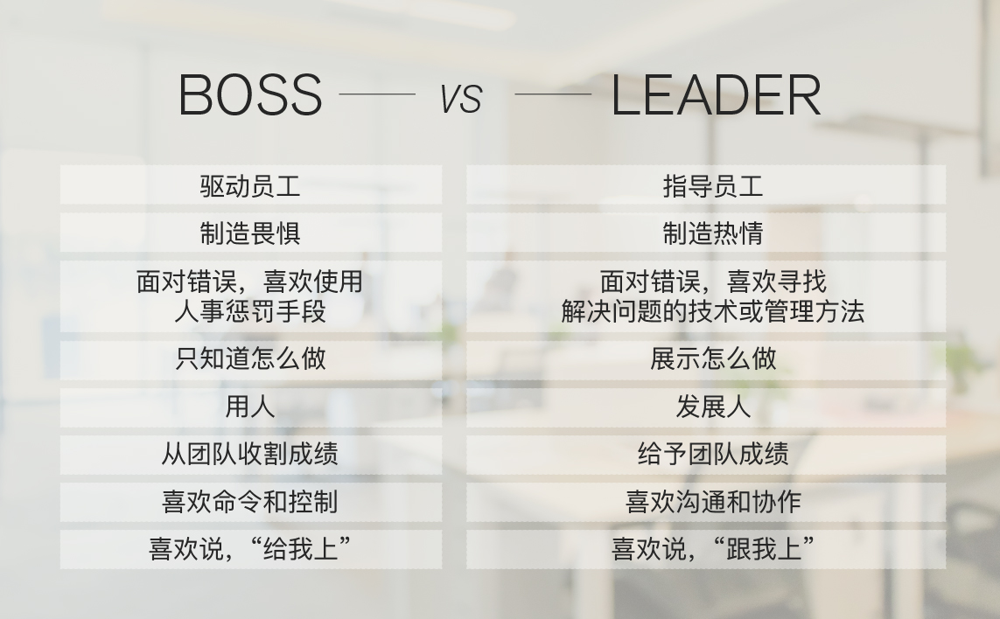

typora-copy-images-to: ./images/TokenBucket.png

# 服务架构设计

1）极客时间《从0开始学架构》李运华

1）极客时间《左耳听风》陈皓

## 架构设计目的和误区

1）通过熟悉和理解需求，识别系统复杂性所在的地方，然后针对这些复杂点进行架构设计

2）架构设计并不是要面面俱到，不需要每个架构都具备高性能、高可用、高扩展等特点，而是要识别出复杂点然后有针对性地解决问题。

3）理解每个架构方案背后所需要解决的复杂点，然后才能对比自己的业务复杂点，参考复杂点相似的方案。**有的放矢，而不是贪大求全**。

4）如果系统的复杂度不是在性能这部分，TPS 做到 10 万并没有什么用。

5）Docker 不是万能的，只是为了解决资源重用和动态分配而设计的，如果我们的系统复杂度根本不是在这方面，引入 Docker 没有什么意义。

### 复杂度来源：

1）高性能

2）高可用，

3）可扩展性

4）低成本，安全，规模

### 设计原则

1）**合适原则**，一定要结合自身实际情况

2）**简单原则**，在满足要求的情况下，设计约简单越好

3）**演化原则**，罗马不是一天建成的。

### 设计流程

1）识别负责度，分业务复杂度，技术难点，团队人员，公司现有技术架构等

2）设计备选方案

3）评估和对比备选方案

常见的方案质量属性点有：性能、可用性、硬件成本、项目投入、复杂度、安全性、可扩展性等


## 数据库设计

### 数据读写分离

- 数据库服务器搭建主从集群，一主一从、一主多从都可以。
- 数据库主机负责读写操作，从机只负责读操作。
- 数据库主机通过复制将数据同步到从机，每台数据库服务器都存储了所有的业务数据。
- 业务服务器将写操作发给数据库主机，将读操作发给数据库从机。

带来的难点问题：

#### 主从复制延迟

解决方案：

1）写操作后的读操作指定发给数据库主服务器，代码侵入性高，新人很容易掉坑。个人意见，如果已经拿到了写入的连接，那进行读的时候，不应该有切换连接动作

2）读从机失败后再读一次主机，何为失败？如果是写入还好，更新的是不好判定失败的

3）关键业务读写操作全部指向主机，非关键业务采用读写分离

#### 分配机制

将读写操作区分开来，然后访问不同的数据库服务器，一般有两种方式：**程序代码封装**和**中间件封装**。

##### 程序代码封装

- 实现简单，而且可以根据业务做较多定制化的功能。
- 每个编程语言都需要自己实现一次，无法通用，如果一个业务包含多个编程语言写的多个子系统，则重复开发的工作量比较大。
- 故障情况下，如果主从发生切换，则可能需要所有系统都修改配置并重启。

1）淘宝的 `TDDL`（Taobao Distributed Data Layer，外号: 头都大了）

基于集中式配置的 jdbc datasource 实现，具有主备、读写分离、动态数据库配置等功能

https://www.jianshu.com/p/488757cff084?from=singlemessage

##### 中间件封装

- 能够支持多种编程语言，因为数据库中间件对业务服务器提供的是标准 SQL 接口。
- 数据库中间件要支持完整的 SQL 语法和数据库服务器的协议（例如，MySQL 客户端和服务器的连接协议），实现比较复杂，细节特别多，很容易出现 bug，需要较长的时间才能稳定。
- 数据库中间件自己不执行真正的读写操作，但所有的数据库操作请求都要经过中间件，中间件的性能要求也很高。
- 数据库主从切换对业务服务器无感知，数据库中间件可以探测数据库服务器的主从状态。例如，向某个测试表写入一条数据，成功的就是主机，失败的就是从机。

1） MySQL Proxy

2）MySQL Router

3）Atlas(奇虎 360)，Atlas 是基于 MySQL Proxy 实现的

### 分库分表

- 数据量太大，读写的性能会下降，即使有索引，索引也会变得很大，性能同样会下降。
- 数据文件会变得很大，数据库备份和恢复需要耗费很长时间。
- 数据文件越大，极端情况下丢失数据的风险越高（例如，机房火灾导致数据库主备机都发生故障）。

#### 业务分库

符合微服务思想，不同业务，不同库

1）join问题，只能分拆查询，即先查询主要的，然后拿ID去其它地方查询

2）事务问题。--->分布式事务

3）成本问题，如果不同业务一个库，一个库一台机器，成本激增

#### 分表

单表数据拆分有两种方式：**垂直分表**和**水平分表**

垂直分表适合将表中某些不常用且占了大量空间的列拆分出去，带来的问题，就是操作表多了一些(还能接受)

水平分表，带来的问题，就是如何路由，分表后的查询join, count，order by操作等，这种如果真需要，一般是分了几张，就分别查询，然后通过程序聚合。

### NoSQL

- 关系数据库存储的是行记录，无法存储数据结构
- 关系数据库的 schema 扩展很不方便
- 关系数据库在大数据场景下 I/O 较高
- 关系数据库的全文搜索功能比较弱

NoSQL 方案带来的优势，本质上是牺牲 ACID 中的某个或者某几个特性，**因此我们不能盲目地迷信 NoSQL 是银弹，而应该将 NoSQL 作为 SQL 的一个有力补充**，NoSQL != No SQL，而是 NoSQL = Not Only SQL。

#### Redis

K-V 存储：解决关系数据库无法存储数据结构的问题

#### MongoDB

文档数据库：解决关系数据库强 schema 约束的问题

为了解决关系数据库 schema 带来的问题，文档数据库应运而生。文档数据库最大的特点就是 no-schema，可以存储和读取任意的数据。目前绝大部分文档数据库存储的数据格式是 JSON（或者 BSON），因为 JSON 数据是自描述的，无须在使用前定义字段，读取一个 JSON 中不存在的字段也不会导致 SQL 那样的语法错误。

#### HBase

列式数据库：解决关系数据库大数据场景下的 I/O 问题

#### Elasticsearch

全文搜索引擎：解决关系数据库的全文搜索性能问题


## 缓存设计

### 缓存问题

#### 热点数据

静态热点数据：可以被提前预知的数据

动态热点数据：不能被提前预知的数据

热点数据的隔离也是—种保护机制:**不能因为数据访问量过大而造成整个业务的崩溃**。

#### 缓存穿透

**缓存穿透**是指缓存没有发挥作用，业务系统虽然去缓存查询数据，但缓存中没有数据，业务系统需要再次去存储系统查询数据，

1）存储数据不存在，一般的做法，就是缓存一个空值或者特定值进去。

2）缓存数据生成耗费大量时间或者资源，即缓存没有，但这个时候重新读取数据成本极高，目前无解，只能根据不同的业务适当调整时间，或者提前缓存好数据等。

#### 缓存雪崩

**缓存雪崩**是指当缓存失效（过期）后引起系统性能急剧下降的情况。当缓存过期被清除后，业务系统需要重新生成缓存，因此需要再次访问存储系统，再次进行运算，这个处理步骤耗时几十毫秒甚至上百毫秒

1）对缓存更新操作进行加锁保护，保证只有一个线程能够进行缓存更新，未能获取更新锁的线程要么等待锁释放后重新读取缓存，要么就返回空值或者默认值。

2）由后台线程来更新缓存，而不是由业务线程来更新缓存，缓存本身的有效期设置为永久，后台线程定时更新缓存。

3）缓存过期时间随机，避免同一时刻失效

#### 缓存热点

虽然缓存系统本身的性能比较高，但对于一些特别热点的数据，如果大部分甚至所有的业务请求都命中同一份缓存数据，则这份数据所在的缓存服务器的压力也很大。

**缓存热点的解决方案就是复制多份缓存副本，将请求分散到多个缓存服务器上，减轻缓存热点导致的单台缓存服务器压力**。

### 缓存设计

#### 缓存分类

1）访问位置

本地缓存：客户端缓存，CDN缓存，反向代理缓存，应用程序缓存

远程缓存：redis,memcached

2）存储介质

内存缓存，SSD缓存


#### Cache Aside更新模式

- **失效**：应用程序先从 Cache 取数据，如果没有得到，则从数据库中取数据，成功后，放到缓存中。
- **命中**：应用程序从 Cache 中取数据，取到后返回。
- **更新**：先把数据存到数据库中，成功后，再让缓存失效。

1）数据写入：写入到mysql

2）数据读取：先读取cache，如没有，读取mysql，然后写入缓存

3）数据更新：更新mysql, 设置cache过期/清理缓存

#### Read/Write Through更新模式

Through：通过

Read Through 套路就是在查询操作中更新缓存，也就是说，当缓存失效的时候（过期或 LRU 换出），Cache Aside 是由调用方负责把数据加载入缓存，而 Read Through 则用缓存服务自己来加载，从而对应用方是透明的。

Write Through 套路和 Read Through 相仿，不过是在更新数据时发生。当有数据更新的时候，如果没有命中缓存，直接更新数据库，然后返回。如果命中了缓存，则更新缓存，然后由 Cache 自己更新数据库（这是一个同步操作）。

可以理解为：本身缓存服务就是一个代理服务，即 前端对接的是缓存服务，原先的db服务不动，而是置于缓存服务的后面，由缓存代理访问

1）数据写入/更新：先查询缓存有没有，如果有，则更新缓存/清理掉缓存，然后再调用正常的数据写入/更新服务去更新数据

2）数据查询，查询的就是 缓存服务，如果没有缓存，则缓存服务去 其他服务拿数据，缓存。

#### Write Behind Caching更新模式

Write Back 套路就是，在更新数据的时候，只更新缓存，不更新数据库，而我们的缓存会异步地批量更新数据库。这个设计的好处就是让数据的 I/O 操作飞快无比（因为直接操作内存嘛）。因为异步，Write Back 还可以合并对同一个数据的多次操作，所以性能的提高是相当可观的。

#### 缓存淘汰

FIFO：是英文First In First Out的缩写，是一种先进先出的数据缓存器

LFU：Least Frenquently Used 最近最少频率使用策略

LRU：The Least Recently Used，最近最久未使用算法

策略：

1）定时删除策略：通过定时任务，规定时间检查并删除过期的KEY

2）定期删除策略：不定期统一清理

3）惰性删除策略：使用的时候判断key是否过去(可以通过value中添加时间判断)

#### 一致性hash分片

0- 2 32次方-1 的分片，取最近的

#### 缓存架构部署思考点

分池访问:对于核心的高并发访问的数据 将其拆分到不同的缓存池中进行分开访问避免相互影响

分层访问:对于访问量为100万到100万级的业务数据’最好进行分层访问，并且要分摊访问量，避免缓存过载。

多IDC部署:如果业务系统被要求采用多IOC部署

 缓存组件组台:在某些极端场景下,还需要组台使用多种缓存组件通过缓存异构达到最佳读写性能.

 运维监控:


## 应用本身

### IO优化

#### PPC

PPC 是 Process Per Connection 的缩写，其含义是指每次有新的连接就新建一个进程去专门处理这个连接的请求，这是传统的 UNIX 网络服务器所采用的模型

#### TPC

TPC 是 Thread Per Connection 的缩写，其含义是指每次有新的连接就新建一个线程去专门处理这个连接的请求

## 集群

### 负载均衡

#### **DNS 负载均衡**


#### **硬件负载均衡**

F5 和 A10

#### **软件负载均衡**

Nginx 和 LVS

### CAP理论

在一个分布式系统（指互相连接并共享数据的节点的集合）中，当涉及读写操作时，只能保证一致性（Consistence）、可用性（Availability）、分区容错性（Partition Tolerance）三者中的两个，另外一个必须被牺牲。

#### C)一致性（Consistence）

#### A)可用性（Availability）

#### P)分区容错性（Partition Tolerance）

### ACID事务理论

ACID 是数据库管理系统为了保证事务的正确性而提出来的一个理论，ACID 包含四个约束，下面我来解释一下。

#### 1.Atomicity（原子性）

一个事务中的所有操作，要么全部完成，要么全部不完成，不会在中间某个环节结束。事务在执行过程中发生错误，会被回滚到事务开始前的状态，就像这个事务从来没有执行过一样。

#### 2.Consistency（一致性）

在事务开始之前和事务结束以后，数据库的完整性没有被破坏。

#### 3.Isolation（隔离性）

数据库允许多个并发事务同时对数据进行读写和修改的能力。隔离性可以防止多个事务并发执行时由于交叉执行而导致数据的不一致。事务隔离分为不同级别，包括读未提交（Read uncommitted）、读提交（read committed）、可重复读（repeatable read）和串行化（Serializable）。

#### 4.Durability（持久性）

事务处理结束后，对数据的修改就是永久的，即便系统故障也不会丢失。

### BASE理论

BASE 是指基本可用（Basically Available）、软状态（ Soft State）、最终一致性（ Eventual Consistency），核心思想是即使无法做到强一致性（CAP 的一致性就是强一致性），但应用可以采用**适合的方式达到最终一致性**。

BASE 理论本质上是对 CAP 的延伸和补充，更具体地说，**是对 CAP 中 AP 方案的一个补充**。

#### 1. 基本可用（Basically Available）

分布式系统在出现故障时，允许损失部分可用性，即保证核心可用。

#### 2.软状态（Soft State）

允许系统存在中间状态，而该中间状态不会影响系统整体可用性。这里的中间状态就是 CAP 理论中的数据不一致。

#### 3. 最终一致性（Eventual Consistency）

系统中的所有数据副本经过一定时间后，最终能够达到一致的状态。

### FMEA故障隐患排除方法

FMEA（Failure mode and effects analysis，故障模式与影响分析）又称为失效模式与后果分析、失效模式与效应分析、故障模式与后果分析等

在架构设计领域，FMEA 的具体分析方法是：

- 给出初始的架构设计图。
- 假设架构中某个部件发生故障。
- 分析此故障对系统功能造成的影响。
- 根据分析结果，判断架构是否需要进行优化。


## 分布式监控

- **关注于整体应用的 SLA**。主要从为用户服务的 API 来监控整个系统。
- **关联指标聚合**。 把有关联的系统及其指标聚合展示。主要是三层系统数据：基础层、平台中间件层和应用层。
- **快速故障定位**。

### 监控设计关注点

1）体检

- **容量管理**。 提供一个全局的系统运行时数据的展示，可以让工程师团队知道是否需要增加机器或者其它资源。
- 性能管理。可以通过查看大盘，找到系统瓶颈，并有针对性地优化系统和相应代码。

2）急症

- **定位问题**。可以快速地暴露并找到问题的发生点，帮助技术人员诊断问题。
- **性能分析**。当出现非预期的流量提升时，可以快速地找到系统的瓶颈，并帮助开发人员深入代码。

### 多层体系监控

- **基础层**：监控主机和底层资源。比如：CPU、内存、网络吞吐、硬盘 I/O、硬盘使用等。
- **中间层**：就是中间件层的监控。比如：Nginx、Redis、ActiveMQ、Kafka、MySQL、Tomcat 等。
- **应用层**：监控应用层的使用。比如：HTTP 访问的吞吐量、响应时间、返回码，调用链路分析，性能瓶颈，还包括用户端的监控。


## 分布式调度算法

### Paxos算法

Paxos 算法，是莱斯利·兰伯特（Lesile Lamport）于 1990 年提出来的一种基于消息传递且具有高度容错特性的一致性算法

### Raft算法

Raft 把这个一致性的算法分解成了几个部分，一个是领导选举（Leader Selection），一个是日志复制（Log Replication），一个是安全性（Safety），还有一个是成员变化（Membership Changes）。对于一般人来说，Raft 协议比 Paxos 的学习曲线更低，也更平滑。

### Gossip协议

## 分布式弹性设计

### 隔离设计

1）我们需要定义好隔离业务的大小和粒度

2）无论是做系统版块还是多租户的隔离，你都需要考虑系统的复杂度、成本、性能、资源使用的问题，找到一个合适的均衡方案，或是分布实施的方案尤其重要，这其中需要你定义好要什么和不要什么。因为，我们不可能做出一个什么都能满足的系统

3）隔离模式需要配置一些高可用、重试、异步、消息中间件，流控、熔断等设计模式的方式配套使用。

4）不要忘记了分布式系统中的运维的复杂度的提升，要能驾驭得好的话，还需要很多自动化运维的工具

5）需要一个非常完整的能够看得到所有服务的监控系统


### 异步通讯设计

1）请求响应式：A->B,B直接返回，然后异步处理；对于返回结果，有两种方法，一种是发送方时不时地去轮询一下，问一下干没干完。另一种方式是发送方注册一个回调方法，也就是接收方处理完后回调请求方

2）通过订阅的方式：接收方（receiver）会来订阅发送方（sender）的消息，发送方会把相关的消息或数据放到接收方所订阅的队列中，而接收方会从队列中获取数据。

3）通过broker的方式(MQ)：所谓 Broker，就是一个中间人，发送方（sender）和接收方（receiver）都互相看不到对方，它们看得到的是一个 Broker，发送方向 Broker 发送消息，接收方向 Broker 订阅消息

**事件驱动设计**。

### 冥等设计

一次和多次请求某一个资源应该具有同样的副作用

#### 全局ID

Twitter 的开源项目 Snowflake。它是一个分布式 ID 的生成算法。其核心思想是，产生一个 long 型的 ID


- 41bits 作为毫秒数。大概可以用 69.7 年。
- 10bits 作为机器编号（5bits 是数据中心，5bits 的机器 ID），支持 1024 个实例。
- 12bits 作为毫秒内的序列号。一毫秒可以生成 4096 个序号。

其他的如redis,MongoDB

### 无服务状态设计

所谓“状态”，就是为了保留程序的一些数据或是上下文。比如之前幂等性设计中所说的需要保留每一次请求的状态，或是像用户登录时的 Session，我们需要这个 Session 来判断这个请求的合法性，还有一个业务流程中需要让多个服务组合起来形成一个业务逻辑的运行上下文 Context。这些都是所谓的状态。

无状态的服务都被当作分布式服务设计的最佳实践和铁律。因为无状态的服务对于扩展性和运维实在是太方便了。没有状态的服务，可以随意地增加和减少结点，同样可以随意地搬迁。而且，无状态的服务可以大幅度降低代码的复杂度以及 Bug 数，因为没有状态，所以也没有明显的“副作用”。

为了做出无状态的服务，我们通常需要把状态保存到其他的地方。比如，不太重要的数据可以放到 Redis 中，重要的数据可以放到 MySQL 中，或是像 ZooKeeper/Etcd 这样的高可用的强一致性的存储中，或是分布式文件系统中。

于是，我们为了做成无状态的服务，会导致这些服务需要耦合第三方有状态的存储服务。一方面是有依赖，另一方面也增加了网络开销，导致服务的响应时间也会变慢。

所以，第三方的这些存储服务也必须要做成高可用高扩展的方式

### 补偿事务

1. 努力地把一个业务流程执行完成。
2. 如果执行不下去，需要启动补偿机制，回滚业务流程。

- 因为要把一个业务流程执行完成，需要这个流程中所涉及的服务方支持幂等性。并且在上游有重试机制。
- 我们需要小心维护和监控整个过程的状态，所以，千万不要把这些状态放到不同的组件中，最好是一个业务流程的控制方来做这个事，也就是一个工作流引擎。所以，这个工作流引擎是需要高可用和稳定的。这就好像旅行代理机构一样，我们把需求告诉它，它会帮我们搞定所有的事。如果有问题，也会帮我们回滚和补偿的。
- 补偿的业务逻辑和流程不一定非得是严格反向操作。有时候可以并行，有时候，可能会更简单。总之，设计业务正向流程的时候，也需要设计业务的反向补偿流程。
- 我们要清楚地知道，业务补偿的业务逻辑是强业务相关的，很难做成通用的。
- 下层的业务方最好提供短期的资源预留机制。就像电商中的把货品的库存预先占住等待用户在 15 分钟内支付。如果没有收到用户的支付，则释放库存。然后回滚到之前的下单操作，等待用户重新下单。

### 重试设计

**“重试”的语义是我们认为这个故障是暂时的，而不是永久的，所以，我们会去重试**。

设计重试时，我们需要定义出什么情况下需要重试，例如，调用超时、被调用端返回了某种可以重试的错误（如繁忙中、流控中、维护中、资源不足等）。

重试的设计，一般来说，都需要有个重试的最大值，经过一段时间不断的重试后，就没有必要再重试了，应该报故障了。在重试过程中，每一次重试失败时都应该休息一会儿再重试，这样可以避免因为重试过快而导致网络上的负担加重。

在重试的设计中，我们一般都会引入，**Exponential Backoff 的策略，也就是所谓的 " 指数级退避** "。在这种情况下，**每一次重试所需要的休息时间都会成倍增加**。这种机制主要是用来让被调用方能够有更多的时间来从容处理我们的请求

```java
public static long getWaitTimeExp(int retryCount) {
    long waitTime = ((long) Math.pow(2, retryCount) );
    return waitTime;
}

public static void doOperationAndWaitForResult() {
    
    // Do some asynchronous operation.
long token = asyncOperation();
 
    int retries = 0;
    boolean retry = false;
 
    do {
        // Get the result of the asynchronous operation.
        Results result = getAsyncOperationResult(token);
 
        if (Results.SUCCESS == result) {
            retry = false;
        } else if ( (Results.NOT_READY == result) ||
                      (Results.TOO_BUSY == result) ||
                      (Results.NO_RESOURCE == result) ||
                      (Results.SERVER_ERROR == result) ) {
            retry = true;
        } else {
            retry = false;
        }
        if (retry) {
          //指数时间 | 最大等待时长
            long waitTime = Math.min(getWaitTimeExp(retries), MAX_WAIT_INTERVAL);
            // Wait for the next Retry.
            Thread.sleep(waitTime);
        }
      
      //重试次数 小于最大重试次数
    } while (retry && (retries++ < MAX_RETRIES));
}
```

Spring自带注解

```java
@Retryable(
      value = { SQLException.class }, 
      maxAttempts = 2,
      backoff = @Backoff(delay = 5000))
```

设计重点：

1）确定什么样的错误，才需要重试，需要考虑业务是否冥等

2）重试的时间和重试的次数

3）如果在一个事务中，尽可能重试保证事务正常执行完毕，否则就要考虑事务补偿

### 熔断设计

它的灵感来源于我们电闸上的 " 保险丝 "，当电压有问题时（比如短路），自动跳闸，此时电路就会断开，我们的电器就会受到保护。

#### 熔断状态开关

1）闭合状态Closed：正常状态，关闭的

2）断开状态Open：即开始熔断

3）半开状态Half-Open：允许应用程序一定数量的请求去调用服务。如果这些请求对服务的调用成功，那么可以认为之前导致调用失败的错误已经修正，此时熔断器切换到闭合状态，同时将错误计数器重置


#### [Hystrix](https://github.com/Netflix/Hystrix)

#### 设计重点

1）错误类型，需要注意的是请求失败的原因会有很多种。你需要根据不同的错误情况来调整相应的策略。

2）日志监控，熔断器应该能够记录所有失败的请求，以及一些可能会尝试成功的请求，使得管理员能够监控使用熔断器保护服务的执行情况

3）需要定时ping服务是否已经恢复可用，即需要自动恢复

4）应该有手动重置功能

5）需要高性能，避免因为并发成为单点故障节点

6）资源分区，很多时候资源是分区管理的，所以熔断的时候也应该有对应的功能，避免失败的分区影响到好的分区，导致整体熔断，同理反过来。

7）有时候，错误和请求的数据和参数有关系，所以，记录下出错的请求，在半开状态下重试能够准确地知道服务是否真的恢复

### 限流设计

限流的目的是通过对并发访问进行限速，相关的策略一般是，一旦达到限制的速率，那么就会触发相应的限流行为。

#### 限流行为

1）拒绝服务，好的限流系统在受到流量暴增时，会统计当前哪个客户端来的请求最多，直接拒掉这个客户端

2）服务降级，一种是把一些不重要的服务给停掉，把 CPU、内存或是数据的资源让给更重要的功能；一种是不再返回全量数据，只返回部分数据

3）特权降级，资源不够了，我只能把有限的资源分给重要的用户，比如：分给权利更高的 VIP 用户

4）延时处理，一般会有一个队列来缓冲大量的请求，这个队列如果满了，那么就只能拒绝用户了，如果这个队列中的任务超时了，也要返回系统繁忙的错误了。使用缓冲队列只是为了减缓压力，一般用于应对短暂的峰刺请求。

5）弹性伸缩，动用自动化运维的方式对相应的服务做自动化的伸缩。这个需要一个应用性能的监控系统，能够感知到目前最繁忙的 TOP 5 的服务是哪几个。然后去伸缩它们，还需要一个自动化的发布、部署和服务注册的运维系统，而且还要快，越快越好

#### 限流实现方式

##### 计数器方式

简单粗暴，直接count 计算即可

##### 队列算法

利用FIFO队列实现，这里可以扩展优先队列和权重队列，就是设计多个队列，根据用户属于判断进入那个队列。

##### 漏斗算法Leaky Bucket


漏斗算法其实就是在队列请求中加上一个限流器，来让 Processor 以一个均匀的速度处理请求。

##### 令牌桶算法TokenBucket

主要是有一个中间人。在一个桶内按照一定的速率放入一些 token，然后，处理程序要处理请求时，需要拿到 token，才能处理；如果拿不到，则不处理。


令牌桶的算法和漏斗算法不一样的是，漏斗算法中，处理请求是以一个常量和恒定的速度处理的，而令牌桶算法则是在流量小的时候“攒钱”，流量大的时候，可以快速处理。

##### 基于响应时间动态限流

计算的一定时间内的 P90 或 P99

#### 限流考量

- 限流应该是在架构的早期考虑。当架构形成后，限流不是很容易加入。
- 限流模块性能必须好，而且对流量的变化也是非常灵敏的，否则太过迟钝的限流，系统早因为过载而挂掉了。
- 限流应该有个手动的开关，这样在应急的时候，可以手动操作。
- 当限流发生时，应该有个监控事件通知。让我们知道有限流事件发生，这样，运维人员可以及时跟进。而且还可以自动化触发扩容或降级，以缓解系统压力。
- 当限流发生时，对于拒掉的请求，我们应该返回一个特定的限流错误码。这样，可以和其它错误区分开来。而客户端看到限流，可以调整发送速度，或是走重试机制。
- 限流应该让后端的服务感知到。限流发生时，我们应该在协议头中塞进一个标识，比如 HTTP Header 中，放入一个限流的级别，告诉后端服务目前正在限流中。这样，后端服务可以根据这个标识决定是否做降级。

### 降级设计

所谓的降级设计（Degradation），本质是为了解决资源不足和访问量过大的问题。当资源和访问量出现矛盾的时候，在有限的资源下，为了能够扛住大量的请求，我们就需要对系统进行降级操作。也就是说，暂时牺牲掉一些东西，以保障整个系统的平稳运行。

- **降低一致性**。从强一致性变成最终一致性。
- **停止次要功能**。停止访问不重要的功能，从而释放出更多的资源。
- **简化功能**。把一些功能简化掉，比如，简化业务流程，或是不再返回全量数据，只返回部分数据。

## 配置中心


1）为什么是通知，分布式环境下，服务器太多，推送不太现实，而采用一个 Pub/Sub 的通知服务可以让数据交换经济一些

2）为什么不直接带上数据，直接推数据当然可以，但让程序反过来用 API 读配置的好处是，一方面，API 可以校验请求者的权限，另一方面，有时候还是需要调用配置中心的基本 API，比如下载最新的证书之类的。还有就是，服务启动时需要从服务中心拉一份配置下来。

- **配置变更控制器部署在哪里？是在每个服务器上呢，还是在一个中心的地方？** 我觉得因为这个事是要变更配置，变更配置又是有很多步骤的，所以这些步骤算是一个事务。为了执行效率更好，事务成功率更大，建议把这个配置变更的控制放在每一台主机上。

- **平台层的配置变更，有的参数是在服务启动的命令行上，这个怎么变更呢？** 一般来说，命令行上的参数需要通过 Shell 环境变量做成配置项，然后通过更改系统环境变量，并重启服务达到配置变更。
- **操作系统的配置变更和平台层的配置变更最好模块化掉，就像云服务中的不同尺寸的主机型号一样。** 这样有利于维护和减少配置的复杂性。
- **应用服务配置更新的标准化。** 因为一个公司的应用由不同的团队完成，所以，可能其配置会因为应用的属性不同而不一样。为了便于管理，最好有统一的配置更新

## 分布式部署


### 停机部署

停机部署（Big Bang / Recreate）： 把现有版本的服务停机，然后部署新的版本。

### 蓝绿部署

蓝绿部署（Blue/Green /Stage）：部署好新版本后，把流量从老服务那边切过来。

蓝绿部署与停机部署最大的不同是，其在生产线上部署相同数量的新服务，然后当新的服务测试确认 OK 后，把流量切到新的服务这边来。蓝绿部署比停机部署好的地方是，它无需停机。

我们可以看到这种部署方式，就是我们说的预发环境。在我以前的金融公司里，也经常用这种方式，生产线上有两套相同的集群，一套是 Prod 是真实服务的，另一套是 Stage 是预发环境，发布发 Stage，然后把流量切到 Stage 这边，于是 Stage 就成了 Prod，而之前的 Prod 则成了 Stage。有点像换页似的。

### 滚动部署

滚动部署（Rolling Update / Ramped）： 一点一点地升级现有的服务。

- 在发布过程中，会出现新老两个版本同时在线的情况，同一用户的请求可能在新老版中切换而导致问题。
- 因为新老版本的代码同时在线，所以其依赖的服务需要同时处理两个版本的请求，这可能会带来兼容性问题。

### 灰度部署/金丝雀

灰度部署（Canary）：把一部分用户切到新版本上来，然后看一下有没有问题。如果没有问题就继续扩大升级，直到全部升级完成。

### AB测试

AB 测试（A/B Testing）：同时上线两个版本，然后做相关的比较。

AB 测试是同时上线两个版本，然后做相关的比较。它是用来测试应用功能表现的方法，例如可用性、受欢迎程度、可见性等。

蓝绿部署是为了不停机，灰度部署是对新版本的质量没信心。而 AB 测试是对新版的功能没信心。注意，一个是质量，一个是功能。

对于灰度发布或是 AB 测试可以使用下面的技术来选择用户。

- 浏览器 cookie。
- 查询参数。
- 地理位置。
- 技术支持，如浏览器版本、屏幕尺寸、操作系统等。
- 客户端语言。

## 常用技巧

### AKF拆分原则

- X轴拆分:水平复制，就是讲单体系统多运行几个实例，做集群加负载均衡的模式,主主、主备、主从。注 **主要是容错，避免单点故障**。
- Y轴拆分:基于不同的业务拆分，**避免业务彼此影响，重点业务专属服务**。
- Z轴拆分:基于数据拆分。基于重点业务再进行数据层的拆分，如分地区，分表


### ES数据同步


- `Select 阶段`: 为解决数据来源的差异性，比如接入 canal 获取增量数据，也可以接入其他系统获取其他数据等。
- `Extract阶段`: 组装数据,针对多种数据来源，mysql,oracle,store,file等,进行数据组装和过滤。
- `Transform 阶段`: 数据提取转换过程，把数据转换成目标数据源要求的类型
- `Load 阶段`: 数据载入,把数据载入到目标端，如写入迁移后的数据库， MQ，ES 等


### 技术重构方法论

1）有的放矢，就是重构一定有要目标和具体的点。架构师的首要任务是**从一大堆纷繁复杂的问题中识别出真正要通过架构重构来解决的问题，集中力量快速解决，而不是想着通过架构重构来解决所有的问题**。

2）合纵连横，架构重构是大动作，持续时间比较长，而且会占用一定的研发资源，包括开发和测试，因此不可避免地会影响业务功能的开发。因此，要想真正推动一个架构重构项目启动，需要花费大量的精力进行游说和沟通。注意这里不是指办公室政治，而是指要和利益相关方沟通好，让大家对于重构能够达成一致共识，避免重构过程中不必要的反复和争执。在沟通时还经常遇到的一个问题是**凭感觉而不是凭数据说话**。比如技术人员说“系统耦合导致我们的开发效率很低”，但是没有数据，也没有样例，单纯这样说，其他人员很难有直观的印象。

**所以在沟通协调时，将技术语言转换为通俗语言，以事实说话，以数据说话，是沟通的关键！**

除了上面讨论的和上下游沟通协调，有的重构还需要和其他相关或者配合的系统的沟通协调。由于大家都是做技术的，有比较多的共同语言，所以这部分的沟通协调其实相对来说要容易一些，但也不是说想推动就能推动的，主要的阻力来自“**这对我有什么好处**”和“**这部分我这边现在不急**”。

那如何才能有效地推动呢？有效的策略是“**换位思考、合作双赢、关注长期**”。简单来说就是站在对方的角度思考，重构对他有什么好处，能够帮他解决什么问题，带来什么收益。

3）运筹帷幄，

最简单的做法是每次从中挑一个解决，最终总会把所有的问题都解决。这种做法操作起来比较简单，但效果会很差，为什么呢？

第一个原因是**没有区分问题的优先级**，所有问题都一视同仁，没有集中有限资源去解决最重要或者最关键的问题，导致最后做了大半年，回头一看好像做了很多事情，但没取得什么阶段性的成果。

第二个原因是**没有将问题分类**，导致相似问题没有统筹考虑，方案可能出现反复，效率不高。

第三个原因是会**迫于业务版本的压力，专门挑容易做的实施**，到了稍微难一点的问题的时候，就因为复杂度和投入等原因被搁置，达不到重构的真正目的。

总结一下重构的做法，其实就是“分段实施”，**将要解决的问题根据优先级、重要性、实施难度等划分为不同的阶段，每个阶段聚焦于一个整体的目标，集中精力和资源解决一类问题**。这样做有几个好处：

- 每个阶段都有明确目标，做完之后效果明显，团队信心足，后续推进更加容易。
- 每个阶段的工作量不会太大，可以和业务并行。
- 每个阶段的改动不会太大，降低了总体风险。

### 如何让技术变现

**并不是社会不尊重程序员，只要你能帮上大忙，就一定会赢得别人的尊重**。

1）千里之行，积于跬步，任何一件成功的大事，都是通过一个一个的小成功达到的。所以，你得确保你有一个一个的小成功。

2）**关注有价值的东西**。什么是有价值的东西？价值其实是受供需关系影响的，供大于求，就没什么价值，供不应求，就有价值。这意味着你不仅要看到市场，还要看到技术的趋势，能够分辨出什么是主流技术，什么是过渡式的技术。当你比别人有更好的嗅觉时，你就能启动得更快，也就比别人有先发优势。

3）**找到能体现价值的地方**。**在一家高速发展的公司中，技术人员的价值可以达到最大化**

4）动手能力很重要，成为一个手艺人，动手能力是很重要的，因为在解决任何一个具体问题的时候，有没有动手能力就成为了关键。

5）关注技术付费点，技术付费点基本体现在两个地方，**一个是，能帮别人“挣钱”的地方；另一个是，能帮别人“省钱”的地方**。也就是说，能够帮助别人更流畅地挣钱，或是能够帮助别人提高效率，能节省更多的成本，越直接越好。而且这个技术或解决方案最好还是大多数人做不到的。

6）提示自己的能力和经历，付费的前提是信任，只有你提升自己的能力和经历后，别人才会对你有一定的信任，才会觉得你靠谱，才会给你机会。而这个信任需要用你的能力和经历来填补。比如，你是一个很知名的开源软件的核心开发人员，或是你是某知名公司核心项目的核心开发人员，等等。

7）找到有价值的信息源，信息社会，如果你比别人有更好的信息源，那么你就可以比别人成长得更快。对于技术人员来说，我们知道，几乎所有的技术都源自西方世界，所以，你应该走到信息的源头去。

8）输出观点和价值观，

9）朋友圈很重要，一个人的朋友圈很重要，你在什么样的朋友圈，就会被什么样的朋友圈所影响。如果你的朋友圈比较优质，那么给你介绍过来的事儿和活儿也会好一些。

优质的朋友圈基本上都有这样的特性。

- 这些人都比较有想法、有观点，经验也比较丰富；
- 这些人涉猎的面比较广；
- 这些人都有或多或少的成功；
- 这些人都是喜欢折腾喜欢搞事的人；
- 这些人都对现状有些不满，并想做一些改变；
- 这些人都有一定的影响力。

**会挣钱的人一定是会投资的人**。我一直认为，**最宝贵的财富并不是钱，而是你的时间，时间比钱更宝贵，因为钱你不用还在那里，而时间你不用就浪费掉了。你把你的时间投资在哪些地方，就意味着你未来会走什么样的路。所以，利用好你的时间，投到一些有意义的地方吧**。

### 技术领导能力

#### 什么才是有技术领导力

- **能够发现问题**。能够发现现有方案的问题。
- **能够提供解决问题的思路和方案，并能比较这些方案的优缺点**。
- **能够做出正确的技术决定**。用什么样的技术、什么解决方案、怎样实现来完成一个项目。
- **能够用更优雅，更简单，更容易的方式来解决问题**。
- **能够提高代码或软件的扩展性、重用性和可维护性**。
- **能够用正确的方式管理团队**。所谓正确的方式，一方面是，让正确的人做正确的事，并发挥每个人的潜力；另一方面是，可以提高团队的生产力和人效，找到最有价值的需求，用最少的成本实现之。并且，可以不断地提高自身和团队的标准。
- **创新能力**。能够使用新的方法新的方式解决问题，追逐新的工具和技术。

#### 如何提供技术领导力

1）吃透基础技术，基础技术是各种上层技术共同的基础。

编程基础：c语言，编程范式，算法和数据结构

系统部分：计算机系统原理，操作系统原理和基础，网络基础，数据库原理，分布式架构基础，

2）提高学习能力，所谓学习能力，就是能够快速学习新技术，又能在关键技术上深入的能力。

学习的信息源：常见的信息源有 Google 等搜索引擎，Stack Overflow、Quora 等社区，图书，API 文档，论文和博客等

与高手交流：程序员可以通过技术社区以及参加技术会议与高手交流，也可以通过参加开源项目来和高手切磋。常闻“听君一席话，胜读十年书”便是如此

举一反三的思考：

不怕困难的态度：遇到难点，有时不花一番力气，是不可能突破的。此时如果没有不怕困难的态度，你就容易打退堂鼓。但如果能坚持住，多思考，多下功夫，往往就能找到出路。

开发的心态：实现一个目的通常有多种办法。带有开放的心态，不拘泥于一个平台、一种语言，往往能带来更多思考，也能得到更好的结果

3）坚持做正确的事，

- **提高效率的事**。你要学习和掌握良好的时间管理方式，管理好自己的时间，能显著提高自己的效率。
- **自动化的事**。程序员要充分利用自己的职业特质，当看见有可以自动化的步骤时，编写程序来自动化操作，可以显著提高效率。
- **掌握前沿技术的事**。掌握前沿的技术，有利于拓展自己的眼界，也有利于找到更好的工作。需要注意的是，有些技术虽然当下很火，但未必前沿，而是因为它比较易学易用，或者性价比高。由于学习一门技术需要花费不少时间，你应该选择自己最感兴趣的，有的放矢地去学习。
- **知识密集型的事**。知识密集型是相对于劳动密集型来说的。基本上，劳动密集型的事都能通过程序和机器来完成，而知识密集型的事却仍需要人来完成，所以人的价值此时就显现出来了。虽然现在人工智能似乎能做一些知识密集型的事（包括下围棋的 AlphaGo），但是在开放领域中相对于人的智能来说还是相去甚远。掌握了领域知识的人的价值依然很高。
- **技术驱动的事**。不仅是指用程序驱动的事，而且还包括一切技术改变生活的事。比如自动驾驶、火星登陆等。就算自己一时用不着，你也要了解这些，以便将来这些技术来临时能适应它们。

4）高标准要求自己

- **Google 的自我评分卡**。Google 的评分卡是在面试 Google 时，要求应聘人对自己的技能做出评估的工具，它可以看出应聘人在各个领域的技术水平。我们可以参考 Google 的这个评分卡来给自己做评估，并通过它来不断地提高对自己的要求。（该评分卡见文末附录）。
- **敏锐的技术嗅觉**。这是一个相对综合的能力，你需要充分利用信息源，GET 到新的技术动态，并通过参与技术社区的讨论，丰富自己了解技术的角度。思考一下是否是自己感兴趣的，能解决哪些实际问题，以及其背后的原因，新技术也好，旧技术的重大版本变化也罢。
- **强调实践，学以致用**。学习知识，一定要实际用一用，可以是工作中的项目，也可以是自己的项目，不仅有利于吸收理解，更有利于深入到技术的本质。并可以与现有技术对比一下，同样的问题，用新技术解决有什么不同，带来了哪些优势，还有哪些有待改进的地方。
- **Lead by Example**。永远在编程。不写代码，你就对技术细节不敏感，你无法做出可以实践的技术决策和方案。


1. **客观地审视自己**。找到自己的长处，不断地在自己的长处上发展自我。知道自己几斤几两才能清楚自己适合干什么。不然，目标设置得过高自己达不到，反而让自己难受。在职场上，审视自己的最佳方式，就是隔三差五就出去面试一把，看看自己在市场上能够到什么样的级别。**如果你超过了身边的大多数人，你不妨选择得激进一些冒险一些，否则，还是按部就班地来吧**。
2. **确定自己想要什么**。如果不确定这个事，你就会纠结，不知道自己要什么，也就不知道自己要去哪里。注意，你不可能什么都要，你需要极端地知道自己要什么。**所谓“极端”，就是自己不会受到其它东西或其他人的影响，不会因为这条路上有人退出你会开始怀疑或者迷茫，也不会因为别的路上有人成功了，你就会羡慕**。
3. **注重长期的可能性，而不是短期的功利**。20-30 岁应该多去经历一些有挑战的事，多去选择能给自己带来更多可能性的事。多去选择能让自己成长的事，尤其是能让自己开阔眼界的事情。人最害怕的不是自己什么都不会，而是自己不知道自己不会。
4. **尽量关注自己会得到的东西，而不是自己会失去的东西**。因为无论你怎么选，你都会有得有失。（绝大多数人都会考虑自己会失去的，而不是考虑自己会得到的。）
5. **不要和大众的思维方式一样**。因为，绝大多数人都是平庸的，所以，如果你的思维方式和大众一样，这意味着你做出来的选择也会和大众一样平庸。如果你和大众不一样，那么只有两种情况，一个是你比大多数人聪明，一个是你比大多数人愚蠢。

#### 如何成为别人愿意追随的leader



- **帮人解决问题**。团队或身边大多数人都在问：“这个问题怎么办？”，而你总是能站出来告诉大家该怎么办。
- **被人依赖**。团队或身边大多数人在做比较关键的决定时，都会来找你咨询意见和想法。

- **赢得他人的信任**。信任是人类一切活动的基础，人与人之间的关系是否好，完全都是基于信任的。**对于信任来说，并不完全是别人相信你能做到某个事，还有别人愿意向你打开心扉，和你说他心里面最柔软的东西。而后者才是真正的信任**。这还需要你的人格魅力，你的真诚，你的可信，你的价值观和你的情怀等一些诸多因素，才会让别人愿意找你分享心中的想法和情绪。
- **开放的心态 + 倾向性的价值观**。这两个好像太矛盾了，其实并不是。我想说的是，对于新生事物要有开放的心态，对于每个人的观点都有开放的心态，但并不是要认同所有的观点和事情，成为一个油腔滑调的人。
- **Lead by Example**。用自己的示例来 Lead，用自己的行为来向大家展示你的 Leadership。这就是说，你需要给大家做示范。
- **保持热情和冲劲**。
- **能够抓住重点，看透事物的本质**。
- **描绘令人激动的方向，提供令人向住的环境**。
- **甘当铺路石，为他人创造机会**。

#### 时间管理

1）花时间学习基础知识，花时间阅读文档

2）花时间再解放自己生产力的事上，在自动化、可配置、可重用、可扩展上要多花时间。对于软件开发来说，能自动化的事，就算多花点时间也要自动化，因为下次就不用花时间了。让自己的软件模块可以更灵活地配置和扩展，这样如果有需求变更或是有新需求的时候，可以不用改代码，或者就算要改代码也很容易。

3）花时间再让自己成长的事上。注意，晋升并不代表成长，成长不应该只看在一个公司内，而是要看在行业内，在行业内的成长才是真正的成长。所以，把时间花在能让自己成长，能让自己有更强的竞争力，能让自己有更大的视野，能让自己有更多可能性的事情上。这样的时间投资才是有价值的。

4）花时间再建立高效的环境上。我相信你和我会有一样的一个习惯，那就“工欲善其事，必先利其器”。我们程序员在做事之前都喜欢把自己的工作环境整理到自己喜欢的状态下。比如使用趁手的开发工具，使用趁手的设备。

规划时间：

1）定义好优先级别

2）先把可以快速做完的事做完

3）想清楚再做

4）关注长期利益规划

### 前端资源合并请求

淘宝开发的：nginx-http-contcat 组件

支持 https://xx.com/a/1.js,2.js,3.js

### 秒杀

预扣减库存:在用户下完订单后′系统会为其锁定库存一段时间′例如30分钟;在超过锁定时间后会自动释放锁定的库存′让具他用户抢购° 当用户付款时’系统会校验库存星否在锁定有效期内,姐果在有效期内′则可以进行支付;如果锁定有效期已过,则重新锁定库存,若锁定失败则报‘』库存不足”的提醒

如：高铁12306的 支付锁定45分钟


正确：update stock set num = $new_num where pid = $pid AND num = $old_num

错误：Update stock set num = num - 1 where pid = $pid

采取数据库自增/减，这种不存在冥等性，且容易出现重试，照成超扣

### 防止重复

#### 利用数据全局ID限制

如果数据可信：可以基于要填写的表单，提前创建好全局ID。

这样提交的时候，就算重复，写入也只有一条数据

#### token+redis

提交之前，发放令牌的方式。使用的时候判断是否token合法

### ABA问题

通过版本号规避

update order set price = 80,version = version + 1 where id = 1 AND version=1
