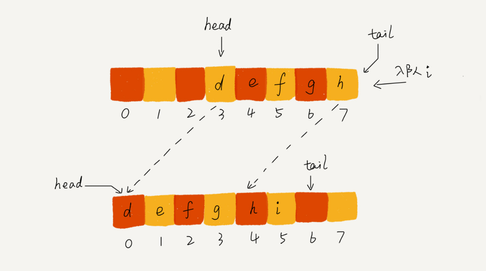
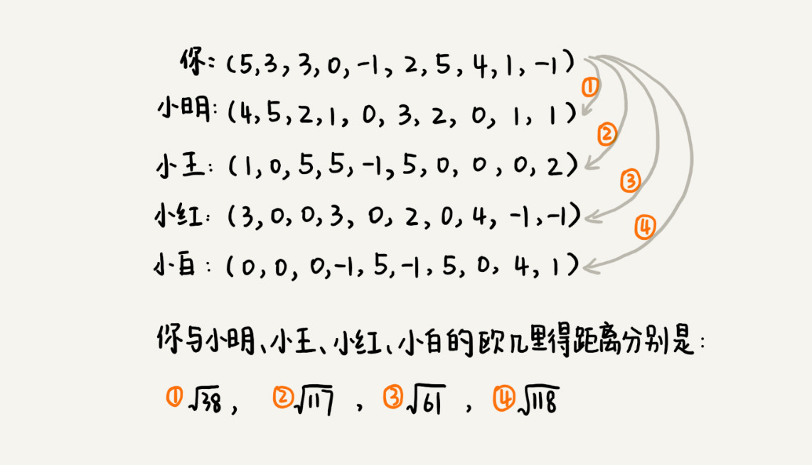

# 算法和数据结构

如果我们不那么确信能不能看懂、能不能学会的时候，当面对困难的时候，很容易就会否定自己，也就很容易半途而废。

1）不要浮躁，不要丧失思考能力，不要丧失学习能力

2）只有做好打硬仗的心理准备，遇到困难才能心态平和

3）入门是一个非常漫长和煎熬的过程，谁都逃不过

对于很多学科的学习，智商并不是瓶颈，最终能够决定你能达到的高度的，还是情商，而情商中最重要的，我觉得就是逆商（逆境商数，Adversity Quotient），也就是，当你遇到困难时，你会如何去面对，这将会决定你的人生最终能够走多远。

https://github.com/wangzheng0822/algo

入门：《大话数据结构》《算法图解》

面试：《剑指 offer》《编程珠玑》编程之美》

经典：《算法导论》《算法》

其他：《算法帝国》《数学之美》《算法之美》

《数据结构与算法分析：Java 语言描述》

## 复杂度：

log3n = log32 * log2n 约等于 log2n  负略对数 统一记logn

O(logn) ->  O(n) ->O( nlogn)  ->  O(n2)

```java
i=1;
 while (i <= n)  {
   i = i * 2;
 }
```

2^0 2^1  2^2 2^k = n

即k = O(logn)

注：复杂度分**时间复杂度**和**空间复杂度**。

## 线性表：

即数据结构类似一条直线。

| 时间复杂度 | 数组 | 链表 |
| ---------- | ---- | ---- |
| 插入删除   | O(n) | O(1) |
| 随机访问   | O(1) | O(n) |

### 数组Array：

内存空间连续，存储数据类型相同

1）因为内存连续所以可以通过寻址算法 得到对应的数组中的数据->达到**随机访问**

2）存储相同类型数据->空间大小一样->方便寻址。

3）因为特殊的结构，所以"插入"和删除较慢-->为了保证存储空间连续

因为删除等比较慢，所以不一定每次都要执行数据移动或删除，从而衍生 标记清楚


即a[i]的地址为 = 数组地址 + i * 数组数据类型大小。

为什么从0开始，因为 寻址算法 直接乘 所以。

对于 m * n 的数组，a [ i  ] [ j ] (i < m,j < n)的地址为：

address = base_address + ( i * n + j) * type_size

4，数组简单易用，在实现上使用的是连续的内存空间，可以借助 CPU 的缓存机制，预读数组中的数据，所以访问效率更高。而链表在内存中并不是连续存储，所以对 CPU 缓存不友好，没办法有效预读。

#### ArrayList

底层原理为数组实现

### 链表Linked list：

1）将一组零散的内存块串起来使用。--所以内存空间利用率高，数组如果要使用100M,则必须有连续100M的空间内存。

2）无大小限制，支持动态扩容

3）特定是插入和删除快，但是随机访问就很慢。

双向链表比较费内存


#### LinkedHashMap

### 栈Stack List：

1）本质还是数组或者链表，只是限制了一些操作。-->**只能从末尾添加，然后从末尾删除元素**。

数组或链表暴露了太多的操作接口，操作上的确灵活自由，但使用时就比较不可控，自然也就更容易出错。

2）理解为跌盘子，**先进后出**。

3）用数组实现的叫**顺序栈**，用链表实现的叫**链式栈**。

4）支持动态扩容，即入栈的时候如果空间不够，就要重新扩容。

5）入栈 **push**()和出栈 **pop**()

#### 使用场景：

##### 1）函数调用栈

每进入一个函数，就会将临时变量作为一个栈帧入栈，当被调用函数执行完成，返回之后，将这个函数对应的栈帧出栈

##### 2）表达式求职

3+5*8-6


##### 3）括号匹配

我们假设表达式中只包含三种括号，圆括号 ()、方括号[]和花括号{}，并且它们可以任意嵌套。比如，{[] ()[{}]}或[{()}([])]等都为合法格式，而{[}()]或[({)]为不合法的格式。那我现在给你一个包含三种括号的表达式字符串，如何检查它是否合法呢？

**从左到右依次扫描字符串。当扫描到左括号时，则将其压入栈中；当扫描到右括号时，从栈顶取出一个左括号**。如果能够匹配，比如“(”跟“)”匹配，“[”跟“]”匹配，“{”跟“}”匹配，则继续扫描剩下的字符串。如果扫描的过程中，遇到不能配对的右括号，或者栈中没有数据，则说明为非法格式。

##### 4）浏览器前进和后退

使用两个栈，X 和 Y，我们把**首次浏览的页面依次压入栈 X**，**当点击后退按钮时，再依次从栈 X 中出栈**，**并将出栈的数据依次放入栈 Y**。当我们点击前进按钮时，我们依次从栈 Y 中取出数据，放入栈 X 中。当栈 X 中没有数据时，那就说明没有页面可以继续后退浏览了。当栈 Y 中没有数据，那就说明没有页面可以点击前进按钮浏览了。

#### JVM堆

内存中的堆栈和数据结构堆栈不是一个概念，可以说内存中的堆栈是真实存在的物理区，数据结构中的堆栈是抽象的数据存储结构。
    内存空间在逻辑上分为三部分：代码区、静态数据区和动态数据区，动态数据区又分为栈区和堆区。
代码区：存储方法体的二进制代码。高级调度（作业调度）、中级调度（内存调度）、低级调度（进程调度）控制代码区执行代码的切换。
静态数据区：存储全局变量、静态变量、常量，常量包括final修饰的常量和String常量。系统自动分配和回收。
栈区：存储运行方法的形参、局部变量、返回值。由系统自动分配和回收。
堆区：new一个对象的引用或地址存储在栈区，指向该对象存储在堆区中的真实数据。

### 队列Queue List：

1）理解为排队过马路--先进先出

2）入队 **enqueue**()和出队 **dequeue**()

3）也是一种操作受限制的线性表结构数据。

4）循环队列、阻塞队列、并发队列

5）用数组实现的队列叫作**顺序队列**，用链表实现的队列叫作**链式队列**。

6）动态扩容：



#### 循环队列：

顾名思义，它长得像一个环。原本数组是有头有尾的，是一条直线。现在我们把首尾相连，扳成了一个环。

最关键的是，确定好队空和队满的判定条件：**(tail+1)%n=head**。


#### 阻塞队列：

简单来说，**就是在队列为空的时候，从队头取数据会被阻塞**。因为此时还没有数据可取，直到队列中有了数据才能返回；**如果队列已经满了，那么插入数据的操作就会被阻塞**，直到队列中有空闲位置后再插入数据，然后再返回。

生产者 - 消费者模型

#### 并发队列：

即线程安全的队列

基于数组的循环队列，利用 CAS 原子操作，可以实现非常高效的并发队列

#### ArrayBlockingQueue

## 非线性表：

### 跳表Skip List：

本质同线性列表，只是在线性列表的基础上，采用二分法，增加了索引层

**链表加多级索引的结构，就是跳表**。

比起单纯的单链表，跳表需要存储多级索引，肯定要**消耗更多的存储空间**

当我们不停地往跳表中插入数据时，如果我们不更新索引，就有可能出现某 2 个索引结点之间数据非常多的情况。极端情况下，跳表还会退化成单链表。-->需要动态更新索引。

Redis 中的有序集合（Sorted Set）就是用跳表来实现的


跳表的实现非常灵活，可以通过改变索引构建策略，有效平衡执行效率和内存消耗。虽然跳表的代码实现并不简单，但是作为一种动态数据结构，比起红黑树来说，**实现要简单**多了。所以很多时候，我们为了代码的简单、易读，比起红黑树，我们更倾向用跳表。

### 散列表Hash Table：

本质上使用的是数组存储，达到随机访问效果，因为数组空间有效，即会出现不同的数据出现相同的哈希值，即出现**散列冲突**。

#### **开放寻址法ThreadLocalMap：**

开放寻址法的核心思想是，如果出现了散列冲突，我们就重新探测一个空闲位置，将其插入

线性探测：当我们往散列表中插入数据时，如果某个数据经过散列函数散列之后，存储位置已经被占用了，我们就从当前位置开始，依次往后查找，看是否有空闲位置，直到找到为止。如果这个空闲位置是我们后来删除的，就会导致原来的查找算法失效。本来存在的数据，会被认定为不存在。这个问题如何解决呢？我们可以将删除的元素，特殊标记为 deleted。当线性探测查找的时候，遇到标记为 deleted 的空间，并不是停下来，而是继续往下探测。

二次探测，双重散列，等

**需要拉很多链表。散列表中的数据都存储在数组中，可以有效地利用 CPU 缓存加快查询速度**。当数据量比较小、装载因子小的时候，适合采用开放寻址法。

不管采用哪种探测方法，当散列表中空闲位置不多的时候，散列冲突的概率就会大大提高。为了尽可能保证散列表的操作效率，一般情况下，我们会尽可能保证散列表中有一定比例的空闲槽位。我们用**装载因子（load factor）**来表示空位的多少。装载因子越大，说明空闲位置越少，冲突越多，散列表的性能会下降。

#### 链表法LinkedHashMap：


链表因为要存储指针，所以对于比较小的对象的存储，是比较消耗内存的，还有可能会让内存的消耗翻倍。而且，因为链表中的结点是零散分布在内存中的，不是连续的，所以对 CPU 缓存是不友好的，这方面对于执行效率也有一定的影响。

基于链表的散列冲突处理方法比较**适合存储大对象、大数据量的散列表**，而且，比起开放寻址法，它更加灵活，支持更多的优化策略，**比如用红黑树代替链表**。

#### 散列函数：

散列函数的设计不能太复杂。过于复杂的散列函数，势必会消耗很多计算时间，也就间接的影响到散列表的性能。其次，散列函数生成的值要尽可能随机并且均匀分布，这样才能避免或者最小化散列冲突，而且即便出现冲突，散列到每个槽里的数据也会比较平均，不会出现某个槽内数据特别多的情况。

散列冲突过大，就要扩容。需要更大的数组来存储。

我们将新数据插入新散列表中，并且从老的散列表中拿出一个数据放入到新散列表。每次插入一个数据到散列表，我们都重复上面的过程。经过多次插入操作之后，老的散列表中的数据就一点一点全部搬移到新散列表中了

#### 散列表和链表结合：

利用散列表的随机读取，利用链表的有序，和删除等方便。实现增删改查的 O(1)


LinkedHashMap 是通过双向链表和散列表这两种数据结构组合实现的。LinkedHashMap 中的“Linked”实际上是指的是双向链表，并非指用链表法解决散列冲突。

#### 哈希算法：

MD5（MD5 Message-Digest Algorithm，MD5 消息摘要算法）和 SHA（Secure Hash Algorithm，安全散列算法）

**鸽巢原理**（也叫抽屉原理）。这个原理本身很简单，它是说，如果有 10 个鸽巢，有 11 只鸽子，那肯定有 1 个鸽巢中的鸽子数量多于 1 个，换句话说就是，肯定有 2 只鸽子在 1 个鸽巢内。

比如前面举的 MD5 的例子，哈希值是固定的 128 位二进制串，能表示的数据是有限的，最多能表示 2^128 个数据

应用：负载均衡、数据分片、分布式存储。

使得在新加入一个机器后，并不需要做大量的数据搬移。这时候，**一致性哈希算法**就要登场了

假设我们有 k 个机器，数据的哈希值的范围是[0, MAX]。我们将整个范围划分成 m 个小区间（m 远大于 k），每个机器负责 m/k 个小区间。当有新机器加入的时候，我们就将某几个小区间的数据，从原来的机器中搬移到新的机器中。这样，既不用全部重新哈希、搬移数据，也保持了各个机器上数据数量的均衡。

### 位图 BitMap：

布隆过滤器（Bloom Filter）

很多语言中提供的布尔类型，大小是 1 个字节的，并不能节省太多内存空间。实际上，表示 true 和 false 两个值，我们只需要用一个二进制位（bit）就可以了


布隆过滤器非常适合这种不需要 100% 准确的、允许存在小概率误判的大规模判重场景。除了爬虫网页去重这个例子，还有比如统计一个大型网站的每天的 UV 数，也就是每天有多少用户访问了网站，我们就可以使用布隆过滤器，对重复访问的用户进行去重。


## 树 Tree：


### 二叉树 Binary Tree：

二叉树，顾名思义，每个节点最多有两个“叉”，也就是两个子节点，分别是左子节点和右子节点。

满二叉：叶子节点全都在最底层，除了叶子节点之外，每个节点都有左右两个子节点。

完全二叉：叶子节点都在最底下两层，最后一层的叶子节点都靠左排列，并且除了最后一层，其他层的节点个数都要达到最大

想要存储一棵二叉树，我们有两种方法，**一种是基于指针或者引用的二叉链式存储法，一种是基于数组的顺序存储法**。

顺序存储法。我们把根节点存储在下标 i = 1 的位置，那左子节点存储在下标 2 * i = 2 的位置，右子节点存储在 2 * i + 1 = 3 的位置。以此类推，B 节点的左子节点存储在 2 * i = 2 * 2 = 4 的位置，右子节点存储在 2 * i + 1 = 2 * 2 + 1 = 5 的位置。

1）**前序遍历**是指，对于树中的任意节点来说，先打印这个节点，然后再打印它的左子树，最后打印它的右子树。

2）**中序遍历**是指，对于树中的任意节点来说，先打印它的左子树，然后再打印它本身，最后打印它的右子树。3）**后序遍历**是指，对于树中的任意节点来说，先打印它的左子树，然后再打印它的右子树，最后打印这个节点本身。

#### 二叉查找树 Binary Search Tree:

二叉查找树是二叉树中最常用的一种类型，也叫二叉搜索树。顾名思义，二叉查找树是为了实现快速查找而生的

二叉查找树要求，在树中的任意一个节点，其左子树中的每个节点的值，都要小于这个节点的值，而右子树节点的值都大于这个节点的值。O(logn)

#### 红黑树 Red-Black Tree：

简称R-B Tree

平衡二叉查找树中“平衡”的意思，其实就是让整棵树左右看起来比较“对称”、比较“平衡”，不要出现左子树很高、右子树很矮的情况

红黑树只是做到了近似平衡，并不是严格的平衡，所以在维护平衡的成本上，要比 AVL 树要低。

1）根节点是黑色的；

2）每个叶子节点都是黑色的空节点（NIL），也就是说，叶子节点不存储数据；

3）任何相邻的节点都不能同时为红色，也就是说，红色节点是被黑色节点隔开的；

4）每个节点，从该节点到达其可达叶子节点的所有路径，都包含相同数目的黑色节点。

#### 递归树：

如果我们把这个一层一层的分解过程画成图，它其实就是一棵树。我们给这棵树起一个名字，叫作递归树

主要用于分析时间复杂度。

#### 堆 Heap：

堆这种数据结构的应用场景非常多，最经典的莫过于堆排序了。堆排序是一种原地的、时间复杂度为 O(nlogn) 的排序算法。

1）堆是一个完全二叉树；

2）堆中每一个节点的值都必须大于等于（或小于等于）其子树中每个节点的值。

每个节点的值都大于等于子树中每个节点值的堆，我们叫作“**大顶堆**”。对于每个节点的值都小于等于子树中每个节点值的堆，我们叫作“**小顶堆**”。

应用：

1.topK
2.流里面的中值:如果我们面对的是动态数据集合，中位数在不停地变动，如果再用先排序的方法，每次询问中位数的时候，都要先进行排序，那效率就不高了。一个大顶堆，一个小顶堆。大顶堆中存储前半部分数据，小顶堆中存储后半部分数据，且小顶堆中的数据都大于大顶堆中的数据

3.优先级队列PriorityQueue

4.利用两个堆不仅可以快速求出中位数，还可以快速求其他**百分位**的数据.

大顶堆中保存 n*99% 个数据，小顶堆中保存 n*1% 个数据。大顶堆堆顶的数据就是我们要找的 99% 响应时间。

### 字典树Trie：

它是一个树形结构。它是一种专门处理字符串匹配的数据结构，用来解决在一组字符串集合中快速查找某个字符串的问题。

Trie 树的本质，就是利用字符串之间的公共前缀，将重复的前缀合并在一起


注：其中红色表示，可以独立为一个单词。

Trie 树是一个多叉树。所以加入全部是字母存储，如果要兼容存储一个节点的 所有子节点指针，就需要一个大小26的数组。n个节点就需要n个大小26的数组。所以很耗内存。

应用：

1）输入提示；

2）敏感词过滤：对敏感词字典进行预处理，构建成 Trie 树结构

我们把用户输入的内容作为主串，从第一个字符（假设是字符 C）开始，在 Trie 树中匹配。当匹配到 Trie 树的叶子节点，或者中途遇到不匹配字符的时候，我们将主串的开始匹配位置后移一位，也就是从字符 C 的下一个字符开始，重新在 Trie 树中匹配。

AC 自动机算法，全称是 Aho-Corasick 算法。其实，Trie 树跟 AC 自动机之间的关系，就像单串匹配中朴素的串匹配算法，跟 KMP 算法之间的关系一样，只不过前者针对的是多模式串而已


## 图 Graph:


顶点：图中的元素，如1，2，3，4

边：图中的边 如 1-2，1-3

图的储存方式：

**1）邻接矩阵**的底层依赖一个二维数组。

2）邻接表（Adjacency List）


邻接矩阵存储方法的缺点是比较**浪费空间，但是优点是查询效率高，而且方便矩阵运算**。

邻接表存储方法中**每个顶点都对应一个链表，存储与其相连接的其他顶点**.

应用：

#### 拓扑排序：

源代码编译依赖关系

#### 最短路径：

地图软件

有向有权图解决。


#### 广度优先搜索 BFS：

广度优先搜索（Breadth-First-Search）

它其实就是一种“地毯式”层层推进的搜索策略，即先查找离起始顶点最近的，然后是次近的，依次往外搜索


#### 深度优先搜索 DFS：

深度优先搜索（Depth-First-Search），简称 DFS

假设你站在迷宫的某个岔路口，然后想找到出口。你随意选择一个岔路口来走，走着走着发现走不通的时候，你就回退到上一个岔路口，重新选择一条路继续走，直到最终找到出口。这种走法就是一种深度优先搜索策略。

深度优先搜索用的是一种比较著名的算法思想，回溯思想。这种思想解决问题的过程，非常适合用递归来实现


## 常用排序

稳定性。这个概念是说，如果待排序的序列中存在值相等的元素，经过排序之后，相等元素之间原有的先后顺序不变。

| 排序方法 | 平均     | 最好     | 最坏     | 原地排序/空间 | 稳定 |
| -------- | -------- | -------- | -------- | ------------- | ---- |
| 冒泡排序 | O(n^2)   | O(n)     | O(n^2)   | 是O(1)        | 是   |
| 插入排序 | O(n^2)   | O(n)     | O(n^2)   | 是O(1)        | 是   |
| 选择排序 | O(n^2)   | O(n^2)   | O(n^2)   | 是O(1)        | 否   |
| 归并排序 | O(nlogn) | O(nlogn) | O(nlogn) | 否O(n)        | 是   |
| 快速排序 | O(nlogn) | O(nlogn) | O(n^2)   | 是O(nlogn)    | 否   |
| 计数排序 | O(n+k)   |          |          | 否            | 是   |
| 桶排序   | O(n)     |          |          | 否            | 是   |
| 基数排序 | O(dn)    |          |          | 否            | 是   |


### 冒泡排序Bubble Sort：

冒泡排序只会操作相邻的两个数据。**每次冒泡操作都会对相邻的两个元素进行比较，看是否满足大小关系要求。如果不满足就让它俩互换**。一次冒泡会让至少一个元素移动到它应该在的位置，重复 n 次，就完成了 n 个数据的排序工作。

冒泡排序的数据交换要比插入排序的数据移动要复杂，冒泡排序需要 3 个赋值操作，而插入排序只需要 1 个。

这也是为什么不怎么用冒泡的原因。


注：每相邻的两个比较，如果前面的比后面的大，就交互位置，后面的继续往下两两比较，第一轮结束这样最大的元素就冒泡到了最后。

```java
private static void bubbleSort(int[] data){
        if(data.length <=1){
            return;
        }
        for(int i=0;i<data.length;i++){
          //结束位置为 n -i -1 减i 表示已经经过一轮排序的次数，代表已经有一个元素已经排好
            for (int j=0;j<data.length - i - 1;j++){
                if(data[j] > data[j+1]){
                    int tmp = data[j];
                    data[j] = data[j+1];
                    data[j+1] = tmp;
                }
            }
        }
    }

    /**
     * 冒泡优化 增加记录最后一次的边界值
     * @param data
     */
    private static void bubbleSort2(int[] data){
        if(data.length <=1){
            return;
        }
        //增加边界值
        int sortBorder = data.length - 1;
        int sortIndex = 0;
        for(int i=0;i<data.length;i++){
            for (int j=0;j<sortBorder;j++){
                if(data[j] > data[j+1]){
                    int tmp = data[j];
                    data[j] = data[j+1];
                    data[j+1] = tmp;
                    sortIndex = j;
                }
            }
            sortBorder = sortIndex;
        }
    }
```


### 插入排序Insertion Sort：

我们将数组中的数据分为两个区间，**已排序区间**和**未排序区间**。初始已排序区间只有一个元素，就是数组的第一个元素。插入算法的核心思想是**取未排序区间中的元素，在已排序区间中找到合适的插入位置将其插入**，并保证已排序区间数据一直有序。重复这个过程，直到未排序区间中元素为空，算法结束

插入排序也包含两种操作，一种是**元素的比较**，一种是**元素的移动**。当我们需要将一个数据 a 插入到已排序区间时，需要拿 a 与已排序区间的元素依次比较大小，**找到合适的插入位置。找到插入点之后，我们还需要将插入点之后的元素顺序往后移动一位，这样才能腾出位置给元素 a 插入**。


注：已排序的为4，拿5于4比较，比4小插入前面，比4大插入后面。依次类推，即从未排序的里面拿出一个元素，与前面已经排序好的想比较，找到自己的位置，插入进去。

即插入排序就有2种实现方式，

方式1 在已经拍好对的里面选择一个位置插入，然后调换，调换后拿调换的元素继续找往后找，依次类推。

方式2，在已经排序的里面，和上一个比较，类似冒泡上去.

```java
public class InsertSort {

    private static void insertSort(int[] data){
        for(int i =1;i<data.length;i++){
            //取一个元素 默认从0开始
            int value = data[i];
            int[] tmp = new int[2];
            int change = i;
            //循环排序区域 和对应的元素比较
            for (int j=0;j<i;j++){
                if(value >= data[j]){
                    continue;
                }
                //如果小，相当于 要扩容一位 且相应的元素要后移一位
                //奇偶数
                int index = j%2;
                if(change == i){
                    tmp[Math.abs(index-1)] = data[j];
                    change = j;
                }
                tmp[index] = data[j+1];
                if (0 == index) {
                    data[j+1] = tmp[index+1];
                } else {
                    data[j+1] = tmp[index-1];
                }
                data[change] = value;
            }
        }
    }

    private static void myInsertSort(int[] data){
        if(data.length <=0){
            return;
        }
        //从小到大排序
        for(int i=1;i<data.length;i++){
            //和上一个 倒序一个个对比插入
            for(int j = i;j>1;j--){
                if(data[j] >= data[j-1]){
                    break;
                }
                int tmp = data[j];
                data[j] = data[j-1];
                data[j-1] = tmp;
            }
        }

    }

    private static void myInsertSort2(int[] data){
        if(data.length<=0){
            return;
        }
        for (int i=1;i<data.length;i++){
            for (int j=0;j<i;j++){
                if(data[i]>=data[j]){
                    continue;
                }
                int tmp = data[i];
                //交互
                data[i] = data[j];
                data[j] = tmp;
            }
        }
    }

    public static void main(String[] args) {
        int[] data = {1,34,23,23,45,2,3,5};
        myInsertSort(data);
        myInsertSort2(data);
        System.out.println(Arrays.toString(data));
    }
}
```


### 选择排序Selection Sort：

选择排序算法的实现思路有点类似插入排序，也分已排序区间和未排序区间。但是选择排序**每次会从未排序区间中找到最小的元素，将其放到已排序区间的末尾**。

致命缺点是：非稳定性排序。


注：从未排序区取出最小，依次放入到已排序区。

```java
/**
     * 选择排序 已经排序区域  未排序区域取最小值放到已经排序的末尾
     * @param data
     */
    public static void selectSort(int[] data){
        if(data.length <=1){
            return;
        }
        for (int i=0;i<data.length;i++){
            int minIndex = i;
            //得到最小的数的 index
            for (int j = i+1;j<data.length;j++){
                if(data[minIndex] > data[j]){
                    minIndex = j;
                }
            }
            //根据最小index 交互数据
            int tmp = data[i];
            data[i] = data[minIndex];
            data[minIndex] = tmp;
        }
    }
```


### 归并排序Merge Sort:

如果要排序一个数组，我们先把数组从中间分成前后两部分，然后对前后两部分分别排序，再将排好序的两部分合并在一起，这样整个数组就都有序了

归并排序使用的就是分治思想。分治，顾名思义，就是分而治之，将一个大问题分解成小的子问题来解决。小的子问题解决了，大问题也就解决了。

致命的“弱点”，那就是归并排序**不是原地排序算法**。


注：一分为2，再一分为2，直到不能再分，然后再一个个数组合并起来。

```java
    private static void mergeSort(int[] data,int left,int right){
        //递归终止
        if(left >= right){
            return;
        }
        //得到中间位置
        int mid = left + (right - left)/2;
        //分两路递归
        mergeSort(data,left,mid);
        mergeSort(data,mid+1,right);
        //合并递归结果
        //把left-mid 和 mid+1 - rigth 的数据合并到 left-right中
        merge(data,left,mid,right);
    }
    private static void merge(int[] data,int left,int mid,int right){
        //两边的起始位置开始
        int i = left;
        int j = mid+1;
        //新数组起始位置
        int k = 0;
        //新数组大小
        int[] tmp = new int[right-left+1];
        while(i <=mid && j<=right){

            if(data[i] <= data[j]){
                //从左边的第一个开始取
                tmp[k++] = data[i++];
            }else{
                //从右边的第一个开始取
                tmp[k++] = data[j++];
            }
        }
        //核查两边的数组 是否都已经复制到新的里面
        int start = i;
        int end = mid;
        if(j <=right){
            start = j;
            end = right;
        }
        while (start <= end){
            tmp[k++] = data[start++];
        }
        System.out.println("小数组:");
        System.out.println(Arrays.toString(tmp));
        //将tmp的数据复制到data里面
        for (i = 0;i<=right-left;i++){
            data[left+i] = tmp[i];
        }
        System.out.println("大数组:");
        System.out.println(Arrays.toString(data));

    }
//哨兵复制方式，主要解决复制问题
    private static void mergeBySentry(int[] data,int left,int mid,int right){
        int[] leftArr = new int[mid-left +2];
        int[] rightArr = new int[right - mid + 1];
        //复制数据到左边数组
        for (int i = 0;i<=mid - left;i++){
            leftArr[i] = data[left+i];
        }
        //第一个数组添加一个哨兵 最大值 这也是为什么要多一个原因
        leftArr[mid -left + 1] = Integer.MAX_VALUE;
        //复制右边的数据
        for (int i = 0;i<right-mid;i++){
            rightArr[i] = data[mid+1+i];
        }
        //第2个数组添加哨兵
        rightArr[right-mid] = Integer.MAX_VALUE;

        int i = 0,j = 0;
        int k = left;
        while (k <= right){
            //一直复制 直到 到达哨兵
            if(leftArr[i] <= rightArr[j]){
                data[k++] = leftArr[i++];
            }else{
                data[k++] = rightArr[j++];
            }
        }
    }
```


### 快速排序Quik Sort：

和归并排序思想一样，都是分治思想。不同的是，快速排序 采用的是一个中间点进行分区的概念

针对快速排序查找分区点的优化：

1）首 尾 中，分别取出一个数，取中间值作为分区点

2）随机法。


注：找到分区点5，把小于5的放入前面，大于的放后面，依次进行

https://blog.csdn.net/pengzonglu7292/article/details/84938910


```java
/**
     * 1) 先right 往后走 找到第一个比base 小的 停止
     * 2）left 往前走 找到第一个比base 大的 停止
     * 3）交换 rigth和left的值
     * 4）重复 1，2，3
     */
    private static void quickDiv(int[] data,int left,int right){
        if(left > right){
            return;
        }
        //取第一个作为基准点
        int base = data[left];
        int l = left;
        int r = right;
        while(l != r){
            //找到第一个小于base的元素位置
            while(data[r] >= base && l < r){
                r--;
            }
            //找到第一个大于base的元素位置
            while (data[l] <= base && l < r){
                l++;
            }
            //交换位置
            if(l < r){
                int tmp = data[l];
                data[l] = data[r];
                data[r] = tmp;
            }
        }
        //把基准数据挪到中间
        data[left] = data[l];
        data[l] = base;
        //分两路继续
        quickDiv(data,left,l-1);
        quickDiv(data,l+1,right);
    }
//quickDiv(data,0,data.length-1);
```


### 线性排序Linear Sort：

桶排序、计数排序、基数排序。因为这些排序算法的**时间复杂度是线性的**，所以我们把这类排序算法叫作线性排序（Linear sort）。之所以能做到线性的时间复杂度，主要原因是，这三个算法是非基于比较的排序算法，都不涉及元素之间的比较操作。

注：前提是针对特定的数据才可以使用。

#### 桶排序Bucket Sort：

核心思想是**将要排序的数据分到几个有序的桶里，每个桶里的数据再单独进行排序**。桶内排完序之后，再把每个桶里的数据按照顺序依次取出，组成的序列就是有序的了。


当桶的个数 m 接近数据个数 n 时，log(n/m) 就是一个非常小的常量，这个时候桶排序的时间复杂度接近 O(n)。

```java
private static void bucketSort(int[] data){
        //取出最大值和最小值
        int min = data[0];
        int max = data[1];
        for (int i=0;i<data.length;i++){
            if(data[i]>max){
                max = data[i];
            }else if(data[i]<min){
                min = data[i];
            }
        }
        //桶大小
        int len = max -min;
        if(min == 0){
            len = max;
        }

        if(len<=0){
            return;
        }
        //预留第一个位置存储数量
        int col = data.length + 1;
        //预留了 len*col的位置 循环data 插入到指定的位置，其中每个位置的第一位保留计数
        int[][] bucket = new int[len][col];
        System.out.println("len:"+len+",col:"+col);
        for (int i=0;i<data.length;i++){
            //获取下标
            int index = data[i] - min - 1;
            if(index < 0){
                index = 0;
            }
            System.out.println("d:"+data[i]+",index:"+index);
            //第一个位置的数量加1
            bucket[index][0]++;
            //获取元素在col存储的位置
            int colIndex = bucket[index][0];
            bucket[index][colIndex] = data[i];
            System.out.println(Arrays.toString(bucket[index]));
        }
        int k = 0;
        for (int i=0;i<len;i++){
            //有元素
            if(bucket[i][0] > 0){
                for (int j = 1;j<=bucket[i][0];j++){
                    data[k++] = bucket[i][j];
                }
            }
        }


    }
```

注：上面的方法限于数量小的情况，且数据范围不大的时候。正规的桶排序 是约定好桶数量，即把大桶分小桶 桶和桶之间还需要排序

#### 计数排序Counting Sort：

**计数排序其实是桶排序的一种特殊情况**。当要排序的 n 个数据，所处的范围并不大的时候，比如最大值是 k，我们就可以把数据划分成 k 个桶。每个桶内的数据值都是相同的，省掉了桶内排序的时间。

假设只有 8 个考生，分数在 0 到 5 分之间。这 8 个考生的成绩我们放在一个数组 A[8]中，它们分别是：2，5，3，0，2，3，0，3。考生的成绩从 0 到 5 分，我们使用大小为 6 的数组 C[6]表示桶，其中下标对应分数。不过，C[6]内存储的并不是考生，而是对应的考生个数。像我刚刚举的那个例子，我们只需要遍历一遍考生分数，就可以得到 C[6]的值。

计数排序只能用在数据范围不大的场景中，如果数据范围 k 比要排序的数据 n 大很多，就不适合用计数排序了。而且，计数排序只能给非负整数排序，如果要排序的数据是其他类型的，要将其在不改变相对大小的情况下，转化为非负整数。

#### 基数排序Radix Sort：

假设要比较两个手机号码 a，b 的大小，如果在前面几位中，a 手机号码已经比 b 手机号码大了，那后面的几位就不用看了。

借助稳定排序算法，这里有一个巧妙的实现思路。还记得我们第 11 节中，在阐述排序算法的稳定性的时候举的订单的例子吗？我们这里也可以借助相同的处理思路，**先按照最后一位来排序手机号码，然后，再按照倒数第二位重新排序，以此类推，最后按照第一位重新排序。经过 11 次排序之后，手机号码就都有序了**。


注：先比较最后一位，按照最后一位排好顺序，然后再看倒数第2位，依次进行。

注：如果长度不一致的，可以前面补0操作。

## 算法思想：

### 贪心算法：

1）霍夫曼编码：数据压缩

霍夫曼编码试图用这种不等长的编码方法，来进一步增加压缩的效率。如何给不同频率的字符选择不同长度的编码呢？根据贪心的思想，我们可以**把出现频率比较多的字符，用稍微短一些的编码；出现频率比较少的字符，用稍微长一些的编码**。

### 分治算法：

分而治之 ，也就是将原问题划分成 n 个规模较小，并且结构与原问题相似的子问题，递归地解决这些子问题，然后再合并其结果，就得到原问题的解。

1）分解：将原问题分解成一系列子问题；

2）解决：递归地求解各个子问题，若子问题足够小，则直接求解；

3）合并：将子问题的结果合并成原问题。

应用：

1）MapReduce

### 回溯算法：

回溯的处理思想，有点类似枚举搜索

8皇后问题，

正则表达式

### 动态规划Dynamic Programming：

动态规划比较适合用来求解最优问题，比如求最大值、最小值等等

“三个特征”？它们分别是**最优子结构、无后效性和重复子问题**。

如果我们走到 (i, j) 这个位置，我们只能通过 (i-1, j)，(i, j-1) 这两个位置移动过来，也就是说，我们想要计算 (i, j) 位置对应的状态，只需要关心 (i-1, j)，(i, j-1) 两个位置对应的状态，并不关心棋子是通过什么样的路线到达这两个位置的

状态转移方程法：一种是递归加“备忘录”，另一种是迭代递推。

分治算法要求分割成的子问题，不能有重复子问题，而动态规划正好相反，动态规划之所以高效，就是因为回溯算法实现中存在大量的重复子问题。


## 常用算法

### 递归：

非常标准的递归求解问题的分解过程，**去的过程叫“递”，回来的过程叫“归”**。基本上，所有的递归问题都可以用递推公式来表示

#### 递归三条件：

##### 1）一个问题可以分解为几个子问题的解

##### 2）分解后的子问题，除了数据规模不同，求解思路完全一样

##### 3）需要有递归终止条件

假如这里有 n 个台阶，每次你可以跨 1 个台阶或者 2 个台阶，请问走这 n 个台阶有多少种走法？

**递推公式**：

```java
f(1) = 1;
f(2) = 2;
f(n) = f(n-1)+f(n-2)
int f(int n) { 
  if (n == 1) return 1; 
  if (n == 2) return 2;
  return f(n-1) + f(n-2);
}
```

到底最后一个台阶的方式，有2种，一种就是只剩1个台阶，一种只剩2个台阶。

#### 注意事项：

##### 1）警惕堆栈溢出：StackOverflowError

如果我们将系统栈或者 JVM 堆栈大小设置为 1KB，在求解 f(19999) 时便会StackOverflowError

##### 2）警惕重复计算

可以把已经计算的数据缓存起来。

### 二分查找法Binary Search：

注：前提条件是数据已经有序。这里的**场景只针对有序，且经常需要查找**。

二分查找针对的是一个有序的数据集合，查找思想有点类似分治思想。**每次都通过跟区间的中间元素对比，将待查找的区间缩小为之前的一半，直到找到要查找的元素，或者区间被缩小为 0**。

**O(logn)** 惊人的查找速度。如果我们在 42 亿个数据中用二分查找一个数据，最多需要比较 32 次。

我们假设只有 10 个订单，订单金额分别是：8，11，19，23，27，33，45，55，67，98。


#### 注意事项：

##### 1）循环退出条件：

注意是 low<=high，而不是 low

##### 2）mid的取值：

mid 的计算方式写成 low+(high-low)/2。或者low+((high-low)>>1)

##### 3）low和high的更新

low=mid+1，high=mid-1。注意这里的 +1 和 -1，如果直接写成 low=mid 或者 high=mid，就可能会发生死循环。

#### 局限性：

1）二分查找依赖的是顺序表结构，简单点说就是数组。

2）二分查找针对的是有序数据。

3）数据量太小不适合二分查找

4）数据量太大也不适合二分查找：需要数组结构，所以空间需要的大。

#### 二分变体：

1）查找第一个值等于给定值的元素：-->high位变化：中间值前移

更新 high=mid-1，因为要找的元素肯定出现在[low, mid-1]之间。

2）查找到最后一个值等于给定的值：-->low位变化，中间值后移

更新 low=mid+1，因为要找的元素肯定出现在[mid+1, high]之间。

3）查找第一个大于等于给定值的元素：参照2

4）查找第一个小于等于给定值的元素：参照1

### 字符串匹配相关算法：

#### BF算法：

BF 算法中的 BF 是 Brute Force 的缩写，中文叫作暴力匹配算法，也叫朴素匹配算法

#### RK算法：

我们通过哈希算法对主串中的 n-m+1 个子串分别求哈希值，然后逐个与模式串的哈希值比较大小


其中hash算法，如果是只有26个字母可以 26进制表示 如 如dbc：3 * 26 * 26 + 1 * 26 + 2

#### BM算法：


BM 算法包含两部分，分别是坏字符规则（bad character rule）和好后缀规则（good suffix shift）

#### KMP算法：

和BM 算法非常相近。我们假设主串是 a，模式串是 b。在模式串与主串匹配的过程中，当遇到不可匹配的字符的时候，我们希望找到一些规律，可以将模式串往后多滑动几位，跳过那些肯定不会匹配的情况。

### 朴素贝叶斯算法概率统计：

垃圾短信过滤：

1）黑名单

2）过滤规则，如包含黄色词。

3）概率统计

基于概率统计的过滤方式，基础理论是基于朴素贝叶斯算法

通过分词算法，把一个短信分割成 n 个单词。这 n 个单词就是一组特征项，全权代表这个短信。因此，判定一个短信是否是垃圾短信这样一个问题，就变成了，判定同时包含这几个单词的短信是否是垃圾短信。

### 向量空间：推荐算法：

找到跟你口味偏好相似的用户，把他们爱听的歌曲推荐给你；

找出跟你喜爱的歌曲特征相似的歌曲，把这些歌曲推荐给你。

欧几里得距离（Euclidean distance）。

欧几里得距离是用来计算两个向量之间的距离的


一维空间是一条线，我们用 1，2，3……这样单个的数，来表示一维空间中的某个位置；二维空间是一个面，我们用（1，3）（4，2）（2，2）……这样的两个数，来表示二维空间中的某个位置；三维空间是一个立体空间，我们用（1，3，5）（3，1，7）（2，4，3）……这样的三个数

类比一维、二维、三维的表示方法，K 维空间中的某个位置，我们可以写作（X1，X2，X3，…，XK）。这种表示方法就是向量（vector）




### B+树：

MySQL索引

### 短网址：

MurmurHash 算法提供了两种长度的哈希值，一种是 32bits，一种是 128bits。

1)通过 MurmurHash 算法 生成一个10进制hash数值

2）把10进制转为62进制。


如果我们在数据库中，找到了相同的短网址，那也并不一定说明就冲突了。我们从数据库中，将这个短网址对应的原始网址也取出来。

或者通过ID生成器，生成一个10进制ID。在转换为62进制。


## 常用算法题：

### 1）大文件合并

现在你有 10 个接口访问日志文件，每个日志文件大小约 300MB，每个文件里的日志都是按照时间戳从小到大排序的。你希望将这 10 个较小的日志文件，合并为 1 个日志文件，合并之后的日志仍然按照时间戳从小到大排列。如果处理上述排序任务的机器内存只有 1GB，你有什么好的解决思路，能“快速”地将这 10 个日志文件合并吗？

每次从各个文件中取一条数据，在内存中根据数据时间戳构建一个最小堆，然后每次把最小值给写入新文件，同时将最小值来自的那个文件再出来一个数据，加入到最小堆中。这个空间复杂度为常数，但没能很好利用1g内存，而且磁盘单个读取比较慢，所以考虑每次读取一批数据，没了再从磁盘中取，时间复杂度还是一样O(n)。

### 2）IP地址匹配

如果 IP 区间与归属地的对应关系不经常更新，我们可以先预处理这 12 万条数据，让其按照起始 IP 从小到大排序。如何来排序呢？我们知道，IP 地址可以转化为 32 位的整型数。所以，我们可以将起始地址，按照对应的整型值的大小关系，从小到大进行排序。

当我们要查询某个 IP 归属地时，我们可以先通过二分查找，找到最后一个起始 IP 小于等于这个 IP 的 IP 区间，然后，检查这个 IP 是否在这个 IP 区间内，如果在，我们就取出对应的归属地显示；如果不在，就返回未查找到。

### 3）回文判断

“回文”是指正读反读都能读通的句子，若n=1234321，则称n为一回文数；但若n=1234567，则n不是回文数

所以重点思路就是：找出中间值 ,然后分两个方向判断11判断

找出中间值：快慢步骤 即一个步骤为1 一个步骤为2 走完链表 则步骤1的截止就是中间值

```java
Node p = head;
Node q = head;
if (p.next == null) {
  System.out.println("只有一个元素");
  return true;
}
//快慢队列 一个是前进1步，一个是2步 基本上就总数/2 所以1步的进度就是中间节点
while (q.next != null && q.next.next != null) {
  p = p.next;
  q = q.next.next;
}
```

然后就是左右两指针，其中一个指针需要反正队列方向：

```java
Node leftLink  = null;
Node rightLink = null;
//q.next为null 表示后面还有数据 链表为奇数
if (q.next == null) {
  //　p 一定为整个链表的中点，且节点数目为奇数
  rightLink = p.next;
  //反转链表
  leftLink = inverseLinkList(p).next;
} else {
  //p q　均为中点
  rightLink = p.next;
  leftLink = inverseLinkList(p);
}
//链表反转
public Node inverseLinkList(Node p) {
  Node pre = null;
  Node r   = head;
  System.out.println("z---" + r.data);
  Node next = null;
  while (r != p) {
    //下一个元素
    next = r.next;
    //当前元素的下一个位
    r.next = pre;
    pre = r;
    r = next;
  }
  r.next = pre;
  //　返回左半部分的中点之前的那个节点
  //　从此处开始同步像两边比较
  return r;

}
```

回文判断：

```java
while (l != null && r != null) {
  if (l.data == r.data) {
    l = l.next;
    r = r.next;
    continue;
  } else {
    flag = false;
    break;
  }
}
```

注：链表的环判断也是可以用快慢进度来判断的,即一个走一步，一个走两边，如果最终能走到一起就有环。


删除倒数第k个元素：

```java
public static Node deleteLastKth(Node list, int k) {
        Node fast = list;
        int  i    = 1;
        //1,2,3,4,5
        // 倒数第1个 --> fast = 1
        // 倒数第2个 --> fast = 2
        // 倒数第3个 --> fast = 3
        // --> 得到顺序第k个
        while (fast != null && i < k) {
            fast = fast.next;
            ++i;
        }
        //如果k超过
        if (fast == null) {
            return list;
        }

        Node slow = list;
        Node prev = null;
        //倒数第1个 -->fast 1   prev 1  slow 2 5-1=4
        // fast 2  prev 2 slow 3
        // fast 3  prev 3 slow 4
        //fast 4 prev 4 slow 5

        //倒数第3个 -->fast 3   prev 1  slow 2  5-3 = 2
        // fast 4  prev 2 slow 3

        //倒数第5个 -->fast 5   prev null  slow 1  5-5 = 0

        while (fast.next != null) {
            fast = fast.next;
            prev = slow;
            slow = slow.next;
        }

        if (prev == null) {
            list = list.next; //从头开始，即干掉头
        } else {
            prev.next = prev.next.next;
        }
        return list;
    }
```

注：先通过循环 找出顺序第k个元素，fast队列 剩余 n-k个，slow列从头开始 走剩余的n-k个步骤，即得出倒数第k个。

### 4）动态规划案例

#### 1）最大盗取金额

     * 输入: [1,2,3,1]
     * 输出: 4
     * 解释: 偷窃 1 号房屋 (金额 = 1) ，然后偷窃 3 号房屋 (金额 = 3)。
     *      偷窃到的最高金额 = 1 + 3 = 4 。
     *
     * 输入: [2,7,9,3,1]
     * 输出: 12
     * 解释: 偷窃 1 号房屋 (金额 = 2), 偷窃 3 号房屋 (金额 = 9)，接着偷窃 5 号房屋 (金额 = 1)。
     *      偷窃到的最高金额 = 2 + 9 + 1 = 12 。
```java
// 动态方程 dp[i] = max(dp[i-1],dp[i-2]+nums[i])
//动态起始 dp[0] = nums[0] dp[1] = max(nums[0],nums[1])
public static int rob(int[] nums) {
        if (nums == null || nums.length == 0) {
            return 0;
        }
        int length = nums.length;
        if (length == 1) {
            return nums[0];
        }
        int[] dp = new int[length];
        dp[0] = nums[0];
        dp[1] = Math.max(nums[0], nums[1]);
        for (int i = 2; i < length; i++) {
            dp[i] = Math.max(dp[i - 2] + nums[i], dp[i - 1]);
        }
        return dp[length - 1];
    }
//非数组实现，即 直接使用最大值 保留前一个值
public static int rob1(int[] nums) {
        if (nums == null || nums.length == 0) {
            return 0;
        }
        int length = nums.length;
        if (length == 1) {
            return nums[0];
        }
        int first = nums[0], second = Math.max(nums[0], nums[1]);
        for (int i = 2; i < length; i++) {
            int temp = second;
            second = Math.max(first + nums[i], second);
            first = temp;
        }
        return second;
    }
```

#### 2）最大乘积

```java
    /**
     * L152乘积最大值的数组
     * 输入: [2,3,-2,4]
     * 输出: 6
     * 解释: 子数组 [2,3] 有最大乘积 6。
     *
     * 输入: [-2,0,-1]
     * 输出: 0
     * 解释: 结果不能为 2, 因为 [-2,-1] 不是子数组。
     * @param nums
     * @return
     */
    public static int maxProduct(int[] nums) {
        if(nums.length ==0){
            return 0;
        }
        if(nums.length ==1){
            return nums[0];
        }
        if(nums.length ==2){
            return Math.max(nums[1],nums[0]*nums[1]);
        }
        int[] dpMax  = new int[nums.length];
        //考虑到有负数的情况 负数*当前数有可能最大
        int[] dpMin = new int[nums.length];
        dpMax[0] = nums[0];
        dpMin[0] = nums[0];
        dpMax[1] = Math.max(nums[1],nums[0]*nums[1]);
        dpMin[1] = Math.min(nums[1],nums[0]*nums[1]);
        //取的是最大值 并不是最后一个的最大值
        int max = Math.max(dpMax[0],dpMax[1]);
        for (int i=2;i<nums.length;i++){
            dpMax[i] = Math.max(nums[i],Math.max(dpMin[i-1] * nums[i],dpMax[i-1] * nums[i]));
            dpMin[i] = Math.min(nums[i],Math.min(dpMax[i-1] * nums[i],dpMin[i-1] * nums[i]));
            max = Math.max(max,dpMax[i]);
        }
        //System.out.println(Arrays.toString(dp));
        return max;
    }

//简化版本
public int maxProduct(int[] nums) {
        int max = Integer.MIN_VALUE, imax = 1, imin = 1;
        for(int i=0; i<nums.length; i++){
            if(nums[i] < 0){ 
              int tmp = imax;
              imax = imin;
              imin = tmp;
            }
            imax = Math.max(imax*nums[i], nums[i]);
            imin = Math.min(imin*nums[i], nums[i]);
            
            max = Math.max(max, imax);
        }
        return max;
    }
}
```

