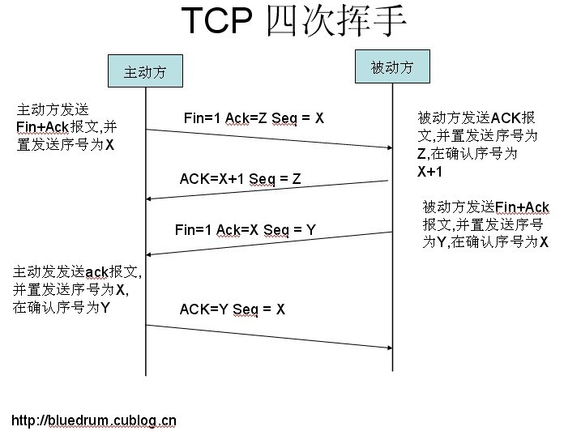

# 网络通信和协议


## 分层负载：

### 二层负载：

二层负载均衡会通过一个虚拟 MAC 地址接收请求，然后再分配到真实的 MAC 地址

### 三层负载均衡：

三层负载均衡会通过一个虚拟 IP 地址接收请求，然后再分配到真实的 IP 地址

### 四层负载均衡：

四层通过虚拟 IP + 端口接收请求，然后再分配到真实的服务器

### 七层负载均衡：

七层通过虚拟的 URL 或主机名接收请求，然后再分配到真实的服务器。

## TCP/IP协议

- TCP (传输控制协议) - 应用程序之间通信
- UDP (用户数据报协议) - 应用程序之间的简单通信
- IP (网际协议) - 计算机之间的通信
- ICMP (因特网消息控制协议) - 针对错误和状态
- DHCP (动态主机配置协议) - 针对动态寻址




注：其中 ACK 报文是用来应答的，SYN 报文是用来同步的。

### IO阻塞：

socket.accept 去接收一个客户端请求，accept 是一个阻塞的方法，意味着 TCP 服务器一次只能处理一个客户端请求，当一个客户端向一个已经被其他客户端占用的服务器发送连接请求时，虽然在连接建立后可以向服务端发送数据，但是在服务端处理完之前的请求之前，却不会对新的客户端做出响应，这种类型的服务器称为“迭代服务器”。迭代服务器是按照顺序处理客户端请求，也就是服务端必须要处理完前一个请求才能对下一个客户端的请求进行响应。

### **TCP 粘包/拆包** ：

TCP 是一个“流”协议，所谓流，就是没有界限的一长串二进制数据。TCP 作为传输层协议并不不了解上层业务数据的具 体含义，它会根据 TCP 缓冲区的实际情况进行数据包的划分，所以在业务上认为是一个完整的包，可能会**被 TCP 拆分 成多个包进行发送，也有可能把多个小的包封装成一个大的数据包发送，这就是所谓的 TCP 粘包和拆包**问题。

同样, 在 Netty 的编码器中, 也会对半包和粘包问题做相应的处理。什么是**半包, 顾名思义, 就是不完整的数据包**, 因为 Betty 在轮询读事件的时候, 每次将 channel 中读取的数据, 不一定是一个完整的数据包, 这种情况, 就叫半包。粘包同 样也不难理解, 如果Client往 Server发送数据包, 如果**发送频繁很有可能会将多个数据包的数据都发送到通道中**, 如果 在 server 在读取的时候可能会**读取到超过一个完整数据包的长度, 这种情况叫粘包**。

1. 消息定长，报文大小固定长度，例如每个报文的长度固定为 200 字节，如果不够空位补空格； 

2. 包尾添加特殊分隔符，例如每条报文结束都添加回车换行符（例如 FTP 协议）或者指定特殊字符作为报文分隔符， 接收方通过特殊分隔符切分报文区分； 

3. 将消息分为消息头和消息体，消息头中包含表示信息的总长度（或者消息体长度）的字段； 

4. 更复杂的自定义应用层协议。 

## HTTPS：


## 序列化/反序列化：

**序列化**是把对象的状态信息转化为可存储或传输的形式过程，也就是把对象转化为字节序列的过程称为对象的序列化

**反序列化**是序列化的逆向过程，把字节数组反序列化为对象，把字节序列恢复为对象的过程成为对象的反序列化

```java
//反序列化
ObjectInputStream objectInputStream= new ObjectInputStream(socket.getInputStream());
User user=(User)objectInputStream.readObject();

//序列化
User user=new User();
out=new ObjectOutputStream(socket.getOutputStream());
out.writeObject(user);
```

注：java对象传输，必须 **implements** Serializable

### java.io.ObjectOutputStream：

表示对象输出流 , 它的 writeObject(Object obj)方法可以对参数指定的 obj 对象进行序列化，把得到的字节序列写到一个目标输出流中。被序列化的对象需要实现 **java.io.Serializable** 接口

### java.io.ObjectInputStream：

表示对象输入流 ,它的 readObject()方法源输入流中读取字节序列，再把它们反序列化成为一个对象，并将其返回

### serialVersionUID：

Java 的序列化机制是通过判断类的 serialVersionUID **来验证版本一致性的**。在进行反序列化时，JVM 会把传来的字节流中的 serialVersionUID 与本地相应实体类的 serialVersionUID 进行比较，如果相同就认为是一致的，可以进行反序列化，否则就会出现序列化版本不一致的异常，即是 **InvalidCastException**。

### **Transient** ：

Transient 关键字的作用是控制变量的序列化，在变量声明前加上该关键字，可以阻止该变量被序列化到文件中，在被反序列化后，transient 变量的值被设为初始值，如 int 型的是0，对象型的是 null。

### **writeObject 和 readObject 原理**：

虽然 name 被 transient 修饰，但是通过我们写的这两个方法依然能够使得 name 字段正确被序列化和反序列化

即复写对象的该两个方法即可完成限制

### 总结：

1. Java 序列化只是针对对象的状态进行保存，至于对象中的方法，序列化不关心

2. 当**一个父类实现了序列化，那么子类会自动实现序列化**，不需要显示实现序列化接口
3.  当一个对象的实例变量引用了其他对象，序列化这个对象的时候会自动把引用的对象也进

行序列化（实现深度克隆）

4. 当某个字段被申明为 transient 后，默认的序列化机制会忽略这个字段

5. 被申明为 transient 的字段，如果需要序列化，可以添加两个私有方法：writeObject 和

readObject

### 其他分布式序列化协议：

#### 1）XML

 XStream 和 Java 自带的 XML 序列化和反序列化两种

#### 2）JSON

JSON（JavaScript Object Notation）是一种轻量级的数据交换格式，相对于 XML 来说，JSON的字节流更小，而且可读性也非常好。现在 JSON 数据格式在企业运用是最普遍的

JSON 序列化常用的开源工具有很多

1. Jackson （https://github.com/FasterXML/jackson）
2.  阿里开源的 FastJson （https://github.com/alibaba/fastjon）

3. Google 的 GSON (https://github.com/google/gson)

这几种 json 序列化工具中，Jackson 与 fastjson 要比 GSON 的性能要好，但是 Jackson、GSON 的稳定性要比 Fastjson 好。而 fastjson 的优势在于提供的 api 非常容易使用

#### 3）Hessian 

Hessian 是一个支持跨语言传输的**二进制序列化协议**，相对于 Java 默认的序列化机制来说，Hessian 具有更好的性能和易用性，而且支持多种不同的语言实际上 Dubbo 采用的就是 Hessian 序列化来实现，只不过 Dubbo 对 Hessian 进行了重构，性能更高

#### 4）Avro

Avro 是一个数据序列化系统，设计用于支持大批量数据交换的应用。它的主要特点有：支持二进制序列化方式，可以便捷，快速地处理大量数据；动态语言友好，Avro 提供的机制使动态语言可以方便地处理 Avro 数据。

#### 5）Kryo 

Kryo 是一种非常成熟的序列化实现，已经在 Hive、Storm）中使用得比较广泛，**不过它不能跨语言**. 目前 dubbo 已经在 2.6 版本支持 kyro 的序列化机制。它的性能要优于之前的hessian2

#### 6）protobuf

Protobuf 是 Google 的一种数据交换格式，它独立于语言、独立于平台。Google 提供了多种语言来实现，比如 Java、C、Go、Python，每一种实现都包含了相应语言的编译器和库文件，Protobuf 是一个纯粹的表示层协议，可以和各种传输层协议一起使用。

protobuf 有个缺点就是要传输的每一个类的结构都要生成对应的 proto 文件，如果某个类发生修改，还得重新生成该类对应的 proto 文件

要达到最小的序列化结果，一定会用到压缩的技术，而 **protobuf 里面用到了两种压缩算法，一种是 varint，另一种是 zigzag**.

## IO 操作

### **阻塞(Block)和非阻塞(Non-Block)** 

描述的是用户线程调用内灰I/O操作的方式：区别是在第一步，发起I/O请求是否会被阻塞。

阻塞：往往需要等待缓冲区中的数据准备好过后才处理其他的事情，否则一直等待在那里。 

非阻塞:当我们的进程访问我们的数据缓冲区的时候，**如果数据没有准备好则直接返回，不会等待**。如果数据已经 准备好，也直接返回。

### **同步(Synchronization)和异步(Asynchronous)**

描述的是用户线程和内核的**交互方式**：区别是在第2步是否阻塞

同步和异步都是基于**应用程序和操作系统处理 IO 事件所采用的方式**。

同步：是**应用程序要直接参与 IO 读写 的操作**。

异步：所有的 **IO 读写交给操作系统去处理，应用程序只需要等待通知**。

### IO比较


### BIO(Block IO)和NIO(No-Block IO)

#### BIO 阻塞IO：

面向流，阻塞IO(多线程)

Java BIO 面向流意味着每 次从流中读一个或多个字节，直至读取所有字节，它们没有被缓存在任何地方。此外，它不能前后移动流中的数据。 如果需要前后移动从流中读取的数据，需要先将它缓存到一个缓冲区

Java BIO 的各种流是阻塞的。这意味着，当一个线程调用 read() 或 write()时，该线程被阻塞，直到有一些数据被 读取，或数据完全写入。该线程在此期间不能再干任何事情了


#### NIO 非阻塞IO：

面向缓冲，非阻塞 IO(反应堆 Reactor) 

Java NIO 的缓冲导向方法略有不同。数据读取 到一个它稍后处理的缓冲区，需要时可在缓冲区中前后移动。这就增加了处理过程中的灵活性。但是，还需要检查是 否该缓冲区中包含所有您需要处理的数据。而且，需确保当更多的数据读入缓冲区时，不要覆盖缓冲区里尚未处理的 数据。 

Java NIO 的非阻塞模式，使一个线程从某通道发送请 求读取数据，但是它仅能得到目前可用的数据，如果目前没有数据可用时，就什么都不会获取。而不是保持线程阻塞， 所以直至数据变的可以读取之前，该线程可以继续做其他的事情。


### NIO三件套：

#### **1）缓冲区 Buffer**

缓冲区实际上是**一个容器对象，更直接的说，其实就是一个数组**，在 NIO 库中，所有数据都是用缓冲区处理的。在读 取数据时，它是直接读到缓冲区中的； 在写入数据时，它也是写入到缓冲区中的；任何时候访问 NIO 中的数据，都 是将它放到缓冲区中。而在面向流 I/O 系统中，所有数据都是直接写入或者直接将数据读取到 Stream 对象中

```java
IntBuffer buffer = IntBuffer.allocate(8);
```

最常用的就是 ByteBuffer

的 **asReadOnlyBuffer()**方法，将任何常规缓 冲区转 换为**只读缓冲区**

**直接缓冲区**：

在每一次调用底层操作系统的本机 I/O 操作之前(或之后)，尝试 避免将缓冲区的内容拷贝到一个中间缓冲区中或者从一个中间缓冲区中拷贝数据。要分配直接缓冲区，需要调用 **allocateDirect**()

#### **2）选择器 Selector**

NIO 中实现非阻塞 I/O 的核心对象就是 Selector，Selector 就是 注册各种 I/O 事件地方，而且当那些事件发生时，就是这个对象告诉我们所发生的事件。

可以从 Selector 中获得相应的 SelectionKey，同时从 SelectionKey 中可 以找到发生的事件和该事件所发生的具体的 SelectableChannel，以获得客户端发送过来的数据。

1. 向 Selector 对象注册感兴趣的事件。 

2. 从 Selector 中获取感兴趣的事件。 

3. 根据不同的事件进行相应的处理。 

```java
// 向 Selector 中注册感兴趣的事件 
server.register(sel, SelectionKey.OP_ACCEPT);

try {
  while(true) { 
    // 该调用会阻塞，直到至少有一个事件发生 
    selector.select(); 
    Set<SelectionKey> keys = selector.selectedKeys();
    Iterator<SelectionKey> iter = keys.iterator(); 
    while (iter.hasNext()) { 
      SelectionKey key = (SelectionKey) iter.next(); 
      iter.remove();
      process(key);
    }
  } 
} catch (IOException e) { e.printStackTrace(); }
```

#### **3）通道 Channel**

通道是一个对象，通过它可以读取和写入数据，当然了所有数据都通过 Buffer 对象来处理。

读取数据：

1. 从 FileInputStream 获取 Channel 

2. 创建 Buffer 

3. 将数据从 Channel 读取到 Buffer 中

```java
FileInputStream fin = new FileInputStream("E://test.txt"); 
// 获取通道 
FileChannel fc = fin.getChannel(); 
// 创建缓冲区 
ByteBuffer buffer = ByteBuffer.allocate(1024); 
// 读取数据到缓冲区 
fc.read(buffer); 
buffer.flip();
while (buffer.remaining() > 0) { 
  byte b = buffer.get(); 
  System.out.print(((char)b));
}
fin.close();
```

写入数据：

1. 从 FileInputStream 获取 Channel。 
2.  创建 Buffer。 
3. 将数据从 Channel 写入到 Buffer 中。

```java
FileOutputStream fout = new FileOutputStream( "E://test.txt" );
FileChannel fc = fout.getChannel();
ByteBuffer buffer = ByteBuffer.allocate( 1024 );
for (int i=0; i<message.length; ++i) {
  buffer.put( message[i] );
}
buffer.flip();
fc.write( buffer );
fout.close();
```

### IO多路复用：

多路复用 IO 实现主要包括四种：select、poll、epoll、kqueue。

IO 多路 复用技术通过把多个 IO 的阻塞复用到同一个 select 的阻塞上，从而使得系统在单线程的情况下可以同时处理多个客户 端请求。与传统的多线程/多进程模型比，I/O 多路复用的最大优势是系统开销小，系统不需要创建新的额外进程或者 线程，也不需要维护这些进程和线程的运行，降低了系统的维护工作量，节省了系统资源。


### 信号驱动SIGIO模型


### AIO **Asynchronous IO **异步IO：

jdk1.7 (NIO2)才是实现**真正的异步 AIO**、把 IO 读写操作完全交给操作系统，学习了 linux epoll 模式

服务端:AsynchronousServerSocketChannel 

客服端:AsynchronousSocketChannel 

用户处理器:CompletionHandler 接口

“真正”的异步IO需要操作系统更强的支持。在IO多路复用模型中，**事件循环将文件句柄的状态事件通知给用户线程， 由用户线程自行读取数据、处理数据**。而在异步IO模型中，**当用户线程收到通知时，数据已经被内核读取完毕，并放 在了用户线程指定的缓冲区内，内核在IO完成后通知用户线程直接使用**即可。异步IO模型使用了Proactor设计模式实 现了这一机制


## Netty：

1）Netty 不看重 Windows 上的使用，在 Linux 系统上，AIO 的底层实现仍使用 EPOLL，没有很好实现 AIO，因此在性 能上没有明显的优势，而且被 JDK 封装了一层不容易深度优化 

2）Netty 整体架构是 reactor 模型, 而 AIO 是 proactor 模型, 混合在一起会非常混乱,把 AIO 也改造成 reactor 模型看起 来是把 epoll 绕个弯又绕回来

3）AIO还有个缺点是接收数据需要预先分配缓存, 而不是NIO那种需要接收时才需要分配缓存, 所以对连接数量非常大 但流量小的情况, 内存浪费很多

4.Linux 上 AIO 不够成熟，处理回调结果速度跟不到处理需求，比如外卖员太少，顾客太多，供不应求，造成处理速度 有瓶颈（待验证） 

### Netty高性能之道：

#### 1）异步非阻塞通信：

IO多路复用,NIO

#### 2）零拷贝：

1) Netty 的接收和发送 ByteBuffer 采用 DIRECT BUFFERS，使用堆外直接内存进行 Socket 读写，不需要进行字节缓冲 区的二次拷贝。如果使用传统的堆内存（HEAP BUFFERS）进行 Socket 读写，JVM 会将堆内存 Buffer 拷贝一份到直接 内存中，然后才写入 Socket 中。相比于堆外直接内存，消息在发送过程中多了一次缓冲区的内存拷贝。 

2) Netty 提供了组合 Buffer 对象，可以聚合多个 ByteBuffer 对象，用户可以像操作一个 Buffer 那样方便的对组合 Buffer 进行操作，避免了传统通过内存拷贝的方式将几个小 Buffer 合并成一个大的 Buffer。 

3) Netty 的文件传输采用了 transferTo()方法，它可以直接将文件缓冲区的数据发送到目标 Channel，避免了传统通过 循环 write()方式导致的内存拷贝问题。 

#### 3）内存池：

特别是对于堆外直接内存的分配和回收，是一件耗时的操作。为了尽量重用缓冲区，Netty 提供了基于 内存池的缓冲区重用机制。

#### 4）高效的Reactor线程模型：

常用的 Reactor 线程模型有三种，分别如下： 

1) Reactor 单线程模型； 


2) Reactor 多线程模型； 


3) 主从 Reactor 多线程模型


Reactor 的主从多线程模型和 Reactor 多线程模型很类似，只不过 Reactor 的主从多线程模型的 Acceptor 

使用了**线程池来处理大量的客户端请求**.

#### 5）无锁化的串行设计理论：

在大多数场景下，并行多线程处理可以提升系统的并发性能。但是，如果对于共享资源的并发访问处理不当，会带来 严重的锁竞争，这最终会导致性能的下降。为了尽可能的避免锁竞争带来的性能损耗，可以通过串行化设计，即消息 的处理尽可能在同一个线程内完成，期间不进行线程切换，这样就避免了多线程竞争和同步锁。 

为了尽可能提升性能，Netty 采用了串行无锁化设计，在 IO 线程内部进行串行操作，避免多线程竞争导致的性能下降。

#### 6）高效的并发编程：

Netty 的高效并发编程主要体现在如下几点： 

1) volatile 的大量、正确使用; 

2) CAS 和原子类的广泛使用； 

3) 线程安全容器的使用； 

4) 通过读写锁提升并发性能。 

#### 7）高效的序列化框架：

1) 序列化后的码流大小（网络带宽的占用）； 

2) 序列化&反序列化的性能（CPU 资源占用）； 

3) 是否支持跨语言（异构系统的对接和开发语言切换）。

#### 8）灵活的TCP参数配置能力：

1) SO_RCVBUF 和 SO_SNDBUF：通常建议值为 128K 或者 256K； 

2) SO_TCPNODELAY：NAGLE 算法通过将缓冲区内的小封包自动相连，组成较大的封包，阻止大量小封包的发送阻塞网络，从而提高网络应用效率。但是对于时延敏感的应用场景需要关闭该优化算法； 

3) 软中断：如果 Linux 内核版本支持 RPS（2.6.35 以上版本），开启 RPS 后可以实现软中断，提升网络吞吐量。RPS 根据数据包的源地址，目的地址以及目的和源端口，计算出一个 hash 值，然后根据这个 hash 值来选择软中断运行的 cpu，从上层来看，也就是说将每个连接和 cpu 绑定，并通过这个 hash 值，来均衡软中断在多个 cpu 上，提升网络并 行处理性能。

### **EventLoopGroup**:

一个 Netty 程序启动时，至少要指定一个 EventLoopGroup(如果使用到的是 NIO，通 常是指NioEventLoopGroup)


### Channel:

NioSocketChannel 异步非阻塞的客户端 TCP Socket 连接。 

NioServerSocketChannel 异步非阻塞的服务器端 TCP Socket 连接。 

NioDatagramChannel 异步非阻塞的 UDP 连接。 

NioSctpChannel 异步的客户端 Sctp（Stream Control Transmission Protocol，流控制传输协议）连接。 

NioSctpServerChannel 异步的 Sctp 服务器端连接。 

OioSocketChannel 同步阻塞的客户端 TCP Socket 连接。 

OioServerSocketChannel 同步阻塞的服务器端 TCP Socket 连接。 

OioDatagramChannel 同步阻塞的 UDP 连接。 

OioSctpChannel 同步的 Sctp 服务器端连接。 

OioSctpServerChannel 同步的客户端 TCP Socket 连接。

```java
public class ChatClient { 
  public ChatClient connect(int port,String host,final String nickName){ 
    EventLoopGroup group = new NioEventLoopGroup(); 
    try {
      Bootstrap bootstrap = new Bootstrap(); 
      bootstrap.group(group) 
        .channel(NioSocketChannel.class) 
        .option(ChannelOption.SO_KEEPALIVE, true) 
        .handler(
        new ChannelInitializer<SocketChannel>() { 
          @Override 
          protected void initChannel(SocketChannel ch) throws Exception { ... }
        }); 
      //发起同步连接操作 
      ChannelFuture channelFuture = bootstrap.connect(host, port).sync(); 		  
      channelFuture.channel().closeFuture().sync();
    } catch (InterruptedException e) {
      e.printStackTrace();
    }finally{ 
      //关闭，释放线程资源 
      group.shutdownGracefully(); 
    }
    return this; 
  }
  public static void main(String[] args) { 
    new ChatClient().connect(8080, "localhost","Tom 老师"); 
  }
}
```


一个 Channel 包含了一个 ChannelPipeline，而 ChannelPipeline 中又维护了一个由 ChannelHandlerContext 组成的双向链表。这个链表的头是 HeadContext，链表的尾是 TailContext，并且每个 ChannelHandlerContext 中又关联着一个 ChannelHandler。 

1、inbound 为 true 是,表示其对应的 ChannelHandler 是 ChannelInboundHandler 的子类。 

2、outbound 为 true 时，表示对应的 ChannelHandler 是 ChannelOutboundHandler 的子类。

inbound 类似于是事件回调（响应请求的事件），而 outbound 类似于主动触发（发起请求的 事件）。

### **ByteBuf**：

#### Pooled：

池化内存，就是从预先分配好的内存空间中提取一段连续内存封装成一个 ByteBuf 分给应用程序使用。 

#### Unsafe：

是 JDK 底层的一个负责 IO 操作的对象，可以直接拿到对象的内存地址，基于内存地址进行读写操作。 

#### Direct：

堆外内存，是直接调用 JDK 的底层 API 进行物理内存分配，不在 JVM 的堆内存中，需要手动释放。

### **ByteToMessageDecoder 抽象解码器**

Netty 提供了 ByteToMessageDecoder 抽象工具解码类。 

用户自定义解码器继承 ByteToMessageDecoder，只需要实现 void decode（ChannelHandler Context ctx, ByteBuf in, List<Object> out）抽象方法即可完成 ByteBuf 到 POJO 对象的解码。

