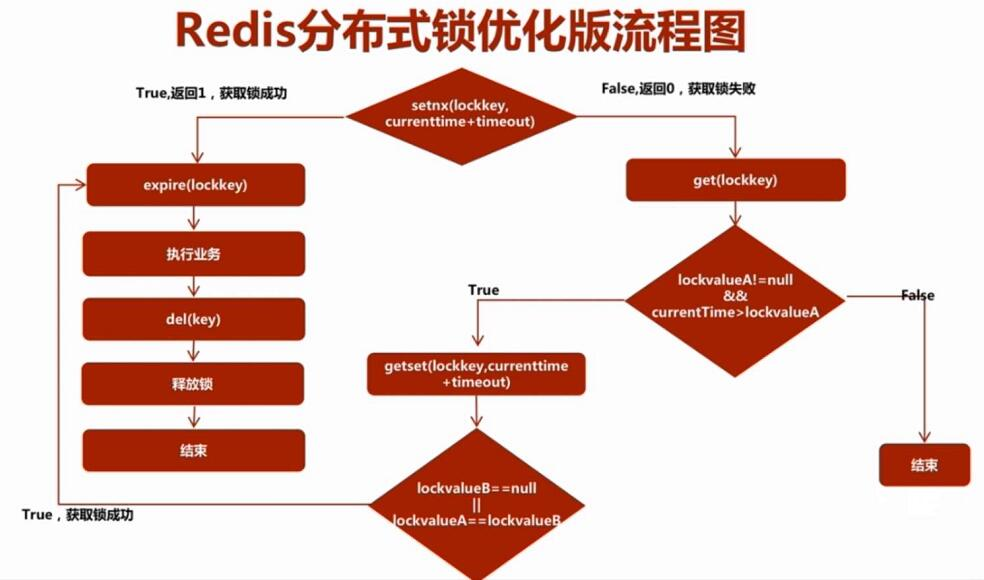

# 分布式锁实现方式

https://blog.csdn.net/wuzhiwei549/article/details/80692278

https://mp.weixin.qq.com/s/Rwi1wxWqhI2KgHV5rzubAA

http://www.hollischuang.com/archives/1716

## redis分布式锁

> 互斥性，在任意时刻，只有一个客户端能持有锁。
>
> 不会发生死锁，即客户端没有主动解锁，也可以通过过期解锁
>
> 具有容错性，只要redis节点正常运行，客户端就可以加锁和解锁
>
> 加锁和解锁需要是同一客户端

https://redis.io/commands/setnx

### setnx  key value

key不存在，则设置key的值为value,返回1；若key存在，则不处理返回0

setnx()方法作用就是SET IF NOT EXIST

```shell
redis> EXISTS job                # job 不存在
(integer) 0
redis> SETNX job "programmer"    # job 设置成功
(integer) 1
redis> SETNX job "code-farmer"   # 尝试覆盖 job ，失败
(integer) 0
redis> GET job                   # 没有被覆盖
"programmer"
```

注：SET key value[expiration EX seconds|PX milliseconds] [NX|XX] 可以复用使用

- `EX` *seconds* -- Set the specified expire time, in seconds.
- `PX` *milliseconds* -- Set the specified expire time, in milliseconds.
- `NX` -- Only set the key if it does not already exist.
- `XX` -- Only set the key if it already exist.

```java
jedirs.set(key,value,"NX","PX",100L);
```

为什么使用该命令，而不是其他命令？重点是需要他的判断性，**即不存在才设置，存在不设置**。其次是他的设置性，如set拥有设置，但是无判断，exist拥有判断没有设置。

```java
public class RedisTool {

    private static final String LOCK_SUCCESS = "OK";
    private static final String SET_IF_NOT_EXIST = "NX";
    private static final String SET_WITH_EXPIRE_TIME = "PX";

    /**
     * 尝试获取分布式锁
     * @param jedis Redis客户端
     * @param lockKey 锁
     * @param requestId 请求标识
     * @param expireTime 超期时间
     * @return 是否获取成功
     */
    public static boolean getLock(Jedis jedis, String lockKey, String requestId, int expireTime) {

        String result = jedis.set(lockKey, requestId, SET_IF_NOT_EXIST, SET_WITH_EXPIRE_TIME, expireTime);

        if (LOCK_SUCCESS.equals(result)) {
            return true;
        }
        return false;

    }

}
```


### 注意事项：

1，防止设置过期时间失败发生死锁；

```java
		Long result = jedis.setnx(lockKey, value);
    if (result == 1) {
        // 若在这里程序突然崩溃，则无法设置过期时间，将发生死锁
        jedis.expire(lockKey, expireTime);
    }
```

变通方式，直接设置value为过期时间

```java
Long result = jedis.setnx(lockKey, expireTime);
    if (result == 1) {
        // 若在这里程序突然崩溃，则无法设置过期时间，将发生死锁
        jedis.expire(lockKey, expireTime);
    }
//后续读取的时候判断一下时间
```

或者直接用redis事务或者直接使用lua脚本执行：

```shell
redis> MULTI            # 标记事务开始
OK
redis> SETNX job "programmer"    # job 设置成功
redis> EXPIRE job 30  # 设置过期时间为 30 秒
(integer) 1
redis> PING
QUEUED

redis> EXEC             # 执行
1) (integer) 1
4) PONG
```

2，防止非加锁端的客户端解锁；

即程序中加锁和解锁最好是在同一客户端实现，不过这可以根据具体的业务逻辑定；

### 方案图：



### redisson第三方库：

redisson是redis官网推荐的java语言实现分布式锁的项目。当然，redisson远不止分布式锁，还包括其他一些分布式结构

https://github.com/redisson/redisson#quick-start

更复杂的方案原理：

http://ifeve.com/redis-lock/

**性能好，实现起来较为方便。通过超时时间来控制锁的失效时间并不是十分的靠谱。**

## 数据库锁

利用数据库唯一索引加上版本号机制，外加定时任务清理

```mysql
CREATE TABLE `methodLock` (
  `id` int(11) NOT NULL AUTO_INCREMENT COMMENT '主键',
  `method_name` varchar(64) NOT NULL DEFAULT '' COMMENT '锁定的方法名',
  `desc` varchar(1024) NOT NULL DEFAULT '备注信息',
  `update_time` timestamp NOT NULL DEFAULT CURRENT_TIMESTAMP ON UPDATE CURRENT_TIMESTAMP COMMENT '保存数据时间，自动生成',
  PRIMARY KEY (`id`),
  UNIQUE KEY `uidx_method_name` (`method_name `) USING BTREE
) ENGINE=InnoDB DEFAULT CHARSET=utf8 COMMENT='锁定中的方法';
```

写入成功即获取到锁，执行完毕删除行即释放锁。

1、这把锁强依赖数据库的可用性，数据库是一个单点，一旦数据库挂掉，会导致业务系统不可用。-->集群

2、这把锁没有失效时间，一旦解锁操作失败，就会导致锁记录一直在数据库中，其他线程无法再获得到锁。-->定时任务删除

3、这把锁只能是非阻塞的，因为数据的insert操作，一旦插入失败就会直接报错。没有获得锁的线程并不会进入排队队列，要想再次获得锁就要再次触发获得锁操作。-->while 循环等待

4、这把锁是非重入的，同一个线程在没有释放锁之前无法再次获得该锁。因为数据中数据已经存在了。-->保持主机和线程现象等

### 方式2：

```java
public boolean lock(){
    connection.setAutoCommit(false)
    while(true){
        try{
          //利用mysql的排他锁，锁住查询，注意method_name添加索引，不然有可能锁整张表
            result = select * from methodLock where method_name=xxx for update;
            if(result==null){
                return true;
            }
        }catch(Exception e){

        }
        sleep(1000);
    }
    return false;
}
public void unlock(){
    connection.commit();
}
```

- 阻塞锁？ `for update`语句会在执行成功后立即返回，在执行失败时一直处于阻塞状态，直到成功。
- 锁定之后服务宕机，无法释放？使用这种方式，服务宕机之后数据库会自己把锁释放掉。

但是还是无法直接解决数据库单点和可重入问题。

**还有一个问题，就是我们要使用排他锁来进行分布式锁的lock，那么一个排他锁长时间不提交，就会占用数据库连接。一旦类似的连接变得多了，就可能把数据库连接池撑爆**

## Zookeeper

大致思想即为：每个客户端对某个方法加锁时，在zookeeper上的与该方法对应的指定节点的目录下，生成一个唯一的**瞬时有序节点**。 判断是否获取锁的方式很简单，只需要**判断有序节点中序号最小的一个**。 当释放锁的时候，只需将**这个瞬时节点删除即可**。同时，其可以避免服务宕机导致的锁无法释放，而产生的死锁问题。

来看下Zookeeper能不能解决前面提到的问题。

- 锁无法释放？使用Zookeeper可以有效的解决锁无法释放的问题，因为在创建锁的时候，客户端会在ZK中创建一个临时节点，一旦客户端获取到锁之后突然挂掉（Session连接断开），那么这个临时节点就会自动删除掉。其他客户端就可以再次获得锁。
- 非阻塞锁？使用Zookeeper可以实现阻塞的锁，客户端可以通过在ZK中创建顺序节点，并且在节点上绑定监听器，**一旦节点有变化，Zookeeper会通知客户端，客户端可以检查自己创建的节点是不是当前所有节点中序号最小的，如果是，那么自己就获取到锁，便可以执行业务逻辑了**。
- 不可重入？使用Zookeeper也可以有效的解决不可重入的问题，客户端在创建节点的时候，把当前客户端的**主机信息和线程信息直接写入到节点中**，下次想要获取锁的时候和当前最小的节点中的数据比对一下就可以了。如果和自己的信息一样，那么自己直接获取到锁，如果不一样就再创建一个临时的顺序节点，参与排队。
- 单点问题？使用Zookeeper可以有效的解决单点问题，ZK是集群部署的，只要集群中有半数以上的机器存活，就可以对外提供服务。

可以直接使用zookeeper第三方库[Curator](https://curator.apache.org/)客户端，这个客户端中封装了一个可重入的锁服务。

```java
public boolean tryLock(long timeout, TimeUnit unit) throws InterruptedException {
    try {
        return interProcessMutex.acquire(timeout, unit);
    } catch (Exception e) {
        e.printStackTrace();
    }
    return true;
}
public boolean unlock() {
    try {
        interProcessMutex.release();
    } catch (Throwable e) {
        log.error(e.getMessage(), e);
    } finally {
        executorService.schedule(new Cleaner(client, path), delayTimeForClean, TimeUnit.MILLISECONDS);
    }
    return true;
}
```

**使用Zookeeper也有可能带来并发问题，只是并不常见而已。考虑这样的情况，由于网络抖动，客户端可ZK集群的session连接断了，那么zk以为客户端挂了，就会删除临时节点，这时候其他客户端就可以获取到分布式锁了。就可能产生并发问题。这个问题不常见是因为zk有重试机制，一旦zk集群检测不到客户端的心跳，就会重试，Curator客户端支持多种重试策略。多次重试之后还不行的话才会删除临时节点。（所以，选择一个合适的重试策略也比较重要，要在锁的粒度和并发之间找一个平衡。）**

## 总结

#### 从理解的难易程度角度（从低到高）

数据库 > 缓存 > Zookeeper

#### 从实现的复杂性角度（从低到高）

Zookeeper >= 缓存 > 数据库

#### 从性能角度（从高到低）

缓存 > Zookeeper >= 数据库

#### 从可靠性角度（从高到低）

Zookeeper > 缓存 > 数据库

