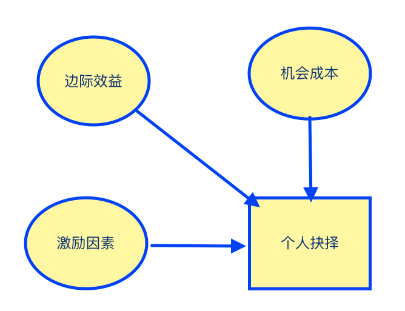
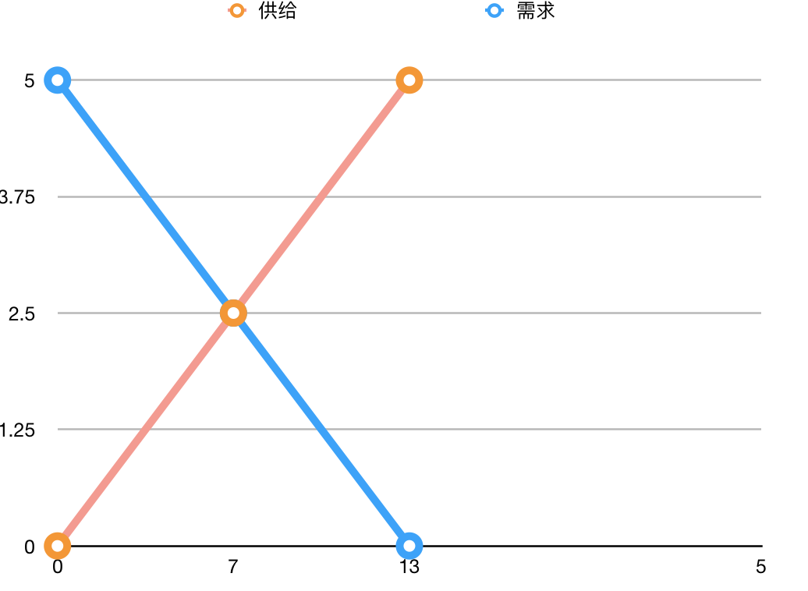

# 微观经济学

## 作者：

N·格雷戈里·曼昆（N. Gregory Mankiw“）1958年2月3日出生，美国著名经济学家。29岁成为[哈佛大学](https://baike.baidu.com/item/%E5%93%88%E4%BD%9B%E5%A4%A7%E5%AD%A6)历史上最年轻的终身教授之一，2003年走入政坛，著有《[经济学原理](https://baike.baidu.com/item/%E7%BB%8F%E6%B5%8E%E5%AD%A6%E5%8E%9F%E7%90%86/1562)》，《[宏观经济学](https://baike.baidu.com/item/%E5%AE%8F%E8%A7%82%E7%BB%8F%E6%B5%8E%E5%AD%A6/27041)》等经典教材。

作为世界上最年轻最优秀的经济学家之一，曼昆对经济研究和分析的技术运用娴熟，比如建数学模型和数量分析方法。但对格里高利·曼昆来说，这些手段只是严格分析和与同事们交流的工具。他的成名，更重要的乃是他对经济学思想的突出贡献。经济学在二十世纪七八十年代曾经遇到极大的挑战，资本主义世界持续的[停滞膨胀](https://baike.baidu.com/item/%E5%81%9C%E6%BB%9E%E8%86%A8%E8%83%80)，使三十年代以来的主流经济思想凯恩斯主义受到严重质疑。货币主义、[供应学派](https://baike.baidu.com/item/%E4%BE%9B%E5%BA%94%E5%AD%A6%E6%B4%BE)、[理性预期学派](https://baike.baidu.com/item/%E7%90%86%E6%80%A7%E9%A2%84%E6%9C%9F%E5%AD%A6%E6%B4%BE)纷纷登场，互相争论，要夺取经济学主流的王冠。在这一百家纷争的时期，曼昆一枝独树。他不是放弃凯恩斯主义，而是通过自己在微观经济领域的研究，努力为凯恩斯主义提供一个新的、更坚实的微观基础。在这一过程中，他大量吸收倾向主义、供给学派和理性预期学派的精华，并发展自己的学说。[11] 比如使曼昆成名是他的[菜单成本](https://baike.baidu.com/item/%E8%8F%9C%E5%8D%95%E6%88%90%E6%9C%AC)理论，这一理论已成为[新凯恩斯主义](https://baike.baidu.com/item/%E6%96%B0%E5%87%AF%E6%81%A9%E6%96%AF%E4%B8%BB%E4%B9%89)经济学的一个组成部分，曼昆提出这一理论的论文《小菜单成本与大经济周期：一个垄断的宏观经济模型》已成为经典。

## 1）经济学10大原理：

**稀缺性**：是指社会拥有的资源是有限的。

**经济学**：研究社会如何管理自己的稀缺性资源。

### 个人抉择：

1. 人们面临权衡取舍。

   效率：社会能从其稀缺性资源中得到的最大利益。

   平等：经济成果在社会成员中平均分配。

2. 某种东西的成本是为了得到它放弃的东西。

   **机会成本**：为了得到某种东西所必须放弃的东西。

3. 理性人考虑边际量。

   理性人：系统而有目的地尽最大努力实现其目标的人。

   **边际变动**：对行动计划的微小增量调整。考虑的时候一般考虑边际量有多大（成本），效益有多高（边际效益）

   如航空公司低价买要起飞的时候的票。因为不增加成本，且有空位。

   > 实例：手机话费，40元固定话费，每分钟0.5美元，通常每月100分钟，即每月花费90（50+100*0.5）美元，假如和朋友打10分钟电话，能收益7美元，是否愿意拨打：按照成本价90/100=0.9 即拨打10分钟电话的陈本为9美元，9>7 ？亏本？从边际成本考虑，10分钟成本一个是5美元5<7 ，应该打。

4. 人们会对激励做出反应。

   激励：引起一个人做出某种行为的某种东西。如油价上涨，人们选择小排量的汽车等。

   > 实例：安全带法则，当有安全带后，对个人而言，发生车祸的存活率提高，进而激励人们安全驾驶，因为理性人会考虑安全驾驶的边际效应和边际成本，所以更加缓慢的开车。但是对于司机来说，因为降低了死亡率，也就是因为有了安全带，人们更快速的，更不谨慎开车。但是行人就遭殃了，因为快，车祸的概率提高了。

对于个人而言：做出决定，是在考虑机会成本，边际效益，外加激励因素影响而最终做出合理的决定。

### 个人与个人之间：

1. 贸易可以使每个人的状况都变得更好。

   假如我需要一只笔，如果不进行贸易交换，那每个人将花费非常大的成本去制造一只笔。即通过与他人贸易，人们可以以较低的成本获得各种各样的物品和服务。

2. 市场通常是组织经济活动的一种好方法。

   **市场经济**：当许多企业和国家在物品与服务市场上相互交易时，通过他们的分散抉择配置资源的经济。

3. 政府有时可以改善市场结果。

   **产权**：个人拥有并控制的稀缺资源的能力。这个时候就需要政府实施规则并维持对市场经济保护。

### 整体经济如何运作：

1. 一国的生活水平取决于它的生产物品与服务的能力。
2. 当政府发行了过多的货币时，物价上升。
3. 社会面临通货膨胀与失业之间的短期权衡取舍。

## 2）像经济学家一样思考

1）像科学家一样，观察，理论，进一步观察。学会假设。

2）作为顾问一样的，实证分析，规范分析。

实证分析：描述性的，世界是什么样子的。

规范分析：规定性的，世界应该是什么样子的。

## 3）相互依存性与贸易的好处

**绝对优势**：一个生产者用比另外一个生产者更少的投入生产某种物品的能力。

**比较优势**：一个生产者以低于另外一个生产者的**机会成本**生产某种物品。

简单点，你可能有足够的专业去做某件事，但是不一定有较大的比较优势去做这件事，**贸易是基于比较优势存在的**。

一天8小时：

小明：牛肉8，土豆32，（全部）

小强：牛肉24，土豆48，（全部）

从绝对优势分析：小明适合牛肉，也适合土豆，因为效率最高。

假如时间对半：

小明一天：只能4斤牛肉，16斤土豆。

小强一天：12斤牛肉，24斤土豆。

这个时候就需要贸易交换，扩大消费机会。但是谁做牛肉，谁做土豆呢？

|      | 1斤牛肉的机会成本 | 1斤土豆的机会成本 |
| ---- | --------- | --------- |
| 小明   | 4斤土豆      | 1/4斤牛肉    |
| 小强   | 2斤土豆      | 1/2斤牛肉    |

牛肉：小强的机会成本低，所以适合去做牛肉。

土豆：小明的机会成本低，所以适合去做土豆。

总效益：

小明：32斤土豆，0斤牛肉。

小强：24斤牛肉，0斤土豆。

假如需要效益加1.

小明：4+1=5斤牛肉，16+1=17斤土豆。有32斤土豆，多出15斤土豆（32-17）少5斤牛肉。

小强1：12+1=13斤牛肉，24+1=25斤土豆，需要25斤土豆，多出24-13=11斤，少25斤土豆。这样算市场就会供给不平衡，即牛肉多，土豆少了。

小强2：产牛肉18斤，12斤土豆。反推法，12+1=13，还要给5斤小明，即小强的合理分配是产18斤牛肉，因为产18斤牛肉，这时候只能产12斤土豆。得到15斤，=27斤。

**贸易的价格**：对从贸易中获利的双方而言，他们进行贸易的价格在两种机会成本之间。如表：一斤牛肉的贸易一个在2-4之间（机会成本）。

> 实例：乔丹能用2小时修剪完之间的草坪，但是同样2小时，他能拍个商业广告，赚2万美元。邻居小孩用4个小时可以修剪完草坪，同样40个小时，在麦当劳能够赚40美元。谁适合去修剪草坪？乔丹修剪草坪的机会成本是2万美元，邻居小孩是40美元。所以乔丹给>=40美元给邻居小孩修剪。

正常的贸易是应该让所有人以最低的机会成本得到自己的利益。

## 4）供给与需求的市场力量

**市场**：由某种物品或服务的买者和卖者组成的一个群体。

**竞争市场**：有许多的买者和卖者，以至于每个人对市场的价格影响微乎其微的市场。

**需求定理**：在其他条件不变时，一种物品的价格上升，对该物品的需求量减少，价格降低，需求量增加。->需求曲线。

**需求量的变量**：收入，相关物品的价格（替代品，互补品），爱好，预期，买者的数量。

**供给定理**：在其他条件不变的情况下，一种物品的价格上升，该物品的供给量增加。价格降低，供给减少（因为价格高，收益就高，收益高，就想产更多，以扩大收益）—>供给曲线。

**供给量的变量**：投入产品的价格，技术，预期，卖者的数量。

思考：需求定理和供给定理是反的。这就造成了矛盾。如两条线相交即达到**均衡**。该点：**均衡价格**，**均衡数量**。

**过剩**：当价格高于均衡价格的时候。

**短缺**：当价格低于均衡价格的时候。

**供求定理**：任何一种物品的价格都会自发调整，使该物品的供给与供需达到平衡。

### 分析均衡变动的三个步骤：

1. 确定该事件是供给需求移动，还是需求曲线移动，或者两者都移动。
2. 确定曲线移动方向。
3. 用供球图说明这西移动如何改变均衡价格和均衡数量。

> 实例：夏天天气炎热，需求量变大，即需求曲线右移动，->新的均衡价格变大，均衡数量变大。夏天突然来一场台风，导致蔗糖被毁掉，成本增加，减少产量或者提高价格，即供给曲线左移动。新的均衡点，价格变高，均衡数量减少。

思考：灾难天气哄抬价格是否合理？

> 假如不哄抬，那商铺一个参照什么规则来，先到先得？如果这样，那先到的就会囤积货物，过度消费，原本只需要一包食品，这时候买两包。导致后面很多人没有。但是如果物价上涨，人们囤积货物的时候成本高，即可能不会过度消费，这样更多的人享受到利益。穷人？只是给穷人的开支雪上加霜。

结论：在市场经济中，价格是配置稀缺资源的机制。