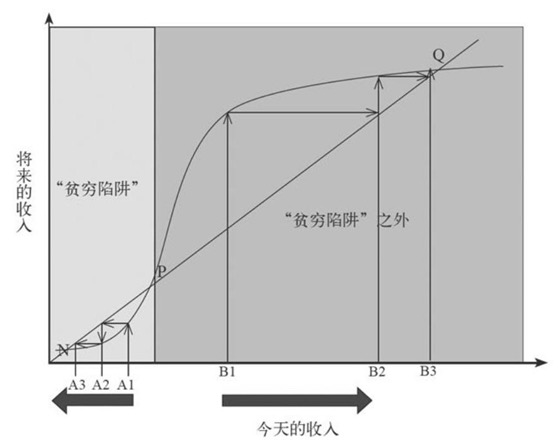

# 贫穷的本质

作者：[印度] 班纳吉，[法]迪弗洛夫妇

## 1）贫穷曲线：

注：人生的起点很重要，穷更穷，富更富。

## 2）生活

### 温饱：

目前除了极端情况下，基本上吃饭没有问题，对于穷人来说，并不优先选择获取更多能量，而是获取味道更好的能量（垃圾食品）。

事实：童年营养不良会直接影响成人的处事能力，营养不良的儿童的个子可能长不高，学习成绩更差，生下的孩子更瘦小，此外营养不良还和成年时期的经济地位较低有关系。

世界援助案例：加铁，加碘食盐。

注：**穷人的首要选择是，让自己的生活少一点乏味**。富人因为有很多让生活乐趣的方式，如选择农村很多人，明显生活压力大，但是还是想着存钱买车买房，而不是拿着钱去生钱。

### 健康：

注：穷人平常缺乏安全意识，如不定期检查身体，不愿意花费小钱去预防疾病，但是一旦得大病就完蛋，就需要花费更多的钱，即更贫穷。**把钱花在昂贵的治疗上，而不是廉价的预防上**。

穷人更喜欢去私立医院，更喜欢有病的时候让医生多开点药，不管有没有有用。

贫穷的家长可能会完全相信接种疫苗的好处-----但是这些好处只能在未来的某个时刻实现，而费用需要今天来支付。

### 教育：

穷人思维：教育就像买彩票，多生几个，中奖概率就高，即喜欢把所有的教育资源压在一个孩子身上。（中国目前也存在，即让读书更好的那个多更多的书）

注：只要阶级不被体现出来，低阶层的孩子和高阶层的孩子学习差不多，做的一样好，但是一旦低层的孩子被提醒，让他们意识到和高阶层的人有竞争，则会表现的差一些。（这是一个普遍心理现象，**刻板印象威胁**）怕不公平，怕相差太大等等，从而影响发挥。

### 人口：

注：**穷人会生更多的孩子，导致更贫困**。

计划生育，

注：质与量的选择-->计划生育的口号，少生优生，幸福一生。

贫困及未受过教育的妇女使用避孕措施的概率更小。

养儿防老：对于父母来说，孩子就是他们的经济未来：一种保障政策，一款产品，也是某种福利彩票。

家庭：很多家庭男人占经济主导地位，在男人好的时候，花费主要集中在烟酒和个人奢侈品，女人好的时候，钱主要花费在女人喜欢的小东西上，**男人比女人要自私得多**。即希望女人获取一些意外之财，补贴家用，但不期望男人这样做。女人的钱，属于家庭和孩子、

## 3）经济

### 风险：

穷人就像对冲基金经理一样----生活中充满风险。

穷人的生意，钱是自己的>=90%的资金，即风险更大，所以**穷人更倾向做小生意**。

在穷人看来，每一年都过的像身处一场巨大的金融危机一样。

在面对工资或收入下降时，穷人的一个自然反应就是，增加工作量。如果时局不好，每个人都这么想，竞争激烈，导致工资水平更低。

穷人降低风险的措施，保守经营。

穷人应对风险的所有方法一般都很昂贵。

穷人不想买保险：农村医保。

### 贷款：

穷人贷款难，穷人有大量需求，但是很少有正规机构愿意贷款给穷人。

主要原因：贷款额度少（赚的少），违约率高（风险高），审核费用高（无信用体系，需要大量人员审核），追回陈本高。所以，**人们只会借钱给富人**。

因为信用体系问题，穷人一般选择向熟悉他的人借钱，邻居，老板，生意伙伴或当地的放债人。

经典案例：小额贷款---人海战术，激励战术，社区信用。

局限：不能发现和促进大企业生成，主要是风险陈本考虑。

### 存款：

正解：储存可以在遭遇风险和疾病的时候有所保障，还可以做点儿自己的生意，但是为什么穷人不存更多的钱？

穷人的状态：耐心不够，不会未雨绸缪。

其实穷人一直在担心未来，只是方式比较昂贵，来降低遇到的风险。

穷人经不住诱惑(性，烟酒，车等等)，很容易把钱花掉，所以储存不 了钱。富人"更容易满足自己";为了每周每月的储存钱，穷人需要克服很多诱惑。

注：目前自己就有这种心态，手上有点钱，就想着如何满足自己。

### 生意：

穷人做生意，失败了就真失败了，富人还有可能重新启动。所以富人成功的可能性更大。

穷人生意：一般很少，赚的也少。也很难赚到更多的钱。==买一份工作

### 政治：

个人：大的背景下，政府的政策和实施非常重要，大环境不行，绝对是政府出了问题，中国目前的情况，政府的一些政策还是做的相当不错的。

## 4）总结

1）穷人通常缺少信息来源，相信那些错误的事物。-->教育，宣传

2）穷人肩负着生活中的多种责任。你越富有，越容易做正确的决定，穷人每天要考虑的太多的事情。

3）一些服务于穷人的市场正在消失，或是在这些市场中，穷人处于不利的地位。-->完善小额贷款机制。

4）贫穷的国家，多数是因为政策有问题。

5）对于人们能做什么或不能做什么，最终常变为自我的实现预言-->欲望

## 5）个人感悟

大的贫困下，目前只能靠国家的政策和经济的完善。对于个人而言，假如环境已经如此，则需要更大在自我控制力和信力，去努力致富和积累财富；学习可以减少信息的不对称，跳出穷人的思维陷阱，相信自己，相信未来。合理规划和分配自己的财富，1）在保障现有的基本生活。2）预防未来，身体，财产预防。3）敢于冒险。让自己跳出贫困曲线。

https://mp.weixin.qq.com/s/fCaCVF00pqcYMc-X8SwmEg

