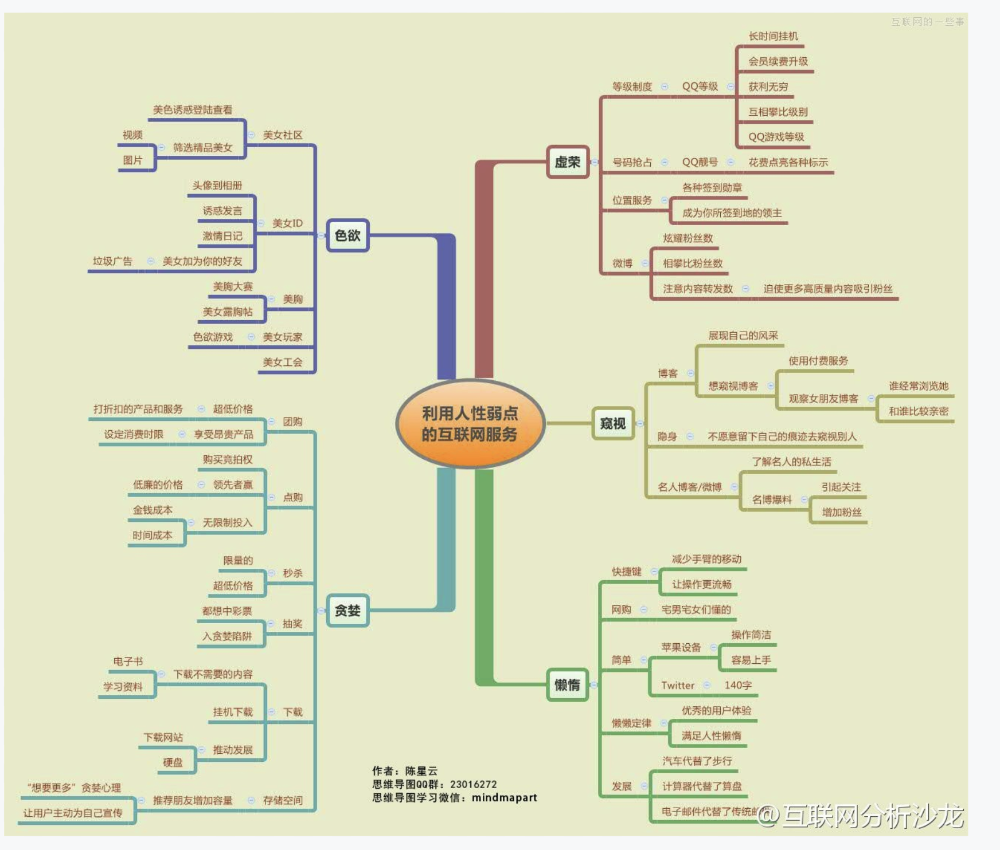

# 从0开始学习运营

作者：张亮

## 什么是运营

运营是个筐，什么都能往里装

一切能够帮助产品进行推广、促进用户使用、提高用户认知的手段都是运营。 

运营虽然看起来 包罗了很多内容，但并不意味着运营是起死回生、包治百病的灵丹妙药，所以我们也会说，运营是个渣

### 运营需要的能力

1）对数据的敏感。 

2）想象力与创造力。 

3）口头表达能力、文字表达能力。 

4）沟通的能力。 

5）执行力

### 思维能力

1）发散性思维：从一个点出发，进行思维的扩展，最终产生出多个方案，而 

不是唯一方案。

2）逆向思维：这是一种逆转因果的思维方式，从原因可以推知结果，反过来从结果反推原因。

3）结构化思维：这是一种系统级别的思维方式，它通常不采用头痛医头脚痛 

医脚的case by case解决方案，而是汇总让系统来解决类似的所有问题。 

## 内容运营

内容运营是指通过创造、编辑、组织、呈现网站内容，从 而提高互联网产品的内容价值，制造出对用户的黏着、活跃产生一定的促进 作用的运营内容。 

一个网站或者产品，一定是有内容进行填充的，而内容的来源、挖掘、组 织、呈现、通知的方式和质量会对内容运营的效果产生巨大的影响。

**内容供应链**——将内容视为你的商品 

### 包含事项

1、内容的采集与创造 

2、内容的呈现与管理 

3、内容的扩散与传导 

4、内容的效果与评估 

### 注意事项

1）网站或者产品上有哪些内容（定位） 

2）这些内容从哪里来，由谁提供（来源） 

3）这些内容给谁看，达到什么样的目标（受众） 

4）这些内容要如何组织与呈现（展现机制） 

5）这些内容如何做筛选，什么是好的内容（内容标准化） 

内容运营的初期，我们解决内容运营问题的顺序应当是： 

1）内容消费者定位（网站定位+受众定位+运营目标） 

2）内容来源确认（采集或是寻找内容制造者） 

3）内容标准的确立（有哪些内容、如何展现内容、评判内容质量的标准） 

内容初始化——构建网站与产品的价值观 

确立了内容流转的机制之后，就需要准备内容并在内容供应链完成后（包含 前后台）上线最初的内容。所以，内容初始化是另一个在内容运营初期要做 的事情

1）**确立好内容供应链的架构**。即通过系统去解决内容从哪里来、到哪里去的 流程问题。 

2）**确立好内容面对的初始用户群**（关于初始用户或者称为“种子用户”我们会 在后面具体讨论）。 

3）**想清楚第一阶段用内容解决的问题，并进行内容准备**。一个社区网站，要 想清楚第一阶段的内容如何去留存种子用户，并且通过一些运营方式的准 备，确保种子用户的活跃和协助进行内容传播；一个交易型网站，要想清楚 第一阶段的内容所包含的核心点，商品描述支持哪些类型的表达，提供什么 样的工具让希望产生交易的商户提供内容；等等。 

4）**关键路径的梳理与初始内容的准备**。对于社区型网站或者产品，可能是自 己作为用户或者定向邀请一些种子用户开始做一些内容填充，让后来进入的 用户大致知道这个社区是什么样的社区，怎么玩。对应的关键路径，可能有 新用户进入后的引导文案、种子内容所属领域的内容填充；对于交易型的网 站或者产品，商品信息、图片展示就是内容初始化的重点，对应的关键路 径，可能是注册引导文案、交易引导文案、商品基础信息、支付流程教学 等；对于门户网站或者产品，新闻、资讯就是内容初始化的重点，等等。

### 核心三件事

一个网站或者产品，只要 

需要内容，就涉及内容供应链的建立，只要涉及内容供应链的建立，就必然 涉及三方：**网站与产品本身、内容生产者以及内容消费者**。 

#### 1）内容消费者定位

定位内容消费者，是一个以内容为主的网站或产品首先要做的事情，它是决 定网站或产品最早一批种子用户中，进行内容消费的人群描像的关键。 

比如，知乎早期的内容消费者定位是IT、互联网人群；豆瓣早期的内容消费 者定位是喜欢读书的人群；时光网的内容消费者定位是电影爱好者。

这样的定位，带来的是网站或产品早期提供内容会聚焦在哪一个用户群体， 从而建立比较单纯但直接的效果评价体系，并让后续运营调整和改进有依 据。

控制内容消费者进入最成熟的方案是：**邀请机制**。

##### 邀请机制

a）让人感受到“稀缺性”。感受到“稀缺性”会带来两种极端：人群精确锁定与 黑市交易泛滥。人群精确锁定是最好的结果，但如果稀缺的邀请码流入到黑 市，就无法产生其本身希望锁定人群的目标，甚至会导致用户的厌恶情绪， 损害品牌。 

b）人为制造垂直领域用户群或者单一结构的用户群。 

c）考验内容运营者与内容生产者的能力，甚至考验网站或者产品的成色。邀 请码本身让潜在的用户充满了好奇，想要知道邀请码背后的世界究竟如何， 而如果内容生产者或者运营者的能力不足，甚至网站或产品的技术有问题， 就很容易产生用户活跃度低，无法激活有效用户留存和活跃。从而带来不好 的结果。

##### 护城河

建立新注册用户XX小时不允许发帖甚至发言。

这种作法的好处是： 

a）避免小号、水军进入，减少灌水。 

b）可以结合一些手段，让用户发言或者发帖前已经学习了相关规章制度，减 少垃圾内容的出现。 

坏处是： 

a）考验用户的耐心。其实考验耐心是在考验用户对内容的需求强烈层次。 

b）同时考验内容本身的成色。

 但不管采用何种方案，控制内容消费者进入的类型和速率都和网站与产品本 身的定位是正相关关系。其出发点都是为了避免过早的走向内容的扩张，从 而确保在网站与产品的初期，内容消费者是一个较为固定和单纯的群体，便 于运营切入。

#### 2）内容生产者维系 

定位清楚内容消费者，只是第一步。而下一步就是要提供内容消费者感兴趣 的内容，这部分内容可以自己提供，也可以请别人提供，但不管谁提供，都 是内容生产者。 

这里需要注意的是，如果内容生产者是人，那么就需要维系和内容生产者的 关系，以确保内容生产者持续的为内容消费者提供内容。

#### 3）反馈与跟进策略

1）内容的采集与管理工作中，必须要考虑用户反馈和对应反馈的跟进策略。 

2）反馈机制和跟进策略可以根据平台的不同挑选展现方式。 

3）数据挖掘机制非常重要，但更重要的是对数据挖掘之后的反馈与跟进。 

4）内容不是一成不变的，它需要调整与提高。 

5）内容运营必须要有KPI，但是这个KPI不管是曝光度的指标还是其他指 标，指标的意义都不是单一用来达成，而是要返回来指导下一阶段的内容运 营工作。

### 让内容健康的流转

1）网站初期有了内容，但是如何到达内容消费者？ 

2）内容消费者消费了内容，但如何让内容制造者持续的生产内容？ 

3）内容制造者生产了内容，如何让内容扩散到其他的社区或者平台，让内容 产生更大的价值？ 

对于内容运营者来说，如果要让内容到达消费者，最重要的就是搞清楚几个 问题： 

1）内容消费者是谁？ 

2）他们通常在什么地方活跃？ 

3）他们的习惯是怎样的？ 

4）最近他们在关注什么热点？ 

5）我需要提供什么才能让他们注意到我、爱上我？ 

对于内容运营者来说，要让内容制造者持续的产生内容，就要尽量避 免在一个时间段内，带来大量的与内容制造者产生的内容类型、内容质量不 匹配的内容消费者。

### 持续运营

当一个网站或者产品进入正式运营阶段，就需要去建立一些标准： 

1）内容质量的甄别 

2）好内容的露出与呈现方式 

3）持续的推送与推荐机制的建立 

4）实现“自运营”的路径与机制选择 

### 怎么写出好内容

1、了解受众。不管是做活动还是日常运营，你需要了解你的文案是给谁看 的。

2、了解产品和活动。不管文案给谁看，你要明白这些人需要什么，而你能够 提供什么。

3、准确表达。不管是活动规则，还是产品介绍，不管你用多少笔墨，你要准 确的告诉受众，你的文案是用来干嘛的，一个活动运营的文案，要说明清楚 活动规则；一个产品介绍的文案，要说明清楚产品功能、特色特点。

4、画龙点睛。做活动的要突出用户做了大量行为之后能够获得什么，价值何 在；做产品的要突出产品最独特或者最有优势的那一个点

5、勤加练习。只有不断的练习，才是提高文案水平的正确途径，没有捷径。

### 公共平台运营

从微博、微信等社交和自媒体平台上线以来，我们看到了密集的内容运营 的场景，从大V到公众号，从段子手到营销公司，纷纷利用这些平台的特性 去对一些品牌承担“内容营销——品牌营销”的工作。

很多企业和运营人员，很难坚持在一个平台上去做内容运营，甚至不了解在 自身的平台之外，如何去做这件事情，以及这件事情做了之后究竟有没有好 处。但是，因为大家都在做，所以，就算这件事情做了对自己没有什么帮 助，也可以试试看，抱着这样的想法，很多企业将内容外包，或者从团队中 分一个Team出来做内容运营的工作

1、先定位。 

根据要进行内容运营的品牌自身的特点、受众、调性来定义公共平台所要进 行运营的内容的特色、受众和调性。

2、快速测试，获取反馈。 

做完了定位，意味 着知道备选可以放置的内容了，那么就要去看用户是否喜欢，是否感兴趣， 在公共平台的内容运营也一样，要快速的测试，看你之前定位的受众是否接 受你创作或者采集的内容，如果发现反馈平平，那就多试几次进行调整。

3、培养用户的习惯。 

内容发布的频率不是最重要，但是固定的内容发布时间很重要。如果内容发 布的时间固定，长期执行关注内容的用户会养成定时查看的习惯。 

当然，习惯是建立在用户对你感兴趣的基础上，如果前两步没有做好，这一 步就没有价值了。

4、坚持长期的内容运营方针。 

既然选择进行内容运营，那么就不要妄图今天做了，明天就有效果，明天做 了后天就有效果，这样的想法不管做什么事情，都是错误的，尤其是内容运 营方面，有句话叫“一个人做一件好事不难，难的是一辈子都做好事”，内容 运营也是这样，“一段时间做优质内容不难，难的是一直做优质内容”。

5、与内容消费者保持互动。

6、少唱口水歌。 

这句话的意思是，尽量多的去做原创，尽量少的做转发和从其他平台或者内 容运营者那里去借鉴内容。 

### 如何让社区用户动起来

1）提高准入门槛。 

对于拥有稀缺内容或者优质内容的社区，会采用抬高用户的准入门槛，通过 设置护城河、用户分级，让真正需要内容的用户进入，让不是真正需要内容 的用户离开，进入的用户通常会积极参与社区的讨论，让社区的氛围热闹起 来。

2）建立标准，让用户按照规定动作参与社区运营 

3）制造观念冲突，让用户自发站队 

首先，这是一种比较有风险的作法。同时，这也是一种能够在短时间内制造 出用户活跃和用户引入的作法。 通常这一套运营方式是利用社会热点，形成多种不同角度、不同立场的初始 内容，然后通过手段，让认同不同观点的用户发现彼此，并制造出冲突，从 而引发用户的站队，比如之前的方韩大战，相信很多使用此法的社区、论坛 的用户活跃度在当时都有不错的提升。

### 移动端内容

移动端内容运营的第一步，依然是定位。说 到定位，就会产生2个要求： 

1、针对性 

2、延续性 

**针对性**是说，你需要仔细的想清楚你的内容是给谁看的，对这些人，你的内 容是如何体现出针对性的，要让看内容的人满意，才有可能让他留下来。 

**延续性**是说，你需要贯彻你的内容定位的方针，让用户习惯你，从而产生忠 诚度，愿意停留在你的平台上，甚至通过各种运营手段的叠加，让用户愿爱 上你并愿意主动去分享你提供的内容。 

而移动端运营的第二个重要的事情是，**加入社交元素**。 

### 社交与内容

1、分享。这是最基本的层次，社交在于内容上，一定会带来更多的传播和更 广的扩散，这一点毫无疑问，几乎所有做内容的，都做到了。 

2、互动。这个层次比上一个层次其实是更深入了，内容与用户的互动，用户 与用户的互动。所谓互动，是你动我也动，你动我一下，我动你一下，如果 只有一方在动，就不是互动。互动会带来什么？我们之前也聊过，带来内容 的精准度、丰富性、针对性的提升，带来用户体验的提升。 

3、信任。这一点不多说了。 

4、忠诚。这个层次是很多人可以看到，但很多人很难去执行并且最终实现 的。当用户对内容忠诚，代表着信任的构建完成。 

5、营销。有很多做内容的产品或公司或个人，往往会将营销置于忠诚之前， 我个人觉得是有问题的。当然，也许有些内容走的是肾，不需要信任与忠诚 即可达到营销的目的，但我要说，很多内容的走心。尤其是当走肾这件事情 越来越普遍的时候，走心虽然看起来慢，但可能是捷径，而且，未必就真的 慢。

## 活动运营

### 如何进行活动策划

#### 活动理由：

1、时间理由：

时间理由是最常见的活动理由，我们经常可以见到。 

a）法定节假日。比如，五一节——劳动最光荣；十一——国庆七天乐。

b）季节变化。比如，换季清仓大甩卖，巴拉巴拉。

c）历史上的今天。比如，京东的周年庆： 

2、产品或者商品本身的理由

3、社会热点、娱乐热点、新闻热点等等

4、自造热点

建议你先阅读一些书籍，做一些思考， 然后再尝试，比如《引爆点》、《部落》、《乌合之众

### 如何写活动策划 

一个标准的活动策划可能包含但不限于以下内容

1）活动主题：活动文案的一部分，让用户看的懂，明白你的活动是什么主 题，是否对他有吸引力。

2）活动对象：明确你的活动针对的群体，让用户看的懂，让自己抓得住，让 领导认可。 

3）活动时间：活动的开始时间、结束时间，奖励的发放时间、领取时间。 

4）活动描述：活动文案的一部分，让用户看得懂，决定要不要参与，怎么参 与。

5）规则详情：活动文案的一部分，让用户看得懂，让开发看的懂，一部分内 容是在前端展示的，另一部分内容让开发知道活动如何实现。 

6）投放渠道：让市场看的懂或者你自己看的懂，要有投放时间、投放渠道的 选择、预算。 

7）风险控制：让开发看得懂你的风险环节是什么，有无对应的措施来解决。 

8）监测指标：涵盖大多数相关指标，包括投放渠道的监控、用户参与情况的 监控、奖励发放的监控，等等。可以帮助你在查看数据的时候找到问题点， 并且启发你去解决这些问题。 

9）成本预估：一个活动要多少钱，单人成本多少。不一定非常准确，但是必 须要有这个意识，活动有不花钱的，但是如果要花钱，你要明白一个活动的 容量有多大，对指标的帮助在哪里，为了这些利益，你需要公司拿出多少钱 来支持。 

10）效果评估：有成本就有收益，你的活动的目的对网站/产品的那些指标是 有帮助的，如何体现，你要考虑，让领导认可。 

11）FAQ：可以另外准备一个文档，提供给客服或者相关人员，帮助解决用 户在参与活动中产生的困惑。FAQ要详细、标准。如果活动规模大，光FAQ 还不够的时候，你要提前准备客服的培训文件，并积极进行沟通。 

活动效果的报告可长可短，但通常要包含以下内容： 

1）活动概述：简单复述活动主题、对象、时间、内容。 

2）活动效果统计：对活动结束后的活动效果进行描述。 

3）宣传效果统计：对各个投放渠道的效果进行统计，并且掌握每个渠道带来 的流量、转化率的相关数据。 

4）反思与总结：活动效果、宣传效果带来了哪些经验和教训，下次要怎么调 整，如何提高。

### 核心4件事情

#### 1）成本预算与活动设计

a）抽奖方式

b）借力

借力是一个相互的过程，因此，我们会发现，如果自己的活动预算不够，那 其实还可以尝试与别的产品或者网站去做联合活动，共担成本。

面对活动运营的成本预算管控，我们在活动设计上可以做什么 

呢？我个人的观点如下： 

1、先看能不能借势，再看能不能借力。可以借势的，用抽奖玩，可以借力的 用合作分摊成本。 

2、如果势、力皆无，那么就要拿出数据说服老板，要么降低活动预期，要么 增加活动预算。 

3、如果老板说服不了，那么，尽你的最大努力，来设计一个吸引人的活动 吧。

#### 2）活动风险管控与应急预案 

运营最累的部分，其实是如何控制运营风险，把用户体验做到 最好。而活动运营最累的环节不是如何设计一个有趣的活动，而是如何保证 活动开展过程中的用户体验，减少活动的风险。换而言之，哪怕是最普通的 活动内容，用户看了完全提不起参与的兴趣，也不能让有兴趣参与的用户在 整个活动流程中感到不快，不管是活动开发有Bug导致的体验不佳，还是活 动设计有漏洞导致的不公平，都是需要考虑和严格把关的内容。 

在活动策划环节，就要考虑几个问题：设计的活动规则是否有漏洞（自己考 虑，穷举极端事例）、会否因为活动影响普通用户的体验（系统问题，需要 和产品沟通）、奖励设置是否合理（考虑用户获奖难度和用户获奖所需成 本）、运营节奏如何把控（何时投放宣传、哪些指标提示需要调整文案）、运营效果如何监测（数据相关、核心指标、关联指标的考量等等）。 

#### 3）活动数据监测与应对策略 

a）我们需要了解活动投放的渠道引入用户的转化率，并且了解什么样的用户 对这类的活动感兴趣（是否下过单，是否活动带动了原先未注册的用户进行 了注册，等等）； 

b）我们需要了解用户偏向于使用什么样的邀请渠道来邀请用户，以及各渠道 的转化率如何，这可以帮助我们在后续运营活动中进行改进，如果用户喜欢 用SNS渠道，那么就要加强，如果用户不喜欢用邮箱渠道，那么以后就尽量 不用，等等； 

c）我们还需要了解新用户是否对活动感兴趣，在这里，我们可以多多尝试调 整文案、强化引导等手段，来提升新用户的转化率，我们在这一数据指标监 测中可以有效的掌握用户的偏好，究竟对于何种文案感兴趣，究竟是否能够通过各种引导来完成用户转化。 

d）我们还需要监测新用户进入后有没有下单，下了什么单，单价多少，等 等，这对于我们了解网站销售的产品对新用户的吸引力如何，什么样的用户 喜好什么样的产品有帮助。 

e）既然发了代金券，总归要知道用户有没有使用。

#### 4）活动效果判定与总结 

1、所谓活动的归纳总结，绝不是活动之后写一篇活动报告这样简单的文本工 作。

2、归纳总结更多的是为了从一次活动中得出经验和教训，用来对以后的活动 运营工作的提升进行指引，而不是追究活动效果不利的责任，或者美化活动 效果得到奖励的依据

### 周期性活动

**周期性的活动**有助于培养用户的习惯养成，可以减少宣传的成本， 养成了习惯的用户到了时间节点会主动的参与活动。通过用户主动参与的行 为，可以了解用户的偏好，对后续的活动运营改进有所助益。 

### 淘宝活动

1、围绕单一的合作活动，去做活动设计 

2、总结合作活动的共性，去做系统设计 

## 用户运营

用户运营是指，以网站或产品的用户的活跃、留存、付费为目标，依据用户 需求，制定运营方案甚至是运营机制。**用户运营的核心是开源、节流（减少 流失）、维持（促进活跃及提高留存）、刺激（转化付费）**。

### 开源：

1）选择注册渠道和方式 

注册渠道的选择决定用户进入网站或者产品的入口；注册方式的选择决定用 

户进入的门槛。 

2）提升注册转化率 

用户完成注册只是获得用户的第一步，最重要的运营工作是，如何将一个注 册用户转化为一个对网站或产品有认知的有效用户。

核心处理逻辑：

1）把用户当成是傻子。简单明了图文并茂的告诉用户你是什么，你能做什 么，用户从哪里开始体验。 

2）最大程度的展现核心功能、核心价值、核心玩法。 

3）分阶段展示次要功能、次要价值、次要玩法，不要试图全部塞给用户。 

4）根据数据表现，调整文案，改进引导顺序等。 

5）要有趣，不要让用户觉得烦躁，步骤要简单、流程要短，很少有人有耐心 数次点击还没看明白你要表达什么。 

6）引导要捆绑用户行为，用户的每一个反馈可以告诉你他究竟是否明白你在 和他说什么。每一个反馈都可以提供一些激励，促进他继续下去，完成流 程。

### 节流

节流主要是指保持用户规模，**通常落脚点在沉默用户数**，因此节流的主要工 作是： 

**1）定义清楚流失的标准是什么** 

用户在多长的时间没有登录网站或者产品就意味着流失，这是一个定义和标 准的问题。

a）流失行为是一个长期的持续的行为（留存也是，并不是说用户用了多长时 间就是留存，而是在一个长的时间内，用户一直在持续的使用，哪怕他的频 率是1个月使用一次）。 

b）定义流失需要首先建立自己的用户行为模型，从而确认对于自身网站/产 品来说，到底多长时间不使用就是流失 

**2）建立流失预警机制** 

用户在何种情况下可能会流失，要通过运营数据得到一些模型，并制定相关 的运营策略。 

a）在流失前，用户进行了哪些类似的行为 

b）这些用户是否集中于某一渠道 

c）这些用户的性别属性、地域属性、年龄层次、兴趣特征是否类似 

d）发生流失的时间点，产品做了哪些动作，是否发布了新版本，是否更改了 某些核心功能 

流失预警工作是建立在对用户行为数据的掌握和对产品节奏的了解的基础 上的。 

流失预警是一个动态变化的过程，在初期设立的指标要随着产品的改动、 运营的变化而随之调整，否则可能就是很容易失效的监测指标。

**3）对已流失的用户进行挽回** 

用户如果已经流失了，如何尝试让他们回到网站或产品中，需要开展活动。

给用户想要的一切 

持续给他们想要的一切 

尝试给他们可能喜欢的一切 

避免让他们失去兴趣。

用户挽回的第一件事：**让用户知道你要挽回他** 

让用户知道你要挽回他，包涵两层含义： 

1）通过什么样的渠道告诉他如何告诉他你要挽回他（这个我们放在第二点里 一起说） 

2）一个用户的流失，意味着你不可能从系统内的渠道和他取得联系，那么就 一定是系统外的渠道，系统外的渠道有很多，但用来用去，最多的还是那几 个

邮箱的成本最低，短信的成本最高，系统推送（尤其是强制的Popup）效果 最好，但是处理不好也最让用户反感。尤其是系统推送信息，只对客户端没 有被删除，且用户允许接收推送消息时有用，虽然真的是非常烦人，但是效 果也相当的好

第二件事情：**让用户认为你是care他，而不仅仅只是要挽回他**。 

对于要挽回的用户，首先要明确用户为什么会来你这里。

第三件事最重要：**挽回后的用户更需要引导和关怀** .

### 促活跃

促活跃主要是指提升用户使用网站或者产品的频次，**通常落脚点在用户留存 率和用户活跃率**，因此促活跃的主要工作是： 

1）定义用户留存与用户活跃的标准用户的留存是否等于用户每天都来网站或者每天都使用产品？如果不是，那 么网站和产品的特点会对应怎样的用户留存行为和活跃行为。这些是运营要 解决的定义问题。 

2）提升用户留存率 

用户要留存，运营人员会做哪些事情，用户留存的比例如果过低，有什么方 式可以提高留存的数据，这些是具体的工作内容。 

3）提升用户活跃度（用户行为、产品使用频次等） 

用户留下来了，不意味着用户就是活跃的，有一些行为标识出用户是否活 跃，这些行为是什么，如何促进这些行为的发生，这是运营人员的功课。

### 转付费

转付费主要是指抓住高价值用户（或称核心用户）的需求，让他们为网站/产 品付费，并且想办法持续付费，通常落脚点在**付费用户数**（根据网站/产品的 形态不同，定义未必是一致的，但提到转付费，那就酱！），转付费的主要 工作是： 

1）通过一系列的行为让未付费的活跃用户付费 

活跃向付费的转化是盈利方式为用户付费的网站或产品的重要工作内容。 

2）通过机制让已付费的用户持续付费 

已经付费了的用户，意味着对网站或者产品有极高的依赖，如何通过运营手 段，让他们觉得值得为了网站或产品的功能，甚至是付费持续的付费，有时 候也是运营人员认为困难但必须要考虑的事情

### 用户运营4件事

#### 开源

#### 节流

#### 促活跃

#### 转付费

做用户运营，其实要很关心两件事： 

1）产品的可用性。可用性是说，这个产品的功能是不是OK的，能不能拿给 用户用，会不会引发用户的歧义，会不会出现重大BUG。 

2）产品的易用性。易用性是说，这个产品是不是相比竞品，有更好的体验， 是不是让用户觉得舒服，是否需要特别的用户引导。 

### 用户激励

用户运营里最大头的两端，一端是引入用户，一端是避免流失，如果这两端 是头和尾，中间最健壮的驱赶就是激励留存

头衔，等级，勋章，成就，排名，积分

### 用户对待

1）切记尊重用户，但不盲从用户 

2）切忌和用户走得太近，也切忌没有交集 

### 分级管理

用户分级，听起来时一个很作的事情，我已经有了用户，为什么还要做分 级，从小念书、学习家长老师就给我们分三六九等，工作了为什么还要把用 户分三六九等？原因很简单，不管是一个人还是一家公司，不管是一个站点 还是一个产品，精力和资源都是有限的，而投入和产出比需要最大化，否则 就会影响发展

## 运营数据

我们要认识到一个前提：数据分析的能力是渐进的，**对数据的敏感度 是需要培养的**。 

最后，我们要懂得一个道理：数据表达出的涵义与多种因素相关，尝试学习 运营数据分析之前，要尽可能的**抛开预设立场**，而同时，各个阶段的不同类 别数据的重要性是变化的

1）掌握历史数据 

2）从历史数据中归纳规律 

3）通过规律反向进行数据预测 

4）学会对数据进行拆解 

### 误区

1）不要用单一类型的数据去评价全局

2）不要夸大偶然事件，认为带来必然结果

3）避免用结论推导原因 

4）避免唯数据论 

### 数据造假

1）拉伸图表

把图表拉伸一下，给人看到的感觉，就完全不一样

2）修改坐标轴数据

同拉伸图表，修改坐标参考数据值，感觉也不一样

3）故意选择有利的样本 

4）样本规模差异 

我们经常需要做一些A/B测试来验证某个功能或者某个设计 更好，这个时候，最容易犯的错误，也是最容易带来数据说谎结果的情况就 是，样本规模有差异，比如，A类选型选择了100个用户，而B类选择了1000 个用户，不管我们最终选择绝对值，还是比例，其结果都会带来巨大的误 差。

1、当我们在讨论数据的时候，我们真的是在讨论数据么？ 

2、当我们分析数据的时候，我们只是在看数据的涨跌变化么？

### 三大数据

#### 渠道数据

渠道数据，是用来衡量渠道质量、渠道作用的，它由产品本身的定位的客群 和产品的特性所决定。我们其实很容易可以推倒，一个理财产品如果投放游 戏社区这种渠道，其运营效果可能并不会太好，可如果换成彩票、博彩，可 能效果就很好；同理，传奇这一类的游戏的宣传与活动如果投放到女性社区 平台，其效果几乎也可以无视，而如果换成一款Q版小游戏，或许效果就很 好。

#### 成本数据

#### 收益数据

而所谓“收益”，并不等价于“收入”，获得金钱是收益，获得用户也是收益， 获得口碑同样是收益。 

### 如何分析数据

#### 1）确定数据的准确性 

这里包含了选择数据维度的合理性、数据统计的准确性。如果数据维度选择 不合理、数据统计结果不精确，我们可能是无法得出正确的分析结果的。这 是基础。

#### 2）明确影响数据的因素 

一个数据，会收到多种因素的影响，这些因素有内部的，有外部的，运营人 员应当尽可能多的了解所有层面的影响因素，以利于我们对于数据的解读是 在一个相对正确的范围内。 

#### 3）重视长期的数据监测 

在运营数据分析中，经常会使用环比和同比方式来对比数据。简单的说，环 比是本日与前一日的对比、本月与上月的对比、本季度与上季度的对比；同比是今年当日与去年当日的对比、今年当月与去年当月的对比、今年当季度 与去年当季度的对比。环比帮我们看短期的数据波动，而同比帮我们了解大 环境下的数据波动。 

#### 4）保持客观的视角 

数据分析的过程中，客观非常重要，不以物喜不以己悲，做了错误的操作， 带来了不利的影响要承认，获得了超出意料的成果要心平气和，切忌挑选有 利于自身的结论。这是职业道德的问题，也是职业发展中非常常见的问题。

#### 5）注意剔除干扰项 

实际的工作中，我们会碰到很多问题，这些问题是干扰项，例如，在一个相 对平稳的曲线中，突然出现了一个点上的强烈波动，这时候我们需要全面的 了解个波动产生的原因，如果无法确认原因，就剔除这个波动，否则我们很 难去获得一个正确的结论

## 运营与产品

1）产品定位。运营切入点是什么，切入点上面对的用户都是什么人，他们的 消费水平如何，兴趣点在哪里。 

2）产品质量。包括功能指标、性能指标。人来了要接住了，接住了要留住。 

3）产品对运营的支持。要留住人，既需要产品功能、产品体验，也需要运营 工具、活动设计。 

4）市场推广。对哪些人开放，要在哪些市场投放。 

5）商务合作。联合运营是不是可以事半功倍，商务合作是否要排他等等。 

6）财务预算。不管是用户数还是流水，还是收入或者营收，都面临单人用户 的维护成本，财务预算要多少，是否能够支撑运营目标的达成。 

7）商业模式。预算即成本。现有的商业模式能否支撑成本，是否需要找投资，什么节点找。运营目标拆解之后，会很清晰。 

## 移动端运营

移动端的运营，简直让人煞费苦心——如果Web端上你有钱肯砸，用户总归 会来，可App端如果你只有钱，恐怕砸来同样数量的用户，要比Web端难上 几倍。 

张小龙在12月微信公开课上分享了这个数据。“20%的用户到订阅号里面去挑 选内容，然后80%的用户在朋友圈里去阅读这些内容。“

App获取用户的入口主要有以下一些： 

1、应用商店的推荐、推广位 

2、与其他App的换量互推 

3、积分墙 

积分墙和换量互推比较类似，但操作方法却不同，积分墙是可以无视用户是 否吻合的，当然，积分墙的积分获取规则要想清楚，是安装获取积分，还是 激活获取积分，还有一定步骤的操作获取积分。积分墙由于需要花费成本， 所以必须谨慎的对待，以免钱花出去了没有效果

4、品牌手机预装 

5、各种排行榜 

### 人性图片

反而聚焦到了以下的层面： 

1、产品本身具有社交属性，自己的内容可以被传播，可以和其他人互动。 

2、单纯贡献自己的经验，并期望得到他人的认可，甚至羡慕或崇拜。 

运营是一件繁琐的工作，但是一旦你要基于用户设计运营方法，不管你背后 的逻辑多么健全、规则多么详尽，你要考虑到用户接触到这些运营内容时， 是否感觉自然、是否能快速了解自己应该要做的事情

如何才能从繁入简呢？点评的这个活动其实很有代表性。如上文的分 析，通过这个活动，点评希望同时达成多个目的。因此，才会有如此复杂的 规则。当然，对于运营来说，一次性给了1个亿（假设真的公司出了这笔钱作 

为活动成本，事实上因为抵用券的存在，我们几乎可以肯定是不会到这个宣 传最大值的）让你做活动，自然希望你可以把这笔钱的效果发挥到极致，这 一点无可厚非，而集中一个活动，而非分散多个活动，也是活动运营中最常 见的做法——集中一点更利于形成突破，分散多点效果分散且风险更不可 控。

但是，我还是要说，这种事情，越少干越好

1、运营最好要有计划，分阶段的达成不同目标。

2、运营最好要有条理，逐步去促进各种数据的达成，更利于用户形成习惯。 

3、运营要有方向和关联，如果能够通过一个奖励或者一个动作达成一条逻辑 线上的用户行为满足，就不要拆分成多个去上线。 

这3个理由，都是让运营由繁入简的必需理念

## 用户习惯养成

“用户习惯”这个词，更多的出现在产品经理进行用户研究、交互设计的过程 中，所谓的用户习惯研究更多的是心理学层面上的研究，主要讨论的是在产 品的交互设计中，怎样能够让用户不假思索的使用产品。 

在运营层面，我所理解的“用户习惯”，是**帮助用户养成对运营节奏的适应、 对运营活动的期望**。 

对于运营层面的用户习惯养成，第一个要点： 

**持续，持续并不等于一个活动做一年，而是每到这个节点，你都有对应的运 营策略**。 

而第二个要点，则是： 

**固化，固化不等于每到这个节点，你都做同样的事情，而是每到这个节点， 你会让用户有类似的感知**。譬如双11之于网购便宜，如果今年的双12，阿里 继续做线下，那么到了2016年的双12前夕，用户就会期待双12的线下优惠。

“教育用户”，是指，对用户进行合理、有效的引导，使用户更好 的使用产品、参与运营

如果你的产品设计，符合用户习惯，每一个用户的动作都可以让用户获得对 应的预期，那么，你并非一定要做新手引导教程，但是，为了防止有用户是 初次使用类似产品，不明就里，你应当设计好新手引导教程，供有需求的用 户使用。 

譬如，你设计的产品，在某些细节功能上和另一款竞品有差异，那么，你必 须做新手引导。 

譬如，你设计的产品，迭代时，有大量的产品改进，那么你必须做新手引 导。

譬如，你设计的活动，涉及到复杂的规则，那么你必须准备详细的FAQ。 

看出点什么了么？ 

是的，**“教育用户”=培养新的用户习惯**

用户真的需要教育吗？ 

这个问题其实众说纷纭。每一个产品经理、每一个运营、甚至每一家公司， 

对此理解都不同。 

从我的角度来说： 如果你的设计（无论是产品功能还是运营机制）符合用户的预期，那么用户 是不需要被教育的。如果你的设计不符合用户的预期并且你打算与市面上的 竞争对手因为这些设计差异保留出竞争特性，那么用户是需要被教育的。 

**产品有大改版**，很多功能发生了改变。运营端必须让用户清晰的了解并适应 这些改变。**产品没有大改版，但有新的功能**，或在某些特性上有大的改进。 运营端必须让用户清晰的了解并爱上这些改进。**产品什么都没有改变，但是 运营端调整了机制、新增了活动**。运营端必须让用户清晰的了解并理解这些设定。**新用户进入，产品本身的设计可能和市面上的同类产品有较大的区 分**。运营端必须让用户清晰的了解并认可这些差异。 从我的角度看，除了以上五种情况，都没有必要刻意地去尝试用户教育，请 注意我说的是“刻意
