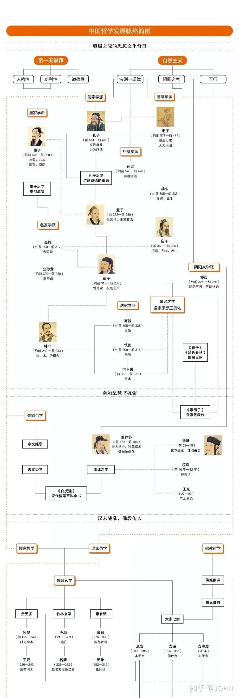
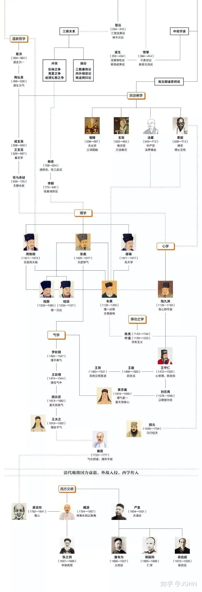
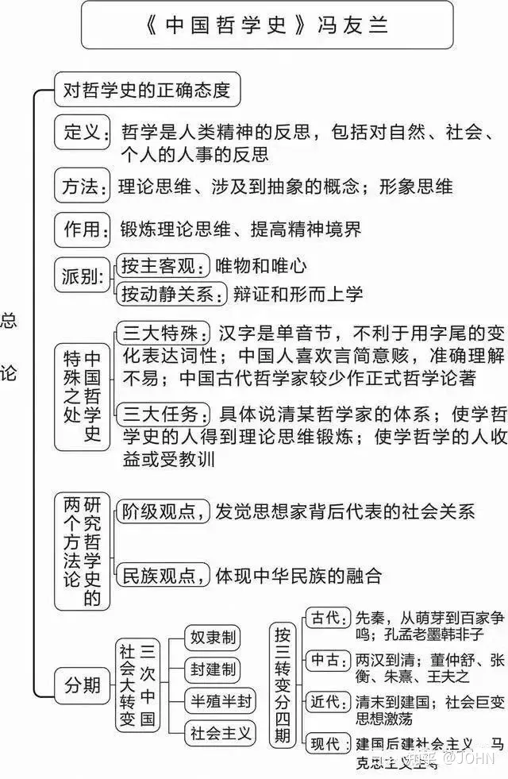
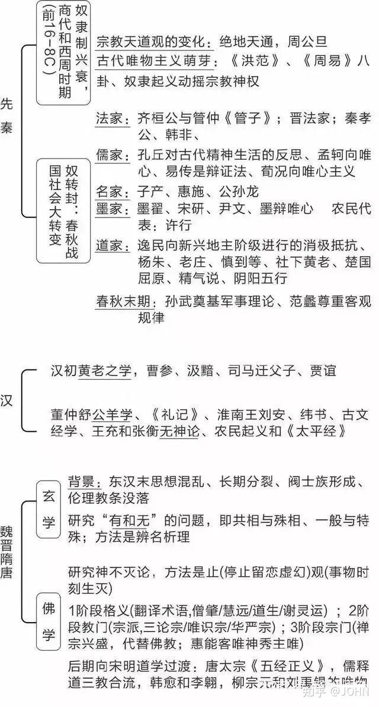
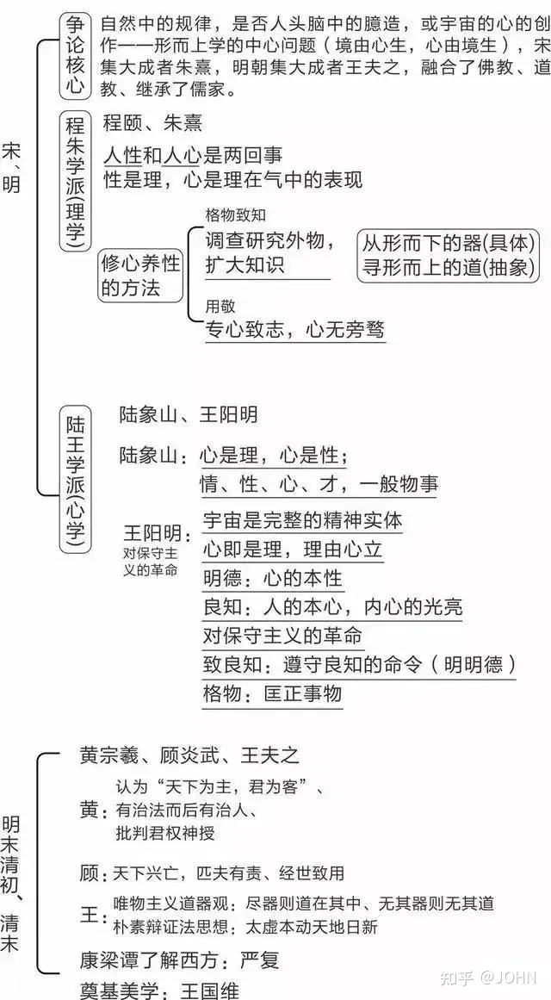

# 中国哲学简史

《中国哲学简史》（A Short History of Chinese Philosophy）是中国哲学家[冯友兰](https://baike.baidu.com/item/冯友兰/119755?fromModule=lemma_inlink)创作的哲学著作，首次出版于1948年。

《中国哲学简史》全书共28章，前18章主要讲述中国古代传统哲学，后10章主要阐述中国哲学在古代思想上新的发展和开拓。书中系统介绍了中国哲学的发展、精神和背景，诸子百家的不同哲学观、人生观，以及现代哲学的发展和在世界上产生的影响。 [7] 

《中国哲学简史》是冯友兰为西方读者而写的一本哲学史，以英文写成，已被译为多种语言，是中国哲学专业的通用教材，也是了解中国文化的入门书。

https://zhuanlan.zhihu.com/p/640532758

## 发展人物

## 核心思想

## 摘录

任何一种大的宗教，它的核心部分必然有哲学。事实上，每一种大的宗教就是某种哲学加上一定的上层建筑，包括迷信、教义、礼仪和体制。这是我对宗教的认识。

中国文化的精神基础不是宗教（至少不是有组织形式的宗教），而是伦理（特别是儒家伦理）

儿子要为父母服“三年之丧”，孔子解释这一点时说：“子生三年，然后免于父母之怀。夫三年之丧，天下之通丧也。”（《论语 ·阳货》）这是说，孩子出生后，前三年离不开父母的怀抱；因此，儿子为父母守丧，也应有三年，以感父母之恩。

齐景公问政于孔子，孔子对曰：“君君，臣臣，父父，子子。”（君要像君，臣要像臣，父要像父，子要像子。）

“义”是一种观念形式的规范，“仁”的观念则具体得多。一个人在社会里行事为人，有他应循的义务，那是他应该做的。但是这些义务的本质应当是“爱人”，即“仁”

孔子对自己的灵性修养曾说：“吾十有五而志于学，三十而立，四十而不惑，五十而知天命，六十而耳顺，七十而从心所欲，不逾矩。”（《论语 ·为政》）

孔子到七十岁时，可以从心所欲，而所做的都合于规范，他的行为不再需要意识去引导，可以顺乎自然。这表明了圣人在心灵修养上最后阶段的造诣。

孔子对古代文明的态度是加以理性化、合理化，墨子则对古代文明持批判态度；孔子是一位文雅有修养的君子，墨子则是一位充满战斗精神的布道家。他的说教的宗旨是反对传统的典章制度及其实践，反对孔子和儒家的各种理论。

墨家哲学的内容，主要便是这种批判和对游侠道德的辩护。

泰族训》篇说：“墨子服役者百八十人，皆可使赴汤蹈刃，死不旋踵。”

首先，其他游侠只是雇佣兵，谁雇用，便为谁卖命；墨子和他的追随者们则反对任何侵略战争，他们只为防御性战争效劳。其次，通常的“侠”只是墨守武士的职业道德；墨子和他的追随者则对武士的职业道德进行理性化的解释。因此，他创立了一个新的哲学流派。

墨子认为，“儒之道足以丧天下者，四政焉”：第一，儒者不相信天或鬼，结果是：“天鬼不悦”；第二，儒家坚持厚葬，特别是父母去世，子女要守三年之丧，浪费了民众的财富精力；第三，儒家“盛为声乐以淫遇民”，结果只是少数贵族奢侈享受；第四，儒家主张宿命论，造成民众怠惰顺命。（见《墨子 ·公孟》）在《非儒》篇里，墨子还说：“累寿不能尽其学，当年不能行其礼，积财不能赡其乐，繁饰邪术以营世君，盛为声乐以淫遇民，其道不可以期世，其学不可以导众。”

处于社会底层的大众，通常总是落后于社会新思潮，墨子所反映的正是当时社会下层民众的观点。

都是“兼爱”的表现。“兼爱”是墨子哲学的中心思想，它是墨子所由出身的游侠们的职业道德的自然延伸。他们的职业道德是：游侠之间，“有福同享，有祸同当”（这是后来侠客们常说的话）。墨子以这种思想为基础，把它扩大推广，主张天下所有的人都应当不分高低，彼此相爱。

墨子提出了衡量是非的“三表”，即三项准则：第一，人做事是否根据天和神灵的意志，与古代圣王的事业一致，这是事物之本；其次，所做的事应当是百姓能够耳闻目睹、加以验证的事，这是事物之原（验证）；第三，由政府付诸实施，看是否对国家、百姓有利，即所谓事物之用。（见《墨子 ·非命》上篇、中篇）三表之中，衡量价值的标准是“对国家和民众有利”。

墨子便说过：“夫爱人者，人必从而爱之；利人者，人必从而利之。恶人者，人必从而恶之；害人者，人必从而害之。”

墨家既信奉鬼神，却反对丧葬和祭祀祖先时要献大量祭牲的繁文缛节；儒家强调祭祀的重要性，却不信有鬼神。墨家对儒家在这方面的自相矛盾，毫不客气地予以指出。《墨子 ·公孟》篇里所记的公孟子是个儒家人士，“公孟子曰：‘无鬼神。’又曰：‘君子必学祭礼。’子墨子曰：‘执无鬼而学祭礼，是犹无客而学客礼也，是犹无鱼而为鱼罟也。’”

**人们会问：人民大众为什么自愿选择这样一个绝对威权来君临统治大众呢？墨子的回答是：人民大众接受这个权威，不是出于自愿，而是出于无奈，因为除此以外，别无选择**。

按照墨子的理论，国家的性质必然是极权主义的，国君的权力必定是绝对化的。这是从他的国家起源理论所导致的必然结论。因为国家之所以产生就是为了制止人们由各是其是而产生的混乱。因此，依墨子的说法，国家的职责就是“一同国之义”（同上）。在一国之内，只能有一个是非标准（“义”），这个“义”只能由国家制定。一国之内，不能容忍多重标准，那将导致混乱，使民众又回到“自然状态”中去，结果除混乱外，一无所成。

庄子何以强烈反对政府运用其机构实行统治的原因。他认为，最好的治理办法就是无为而治。《庄子 ·在宥》篇说：“闻在宥（在，自在；宥，宽容）天下，不闻治天下也。在之也者，恐天下之淫其性也；宥之也者，恐天下之迁其德也。天下不淫其性，不迁其德，有治天下者哉！”

庄子的政治社会哲学正是要为大众谋求这种相对的快乐。政治和社会哲学所能做到的也只止于此。

在《庄子》书中有不少地方讨论到人生最大的苦难——死亡。人们不快乐的一个重要原因，便是惧怕死的来临和由此而来的忧虑。这种恐惧和忧虑是可以消除的，关键在于人对事物的本性有一个正确的洞察。

吊唁死者而悲痛时，人在精神上受苦，是由于自己的感情，感情悲痛越深，受苦也越深。苦楚的根源是期望人不死，违反了自然的法则，即所谓“遁天之刑”。人对万事万物增加理解，就可以减少由感情造成的痛苦。

道家认为，圣人洞察事物本性，因此没有感情的冲动，这并不是说圣人便没有对事物的感觉。毋宁说，他不为感情所扰以至失去“心灵的宁静”。

**庄子则认为，人们的是非观念是根据他们的局限性观点建立起来的**。

齐物论》又说：“其分也，成也；其成也，毁也。凡物无成与毁，复通为一。”**以制造一张桌子为例，从桌子的角度看，这是建造；从树的角度看，这是破坏。叫它建造也好，叫它破坏也好，这都是从有限的角度看它；如果从道的角度看，则建造和破坏都是相对的，都没有绝对的意义，因此无成也无毁**。

息，因此，哲学对现实问题并不试图去具体地解决。举例来说，哲学不能帮助人长生不老，也不能帮助人发财致富。它所能做的是给人一种观点，使人看到生比死所胜无几，人所失去的也就是他所得到的。从“实际”的观点看，哲学无用，但哲学可以给我们一种有用的观点。在《庄子 ·外物》篇中，把它称作“无用之用”。

在庄子看来，成圣之道需要摒弃知识。摒弃知识的结果，自然便没有知识。但是，“无知之知”和“无知”是两回事。“无知”是人的原初状态，而“无知之知”则是人经过“有知”而后达到的“无知”阶段。人的原初状态的无知是自然的恩赐，而人达到“无知之知”则是心灵（亦即灵性）的成就。

人都爱自己的儿女。因此，一个人仅仅爱几个人，不能算是泛爱众人。而从反面来看，一个人如果对某个人加以伤害，那就足以说明他不爱人。这是墨家的观点。

庄子认为争论是非毫无意义。**即便一个人在争论中赢了，也不表明就是对了，输了的一方也并不意味着就是错了**。而在后期墨家看来，庄子提出这样的主张就是在与人辩论。如果他赢了，岂不正好证明他的主张是错的吗？《庄子 ·齐物论》中说“大辩不言”，又说“辩也者，有不见也”（凡争论者，总有见识不到之处），所以“言未始有常（定论）”

对天人感应，有两种解释。其一是基于目的论的解释，认为国君恶行使天地震怒，天地震怒便造成自然界的不正常现象，以给国君警告。另一种理论则是比较机械式的解释，认为整个宇宙乃是一个机械的整体，其中任何一部分失去平衡，其他部分势必受到牵连。

《月令》的名称是由于它告诉国君和大众，每个月当做什么，不当做什么，以求得与天地万物的和谐。

邹衍发展出一个新的历史哲学，用五德的转移来解释历史，它既是变化的，又是有规律的。

荀子的思想与孟子的思想正好针锋相对。有人认为，孟子代表儒家的左翼，荀子则代表儒家的右翼。

荀子以主张“人性恶”而著名。这与孟子所主张的“人性本善”正好相反。表面看来，荀子对人性的评价很低，而事实上，恰恰相反，荀子的理论可以称之为一种文化哲学。他的理论主旨是认为，**一切良善和有价值的事物都是人所创造的。价值来自文化，而文化则是人的创造性成就**。因此，在宇宙中，人和天地同等重要。荀子在著名的《天论》中说：“天有其时，地有其财，人有其治，夫是谓之能参。”

荀子指出，人的生存离不开社会组织。若没有在社会组织中的合作和互相支持，人不可能改善自己的生活。在《富国》篇中，他说：“百技所成，所以养一人也。而人不能兼技，人不能兼官，离居不相待则穷。”

人生而有欲，有欲就有求，求满足欲望而无节制，必定引起竞争，有争就有乱，乱则一事无成。先王制定礼（个人行为准则）义（道德），就是为了杜绝社会和思想的混乱。

世间不是那样理想的地方，人们必须住在一起，又无法避免竞争，于是对每个人的欲望都不能不加以节制。“礼”的作用就是规定应有的节制。凡建立起“礼”的地方，就形成“道德”；按“礼”而行的人就是有道德的人，违反“礼”的人就是没有道德的人。

**人的头脑有两个方面的作用，一方面是智性的作用，另一方面是感情的作用**。

人的知识和人的追求便分离了。知识是重要的，但人不是只靠知识活着。我们还有感情上的需要，要求满足。在对待死者的态度上，我们需要同时顾及两个方面。儒家所讲的葬礼和祭祀便是为此而设的

在荀子的门生中，最著名的是李斯和韩非子两人

君王不需要是圣人或超人，只要实行他们提出的一套方略，一个仅具中人之资的人就可以把国家治理得井井有条。还有一些方术之士，为他们鼓吹的统治方略提出理论根据，这便构成了法家的思想主张。

法家的主张，用现代语言来说，乃是一套组织领导的理论和方法。一个人如果想走极权主义道路，组织大众，充当领袖，就会认为法家的理论和方法颇有一点道理。

法家深深懂得，**每个时代的变化，都有它不得不变的原因，因此只能现实地对待世界。古代的人们比较纯朴，就此而言，或许值得称颂，但那是当时的物质条件造成的，并不是说，古代人们的品德就普遍比后代人高尚**。

本章开始时，我曾指出，先秦中国封建社会里，“礼”是君王统治贵族的准绳，“刑”是君王统治百姓的工具。儒家坚持以礼治国，这样，“礼”不仅是统治贵族的准绳，也成为统治庶民百姓的准绳，这是对庶民百姓提出了更高的要求。就这一点说，儒家是革命的。法家的思想也和儒家一样，没有社会阶级高下的区别。人人在法律和统治者面前，地位都一样。但是，法家所做的不是把庶民的地位提高，而是把贵族的地位降低，靠奖惩来统治一切人，这就把“礼”抛到一边去了。**儒家的主张是理想主义的，法家的主张是现实主义的**。在中国历史上，儒家一向指责法家卑鄙、粗野，而法家则总是指责儒家书生气、不切实际。

《易传》和《老子》持守一样的看法：人若想做成一点事情，就不要指望一帆风顺，马到成功；**若想不失去已有的东西，就要从事物的反面多着想一点**。

为做到与天地合参，人是否需要做什么特别的事情呢？并不需要，所需要的只是做那些普通、寻常的事情，完全懂得它们的意义，并把它们做得“恰到好处”。在这样做时，人的内心和外部世界连接起来了，这不仅是人与天地合参，而是天人合一。这时，人虽在世界之中，却又超越了世界。后来的新儒家便是以发展这个思想来批判佛家的出世哲学。这便是儒家把人心提高到天人境界的途径。它与道家所主张的弃绝知识、齐万物、一死生的做法不同，儒家的途径是通过爱的延伸，使人心得以超越我与他人的界限，也超越我与物的界限。

古文学派把阴阳家的思想影响从儒家清除出去，阴阳家此后与道家思想结合而形成了道教。在这个过程中，孔子的地位由神的地位还原为师的地位，却又使老子成为道教的创始人。道教后来模仿佛教，发展出道观（寺庙）、道士（僧人）和道场法事（仪式）

佛教不仅是一种宗教，它还是一种哲学，即佛学。道教尽管在宗教上和佛教针锋相对，但在哲学上，却和佛学结成了同盟。道教没有佛学那样强烈的出世精神，但是它们在宗教神秘主义这一点上却有相似之处。道家称“道无名”，佛家也认为“真如”或终极的真实是“不可说”的，它既不是“一”，又不是“多”；既不是“非一”，又不是“非多”。这种名词术语正如中国汉语所说，是“想入非非”。

高祖刘邦诏令儒生叔孙通率领一班人，拟定一套宫廷的礼仪。在首次举行这样的礼仪之后，刘邦踌躇满志地说：“吾乃今日知为皇帝之贵也。”

第一，普通人看万物为“实有”，而不知“无”。为此，诸佛教导说，万物实际是“无”和“空”。在普通人的层次上，以万物为“有”，就是俗谛；以万物为“无”，就是真谛。第二，以万物为“有”是偏颇之见；以万物为“无”，也是偏颇之见。这是因为它给人一个错误的印象，以为“无”或“非有”只是由于从存在中把“有”移去，其实，“有”即是“无”。

除现象世界之外，别无其他实在。因此，佛性的实在性也就在现象世界之中，正如在金器库中，除金器外，别无他物。有的人由于“无明”，在现象世界里，只见世界的诸相，却不见佛性的实在。另有些人，在现象世界中因悟而见到佛性，但所见佛性并未脱出现象世界。这两种人，所看见的现象世界是相同的，但觉悟了的人所见，其意义和未曾觉悟的人（处于“无明”之中）所见却完全不同。这便是在中国佛教里常说的：“迷则为凡，悟则为圣。”

## 评论

通过本书可以对中国历代的文学思想有个大概了解，后面有时间的话再研读一遍。