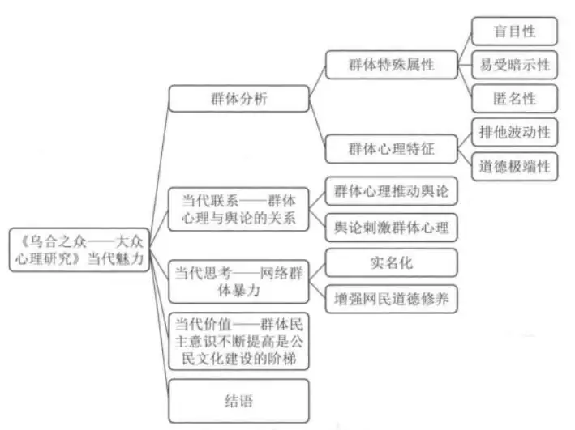

# 乌合之众

《乌合之众：大众心理研究》是法国社会心理学家[古斯塔夫·勒庞](https://baike.baidu.com/item/古斯塔夫·勒庞/6486008?fromModule=lemma_inlink)创作的社会心理学著作，首次出版于1895年。

《乌合之众：大众心理研究》是一本研究大众心理学的著作。在书中，勒庞阐述了群体以及群体心理的特征，指出了当个人是一个孤立的个体时，他有着自己鲜明的个性化特征，而当这个人融入了群体后，他的所有个性都会被这个群体所淹没，他的思想立刻就会被群体的思想所取代。而当一个群体存在时，他就有着情绪化、无异议、低智商等特征。

## 什么是群体？

勒庞认为：“自觉地个性的消失，以及感情和思想转向一个不同的方向，是就要变成组织化群体的人所表现出的首要特征。”

有共同目的，且因为这个目的形成的新特点的一群人

### 群体特征

人有从众心理，遇到危险，往人多的地方跑，处于群体中的时候，会产生一种盲目的安全感。这种安全感让个体产生变化：

#### 1）逻辑和理性消失

因为处在其中的个体，会感受到远 超过自己个人的能力(集体的力量)，产生一种”所有事情都能做“的盲目自信。所以群体的思考和推理能力极弱，或者说他们根本懒得去推理。处于集体中的个体总是希望被关注，由于理性的缺失，所以他们很容易受到暗示和传染。他们轻易聚会被其他的个体，用夸大精彩的故事暗示。尽管故事缺乏事实，他们依然乐于继续传播这个故事，来获得关注。导致其他个体也很快被相互感染

如生活中的接收到的谣言，理性告诉我们并不可信，却依然控制不住谣言的传播。因为传播本身并不是用来讨论的，而是用来传染情绪让自己被关注。

#### 2）情绪控制的消失

由于理性消失，情绪就在群体中失去了控制，他们变的单纯又夸张，变的冲动，多变，和急躁，他们毫不克制，特别善于夸大情感，因为只有更极端的感情，才能打动群体中的其他人，如独自看国际比赛，没有什么意思，当一起看的时候，就会部分热血又亢奋。

#### 3）责任和道德消失

出于”法不责众“的观念，个体，成了隐藏在群体中的”无名氏“，于是那些原本，用来约束个体的责任和道德感，极大程度被减弱，或者完全消失。伤害群体内的异类，或者群体外的其他个体，或者排挤其他群体，成了稀松平常的事，如新来的插班生常常被排挤，如很多人被鼓动参与游行和蓄意破坏事件，事后才意识到，自己莫名其妙的违法了

## 新的群体特征

互联网->个人主义发扬->思想和言论的信息差被极大降低->个体的独立性得到发展

群体熵增：自由和独立->群体产生了更多的碰撞 ，加速了群体的死亡，加速了新群体的产生

如何避免

1）避免从众：留有自己独立意识，

2）实事求是：

3）适当独处

领袖如何做：

1）说故事而不是单纯的定规则，把规则形象化，变成鲜活的故事

2）学会管理情绪：**引导情绪而不是单纯的管做事，花更多的精力在群体情绪的引导上**

3）促进群体进化：促进小群体 灭亡和新生，不要恐惧小群体的消失，大的更好的群体，是不断随着小群体的消失，新群体的诞生带来的

卡尔荣格：向外看的人是在梦中，向内看的才成是清醒的人

## 摘录

在集体心理中，个人的才智被削弱了，从而他们的个性也被削弱了。异质性被同质性所吞没，无意识的品质占了上风。

孤立的个人具有主宰自己的反应行为的能力，群体则缺乏这种能力。 这种冲动总是极为强烈，因此个人利益，甚至保存生命的利益，也难以支配它们。刺激群体的因素多种多样，群体总是屈从于这些刺激，因此它也极为多变。 对群体中的个人来说，不可能的概念消失了。孤立的个人很清楚，在孤身一人时，他不能焚烧宫殿或洗劫商店，即使受到这样做的诱惑，他也很容易抵制这种诱惑。但是在成为群体的一员时，他就会意识到人数赋予他的力量，这足以让他生出杀人劫掠的念头，并且会立刻屈从于这种诱惑

群体永远漫游在无意识的领地，会随时听命于一切暗示，表现出对理性的影响无动于衷的生物所特有的激情，他们失去了一切批判能力。

群体随时会反抗软弱可欺者，对强权低声下气。如果强权时断时续，而群体又总是被极端情绪所左右，它便会表现得反复无常，时而无法无天，时而卑躬屈膝。 群体强烈地受着无意识因素的支配，因此很容易屈从于世俗的等级制，难免会十分保守。对它们撒手不管，他们很快就会对混乱感到厌倦，本能地变成奴才

这个种族的才智会随着古老理想地丧失而完全消失。种族散乱成一群独立自处的个人，他们一个个重新回到原始的野蛮状态，即一群乌合之众。

群体的迭加只是愚蠢的迭加，而真正的智慧被愚蠢的洪流淹没。

在群体的灵魂中占主导地位，不是对自由的需要，而是对奴役的需要。

我们以为自己是理性的，我们以为自己的一举一动都是有其道理的。但事实上，我们的绝大多数日常行为，都是一些我们自己根本无法了解的隐蔽动机的结果。

群体绝不允许旁人对他们的真理有所质疑，也绝不允许旁人持有他们所认为的谬论。这种偏执的情绪根深蒂固，除非用另外一种极端的感情来取代，否则根本难以动摇。

制度与一个民族的伟大和另一个民族的衰败都是毫不相干的。各民族是受它们自己的性格支配的，凡是与这种性格不合的模式，都不过是一件借来的外套，一种暂时的伪装。

个人一旦成为一个群体的组成部分，他的智力水平便立即出现相当程度的下降。

不管多么复杂的社会问题，到了群体，全都用最简单的抽象原则和普遍规律来解决，所有的观点和主张都会简单化，弱智化，人群会为了实现梦想走上一条简单粗暴之路。

## 群体产生的原因

一、群体的意见和信念中的间接因素。包括五种：种族；传统；时间；政治和社会制度；教育。

二、群体意见和信念中的直接因素。包括四种：**形象、词语和套话；幻觉；经验；理性**。

1、形象、词语和套话。勒老师这段讲得精彩啊：“**最不明确的词语，有时反而影响最大。**例如像民主、社会主义、平等、自由等等，它们的含义极为模糊，即使一大堆专著也不足以确定它们的所指。然而这区区几个词语的确有着神奇的威力，它们似乎是解决一切问题的灵丹妙药。各种极不相同的潜意识中的抱负及其实现的希望，全被它们集于一身。”

“统治者的艺术，就像律师的艺术一样，首先在于驾驭辞藻的学问。这门艺术遇到的最大困难之一，就是在同一个社会，同一个词对于不同的社会阶层往往有不同的含义，表面上看他们用词相同，其实他们说着不同的语言。

2、幻觉。“自从出现文明以来，群体便一直处在幻觉的影响之下。他们为制造幻觉的人建庙塑像，设计祭坛，超过了所有其他人。”

3、经验。经验可以让过于危险的幻想破灭，但需要发生在非常大的范围内，这个范围也包括时间，所以经验需要一再出现，而且通常“一代人的经验对下一代人是没多少用处的。”

4、理性。前面已经提到群体心理的非理性，为什么这里还要提到理性，勒庞主要强调的是理性的影响的消极价值。他对理性并没有好感，认为幻觉其实是必要的，而理性在历史上并没怎么指引过人类走上文明之路。“一切文明的主要动力并不是理性，倒不如说，尽管存在着理性，文明的动力仍然是各种感情——譬如尊严、自我牺牲、宗教信仰、爱国主义以及对荣誉的爱。”

## 群体领袖手段

1、为什么只要有生物聚集（无论是人还是动物），就会有头领？领袖更有可能是个实干家而非思想家，意志坚强、有强大的信仰，而“聚**集成群的人会完全丧失自己的意志，本能地转向一个具备他们所没有的品质的人**。”“**大多数人，尤其是群众中的大多数人，除了自己的行业之外，对任何问题都没有清楚而合理的想法。**”

2、领袖的动员手段：**断言、重复和传染**。

勒庞说道：“**一个断言越是简单明了，证据和证明看上去越贫乏，它就越有威力**。一切时代的宗教书和各种法典，总是诉诸简单的断言。号召人们起来捍卫某项政治事业的政客，利用广告手段推销产品的商人，全都深知断言的价值。”进一步的是，“**极为重要的修辞发只有一个，那就是重复**”。

3、名望。名望是一种难以抗拒的力量，总括起来可以分为两类：先天的名望（称号、财富和名誉）和个人名望

## 羊群效应

据说是董宇辉解读：

当羊群整体移动的时候，中间的羊，永远也搞不清状况，只能跟着瞎走。只有走在边缘的羊，才能看清楚周遭的形式，但是边缘的羊又很危险，容易被猛兽拖走，所以，只有走在边缘危险的人，才能看清楚生活的真实情况，尽管如此，边缘的羊还是边走边想方设法的挤到羊群深出去，大家都愿意盲从，世界上最安全的事情，就是让自己消失咋多数之中，好像跟别人一样，我就显的合群而安全。这是所有物种的一个特点。