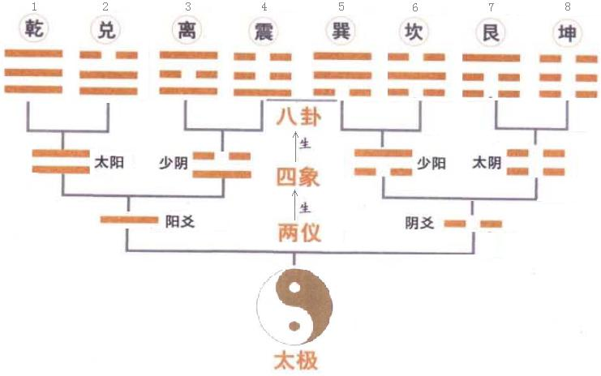
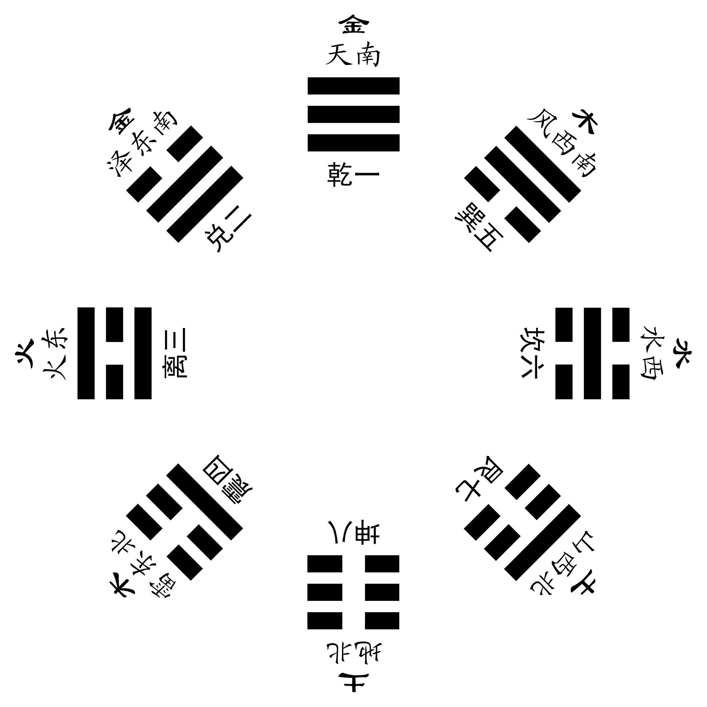
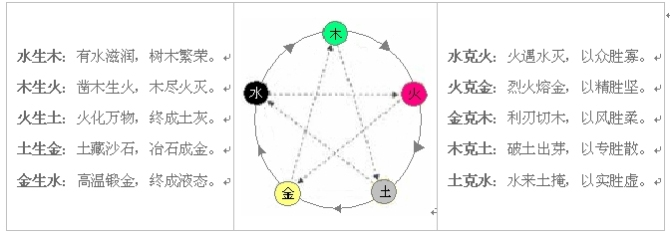
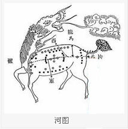
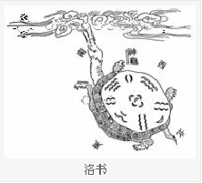
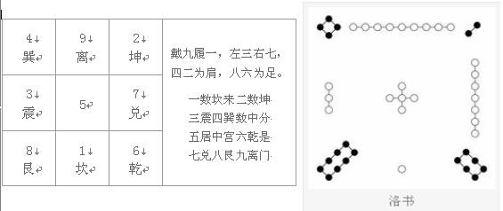
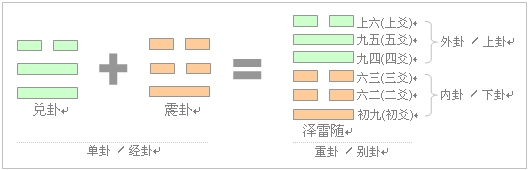
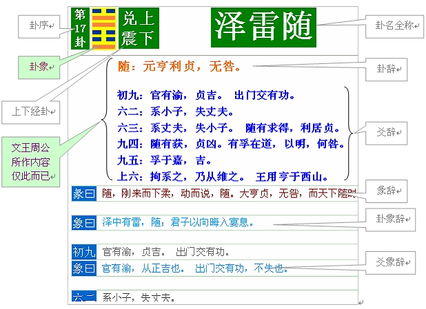
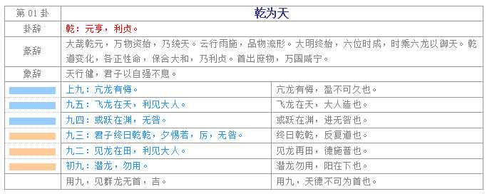

# 易经

古代卜筮(**shì**)书，包括**《连山》**、**《归藏》**、**《周易》**，合称三易，其中《[连山](https://baike.baidu.com/item/连山/19834960)》《[归藏](https://baike.baidu.com/item/归藏/6171138)》已经失传，现存于世的只有《周易》

连山易：传为天皇氏创，以艮(gèn)卦开始，如山之连绵，故名连山,是以[四季](https://baike.baidu.com/item/四季/2116)六气为旺衰指引，以六甲值符为吉凶判辨之坐标，以[三元九运](https://baike.baidu.com/item/三元九运)为时空转换

归藏：该易书是以坤为首卦，故名为归藏

周易：相传是[周文王](https://baike.baidu.com/item/周文王/525708)在坐牢的时候，他研究《易经》所作的结论；《周易》内容包括《经》和《传》两个部分，但一般认为它是[秦汉时期](https://baike.baidu.com/item/秦汉时期/10609672)融汇而成的作品。《经》主要是六十四卦和三百八十四爻，卦和爻各有说明（[卦辞](https://baike.baidu.com/item/卦辞/9473226)、[爻辞](https://baike.baidu.com/item/爻辞/3499964)），作为占卜之用。《传》包含解释卦辞和爻辞的七种文辞共十篇，统称《十翼》，相传为孔子所撰

周易系辞中：有太极，是生两仪，两仪生四象，四象生八卦，八卦定吉凶，吉凶生大业

老子道德经：道生一、一生二、二生三，三生万物，万物负阴而抱阳，冲气以为和

## 总览

### 两仪

阴阳，万物可以分阴阳，人的体质，性格等都可以，养生等需要根据自身体质属性而定。

即阳主动而阴主静，阳主刚而阴主柔，动则易于创新，同时易疲倦，所谓利益与风险同在，倦则思归、思静；静则能养、能藏，养则蓄，蓄则精力充沛，必然蠢蠢欲动。所以阳极则阴生，阴极则阳生。

### 四象

古老的说的四象指的是：少阳、太阳、少阴、太阴 而非现在的四象(四圣兽)

#### 少阳(凌晨)

#### 太阳(中午)

#### 少阴(黄昏)

#### 太阴(夜晚)

### 先天八卦：

主空间，有称伏羲八卦

乾坤定南北，坎离定东西，是天南地北为序，上为天为乾，下为地为坤，左为东为离，右为西为坎

乾一、兑二、离三、震四、巽五、坎六、艮七、坤八

### 后天八卦：

主时间，又称文王八卦

坎一、坤二、震三、巽四、中五、乾六、兑七、艮八、离九

### 八卦

#### ☰乾(qián)三连-天

| 性情 | 家族关系 | 先天八卦方位 | 后天八卦方位 | 五行 | 二进制 |
| ---- | -------- | ------------ | ------------ | ---- | ------ |
| 健   | 父       | 南           | 西北         | 金   | 111    |

| 动物 | 五官   | 内脏 |
| ---- | ------ | ---- |
| 马   | 头(首) | 脑子 |

#### ☷坤(kūn)六断-地

| 性情 | 家族关系 | 先天八卦方位 | 后天八卦方位 | 五行 | 二进制 |
| ---- | -------- | ------------ | ------------ | ---- | ------ |
| 顺   | 母       | 北           | 西南         | 土   | 000    |

| 动物 | 五官 | 内脏 |
| ---- | ---- | ---- |
| 牛   | 腹   | 脾脏 |

#### ☳震(zhèn)仰盂-雷

| 性情 | 家族关系 | 先天八卦方位 | 后天八卦方位 | 五行 | 二进制 |
| ---- | -------- | ------------ | ------------ | ---- | ------ |
| 动   | 长男     | 东北         | 东           | 木   | 001    |

| 动物 | 五官 | 内脏 |
| ---- | ---- | ---- |
| 龙   | 足   | 肝脏 |

#### ☶艮(gèn)覆碗-山

| 性情 | 家族关系 | 先天八卦方位 | 后天八卦方位 | 五行 | 二进制 |
| ---- | -------- | ------------ | ------------ | ---- | ------ |
| 止   | 少男     | 西北         | 东北         | 土   | 100    |

| 动物 | 五官 | 内脏 |
| ---- | ---- | ---- |
| 狗   | 手   | 胃   |

#### ☲离(lí)中虚-火

| 性情 | 家族关系 | 先天八卦方位 | 后天八卦方位 | 五行 | 二进制 |
| ---- | -------- | ------------ | ------------ | ---- | ------ |
| 丽   | 中女     | 东           | 男           | 火   | 101    |

| 动物       | 五官 | 内脏 |
| ---------- | ---- | ---- |
| 雉zhì 野鸡 | 目   | 心脏 |

#### ☵坎(kǎn)中满-水

| 性情 | 家族关系 | 先天八卦方位 | 后天八卦方位 | 五行 | 二进制 |
| ---- | -------- | ------------ | ------------ | ---- | ------ |
| 陷   | 中男     | 西           | 北           | 水   | 010    |

| 动物     | 五官 | 内脏 |
| -------- | ---- | ---- |
| 豕shǐ 猪 | 目   | 肾脏 |

#### ☱兑(duì)上缺-泽

| 性情 | 家族关系 | 先天八卦方位 | 后天八卦方位 | 五行 | 二进制 |
| ---- | -------- | ------------ | ------------ | ---- | ------ |
| 悦   | 少女     | 东南         | 西           | 金   | 011    |

| 动物 | 五官 | 内脏 |
| ---- | ---- | ---- |
| 羊   | 口   | 肺脏 |

#### 

#### ☴巽(xùn)下断-风

| 性情 | 家族关系 | 先天八卦方位 | 后天八卦方位 | 五行 | 二进制 |
| ---- | -------- | ------------ | ------------ | ---- | ------ |
| 入   | 长女     | 西南         | 东南         | 木   | 110    |

| 动物 | 五官 | 内脏 |
| ---- | ---- | ---- |
| 鸡   | 股   | 胆囊 |

### 五行

尚书：一曰水，二曰火，三曰木，四曰金，五曰土。水曰润下，火曰炎上，木曰曲直，金曰从革，土曰稼穑(jià sè)。润下作咸，炎上作苦，曲直作酸，从革作辛，稼穑作甘<五行的作用和与五味的对应关系>

### 河图

《系辞》中有云：“河出图，洛出书，圣人则之。”河图是伏羲时代黄河所出现的龙马身上所负的图案，伏羲记录下来后，与八卦相结合，使八卦与五行融合在一起，相互参照使用，所以河图的最大作用就是在八卦和五行之间架起了一座桥梁

### 洛书

洛书，古称龟书，传说大禹治水时有神龟出于洛水，其背有文，九文近头，一文近尾，三文近左肋，七文近右肋，四文近左肩，二文近右肩，六文近右足，八文近左足，五文在背中，其位九，象九宫，中五又象太极，中一文又象一气；其形方，方象地

九宫又称“太一九宫”，太一就是北辰星或北极星，位居天宫正中，四方四维（东南西北即四方，东南、西南、西北、东北即四维）为八个卦神所居。

一留妻儿（1、6、7、2），就是三八（9、4、3、8）。”，一留下妻子儿女在家，就知道是三八妇女节到了

## 64卦

八个卦上下相重、两两组合，这样就形成64个卦，

### 6爻

9位阳，6为阴  从下到上，初爻(yáo)(6/9),  爻(6/9)2，爻(6/9)3，爻(6/9)4，爻(6/9)5，上爻(6/9)

在这六个爻中，易经认为初爻、三爻、五爻为奇数，奇数属阳，所以这三个位置是阳位。二爻、四爻、上爻为偶数，所以这三个位置属于阴位。阳爻居阳位、阴爻居阴位称之为“**当位**”；反之，阳爻居阴位、阴爻居阳位称之为“**失位**”。

这两个经卦各有一个中爻（即二爻和五爻），如果处在这个位置，则称为“**得中**”。阴爻得中为“**柔中**”，阳爻得中为“**刚中**”。易经将这个“得中”看得很重要，尤其是五爻为阳爻时被 称之为“九五之尊”。

《系辞》上对六个爻作了总结：“**初难知，二多誉、三多凶，四多惧，五多功，上易知**”。因为六爻的变化是事物时空的变化，初爻反映的是开始状态，所以初爻难知，处于这个位置不能锋芒太露。二爻居中下卦的中爻，是下层的核心，有所作为则被上层所誉，所以二爻多誉，处于这个位置可以崭露头角、适当进取。三爻居下卦之上爻，对下要把关，对上要交待，所以三爻多凶，处于这个位置易受上指责。四爻为上卦的低位，与帝位相邻，所以四爻多惧，处于这个位置做事必须谨小慎微。五爻是上卦的中爻，也是整个卦的主宰，其一举一动容易被人景仰而成为功劳，所以五爻多功。上爻是反映最后阶段，所以上爻易知，这时应注意穷极必反

6个爻反映的是事务的变化各个阶段。也就是周易整个讲解的是概括一类事情的发展，然后从发展中得出如何正确处理事情。

### 卦象与爻辞

**卦象**是从下往上看，而爻辞是按正常看书的习惯是从上往下看的，所以一般书上文字部分与卦象顺序相反。当然也有的书上将**爻辞**的顺序倒一下，与卦象一一对应起来

卦象比爻象更重要，它是整个卦的基础，所有的卦辞和爻辞都是以卦象为中心

### 天地人三才

经卦的三个爻分别代表天、人、地三才道，别卦在此基础之上，将三才有阴有阳被扩展到六爻中，初爻、二爻代表地德，三爻、四爻代表人德，五爻、上爻代表天德。这样三才分别有四种状态：太阳、少阳、太阴、少阴。

易之理在天为阴阳，在地为刚柔，在人为仁义。

天德处于**少阴**状态，说明由阳转阴的过程之中；人德处于**太阳**状态，表示君子、非常仁义。地德处于**少阳**状态，表示由柔转刚。

易经仿效天地人三才之道，这一点不错，但未必是按顺序平均分配各二爻。别卦乃上下经卦所重，因此只有天道和地道，也就是说并不能分为上下三层，只能是两层，上卦代表天或君、下卦代表地或民，而人道寓意于六爻之中，也就是说，爻辞、卦辞其实都是在讲人道，都是在告诉人们如果按天地的法则来行事。

### 变爻和变卦

用三个硬币摇三次得到卦象，这个动作就是“起卦”。**起卦**就是开始产生一个卦的意思。

如果用三个硬币来起卦，则三个硬币全为正面为老阳，全为背面为老阴，二背一正为少阳，二正一背为少阴

老阳（即太阳）、老阴（即太阴）、少阳、少阴，老阳和少阳都为阳爻，老阴和少阴都为阴爻，但不同的是，老阳爻和老阴爻将发生变化，**老阳变为少阴**、**老阴变为少阳**，这样变得到了另外一个卦象。我们称老阴、老阳为“**变爻**”，也叫“动爻”（不变的爻称之这为“静爻”），变了之后的卦称之为“**变卦**”，也叫“之卦”。注意：“爻变”和“卦变”是另外的概念，不要混淆起来。

6、7、8、9四种情况，其中6为老阴(×)、9为老阳（○）、7为少阳(－)、8为少阴(＝)

因为，最终一个爻 最终要得到：阴阳，所以如果得到6和9，则需要转成7和8

如：7、8、6、8、9、7  -> 变爻修改成：7，8，7，8，8，7，动的地方为三爻，5爻

[六爻](https://baike.baidu.com/item/六爻)安定的，以本卦卦辞断之。

一爻动，以动爻之爻辞断之。两爻动者，则取阴爻之爻辞以为断，盖以“阳主过去，阴主未来”故也。所动的两爻如果同是阳爻或阴爻，则取上动之爻断之。三爻动者，以所动三爻的中间一爻之爻辞为断。四爻动者，以下静之爻辞断之。五爻动者，取静爻的爻辞断之。六爻皆动的卦，如果是乾坤二卦，「用」辞断。乾坤两卦外其余各卦，如果是六爻皆动，则以变卦的彖辞断之。以上是南怀瑾先生的断法

### 卦口诀

乾坤屯蒙需讼师，比小畜兮履泰否。
同人大有谦豫随，蛊临观兮噬嗑贲。
剥复无妄大畜颐，大过坎离三十备。

-------------------------------------------------

咸恒遁兮及大壮，晋与明夷家人睽。
蹇解损益夬姤萃，升困井革鼎震继。
艮渐归妹丰旅巽，兑涣节兮中孚至。
小过既济兼未济，是为下经三十四。

### 八宫卦

上下卦相同的，其实就是八卦

### 太乙卦序

太乙数中将六十四别卦按人伦的顺序排列出十二大运。乾坤代表父母，震、坎、艮分别代表长男、中男、少男；巽、离、兑分别代表长女、中女、少女。他们之间相互组合同样构成了六十四卦

### 梅花易数

让求卦之人任意报三个数，假定为（43、82、56），这时卦就起好了，你就可以利用这三个数将卦画出来。具体方法是，将第一个数除以8所得余数作为上经卦，43÷8余3，先天数3代表的是“离”；然后将第二个数除以8所得余数作为下经卦，82÷8余2，先天数2代表“兑”，这样就得到“火泽睽”卦；最后将第三个数除以6所得余数作为变爻，56÷6余2，所以二爻为变爻，变卦为“火雷噬嗑”。

如果求卦之人只报了2个数出来，这时可以将这2个数的和充当第三个数

随意报数的方法过于简单，容易受干扰从而使潜意识发挥不出，因此一般很少使用，取而代之使用测字法，即让求卦人随意写字，然后将前一半字的笔画数作上卦，后一半字的笔画数作下卦，笔画数总和作变爻。当字数为奇数个时，后一半多一个字。例如求卦人写“劝学网”三字，则“劝”为4画，“学网”为14画，所以得出（4，14，18），分别取8和6的余数后得到（4，6，6），最后得出“解”之“未济”。

梅花易数起卦的最大特点就是看到什么、听到什么、想到什么，就以什么为占，讲究的是第一感觉。譬如你一眼看见马并有了感应，你就不能犹豫，再去找一找还有没有更好的东西来起卦

### 彖tuàn辞

| No   | 经传名称 | 作用                                                       | 作者       |
| ---- | -------- | ---------------------------------------------------------- | ---------- |
| 1    | 卦辞     | 单个卦象的占卜辞                                           | 文王       |
| 2    | 爻辞     | 单个变爻的占卜辞                                           | 周公       |
| 3    | 彖辞     | 对上下经卦的卦象说明                                       | 孔子及门人 |
| 4    | 象辞     | 从卦象入手对卦辞和爻辞分别说明                             | 孔子及门人 |
| 5    | 文言     | 对众卦之父母：乾坤二卦的特别说明                           | 孔子及门人 |
| 6    | 系辞     | 对整体64个卦进行系统地概括解释，分析其哲理，以及如何运用。 | 孔子及门人 |
| 7    | 说卦传   | 对八个经卦的取象、意义等详细描述                           | 孔子及门人 |
| 8    | 杂卦传   | 对卦名的简要说明                                           | 孔子及门人 |
| 9    | 序卦传   | 对卦序的简要说明                                           | 孔子及门人 |

## 64卦

### 乾为天

