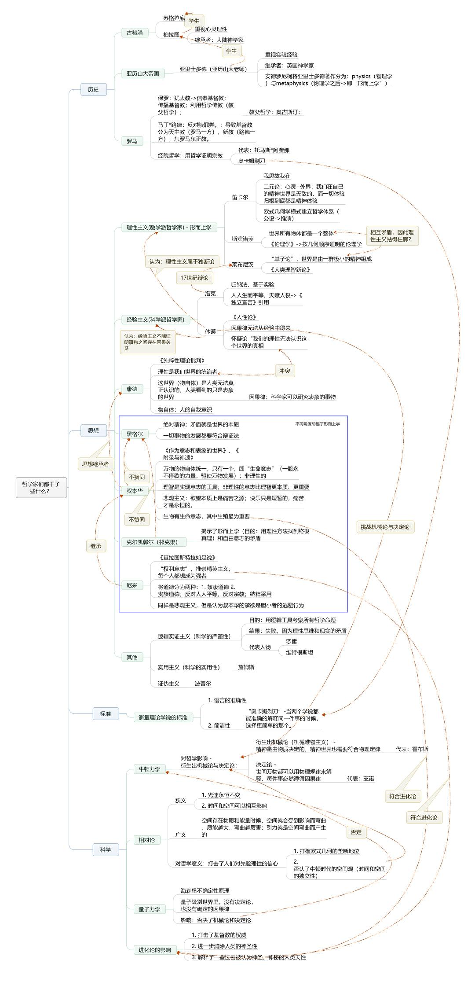

# 哲学家们都干了些什么

林欣浩，毕业于[吉林大学管理学院](https://baike.baidu.com/item/吉林大学管理学院/4829670?fromModule=lemma_inlink)。现居北京。自由撰稿人。擅长逻辑思辨，读书喜欢较真。相信一切外表高深的知识都要遵守简单的逻辑，用最浅白的话可以讲清楚最复杂的道理。代表作有《哲学家们都干了些什么》、《佛祖都说了些什么？》等。其中，《哲学家们都干了些什么》在亚马逊2013年度kindle畅销榜荣居第八名。《哲学家都干了些什么》于2015年再版，在豆瓣年度阅读非虚构类作品口碑榜排名第三。《佛，都讲了些什么》在豆瓣阅读频道2013年度非虚构类作品口碑榜中位居第二名。

## 评价

这本书写的很生动，真正的把复杂的问题给简化了，里面又有故事，又有思想。很适合入门学习.

原来科学还需要思辨，所谓的逻辑，也并不一定正确。也就是我们要随时保持思辨的头脑。这也许才是哲学的乐趣吧，

你读这些哲学书无非就是想要在和同学吃饭聊天的时候说出一些别人不懂的东西来，表现你学富五车了。

ps：常识是真理吗？大家都确认的东西就一定要相信，这个大家又是多少人？人从一出生，开始到慢慢有自己的独立思维，这期间都是在不断的被灌输"知识"。人们为什么要给 "我"灌输知识，为了”同化“，为了”规则“，为了让新成员像个人一样活着。同理其他动物，都是什么再驱动，让每个生下的东西，都趋于共性。

## 总结

### 苏格拉底

苏格拉底（[希腊语](https://baike.baidu.com/item/希腊语/675775?fromModule=lemma_inlink)：Σωκράτης；[英语](https://baike.baidu.com/item/英语/109997?fromModule=lemma_inlink)：Socrates；德语：Sokrates）（公元前469年 [1] ，一说公元前470年 [2] ～公元前399年），是[希腊](https://baike.baidu.com/item/希腊/197766?fromModule=lemma_inlink)（[雅典](https://baike.baidu.com/item/雅典/588256?fromModule=lemma_inlink)）哲学的创始人之一

在苏格拉底70岁时，被雅典法庭以“不敬神明”“信仰新神”“蛊惑青年”罪名审判，最终选择喝下毒酒而死。 [7] 

在苏格拉底死后14年（公元前385年），雅典法庭重审了苏格拉底案，改判苏格拉底无罪，并判处当时诬告苏格拉底的美勒拖死刑，吕孔和阿尼图斯等人被判处流放。并且石匠还刻画了苏格拉底的头像，来纪念此事。

#### 爱智慧

他提倡人们认识做人的道理，过有道德的生活。他把哲学定义为“[爱智慧](https://baike.baidu.com/item/爱智慧/8651369?fromModule=lemma_inlink)”

#### 自己知道自己无知

苏格拉底却常说：“我只知道自己一无所知。”他结论说：“只有神才是智慧的，他的答复是要指明人的智慧是没有什么价值的或者全无价值的，神并不是在说苏格拉底，他仅仅是用我的名字作为说明，像是在说，人们啊，惟有像苏格拉底那样知道自己的智慧实际上是毫无价值的人，才是最有智慧的人。”

#### 助产术

[苏格拉底反诘法](https://baike.baidu.com/item/苏格拉底反诘法/6773986?fromModule=lemma_inlink)（Socratic irony）。苏格拉底的这种方法，在[西方哲学史](https://baike.baidu.com/item/西方哲学史/7255372?fromModule=lemma_inlink)上，是最早的[辩证法](https://baike.baidu.com/item/辩证法/100991?fromModule=lemma_inlink)的形式。

### 柏拉图

柏拉图（Plato，Πλατών， 公元前427年—公元前347年），是[古希腊](https://baike.baidu.com/item/古希腊/14206?fromModule=lemma_inlink)伟大的[哲学家](https://baike.baidu.com/item/哲学家/3968?fromModule=lemma_inlink)，也是整个西方文化中最伟大的[哲学家](https://baike.baidu.com/item/哲学家/3968?fromModule=lemma_inlink)和[思想家](https://baike.baidu.com/item/思想家/1214475?fromModule=lemma_inlink)之一。

柏拉图和[老师](https://baike.baidu.com/item/老师/5533?fromModule=lemma_inlink)[苏格拉底](https://baike.baidu.com/item/苏格拉底/12690?fromModule=lemma_inlink)，学生[亚里士多德](https://baike.baidu.com/item/亚里士多德/26769?fromModule=lemma_inlink)并称为[希腊三贤](https://baike.baidu.com/item/希腊三贤/10841418?fromModule=lemma_inlink)。

柏拉图的原名为亚里斯多克勒斯（Aristocles）， [2] 亚里斯多克勒斯的意思是取名恰当的（well-named），后来因为他强壮的身躯而被称为柏拉图（在希腊语中，Platus一词是“平坦、宽阔”等意思）。后来，柏拉图的名字就被沿用下来。

#### 唯心主义

柏拉图是西方[客观唯心主义](https://baike.baidu.com/item/客观唯心主义?fromModule=lemma_inlink)的创始人，

世界由“理念世界”和“现象世界”所组成。理念的世界是真实的存在，永恒不变，而人类感官所接触到的这个现实的世界，只不过是理念世界的微弱的影子，它由现象所组成，而每种现象是因时空等因素而表现出暂时变动等特征。

当我们说到“马”时，我们没有指任何一匹马，而是称任何一种马。而“马”的含义本身独立于各种马（“有形的”），它不存在于空间和时间中，因此是永恒的。但是某一匹特定的、有形的、存在于感官世界的马，却是“流动”的，会死亡，会腐烂。

#### 柏拉图式的爱

中国人称之为“[精神恋爱](https://baike.baidu.com/item/精神恋爱?fromModule=lemma_inlink)”的柏拉图式的爱，这种爱认为肉体的结合是不纯洁的是肮脏的，认为爱情和情欲是互相对立的两种状态，因此，当一个人确实在爱着的时候，他完全不可能想到要在肉体上同他所爱的对象结合。

### 亚里士多德

亚里士多德（Aristotle，公元前384～前322），古代先哲，[古希腊](https://baike.baidu.com/item/古希腊?fromModule=lemma_inlink)人，世界古代史上伟大的[哲学家](https://baike.baidu.com/item/哲学家/3968?fromModule=lemma_inlink)、[科学家](https://baike.baidu.com/item/科学家/1210114?fromModule=lemma_inlink)和[教育家](https://baike.baidu.com/item/教育家/10341583?fromModule=lemma_inlink)之一，堪称[希腊哲学](https://baike.baidu.com/item/希腊哲学/8831966?fromModule=lemma_inlink)的集大成者。他是[柏拉图](https://baike.baidu.com/item/柏拉图/85471?fromModule=lemma_inlink)的学生，[亚历山大](https://baike.baidu.com/item/亚历山大/8196?fromModule=lemma_inlink)的老师。

公元前335年，他在[雅典](https://baike.baidu.com/item/雅典/588256?fromModule=lemma_inlink)办了一所叫[吕克昂](https://baike.baidu.com/item/吕克昂/8189009?fromModule=lemma_inlink)的学校，被称为[逍遥学派](https://baike.baidu.com/item/逍遥学派/6051262?fromModule=lemma_inlink)。[马克思](https://baike.baidu.com/item/马克思/161976?fromModule=lemma_inlink)曾称亚里士多德是[古希腊哲学](https://baike.baidu.com/item/古希腊哲学/24481?fromModule=lemma_inlink)家中最博学的人物，[恩格斯](https://baike.baidu.com/item/恩格斯/159912?fromModule=lemma_inlink)称他是“古代的[黑格尔](https://baike.baidu.com/item/黑格尔/149669?fromModule=lemma_inlink)”。

作为一位[百科全书](https://baike.baidu.com/item/百科全书?fromModule=lemma_inlink)式的科学家，他几乎对每个学科都做出了贡献。他的写作涉及[伦理学](https://baike.baidu.com/item/伦理学/3712?fromModule=lemma_inlink)、[形而上学](https://baike.baidu.com/item/形而上学/13344939?fromModule=lemma_inlink)、[心理学](https://baike.baidu.com/item/心理学/6215?fromModule=lemma_inlink)、[经济学](https://baike.baidu.com/item/经济学/589379?fromModule=lemma_inlink)、[神学](https://baike.baidu.com/item/神学/2352809?fromModule=lemma_inlink)、[政治学](https://baike.baidu.com/item/政治学/1697?fromModule=lemma_inlink)、[修辞学](https://baike.baidu.com/item/修辞学/8544424?fromModule=lemma_inlink)、[自然科学](https://baike.baidu.com/item/自然科学/260539?fromModule=lemma_inlink)、[教育学](https://baike.baidu.com/item/教育学/784408?fromModule=lemma_inlink)、诗歌、风俗，以及雅典法律。亚里士多德的著作构建了西方哲学的第一个广泛系统，包含道德、[美学](https://baike.baidu.com/item/美学?fromModule=lemma_inlink)、逻辑和科学、政治和[玄学](https://baike.baidu.com/item/玄学/101599?fromModule=lemma_inlink)

#### 因果性

第一种是质料因，即形成物体的主要物质。第二种是形式因，即主要物质被赋予的设计图案和形状。第三种是动力因，即为实现这类设计而提供的机构和作用。第四种是[目的因](https://baike.baidu.com/item/目的因?fromModule=lemma_inlink)，即设计物体所要达到的目的。

### 奥古斯丁

**奥古斯丁** [1] （公元354年11月13日 - 公元430年8月28日），又名希波的奥古斯丁（Augustine of Hippo），[天主教](https://baike.baidu.com/item/天主教/201996?fromModule=lemma_inlink)译为“圣•奥斯定”，出生于[罗马帝国](https://baike.baidu.com/item/罗马帝国/3059?fromModule=lemma_inlink)统治下的北非[努米底亚王国](https://baike.baidu.com/item/努米底亚王国/4532459?fromModule=lemma_inlink)，奥古斯丁曾是一名[摩尼教](https://baike.baidu.com/item/摩尼教/1134938?fromModule=lemma_inlink)徒，皈依基督教后，成为[基督教](https://baike.baidu.com/item/基督教/222408?fromModule=lemma_inlink)早期[神学家](https://baike.baidu.com/item/神学家/1241247?fromModule=lemma_inlink)，教会博士。其思想影响了西方[基督教](https://baike.baidu.com/item/基督教/222408?fromModule=lemma_inlink)教会和西方哲学的发展，并间接影响了整个西方基督教会。他是北非希波里吉诃（Hippo Regius，即希波Hippo）的主教，因其所著作品而被视为教父时代重要的天主教会教父。重要的作品包括：《上帝之城》《基督教要旨》和《[忏悔录](https://baike.baidu.com/item/忏悔录/70525?fromModule=lemma_inlink)》。

### 笛卡尔

勒内·笛卡尔（René Descartes，1596年3月31日-1650年2月11日），1596年3月31日生于[法国](https://baike.baidu.com/item/法国/1173384?fromModule=lemma_inlink)[安德尔-卢瓦尔省](https://baike.baidu.com/item/安德尔-卢瓦尔省/2611640?fromModule=lemma_inlink)的图赖讷（现笛卡尔，因笛卡尔得名），1650年2月11日逝于[瑞典](https://baike.baidu.com/item/瑞典/291092?fromModule=lemma_inlink)[斯德哥尔摩](https://baike.baidu.com/item/斯德哥尔摩/576667?fromModule=lemma_inlink)，[法国](https://baike.baidu.com/item/法国/1173384?fromModule=lemma_inlink)哲学家、数学家、物理学家。他对[现代数学](https://baike.baidu.com/item/现代数学/3704792?fromModule=lemma_inlink)的发展做出了重要的贡献，因将几何坐标体系公式化而被认为是[解析几何](https://baike.baidu.com/item/解析几何/4265?fromModule=lemma_inlink)之父。

#### 理性主义

第一条是：凡是我没有明确地认识到的东西，我绝不把它当成真的接受。

第二条是：把我所审查的每一个难题按照可能和必要的程度分成若干部分，以便一一妥为解决。

第三条是：按次序进行我的思考，从最简单、最容易认识的对象开始，一点一点逐步上升，直到认识最复杂的对象；就连那些本来没有先后关系的东西，也给它们设定一个次序。

最后一条是：在任何情况之下，都要尽量全面地考察，尽量普遍地复查，做到确信毫无遗漏。

####  I think,therefore I am我思故我在

笛卡尔的[哲学命题](https://baike.baidu.com/item/哲学命题/8555952?fromModule=lemma_inlink)，采用所谓“怀疑的方法”，是在求证“知识”的来源是否可靠。我们可以怀疑身边的一切，只有一件事是我们无法怀疑的，那就是：怀疑那个正在怀疑着的“我”的存在。

笛卡尔也就是从他的 “我思故我在”来证明“上帝的存在”。因为“我”这个思想的主体不能被“怀疑”，那么就有一个使“我”存在的更高“存在体”。换句话说，因为我存在，所以必须有一个使我存在的“存在者”，而那个使我存在的“存在者”，也必定是使万物存在的“存在者”。因此，能够使万物存在的“存在者”，就必然只有上帝才有可能了。

### 大卫·休谟

大卫·休谟（David Hume，公元1711年4月26日—公元1776年8月25日），[苏格兰](https://baike.baidu.com/item/苏格兰/675515?fromModule=lemma_inlink)[不可知论](https://baike.baidu.com/item/不可知论/512326?fromModule=lemma_inlink)哲学家、经济学家、[历史学家](https://baike.baidu.com/item/历史学家/70885?fromModule=lemma_inlink)，被视为是[苏格兰启蒙运动](https://baike.baidu.com/item/苏格兰启蒙运动/10443094?fromModule=lemma_inlink)以及[西方哲学](https://baike.baidu.com/item/西方哲学/3932290?fromModule=lemma_inlink)历史中最重要的人物之一。

虽然现代学者对于休谟的著作研究仅聚焦于其[哲学思想](https://baike.baidu.com/item/哲学思想/1726755?fromModule=lemma_inlink)上，但他最先是以历史学家的身份成名，他所著的《英格兰史》一书在当时成为[英格兰](https://baike.baidu.com/item/英格兰/1064478?fromModule=lemma_inlink)历史学界的基础著作长达60至70年。历史学家们一般将休谟的哲学归类为彻底的[怀疑主义](https://baike.baidu.com/item/怀疑主义/10353717?fromModule=lemma_inlink)，但一些人主张自然主义也是休谟的中心思想之一。研究休谟的学者经常将其分为那些强调怀疑成分的（例如[逻辑实证主义](https://baike.baidu.com/item/逻辑实证主义/1204695?fromModule=lemma_inlink)），以及那些强调自然主义成分的人。

只有两种知识是可信的：1.不依赖于经验的知识（比如几何） 2.我们自己感受到的经验。休谟认为经验本身是知识，但却否定因果律，因为因果律本身无法从有限的经验获得，所谓的“因果律”只是一种心理错觉。

名言：你怎么知道明天的太阳会照样升起？

### 伊曼努尔·康德

伊曼努尔·康德（德文：Immanuel Kant，1724年4月22日—1804年2月12日），出生和逝世于德国柯尼斯堡（现俄罗斯加里宁格勒） [11] ，德国哲学家、作家，德国古典哲学创始人，其学说深深影响近代西方哲学，并开启了德国古典哲学和康德主义等诸多流派。康德是[启蒙运动](https://baike.baidu.com/item/启蒙运动/119997?fromModule=lemma_inlink)时期最后一位主要[哲学家](https://baike.baidu.com/item/哲学家/3968?fromModule=lemma_inlink)，是德国思想界的代表人物。他调和了[勒内·笛卡儿](https://baike.baidu.com/item/勒内·笛卡儿?fromModule=lemma_inlink)的[理性主义](https://baike.baidu.com/item/理性主义/1249448?fromModule=lemma_inlink)与弗朗西斯·培根的[经验主义](https://baike.baidu.com/item/经验主义/1249388?fromModule=lemma_inlink)，被认为是继[苏格拉底](https://baike.baidu.com/item/苏格拉底/12690?fromModule=lemma_inlink)、[柏拉图](https://baike.baidu.com/item/柏拉图/85471?fromModule=lemma_inlink)和[亚里士多德](https://baike.baidu.com/item/亚里士多德/26769?fromModule=lemma_inlink)后，西方最具影响力的思想家之一。

大神级人物，观点把世界分为了可知和不可知， 经验主义和理性主义都推翻；他认为人类感觉到的世界，也就是“物自体”经过“先天认识形式”加工后得到的东西，我们叫作“表象”。

不可知的那部分因为永远不可知，所以对我们的生活没有什么影响。只要我们在可把握的世界里生活，理性就又恢复威力了。

### 黑格尔

大神级人物，真理并不是固定不动保存在世界某处的，真理就是世界变化不止的过程。世界越变化到后面，我们就越接近真理。名言：人不可能两次踏入同一条河流。

世界的变化不是无序的，而是有方向的。因为一个又一个新的理论代替旧的理论的过程要符合一定的规则。这就是辩证法。

### 叔本华

康德的继承者，悲观主义，叔本华认为，我们以为自己生活，恋爱，结婚，工作是根据我们的理性选择的。其实真正驱动你的都是种种欲望：生殖的欲望，征服的欲望，等等。意志是充满欲望的君王，理性是头脑清晰的老臣。他认为欲望是痛苦的源泉，因为满足不了欲望，人会痛苦；满足了欲望，人又会产生新的，更高的欲望。**人存在就是要克制自己的欲望,避免痛苦**。

### 尼采

叔本华讲的是生命意志，尼采讲的是权利意志。是指要让自己变得更强大，更强壮，更富创造力的欲望。对于弱者来说，权利意志就是争取自由。对于强者来说，则表现为特立独行，勇于牺牲，勇于征服，善于创造以及追求权利。传统欧洲人相信基督教的普世精神和卢梭的人文主义，两者强调的都是对弱者的关怀，强调人人平等。尼采不同意。他认为，同情弱者这没错。但弱者不能以此为理，去要挟榨取强者，去拖强者的后腿，这样做是可耻的。他觉得人不应该像叔本华宣扬的那样避免痛苦，而是应该承认痛苦，迎战痛苦。要让自己变得更加强大，强壮。

### 罗素

- 英国段正淳，逻辑实证主义。
- 名言:三种单纯又极强的激情支配着我的一生：对爱情的渴望，对知识的追求，以及对于人类苦难不可遏制的同情。

### 维特根斯坦

罗素的学生，家境富有著作：《逻辑哲学论》。逻辑实证主义者想把语言变得更加严谨，严谨得安全遵守逻辑规则，让语言能完全准确得表达意思，那么哲学就可以像科学一样，一步一个脚印地前进了。

名言：凡是可说的事情，都可以说清楚，凡是不可说的事情，我们必须保持沉默。

