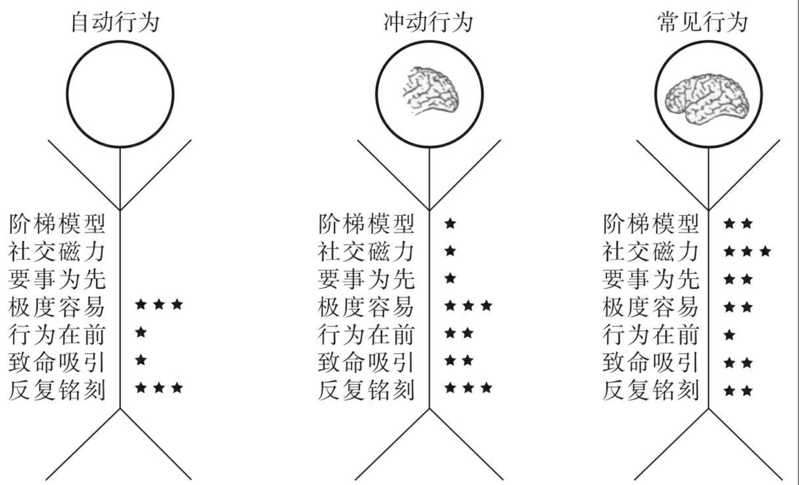

# 如何想到又做到

肖恩·扬 Sean D. Young，美国[加州大学洛杉矶分校](https://baike.baidu.com/item/加州大学洛杉矶分校/4014219?fromModule=lemma_inlink)医学院教授，加州大学预测技术研究院创始人，加州大学洛杉矶分校数字行为中心创始人。

## 前言

人们虽然知道自己需要怎样做オ能达到目标，但他们通常却不会那样做，因为他们没有系统学习过如何改变行为并坚持这种新行为。

如果想坚持健身目标，就得像美国健身节目主持人理查德·西蒙斯（Richard Simmons）一样热爱锻炼；

改变性格，说起来容易做起来难：每个人都有一套一辈子都不会改变太多的核心人格。好在要做出持久改变，你不需要对自己是个什么样的人做出改变，只需要了解持久改变背后的科学，并设计一套适合自己的行动步骤就行了。这就是本书想要实现的目的。

第一个原因，尽管阅读一本书能让人有改变的动力，就像听了一场励志演讲，但除非人们迅速着手行动，否则这种动力是无法持久的。本书的基本理念之一是，**持久的行为改变并不始于思想**，比如试着说服自己去改变；**持久的行为改变首先要从行动开始**，比如跟一个社群的人讨论这本书，而不是读完就好。

还有第二个原因。**让你养成某种习惯的书籍所依据的科学，来自一种叫作“条件反射”的原理**，它已经有75年的历史了。研究人员考察了改变大鼠等动物行为所需要的“条件”。他们发现，为了让动物学习新的行为，需要一种刺激（或触发因素）、一种反应（行为），接着是一轮强化（能让动物想要再做一次的奖励）

## 模型图

## 三种行为

要想真正改变行为，人必须得理解自己为什么要做这件事，彻底弄明白人类行为背后的科学解释。

### A自动行为

● 自动行为指的是人们出于无意识做出的事情。

● 如果你想改变自动行为（见图9-2），不妨使用“极度容易”和“反复铭刻”的武器。如果可能，“行为在前”和“反复吸引”也用上。借助其他可以改变有意识行为的武器，益处不会太多，当然，也不存在坏处。

讨人厌的自动行为：不知不觉地咬指甲或咬嘴唇、缩头探脑；等红绿灯时无意识地拿起手机；不自觉地感到紧张；不自觉地吃起了摆在面前的食物；不自觉地叹气，忘了自己明明正懒散地瘫坐着。

可取的自动行为：在排球比赛中本能地跃起拦球，或是篮球比赛时本能地将即将进篮的球截断；冲到大街中央一把抓起不小心跑到马路中央的孩子，把他救回来；在吉他上弹奏一段你练习过上千次的和弦；用多年来习惯了的方式刷牙。

### B冲动行为

● 冲动行为是人们在受到内心强烈驱使或在愤怒的状态下所做的事。

● 冲动行为接近于自动行为，这意味着改变冲动行为和改变自动行为所需的力量非常接近（见图9-3），即利用极度容易、行为在前、致命吸引和反复铭刻这几种武器的力量。但由于人们在做冲动行为时是能觉察到的，所以，另一些需要运用觉知的力量也能派上用场。

讨人厌的冲动行为：感觉自己一醒来就需要查看手机；感觉到立刻回复一封恼人电子邮件的强烈需要。

可取的冲动行为：感觉需要在出门玩耍之前完成家庭作业；感觉需要在上床睡觉之前解决一场家务纠纷；感觉需要每天晚上祈祷或表达感恩之情。

### C常规行为

● 常见行为是人们反复做的事情，至少在做的时候，他们有部分时间是有意识的。

● 改变常见行为需要使用更多人对所作所为有意识时使用的武器（见图9-4）。

讨人厌的常见行为：想吃垃圾食品；有意识地按下闹钟，多睡一会儿；固执地吃同一种甜麦片，而不是换成更健康的替代品。

可取的常见行为：持之以恒地进行健康饮食、锻炼，学习新语言。

## 7大武器

SCIENCE”中的字母分别代表阶梯（Stepladders）、社群（Community）、重要性（Important）、容易度（Easy）、神经记忆（Neurohacks）、吸引力（Captivating）、铭刻（Engrained）。

### 阶梯模型

整合步骤，目标与梦想

回想一下你第一次爬梯子或岩壁的情形吧。兴许很吓人，但当你踏上第一格横档，接着手往上扶，迈出下一只脚，你便逐渐找到了一种节奏，事情就会变得容易起来。只要你把注意力集中在下一格横档上，而不是往下看，说不定还会感觉没那么紧张了。每踏上一格横档，你的信心都在提升，从而让你有更大可能性继续往上爬。这就是阶梯背后的力量。

你兴许觉得自己早就知道这一点，阶梯的概念并不新鲜。虽然这个概念很容易理解，但实践起来却并不容易。人们理性上或许知道自己应该朝着目标迈出一小步，但却仍在规划太大的步子。

**梦想与目标需要区分开来。很多人都只是有梦想，但是并没有落地到目标，真正落地到目标后，才要进一步分拆目标**。

才能让大家正确地利用阶梯呢？根据我的经验，办法是：**与其告诉人们要迈小步，不如教他们心理是怎样运作的。只要人们弄明白为什么自己规划的步子太大，他们自然能够正确地使用阶梯的力量**。我们先从心理学上所说的“**锚定效应**”（anchoring）着手，它是由诺贝尔经济学奖得主、心理学家丹尼尔·卡尼曼（Daniel Kahneman）和阿莫斯·特沃斯基（Amos Tversky）发现的。

这就是为什么我会建议你找3个值得信任的人来帮忙的原因。你要先自己设定目标，再征求他们的意见，看看你设定的目标是不是真正的目标。如果他们说你要花3个月以上的时间才能完成它，那么它说不定就是你的梦想

● 要是把全部身心都放在了实现远大梦想上，实际上可能会造成相反的效果，因为梦想太大，也太远了，容易让人感到气馁。

● 一般而言，设定要花1个星期完成的目标，并规划出不到2天就能完成的步骤，是使用这套方法的关键。

● 完全专注于梦想，会让人把步骤规划得太大，以至于半途而废；目标才是关键，你需要专注于完成具体的小目标，校准思路，并正确应用这一模型。只有这样才能让改变更加持久。

● 阶梯模型有两个重要的组成部分。首先是使用模型来规划恰当的渐进步骤、目标和梦想。

● 阶梯模型的另一个重要组成部分是回想。

● 在开发一款应用程序时，就考虑利用阶梯模型，让人们逐步填写信息，可大大提高用户的参与度和留存率。

● 逐渐提高投入度或难度，可以让用户坚持使用产品。

你必须要理解，阶梯模型不是实现梦想的公式，它只是让你留在正轨上的公式。使用该模型的人半途而废的可能性较小，努力达成目标的可能性较大，依此步骤，也能帮助你实现梦想。

为了改变行为，要关注日常过程，而不是关注结果

研究行为经济学的科学家对阶梯模型为什么有作用做出了不同的解释。他们称之为跨期选择（intertemporal choice）或延迟贴现（delay discounting）：**人们为快而小的奖励赋予的价值，高于延迟到来的大奖励**，换句话说，**人们青睐于迅速看到结果**。

心理诊疗为怎么将回想整合到商业行为中提供了一个好榜样。对于为期1周的疗程，诊疗师会请患者谈一谈自己在上星期有哪些好的表现，比如遵循了诊疗师的建议，在焦虑时采用呼吸放松法。让患者说说诊疗的进展情况，并向他们表示祝贺，引导患者去回想自己的进步，他们就更有可能在以后继续使用这种方法。

这种回想的过程，有助于建立起心理学家所说的自我效能感（self-efficacy）。[插图]自我效能感在这里指的是“改变是可实现的”这一信念。帮助人们回想过去的进展，意识到自己既然能够完成上一步以及上一步的上一步，那么他们也理应能够完成下一步。仅是告诉人们怎样改变，不足以提高他们的自我效能感。要用问题、奖励或对话让他们意识到自己已经取得的成绩，这一点极其重要。有个做法值得一提，只有在认为自己完成了当下步骤的时候，人们才应该回想上一步。

### 社交磁力

让他人推动自己改

其中一些人开始放弃电子邮件，转而使用微信联系你了。这样的话，为了与朋友保持联系，你必须加入。这时你意识到，这是一个同伴们聚集在一起的社群。就算你一开始并不愿意加入，可为了不被社群排除在外，你还是加入了

● 社群要想对成员产生持久的影响，就需要有足够多的人为社群提供力量，创造社交磁力。对于规模非常小的社群，比如5人以下的社群来说，每个人都需要付出努力来建立社交磁力。而对于较大的社群来说，需要15%的参与者投身社交磁力的建设工作。

社群能推动成员坚持做有利于自身的事情，比如定期锻炼身体，[插图]也会推动大家坚持做对自己不好的事情，比如抽烟。

#### 6大要素

1）信任需求：如果人们信任社群里的其他成员，不管这些成员是家人、朋友、同事，还是陌生人，他们就会更乐于学习、保持更开放的心态，更愿意改变。

2）融入需求

3）自我价值的需求：人在做能让自己感觉良好的事情上会容易坚持。能更好地满足人的自我价值需求的社群可以提升社群成员的自尊心和积极性。

4）社交磁力的需求：

5）获得奖励的需求：

6）赋权需求：一如人们要自我感觉良好才能满足自我价值需求，他们还需要感觉到自己能控制生活，才会觉得自己被赋予了权利

● 社群里必须有15%左右的人是同伴榜样，所以，如果你希望创建一个100人左右的社群，你应该找15个同伴榜样。

社会心理学研究中学到的最深刻的道理就是：人从不是在孤军奋战。不管你觉得头脑里的各种想法角力时自己是有多么孤立无援，总有许多人在同样的时间，跟你有着完全一样的想法。我们都一样，人们对某个想法和感受的体验总是相似的。

### 要事为先

找到对自己最重要的那件事情

● 大多数心理学家认为，人天生并没有所谓的动机型人格。人是因为环境的关系，因为在正确的时间处在了正确的或错误的位置，才去做事情的。

除了社群，还有什么因素能让人们坚持做事呢？如果人们认为这件事很重要，他们就能坚持了。

● 你认为更重要的东西，对你选择做什么有着很大的影响。

● 头三件最重要的东西是：金钱、社会关系和健康。

● 社会关系能让人开心。有时候，它比金钱更能让人坚持做事。

● 生活可以让人们产生新的动机、新的做事理由。如果我们学会把焦点放在真正重要的事情上，哪怕是悲剧事件上，也能拥有快乐和幸福。

● 只是让人们理解并感觉某事重要，还不足以让他们坚持下去。眼下重要的事情，到了明天或明年，说不定就不重要了。

人们很难为遥远的奖励做出长期改变。但通过一项简单的练习，他们可以改变这一点。

● 你需要弄清楚怎样才能让事情变得足够重要，重要到你愿意为了它而改变。

### 极度容易

越简单，越能经常到底

● 人们总是希望事情很容易做。他们喜欢容易做的事情，也会坚持做那些极度容易的事情。

总有若干股力量在互相角逐，想驱动人们去做不同的事

● 面对障碍，人很快就会放弃做某件事。反过来说，如果你学会了怎样消除障碍，就能很容易继续做下去。

你可以通**过控制环境、限制选择或使用路线图**来实现它们。这三种方法都涉及消除障碍、让事情变得简单，但每一种调用的都属于略有不同的心理范畴，所以我把它们分成了三类。

● 改变环境，让它变得更易于做某事，就会让人们真的去做这件事。

● 虽然人们总以为自己希望拥有更多的选择，但实际上，选择太多会让一个人难以做事。

人们会在选择范围较小的时候购买果酱或巧克力，是因为做过多选择是件很困难的事情。如果你向他们提供数量较少的选项，他们会更容易地做出决定，并且坚持下去。

人们不只会把事情弄得对别人太复杂，也会把事情弄得对自己太复杂，反而让他们难以将自己的计划贯彻到底。

● 不管一件事物看上去有多么愚蠢，如果它容易使用，人们就会用它。

● 让事情变得简单、容易，才是聪明的做法，有助于我们坚持到底。

### 行为在前

行为改变了，意识也会跟着改变

而是将密码改成了“Forgive@h3r”，意思是“原谅她”。这个简单的行动改变了他对前妻的想法，也真正地改变了他的生活。他不再对前妻充满敌意，而是提醒自己要原谅她。

● 持久的行为改变通常并不始于意识告诉身体要做出持久的改变；它始于先做一些小小的行为改变，接着让意识反映出这种改变。自我认同是这一改变过程的关键部分。

● 神经记忆可以让人们回顾自己过去的行为，看到自己的改变，从而坚持做之前没法做到的事情。

● 不必控制自己的想法，只要对自己的行为做一些小小的改变，你的意识就会跟着改变。

● 如果人们从事某一活动时能够全神贯注而不是频繁走神，他们就会更喜欢该活动。

你想让孩子更懂得感恩吗？那就让孩子去做“懂得感恩的人”会做的事情，比如参加志愿活动。这样的神经记忆法或许会有帮助。有一项研究发现，参加志愿活动的青少年更关心他人

你想不再拖延吗？不妨创建一个治疗拖延的自助小组或播客。如果你自己都拖拖拉拉的，那就很难领导一支团队，也很难让别人不再拖延。

神经记忆的方法告诉我们：与其改变自己希望与他人更亲近的想法，不如去做一些事情，让你变得跟他人更亲近。

● 持久的行为改变始于行为的实际的、实体的变化，而不是思想中的变化。

### 致命吸引

极度诱惑能让你无法克制地坚持下去

道理很简单。如果人们做某件事感觉到了奖励，就会继续做下去。我把这称为坚持一种行为的吸引力。

● 把无聊的事情变得有趣、具有奖励的性质，有助于你坚持目标，不管你的目标是什么。

● 日常生活中，我们只是习惯了以某种方式行事。如果做某件事的结果不好，我们就不会再做；如果结果好，我们就会重复这种行动或行为。

● 人不需要额外的奖励去做本来就感兴趣的事情。如果你开始为这些活动附加奖励，人们说不定会认为这些活动不像自己想象的那么有趣，因为竟然需要奖励才有人去做它。

● 不要光想着教育人，而是要调动人的心理和情绪，让他们坚持做事。

“快修”指的是对人做某事的需求进行直接强化。比方说，你刚刚走进赌场，立刻听到老虎机里叮叮当当掉出一大堆硬币的声音，这就是应用“快修”法的实例。这立刻告诉赌客，他们也能赢，而且他们应该继续走过来，放下一些钱，让机器转起来。“快修”的一个要点是：在开始某事之前，人们想要迅速得到它。如果要过上一阵子才能得到“快修”，人们就不会把奖励与行为挂上钩。

赌场是怎样使用“妙修”法的呢？他们承诺人们会赢，但不是每把都赢。他们让赌客在期待最低的时候偶尔赢一下。研究表明，间断地赢比每次都赢，更能让人沉迷于赌博。如果每次玩都得到奖励，人们很快会感到无聊，不再玩下去，但若是间断地赢，他们就会不停地玩，直到把所有的钱都输光才停下

● 如果你能够理解随随便便的奖励跟真正诱人的奖励有什么区别，那么，你就掌握了实现持久改变的力量。

### 反复铭刻

把行为变为习惯，将习惯设为默认

● 如果你反复做一些对自己有益的事情，比如吃得更健康、采取更安全的工作方式、更具当下意识，这些活动就会铭刻到大脑中，让你更容易坚持做下去。

反复刺激能让行为变成习惯，铭刻进脑海

● 一旦习惯建立起来，大脑便达到一种稳定的平衡状态，并能够放松下来。如此一来，习惯就变成了默认行为。

● 冥想会给人们的健康、幸福、人际关系和生产能力带来持久的变化，甚至改变大脑的解剖结构。

●把行为变成习惯，有助于将它铭刻在大脑里，增加“黏性”，以便坚持。

## 总结感想

1）首要的是分清楚梦想和目标，梦想是感受，目标是具体的事情要求

2）人的大脑虽然进化了，但是还是喜欢做一些**简单的工作**。所以**目标需要拆分**，事情需要**容易化**。

3）大脑需要激励，所以我们需要不停的激励，变着方法**诱惑**大脑，欺骗大脑，让大脑觉得的这件**事情很重要**。

4）人是社会动物，需要得到同类人的认可，为了融入需得从众。所以利用**社群武器**，让人在做事情的时候得到认可和激励，也让人被监督，被融入。

5）什么是真正的简单，就是让大脑不思考的时候就主动做，所以我们要养成**行动在前**。**重复循环，反复一些行为**。

