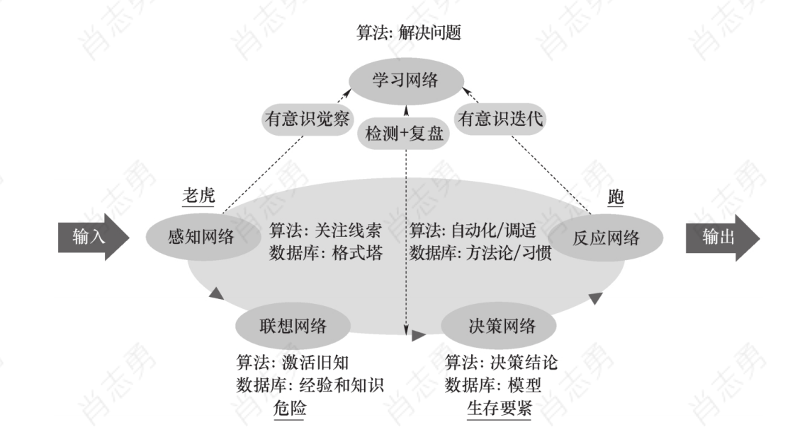
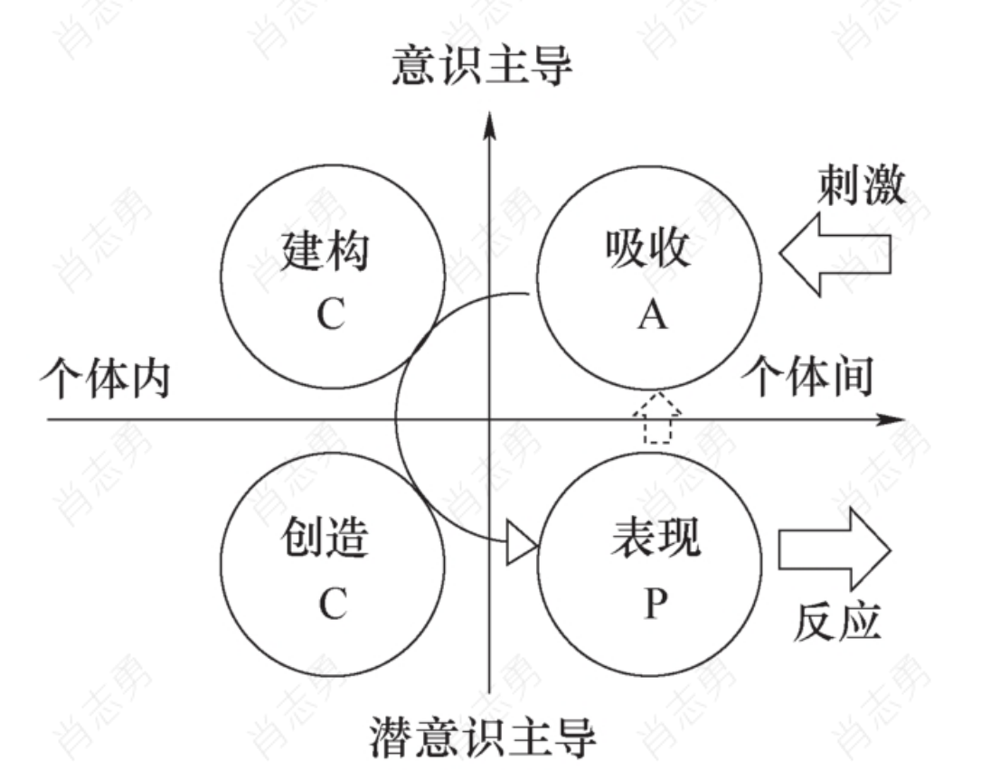
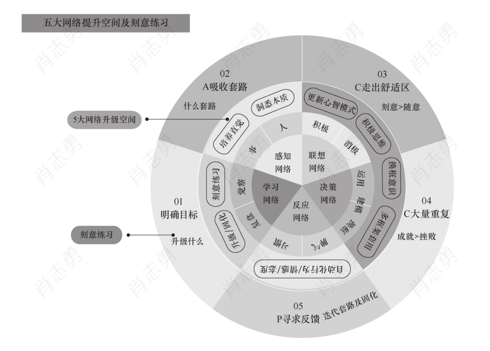

# 学习力跃迁：像AI一样迭代自己

## 一、书籍核心定位

《学习力跃迁：像AI一样迭代自己》是一本聚焦「高效学习方法论」的实用指南，作者从人工智能的底层学习逻辑（如深度学习、强化学习、自监督学习等）中提炼出可迁移的人类学习策略，旨在帮助读者突破传统「努力但低效」的学习困境，实现从「被动积累知识」到「主动进化能力」的跃迁。全书以「AI迭代机制」为隐喻，系统拆解了人类学习的底层规律与实操方法，核心目标是培养「终身迭代型学习者」。

## 二、核心框架与关键观点

### （一）为什么需要「学习力跃迁」？——传统学习的三大陷阱

书中首先指出，现代人面临的学习挑战已发生根本变化：信息爆炸（每年新增知识量超过个人一生能消化的极限）、知识半衰期缩短（多数技能5-10年失效）、复杂问题增多（需要跨领域迁移能力）。但多数人的学习仍停留在「机械记忆-重复练习」的线性模式，陷入三大陷阱：

1. **存量思维**：追求「记住更多知识」而非「解决问题」，导致学得多但用不上；
2. **单点努力**：依赖「时间堆积」（如熬夜刷书），忽略学习策略的优化；
3. **静态目标**：以通过考试/拿到证书」为终点，而非持续迭代能力。

作者提出：真正的学习力，是「像AI一样通过反馈不断优化自身参数」的能力——即通过「输入-处理-输出-反馈」的闭环，持续调整学习路径，最终实现能力的指数级提升。

### （二）AI如何学习？——从机器学习到人类学习的映射

本书的核心隐喻是将AI的学习机制（尤其是深度学习、强化学习等前沿技术）转化为人类可操作的学习策略。关键映射关系如下：

| AI学习机制                 | 人类学习对应策略               | 核心启示                                                     |
| -------------------------- | ------------------------------ | ------------------------------------------------------------ |
| 深度学习（多层神经网络）   | 构建「知识分层体系」           | 知识需分层存储（基础概念→关联规则→应用场景），避免碎片化；通过「抽象-具象」循环加深理解。 |
| 强化学习（试错反馈）       | 建立「行动-反馈-调整」闭环     | 学习不是「输入知识」，而是「通过实践获得反馈，再优化策略」；小步试错比完美计划更重要。 |
| 自监督学习（自我生成任务） | 主动设计「问题驱动」的学习目标 | 人类需要像AI预训练一样，主动给自己提问题（如「这个原理还能解释什么现象？」），而非依赖外部灌输。 |
| 注意力机制（筛选关键信息） | 训练「认知聚焦能力」           | 用「问题导向」过滤无关信息，优先处理与目标强相关的知识节点。 |

### （三）人类学习力跃迁的四大核心模块

#### 1. **认知地基：重构学习的目标与动力**

- **关键观点**：学习的终极目标不是「储存知识」，而是「构建解决问题的能力系统」。

- **方法论**：

  - 用「能力地图」替代「知识清单」（例如：学编程的目标不是记住语法，而是能独立开发一个解决具体问题的工具）；
  - 激活「内在动机」（通过「为什么而学」追问本质——是为了改变职业轨迹？解决生活问题？还是满足探索欲？）；
  - 接受「不完美起点」（AI训练从随机参数开始，人类学习也需允许初期错误）。

- **金句摘录**：

  > “学习不是往篮子里装石头，而是点燃一堆火——石头会沉底，但火焰能照亮前路。”
  > “真正的学习目标，应该是‘未来某个场景下我能做什么’，而不是‘我现在记住了多少’。”

#### 2. **输入阶段：高效获取与筛选信息**

- **关键观点**：信息过载时代，「筛选比收集更重要」，需建立「精准输入」的策略。

- **方法论**：

  - **问题驱动输入**：先明确「我要解决什么问题」，再针对性寻找资料（例如：想提升演讲能力，就聚焦「说服逻辑」「肢体语言」「案例库」而非泛读所有沟通书籍）；
  - **三层过滤法**：用「相关性（与目标关联度）→可靠性（信息源权威性）→时效性（知识更新程度）」筛选内容；
  - **结构化摄入**：优先选择「有清晰框架」的材料（如教科书、经典著作），避免碎片化信息（如短视频知识点）。

- **金句摘录**：

  > “输入的质量，取决于你提问的精度——问题越具体，筛选出的信息越有效。”
  > “不要做信息的‘收藏家’，要做知识的‘采矿工’——只挖真正需要的矿脉。”

#### 3. **处理阶段：深度加工与知识内化**

- **关键观点**：知识必须经过「主动加工」才能转化为能力，机械记忆是最无效的方式。

- **方法论**：

  - **费曼技巧升级版**：不仅要「用简单语言向他人解释」，还要「故意制造认知冲突」（例如：假设听众是10岁孩子/行业外人士，逼自己用类比和案例拆解复杂概念）；
  - **知识图谱构建**：将新知识与已有经验关联（画思维导图/概念网络），标注「相似点」「差异点」「可迁移场景」；
  - **多模态加工**：结合听（课程）、读（文字）、写（笔记）、说（讲解）、做（实践）多种方式刺激大脑，强化记忆链路。

- **金句摘录**：

  > “知识内化的本质，是把‘别人的东西’变成‘自己的语言’——你能讲清楚，才算真理解。”
  > “孤立的知识点像散落的珠子，只有用问题的线串起来，才能成为项链。”

#### 4. **输出与反馈：通过实践验证与迭代**

- **关键观点**：学习的有效性最终由「输出结果」检验，而进步来自于「持续接收反馈并调整」。

- **方法论**：

  - **最小化实践**：学完一个知识点后立刻做「最小可验证动作」（例如：学时间管理后，先优化当天日程；学写作后，立刻写一篇短文并找人点评）；
  - **主动寻求反馈**：向高手请教/用户调研/数据复盘（例如：公开分享后记录听众的问题，练习技能后分析失误点）；
  - **迭代循环**：根据反馈调整学习重点（例如：若发现「理论懂但不会用」，则加强案例学习；若「速度慢」则优化流程）。

- **金句摘录**：

  > “没有反馈的学习，就像蒙眼开车——你以为在前进，其实可能在绕圈。”
  > “输出不是学习的终点，而是下一轮迭代的起点——每一次反馈都在修正你的‘能力参数’。”

### （四）加速跃迁的附加策略

- **元学习能力**：学习「如何学习」（例如：定期复盘自己的学习效率，总结哪些方法对自己最有效）；
- **跨界迁移**：将A领域的思维模型应用到B领域（例如：用游戏设计的「反馈机制」优化学习激励）；
- **长期主义心态**：接受「慢启动」（前期进步可能缓慢，但积累到临界点后会爆发式成长）。

## 三、个人实践启发

阅读本书后，我最大的收获是意识到：「学习力」的本质是一种「系统优化能力」——它不依赖于天赋或努力程度，而取决于是否建立了「目标-输入-处理-输出-反馈」的高效闭环。过去我常陷入「学了很多但用不上」的困境，本质是因为忽略了「问题导向」和「反馈迭代」；未来我会尝试用书中方法：

1. 每次学习前先明确「我要解决的具体问题」；
2. 用费曼技巧+知识图谱深度加工信息；
3. 每学完一个模块立刻实践并记录反馈；
4. 定期复盘调整学习策略。

正如作者所言：「像AI一样迭代自己，不是要变成机器，而是要借用机器的底层逻辑——通过持续反馈优化，让自己成为更强大的‘进化体’。」

## 四、总结

《学习力跃迁：像AI一样迭代自己》的价值，在于它打破了传统学习方法的「经验主义」，用AI的科学逻辑为人类学习提供了可验证的策略框架。书中既有认知层面的颠覆（如「学习目标是能力而非知识」），也有落地层面的工具（如三层过滤法、最小化实践），适合所有希望提升学习效率、应对快速变化的终身学习者。

**核心记住一句话**：

> “真正的学习高手，不是‘学得快’，而是‘迭代得快’——他们像AI一样，永远在下一次版本里变得更强。”

## 五、摘录

如果把专家与新手的五大不同和人工智能的反应系统再类比，就可以挖掘出自然人工作、学习过程中有序协作的五大网络：

**感知网络**，即有目的地从外界获取信息的网络；

**联想网络**，即将外界获取的新的信息与旧知、经验相关联的网络；

**决策网络**，即负责思维加工，运用思维模型评估不同策略的优劣，最终做出决策的网络；

**反应网络**，即根据决策调取和组合自动化程序做出行为反应的网络；

**学习网络**，即负责制订策略、监测情况、随机权变、事后反思、总结升华，以及统筹和协调其他四大网络有机协作的网络。

所谓的成功，无非是心力的长期定投。专家之所以成 为专家，所做到的无非就是把自己的注意力长期定投在所从事的领域 上，复利效应就会产生，一天天积累下来，和普通人的差距就不得 了。同时，专家也有像人工智能一样的特质，他们经常会不知疲倦地 工作，沉迷在研究中不断迭代自己的技法。

人的本性是喜欢舒适、抗拒变化的。对多数人而言，他们宁可在错误 的事上显得能干，也不愿在正确的事上显得笨拙。他们宁可简单粗暴 地、日复一日地重复低效能模式，也不愿意花时间复盘反思、主动迭 代和刻意练习，所以高级机能很难得到有效开发和利用，久而久之， 就堕落得跟动物一样。可见，高级机能的持续开发和利用能力是把人 分化为有用之人和无用之人的分水岭。

我 们生活中常常说的所谓“油腻”，其实就是指那些人身上的模式已经很长 时间没有迭代了。如果不关注潜意识中的模式，如果不关注潜意识的 算法和数据，关于人类学习的讨论就是残缺的。现代教育将大多数人 的意识的学习能力开发得还是不错的，但是意识和潜意识该如何配 合，以及潜意识的学习能力该如何提高，人类还有很长的路要走，这 也正是自然人可以向人工智能学习的地方。

学习就是主动“淘换”自己的动作，目的是让自己更加适应社会，不断 提高生命能量的运用效能，创造更多的价值，活出轻而易举的幸福与 成功，活出生命允许的最大可能。这里面就有一个矛盾，一方面要增 强生命能量的流动性，跟外界充分交换，才能“淘换”到更好的“木 板”；另一方面，又不能在流动中迷失自己。任何系统都要平衡好自主 性和流动性这一对相辅相成的目标。

自主性和流动性兼具的人是很好的学习者，自主性好才知道自己要成 为谁，什么东西对自己重要；流动性好才能更好地“借外界，修自 己”。当然，还要有很好的学习态，能够发自内心地认为所遇皆资源， 所见皆机缘。走进生命中的所有人和事都是修身的素材，一切发生都 可以视为反馈，外在反馈引发内在反思，反思是为了提高认知水平和 反应模式。新的反应模式又要在实践中验证，得到新的反馈。这个内 外交互的循环是学习发生的工艺流程。

我受教育学家马扎诺的启发，把人的改变归结为四个不同层级的改变。最核心、最底层的是自我系统的改变。当一个人清晰地知道自己要成为谁的时候就会动力十足，一旦找到大愿，学习就进入了自动导航模式。**没找到大愿的学习都是用意志力死磕，不仅不可持续，而且****容易引起自身对学习的逆反。**其次是元认知系统的改变，元认知可以理解为学习能力，包括学习方法和策略、学习过程及效果监测、学习策略调整和事后的复盘总结等能力。如果说自我系统解决的是学习意愿问题，那么元认知系统解决的是学习能力问题。再次是认知系统的改变，包括对信息的获取、加工、存储、提取、运用等思维方式的改变。最后才是反应系统的改变，又分情感反应系统和行为反应系统，即态度和技能。态度是附着了浓厚情感的认知，技能是能付诸行动的认知，习得的标志都是不假思索的自动化反应。外层改变的价值显然不如底层改变的价值大。

**人生最大的不幸就是毫无觉察地重复早年形成的低版本模式。**

思想落后的时候就是大权旁落的时候。 永远保持学习态，永不停息地迭代，永远走在时代的前列，是顶流专 家的重要特质。

**没有倦怠的工作，只有倦怠的人。**关键在于在工作中找到让自己持续兴奋的点，尽管在外人看来工作是不变的，但具体到对工作的理解和干法则是每年都不一样，始终让自己恰到好处地走出舒适区，处在学习态才是其中的关键。否则，哪怕是开飞机这样看起来高大上的工作，几十年如一日地重复同样的行为，人也会厌倦。

人性中最矛盾的一点是：既害怕变化，又腻烦不变化。

#### 学习力的ACCP循环模型：

对应学习力的ACCP循环模型，

知识的吸收（A）其实就在最低的台阶——机械的记忆和简单的理解；

知识的建构（C）对应的就是个人版本的理解以及分析、评价，也就是更深层次的理解；

把建构的东西用于创造（C），已经是学习的最高层级了；

当我们把创造去表现（P）出来的时候，又能够引来别人的对这个表现出来的产品的评价和分析，这些

评价和分析对我们而言又能作为一种反馈进入下一轮的吸收。

**学习中最大的误区是自以为懂了。**认知脑最擅长的事情就是简单在脑内彩排一下，就自以为懂了。

《论语》里描述孔子的学生子路，“子路有闻，未之能行，唯恐有闻”，就是说他每每学到一点知识，如果自己还做不到，就唯恐别人再告诉他新的知识。子路就非常懂得学习的本质，那就是知行合一！现代人应该向子路好好学学。如果用人体的消化系统来类比学习，ACCP没循环起来或循环质量不好，无非以下几种原因。

第一，要有明确的目标。首先是要明确自己究竟要练什么，到底是五 大网络中哪个网络的哪个方面？没有目标的刻意练习是瞎练。

第二，带着套路练习。只有有套路的行为才是可复制的行为，在认知层面要熟悉动作实现的步骤和要领。套路是实现目标的“脚手架”，所以在刻意练习的过程中套路很重要，当行为通过大量刻意练习变为自动化反应后，套路就失去了作用。

第三，恰到好处地走出舒适区。所谓刻意，就是要有意识，就是要投入注意力资源，就是要恰到好处地走出舒适区，这就把刻意和随意进行了区分。在刻意练习的过程中，要让刻意的能量略大于随意的能量，要让成就感略大于不适引起的挫败感。

第四，大量的重复。通过大量的重复，让有意识的能量投入所占的比 重逐渐变低，一点一点地让五大网络的潜意识自动接管，而不再动用 高级机能，让有意识的部分逐步化作无意识的自动化反应。

第五，及时有效的反馈。通过主动寻求反馈，用反馈引发反思，通过 反思及时纠正过程中的细微偏差，进一步迭代套路。不要想着一个套 路用到底，那不可能，没有人是通过看说明书学会骑自行车的。另 外，每次做对了还要及时庆祝。

知道“要什么”和“为什么”的人几乎可以克服一切“怎么办”的困 难。

