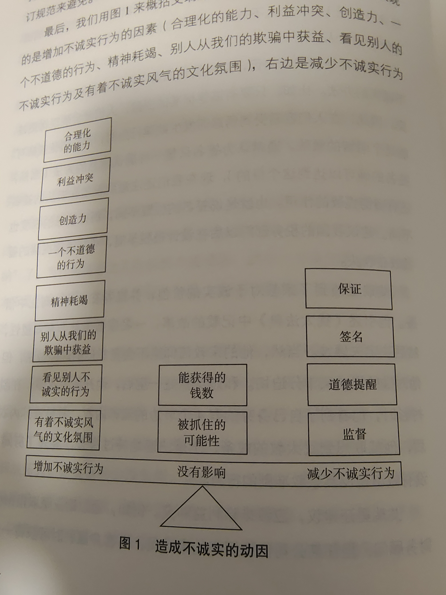

# 怪诞行为学

[丹·艾瑞里](https://baike.baidu.com/item/丹·艾瑞里/2365819?fromModule=lemma_inlink)，18岁时的一场爆炸意外，让艾瑞里全身皮肤70%灼伤，住在[烧伤病房](https://baike.baidu.com/item/烧伤病房/55946728?fromModule=lemma_inlink)达三年之久。身穿治疗用黑色弹性[紧身衣](https://baike.baidu.com/item/紧身衣/4733449?fromModule=lemma_inlink)、头戴面罩的他，自嘲为“蜘蛛侠”。但恰恰是在这段漫长、无聊，而又痛苦不堪的岁月里，那套奇异的“蜘蛛侠”服装拉开了他与外界的距离，使他可以以局外人的眼光重新看待身边的世界，从此有了探索[人类行为](https://baike.baidu.com/item/人类行为/9050344?fromModule=lemma_inlink)与经济关系的兴趣。最终，他成为著名行为经济学家。

丹·艾瑞里是美国[麻省理工学院](https://baike.baidu.com/item/麻省理工学院/117999?fromModule=lemma_inlink)传媒实验室艾尔弗雷德·P·斯隆基金会和[斯隆管理学院](https://baike.baidu.com/item/斯隆管理学院/10016825?fromModule=lemma_inlink)[行为经济学](https://baike.baidu.com/item/行为经济学?fromModule=lemma_inlink)教授、[波士顿](https://baike.baidu.com/item/波士顿/81031?fromModule=lemma_inlink)[联邦储备银行](https://baike.baidu.com/item/联邦储备银行/5692763?fromModule=lemma_inlink)研究员、普林斯顿高等研究中心研究员。在麻省理工学院期间他写了这部行为经济学的重要著作。他的文章一直在重要的学术期刊，以及《[纽约时报](https://baike.baidu.com/item/纽约时报/1049617?fromModule=lemma_inlink)》和《[华尔街日报](https://baike.baidu.com/item/华尔街日报/4085279?fromModule=lemma_inlink)》的专栏上发表。

## 可预测的非理性

### 为什么我们喜欢攀比

一切都是相对的，--->攀比的原因

多数人只有到了具体的情境才知道自己真正想要的是什么

我们不但喜欢将事物与事物进行比较，而且喜欢比较容易比较的-----避免比较不容易比较的事物。

ps:利用这一点，可以运用经济生活各方面。所有事情都是相对的，所以为了售卖商品，就可以拿其他的对比，

### 羊群效应

基于其他人的行为来推断某事物的好坏，以决定我们是否效仿。---羊群效应

如某个餐馆在排队，有了第一次体验后，我们以后胡自觉的后面排队。

第一印象非常重要。

### 免费的代价

免费最大的问题在于，它引诱你在它和另外一件商品之间的挣扎----并引导我们做出不明智的决定。

我们为什么疯抢根本不需要的东西？-->免费引起的情绪冲动。

### 社会规范的成本

为什么我们乐于做义工，干活赚钱时反而不高兴？

**我们生活在两个不同的世界里，其中一个世界由社会规范主导，另外一个由市场规划来制定**。

有时候社会成本可能高于市场成本。（人情）

迟到罚款

社会规范：迟到了会内疚，后面基本上会避免。如果罚款，就是市场规范，迟到了大不了交钱。

金钱到最后经常是最昂贵的激励方式，社会规划不仅成本较低，而且更有效。

PS：很多时候可以利用社会规范，利用才的社群活动，打广告和促销。如贵州的乡村篮球，如果用市场去主导，肯定是火不起来的。

### 性兴奋

在非兴奋状态下，我们并不知道自己在兴奋状态会怎么样。预防，保护，节制以及道德在雷达屏幕上全部消失。

人的实质上并不不是一个人，而是两个人。

在激情的狂热中，我们都有一瞬间会面临从"你只需要说不"变为"没问题"的危险。

### 拖沓

人们可以自己设定期限，但是这些期限未必能使他们的能力得到最好的发挥。

解决拖沓--->简化，再简化。

### 所有权的个性

我们会依恋自己拥有的一切

为什么房屋买卖，卖主对它的估计比买主高？你的天花板是别人的地板。

人类三大非类型怪癖：

1）我们对已经拥有的东西迷恋到不能自拔。

2）我们总是把注意力集中到自己会失去什么上，而不是会得到什么。

3）我们经常假定别人看待交易的角度和我们一样。

### 选择困境

为什么我们希望所有的门都开着？

如购买车子或者电脑，我们总喜欢各种功能全备，无论用不用，电脑里面也装上各种工具，也无论后面用不用。

在吸引力大致相同的两张选择中做取舍最难的。

### 预期的效应

为什么我们可以心想事成？

如果我们事先相信某种东西好，那它一般就会好，认为不好，它就不会好。

预期还可以形成成见。

ps：利用这种心理，做暗示和引导。

### 价格魔力

为什么我们喜欢买贵的东西？

神奇的安慰疗法，越贵，约相信，约觉得有效。

安慰疗法与安慰剂的作用靠的是暗示的力量。

### 人性的弱点

为什么我们不诚实？

有了适当的机会，很多平日里诚实的人也会作弊。我们发现，坏了一锅汤的并不只是几条臭鱼，多数人都会作弊，但作弊的程度不高。。

在诱惑下作弊，作弊的程度并不像人们通常认为的那样高。

### 企业的特权

为什么现金可以阻止我们作弊？

现金有种神圣的力量，一旦没有现金的直接提醒，我们就可能作弊，而且所达到的程度连我们自己都想象不到。

### 免费的午餐

我们去不熟悉的餐馆吃饭，点单的时候，一般会看看别人在吃些什么。然后我们也跟着点(可能并不想着吃)

人们更容易受到来自周围环境中无关的情绪，短视以及其他形式的非理性因素的影响。

### 约会的秘密

千万不要告诉你的朋友你为什么要约她。

### AA制

轮流做东比AA制更能增进友情。

PS：每次AA，大家都要承受付费的痛处，但是如果我们只需要痛一次，就可以后面很多次不用痛，感觉更好。

### 礼品

礼品是最佳的友情润滑剂

用礼品比奖金更容易培养员工的忠诚度。

### 微信朋友圈

如何避免刷朋友圈的恶习？强化程式

## 非理性的积极力量

### 金钱的诱惑

为什么巨额奖金带不来高业绩？

在到达某一点之前，激励可以促使人们更好地学习和表现。但是超过之后，效益就会下降。

### 工作的意义

我们可以从乐高游戏中学到什么？

无论正面还是负面，要吸取工作的意义其实非常容易。如果要打击一个人的积极性，只要毁掉他的劳动成果就够了。如果巧妙一点，对他的劳动成果不闻不问。相反，如果要提高积极性，那就是重视他的工作，重视他的劳动成果。

公司：努力使员工感到工作的意义，不仅仅通过愿景规划，而且要让雇员有成就感，确信只要做好工作就会得到肯定。---满足感-->生产率

### 宜家效应

为什么我们会高估自己的劳动成果？

对自己制作和拥有的物品感到骄傲，是人类拥有的一种根深蒂固的情感。

PS：让客户自己动起来，引导客户的参与感和成就感，如宜家的家具，半成品的食品等。

劳动的增加都会导致价值的提高

即使再丑陋的猴子，在母亲的眼里，它也是美丽的羚羊。

ps:父母也不要太过高估自己的孩子

我们错误地认为别人也同样喜欢我们的作品。

爱与付出：

1）我们对某一事物付出的努力不仅会给它带来改变，也改变了自己对它的评价。

2）付出越多，产生的爱恋越深。

3）我们对自己的作品估计过高，这一偏见深入骨髓，误以为别人也和我们的看法相同。

4）如果付出巨大努力仍然没有获得成功，我们就不会感到过多的依恋。

### 偏见

为什么我的点子比你的要好？

孩子是自己的好，-->如果不是我们发明的那就没有什么价值

### 报复的本能

为什么我们要寻求公平正义

只要有机会，我们大多数人都会自然而然地寻求报复。

一旦人们感觉需要采取行动进行反击，通常就不会再仔细辨别到底是谁惹怒了他们，以及反击的后果最终会落到谁的头上。

### 适应法则

人是有适应能力的动物，能习惯于一切事物。

一切动物，包括人类，只要经过一定时间就几乎可以适应一切。

大家不要做温水中的青蛙。我们的任务是弄清楚适应性如何在我们身上起作用，因而可以利用有利的一面，防止不利的一面。

### 感情的偏好

为什么我们选择帮助某个人，却漠视许多人的痛苦？

ps:人容易具体化，某个人有困难，我们觉得帮助他，且乐于帮助他，但是如果许多人需要帮助，我们不会有那么强烈的意愿。因为我们无法帮痛苦的感受放大多数人的倍速。所以无法体会大多数人的痛苦。

一个人的死亡是个悲剧，但是100万的死亡不过是个统计数字。

### 短期情绪的长期效应

为什么我们常常感情用事？

## 诚实的真相

人，**天生有道德追求和道德约束**，这实在好比是天使，制约着我们去犯罪。但人又总是有不择手段追求私利的冲动，这好比是魔鬼。人，就是在义利之间挣扎，冲突。-->社会规范+市场规范。

ps:人是社群动物，既做婊子，又想立牌坊。

我们每个人在欺骗时都有个度，只要没有超过这个度，我们就不至于有罪恶感，我们就都有可能会欺骗。

现金出现得越少，人类的道德就会越败坏。只要有道德标准的提醒，我们就会表现的更诚实。

ps:做事情，诵读佛经，或者把场所弄的高尚点，签字单，先签字，再填写内容等。。

我们生来就会报恩，从根本上说，人类是社会性动物，所以接受他人的帮助或礼物时，我们往往会有负债感。

ps:所以一旦某人/某组织给了我们好处，我们就会偏袒任何与相关的事情，而且这种偏袒会根据得到的好处的增加而增加。

我们在做重大决策，且听到的建议有偏差时(如医生建议我们在脸上刺青)，我们应该花点时间和精力去问**问另一个与这个决策没有利益关系的人的意见**。

### 越疲倦，越冲动

在压力比较大日子里，我们往往经不住诱惑，会选择那些不健康的事物。

ps:节食为什么容易反弹。

ps：因为累的时候，脑累了，我们抵制诱惑需要付出极大的努力和精力。

如果你的意志力下降了，控制欲望的难度就会增大，这种难度最终也会降低你的诚信水平。

### 冒牌货

穿冒牌货会让我们更不诚信吗？如果我们故意穿，道德上的束缚就会放松，我们也会变的更不诚实。

冒牌货不仅使我们变得更不诚实，还会让我们更加低估他人的诚实度。

ps:以为其他人和自己一样。

预防第一次的不诚实行为非常重要。

### 自我欺骗

我们会本能的高估自己的能力与智商。

### 后见之明

人们都有一种自然倾向，即说服自己相信自己一直都知道正确答案

ps：哦，原来是这样，好像我知道。

我们欺骗自己的一部分原因是想保持正面的自我形象。我们掩盖自己的过错，彰显自己的成功。还喜欢将难以否认的错误归咎于他人和外部环境。

我们生来就有编借口的能力，而且在得到自己喜欢且听上去值得相信的借口前会不断地想借口。

创造离约强，粉饰不诚实行为的能力越强。

一方面，我们想从欺骗中获利(理性经济动机)，另一方面，我们希望仍将自己视为好人(心理动机)

## 他人评价

https://zhuanlan.zhihu.com/p/440771343

一、锚定效应及难以确定的价值评估

“珍珠王”萨尔瓦多采集珍珠市场未曾见过的黑珍珠，一开始销量不佳，因为珍珠色泽不佳，又灰又暗。按照市场供给需求来看，需求少，价格低的情况会促使生产商减少供给，降低价格出售。但是萨尔瓦多没有这么做，他等待时机；一年后，他通过老朋友哈利.温斯顿，把黑珍珠以高价标码，展示在纽约的第五大道上，不久，黑珍珠变成了稀世珍宝。

让黑珍珠标明高价，难以获得，这个策略让人们略过了对黑珍珠使用价值的考量，而因为价格高昂过度高估其价值。正是最初高价这根锚，让人们在心中形成深刻的印记。为什么？因为人们对黑珍珠的认识甚少，他们对新事物难以给予商业价值、市场价值上的准确评估；而生产者给予的市场价格让人们默许黑珍珠商品的价值。

二、有序和无序

人类具有的动物的本能，可以概括的说，是无序的，是熵增的行为。

现代社会人们会被各种各样的选择而迷惑，处处深受“选择困难症”的折磨；多样性是人类发展的必然，但对于个体来说，不一定是一件好事。个人会向各个方向发展，并不知道最终的方向而四处奔赴。这给予生产者一个畅销的机会。只要给予选择不多，并给予几个劣质选择的“陷阱”，人们就会趋向选择生产者乐意看到的、利益最高的商品选择。人类行为的无序性也可体现在拖延症的方面：将待完成的任务无限期延长直到deadline到达；解决这个的根源，就是认识到时间的短缺性，建立惩罚激励机制，驱动解决拖延。

三、经济学“理性人”的假设批判

在经济学领域，每个人都被当作理性人看待，在众多选择中会选择利益最高的一个。这在研究宏观经济学，为政府决策与法规制定时能起到很大作用；但在研究微观经济、个体行为时就有悖常理：人们的行为受多重因素影响，且实时情绪影响程度很高。除了情绪，受教育程度、年龄、经验、性格、财富状况等等，都会导致每个人的消费选择不同，也导致了人们出现非理智行为的可能。在兴奋状态下，人们更可能做出非理智的举动。这是人体兴奋机制所决定的，保存在人体基因内的不可改变的事实，也是人类进化过程中所保留下的本性；这也决定人们不可能永远当作理性人看待。

四、价格与信息暗示的心理影响

同样的使用价值，赋予不同的价格，对于人们的满意程度有一定影响。人们的心理偏向认为，价格的高昂对应的是价值的贵重；这也会导致人们常常作出非理性行为。安慰疗法与真正的手术疗法效果相似，靠的是暗示的力量，它起作用是因为人们的信任。被告知的信息便是人们以为的真实效果，这往往与实际的效果有一定出入

五、诱饵选项让人们掉进陷阱

“诱饵选项”是为了推进人选择与它相仿但更实惠的选项，“幸福选项”则让人迟疑犹豫、难以做出选择、从而不行动。[1]当两个不可比的选项A和B给到消费者，消费者往往很难直接做出选择；而另外给出一个可比的选项C，但是条件明显比其中一个A差，人们的效益最大化原则会认为A是最佳选项，即使B有可能性价比更高，这也是非理性化的表现之一。人们很难在短时间内做出最有利的打算，而喜欢做简单比较就能发现结果的选择。这一点在营销中被广泛利用，我们也可以尝试在生活中实际应用。

## 个人感受

人是社群动物，在满足基本上生活的情况，希望得到周围(社会)的认可，所以很多时候人是矛盾，是非理性的。

人就是在社会价值和经济价值，之间平衡利弊。