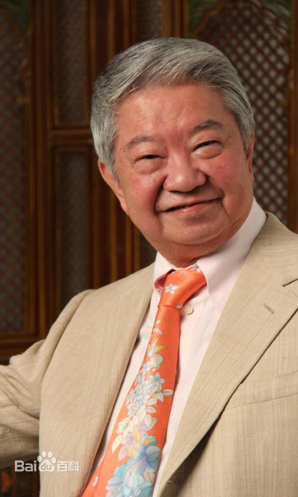

# 我决定活得有趣

又名：《活，该快乐着》

## 作者：

蔡澜，1941年8月18日出生于新加坡，祖籍广东潮州，电影监制、[美食家](https://baike.baidu.com/item/%E7%BE%8E%E9%A3%9F%E5%AE%B6/912849)、专栏作家、电影节目主持人、商人。与[金庸](https://baike.baidu.com/item/%E9%87%91%E5%BA%B8)、[黄沾](https://baike.baidu.com/item/%E9%BB%84%E6%B2%BE)、[倪匡](https://baike.baidu.com/item/%E5%80%AA%E5%8C%A1)并称为“[香港四大才子](https://baike.baidu.com/item/%E9%A6%99%E6%B8%AF%E5%9B%9B%E5%A4%A7%E6%89%8D%E5%AD%90)”，有“食神”美称。[1]

现任[世界华人健康饮食协会](https://baike.baidu.com/item/%E4%B8%96%E7%95%8C%E5%8D%8E%E4%BA%BA%E5%81%A5%E5%BA%B7%E9%A5%AE%E9%A3%9F%E5%8D%8F%E4%BC%9A)荣誉主席。中国美食纪录片《[舌尖上的中国](https://baike.baidu.com/item/%E8%88%8C%E5%B0%96%E4%B8%8A%E7%9A%84%E4%B8%AD%E5%9B%BD/9081375)》曾特邀蔡澜作为节目总顾问。

​	从14岁在《[星洲日报](https://baike.baidu.com/item/%E6%98%9F%E6%B4%B2%E6%97%A5%E6%8A%A5)》发表《[疯人院](https://baike.baidu.com/item/%E7%96%AF%E4%BA%BA%E9%99%A2/10338345)》开始，似乎就注定了此后蔡澜对工作价值的取向—拿到稿费他就带着一帮同学去吃喝玩乐。倪匡说“**蔡澜是少有背后没有人说他坏话的人**”，黄沾说“蔡澜是我最值得信赖的朋友”，金庸说“**论风流多艺我不如蔡澜，他是一个真正潇洒的人**”。“人生总是漂浮不定的，我们为什么能够稳住呢？好像船上有一个锚，我们有最传统的信条，就是很简单的，孝顺父母、守时、对朋友好。”蔡澜始终坚持答应朋友的事情一定做到，互相尊重，就能得到朋友的信赖。

​	蔡澜的潇洒背后并不是人们所看到的表面那样轻松，读书时为了能看懂外文电影，他上午读中文学校、下午读英文学校；他始终保持惊人的阅读量，“**如果一个写作人不喜欢看书，他就没资格做写作人**”。时至今日，他仍两袖清风，每天仍在为生活而努力：“我是很努力很努力做人，这样才有今时今日。”

​	很多人都问过蔡澜，电影人、美食家、商人，你究竟是做什么的？蔡澜说：“我只想做一个人，这并不容易。做人就是努力别看他人脸色，做人也不必要给别人脸色看，人与人之间要有一份互相的尊敬。所以我不管对方是什么职业，是老是少，我都尊重。

​	蔡澜见识广博，琴棋书画、酒色财气、吃喝嫖赌、文学电影，什么都懂。于电影、诗词、书法、金石、饮食之道，更可说是第一流的通达。（金庸评）[8]

虽魏晋风流，犹有不及。（倪匡评）[8]

​	他是同[金庸](https://baike.baidu.com/item/%E9%87%91%E5%BA%B8)、[黄沾](https://baike.baidu.com/item/%E9%BB%84%E6%B2%BE)、[倪匡](https://baike.baidu.com/item/%E5%80%AA%E5%8C%A1)齐名的“香港四大才子”之一，将美食家和商人的双重身份恰到好处地结合在一起，蔡澜做得比其他人都要成功。（商业评论网评）[10]

​	他的写作，以小品文见长；书法、篆刻、绘画都很了得；更将喜爱美食的天性发扬至极，开餐厅，当料理评审，甚至在1994年自创“暴暴茶”，也就是暴饮暴食之后，喝了就可以不必担心的茶，风靡香港和日本。（南方人物周刊评）

## 内容：

### 我决定活得有趣：

> 平稳的人生，一定闷。我受不了闷，我决定活得有趣。

本章主要阐述了作者的对人和对事的一些看法，和直接在烦闷的生活中，学习一些新的东西。

适当的放纵，会令人年轻很多。从诉说直接想做的事（各种天真），到烟，到宠物，到婚姻的态度（反对一夫一妻）。到逛菜市场。好朋友，始终要分开的。人老了，最坏的是什么事？是想起年轻时做过的事。**专注与热爱，方能再不同的行业创造奇迹**。里面有一段对话：除了睡觉和吃饭，我还喜欢做爱，蔡澜道：去拍小电影，拍得好，也能赚钱。

​	一世到底有多长？说久也很久，说快的话，像是昨天晚上的事。努力向前，必有收获。从今天起就把自己想法记录下来，这是达到愿望的第一步。乐观的人，运气好。

### 兴之所致地活着，才算精彩：

> 珍惜每一刻，应得的享受，把人生充分地活足了它。

说美人，说和女孩搭讪的技巧（表情绝对不能猥琐，衣着至少要干净，整齐，对自己要有一百分的自信，越得不到手越勇敢）

一夫一妻是一群性能力很弱的卫道者想出来的，他们连一个人也应付不了，所以创造出这个制度来保护自己。

说男人，当有男人味，说了用香水。然后对比男人和女人。

然后说自己拍戏的事情，和做制片人的体验。**当成玩的，什么事情都可以做**（和把时间当朋友，一样，快乐的事情才容易学到，痛苦的事很容易忘掉）。如何穿西服。穿衣服要穿自己喜欢的。男人的领带。且说了那些名人的穿着其实非常讲究和暗藏玄机。接着谈恤衫，开裆裤，内裤，喇叭裤，。

### 吃喝玩乐，才最有学术性：

> 一个人来到这个世界，要爱最可爱的，最好听的，最好看的，最好吃的，有趣的活着。

如标题，本章就是在谈吃喝。大吃大喝也是对生命的尊重。吃，也是一种学问。

说烟，男人的雪茄，即雪茄的好坏。

说酒，谈酒杯，喝酒，也是人生乐事。

喝茶，普洱茶作者的最爱。

### 江湖老友，多是传奇：

> 生命的长短是不受自己控制的，但生命素质的好坏，却是我们自己能够提高的。

本章作者谈论了，自己的一些老友和好朋友。

金庸的稀奇古怪。倪匡在他的每个时代，都玩的尽心尽力。至情至性黄露（下面是个沾），丁雄泉的放浪。陈宝珠小姐。董幕节先生。古龙和三毛（让我吃惊的发现了古龙和三毛的死）傻查地.雷。志峰兄，苏美璐，岛耕先生（老人与猫），棠哥，师兄绍灿，黄伯伯，然后作者就说了自己的一些家人。

​	本书结尾，以好友倪匡评价自己的文章结尾：

- 不拒一格降人才（头衔真的很多）
- 桃花潭水深千尺（好友非常多）
- 千金散尽还复来（花钱的态度）
- 众里寻他千百度（说的人生境界）
- 闲来无事不从容（处事态度）
- 最恨多才情太浅（对女人非常好）

**凡事都要试，不试，绝无成功可能，试了，成功和失败，一半一半机会**。

这个人生真的不错，真的好玩啊，有有两种想法，你如果是认定很好玩就好玩，你认为不好玩就不好玩。

年轻人，总要有点理想，总要有点抱负，总要有点想做的事情，要做的尽量去做吧。

那时候我二十多岁，但我必须要掌控全局，没有别的办法，就学，学完了以后从犯了很多错误开始，犯错误不是坏事情。

## 书引：

当一个人活得有趣，也就活得通透了，蔡澜先生不仅会吃，会玩，更会享受人生。把生命中的许多事情都简单一点思考，生活就会比较开心，多旅行，多阅读，多经历，对生活保持好奇，喜欢的事，加以研究，别的事情就不必理它，他说，平稳的人生，一定闷，我受不了闷，我决定活得有趣。

## 感悟：

从开始对作者不太熟悉的情况下读，我在想，这都写了些啥，吃喝嫖赌，文章中各种生活琐碎，这也能能出版成书，这不是毒害年轻人吗，随着慢慢的深入，和对作者慢慢的了解，人这么可以活的这么洒脱，文章怎么可以怎么潇洒？文章里面不仅让人看到蔡先生的处事态度和人生感悟，也看到了蔡先生对生活的热爱，吃喝玩乐。让人感叹，原来喝也是如此的洒脱。让人感触最深的，还是蔡先生的学习态度。不会就学。

​	年轻人，都去试试，做自己喜欢做的事，多学习，学自己想学的东西。以玩的心态去生活，去做事，去学习。

​	