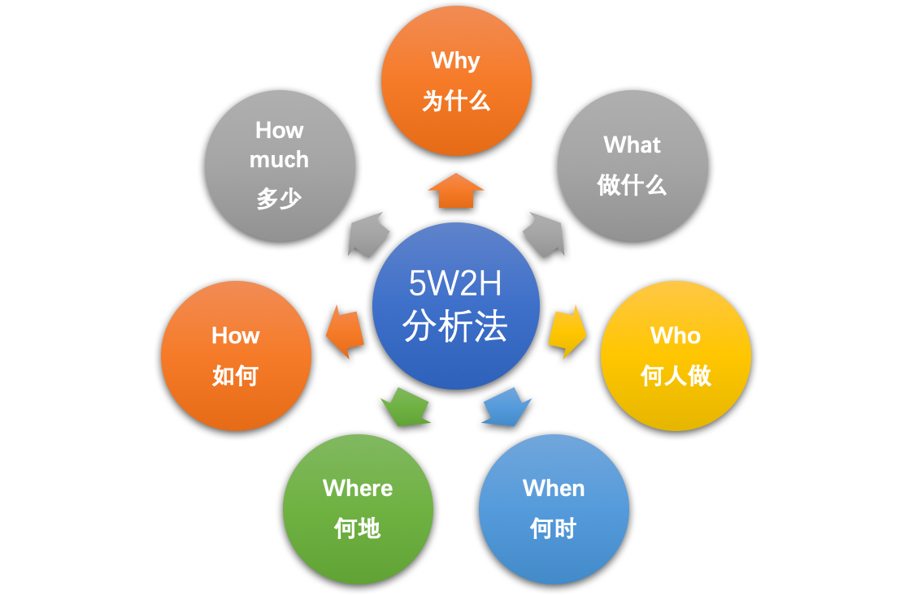
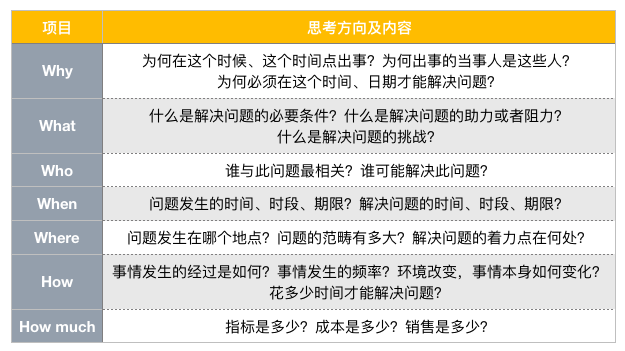
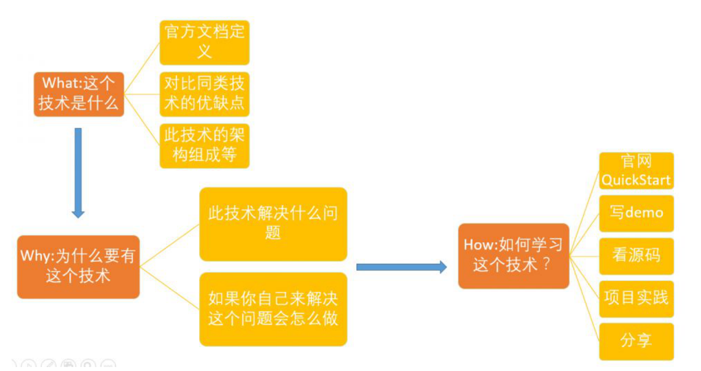
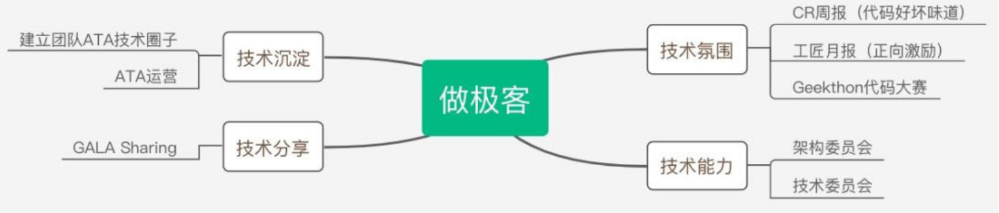
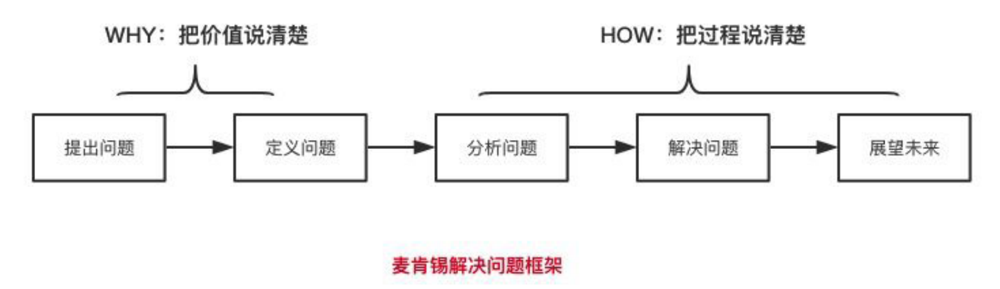

# 方法论汇总

https://www.zhihu.com/column/dream2riches

## 结构化思维

为什么？把话说清楚，把事情做的有条理。

结构化思维的定义就是：逻辑 +套路。

### 表达要有逻辑：

1）**演绎（因果）顺序**：“大前提、小前提、结论”的演绎推理方式就是演绎顺序。比如，经典三段论：所有人都要死，苏格拉底是人，苏格拉底要死。

2）**时间（步骤）顺序：**“第一、第二、第三”，“首先、然后、再者”等，很多的时间顺序同时也是因果顺序。

3）**空间（结构）顺序：**“前端、后端、数据”，“波士顿、纽约、华盛顿”，化整为零（将整体分解为部分）等都是空间顺序。

4）**程度（重要性）顺序：**比如“最重要、次重要、不重要”等。

### 做事要有套路：

#### 5W2H 分析法则

Why（为什么）、What（做什么）、Who（谁来做）、When（何时）、Where（何地）、How（如何做）、How much（多少）

#### 技术攻击图

### 如何进行结构化思考

#### 1）建立中心

建立中心也就是要定义清楚要解决的问题，要明确目标；

1. 自上而下：适用于问题比较明确的情况，我们只需要找到问题的核心要素即可，然后进行展开即可。

2. 自下而上：对于问题不够明确的情况，我们需要对多种杂乱的内容，进行分类、剪枝、归纳汇总成一个中心。

#### 2）结构化分解

参照表达逻辑，即演绎顺序、时间顺序、空间顺序和程度顺序进行思考。

### 打造极客文化

空间顺序：

时间顺序：

### 麦肯锡问题解决框架：

提出问题，定义问题，分析问题，解决问题，最后是展望未来

PS：如何做晋升述职，1）罗列事情，2）价值的背后 ==》参照上面的框架。

## 工程师思维

### 1）产品思维

产品思维的起源是用户（或客户）价值。用户价值是通过技术手段以产品或服务的形态去解决用户的痛点，或带去爽点。

### 2）技术思维

技术思维的源头是需求。需求可以分成市场需求、系统需求、特性需求等不同层次，回答的是技术层面“做什么”的问题。

### 3）工程思维

工程思维的起点是流程。流程的背后是科学，以既定的步骤、阶段性的输入 / 输出去完成价值创造，通过过程控制确保最终结果让人满意。

## 思考力

### 1）原理性思维：

找出知识背后的原理

1. 首先，对你可能用到的领域知识，建立一个基本的概念。看书，看文章，找行业资深的人去聊，都可以得到。
2. “多问一下为什么”，并一直“刨根问底”。
3. 了解了原理以后，在实践中运用一下，这样你对这个原理的理解就会非常深刻，并且你知道如何去运用这原理。
4. 如果这是一个非常重要的原理，建议大家如有余力去结合经典的书籍系统化学习。

### 2）结构化思维：

构建自己的知识树

1. 一定要总结出自己的知识树，而不要盲从书本上的或者别人的，为什么呢？一是因为人的思维速度和习惯、技能有一定差异，不一定每个人都是一样的；二是如果没有内化别人的知识成为自己的知识，这棵树不太能够很熟练地运用；

2. 习惯性总结，做完任何一个事情，都习惯性地回顾一下，往自己的树上面挂新东西，这个是构建知识树的必备手段，这个总结不需要花很多时间，比如做完事情后花个几分钟回顾一下就可以，但是需要坚持；

3. 推荐一个很常见的工具：xmind，把自己的树记录下来；

4. 训练自己的思维习惯和做事方式变得结构化，当你做事情的时候，习惯性用树的方式推进，强迫自己按照这个方式来。

### 3）扩展性思维：

扩展性思维的核心目标是提升我们思维的广度，也就是让我们的知识树变得更加开阔；

1）举一反三：解决同类型的 N 个问题

2）寻求更多的可能性：拓展解决问题的不同手段

### 4）抓重点思维：

抓重点思维要解决的场景是：

1. 如果每件事情都按照知识树方式做，效率可能不会特别高，有更快的办法么？

2. 在对外沟通表达的时候，要表达核心思想，否则别人会很难理解你的表达内容；比如大家再晋升答辩、项目汇报的时候一定会有体会。

注：归纳法，优先级法

### 5）反思性思维：

反思性思维是提升知识质量和深度的一个关键能力。因为只有不断反思才能让下一次在上一次基础上升级，而不是重复循环。

1. 反思性思维最重要的意识：**做事情的过程总有优化的空间，每次都要有进步**；如果没有这种心态，那么很难持续地进行反思；

2. 反思是一种习惯和潜意识，可以在不经意之间经常进行，其实不需要很形式化地花很多时间，有时候做完一个事情，习惯性思考一下就可以。

### 实践

#### 1）意识觉醒

意识觉醒是提升思考力最重要的一个点，我认为。只要形成了这种意识，就已经成功了一半。

#### 2） 保持信心

只要掌握了正确的方法并坚持训练，思考力绝对可以提升。

#### 3）空杯心态

思考的过程其实是对人的知识进行不断刷新和重构的过程，这里一定要保证空杯心态，**对新的环境，新的理念，新的技术持开放态度，否则就是自己给自己制造阻力**。

#### 4）思考的时间从哪里来？

1）利用碎片时间，比如上下班路上的时间，吃饭的时候，可以把刚才或者今天的事情想一想，想通了，然后定期汇总一下就可以；

2）抓住工作的过程，注意，每次每次出技术方案，优化代码，排查问题，处理故障，准备晋升……都是一次训练的机会，在做事情的过程中就可以思考并快速实践。

#### 5）思考力提升有没有什么判断标准？

广度、深度、速度

## 认知升级

认知升级是连接，连接优秀的思维方式，连接解决问题的最短路径，连接一切优秀的方法。

重点：首先要自我意识到问题，然后采用一些思维方式强化解决。

### 1）思考脑和反射脑

思考脑管理性，反射脑管直觉，存储脑管记忆，直觉依赖习惯，用直觉做出反应，快速，但未必正确；思考脑管理性，理性依赖逻辑，缓慢，但更加正确。

专注输入：做到只字不差地阅读，只字不差地听。

专注输出：定期做 PPT 进行分享。

所谓直觉反射就是通过大量的逻辑反复训练，提升自己的直觉准确性，从狭窄的 5% 进入广阔的 95%；

### 2）习以为常

曾经，我也一直被困在电子设备这个囚笼里，好长时间无法改变这个习惯模式，难改变是因为一旦进入习惯模式，大脑的活跃程度急剧下降，不再参与决策，进入休眠状态，此时我们的行为由习惯支配。我对这种现代化的生活方式最大的感受：浏览信息的时间多了，自己思考和琢磨的时间少了，专注在无效事情上的时间多了，专注在自我成长上的时间少了。

认知变化后，能否把学习，阅读变成习以为常的事情，关键在于能否意识到突发状况，并在这些突发状况下调整自己的行为。

所谓改变习惯就是在触发条件发生进入下一个行为时，让自己做对选择题。

### 3）时间管理：三八理论

时间管理三八理论：每个人每天有公平的 24 个小时，第 1 个八小时用于睡觉、第 2 个八小时用于工作、第 3 个八小时用于自由支配，但人与人的差距主要是由第 3个八小时决定的，第 3 个 8 小时用于消费、交易还是投资有着非常大的人生差别。

所谓时间管理就是找到不被打扰的时间用于投资自己的成长。

### 4）最重要的财富：注意力

生活中有很多看似合理的生活现象，其实是一个巨坑，是别人在收割我们注意力变成流量产生了商业价值，但是我们竟然乐在其中，因为我们喜欢莫名其妙凑热闹，喜欢随大流，喜欢做大家正在做的事情，我们每天花了大把时间在上面，但是收获的成长却很少，因为我们都是在消费时间，消费注意力，而不是用时间投资自己成长。

“为什么看电影注意力特别好，做正事注意力集中不了”。

首先接受这个现实，医学上把这叫作**注意力缺失症**，基本所有人都有这种毛病，因为做正事比较枯燥、困难，让人不舒服，集中不了注意力，逃避很正常！

其次找到改善方法，我通常这么做，给自己准备一个笔记本或 Evernote，边读边思考，顺带把重要的观点记录下来，开始会觉得很困难，但是慢慢坚持下来你会发现，思考会越来越深入，注意力集中时间越来越长。或者练习只字不差的阅读，在练习过程中因为只字不差会让自己更认真地去理解内容的逻辑关系，从而达到提升注意力的目的。

所谓提升注意力就是专注在目标事务上，直到产出预期的结果。

### 5）拿结果手段：执行力

我也经常要求自己提升执行力，但一段时间后就主动放弃，后来我想通了一件事：每个人身体内至少有多个角色，从认知的角度来看，有两个角色，一个是**投资者**，投资自己的成长；另外一个是**消费者**，消费自己的时间和注意力，很少关注自己成长。

我们一生一直在扮演这两个角色，互相博弈，成长者获胜持续成长，消费者获因为消费者在消费时间和注意力去刷朋友圈、看新闻娱乐，做大家正在做的事情，感觉找到了归属感，安全感，大脑能立马获得及时的奖励，而大脑又是控制我们思考和行为，一旦消费者占领了大脑，也就控制了我们日常的思考和行为。胜原地踏步。

“想明白，然后一步一步做下去”，如果想不明白，根本谈不上执行力。同时提升执行力的时候，还需要自律，通过自律让执行力得到持续，要相信持续投资自己的成长，可以实现“慢慢来，成长最快”的复利效果

执行力就是想明白，然后一步一步做下去。

### 6）贵人

一是，自己不自信，不相信自己能够影响他人，导致缺乏主动沟通，长期沟通，沟通的延续性和习惯没有建立。

二是，自己心态问题，自己的心态若是不够积极正向，没有贵人敢进入你的思维空间，因为价值观不匹配，很难形成认知共识。

三是，职场原因，很多时候可能你的老板就是你的贵人，但是因为职场，因为上下级，碍于面子，碍于工作，不敢多交流，多请教。

四是，贵人来了又走了，有贵人帮你改变，帮你进步，但是自己不努力，抱着过去做事的心态和方法在职场上浪迹天涯，进步不明显，否定了他作为贵人的价值和意义。

贵人就是可以持续陪你输出高质量的人。

### 7）会议

会多不一定是坏事，反而可能成为你训练思考，训练总结归纳，训练逻辑表达的地方

参与会议讨论就是在模拟机器学习，通过正反馈来优化自己的逻辑和观点。

### 8）跳出舒适区

为什么感觉看了那么多的书，工作了那么多年，写了那么多代码，自己在一开始的进步明显后，到现在基本停止进步？我想是因为在舒适区呆的太久了，看再多的书，写再多的代码，可能只是以一种舒适的方式进行工作和生活而已，这种舒适方式一直没有被很多人认识到，等回头反思的时候发现做了很多事，看了很多书，但成长的预期和现实不符。

心理学家把我们可能面对的学习内容分成了三个区，分别是**舒适区、学习区和恐慌区**。舒适区太容易，待太久了，总想跳出去看看。恐慌区太难，太难带来恐惧，就像梁宁在产品思维中讲同理心时，**恐惧会产生束缚也会产生动力，就看安全边界有没有被侵犯，如果无法战胜挑战，恐惧就产生了束缚**，退回到舒适区。所以跳出舒适区，不是说跳到恐慌区，而是跳到两者之间的学习区，在学习区中达到困难和能力的平衡状态

跳出舒适区就是进入学习区，平衡挑战和技能从而达到心流体验

### 9）职业规划

所谓职业规划，就是工作能力提升。

### 10）时间换空间

时间换空间，还有另外一种认知的说法：“慢慢来，持之以恒，成长最快”。不管哪种说法，其实是在告诉我们，成长无法急于求成，无法急功近利，唯有每日在不被打扰的时间中不断投资自己，通过不断输出确认自己成长上的不足，循环弥补不足之处。通过把自己逼近成长临界点，然后跨过临界点的那一刻，自己立马可以体会到自己的变化，自己的成长。

所谓时间换空间，就是让我们无法看清未来是什么样子的时候，把注意力聚焦在当下，做成长该做的事。

所谓时间换空间，就是慢慢来，持之以恒，成长最快。

### 5秒法则

心理学家梅尔·罗宾斯在大学时懒散拖沓，甚至因为拖欠学科论文，几次收到退学警告。

为了顺利毕业，梅尔决定每天6点去图书馆补写论文。

然而每当闹钟响起，她脑海总会浮现各种不起床的理由：昨晚失眠、身体不好、早上还有其他事……

直到有天，她看到火箭发射时的转播录像，当播报员从5数到1时，火箭立刻点火升空。

次日清晨闹铃再次响起时，梅尔也试着在心中倒数5秒，在数到1的瞬间立刻起床。

“**倒数5秒后立刻行动，就是不给恐惧、犹豫、惰性等情绪以反应的时间**。

我们只有从这些负面情绪中解脱，才能真正成为自己的主人。”

奥斯卡最佳影片《绿皮书》里，有一句经典台词：

“**太多对生活失望的人，都不敢走出第一步。**”

### 慢马定律

两匹马各自拉着一辆货车，陪主人去远行。

其中一匹马十分实诚，一路上艰难而卖力地走着；另外一匹马则跟在后面慢悠悠地晃着。

主人嫌慢，就把第二匹马拉的货物搬了一些到第一匹马的车上。

慢马看了很高兴，走了一会，脚步故意放得更慢了。

后来，主人干脆就把它拉的货物全都搬到了快马的货车上。

浑身轻松的慢马暗自得意地想：“它真傻，这么卖力活该被折磨，看我现在多舒服！”

可主人却觉得：“既然一匹马就能拉车，我干嘛还要养两匹呢？”

没多久，慢马就被卖给了屠宰场。

**如果你可有可无，没有实实在在的价值，那么你离被抛弃的日子就不远了。**

**总想待在舒适区，是对自己未来的凌迟；放弃成长，将是人生最大的风险。**

**一个人，唯有不断地学习升级，才能牢牢把握自己的生活**。

生活中，有很多这样的人：**看上去勤奋踏实，可升职加薪永远无望**。

这往往源于他们只愿意待在自己熟悉的一亩三分地上耕耘，**每天重复同样的工作，从不抬头看看这世界的风云变化**。直到有一天，看着同龄人远超自己，才意识到危机。

**“你混日子，就是日子混你，最后的输家是你自己。”**

人生如逆旅，不折腾就倒退。

**人生本就充满了不确定性，放弃成长，只能在风险来临时，束手无策、心慌焦虑。**

1）保持好奇心

2）利用15分钟热度，快速启动

3）坚持复盘

4）见贤思齐，向上社交

互联网时代，想要找到老师并不困难。周围有优秀的同行前辈、书店里有名人传记，网上有付费课程、讲座。做个有心人，总能链接到你的教练。登高山方知天之高；临深渊，可知地之厚；见圣人，方知己之目浅识短。行走在提升自己的路上，我们需要向前、向上寻找。

### 五星笔记法

1）预判对方要讲的核心内容是什么，为什么这个内容值得讨论？

2）记录对方讲解的逻辑是什么？

3）这次讨论中，我有什么疑问和启发？

4）对方的做法、想法或者给我的启发点，可以提炼为哪些有效策略（思维模型）？

5）这次讨论中给我的启发，哪些可以立刻变成下一步的行动？我如何把它们运用到自己的生活里？

### 逻辑思维

任何事情都是  A ----> B ，有点因果论，但是将逻辑的因果论，明确目标或者结果，然后找到从A到B的路径，才是逻辑思维。