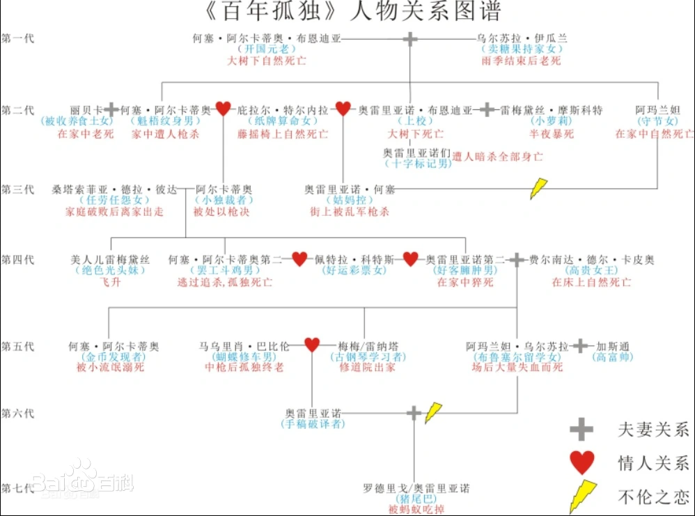

# 百年孤独

《百年孤独》，是[哥伦比亚](https://baike.baidu.com/item/哥伦比亚/22034?fromModule=lemma_inlink)作家[加西亚·马尔克斯](https://baike.baidu.com/item/加西亚·马尔克斯/691007?fromModule=lemma_inlink)创作的长篇小说，是其代表作，也是拉丁美洲[魔幻现实主义文学](https://baike.baidu.com/item/魔幻现实主义文学/8309367?fromModule=lemma_inlink)的代表作，被誉为“再现拉丁美洲历史社会图景的鸿篇巨著”。

作品描写了布恩迪亚家族七代人的传奇故事，以及[加勒比海](https://baike.baidu.com/item/加勒比海/257070?fromModule=lemma_inlink)沿岸小镇马孔多的百年兴衰，反映了拉丁美洲一个世纪以来风云变幻的历史。作品融入神话传说、民间故事、宗教典故等神秘因素，巧妙地糅合了现实与虚幻，展现出一个瑰丽的想象世界，成为20世纪重要的经典文学巨著之一。

## 摘录

人们一派懈怠，而遗忘却日渐贪婪，无情地吞噬一点一滴的记忆。

无论走到哪里，都应该记住，过去都是假的，回忆是一条没有尽头的路，一切以往的春天都不复存在，就连那最坚韧而又狂乱的爱情归根结底也不过是一种转瞬即逝的现实。

她辛苦多年忍受折磨好不容易赢得的孤独特权，绝不肯用来换取一个被虚假迷人的怜悯打扰的晚年

花雨在镇上落了一整夜，这静寂的风暴覆盖了屋顶，堵住了房门，令露宿的动物窒息而死。如此多的花朵自天而降，天亮时大街小巷都覆上了一层绵密的花毯，人们得用铲子耙子清理出通道才能出殡

她试图用眼睛去看那些本可以靠直觉看得更清楚的东西，于是开始频频出错。

他梦见自己走进一幢空空的房子，墙壁雪白，还因为自己是第一个走进这房子的人而深感不安。在梦中，他记起前一夜以及近年来无数个夜晚自己都做过同样的梦，知道醒来时就会遗忘，因为这个不断重复的梦只能在梦中想起。

幸福晚年的秘诀不过是与孤独签下不失尊严的协议罢了

过去都是假的，回忆没有归路，春天总是一去不返，最疯狂执著的爱情也终究是过眼云烟。

在人们的印象中，她似乎白天织晚上拆，却不是为了借此击败孤独，恰恰相反，为的是持守孤独。

这不过是一种发泄，因为事实上他们俩至死都没有分开，联结他们的是比爱情更坚固的东西：共同的良心谴责。

岁月流逝，她却永远停留在天真烂漫的童年，对各样人情世故越发排斥，对一切恶意与猜疑越发无动于衷，幸福的生活在自己单纯的现实世界里。

这是往昔的最后遗存，这往昔日渐衰落却不会彻底消亡，因为它是在自身之中无休无止地败落下去，每过一刻便向彻底灭亡更近一步，却永远无法抵达最后的终结。

只要没有死人埋在地下，你就不属于这个地方。

## 评论

人物关系的混乱确实浪读懂这部小说带来困难，看完没有什么多大的感触，只对里面的混乱人物关系和感到困惑。虽然贫穷，或者无知，但也不至于乱搞成这样。整体而言，没有读懂，没有发言权，看了网上很多解读，也没有触发那种思想。后面有机会再看吧。

