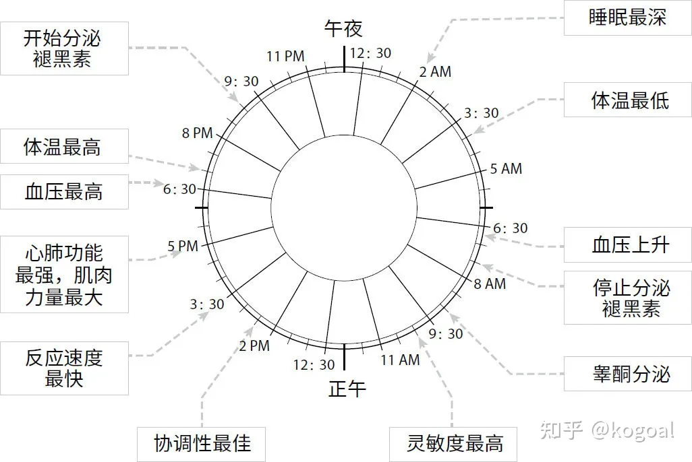
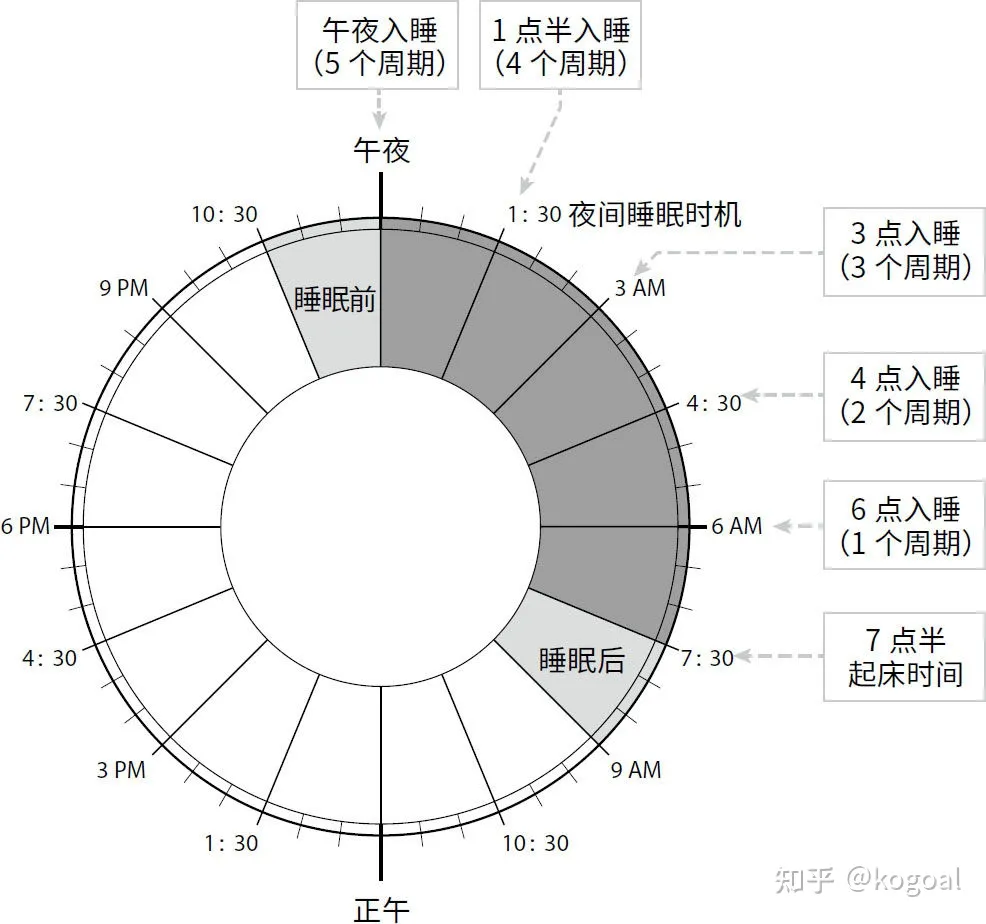

# 睡眠革命

**尼克·利特尔黑尔斯**，首屈一指的运动睡眠教练，英国睡眠协会前任会长，从事睡眠科学研究超过30年，所提出的R90睡眠方案，获得了体育界和商界顶尖专业人士的一致认同，被视为是获得高效睡眠的理想方案。

睡眠革命的核心思想是提出了R90睡眠周期的概念。睡眠周期 “R90”指的是以90分钟为一个周期，获得身体修复。用90分钟时长的睡眠周期衡量睡眠，而不是睡了多少小时。根据R90方案，我们把7天作为一个周期来观测睡眠状况，而不再着眼于一个晚上的睡眠状况。

https://zhuanlan.zhihu.com/p/409012621

睡眠革命的第一步是确定自己的起床时间，因为在固定的时间醒来，有助于大脑形成锚定，有利于我们树立信心，在生活中的其他方面更加灵活。 固定的起床时间就像一根铁锚，支撑着整个R90方案。我们应该设定一个固定的起床时间，并持之以恒地坚持下去。

下一步是根据你的起床时间和90分钟时长的睡眠周期，再回过头去计算一下，你应该在什么时候入睡。如果你和大多数人一样，希望每晚能获得大约8小时的睡眠，那就大致相当于每晚经历5个睡眠周期（等于7.5个小时）

这样每周你所拥有的睡眠周期，而不是每晚睡了几个小时。如果你每晚需要5个睡眠周期，你完全可以将每周获得35个睡眠周期，设为自己的目标。把睡眠放在更长一段时间中考虑，有助于减少不必要的压力。一个“没睡好的糟糕晚上”不会要了你的命，不妨试着去考虑，你每周一共获得了多少睡眠周期。 我们的目标是争取每周至少有4个晚上能获得理想的睡眠时间。尽量避免连续三个晚上睡眠不足（少于理想的睡眠周期）的情况发生。总体上，每周获得35个睡眠周期是最理想的（对于大多数人来说）

